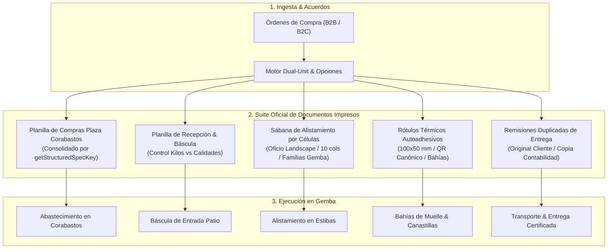
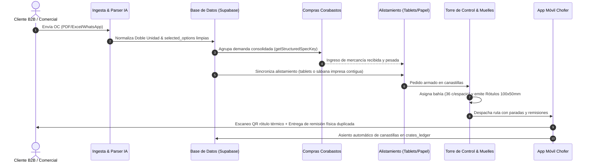

# FruFresco - Especificación de Arquitectura & Contrato de Negocio (SDD)
## Módulo de Pedidos: Pipeline Unificado de Ingesta (Manual vs Automático)

> **Versión:** 1.9.7 (Agrupación Vertical de Stock & UM por SKU con Columnas Reordenadas)  
> **Fecha:** 25 de Septiembre, 2026  
> **Estado:** 🟢 Aprobado & Activo en Contrato  
> **Área:** Dirección General, Operaciones, Abastecimiento & Compras Mayoristas Corabastos

---

## 1. Misión del Sistema & Principio de Equivalencia Operativa

### Propósito del Dominio
El Módulo de Pedidos de FruFresco centraliza la recepción, interpretación, valorización y programación logística de pedidos institucionales (B2B) y de hogares (B2C), independientemente de su canal de entrada.

### Regla de Dominio: Jerarquía Matriz vs Sucursales
> **«En clientes corporativos (HORECA, cadenas y grupos empresariales), el NIT pertenece a la persona jurídica matriz y es heredado por sus diferentes sedes. Sin embargo, los pedidos, la programación de despacho, la georreferenciación y la entrega física SIEMPRE se consignan y ejecutan a nivel de Sucursal. Por diseño, las validaciones de auditoría deben permitir y respetar esta relación sin generar fricción ni bloquear la operación cuando el NIT del documento coincida con la matriz pero la entrega se dirija a una sucursal específica.»**

### Principio Rector de Equivalencia Operativa
> **«Para el operador logístico, procesar una orden de compra recibida por correo electrónico es conceptual, visual y funcionalmente equivalente a procesar un archivo PDF/Excel subido manualmente. El resultado final en ambos mundos es invariable: un pedido oficial en estado `pending_approval` programado para la operación del día siguiente, con la misma fidelidad contable, fiscal y de cubicación física.»**

---

## 2. Mapa de Arquitectura: Pipeline Unificado

```
                             FUENTES DE ENTRADA
           ┌─────────────────────────┴─────────────────────────┐
           ▼                                                   ▼
   [MODO AUTOMÁTICO]                                   [MODO MANUAL]
   Inbound Webhook Email                               Carga de Documento / Formulario
   (/api/orders/email-ingest)                          (/admin/orders/create)
           │                                                   │
           ▼                                                   ▼
   order_drafts (Bandeja Borradores)                   Mesa de Trabajo / Staging Table
           │                                                   │
           └─────────────────────────┬─────────────────────────┘
                                     ▼
                      [CEREBRO LÓGICO COMPARTIDO]
                     src/lib/orders/order-parser-engine.ts
                     ├── Gemini 3.8 Flash (v3.0 / 2026, 1M context, integrated reasoning) with Obsolescence Sentinel & Contingency Cascade
                     │   ├── src/lib/ai/aiModelConfig.ts (Gobernanza Central & Centinela)
                     │   ├── Cascada Canónica: [gemini-3.8-flash, gemini-3.7-flash, gemini-3.5-flash, gemini-flash-latest, gemini-2.5-flash]
                     │   └── executeWithObsolescenceGuard (Failover 404/410 + Audit Log)
                     ├── resolveClientProfile (Multisede/NIT/Emails)
                     ├── findBestProductMatchDetails (Tokens + Catálogo)
                     └── document_learning_memory (Auto-Aprendizaje)
                                     │
                                     ▼
                     [MESA DE TRABAJO & RECONCILIACIÓN]
                     ├── Visor Polimórfico (ExcelTableViewer / PdfCanvas)
                     ├── Validación de Discrepancias Fila por Fila
                     ├── Detección de Tarifas de Contrato / Precios
                     ├── 🔄 Re-analizar con IA sin perder archivo
                     └── ➕ Agregar Ítem Manual en la Mesa de Trabajo
                                     │
                                     ▼
                          [PERSISTENCIA CANÓNICA]
                          orders (Cabecera) + order_items (Detalle)
                          status: 'pending_approval' | delivery_date: D+1
                          ├── Cálculo exacto de IVA (iva_rate por SKU)
                          ├── Cálculo exacto de peso total (total_weight_kg)
                          ├── ⚡ Confirmación Directa en 1 Clic
                          └── Rollback atómico en caso de falla parcial
```

---

## 3. Matriz Comparativa de Capacidades: Email vs Carga por Documento

| Capacidad / Feature | Ingesta por Email (`EmailDraftsModule`) | Carga de Documentos (`create/page.tsx`) | Estado de Paridad |
| :--- | :--- | :--- | :--- |
| **Visor de Archivos** | `ExcelTableViewer` interactivo + PDF Canvas | `ExcelTableViewer` interactivo + PDF Canvas | 🟢 Paridad Total |
| **Motor de Extracción IA** | `order-parser-engine.ts` | `order-parser-engine.ts` | 🟢 Paridad Total |
| **Memoria de Aprendizaje** | Escribe y lee en `document_learning_memory` | Escribe y lee en `document_learning_memory` | 🟢 Paridad Total |
| **Detección de Fecha Entrega** | Auto-asigna `deliveryDate` del documento | Auto-asigna `deliveryDateInDocument` con validación D+1 | 🟢 **Resuelto (Paridad 100%)** |
| **Flujo de Aprobación** | Aprobación en 1 Clic (`approve-draft`) | ⚡ Botón Inmediato en Mesa + opción Inyectar Carrito | 🟢 **Resuelto (Paridad 100%)** |
| **Cálculo Fiscal (IVA)** | Cálculo por ítem según `iva_rate` de cada SKU | Cálculo dinámico por ítem según SKU | 🟢 **Resuelto (Paridad 100%)** |
| **Cálculo de Peso (Kilos)** | Totaliza `total_weight_kg` para cubicación camión | Totaliza `total_weight_kg` para cubicación camión | 🟢 **Resuelto (Paridad 100%)** |
| **Re-parseo / Reintento IA** | Botón para forzar re-extracción con IA | Botón "🔄 Re-analizar con IA" en Mesa de Trabajo | 🟢 **Resuelto (Paridad 100%)** |
| **Agregar Producto Extra** | Botón "Agregar Producto" en la mesa | Botón "+ Agregar Ítem Manual" en Mesa de Trabajo | 🟢 **Resuelto (Paridad 100%)** |
| **Rechazo / Descarte** | Modal de rechazo con notificación email | Botón "Cancelar / Limpiar" | 🟢 Paridad por Diseño |
| **Transaccionalidad ACID** | Rollback de cabecera si falla detalle | Rollback atómico client-side si falla inserción | 🟢 **Resuelto (Paridad 100%)** |
| **Persistencia Documental (`document_url`)** | Vincula adjunto del borrador a `orders.document_url` | Sube a Storage y vincula a `orders.document_url` | 🟢 **Resuelto (Paridad 100%)** |

---

## 4. Resoluciones Técnicas Detalladas (Contratos SDD Cumplidos)

### ✅ DEUDA TÉCNICA 1: Auto-completado de Fecha de Entrega en Carga Manual
- **Implementación:** En `src/app/admin/orders/create/page.tsx` (`parseOrderWithAI`), cuando `data.deliveryDateInDocument` está presente, se normalizan múltiples formatos (`YYYY-MM-DD`, `DD/MM/YYYY`, ISO), se valida contra la fecha mínima de operación (`minDeliveryDate`), y se asigna a `setDeliveryDate` con un feedback visual claro vía `showToast`.
- **Criterio de Aceptación:** Cumplido. La fecha extraída por la IA ya no se pierde y el operador no tiene que seleccionarla manualmente a menos que desee modificarla.

### ✅ DEUDA TÉCNICA 2: Paridad Financiera e IVA en Aprobación de Correos
- **Implementación:** En `src/app/api/orders/email-drafts/approve/route.ts`, se consultan en lote los productos de la orden para obtener su `iva_rate`. Se calcula el impuesto individualmente con la fórmula canónica de FruFresco (`itemTotal * (rate / (100 + rate))`) y se persisten `subtotal`, `tax` y `total` consistentes contablemente con la DIAN y el modo manual.
- **Criterio de Aceptación:** Cumplido. La aprobación de borradores ya no quema `$0` en impuestos y coincide 1:1 con el modo manual.

### ✅ DEUDA TÉCNICA 3: Cubicación y Peso Logístico en Aprobación de Correos
- **Implementación:** En `src/app/api/orders/email-drafts/approve/route.ts`, se totaliza el peso en kilogramos (`total_weight_kg`) considerando la unidad de medida (`unit_of_measure`), factores para libras (0.5 kg) o el peso específico del SKU (`weight_kg`). Este valor se guarda en la cabecera `orders` y permite al módulo de transporte cubicar la capacidad de carga del camión (ej. 2000 kg o canastillas).
- **Criterio de Aceptación:** Cumplido. Los pedidos nacidos de correo ahora tienen cubicaje exacto.

### ✅ DEUDA TÉCNICA 4: Botón de Aprobación Directa en Mesa de Trabajo de Documentos
- **Implementación:** En `src/app/admin/orders/create/page.tsx`, se añadió la función `handleDirectConfirmOrder` y el botón `⚡ Confirmar y Crear Pedido Inmediato` en el footer de la Mesa de Trabajo. Sube silenciosamente el archivo a `order-attachments`, guarda la memoria de aprendizaje, crea la orden con `origin_source: 'document_upload'`, inserta los ítems, encola el correo de confirmación y redirige a `/admin/orders/loading`. Además, se conserva intacto el botón tradicional `Confirmar e Inyectar al Pedido` para no romper flujos previos.
- **Criterio de Aceptación:** Cumplido. Aprobación en un solo clic disponible para operadores experimentados sin sacrificar la inyección tradicional.

### ✅ DEUDA TÉCNICA 5: Resiliencia de IA: Botón de Re-intento de Extracción
- **Implementación:** En `src/app/admin/orders/create/page.tsx`, se incluyó el botón `🔄 Re-analizar con IA` en la cabecera de la Mesa de Trabajo. Si una lectura resultó incompleta o se desea re-ejecutar el análisis multimodal, el operador pulsa el botón y el sistema re-invoca `parseOrderWithAI(uploadedFile)` usando el archivo en memoria sin obligar a recargar la página ni a seleccionar el archivo nuevamente.
- **Criterio de Aceptación:** Cumplido. Resiliencia inmediata en la interfaz.

### ✅ DEUDA TÉCNICA 6: Capacidad de Agregar Productos Faltantes en Mesa de Trabajo
- **Implementación:** En `src/app/admin/orders/create/page.tsx`, se implementó `handleAddStagedRow` y el botón `+ Agregar Ítem Manual a la Mesa de Trabajo` al pie de la tabla de staging. Permite agregar una fila manual de forma inmediata, activar el dropdown de autocompletado y asociar un producto y cantidad sin tener que inyectar al carrito previamente.
- **Criterio de Aceptación:** Cumplido. Paridad ergonómica completa con el módulo de correos.

### ✅ DEUDA TÉCNICA 7: Transaccionalidad Atómica y Rollback de Órdenes Huérfanas
- **Implementación:** Tanto en `handleSubmit` tradicional como en `handleDirectConfirmOrder` en `src/app/admin/orders/create/page.tsx`, si la inserción en `order_items` experimenta un fallo o micro-desconexión, se ejecuta inmediatamente una compensación de rollback eliminando la orden recién creada (`await supabase.from('orders').delete().eq('id', newOrder.id)`), previniendo la proliferación de registros huérfanos en la base de datos.
- **Criterio de Aceptación:** Cumplido. Integridad referencial garantizada.

### ✅ DEUDA TÉCNICA 8: Trazabilidad y Propagación de `document_url` en la Aprobación de Correos
- **Diagnóstico:** Los pedidos creados por carga manual de PDF/Excel subían el documento al bucket `order-attachments` y guardaban la URL en `orders.document_url`, permitiendo que en `/admin/orders/loading` se mostrara el botón interactivo "Ver Anexo ↗". Sin embargo, en la ingesta por correo (`EmailDraftsModule` y `/api/orders/email-drafts/approve`), el archivo se almacenaba en `order_drafts.extracted_items[0].attachmentUrl` pero al momento de confirmar/aprobar el borrador hacia la tabla `orders`, el campo `document_url` se omitía (quedaba `null`), perdiendo el acceso visual al soporte original.
- **Implementación:**
  - En `src/components/EmailDraftsModule.tsx` (tanto en la confirmación directa `handleConfirmOrderDirectly` como en el modal de confirmación `onConfirm`), se extrae `draftAttachmentUrl` de los anexos del borrador (`metadata?.attachments[selectedAttachmentIndex]?.url || metadata?.attachmentUrl || metadata?.attachments?.[0]?.url`) y se asigna a `document_url` al insertar la cabecera en `orders`.
  - En `src/app/api/orders/email-drafts/approve/route.ts`, se recibe `documentUrl` del payload, o de forma reactiva y autónoma se consulta `order_drafts` para extraer el `attachmentUrl` de los metadatos de extracción, insertándolo en `orders.document_url`.
- **Criterio de Aceptación:** Cumplido. Cualquier orden originada por un documento (correo electrónico o carga manual directa) queda enlazada permanentemente a su archivo físico en `orders.document_url`, garantizando auditoría contable y despacho con visualización del anexo en un solo clic.

### ✅ DEUDA TÉCNICA 9: Enlace Directo «Abrir Original ↗» en Adjuntos de Borradores de Correo
- **Diagnóstico:** En los chips de adjuntos de `EmailDraftsModule.tsx`, el operador únicamente disponía de un evento de clic para conmutar el archivo dentro del visor integrado canvas, sin un acceso directo para abrir el PDF/Excel original en una pestaña nueva del navegador (`target="_blank"`), dificultando la impresión o el zoom nativo rápido.
- **Implementación:** Se incorpora en cada chip un botón de acceso directo con el icono `ExternalLink` apuntando a `att.url` con `stopPropagation()`.
- **Criterio de Aceptación:** Cumplido. El operador puede abrir el documento original en pestaña nueva de forma autónoma con 0% de alteración en la lógica de negocio.

### ✅ DEUDA TÉCNICA 10: Herencia Automática de Fecha de Entrega en Nuevas Filas de Mesa de Trabajo
- **Diagnóstico:** Al presionar `+ Agregar Ítem Manual a la Mesa de Trabajo` en `src/app/admin/orders/create/page.tsx`, la fila recién creada inicializaba sus campos de fecha en `null`, obligando al usuario a reingresar o recordar la fecha de entrega asignada en la cabecera.
- **Implementación:** En `handleAddStagedRow`, se inicializan `deliverySchedule` y `deliveryDate` con la fecha activa de la orden (`deliveryDate || minDeliveryDate`).
- **Criterio de Aceptación:** Cumplido. Cualquier ítem manual añadido a la mesa hereda de inmediato la fecha programada.

### ✅ DEUDA TÉCNICA 11: Higiene Estática de Tipos TypeScript en Componentes de Gestión
- **Diagnóstico:** Se identificó en `src/components/FinancialAdjustmentModal.tsx` una propiedad de estilo duplicada (`border: 'none'` y `border: '1px solid #E2E8F0'`) provocando el error de compilación `TS1117`, así como un cast estricto de tipo unión para novedades operativas (`handleItemNoveltyTypeChange`).
- **Implementación:** Se removió la clave redundante y se tipó formalmente el parámetro del select.
- **Criterio de Aceptación:** Cumplido. Build limpio y cero errores estáticos en el módulo.

### ✅ DEUDA TÉCNICA 12: Botón de Ordenamiento Alfabético A→Z en Interfaces de Entrada de Pedidos
- **Diagnóstico:** Las interfaces de ingesta manual (`orders/create`) y por correo (`EmailDraftsModule`) no ofrecían ningún mecanismo para reordenar los ítems extraídos del documento del cliente. El operador no podía identificar rápidamente duplicados ni navegar alfabéticamente cuando el listado era extenso.
- **Principio de Diseño:** El ordenamiento es estrictamente **visual/display-only**: el array subyacente (`stagedItems` / `editableItems`) conserva siempre el orden original del documento para preservar la integridad de índices y la lógica de edición/confirmación. El sort opera exclusivamente sobre una copia efímera en el momento del render.
- **Implementación:**
  - `src/app/admin/orders/create/page.tsx`: Estado `sortStagedAlpha` (boolean). Botón toggle **A→Z** verde esmeralda en el `<th>` «NOMBRE EN DOCUMENTO» de la Mesa de Trabajo. El tbody aplica `[...stagedItems].sort()` por `localeCompare('es')` cuando activo.
  - `src/components/EmailDraftsModule.tsx`: Estado `sortDraftAlpha` (boolean). Mismo botón en la columna «NOMBRE EN DOCUMENTO» del visor de borradores de correo. Idem lógica de sort sobre `editableItems`.
  - Ambos botones muestran un badge verde activo cuando el ordenamiento está aplicado; al pulsarlo nuevamente se restaura el orden original del documento.
- **Criterio de Aceptación:** Cumplido. Paridad total entre modo Manual y modo Email. El orden original del documento siempre es restaurable con un solo clic.

### ✅ DEUDA TÉCNICA 13: Gobernanza de Atributos: Separación Mutuamente Excluyente Web vs Alistamiento & Mapeo Operativo de Bodega
- **Diagnóstico:** En la Gobernanza de Variantes (Delta Command Center / `ManageAttributesModal`), los atributos solo contaban con el indicador `show_on_web`. El cliente requería distinguir categóricamente entre opciones orientadas al cliente final en la tienda web (ej. «Tamaño»: Grande, Mediano, Pequeño) y notas operativas exclusivas para el montaje interno de pedidos y bodega (ej. «Nota alistamiento»: Cero, Mediana, Richy), asegurando que ambas dimensiones fueran mutuamente excluyentes y que la sábana de alistamiento reflejara la nomenclatura técnica de Corabastos.
- **Principio de Exclusión Mutua:** Una categoría de atributos puede ser de Tienda Web (`show_on_web`) o de Alistamiento/Montaje de Pedidos (`show_in_picking`), pero **nunca ambas simultáneamente**. Al activar una en la gobernanza, la otra se desactiva de forma automática.
- **Mapeo Universal de Equivalencia Operativa (Traducción de Bodega):**
  - `Grande` $\longrightarrow$ **`Cero`**
  - `Mediana` / `Mediano` $\longrightarrow$ **`Mediana`**
  - `Pequeño` / `Pequeña` / `Richy` $\longrightarrow$ **`Richy`**
  - `Mini` $\longrightarrow$ **`Mini`**
  - `Jumbo` $\longrightarrow$ **`Jumbo`**
- **Implementación Técnica Full-Stack:**
  1. **Base de Datos:** Columna `show_in_picking boolean default false` en la tabla maestra `product_attributes_master`.
  2. **Gobernanza (`ManageAttributesModal.tsx`):** Checkboxes duales con lógica de exclusión mutua reactiva (`handleToggleShowOnWeb` y `handleToggleShowInPicking`) y persistencia en Supabase.
  3. **Catálogo & Variantes (`EditProductModal.tsx`, `CreateProductModal.tsx`, `VariantModal.tsx`):** Propagación de `show_in_picking` y `show_on_web` hacia `options_config` de los productos.
  4. **Tienda Web (`ProductDetailClient.tsx`, `QuickViewModal.tsx`):** Filtro que suprime cualquier atributo marcado como `show_in_picking: true`, mostrando exclusivamente opciones web (ej. `Tamaño`).
  5. **Panel de Montaje de Pedidos (`orders/create/page.tsx` & `EmailDraftsModule.tsx`):** En el modal de producto/variantes, se excluyen atributos web-only (ej. `Tamaño`) y se garantiza la disponibilidad de `Nota alistamiento` con sus valores oficiales.
  6. **Motor de Alistamiento (`src/lib/orderUtils.ts`):** Función canónica `normalizePickingNote` integrada en `formatStructuredSpecification`. Si un pedido llega desde la web con `Tamaño: Grande` o desde montaje con `Nota alistamiento: Cero`, en la sábana maestra de alistamiento (`alistamiento-print`) y en las hojas de picking (`contingency-print`) se imprime de forma uniforme la nota oficial de bodega: **`Cero`**, **`Mediana`**, **`Richy`**.
- **Criterio de Aceptación:** Cumplido. Paridad total, exclusión mutua verificada en UI/DB y traducción automática de calibres para el piso de picking en Corabastos.

---

## 5. Verificación & Conclusiones
- **Compilación:** Verificada con TypeScript (`tsc --noEmit`), garantizando cero errores en los componentes y rutas del módulo de pedidos.
- **Arquitectura:** Mantiene compatibilidad total hacia atrás (Non-destructive addition). Ambos métodos de entrada (Email y Carga Manual) operan ahora bajo los mismos estándares contables, operativos y de interfaz.

---

## 6. Gobernanza de Despliegue, Infraestructura Git & Resguardo de Producción

### Principio de Invarianza Operativa y Cero Riesgo
- **Ambiente de Producción Activo:** `https://frufresco-liard.vercel.app/` alimentado por la rama `liard` y sincronizado canónicamente con `main`.
- **Estrategia de Ramificación:** Se determinó mantener activas y sincronizadas al 100% las 7 ramas remotas (`main`, `liard`, `CORE`, `core`, `tenant-frufresco`, `tenant1`, `white-label`), garantizando que:
  1. No exista riesgo de desconexión o desconfiguración de dominios, variables de entorno o webhooks en Vercel.
  2. Todas las ramas apunten al mismo commit de referencia en cada entrega.
  3. No se elimine ninguna rama histórica, asegurando continuidad operativa absoluta.
- **Snapshot Inmutable de Seguridad (Git Tag):**
  - **Tag:** `backup-seguridad-arquitectura-20260921`
  - **Función:** Registro congelado en GitHub con paridad total y cero diferencias (`0 0`), protegiendo la base de código ante cualquier contingencia.

---

## 7. Módulo Comercial: Especificación de Arquitectura & Contrato de Negocio

> **Versión del Módulo:** 1.0.0 (Consolidado post Grill-Me Brownfield)  
> **Fecha de Entrada en Vigor:** 22 de Septiembre, 2026  
> **Estado:** 🟢 Aprobado & Activo en Contrato  
> **Ruta Canónica:** `/admin/commercial` | [http://localhost:3001/admin/commercial](http://localhost:3001/admin/commercial)  
> **Área:** Gestión Comercial, Finanzas, Compras y CRM B2B/B2C

### 7.1 Misión & Principio Rector Comercial
El Módulo Comercial de FruFresco gobierna la fijación estratégica de precios, la protección estricta del margen bruto operativo ante la volatilidad de Corabastos, la emisión de cotizaciones formales para prospectos/clientes y la congelación vinculante de tarifas mediante Acuerdos Comerciales auditables.

### 7.2 Jerarquía Canónica de Precios (6 Niveles de Prevalencia)
Cuando el sistema consulta el precio de un producto para un cliente o sucursal, debe evaluar en estricto orden descendente:
1. **Nivel 1 (Prevalencia Máxima - Acuerdo Sucursal):** Acuerdo Comercial Vigente (`quotes.status = 'agreement'`) asignado directamente a la sucursal (`client_id = sucursal.id`).
2. **Nivel 2 (Acuerdo Matriz):** Acuerdo Comercial Vigente asignado a la empresa matriz (`client_id = sucursal.parent_id`).
3. **Nivel 3 (Campañas Promocionales B2B):** Si el SKU no tiene precio congelado por acuerdo, aplican las campañas activas de precio fijo o ajuste porcentual (`commercial_campaigns`).
4. **Nivel 4 (Modelo Directo de Cliente):** Modelo de Precios asignado al perfil (`profiles.pricing_model_id`).
5. **Nivel 5 (Modelo Heredado Matriz):** Modelo asignado a la matriz (`profiles.parent.pricing_model_id`), o en su defecto `General Institucional` (`d90a91e5-827c-473d-9d4f-3e28c7c91e15`) si es cliente B2B.
6. **Nivel 6 (Base Catálogo / B2C):** Lista `Clientes Hogar` (`f7043ca1-94d5-4d25-bd10-fbf30ce120ee`) reflejada en `products.base_price`.

> **Regla de Inmunidad Contractual de Acuerdos:**  
> Los precios pactados bajo un Acuerdo Comercial formal representan un contrato vinculante. Por seguridad jurídica y protección del margen, **las Campañas Comerciales NUNCA alteran ni perforan los precios de productos que formen parte de un Acuerdo Comercial activo**. Las campañas solo modulan productos de catálogo o modelos no cobijados por dicho acuerdo.

> **Directiva de Invarianza en Ingesta de Pedidos (Borradores & Mesa de Trabajo):**  
> 1. **Precedencia Inviolable:** En cualquier módulo de ingesta o edición de pedidos (`EmailDraftsModule`, `orders/create`), la resolución de acuerdos debe buscar en primer lugar la sucursal (`client_id = branchId`) y solo si no existe, la casa matriz (`client_id = parentId`). Queda estrictamente prohibida la inversión de prevalencia `parent_id || id`.  
> 2. **Paginación Exhaustiva Obligatoria:** Dado el límite estricto de 1.000 filas de Supabase PostgREST, toda consulta masiva de listas de precios contractuales (`quote_items`) o modelos (`pricing_model_prices`) debe paginarse obligatoriamente mediante bloques de rango (`range(p * 1000, ...)`). Jamás se asumirá que una sola llamada REST contiene la totalidad de los SKUs de los clientes institucionales.  
> 3. **Resiliencia Reactiva Bajo Demanda:** Si un borrador de pedido se asocia a un acuerdo activo cuyos ítems no residan aún en la memoria caché del navegador (o hayan sido editados en tiempo real por el equipo comercial), el sistema debe disparar una consulta directa bajo demanda de los `quote_items` de ese contrato específico para garantizar que ningún SKU aparezca falsamente como `SIN PRECIO` ni asuma precios de catálogo público.

### 7.3 Contratos Matemáticos Canónicos (Reglas Inmutables)

#### A. Fórmula Oficial de Margen de Venta (Gross Margin)
Queda prohibido el markup multiplicador sobre costo en precios de venta institucionales. La fórmula oficial y vinculante es el **Margen Comercial sobre Venta**:
$$\text{Precio Unitario Antes de IVA} = \frac{\text{Costo Neto Efectivo}}{1 - \left(\frac{\text{Margen\%}}{100}\right)}$$
*Ejemplo:* Con Costo Neto Efectivo \$1.000 y Margen del 20%:
$$\text{Precio} = \frac{1000}{1 - 0.20} = \$1.250 \quad (\text{Margen real en P&L: } 20.0\%)$$

#### A.1 Factor de Merma Teórica en Costo Efectivo (GAP-02)
Para evitar pérdidas ocultas de entre 5% y 25% de margen bruto en perecederos de alto desecho (lechugas, fresas, hierbas, frutas delicadas), el costo base de adquisición se infla obligatoriamente por la merma teórica del SKU antes de aplicar el margen comercial:
$$C_{\text{efectivo}} = \frac{C_{\text{base}}}{1 - \left(\frac{\text{theoretical\_shrinkage\_pct}}{100}\right)}$$
*Ejemplo:* Con Costo Base \$1.000 y Merma Teórica del 15%:
$$C_{\text{efectivo}} = \frac{1000}{1 - 0.15} = \$1.176,47$$
$$\text{Precio Antes de IVA (con 20% Margen)} = \frac{1176,47}{1 - 0.20} = \$1.470,59 \longrightarrow \mathbf{\$1.500\text{ COP}}$$

#### B. Redondeo Comercial Colombiano
Todo precio unitario cotizado o tarificado antes de impuestos se redondea hacia arriba al múltiplo de \$50 COP más cercano:
$$\text{Precio Redondeado} = \left\lceil \frac{\text{Precio Unitario Antes de IVA}}{50} \right\rceil \times 50$$

#### C. Presentación Fiscal & Desglose de IVA
1. En cotizaciones (PDF, Excel, WhatsApp) y pantallas de negociación, el **precio unitario por SKU se presenta siempre ANTES de IVA**.
2. Los renglones identifican la tarifa de IVA aplicable (0% excluido para la mayoría de frescos, 5% o 19% para procesados/despensa).
3. El IVA total se calcula individualmente por ítem y se totaliza en el pie de la cotización (`subtotal_amount`, `total_tax_amount`, `total_amount`).

#### D. Vigencia Contractual Canónica de Cotizaciones (GAP-11)
Las cotizaciones institucionales y propuestas B2B poseen una vigencia vinculante estricta de **ocho (8) días calendario**. Queda prohibida la fijación o congelación de precios a 30 días en cotizaciones previas al acuerdo formal para salvaguardar la empresa ante la volatilidad de Corabastos. La vigencia en cabecera y en cláusulas legales debe coincidir exactamente en 8 días.

### 7.4 Reingeniería de la Matriz de Costos: Dos Caminos, Último Precio Real, Circuit Breaker & Pareto de Frescura

#### A. Filosofía de Transparencia y Abandono de Algoritmos Complejos
Queda estrictamente erradicado el uso de fórmulas de alisamiento predictivo o modelos de regresión temporal (Holt-Winters, medias móviles de 8 compras) para fijar el costo base de productos agrícolas. En alimentos perecederos y Corabastos, **el costo base es el último precio real pagado en báscula o cotizado en plaza**.

#### B. Los Dos Caminos Canónicos de Entrada
1. **Camino A (Compras / Operaciones):**
   - Precios registrados en el módulo de compras (`purchases` / `purchase_history_normalized`).
   - Se extrae siempre el **ÚLTIMO PRECIO registrado** de compra como referencia activa.
2. **Camino B (Carga Manual / Directa en Matriz):**
   - Modificación directa por el área comercial o importación masiva de Excel.
   - Genera la versión más reciente del costo y se convierte de inmediato en la **nueva realidad comercial**.

#### C. Poka-Yoke: Circuit Breaker de Volatilidad (+/- > 20%)
1. **Cálculo de Desvío:** Ante cualquier nuevo registro de costo (Camino A o Camino B), el sistema evalúa:
   $$\text{Variación\%} = \frac{|\text{Precio Nuevo} - \text{Costo Vigente Anterior}|}{\text{Costo Vigente Anterior}} \times 100$$
2. **Comportamiento si Variación $\le$ 20%:** El nuevo precio se adopta automáticamente como Costo Base Oficial.
3. **Comportamiento si Variación > 20% (Discrepancia Crítica):**
   - **Congelamiento de Seguridad:** El sistema **mantiene congelado el costo anterior** para proteger las cotizaciones y ventas en curso.
   - **Alerta Andon en Matriz Comercial:** Se levanta una alarma visual prominente de *«Alerta de Volatilidad (+/- X%) - Requiere Validación»*.
   - **Resolución Humana Obligatoria:** Exclusivamente el **Jefe / Dueño del Módulo Comercial** puede pulsar `[Aprobar Precio]` o `[Ingresar Costo Manual]`. La decisión humana queda asentada en `audit_logs` y define la nueva verdad del sistema.

#### D. Pareto de SLAs de Frescura por Frecuencia de Compra/Movimiento (Arazá vs Papa)
Para evitar la distorsión por densidad de masa (donde 70 toneladas de papa opacan 40 kilos de arazá o hierbas de alta rotación), el catálogo activo de 552 SKUs se clasifica dinámicamente en **Terciles de Frecuencia Transaccional** ($\sum$ de órdenes de compra y movimientos de inventario):

1. **Tercil 1 (T1 - Pulso Diario / Críticos):**
   - **Criterio:** Top 33% de productos con mayor frecuencia de compras registradas.
   - **SLA de Frescura:** **4 días calendario**.
   - **Vencimiento:** Pasa a estado `VENCIDO` si no hay compra ni cotización en > 4 días. Constituye una **Tarea Urgente Roja** en la bandeja comercial.
2. **Tercil 2 (T2 - Rotación Media):**
   - **Criterio:** 33% intermedio de recurrencia transaccional.
   - **SLA de Frescura:** **8 días calendario**.
   - **Vencimiento:** Pasa a estado `VENCIDO` en > 8 días. Revisión en la ronda semanal de abastecimiento.
3. **Tercil 3 (T3 - Baja Frecuencia / Catálogo Extendido):**
   - **Criterio:** 34% de menor frecuencia (o productos sin compras recientes).
   - **SLA de Frescura:** **15 días calendario**.
   - **Vencimiento:** Pasa a estado `VENCIDO` en > 15 días. Revisión quincenal de lista.

#### E. Gobernanza de Cotizaciones ante Costos Vencidos
1. El recálculo de precios no se ejecuta en línea de forma descontrolada; se administra de manera periódica.
2. Si un producto con costo vencido es incluido en una cotización comercial:
   - El sistema **utiliza el último costo autorizado vigente** para no paralizar la emisión de propuestas.
   - Genera una alerta interna para que el comercial coordine el cuadre de precio con el **Jefe Comercial**, quien tiene la potestad de autorizar el precio antes del cierre formal del acuerdo.

#### F. Costo Efectivo Inmutable (Factor de Merma Teórica)
Sobre el Costo Base adoptado (sea de Camino A o Camino B), se aplica siempre la fórmula canónica de protección contra merma:
$$C_{\text{efectivo}} = \frac{C_{\text{base}}}{1 - \left(\frac{\text{theoretical\_shrinkage\_pct}}{100}\right)}$$

### 7.5 Ciclo de Vida Canónico de Cotizaciones & Acuerdos

```
[PROSPECTO / CLIENTE] ──> [COTIZACIÓN DRAFT] ──> [SENT]
                                                    │
                   ┌────────────────────────────────┴────────────────────────────────┐
                   ▼                                                                 ▼
              [REJECTED]                                                        [ACCEPTED]
                                                                                     │
                                                                                     ▼
                                                                       [ACUERDO COMERCIAL FORMAL]
                                                                        status: 'agreement'
                                                                        start_date | valid_until
                                                                        ├── Congela precios en CRM
                                                                        └── Se inyecta en Pipeline
                                                                            de Pedidos (D+1)
```

1. **Principio de Acuerdo Obligatorio:** Toda cotización que un cliente aprueba se formaliza como un **Acuerdo Comercial** (`status = 'agreement'`) con fecha de inicio y de vencimiento (`valid_until`).
2. **Consumo Automático:** Al ingresar una orden de compra manual o por correo (`/admin/orders/create` o `/api/orders/email-ingest`), el motor de resolución de precios busca si el cliente o su matriz tiene un acuerdo comercial activo; si existe, sus precios congelados se asignan automáticamente a los ítems del pedido con máxima prioridad.

#### 7.5.1 Nomenclatura Canónica & Acompañamiento Visual de Acuerdos Comerciales / Listas de Precios
Para asegurar que todo acuerdo comercial cuente con una identidad explícita e inequívoca tanto para el equipo comercial como para el cliente institucional:
1. **Regla de Nomenclatura Automática Dinámica (`computeDefaultAgreementName`):**
   $$\text{Nombre del Acuerdo} = \text{[Razón Social / Nombre Comercial]} - \text{[DD-MM-AA]}$$
   *Ejemplo:* `Restaurante El Portal - 22-09-26` o `Acuerdo Multicliente - 22-09-26`.
   - El sistema autocalcula y autocompleta este valor en el formulario de creación en tiempo real al seleccionar el cliente o modificar la fecha de inicio del acuerdo.
   - Si el comercial desea un nombre personalizado, puede editar el campo de texto libremente; en caso contrario, se preserva el estándar corporativo.
2. **Persistencia Estructurada:**
   El nombre acordado se almacena de forma persistente en `quotes.model_snapshot_name` bajo el registro con `status = 'agreement'`.
3. **Omnipresencia en la Visualización:**
   El nombre resultante acompaña obligatoriamente todas las interfaces y documentos:
   - **Tabla Principal de Acuerdos:** Badge verde esmeralda junto a la razón social (`[Restaurante El Portal - 22-09-26]`).
   - **Drawer de Inspección Rápida:** Cabecera de la lista de tarifas congeladas.
   - **Documento Formal de Precios:** Encabezado unificado `Lista de precios [Nombre del Acuerdo] (X productos)`.
   - **Exportación e Impresión PDF (`AgreementDocumentModal`):** Título principal del documento contractual de tarifas.
   - **Ficha del Cliente (`ClientsModule`):** Indicador de `Modelo Base: [Nombre del Acuerdo]` con vigencia.
   - **Portal B2B del Cliente (`/b2b/dashboard`):** Título de la tarjeta de convenio vigente en la pestaña de Acuerdos cuando el cliente accede a realizar sus pedidos.

### 7.6 Matriz de Tareas Atómicas de Alineación (SDD Roadmap)
- [x] **Tarea COM-1:** Actualizar `src/lib/pricingUtils.ts` para que la función `recalculateAndSyncProductPrices` y `batchRecalculateAndSyncPrices` usen la fórmula canónica de margen sobre venta $\frac{\text{Costo}}{1 - M}$ y mantengan el redondeo a $50 COP antes de impuestos.
- [x] **Tarea COM-2:** Estandarizar `src/app/admin/commercial/quotes/create/page.tsx` para aplicar el redondeo a múltiplos superiores de $50 COP en el precio unitario antes de IVA y en variantes.
- [x] **Tarea COM-3:** Asegurar que la acción de aceptación en `quotes/[id]/page.tsx` priorice la formalización canónica hacia Acuerdo Comercial (`status = 'agreement'`) y registre el log de auditoría correspondiente en `audit_logs`.
- [x] **Tarea COM-4:** Verificar y blindar en `orders/create/page.tsx` y `EmailDraftsModule.tsx` la prevalencia estricta de Nivel 1 (Acuerdo Sucursal) sobre Nivel 2 (Acuerdo Matriz).
- [x] **Tarea COM-5 (Brecha 1):** Sustituir IVA hardcodeado en `activate-agreement/route.ts` por cálculo dinámico por producto (`item.matched_product?.iva_rate`), desglose por ítem y trazabilidad en `audit_logs`.
- [x] **Tarea COM-6 (Brecha 2):** Eliminar referencia a columna inexistente `target_price` en `commercial-parser-engine.ts` y aplicar la fórmula canónica de margen sobre venta $\frac{\text{Costo}}{1 - 0.20}$ con redondeo a $50 COP.
- [x] **Tarea COM-7 (Brecha 3):** Blindar la Inmunidad Contractual de Acuerdos: Las campañas comerciales modulan productos de catálogo libre, pero nunca perforan ítems pactados bajo acuerdo comercial activo.
- [x] **Tarea COM-8 (Brecha 4):** Diferenciar visualmente los acuerdos de Sucursal (`<Building />`) vs Matriz (`<Building2 />`) en el panel de Acuerdos Comerciales (`CommercialAgreementsModule.tsx`).
- [x] **Tarea COM-9 (Brecha 5):** Formalizar el contrato operativo del módulo de Facturación Comercial, Cortes AM/PM/ADJ y Cartera en la Sección 7.7.
- [x] **Tarea COM-10 (Brecha 6):** Conectar la acción por lotes en `cost-matrix/page.tsx` para autorizar costos del Motor Adaptativo (`calculateSmartCost` $\to$ `adaptivePricingEngine.ts`) con auditoría en `audit_logs`.
- [x] **Tarea COM-11 (Fase 1 / GAP-01):** Implementar interlock runtime `checkClientCreditStatus` en `orders/create/page.tsx` bloqueando pedidos que excedan `credit_limit` o tengan mora en `billing_invoices`, con excepción autorizada en `audit_logs` (`CREDIT_LIMIT_EXCEPTION_AUTHORIZED`).
- [x] **Tarea COM-12 (Fase 1 / GAP-02):** Incorporar factor de merma teórica (`theoretical_shrinkage_pct`) en `pricingUtils.ts` para costo efectivo $C_{\text{efectivo}} = \frac{C_{\text{base}}}{1 - (\text{Merma\%}/100)}$.
- [x] **Tarea COM-13 (Fase 1 / GAP-03):** Blindar fallback B2B para que SKUs sin acuerdo asignado consuman precios de General Institucional, evitando precios minoristas Hogar B2C.
- [x] **Tarea COM-14 (Fase 1 / GAP-07 & 08):** Corregir error PostgreSQL 42703 en campañas (`is_active`) y en clientes (derivación relacional de órdenes).
- [x] **Tarea COM-15 (Fase 2 / GAP-05):** Migrar `xlsx` a dynamic imports (`await import('xlsx')`) en los 4 módulos cliente, aliviando ~700KB por vista.
- [x] **Tarea COM-16 (Fase 2 / GAP-13):** Convertir inserción secuencial de facturación en lote atómico `supabase.from('billing_invoices').insert(...)`.
- [x] **Tarea COM-17 (Fase 2 / GAP-04 & 12):** Acotar historial de compras a 60 días en `cost-matrix/page.tsx` y memorizar `<Sparkline />` con `React.memo`.
- [x] **Tarea COM-18 (Fase 3 / GAP-09 & 10):** Retirar scrollbox rígido en acuerdos comerciales y corregir `position: fixed` a `position: absolute` en impresión de acuerdos para paginación continua.
- [x] **Tarea COM-19 (Fase 3 / GAP-11 & 14):** Unificar vigencia contractual a 8 días calendario y substituir emojis de texto por iconos Lucide.
- [x] **Tarea COM-20 (Fase 3 / GAP-15, 16, 17 & 18):** Toolbar *Frosted Glass* y cifras tabulares `text-right` en facturación, Sello de Garantía Operativa B2B, sincronización `payment_terms_days` a `profiles.payment_days` y supresión de páginas en blanco en PDF.
- [x] **Tarea COM-21 (Reingeniería Matriz / Dos Caminos):** Erradicar algoritmos de regresión/alisamiento e implementar regla del Último Precio Real (Camino A: Compras vs Camino B: Manual).
- [x] **Tarea COM-22 (Reingeniería Matriz / Circuit Breaker):** Implementar Poka-Yoke de Volatilidad (+/- > 20%) con congelamiento preventivo del costo previo y alerta visual para aprobación del Jefe Comercial.
- [x] **Tarea COM-23 (Reingeniería Matriz / Pareto de Frescura):** Implementar clasificación dinámica en 3 Terciles por frecuencia transaccional (T1: 4d, T2: 8d, T3: 15d).
- [x] **Tarea COM-24 (Reingeniería Matriz / UI & Filtros de Tercil):** Incorporar badges de tercil, chips de filtrado rápido (`[T1: Críticos]`, `[T2: Moderados]`, `[T3: Quincenales]`, `[Alertas >20%]`) y panel Andon priorizado.
- [x] **Tarea COM-25 (Acuerdos Comerciales / Nomenclatura & Visualización):** Implementar función `computeDefaultAgreementName` con formato `[Empresa] - [DD-MM-AA]`, persistencia en `quotes.model_snapshot_name` y visualización omnipresente en tabla principal, drawer lateral, documento de precios, PDF formal, ficha de cliente y portal B2B.

### 7.7 Módulo de Facturación Comercial, Remisiones y Cartera (Billing & Portfolio)

#### A. Cortes Operativos de Despacho (`billing_cuts`)
Para sincronizar la facturación con los despachos físicos de bodega, las remisiones y facturas se agrupan en **Cortes Operativos**:
1. **Corte AM (04:00 - 08:00 AM):** Despachos principales matutinos para apertura de restaurantes, clínicas y casinos.
2. **Corte PM (11:00 - 03:00 PM):** Segundo turno de entregas vespertinas y abastecimiento para turnos de cena.
3. **Corte ADJ (Ajustes & Notas):** Corte especial para registrar devoluciones en ruta, diferencias de báscula post-despacho o refacturaciones.
4. **Ciclo de Estados del Corte:**
   $$\text{open} \longrightarrow \text{processing} \longrightarrow \text{closed} \longrightarrow \text{exported (ERP/DIAN)}$$

#### B. Facturas y Remisiones (`billing_invoices`)
1. **Desglose Contable:** Cada factura se genera a partir de las cantidades reales despachadas (`picked_quantity`), desglosando base imponible (`total_base`), impuestos discriminados (`total_tax`) e importe total (`total_final`).
2. **Generación Atómica:** Se ejecuta una inserción en lote única `supabase.from('billing_invoices').insert(invoicesToInsert)` eliminando bloqueos de red y sobrecarga de conexiones concurrentes.
3. **Estados del Documento:** `pending` (generada) $\to$ `printed` (impresa con remisión de despacho) $\to$ `exported` (radicada en software contable) $\to$ `cancelled`.
4. **Estados de Cartera:**
   - `pending`: Documento vigente dentro de los días de crédito pactados (`payment_days`).
   - `paid`: Pago total registrado y conciliado con extracto bancario o caja.
   - `overdue`: Documento cuyo vencimiento (`due_date < now()`) ha caducado sin pago registrado.

#### C. Control de Cupo de Crédito & Bloqueo Comercial Runtime (GAP-01)
1. Todo cliente institucional B2B posee un cupo máximo de crédito (`credit_limit`) y plazo en días (`payment_days`).
2. Al momento de generar o confirmar un pedido en `/admin/orders/create` (tanto por ingesta directa de documentos como por carrito manual), el sistema evalúa en tiempo real:
   - **Deuda Pendiente:** Sumatoria de `total_final` de facturas impagas (`payment_status != 'paid'`) asociadas a los pedidos del cliente.
   - **Validación de Cupo:** Si $\text{Deuda Pendiente} + \text{Total del Pedido} > \text{credit\_limit}$.
   - **Validación de Mora:** Si existe al menos una factura impaga con `due_date < now()`.
3. Si se viola cualquiera de las dos condiciones, el sistema **bloquea la orden** y solicita confirmación de excepción comercial al usuario. Si se autoriza, se escribe un registro inmutable en `audit_logs` con la acción `CREDIT_LIMIT_EXCEPTION_AUTHORIZED`, salvaguardando la gobernanza de caja.
4. **Sincronización de Términos (GAP-17):** Al crear una cotización o formalizar un acuerdo comercial, el plazo `payment_terms_days` se sincroniza automáticamente al campo `payment_days` de la tabla `profiles`.

### 7.8 Estándar de Oro en Impresión PDF & Storytelling B2B (GAP-10, 11, 14, 16, 18)
1. **Paginación Continua:** Se erradica `position: fixed !important` en contenedores de impresión. Los documentos oficiales usan `position: absolute !important` con `@page { size: letter portrait; margin: 1.1cm 1.3cm 1.3cm 1.3cm; }`, repetición de cabeceras de tabla `thead { display: table-header-group; }` y `tfoot { display: table-footer-group; }`.
2. **Supresión de Páginas en Blanco:** Las vistas de impresión aplican `.page-break:last-child { break-after: avoid; }` para evitar hojas vacías al final del documento.
3. **Color Exacto:** Forzado de renderizado con `-webkit-print-color-adjust: exact; print-color-adjust: exact;`.
4. **Sello de Garantía Operativa B2B:** Toda cotización impresa o pública expone el sello institucional:
   - *Cero Intermediarios:* Abastecimiento directo de fincas y Corabastos.
   - *Puntualidad Suiza:* Despachos matutinos en ventana acordada antes de apertura de cocina.
   - *Cero Desperdicio:* Selección y pesaje exacto con merma controlada.

### 7.9 Rendimiento Full-Stack & Arquitectura de Datos (GAP-04, 05, 12, 13)
1. **Dynamic Imports:** Bibliotecas de procesamiento pesado (`xlsx`) se importan dinámicamente con `await import('xlsx')` exclusivamente al invocar funciones de carga o descarga.
2. **Proyección Exacta de Historial:** En la Matriz de Costos (`/admin/commercial/cost-matrix`), la consulta a `purchase_history_normalized` proyecta estrictamente sus 6 columnas canónicas (`id, product_id, unit_price, created_at, purchase_unit, normalized_price`), eliminando el error PostgreSQL 42703 y reduciendo la carga en memoria de ~30MB a ~200KB.
3. **Memorización de Componentes:** Componentes de alta densidad en bucles tabulares como `<Sparkline />` se encapsulan con `React.memo` para evitar re-renderizados durante la escritura en el buscador.

---

## 8. Módulo de Inventario: Balance Diario de Masa (24 Columnas), Kardex & Células de Trabajo

### 8.1 Misión del Sistema & Principio de Masa Cerrada
> **«El inventario de alimentos perecederos y abarrotes en FruFresco no es un conteo estático; es un balance dinámico de masa donde cada gramo que ingresa a bodega debe justificarse matemáticamente en una venta, un producto escaso, una merma documentada o un sobrante físico auditado. Ningún kilogramo desaparece del sistema sin un asiento transaccional en el Kardex.»**

### 8.2 Contrato de Reglas de Negocio (Consenso del Grill-Me Táctico)

#### Regla 1: Deducción de Inventario en Doble Fase (Reserva Comercial + Liquidación en Báscula)
1. **Fase 1 (Reserva al Aprobar):** Cuando una orden de venta pasa a estado `approved` (desde correo, documento o manual), el sistema **bloquea y compromete el stock estimado**. Esto permite a la Torre de Control y a Compras visualizar la demanda consolidada real para la jornada $D+1$.
2. **Fase 2 (Liquidación Física en Picking):** Cuando el operario pesa físicamente el producto en la báscula de picking (`picked_quantity`), se liquida la salida real contra `inventory_stocks`. Si el ítem es una presentación hija (ej. Bolsa 250g con `parent_id`), el descuento se redirige automáticamente al **Padre** mediante el factor de conversión:
   $$\text{Salida al Padre} = -(\text{picked\_quantity} \times \text{web\_conversion\_factor})$$
3. **Excepción de Calidad:** Si en báscula el producto se descarta por calidad (`quality_status = 'red'`), no se descuenta del inventario comercial y se enruta al flujo de merma.

#### Regla 2: Política de Stock Negativo Transitorio
1. Para evitar que la operación logística matutina (04:00 AM - 07:00 AM) se paralice cuando un camión descarga producto físico antes de que contabilidad radique la factura de compra, **el sistema permite transitoriamente existencias negativas**.
2. Los ítems con stock negativo se destacan visualmente con un semáforo rojo/ámbar en el panel directivo y en la Sábana, generando una tarea prioritaria para que Compras registre la entrada correspondiente.

#### Regla 3: La Sábana Oficial de 24 Columnas (Ecuación Canónica)
El balance diario oficial de FruFresco se rige por la **Ecuación Canónica de Balance de Masa**:
$$\mathbf{S} = \mathbf{E} + \mathbf{F} + \mathbf{G} - \mathbf{H} - \mathbf{J} - \mathbf{K} + \mathbf{L} - \mathbf{M} - \mathbf{N} + \mathbf{O} - \mathbf{P} - \mathbf{Q} - \mathbf{R}$$
- Si el Conteo Físico Auditado ($T$) es menor que el Inventario Calculado ($S$):  
  $$\text{Faltante (Col V)} = |T - S| \quad (\text{Pérdida neta de bodega})$$
- Si el Conteo Físico Auditado ($T$) es mayor que el Inventario Calculado ($S$):  
  $$\text{Sobrante (Col W)} = T - S \quad (\text{Mercancía física sin soporte contable})$$

#### Regla 4: Almacén Único Central y División Lógica por Células
Toda la operación converge en la **Bodega Central Única (Bogotá)**. Para efectos de responsabilidad y orden operativo, el catálogo se particiona estrictamente en **6 Células de Trabajo Autónomas**.

#### Regla 5: Gobernanza de Mermas con Evidencia Fotográfica Obligatoria
Cualquier operario o auxiliar puede registrar mermas en Col Q (Desperdicio) y Col R (Basura/Descapote). El descuento en inventario es **inmediato** para mantener el stock físico sincronizado en tiempo real, pero **exige evidencia fotográfica obligatoria (cámara/galería)** para que el Líder de Célula audite o impugne en la Sábana Diaria.

---

### 8.3 Matriz Canónica de las 24 Columnas (Diccionario de Datos Oficial)

| Col | Código / Campo | Título en Pantalla | Naturaleza | Fuente de Datos / Origen |
| :---: | :--- | :--- | :---: | :--- |
| **A** | `colA_date` | **Fecha** | ID | Fecha del corte (`balanceDate`). |
| **B** | `colB_idProducto` | **ID Producto** | Contable | `products.accounting_id` o `sku`. |
| **C** | `colC_inventoryGroup` | **Célula / Grupo** | Clasificación | `products.inventory_group`. |
| **D** | `colD_productName` | **Producto** | Catálogo | `products.name` oficial. |
| **E** | `colE_initialStock` | **Inventario Inicial** | Base | Reconstrucción retroactiva: $\text{Stock Actual} - \sum(\text{Deltas posteriores})$. |
| **F** | `colF_corrections` | **Corrección Inv.** | Ajuste (+/-) | `inventory_movements` con `type = 'adjustment'`. |
| **G** | `colG_purchases` | **Compras del Día** | Entrada (+) | Recepción de proveedores (`ref = 'purchase_reception'`). |
| **H** | `colH_salesKg` | **Ventas Día KG** | Salida (-) | Salidas comerciales de productos tarificados por Kg. |
| **I** | `colI_salesUnits` | **Ventas Día UN** | Salida (-) | Salidas comerciales de productos por unidades/bandejas. |
| **J** | `colJ_weightSalesUnits`| **Peso Ventas UN (KG)**| Salida (-) | Equivalencia o pesaje en báscula de las unidades vendidas. |
| **K** | `colK_shortage` | **Producto Escaso** | Salida (-) | Pedidos no despachados por falta de producto (`ref = 'shortage'`). |
| **L** | `colL_unshipped` | **Prod. Sin Enviar** | Entrada (+) | Pedido empacado que no salió y retorna a stock (`ref = 'unshipped'`). |
| **M** | `colM_additionalSales`| **Venta Adic. Cliente**| Salida (-) | Despachos de última hora no contemplados en corte (`ref = 'additional_sale'`). |
| **N** | `colN_employeeSales` | **Venta Empleado** | Salida (-) | Venta interna al personal con descuento de nómina (`ref = 'employee_sale'`). |
| **O** | `colO_returns` | **Devoluciones** | Entrada (+) | Rechazos en punto de cliente devueltos físicamente (`ref = 'route_return'`). |
| **P** | `colP_weighingWaste` | **Merma por Pesada** | Pérdida (-) | Descuadre acumulado por tolerancia de básculas (`ref = 'waste_weighing'`). |
| **Q** | `colQ_damageWaste` | **Desperdicio / Avería**| Pérdida (-) | Producto descompuesto con foto obligatoria (`ref = 'waste_damage'`). |
| **R** | `colR_cleaningWaste` | **Basura / Descapote** | Pérdida (-) | Limpieza de hojas, tallos o cáscaras con foto (`ref = 'waste_cleaning'`). |
| **S** | `colS_calculated` | **INVENTARIO CALCULADO**| Teórico | **$S = E + F + G - H - J - K + L - M - N + O - P - Q - R$** |
| **T** | `colT_physicalCount` | **Conteo Agregado** | Físico | Conteo físico ciego realizado en bodega (`ref = 'blind_count'`). |
| **U** | `colU_bodegaPost10am` | **Inv. Bodega Post-10AM**| Físico Final | $U = T + O$ (Conteo físico adicionando devoluciones de ruta). |
| **V** | `colV_missing` | **FALTANTE** | Descuadre | Si $T < S \implies \|T - S\|$ |
| **W** | `colW_surplus` | **SOBRANTE** | Descuadre | Si $T > S \implies (T - S)$ |
| **X** | `colX_foodBank` | **Banco de Alimentos** | Salida Social | Donaciones y producto entregado al banco de alimentos (`ref = 'food_bank'`). |

---

### 8.4 Métricas Industriales Lean & Tablero Directivo

1. **Valorización Monetaria:** $\sum (\text{Stock Físico (Kg)} \times \text{Costo Manual de Matriz de Costos})$. Si el ítem es hijo, hereda el costo del padre.
2. **Volumen en Toneladas (`formatVolumeTon`):** Totalización de masa en bodega para cubicación de espacio.
3. **IRA (Inventory Record Accuracy %):**
   $$\text{IRA} = \left(\frac{\text{Conteo Físico con Desvío } \le 2.5\%}{\text{Total de Ítems Auditados}}\right) \times 100 \quad (\text{Estándar de Excelencia} \ge 95.0\%)$$
4. **DOH (Days of Inventory on Hand):** Días de stock disponibles basados en la tasa diaria de consumo de los últimos 7, 15 o 30 días.
5. **Shrinkage Rate (Tasa de Merma Global):**
   $$\text{Tasa de Merma\%} = \frac{\text{Mermas Totales (Cols P + Q + R)}}{\text{Salidas Comerciales} + \text{Mermas Totales}} \times 100$$

---

### 8.5 Matriz de Células de Trabajo & Gobernanza Operativa

| ID Célula | Nombre Oficial | Icono | Grupo de Inventario Contable | Categorías | Líder Responsable |
| :--- | :--- | :---: | :--- | :--- | :--- |
| `cell_abarrotes` | Abarrotes, Frutos Secos, Lácteos & Carnes Frías | `boxes` | INVENTARIO DE ABARROTES, FRUTOS SECOS, LACTEOS Y CARNES FRIAS | ABARROTES, LACTEOS, CARNES | **CORONADO** |
| `cell_fresas` | Fresas & Moras | `apple` | INVENTARIO DE FRESAS Y MORAS | FRUTAS | **FRESAS** |
| `cell_frutas` | Frutas & Otros | `apple` | INVENTARIO DE FRUTAS Y OTROS | FRUTAS | **MENDOZA** |
| `cell_verduras` | Verduras | `carrot` | INVENTARIO DE VERDURAS | VERDURAS | **GALVIS** |
| `cell_hortalizas` | Hortalizas | `sprout` | INVENTARIO DE HORTALIZAS | HORTALIZAS | **LEAL** |
| `cell_papas` | Papas, Plátano, Tomate y Aguacates | `layers` | INVENTARIO DE PAPAS, PLATANO, TOMATE Y AGUACATES | TUBERCULOS | **BAUTISTA** |

---

### 8.6 Contratos Operativos Gemba & Cierre Diario (Resolución Grill-Me)

#### 1. Usabilidad & Navegación por Célula
- **Colapso y Filtro de Células:** Para mitigar la sobrecarga visual de las 24 columnas, la Sábana Diaria debe permitir al auditor/supervisor expandir, colapsar o filtrar de manera exclusiva una Célula de Trabajo a la vez (ej. ver únicamente "cell_fresas" o "cell_hortalizas").

#### 2. Protocolo de Cierre Diario y Congelación Contable
- **Botón Manual de "Cierre Diario Oficial":** La jornada contable no se congela por cron ciego; requiere la ejecución explícita del botón de Cierre Diario por parte del Administrador o Supervisor de Operaciones.
- **Congelación Estricta:** Al ejecutar el cierre, los registros de la fecha quedan en estado `locked` (congelados), bloqueando modificaciones retroactivas no auditadas salvo autorización de superadmin.
- **Traslado Automático de Saldos:** El **Saldo Físico Final (Col T / Col U)** de la fecha cerrada se traslada automáticamente como **Saldo Inicial (Col E)** de la jornada siguiente ($D+1$).
- **Trazabilidad:** Se registra en auditoría: `closed_at`, `closed_by_user_id`, `closed_by_name` y hash de verificación del balance de masa.

#### 3. Política de Desvío en Auditoría Cíclica: Tolerancia Cero (0%)
- Todo desvío entre el saldo teórico ($S$) y el conteo físico ciego ($T$) se computa y visibiliza de inmediato:
  - Sin márgenes ocultos de tolerancia que disfracen pérdidas o mermas.
  - Si $T < S \implies$ Registro transparente en **Faltante (Col V)**.
  - Si $T > S \implies$ Registro transparente en **Sobrante (Col W)**.

#### 4. Exportación a Excel (XLSX) de Grado Fiscal y Contable
- La exportación debe respetar estrictamente la estructura de las 24 columnas canónicas (A a X), agrupadas por Célula de Trabajo.
- Las columnas de balance y descuadre deben exportarse con **fórmulas nativas de Excel** (`=SUMA(...)`, `=E+F...`, etc.), acompañadas de una fila de totales matemáticos al pie para permitir la auditoría de revisoría fiscal y contabilidad.

---

### 8.7 Integración Inter-Módulos: Compras (`/ops`) ➔ Picking ➔ Inventario (Sábana Diaria)

```
       [SUBMÓDULO DE COMPRAS /ops/purchases]
                         │
      Comprador detecta que producto no existe en mercado
      Declara: "NO LO HAY" (Status: 'shortage')
                         │
        ┌────────────────┴────────────────┐
        ▼                                 ▼
 [MÓDULO OPS / PICKING]         [PLANILLA SÁBANA INVENTARIO]
 Flag visual de escasez         Se consigna en COLUMNA K
 Despachador ajusta remisión    (Producto Escaso)
 con picked_quantity real       Equilibra el balance de masa:
 Cliente solo paga lo pesado    S = E + F + G - H - J - K...
```

1. **Génesis de la Escasez en Compras:**
   - La escasez física no se inventa en bodega ni en la sábana; se origina en el **Submódulo de Compras de `/ops`**.
   - Cuando el comprador en central de abastos o proveedor reporta que el SKU está agotado (*"No lo hay"*), marca el estado oficial de escasez.
2. **Propagación a Operaciones (`/ops`):**
   - El estado de escasez se refleja inmediatamente en las listas de picking y alistamiento de pedidos, alertando a los operarios de báscula.
   - El operario liquida el pedido con la cantidad real empacada (`picked_quantity`), ajustando la remisión para que el cliente no pague faltantes.
3. **Imputación Directa en la Sábana:**
   - La cantidad no suministrada por falta de producto se consolida automáticamente en la **Columna K (Producto Escaso)** de la Sábana Diaria de Inventario, garantizando que el inventario teórico ($S$) no descuente ventas ficticias ni genere faltantes falsos en bodega.

---

### 8.8 Gobernanza de Acceso, Segregación de Funciones (SoD) & Protocolo Poka-Yoke Single-Write

#### 8.8.1 Principio de Inmutabilidad y Segregación de Funciones (Jefatura: Yina Cortés)
1. **La Sábana como Balance Oficial:** La pestaña de Balance Diario de 24 Columnas (`/admin/commercial/inventory`) representa el balance maestro contable, financiero y de masa de FruFresco. Por control interno (Segregation of Duties - SoD), **no es una hoja libremente editable**.
2. **Modo Estricto de Solo Lectura:** Para el 99% de los usuarios del sistema (comerciales, choferes, auxiliares de bodega, compras y visualizadores), la sábana opera en modo de **Solo Lectura** inviolable (cursor predeterminado, sin inputs interactivos ni capacidad de alteración directa de celdas).
3. **Poder de Edición Exclusivo de Yina Cortés / Superadmins:** Únicamente los usuarios con rol de administrador (`admin`, `sys_admin`) o específicamente la encargada de inventarios (**Yina Cortés**, identificada por credencial, correo o rol `inventory_manager`) disponen de permisos activos para:
   - Modificar celdas individuales en la sábana.
   - Realizar o reabrir el Cierre Diario Oficial de la jornada contable.
   - Registrar novedades directas (+ Merma, Nómina, Venta Extra).
4. **Huella Forense Obligatoria:** Todo ajuste manual autorizado en la sábana estampa en la bitácora transaccional (`inventory_movements`) el nombre del supervisor, la fecha/hora y la nota de auditoría: `[AJUSTE AUTORIZADO - Yina Cortés / Admin]`.

#### 8.8.2 Protocolo Single-Write Poka-Yoke en Piso (`/ops/inventory`)
1. **Captura Fisiológica Única (Conteo a Ciegas):** Para preservar la veracidad del inventario en piso, cuando un operario mide una estiba física e ingresa el dato en `/ops/inventory`, el sistema implementa **escritura única inmutable (Single-Write)**.
2. **Bloqueo Inmediato post-Guardado:** En cuanto se presiona `Enter` o `Guardar` (sea individual o en lote):
   - El SKU transiciona automáticamente a estado **`[Registrado y Bloqueado]`** con badge verde.
   - El input numérico pasa a `readOnly={true}` y `disabled={true}`, impidiendo que el operario altere o borre el dato para disimular discrepancias.
3. **Persistencia Transaccional Intradía:** El bloqueo persiste ante recargas de navegador o cambios de turno mediante consulta activa a `inventory_movements` con `reference_type = 'blind_count_shift_close'`.
4. **Desbloqueo Exclusivo por Supervisión:** Si existió un error tipográfico humano legítimo en piso, el operario no puede corregirlo de forma autónoma. Requiere la presencia de la supervisora de inventario (**Yina Cortés** o Administrador), quien dispone del botón exclusivo de `Desbloquear` para habilitar un re-conteo formal.

#### 8.8.3 Blindaje Inviolable de Fuentes Automáticas
1. Los cálculos de Compras (Col G), Ventas (Cols H, I, J) y Devoluciones de Ruta (Col O) se calculan por **agregación determinista SQL** a partir de los eventos operativos reales generados en `/ops/compras`, `/admin/commercial/billing` y `/ops/driver/delivery/[id]`.
2. Queda terminantemente prohibido que una modificación manual sobreescriba o destruya las transacciones originales del motor operativo.

#### 8.8.4 Arquitectura Dual: Sábana Oficial (Modo Vista) vs Hoja Manual (Modo Edición / Contingencia) & Toolbar Enterprise
1. **Segregación Estricta de Modos de Operación:**
   - **🔒 Sábana Oficial (Modo Vista / Auditoría):**
     - Destinado a consulta directiva, gerencial, comercial y de auditoría general.
     - **Inmutabilidad Absoluta:** Todas las celdas de las 24 columnas se comportan como estado de cuenta financiero estrictamente de solo lectura.
     - **Limpieza Visual Total:** Se ocultan todos los controles de taller o contingencia (`+ Merma`, `Nómina`, `Extra`, `Carga Masiva Excel`).
     - **Acciones Disponibles:** Selector de fecha, switch de modo, buscador, filtro de movimiento, `Exportar Excel` y `Cierre Diario` (o indicador `Cerrado`).
   - **📝 Hoja Manual (Modo Edición / Contingencia):**
     - Destinado exclusivamente a la Jefatura de Inventario (**Yina Cortés**) y Administradores para contingencias operacionales, ajustes masivos y correcciones de balance.
     - **Desbloqueo de Herramientas de Ajuste Operativo:** La barra superior activa el kit de recursos:
       - `+ Merma` (Cols P, Q, R): Registro de mermas por pesaje, desperdicio y descapote.
       - `Nómina` (Col N): Descuento de ventas a colaboradores para Talento Humano.
       - `Extra` (Col M): Registro de ventas mostrador no programadas.
       - `Carga Masiva Excel`: Simulación o ingesta por archivo `.xlsx`.
     - **Edición Inline de Celdas:** Permite afinar números fila por fila con navegación por teclado (`Enter`, `Tab`, `Escape`) y auto-selección de texto.
2. **Consolidación Ergonómica en 2 Líneas (Toolbar Enterprise):**
   - **Línea 1 (Master Bar - 38px):** Fecha con botón "Hoy", Switch de Modo (`Sábana Oficial` vs `Hoja Manual`), Buscador (#ID, @tag, texto), Filtro "Con Mov. / Todos", y acciones contextuales por modo.
   - **Línea 2 (Cell & Navigation Bar - 30px):** Filtros rápidos de células de trabajo (única fuente con conteos en tiempo real), toggle de densidad (`Expandir/Colapsar`, `A-D Compacto`), selector desplegable de navegación (`⚓ Ir a Bloque...`) y flechas de desplazamiento horizontal paso a paso.

---

## 9. Módulo de Operaciones (Ops): Trazabilidad Física End-to-End & Circuito Cerrado con Pedidos, Transporte e Inventario

### 9.1 Misión Operativa & Principio de Sincronía Gemba
El Módulo de Operaciones (`src/app/ops/`) es el ejecutor físico y el brazo logístico en tiempo real de FruFresco. Su misión es orquestar la transformación de las intenciones comerciales (`orders`) en flujos de masa tangibles (kilos, canastillas, vehículos y bahías de piso), alimentando de forma bidireccional y continua tanto el libro mayor de movimientos (`inventory_movements` - Sábana de 24 Columnas) como la liquidación y facturación electrónica oficial (`billing_invoices`).

---

### 9.2 Las 8 Estaciones de la Cadena de Valor Física

```
[PEDIDOS: orders / order_items] (status: 'approved' | 'para_compra')
       │
       ▼  (Corte 17:00 / 18:00 - Lanzamiento de Operación)
1. COMPRAS (/ops/compras)
   ├── Neteo Cross-Docking/JIT con Stock de Seguridad
   ├── Consolidación en procurement_tasks
   └── Declaración de Escasez ──► inventory_movements (ref: 'order_shortage' ──► COL K)
       │
       ▼
2. RECEPCIÓN & CALIDAD DE ENTRADA (/ops/recepcion)
   ├── Báscula de muelle y pesaje contra OC
   ├── Aprobación de entrada ──► inventory_movements (type: 'entry', ref: 'purchase_reception' ──► COL F)
   └── Excedentes no autorizados ──► Cuarentena in_process en weight_discrepancies
       │
       ▼
3. PLANIFICACIÓN DE TRANSPORTE (/api/transport/optimize & /confirm)
   ├── Google Maps Route Optimization API (Cubicación, Ventanas RFC3339, Descansos 45m, Cadena de Frío)
   ├── Asignación temporal de 150 Espacios Físicos (Bahías de Staging 1 a 150) sin traslape horario
   └── Impresión de Remisiones Carta Duplicadas (Original Cliente + Copia Archivo/Contabilidad)
       │
       ▼
4. ALISTAMIENTO EN CÉLULAS (/ops/picking & /terminal)
   ├── 6 Células de Trabajo (Abarrotes, Fresas, Frutas, Verduras, Hortalizas, Papas)
   ├── Pesaje y digitación de order_items.picked_quantity
   └── Rechazo de calidad en mesa (Botón Rojo) ──► Cuarentena in_process (ref: 'order_picking')
       │
       ▼
5. MONITOREO DE PLANTA (/ops/picking/dashboard)
   └── Airport Board en tiempo real: Detección de cuellos de botella y avance porcentual de ruta
       │
       ▼
6. RECTIFICACIÓN & PRECINTO LIFO (/ops/rectificacion/[routeId])
   ├── Checker audita cantidades físicas vs remisiones impresas
   ├── Certificación digital o fotográfica de planilla
   └── Sincronización oficial: routes 'rectified' ──► orders 'ready_for_dispatch'
       │
       ▼
7. TRANSPORTE & ÚLTIMA MILLA (/ops/driver/route & /delivery)
   ├── Conductor confirma cargue LIFO: routes 'in_transit' ──► orders 'in_transit'
   ├── Entrega física, firma digital y balance de canastillas en asset_movements
   ├── Cobro contra-entrega (Efectivo / Transferencia)
   └── Novedades en ruta ──► billing_returns ('pending_review') + customer_service_pqrs (RCA)
       │
       ▼
8. LIQUIDACIÓN DE PATIO & CONTROL DE CALIDAD (/ops/inventory & /admin/customer-service)
   ├── Retornos físicos del camión entran a Cuarentena de Patio en estado 'returned' (COL O)
   ├── Supervisor en /ops/inventory dictamina: Reingreso (available), Merma (waste_damage COL Q) o Donación (food_bank COL X)
   └── Control de Calidad audita remisión firmada con tachaduras ──► Aprueba billing_returns para Facturación
```

---

### 9.3 Contratos Matemáticos & Algoritmos de Operación

#### 1. Motor Canónico de Neteo en Compras (Cross-Docking / JIT - SDD v1.9.2)
FruFresco primero vende y consolida a la hora de corte (17:00 / 18:00) para comprar en Corabastos a las 02:00 AM, deduciendo el inventario disponible en bodega y aplicando el stock de seguridad del catálogo a través del motor centralizado `src/lib/procurement/procurementNettingEngine.ts`:

1. **Unificación Estricta de Características (`getCanonicalProcurementSpec`):**
   - Agrupa la demanda agregada de todas las órdenes por la clave canónica:
     $$\text{Clave Compra:} \quad \text{product\_id} + \text{"\_\_"} + \text{canonical\_spec}$$
   - **Regla Poka-Yoke Anti-Fragmentación:** No incluye cantidades individuales de pedidos de clientes (`"10 und"`) ni textos libres informales (`"bananos"`, `"1000 gr"`). Solo extrae calibres unitarios (`und de 2 kg`, `und de 160 gr`, `bandeja de 500 gr`) y atributos operativos reales (`Maduración`, `Corte`, `Punto`). Si no existen atributos estructurados, o si el atributo es redundante con el nombre (ej. `Maduro` en `Plátano maduro`), resuelve a `""` (Línea Estándar Base).
   - Las órdenes con idénticas características unifican su demanda sumando sus kilogramos netos (`normalizeDemandToKg`).

2. **Deducción Secuencial de Stock Físico por Familia Padre (`parent_id || product_id`):**
   - El stock disponible en bodega (`inventory_stocks`) se imputa secuencialmente: primero a la línea estándar base (`canonical_spec === ''`), y cualquier remanente a las variantes especializadas.

3. **Ecuación Canónica de Neteo & Stock de Seguridad:**
   - El stock de seguridad (`products.min_inventory_level`) es un amortiguador del producto base, aplicándose exclusivamente a la primera línea del grupo (`idx === 0`).
   $$\mathbf{Necesidad\ Bruta} = \sum \text{Demanda Pedidos (Kg)} + \text{Stock de Seguridad}$$
   $$\mathbf{Stock\ Aplicado} = \min\Big(\text{Stock Disponible en Bodega (Corte)},\ \mathbf{Necesidad\ Bruta}\Big)$$
   $$\mathbf{Meta\ de\ Compra\ Neta\ (a\_comprar)} = \max\Big(0,\ \mathbf{Necesidad\ Bruta} - \mathbf{Stock\ Disponible}\Big)$$
   $$\mathbf{Compra\ Sugerida\ con\ Merma\ (con\_merma)} = \text{round}\Big(\mathbf{Meta\ de\ Compra\ Neta} \times 1.05,\ 1\Big)$$

4. **Sincronización Total Módulo Operaciones vs Planilla de Impresión:**
   - La pantalla operativa `/ops/compras`, el generador de tareas `procurement_tasks` y la planilla física para plaza Corabastos `/admin/procurement/purchases-print` consumen la misma ecuación e idénticos números sin discrepancias.

#### 2. Algoritmo de Asignación Temporal de 150 Espacios Físicos (Bahías de Muelle)
La planta cuenta con 150 bahías de piso numeradas. La asignación es temporal y dinámica según la hora de salida del vehículo:
- **Capacidad Estándar:** `space_capacity = 36` canastillas apiladas por espacio.
- **Conversión de Peso:** $\text{Canastillas} = \lceil \frac{\text{total\_weight\_kg}}{12.5\text{ kg}} \rceil$.
- **Espacios Necesarios por Pedido:** $\text{Espacios} = \lceil \frac{\text{Canastillas}}{36} \rceil$.
- **Ventana de Ocupación:** $[\text{salida} - \text{duración}, \text{salida}]$, donde $\text{duración} = 15\text{m} + (\text{total\_crates} \times \frac{5\text{m}}{10}) + 15\text{m buffer}$.
- **Poka-Yoke de Traslape:** Un espacio se asigna solo si para todos sus intervalos ocupados se cumple:
  $$\neg\Big((\text{inicio\_nuevo} < \text{fin\_ocupado}) \land (\text{inicio\_ocupado} < \text{fin\_nuevo})\Big)$$

#### 3. Motor Google Maps Route Optimization API (projects.locations/optimizeTours)
- **Time Windows RFC3339:** Extraídas en lenguaje natural por `logistics-parser.ts` desde el perfil del cliente (`profiles.logistics_data`) y acotadas al turno legal de flota ($04:30\text{ AM} - 19:00\text{ PM}$).
- **Service Duration Dinámico:** $\text{Duración Parada (min)} = \max\Big(5,\ \min\Big(60,\ 4\text{m} + \frac{4\text{m} + 10\text{m}}{10} \times \text{canastillas}\Big)\Big)$.
- **Pausa Activa / Descanso Reglamentario:** Inyección obligatoria de ventana de descanso de 45 minutos (`driver_break_mins`) entre la 4ª y 6ª hora de turno del conductor.
- **Cadena de Frío:** Los pedidos con ítems del grupo `REFRIGERADOS` solo pueden programarse en furgones térmicos con refrigeración activa.

---

### 9.4 Circuito Legal: Remisiones, Calidad y Facturación

1. **Título Valor Legal de Viaje:**
   - Cada pedido genera 2 copias continuas obligatorias: Impar (`[ ORIGINAL - CLIENTE ]`) y Par (`[ COPIA - ARCHIVO Y CONTABILIDAD ]`).
   - Llevan estampado el rótulo de bahía: `Bahía de Piso: ESPACIO [ XX ]`.
2. **Registro de Novedad en Ruta:**
   - Si el cliente rechaza productos o cancela en puerta, el chofer tacha la remisión física, toma fotografía de la remisión firmada con tachaduras y evidencia del producto en `/ops/driver/delivery`.
   - Se crea el registro en `billing_returns` con estado `'pending_review'` y el ticket en `customer_service_pqrs` con taxonomía RCA.
3. **Compuerta de Control de Calidad (Gatekeeper):**
   - El área de Facturación NO aplica deducciones automáticas no verificadas.
   - **Control de Calidad / Servicio al Cliente** revisa la remisión física devuelta y la fotografía en `/admin/customer-service`, dictaminando la resolución (aprobación de Nota Crédito, reposición o cobro).
   - Solo los registros de `billing_returns` en estado `'approved'` son liquidados por Facturación en `/admin/commercial/billing`.
4. **Cuarentena de Devoluciones en Patio:**
   - El producto devuelto ingresa a `inventory_movements` con `reference_type: 'route_return'` y estado `'returned'`.
   - Queda segregado en Columna O y NO se suma al disponible de venta comercial hasta que el supervisor en `/ops/inventory` inspeccione la mercancía y determine:
     - `available`: Reingreso a inventario disponible.
     - `waste_damage`: Baja contable por avería $\rightarrow$ Columna Q.
     - `food_bank`: Baja por donación social $\rightarrow$ Columna X.

---

### 9.5 Máquina de Estados Sincronizada

| Estado `orders` | Evento Detonador en Ops | Actor Responsable | Estado `routes` | Movimiento Inventario |
| :--- | :--- | :--- | :--- | :--- |
| `approved` / `para_compra` | Ingesta aprobada / Lanzamiento | Comercial / Operaciones | - | Stock reservado en Neteo |
| `picking` | Ruta confirmada en RoutePlanner | Despachador | `loading` | Bahía asignada (1-150) |
| `in_preparation` | Célula inicia alistamiento físico | Líder de Célula | `loading` | picked_quantity en order_items |
| `ready_for_dispatch` | Checker certifica cargue LIFO | Rectificador | `rectified` | Manifiesto sellado |
| `in_transit` | Chofer confirma cargue en app | Conductor | `in_transit` | Mercancía en furgón |
| `delivered` | Chofer finaliza entrega en sitio | Conductor | `completed` (si última parada) | Habilita Facturación / Calidad |
| `cancelled` | Rechazo total en puerta del cliente | Conductor | - | Dispara billing_returns & PQRs |

---

### 9.6 Criterios de Aceptación (Gherkin)

#### Escenario 1: Neteo de Compras con Inventario de Seguridad
- **Given** que el cliente solicita 100 kg de Tomate Chonto y el inventario disponible en bodega (`status: 'available'`) es de 40 kg, con un stock mínimo parametrizado de 15 kg.
- **When** se ejecuta el lanzamiento de compras a las 18:00 en `/ops/compras`.
- **Then** el sistema descuenta 40 kg de bodega (`applied_stock: 40`) y genera una meta de compra oficial para Corabastos de exactamente 75 kg ($\max(0, 100 - 40 + 15)$).

#### Escenario 2: Entrega en Ruta con Rechazo Parcial y Compuerta de Calidad
- **Given** un pedido en estado `in_transit` con remisión física impresa por 50 kg de Fresa.
- **When** el conductor entrega 40 kg y el cliente rechaza 10 kg por magulladura, registrando la novedad con foto en `/ops/driver/delivery`.
- **Then**:
  1. El pedido transiciona automáticamente a `orders.status = 'delivered'`.
  2. Se inserta exactamente una fila en `inventory_movements` con `reference_type: 'route_return'`, `status_to: 'returned'` y cantidad 10 kg (alimentando Columna O).
  3. Se genera un registro en `billing_returns` con `status: 'pending_review'`.
  4. Facturación NO aplica la Nota Crédito hasta que Control de Calidad audite la remisión tachada y apruebe el registro en `billing_returns`.

### 9.7 Contrato Canónico de Trazabilidad Dual: Unidades Nominales y Peso Logístico (Dual-Unit Lifecycle)

#### 9.7.1 Principio de Dualidad Físico-Comercial
En la operación agroindustrial y HORECA, existen productos cuya unidad de costeo, facturación y capacidad de transporte es el **Kilogramo (Kg)**, pero cuya manipulación física por parte del cliente y del operario en planta se realiza por **Unidades Discretas con Peso Nominal** (ej. Papaya institucional 2000 gr, Sandía 4000 gr, Melón 1500 gr, Piña Gold 1200 gr).

> **Regla de Oro Contractual (Prohibición Léxica):**  
> Queda **estrictamente prohibido** utilizar la palabra `"estándar"` en cualquier badge, interfaz gráfica, comando de terminal o documento de remisión/facturación. El conteo físico debe expresarse con claridad meridiana usando la sintaxis canónica:  
> `"${qty} ${unit} ${weightGr} gr"` (ej. `"1 Unidad 2000 gr"`, `"3 Unidades 2000 gr"`).

#### 9.7.2 Contrato Matemático de Recálculo y Equivalencia
Para cualquier producto cuya unidad maestra contable sea `Kg` y cuente con una presentación o variante ponderada en gramos ($P_{\text{gr}}$):

1. **Factor de Conversión:**
   $$F_{\text{kg}} = \frac{P_{\text{gr}}}{1000}$$
2. **Derivación de Masa Logística y Facturación:**
   Si el cliente o comercial ingresa $U$ unidades:
   $$Q_{\text{kg}} = U \times F_{\text{kg}}$$
   - `order_items.quantity` = $Q_{\text{kg}}$
   - `order_items.unit` = `'Kg'`
   - `orders.total_weight_kg` acumula $Q_{\text{kg}}$ para cubicaje de furgón.
   - Subtotal comercial = $Q_{\text{kg}} \times \text{Precio por Kg}$.
3. **Derivación Inversa (Resiliencia para Pedidos Históricos):**
   Si una orden previa registra $Q_{\text{kg}}$ con variante de presentación $P_{\text{gr}}$, el sistema deduce automáticamente las unidades:
   $$U = \frac{Q_{\text{kg}}}{F_{\text{kg}}}$$

#### 9.7.3 Estructura Canónica de Metadatos en `order_items.selected_options` (JSONB)
Todo ítem configurado con unidad dual debe persistir en su payload JSONB:
```json
{
  "_original_qty": 1,
  "_original_unit": "Unidad",
  "_unit_weight_gr": 2000,
  "_conversion_factor": 2.0,
  "_physical_instruction": "1 Unidad 2000 gr"
}
```

#### 9.7.4 Cadena de Custodia en las 7 Estaciones Operativas
1. **Estación 1 - Ingesta Comercial (`EmailDraftsModule` y `orders/create`):**
   Al asociar la presentación con peso nominal, se calcula la masa en Kg y se inyecta `_physical_instruction` canónico sin la palabra "estándar".
2. **Estación 2 - Monitoreo & Torre de Control (`admin/orders/loading`):**
   El modal de pedidos visualiza concurrentemente la masa total `2,0 Kg` y el badge verde `'1 Unidad 2000 gr'`. Si un pedido histórico carece de la llave `_physical_instruction`, un parser heurístico deduce el badge desde `selected_options.Presentación` o `variant_label`.
3. **Estación 3 - Planilla de Alistamiento Físico (`alistamiento-print`):**
   La hoja impresa de alistamiento incluye la instrucción física para que el bodeguero extraiga las unidades físicas exactas antes de llevar a báscula.
4. **Estación 4 - Células de Trabajo & Terminal Rápido (`ops/picking` y `terminal`):**
   La terminal de pesaje presenta al operario: "Alistar: 1 Unidad 2000 gr | Peso esperado: 2,0 Kg". El operario coloca la unidad física sobre la báscula y confirma el pesaje real (`picked_quantity`).
5. **Estación 5 - Rectificación LIFO (`ops/rectificacion`):**
   El checker de muelle valida visualmente que la canastilla contenga el conteo de frutos correspondiente antes del sellado del manifiesto.
6. **Estación 6 - Aplicación Móvil del Conductor (`driver/delivery`):**
   El chofer visualiza: `2,0 Kg | 1 Unidad 2000 gr`, permitiéndole entregar en el piso del cliente la unidad exacta sin generar discusiones por diferencias entre kilos y unidades.
7. **Estación 7 - Remisión Oficial de Despacho & Facturación (`billing/print`):**
   El documento legal impreso desglosa: `Papaya institucional - Maduro [1 Unidad 2000 gr]` con cantidad facturada `2,0 Kg`, garantizando transparencia jurídica y contable ante el cliente corporativo.

#### 9.7.5 Criterios de Aceptación BDD (Gherkin)
##### Escenario 1: Ingesta de Papaya con Presentación Unitaria de 2000 gr
- **Given** un borrador de correo o creación manual de pedido para un cliente B2B.
- **When** el usuario selecciona "Papaya institucional" con presentación "Unidad 2000 gr" y cantidad 1 Unidad.
- **Then**:
  1. `order_items.quantity` se fija en exactamente `2.0` con `unit = 'Kg'`.
  2. `order_items.selected_options._physical_instruction` se registra como `"1 Unidad 2000 gr"`.
  3. No figura en ningún registro la palabra `"estándar"`.
  4. En el modal de detalle del pedido se visualizan ambos datos: `2,0 Kg` y el badge `"1 Unidad 2000 gr"`.

##### Escenario 2: Resiliencia Retroactiva en Pedidos Existentes sin Metadatos Explícitos
- **Given** el pedido histórico `2309_0887` en base de datos con `quantity: 2`, `unit: "Kg"` y `selected_options: { "Presentación": "Unidad 2000 gr" }`.
- **When** el usuario abre el modal de auditoría de pedidos en `/admin/orders/loading`.
- **Then** el parser resuelve automáticamente $2\text{ Kg} / 2.0 = 1\text{ Unidad}$ y renderiza el badge `"1 Unidad 2000 gr"` junto a `2,0 Kg`.

---

### 9.8 Regla Canónica de Unidades Logísticas del Maestro de SKU: Granel (Kg) vs Discretos (Unidad)

#### 9.8.1 Principio de Invariancia Física y Erradicación de Disonancia Cognitiva
En el Maestro de SKU (`EditProductModal.tsx`), la parametrización de compra y despacho debe responder estrictamente a la física del producto para evitar errores humanos y descalces de cubicación:

1. **Productos a Granel / Por Masa (`unit_of_measure = 'Kg'`):**
   - **Invariante Físico:** $1,00\text{ kg} \equiv 1,00\text{ kg}$ inmutable.
   - **Comportamiento en UI:** El campo de peso logístico queda **bloqueado en modo solo lectura (`readOnly` / `disabled`) con valor fijo `1.00 kg`** y fondo neutro.
   - **Micro-banner Pedagógico:** Alerta verde esmeralda informando que las presentaciones comerciales (ej. Atados de 300g, bolsas de 500g) no alteran la masa base de compra y deben configurarse como presentaciones o Pokayokes en la pestaña comercial correspondiente (Sección 9.7).
   - **Objetivo:** Impide que operarios registren valores erróneos como `0.3 kg` para un kilo de acelga o calabaza.

2. **Productos Discretos / Empacados (`unit_of_measure = 'Unidad'`):**
   - **Naturaleza:** Abarrotes, botellas (aceite de oliva, vinagre), salsas, frascos, cubetas de huevos, lácteos envasados y bandejas de germinados/microgreens.
   - **Comportamiento en UI:** El campo se rotula activamente como **"Peso Unit. (kg)"**, con borde resaltado verde esmeralda y badge visible `DESPACHO`.
   - **Mandato Logístico:** El usuario **debe ingresar el peso real en báscula** de 1 unidad física (ej. botella de aceite de oliva = `0.300 kg`, cubeta de huevos x 30 = `1.800 kg`). Este valor es el multiplicador crítico que rige la cubicación vehicular y el cálculo del flete en las rutas de reparto.

#### 9.8.2 Protocolo Gemba de Saneamiento de Pesos en Bodega
Para subsanar registros históricos de abarrotes configurados erróneamente en `Kg` o con pesos ficticios (ej. cubetas de huevos a 0,1 kg):
1. **Artefacto Oficial de Pesaje:** Se genera en la raíz del repositorio el archivo `Auditoria_Pesos_Bodega_FruFresco.xlsx` con 3 hojas estructuradas:
   - `1_INSTRUCCIONES_BODEGA`: Protocolo de pesaje en báscula para el operario de planta.
   - `2_PRIORIDAD_FRASCOS_Y_CUBETAS`: 36 SKUs críticos de alta rotación (aceites, ají frasco, cubetas de huevos, lácteos, brotes).
   - `3_DESPENSA_Y_LACTEOS_ACTIVOS`: 116 SKUs complementarios de despensa, congelados y lácteos.
2. **Motor de Ingesta Automatizada (`scripts/import_pesos_bodega.js`):**
   - Script ejecutable en Node.js que sincroniza de forma segura los pesos reales auditados directamente hacia la tabla `products` de Supabase.
   - Implementa banderas de seguridad: `--dry-run` para previsualización no destructiva y `--use-nominal` como fallback controlado.
   - Preserva la regla de 2 decimales en pantalla y precisión física de 3 decimales (`0.001 kg`) en base de datos.

---

## 10. Módulo de Autenticación, Seguridad Multi-Rol, Gobernanza de Idioma & Modelos de IA (SDD v1.9.1)

### 10.1 Principios Rectores del Ciclo de Vida de Identidad

1. **Gobernanza Incondicional de Idioma (Español Canónico):**
   - La plataforma FruFresco es un sistema de origen y operación nacional colombiana. **El idioma por defecto en todas las rutas es inalterablemente Español (`es`)**.
   - Bajo ninguna circunstancia el sistema debe conmutar a inglés por variables de entorno, configuración regional del navegador o fallbacks vacíos.
   - El idioma Inglés (`en`) se activa **única y exclusivamente** si el usuario presiona de manera explícita el botón `[EN]` en el conmutador de la barra de navegación.

2. **Autoservicio Seguro de Recuperación de Contraseña (Self-Service Password Reset):**
   - Todo usuario (colaborador o cliente) tiene derecho a restablecer su credencial de acceso de forma 100% autónoma sin recurrir a soporte técnico ni a administradores de base de datos.
   - El flujo se canaliza vía `supabase.auth.resetPasswordForEmail()` con un token temporal de un solo uso despachado al correo registrado (ej. Gmail).
   - Al abrir el enlace seguro, el sistema expone el formulario de actualización de clave (`supabase.auth.updateUser({ password })`), restablece la sesión y redirige al usuario según su rol.

3. **Arquitectura Multi-Rol: Selector de Espacio de Trabajo (Identity Switcher):**
   - Cuando un correo electrónico está asociado a más de un perfil en la tabla `profiles` (ej. colaboradores internos que a su vez son clientes corporativos B2B o administran múltiples razones sociales/sucursales):
     - El login autentica las credenciales maestras y detecta la multiplicidad de perfiles.
     - En lugar de forzar una redirección arbitraria, despliega el **Selector de Espacio de Trabajo ("Workspace Switcher")**:
       - `[ 🏢 FruFresco Operaciones ]` $\rightarrow$ Enruta a `/admin/dashboard` y habilita exclusivamente los módulos del ERP permitidos por su rol de colaborador.
       - `[ 🛒 Portal Institucional (Razón Social) ]` $\rightarrow$ Enruta a `/b2b/dashboard` y restringe la vista estrictamente a los precios, pedidos y facturas de la empresa seleccionada.
   - Si el correo posee un único perfil (comportamiento estándar), el enrutamiento es instantáneo sin pasos intermedios.

4. **Aislamiento Categórico de Permisos (RBAC):**
   - Los clientes (`role IN ('b2b_client', 'b2c_client', 'client')`) **NUNCA** tienen acceso a la barra de herramientas de "Operaciones", rutas administrativas (`/admin/*`) ni operativas (`/ops/*`), independientemente del valor del campo legacy `profile_type`.
   - Su experiencia está confinada al **Portal Institucional** (`/b2b/dashboard`), donde los datos se filtran estrictamente por su `profile.id` y `parent_id`.

### 10.2 Criterios de Aceptación Gherkin

#### Escenario 1: Olvido de Contraseña con Recuperación Autónoma
- **Given** que un colaborador o cliente introduce su correo en `/login` pero no recuerda su contraseña.
- **When** hace clic en *"¿Olvidaste tu contraseña?"*, digita su correo y presiona *"Enviar enlace de recuperación"*.
- **Then**:
  1. Supabase Auth despacha un correo con enlace seguro a la bandeja del usuario.
  2. Al pulsar el enlace, la interfaz muestra el modal de *Nueva Contraseña* en perfecto español.
  3. El usuario define su clave y el sistema actualiza su perfil sin intervención humana de soporte.

#### Escenario 2: Ingreso de Usuario con Doble Identidad (Yina / Camilo)
- **Given** un usuario autenticado cuyo correo posee un perfil de colaborador (`LIDER DE INVENTARIO`) y dos perfiles de cliente B2B (`YINA CORTES AMAYA`).
- **When** completa exitosamente su usuario y contraseña.
- **Then**:
  1. El sistema no lo redirige de golpe; despliega la tarjeta interactiva de selección de rol.
  2. Si elige *FruFresco Operaciones*, ingresa al ERP con acceso restringido a su módulo de inventarios.
  3. Si elige *Portal Institucional (Yina Cortes Amaya)*, ingresa al `/b2b/dashboard` viendo únicamente la cartera, pedidos y acuerdos de dicha sucursal.

### 10.3 Centinela de Gobernanza de Modelos IA & Detección de Obsolescencia (SDD v1.9.1 / gemini-3.8-flash)

#### 10.3.1 Principio Rector de Inmunidad Operativa ante Deprecación de IA
En el ecosistema B2B y operativo de FruFresco, los modelos de Inteligencia Artificial gestionan tareas críticas de alta disponibilidad: extracción multimodal de pedidos (PDF/Excel), extracción de cotizaciones y acuerdos comerciales, optimización y síntesis explicativa de rutas de transporte y flota, generación bilingüe de descripciones de producto y enriquecimiento semántico de búsquedas en catálogo.
> **«Principio Rector: Tolerancia Cero a la Parálisis por Deprecación de Modelos de IA. Ningún retiro de versión por Google Gemini, cambio de endpoint en v1beta ni obsolescencia de modelos externos puede interrumpir la toma de pedidos, la liquidación de acuerdos comerciales ni el despacho logístico. Todo el tráfico de IA del ERP y canales cliente se rige por una fuente única de verdad con detección Poka-Yoke de obsolescencia, conmutación automática en cascada, auditoría inmutable en `audit_logs` y resiliencia transparente hacia la interfaz.»**

#### 10.3.2 Fuente Única de Verdad: Parámetros Canónicos (`src/lib/ai/aiModelConfig.ts`)
Toda llamada a modelos generativos de Google en la plataforma debe resolver sus dependencias a través del módulo central `src/lib/ai/aiModelConfig.ts`:

1. **Modelo Primario Oficial (`PRIMARY_AI_MODEL`):**
   - **Identificador Técnico:** `'gemini-3.8-flash'`
   - **Versión de Arquitectura:** Generación Gemini 3.0 (2026).
   - **Capacidad de Entrada:** 1.048.576 tokens (Ventana de contexto de 1M).
   - **Capacidad de Salida:** 65.536 tokens (64k tokens de generación).
   - **Capacidades Nativas:** Razonamiento reflexivo integrado (`thinking: true`), generación de contenido estructurado JSON, conteo de tokens y soporte multimodal nativo de documentos PDF e imágenes binarias mediante `inline_data`.

2. **Cascada Canónica de Contingencia (`CANONICAL_MODEL_CASCADE`):**
   - Jerarquía obligatoria e inmutable de 5 niveles en estricto orden de prioridad descendente:
     ```typescript
     export const PRIMARY_AI_MODEL = 'gemini-3.8-flash';

     export const CANONICAL_MODEL_CASCADE: readonly string[] = [
       'gemini-3.8-flash',
       'gemini-3.7-flash',
       'gemini-3.5-flash',
       'gemini-flash-latest',
       'gemini-2.5-flash',
     ] as const;
     ```
   - Si el modelo primario o cualquier nivel intermedio es retirado por el proveedor, el sistema transiciona automáticamente al siguiente peldaño sin excepción ni bloqueo del usuario.

#### 10.3.3 Mecanismo Centinela: Wrapper `executeWithObsolescenceGuard`
El Centinela Poka-Yoke encapsula cada invocación a los modelos generativos garantizando aislamiento de fallos, timeout determinista y failover sin pérdida de estado:

1. **Firmas de Detección de Obsolescencia (`isObsolescenceError`):**
   Se tipifica como evento de obsolescencia o deprecación cuando la respuesta o excepción del SDK/REST de Google satisface:
   - Código de estado HTTP `404` (`Not Found`) o `410` (`Gone`).
   - Propiedad `statusText` con valor `'Not Found'` o `'Gone'`, o `rawStatus === 'NOT_FOUND'`.
   - Mensaje de error conteniendo patrones canónicos:
     - `'MODEL_DEPRECATED'`
     - `'[404 Not Found]'`
     - `'is not found for API version'`
     - `'not supported for generateContent'`
     - `'is deprecated'`
     - `'has been discontinued'`
     - `'model not found'`

2. **Aislamiento Estricto de Errores de Cuota y Cliente (Poka-Yoke Anti-Falsas Conmutaciones):**
   - **Errores HTTP 429 (`RESOURCE_EXHAUSTED`, Rate Limit o Quota Exceeded):** **NUNCA** se tipifican como obsolescencia. Conmutar de modelo ante un límite de cuota o rate limit violaría las cuotas del proyecto y ocultaría la saturación de tráfico. El Centinela relanza inmediatamente el error 429 para que el cliente aplique backoff exponencial o informe al usuario.
   - **Errores de Formato o Documento Corrupto (HTTP 400):** No gatillan conmutación de modelo; se reportan al cliente para subsanar el archivo subido.
   - **Errores de Timeout o Conectividad de Red (`AbortError`, `ETIMEDOUT`):** Se cancelan mediante `AbortController` sin marcar el modelo como obsoleto.

3. **Gestión de Timeouts Deterministas:**
   - Cada ejecución define un timeout configurable (por defecto 45.000 ms para extracción de pedidos y documentos complejos; acotado a 4.000 - 5.000 ms para búsquedas semánticas o SEO en tiempo real).
   - El control se efectúa mediante `AbortController.signal` y `Promise.race`, liberando sockets y memoria al expirar.

4. **Registro Inmutable en `audit_logs` (Non-Blocking):**
   - Ante cualquier conmutación forzada por obsolescencia, el Centinela persiste de forma asíncrona y no bloqueante un registro en la tabla Supabase `audit_logs`:
     - `action`: `'AI_MODEL_OBSOLESCENCE_DETECTED'`
     - `module`: Identificador del módulo origen (ej. `'orders'`, `'commercial'`, `'transport'`, `'ai_governance'`).
     - `collaborator_id`: `null` (garantizando compatibilidad referencial ante ejecuciones desatendidas o fallbacks de FK).
     - `collaborator_name`: `'System / AI Obsolescence Sentinel'`
     - `details` (JSONB):
       ```json
       {
         "failedModel": "gemini-3.8-flash",
         "fallbackModel": "gemini-3.7-flash",
         "reason": "models/gemini-3.8-flash is not found for API version v1beta...",
         "statusCode": 404,
         "operationName": "order_parser_engine",
         "timestamp": "2026-09-23T19:27:22.000Z"
       }
       ```
   - **Salvaguarda de Aislamiento:** Si la inserción en `audit_logs` experimenta un fallo o micro-desconexión con Postgres, se captura silenciosamente en consola y **jamás interrumpe el flujo operativo ni bloquea la respuesta al usuario**.

5. **Inyección Transparente de Advertencia (`_obsolescenceWarning`):**
   - Al conmutar de modelo exitosamente, el Centinela adjunta al objeto de resultado retornado la propiedad opcional `_obsolescenceWarning`:
     ```typescript
     export interface ObsolescenceWarningMetadata {
       failedModel: string;
       fallbackModel: string;
       reason: string;
       timestamp: string;
       statusCode?: number;
     }
     ```
   - Las APIs y controladores propagan esta bandera en los metadatos de respuesta JSON, permitiendo a consolas de monitoreo y administradores visualizar alertas proactivas sin alterar las interfaces ni los esquemas de datos del ERP.

#### 10.3.4 Centinela de Diagnóstico y Salud del Catálogo (`/api/ai/health`)
El endpoint `/api/ai/health` opera como sonda de telemetría y diagnóstico activo de la infraestructura cognitiva:
1. **Prueba Activa de Latencia:** Emite una inferencia ligera de verificación sobre `gemini-3.8-flash`, registrando la latencia de respuesta en milisegundos (`latency_ms`) y estado operativo (`operational`).
2. **Escaneo del Catálogo Google (`/v1beta/models`):** Audita la disponibilidad del modelo primario directamente en el catálogo de modelos de Google Cloud y detecta si existen versiones Flash superiores en el mercado para emitir recomendaciones preventivas a DevOps.
3. **Estado de Salud Normalizado:** Retorna un contrato estructurado con `ok: true/false`, `status: 'healthy' | 'degraded' | 'obsolescence_detected' | 'error'`, telemetría del modelo primario y estado de disponibilidad de la cascada.

#### 10.3.5 Criterios de Aceptación BDD (Gherkin)

##### Escenario 25: Conexión Primaria Exitosa a Gemini 3.8 Flash con PDF Binario
- **Given** un archivo de orden de compra en formato PDF binario (`application/pdf`) de 70 KB codificado en `inline_data` base64.
- **And** el modelo institucional configurado es `gemini-3.8-flash`.
- **When** el motor de ingesta `order-parser-engine.ts` procesa el documento invocando a Gemini.
- **Then**:
  1. La inferencia se ejecuta contra el modelo primario `gemini-3.8-flash` con razonamiento integrado.
  2. El modelo procesa los tokens de imagen/documento nativamente y extrae con exactitud el cliente, fecha de entrega requerida y la lista de ítems.
  3. No se dispara conmutación en la cascada y la respuesta no contiene `_obsolescenceWarning`.
  4. La orden de compra se previsualiza en la Mesa de Trabajo sin errores de codificación binaria.

##### Escenario 26: Detección Poka-Yoke de Obsolescencia y Conmutación en Cascada con Registro en Audit Logs
- **Given** una simulación de deprecación donde la API de Google retorna `HTTP 404 Not Found` o `'MODEL_DEPRECATED'` para el modelo primario `gemini-3.8-flash`.
- **When** un operador o webhook dispara la extracción de un pedido o propuesta comercial a través de `executeWithObsolescenceGuard`.
- **Then**:
  1. El Centinela captura el error 404 mediante `isObsolescenceError` y detiene la propagación de la excepción hacia el usuario.
  2. Conmuta de forma automática e inmediata al siguiente modelo disponible de la cascada canónica (`gemini-3.7-flash`).
  3. Ejecuta la inferencia con éxito en el modelo de relevo y completa la extracción de datos.
  4. Inserta de forma asíncrona un registro en `audit_logs` con `action: 'AI_MODEL_OBSOLESCENCE_DETECTED'`, `collaborator_id: null` y los detalles del incidente (`failedModel: 'gemini-3.8-flash'`, `fallbackModel: 'gemini-3.7-flash'`).
  5. Retorna la información extraída con el metadato inyectado `_obsolescenceWarning`, permitiendo al sistema notificar al administrador mientras el operador continúa trabajando sin interrupciones.

##### Escenario 27: Telemetría Proactiva y Auditoría de Catálogo en `/api/ai/health`
- **Given** el endpoint de diagnóstico de infraestructura cognitiva en `/api/ai/health`.
- **When** un monitor de infraestructura o el panel de administración ejecuta una petición HTTP `GET /api/ai/health`.
- **Then**:
  1. El endpoint verifica la presencia y validez de la API Key institucional.
  2. Mide y reporta la latencia en milisegundos de `gemini-3.8-flash`.
  3. Consulta el catálogo `/v1beta/models` de Google y valida que el modelo primario esté listado y activo.
  4. Retorna código HTTP `200` con `status: 'healthy'`, detallando el estado del modelo primario y la disponibilidad de los modelos de la cascada de contingencia.

---

## 11. Módulo Comercial: Gobernanza de Acuerdos Comerciales & Alertas de Vencimiento (SDD v1.8.1)

### 11.1 Principios Rectores y Regla de Negocio de Alertas Preventivas

1. **Umbral Preventivo Canónico de 5 Días:**
   - Todo acuerdo comercial formalizado (`quotes.status = 'agreement'`) cuya fecha de vigencia (`quotes.valid_until`) reste **5 días o menos** para expirar entra automáticamente en estado de advertencia (`warning`).
   - El objetivo operativo es conceder a la mesa comercial un margen proactivo de negociación para renovar o actualizar precios de contrato antes de que el acuerdo expire y bloquee o altere la rentabilidad de los pedidos D+1.

2. **Formato Dinámico de la Alerta:**
   - La alerta debe comunicar con precisión cuántos días exactos restan de vigencia, empleando un formato estándar y legible:
     - Si $\text{diffDays} = 0$: `POR VENCER (HOY)` o `Vence hoy`.
     - Si $\text{diffDays} = 1$: `POR VENCER (1 DÍA)` o `Por vencer (1 día)`.
     - Si $2 \le \text{diffDays} \le 5$: `POR VENCER (n DÍAS)` o `Por vencer (n días)`.
     - Si $\text{diffDays} < 0$: `ACUERDO VENCIDO` / `Vencido` (Badge crítico rojo).
     - Si $\text{diffDays} > 5$: `ACUERDO ACTIVO` / `Vigente` (Badge verde institucional).

3. **Normalización Cronológica Multi-Zona Horaria:**
   - Para prevenir falsos vencimientos prematuros o desfasajes ocasionados por la interpretación UTC en servidores/navegadores locales (Colombia UTC-5), la fecha límite de vigencia se normaliza siempre a las **23:59:59 del día de expiración**.
   - Ningún acuerdo se clasifica como vencido mientras transcurra el día calendario de su fecha de vencimiento.

4. **Omnipresencia y Consistencia Transversal:**
   - La regla de los 5 días aplica con idéntica lógica visual y de datos en:
     - **Core de Clientes (`ClientsModule.tsx`):** Vista de tabla (`ACUERDO / GPS`) y vista de tarjetas de clientes (acuerdos propios y heredados).
     - **Módulo de Acuerdos Institucionales (`CommercialAgreementsModule.tsx`):** Tarjetas KPI consolidadas (*Próximos a Vencer: Expira en 5 días o menos*) y badges de estado por contrato.
     - **Dashboard Unificado Comercial (`CommercialUnifiedDashboard.tsx`):** Feed de alertas operativas automáticas para el equipo de ventas y dirección de cuentas.

### 11.2 Criterios de Aceptación Gherkin

#### Escenario 1: Acuerdo Comercial Faltando 5 Días para Expirar
- **Given** un cliente corporativo que tiene un acuerdo comercial activo con `valid_until` fijado exactamente a 5 días del calendario actual.
- **When** el equipo comercial consulta el Core de Clientes en `/admin/commercial?tab=clients`.
- **Then**:
  1. La columna `ACUERDO / GPS` muestra un badge ámbar preventivo con el texto exacto `POR VENCER (5 DÍAS)`.
  2. En el panel de Acuerdos Comerciales, el KPI de *Próximos a Vencer* contabiliza dicho contrato.
  3. En el Dashboard Comercial, se genera una alerta con título `Acuerdo #... por Vencer (5 días)`.

#### Escenario 2: Acuerdo en su Último Día de Vigencia
- **Given** un acuerdo cuya fecha `valid_until` coincide con la fecha de hoy.
- **When** se evalúa el estado del acuerdo en cualquier vista comercial.
- **Then**:
  1. El estado no es `Vencido` sino `warning` con etiqueta `POR VENCER (HOY)` o `Vence hoy`.
  2. El acuerdo transiciona a `ACUERDO VENCIDO` recién a las 00:00:00 del día siguiente.

### 11.3 Motor Resiliente de Ingesta de Listas de Precios Excel (`extractRowsFromExcelSheet`)

1. **Tolerancia a Desplazamiento de Encabezados (Header Offset):**
   - El sistema no asume rígidamente que la primera fila (`A1`) contiene los encabezados.
   - Escanea las primeras 25 filas de la hoja en formato matriz 2D buscando la fila que maximice la correspondencia con las columnas críticas de negocio (Precio + Código o Nombre de Producto).

2. **Detección Polimórfica de Columnas:**
   - **Código / ID:** Identifica `ID Producto`, `Accounting ID`, `Código`, `Codigo`, `Cod Contable`, `SKU`, `Ref`, `Item` o `#`.
   - **Nombre / Descripción:** Identifica `Nombre del Producto`, `Producto`, `Descripción`, `Descripcion`, `Detalle` o `Artículo`.
   - **Precio:** Identifica `Precio Acordado`, `Precio`, `Precio Unitario`, `Tarifa`, `Valor`, `Precio Venta`, `Price` o `Costo`.

3. **Cruce Bidireccional Inteligente con el Catálogo (`findProductInMap`):**
   - Si el archivo carece de columna de código contable pero posee nombres de producto, el motor no bloquea la carga: cruza fonética y textualmente contra el catálogo de FruFresco normalizando acentos, diacríticos y espacios (`normalizeExcelText`).
   - El catálogo maestro se indexa por `id`, `accounting_id`, `sku` y `normName` para garantizar una tasa de reconocimiento superior al 95%.

4. **Parser Numérico de Moneda y Formato Colombiano:**
   - Sanitiza automáticamente símbolos monetarios (`$`, `COP`), espacios y separadores de miles/decimales (`15.000` $\rightarrow 15000$, `15,500.00` $\rightarrow 15500$, `12.500,50` $\rightarrow 12500.5$).

#### Escenario 3: Carga de Excel con Título en Fila 1 y Variación de Cabeceras
- **Given** un archivo Excel suministrado por el cliente cuya Fila 1 es un título ("LISTA PRECIOS INSTITUCIONAL") y los encabezados están en la Fila 3 con columnas "Código de producto", "Nombre" y "Precio acordado".
- **When** el usuario arrastra o sube el archivo en el modal de Acuerdos Comerciales.
- **Then**:
  1. El sistema no arroja error de *"No se encontraron las columnas Código de producto y Precio acordado"*.
  2. Detecta la fila 3 como cabecera válida, procesa todas las filas con precio $> 0$ y realiza el match inmediato con el catálogo de FruFresco.

### 11.4 Nomenclatura Canónica y Visualización en Estructura Comercial del Cliente (`ClientsModule`)

1. **Persistencia del Nombre Canónico (`quotes.model_snapshot_name`):**
   - Todo acuerdo comercial creado mediante carga de Excel o asignación manual calcula y persiste el nombre canónico del acuerdo compuesto por el nombre del cliente y la fecha de vigencia inicial (`[Razón Social / Contacto] - DD-MM-AA`).
   - Al convertir leads a B2B con acuerdo inicial, se genera y persiste de forma análoga.

2. **Visualización en Perfil del Cliente (`ESTRUCTURA COMERCIAL -> MODELO DE PRECIOS`):**
   - La tarjeta de Modelo de Precios del cliente prioriza en tipografía seminegrita destacada el nombre del acuerdo (`model_snapshot_name` o fallback estructurado `${company_name} - ${fecha}`).
   - El código técnico correlativo (`ACI DDMM ####`) se muestra de forma complementaria como badge monospace distintivo.
   - En el modal de consulta de precios congelados (`AgreementDetailsModal`), la cabecera principal adopta el nombre comercial del acuerdo con subtítulo del código ACI y estado activo.

#### Escenario 5: Identificación Inequívoca del Acuerdo Comercial en Estructura de Cliente
- **Given** un cliente B2B ("MILSEN SAS" / "Restaurante Yanuba") con acuerdo cargado vía Excel el 22-09-2026 bajo el código técnico `ACI 2209 0103`.
- **When** el ejecutivo comercial o administrador consulta la pestaña "Estructura Comercial" en la ficha del cliente.
- **Then**:
  1. La tarjeta de "Modelo de Precios" exhibe en texto principal destacado: `MILSEN SAS - 23-09-26` (nombre canónico).
  2. Exhibe en badge secundario estilizado: `ACI 2209 0103` (identificador técnico).
  3. Al dar clic en "Ver Precios →", el modal titula con el nombre comercial `MILSEN SAS - 23-09-26` y lista los productos congelados sin reemplazar el nombre por el correlativo numérico.


### 11.5 Aislamiento de Trazabilidad Granular por Ítem & Supresión de Identificadores Técnicos

1. **Aislamiento Estricto de Auditoría por Producto:**
   - La modificación del precio de un ítem en particular (ej. Ahuyama) genera un registro individual en `audit_logs` con `action: 'UPDATE_quote_item_price'`.
   - **Regla de Inmunidad:** Dicha modificación actualiza la fecha global de la cabecera del acuerdo, pero **NO altera** la trazabilidad de los demás 105+ productos de la lista. Los ítems no modificados preservan su autor original de carga y su marca temporal inicial sin ser contaminados por `latestAgreementLog`.
   - Únicamente el ítem modificado despliega el badge azul `Modificado` con la fecha/hora reciente y el nombre del colaborador que ejecutó la edición.

2. **Supresión de UUIDs y Legibilidad Humana de Identidad:**
   - Queda formalmente prohibida la exposición de identificadores técnicos o UUIDs (`ID: 77ef7895-cc19-4d3d...`) en la interfaz de usuario y en los reportes imprimibles.
   - La columna de usuario muestra exclusivamente el nombre corporativo o correo del colaborador (ej. `admin@frufresco.com` o `Julissa Arévalo Ramirez`).

#### Escenario 4: Modificación Unitaria de Precio sin Contaminación de Autor
- **Given** una lista de precios de 106 productos creada por `Julissa Arévalo Ramirez`.
- **When** el usuario `admin@frufresco.com` edita únicamente el precio del producto "Ahuyama".
- **Then**:
  1. En la cabecera de la lista, se actualiza: `Actualizada por admin@frufresco.com (Fecha - Hora)`.
  2. En la tabla de productos, "Ahuyama" muestra: fecha reciente, badge `Modificado` y usuario `admin@frufresco.com`.
  3. Todos los demás 105 productos continúan mostrando su fecha de carga original y su autor `Julissa Arévalo Ramirez`.
  4. Ningún producto expone el UUID interno del usuario.
### 11.6 Ergonomía de Búsqueda Rápida y Fijación Sticky en Acuerdos Comerciales

1. **Botón de Limpieza Inmediata `[X]` en Input de Búsqueda:**
   - Todo campo de búsqueda en la galería de acuerdos y en el visor de precios congelados cuenta con un botón de limpieza rápida `[X]` anclado a la derecha del input.
   - El botón se muestra dinámicamente cuando el término de búsqueda no está vacío (`searchTerm.length > 0`) y restablece el filtro a vacío en un solo clic, devolviendo el foco visual de forma instantánea.
   - El input cuenta con `paddingRight` adaptativo para evitar cualquier superposición visual entre el texto ingresado y el ícono de borrado.

2. **Fijación Sticky de la Barra de Herramientas y Encabezados de Tabla:**
   - **Barra Superior de Herramientas (`TOP TOOLBAR CONTROLS`):** Se mantiene fija (`position: sticky; top: 0px; zIndex: 30; background-color: #FFFFFF;`) al desplazarse verticalmente sobre el listado de acuerdos, permitiendo al usuario cambiar filtros de estado ("Todos", "Vigentes", "Por Vencer", "Vencidos"), buscar clientes o crear acuerdos sin perder el contexto visual.
   - **Encabezados de la Tabla (`thead`):** Se mantienen fijos inmediatamente debajo de la barra de controles (`position: sticky; top: 65px; zIndex: 25; background-color: #F8FAFC;`), garantizando que los nombres de las columnas ("Código", "Cliente B2B", "Vigencia", "Duración", "Estado", "Margen Promedio", "Acciones") permanezcan siempre visibles durante el scroll de largas listas de contratos.
   - **Visor Lateral de Productos Congelados (Drawer):** Los encabezados de la tabla de productos del acuerdo también adoptan fijación sticky (`position: sticky; top: 0px; zIndex: 10; background-color: #F8FAFC;`) dentro de su contenedor de scroll, facilitando la auditoría de catálogos extensos (100+ SKUs).

#### Escenario 6: Navegación y Búsqueda Ágil en Galería de Acuerdos
- **Given** un operador comercial navegando en la pestaña "Acuerdos Institucionales" con más de 20 acuerdos listados.
- **When** escribe "milse" en el buscador y luego desea consultar toda la lista nuevamente.
- **Then**:
  1. Aparece el botón `[X]` dentro del campo de texto.
  2. Al pulsar `[X]`, el buscador se limpia inmediatamente mostrando todos los acuerdos sin requerir borrar letra por letra.
  3. Al desplazarse hacia abajo mediante scroll, la barra con el buscador, botones de filtro y los encabezados de las columnas permanecen permanentemente visibles y anclados en la parte superior.

### 11.7 Paginación Mandatoria de Precios Contractuales y Modelos (PostgREST 1000-Row Boundary)

1. **Límite Físico de PostgREST (`max-rows = 1000`):**
   - Las consultas a Supabase mediante la librería cliente `@supabase/supabase-js` delegan la paginación a la API PostgREST subyacente. Por defecto y diseño de seguridad, PostgREST impone un tope de **1.000 registros por consulta** (`HTTP Range: 0-999`) cuando no se especifica paginación por rangos.
   - En una base comercial corporativa con múltiples acuerdos activos y modelos de precios, el volumen de filas supera con creces este límite:
     - `quote_items` para acuerdos activos supera los 2.700 registros.
     - `pricing_model_prices` supera los 1.200 registros.
   - Cualquier consulta no paginada como `.from('quote_items').select(...).in('quote_id', quoteIds)` o `.from('pricing_model_prices').select('*')` trunca silenciosamente la data, dejando contratos enteros en el limbo (como el caso del Acuerdo #86 de Colsubsidio con 249 productos).

2. **Protocolo Canónico de Paginación en Bloques (`range(p * 1000, ...)`):**
   - Todo componente o servicio que requiera indexar en memoria la matriz de precios contractuales o de modelos debe implementar un bucle de barrido secuencial por lotes de 1.000 registros hasta que la respuesta retorne un arreglo de longitud menor a 1.000:
     ```typescript
     let allItems: any[] = [];
     let page = 0;
     const pageSize = 1000;
     while (true) {
       const { data: chunk, error } = await supabase
         .from('quote_items')
         .select('quote_id, product_id, unit_price')
         .in('quote_id', quoteIds)
         .range(page * pageSize, (page + 1) * pageSize - 1);
       if (error || !chunk || chunk.length === 0) break;
       allItems = allItems.concat(chunk);
       if (chunk.length < pageSize) break;
       page++;
     }
     ```

### 11.8 Resiliencia Contractual Bajo Demanda en Mesa de Trabajo de Borradores (`EmailDraftsModule`)

1. **Doble Capa de Protección (Eager Loading + Lazy Fallback):**
   - **Capa 1 (Eager):** Carga masiva paginada al inicializar el módulo.
   - **Capa 2 (Lazy / Bajo Demanda):** Cuando el operador selecciona un borrador de pedido, el efecto reactivo `resolveContract()` evalúa el acuerdo aplicable (Sucursal > Matriz). Si el mapa en memoria de dicho acuerdo (`agreementPrices[activeAgreement.id]`) no existe o se encuentra vacío, el sistema dispara inmediatamente una consulta directa a `quote_items` filtrada por ese `quote_id`, poblando la caché local al vuelo.

2. **Protección de SKUs Exclusivos B2B con Costo Base Cero (`base_price = 0`):**
   - Existen productos de catálogo institucional (como `Papaya institucional` COD: 1146, o despieces específicos) cuyo `base_price` público es `$0 COP`, ya que se comercializan exclusivamente bajo negociación contractual formal.
   - Si la consulta contractual falla o trunca los precios, el fallback a `base_price` arroja `$0`, provocando que el borrador muestre la insignia roja `SIN PRECIO` e impidiendo la aprobación del pedido.
   - Con la doble capa de resolución, los precios negociados se garantizan al 100%, eliminando falsos positivos de bloqueo comercial.

3. **Consistencia Reactiva en Totales y Tarjetas (`draftTotalsMap`):**
   - El cálculo resumido de totales estimados por borrador (`draftTotalsMap`) debe declarar explícitamente en sus dependencias de `useMemo`: `[drafts, products, aliases, agreements, agreementPrices, pricingModels, allModelPrices, profiles, deliveryDate]`.
   - Esto asegura que al completarse la carga asíncrona de precios o refrescarse un acuerdo, las tarjetas de la bandeja de entrada actualicen sus montos totales instantáneamente sin requerir recargar la página.

### 11.9 Criterios de Aceptación BDD (Gherkin)

#### Escenario 7: Resolución de SKU Exclusivo B2B en Sucursal con Acuerdo de Matriz
- **Given** una sucursal corporativa (`CAJA DE COMPENSACION FAMILIAR COLSUBSIDIO - RESTAURANTE CAFÉ DE LETRAS`) con `parent_id` asignado a su casa matriz.
- **And** la casa matriz cuenta con un Acuerdo Comercial vigente (`quote_number: 86`, `ACI 0109 0086`) que incluye el SKU `Papaya institucional` (`accounting_id: 1146`) con precio acordado de \$4.500 COP.
- **And** el SKU `Papaya institucional` tiene `base_price: 0` en el catálogo general de productos.
- **When** el operador abre el borrador de pedido de dicha sucursal en `EmailDraftsModule`.
- **Then**:
  1. El sistema identifica el acuerdo de la matriz mediante la jerarquía canónica de 2 niveles (Sucursal > Matriz).
  2. Carga la totalidad de los 249 ítems del acuerdo sin truncamiento por el límite de 1.000 filas de PostgREST.
  3. El SKU `Papaya institucional` muestra su precio acordado de \$4.500/Kg en lugar de la etiqueta roja `SIN PRECIO`.
  4. Los demás productos del pedido (ej. `Piña golden`, `Pitahaya`, `Cebolla`) muestran sus precios negociados contractuales exactos en lugar de precios de lista pública B2C.
  5. El total de la orden se calcula sumando los precios acordados y la orden puede ser aprobada sin bloqueos.

#### Escenario 8: Carga Exhaustiva ante Catálogos Masivos de Acuerdos
- **Given** más de 15 acuerdos comerciales activos en la base de datos con un total consolidado superior a 2.500 renglones en `quote_items`.
- **When** se inicializa el componente `EmailDraftsModule` o la mesa de trabajo de pedidos.
- **Then**:
  1. El sistema ejecuta la paginación secuencial en bloques de 1.000 registros.
  2. El mapa en memoria de acuerdos `agreementPrices` registra el 100% de los acuerdos sin omisiones.
  3. Ningún contrato ubicado después de la fila 1.000 queda huérfano de precios en el cliente web.

---

## 12. Panel Admin Ejecutivo, Delta Command Center & Ecosistema de Módulos Maestros (SDD v1.8.3)

### 12.1 Torre de Control Ejecutiva (`/admin/dashboard`)

El Panel de Control Principal de FruFresco (`/admin/dashboard`) opera como la torre de mando ejecutiva y el portal central de enrutamiento RBAC para la dirección general y operaciones:

1. **Cuadrante Superior de KPIs en Tiempo Real (D+0):**
   - **Ventas Hoy:** Sumatoria consolidada de la columna `orders.total` para todos los pedidos registrados desde las `00:00:00` del día corriente.
   - **Pedidos Pendientes:** Conteo exacto de órdenes en estados operativos no despachados (`draft`, `pending_approval`).
   - **Leads Nuevos:** Conteo de prospectos comerciales en estado inicial `new`.
   - **Ticket Promedio:** Media aritmética calculada sobre la totalidad de pedidos históricos registrados en el sistema.

2. **Inteligencia de Ventas & Mix de Presentación (Mes en Curso):**
   - **Distribución de Presentación (Unidades vs Granel):**
     - **Granel/Volumen:** Identificado por unidades de medida de masa y peso (`libra`, `libras`, `kg`, `kilo`, `kilos`, `lb`, `lbs`).
     - **Unidades/Empaque:** Cualquier otra unidad discreta (paquetes, bandejas, mallas, unidades).
     - **Visualizador Donut:** Gráfico vectorial dinámico que refleja el porcentaje de facturación y volumen físico acumulado de cada categoría durante el mes.
   - **Despacho Logístico & Carga Promedio:**
     - Computa el promedio de `total_weight_kg` por pedido despachado en el mes.
     - Indicador visual de cubicaje proyectado frente a una capacidad estándar de camión de 300 kg.
   - **Top Variantes con Mayor Margen Extra:**
     - Cruce algorítmico entre `order_items.selected_options` y la matriz de `product_variants`.
     - Identifica y ranquea las 5 opciones/variantes que mayor rentabilidad marginal han aportado a la operación.

3. **Radar de Ventas Hogar (B2C) en Tiempo Real:**
   - Suscripción bidireccional mediante Supabase Realtime (`postgres_changes` sobre la tabla `orders`).
   - Actualización reactiva instantánea ante nuevas compras sin recargar la página.

4. **Matriz de Seguridad & Accesos Gobernados (RBAC Gateway):**
   - La visibilidad de los accesos directos (*Catálogo Web, Maestro SKU, Clientes CRM, Proveedores, Ajustes del Sistema, Gobernanza*) está supeditada estrictamente a la matriz de permisos `system_roles` evaluada mediante `checkUserPermission(profile, permission, roles)`:
     - `admin.products.catalog` $\rightarrow$ Catálogo Web (`/admin/products`)
     - `admin.products.master` $\rightarrow$ Maestro SKU (`/admin/master/products`)
     - `admin.clients` $\rightarrow$ Clientes CRM (`/admin/clients`)
     - `admin.procurement.providers` $\rightarrow$ Proveedores (`/admin/procurement/providers`)
     - `admin.dashboard.audit` $\rightarrow$ Gobernanza & Auditoría (`/admin/audit`)
     - `admin.dashboard.settings` $\rightarrow$ Ajustes del Sistema (`/admin/settings`)
   - El acceso al **Centro de Comando Delta** está reservado exclusivamente para roles de máxima jerarquía técnica (`sys_admin`, `admin` o el superusuario institucional `admin@frufresco.com`).

---

### 12.2 Delta Command Center: Consola de Alta Gobernanza & Orquestación SaaS (`/admin/command-center`)

El **Delta Command Center** es el núcleo de ingeniería y control de infraestructura de la plataforma, diseñado con aislamiento de seguridad Nivel 3. Se estructura en 6 consolas especializadas:

1. **Pestaña 1: Gobernanza del Sistema (`governance`):**
   - **Estandarización de Unidades de Medida (`standard_units`, `suspended_units`):** Gestión del catálogo canónico de unidades (kg, lb, g, atado, caja, bandeja). Permite activar, suspender o reactivar unidades, impidiendo que el catálogo comercial introduzca unidades corruptas.
   - **Matriz de Roles Técnicos & Permisos (`system_roles`):** Asignación granular de capacidades por rol (`admin`, `commercial`, `logistics`, `procurement`, `driver`, `customer`) con control de switches booleanos por módulo. Incluye control simétrico para submódulos administrativos satélites (`admin.products.catalog`, `admin.products.master`, `admin.clients`, `admin.procurement.providers`, `admin.dashboard.audit`, `admin.dashboard.settings`).
   - **Atributos Maestros de Catálogo (`ManageAttributesModal`):** Configuración de atributos globales dinámicos (calibres, maduración, procedencia, certificaciones) para el Maestro SKU.
   - **Enrutamiento de Webhooks de Correo Inbound:** Inspección y configuración de las casillas de entrada para ingesta automática (`inbox_email_orders` para pedidos B2B y `inbox_email_commercial` para cotizaciones).

2. **Pestaña 2: Aprobaciones & Usuarios Técnicos (`approvals` / `TechUserGovernance`):**
   - Panel de auditoría y autorización previa para operadores técnicos, desarrolladores y personal con privilegios elevados.
   - Restricción de doble factor y validación de correo corporativo para mitigar escalamiento de privilegios no autorizados.

3. **Pestaña 3: Mesa de Ayuda & SLAs Operativos (`helpdesk`):**
   - Indicadores de rendimiento de soporte (`support_tickets_metrics`): Tickets abiertos, tickets cerrados hoy, tiempo promedio de primera respuesta (MTTR) y tasa de resolución en primer contacto.
   - Flujo de estados normativo: `open` $\rightarrow$ `in_progress` $\rightarrow$ `waiting_user` $\rightarrow$ `resolved` $\rightarrow$ `closed`.

4. **Pestaña 4: Geocercas Operativas (`geofencing` / `GeofencingManager`):**
   - Integración visual de alta precisión con Google Maps API (`@vis.gl/react-google-maps`).
   - Definición de polígonos geoespaciales para delimitar:
     - **Zonas B2B Institucionales:** Cobertura para camiones refrigerados de carga pesada.
     - **Zonas B2C Hogares:** Radios de reparto exprés con ventanas horarias y tarifas de flete diferenciadas.
     - Bloqueo preventivo de checkout para direcciones fuera de polígono habilitado.

5. **Pestaña 5: Control de Flota SaaS & Despliegue Multi-Tenant (`fleet`):**
   - Gestión de instancias cliente (`fleet_tenants`) conectadas al repositorio Core.
   - **Pipeline de Despliegue en Dos Fases:**
     - **Fase 1 (Sincronización de Código Git):** Ejecuta `/api/maintenance/update-all` propagando los cambios aprobados desde la rama `main`/`CORE` hacia las 7 ramas remotas activas (`main`, `liard`, `CORE`, `core`, `tenant-frufresco`, `tenant1`, `white-label`).
     - **Fase 2 (Sincronización de Base de Datos y Marca):** Ejecuta `/api/fleet/sync` actualizando llaves de entorno, esquemas SQL y metadatos de configuración en Supabase por cada inquilino.
   - Diagnóstico visual de salud (Healthcheck HTTP 200) y versión de commit desplegado en cada tenant.

6. **Pestaña 6: Auditoría Irrestricta (`audit`):**
   - Consola forense de máxima visibilidad que omite la restricción temporal de 90 días del módulo de gobernanza estándar, permitiendo búsquedas históricas ilimitadas con filtrado multidimensional por UUID de usuario, IP, módulo y acción.
   - **Exportación Resiliente & Dynamic Import:** Exporta a formato `.xlsx` cargando la librería `xlsx` bajo demanda (`await import('xlsx')`), protegiendo celdas masivas con `sanitizeJsonForExcel` (tope de 3.000 caracteres por celda) en paridad exacta con la regla de 32K del módulo estándar.

---

### 12.3 Ecosistema de Módulos Maestros Satélite

El Admin Dashboard coordina 5 módulos satélite esenciales que alimentan la operación diaria:

1. **Maestro de SKU (`/admin/master/products`):**
   - **Fuente Única de Verdad (Single Source of Truth):** Define el producto técnico base, su código contable único, su descripción oficial y sus parámetros fiscales (IVA).
   - **Matriz de Conversión Multi-Nivel:** Establece los factores de conversión matemática entre la unidad base de compra/almacenamiento (`from_unit`) y las unidades de venta o fraccionamiento (`to_unit`), garantizando el balance de masa estricto en inventario.
   - **Costo Base Oficial:** Almacena el costo estándar de referencia utilizado por el cotizador comercial para garantizar los márgenes mínimos de rentabilidad.

2. **Maestro de Proveedores (`/admin/procurement/providers`):**
   - Directorio institucional de fuentes de abastecimiento, cooperativas agrícolas y productores locales.
   - Registro de plazos de pago (contado, 8, 15, 30, 45 días), cupos de crédito, contacto comercial y categorías autorizadas de suministro.
   - Trazabilidad de órdenes de compra emitidas y evaluación de cumplimiento en entregas.

3. **Catálogo Web B2C (`/admin/products`):**
   - Módulo de comercialización directa al consumidor final (Hogares).
   - Gestión de precios minoristas, promociones temporales, destacados de portada y activación/desactivación inmediata en vitrina digital.
   - Carga de fotografía de producto y etiquetas de búsqueda (Tags).

4. **CRM de Clientes Institucionales (`/admin/clients` - `ClientsModule`):**
   - Gestión de la relación B2B bajo el principio estricto de jerarquía Matriz vs Sucursales (Sección 1).
   - Administración de acuerdos comerciales vigentes, plazos de crédito institucional, direcciones de entrega georreferenciadas y contactos operativos por sede.
   - Puntos de contacto WhatsApp estandarizados bajo norma E.164.

5. **Ajustes del Sistema (`/admin/settings`):**
   - Configuración global de identidad corporativa y branding (nombre de empresa, NIT, logos e isotipos).
   - Integración con bucket de almacenamiento seguro Supabase Storage (`branding`).
   - Parámetros operativos generales: costos de envío base, umbrales de flete gratuito y plantillas de notificación.

---

### 12.4 Módulo de Gobernanza, Auditoría & Trazabilidad Forense (`/admin/audit`)

El subsistema de auditoría garantiza la trazabilidad inalterable de cada evento transaccional, administrativo y de seguridad ocurrido en el ERP.

1. **Ventana Temporal Máxima de Consulta:**
   - El motor de consulta impone un límite estricto de **90 días (3 meses)** hacia atrás (`created_at >= NOW() - 90 días`) para optimizar el rendimiento y evitar bloqueos en base de datos.
   - Paginación continua por lotes de 50 registros (`PAGE_SIZE = 50`).

2. **Estándar de Descarga Masiva Resiliente a Excel (Regla 32K):**
   - **Restricción Física del Motor Excel (OpenXML / BIFF8):** Una celda en un archivo Excel no puede superar bajo ninguna circunstancia los **32.767 caracteres** (`Text length must not exceed 32767 characters`).
   - **Saneamiento Preventivo (`sanitizeJsonForExcel`):**
     - La exportación a `.xlsx` analiza la columna `details` (JSON de auditoría). Si la carga serializada de cambios masivos supera los 3.000 caracteres, el exportador trunca el texto de forma segura con sufijo `... [TRUNCADO_POR_TAMAÑO]`, impidiendo el desbordamiento y el bloqueo de la descarga.
   - **Resumen en Lenguaje Natural (`formatDetailsSummaryText`):**
     - Se genera una columna complementaria en español legible que sintetiza los cambios esenciales (Células creadas, líder asignado, costos modificados, correo de sesión, SKU o estado) sin obligar al usuario a descifrar estructuras JSON crudas.
   - **Capacidad de Exportación:** Carga paginada en lotes de 1.000 registros con un techo seguro de hasta 2.500 eventos por reporte descargado.

---

### 12.5 Criterios de Aceptación & Escenarios BDD

#### Escenario 7: Descarga Masiva de Auditoría con Matrices Extensas de Gobernanza
- **Given** un administrador en `/admin/audit` con eventos de modificación masiva de células de trabajo y permisos de roles cuyos objetos JSON superan los 40.000 caracteres.
- **When** pulsa el botón "Descargar Reporte (XLSX)".
- **Then**:
  1. El sistema no arroja error emergente de *"Text length must not exceed 32767 characters"*.
  2. Genera y descarga el archivo `Reporte_Auditoria_YYYY-MM-DD.xlsx` de forma transparente.
  3. Las celdas complejas preservan su resumen legible en lenguaje humano y el campo técnico queda delimitado dentro de los estándares de Excel.

#### Escenario 8: Despliegue Multi-Tenant Seguro desde Delta Command Center
- **Given** un usuario autenticado con rol `sys_admin` ubicado en la pestaña "Flota SaaS" de `/admin/command-center`.
- **When** activa la sincronización general pulsando "Actualizar Todas las Instancias".
- **Then**:
  1. El backend ejecuta de forma secuencial Fase 1 (`/api/maintenance/update-all`) asegurando la paridad Git en las 7 ramas del ecosistema.
  2. Ejecuta Fase 2 (`/api/fleet/sync`) refrescando la parametrización de bases de datos de cada cliente SaaS.
  3. Despliega en pantalla el estado individual de salud de cada tenant con su versión de commit confirmada.
  4. Ningún usuario con roles inferiores (`commercial`, `logistics`, `procurement`) tiene visibilidad o acceso a dicha consola.

#### Escenario 9: Gobernanza Integral de SKU desde Maestro hasta Catálogo Web y Acuerdos
- **Given** la creación o modificación de un producto en el Maestro de SKU (`/admin/master/products`) con código contable `SKU-MANZ-01`, costo base \$3.200 y unidad base `kg`.
- **When** el producto es consultado en el cotizador de Acuerdos Comerciales B2B o publicado en el Catálogo Web B2C.
- **Then**:
  1. El cotizador comercial adopta de forma inmediata el costo base oficial (\$3.200) para calcular el margen objetivo.
  2. En caso de venta por unidades o bandejas, el factor de conversión estipulado en el Maestro rige la deducción física en el balance de inventario (Sección 8).
  3. Los cambios en el Maestro generan un registro inmutable en `audit_logs` trazable tanto en Gobernanza (`/admin/audit`) como en la consola forense de Delta Command Center.

---

## 13. Módulo de Entrada Manual de Pedidos B2B/B2C & Gobernanza de Cartera (`/admin/orders/create`) (SDD v1.8.4)

### 13.1 Principios Rectores y Arquitectura de Captura
La pantalla de creación manual de pedidos (`/admin/orders/create`) centraliza la captura de órdenes telefónicas, urgencias de mesa de ayuda y conversión asistida de borradores de correo. Opera bajo tres pilares inquebrantables:

1. **Buscador Polimórfico de Clientes & Jerarquía de Sedes:**
   - **Diferenciación Matriz vs Puntos de Entrega:** El motor clasifica los perfiles B2B activos identificando qué perfiles actúan como Casa Matriz corporativa (`parent_id IS NULL` con hijos asociados) y cuáles son sucursales o puntos de despacho (`deliverableClients`).
   - **Búsqueda Bidireccional:**
     - Si el operador busca el nombre de una Casa Matriz (ej. `"COLSUBSIDIO"`, `"CLUB DEL COMERCIO"`), el buscador lista en primer orden todas las sucursales dependientes con el badge azul `[Sucursal]`.
     - Si el operador busca por nombre de la sede específica (ej. `"ATHAN"` $\rightarrow$ `BOSQUES DE ATHAN`), el motor filtra inmediatamente la sede sin requerir escribir el nombre completo de la matriz.
   - **Tolerancia Multi-Campo:** El filtro evalúa en caliente `company_name`, `nit`, `contact_name`, `address` y `contact_phone`.
   - **Inmunidad a Fallos PostgREST:** Las consultas sobre `profiles` se restringen rigurosamente a las columnas físicas presentes en la base de datos (`id, company_name, contact_name, nit, address, contact_phone, latitude, longitude, email, city, municipality, parent_id, logistics_data, delivery_restrictions, document_type, remission_with_prices, pricing_model_id, payment_days`). Parámetros como `credit_limit` se leen del campo JSONB `logistics_data`.

2. **Interbloqueo de Control de Cupo de Crédito y Cartera Vencida (GAP-01):**
   - **Evaluación en Línea de Deuda:** Antes de radicar la orden, el sistema audita la tabla `orders` para calcular el saldo pendiente no saldado del cliente (`payment_status != 'paid'` y `status != 'cancelled'`).
   - **Detección de Mora por Plazo Comercial:** Para cada pedido pendiente, calcula la fecha de vencimiento sumando los días de crédito pactados (`delivery_date + payment_days`). Si la fecha de vencimiento es anterior a la fecha actual (`dueDate < now`), la orden se tipifica como factura vencida en mora.
   - **Cálculo de Saldo Proyectado:**
     $$\text{Saldo Proyectado} = \text{Cartera Viva} + \text{Total Pedido Actual}$$
   - **Interbloqueo Operativo con Excepción Auditada:** Si el saldo proyectado supera el cupo de crédito autorizado (`creditLimit > 0` y $\text{Saldo Proyectado} > \text{Cupo}$), o si el cliente registra al menos 1 pedido con días de vencimiento superados, el sistema bloquea la inserción automática y exige una confirmación expresa de excepción comercial. Toda autorización se remite a `audit_logs` (`CREDIT_LIMIT_EXCEPTION_AUTHORIZED`).

### 13.2 Criterios de Aceptación BDD (Gherkin)

#### Escenario 10: Búsqueda Exitosa de Sucursal B2B por Término Parcial
- **Given** una empresa matriz ("CAJA DE COMPENSACION FAMILIAR COLSUBSIDIO") con múltiples sedes registradas, incluyendo "BOSQUES DE ATHAN".
- **When** el operador digita `"atha"` en el campo "Buscar Empresa Institucional" de `/admin/orders/create`.
- **Then**:
  1. El sistema no arroja error de consola ni alerta roja de esquema.
  2. Despliega en el menú emergente la opción `CAJA DE COMPENSACION FAMILIAR COLSUBSIDIO - BOSQUES DE ATHAN`.
  3. Al seleccionarla, carga automáticamente la dirección, modelo de precios aplicable y georreferenciación de entrega.

#### Escenario 11: Interbloqueo por Cupo de Crédito Excedido en Captura Manual
- **Given** un cliente B2B con cupo de crédito de \$1.000.000 COP registrado en `logistics_data.credit_limit`.
- **And** el cliente mantiene pedidos pendientes sin pagar por \$850.000 COP en la tabla `orders`.
- **When** el operador captura un nuevo pedido manual por \$300.000 COP (Saldo Proyectado: \$1.150.000 COP) y pulsa "Confirmar Pedido".
- **Then**:
  1. El sistema detiene la inserción directa en base de datos.
  2. Muestra un diálogo de advertencia especificando: Cupo (\$1.000.000), Cartera pendiente (\$850.000), Total pedido (\$300.000) y Exceso (\$150.000).
  3. Si el usuario cancela, la orden no se crea y se preserva el borrador en pantalla.
  4. Si el usuario autoriza la excepción, la orden se crea y se registra el evento en `audit_logs`.

---

## 14. Módulo de Inventarios: Balance Físico de Masa (Kg/Ton), Kardex y Poka-Yoke (`/admin/commercial/inventory`) (SDD v1.8.5)

### 14.1 Principios Rectores de la Gestión de Masa Física
El inventario de FruFresco trasciende el conteo numérico de ítems para modelar la realidad física del Gemba en Corabastos y bodega:

1. **5º KPI Maestro: "Masa en Bodega":**
   - El tablero consolidado incorpora un quinto indicador de alto impacto operacional junto a Valorización, Total SKUs, Con Stock y Sin Stock.
   - **Fórmula de Masa Acumulada:**
     $$M_{\text{total}} = \sum_{i \in \text{SKUs}} \text{Stock}_i \times \begin{cases} 1.00\text{ kg} & \text{si } \text{unit}_i = \text{'Kg'} \\ \text{weight\_kg}_i & \text{si } \text{unit}_i = \text{'Unidad'} \land \text{weight\_kg}_i > 0 \\ 1.00\text{ kg} & \text{en cualquier otro caso} \end{cases}$$
   - **Renderizado Dinámico:**
     - Si $M_{\text{total}} < 1.000\text{ kg}$: Despliega el valor exacto en kilogramos (`X Kg`).
     - Si $M_{\text{total}} \ge 1.000\text{ kg}$: Despliega en toneladas con 2 decimales (`X.XX Ton`).
   - **Micro-interacción Dual:** El KPI permite alternar visualmente entre la balanza de masa (`Scale`) y la valoración monetaria de inventario (`DollarSign`).

2. **Visibilidad de Masa en Tablas de Consolidado y Variantes:**
   - Cada familia de producto y variante exhibe una píldora de masa equivalente calculada a partir de la presentación y peso logístico.
   - En el desglose de variantes, el operario identifica instantáneamente el peso unitario y el peso total acumulado en bodega.

3. **Masa Física en Trazabilidad Kardex:**
   - La tabla de movimientos históricos de Kardex incorpora la columna de impacto físico de masa.
   - Cada ingreso, salida por picking, ajuste o merma refleja el tonelaje y kilogramos reales manipulados, asegurando que las cuadrillas y transportadores conozcan la carga física neta movilizada.

4. **Poka-Yoke de Masa en Modales de Ajuste:**
   - Al registrar un ajuste manual de inventario (físico, merma, rotura o reclasificación), el modal proyecta en tiempo real la variación neta de masa ($\Delta\text{Kg}$) y la masa final resultante antes de confirmar la transacción.

### 14.2 Criterios de Aceptación BDD (Gherkin)

#### Escenario 12: Visualización de Tonelaje Consolidado en Dashboard de Inventario
- **Given** una bodega con 1.250 kg de hortalizas a granel y 50 cubetas de huevos x 30 (cada una con `weight_kg = 1.8 kg`, total 90 kg).
- **When** el jefe de bodega ingresa a `/admin/commercial/inventory`.
- **Then**:
  1. El 5º KPI "Masa en Bodega" calcula una masa total de $1.250 + 90 = 1.340\text{ kg}$.
  2. Renderiza la métrica en formato de toneladas: `1.34 Ton` con el ícono distintivo de balanza en azul `#0284C7`.
  3. En la tabla de familias, cada producto desglosa su stock numérico acompañado de su masa física respectiva.

#### Escenario 13: Proyección Poka-Yoke de Masa en Ajuste Manual
- **Given** un SKU de "Aceite de Oliva 500ml" con 10 unidades en stock y `weight_kg = 0.500 kg` (Masa actual: 5.0 kg).
- **When** el operario abre el modal de ajuste para registrar una merma de 2 unidades.
- **Then**:
  1. El modal proyecta en vivo: Variación: `-1.00 Kg` y Nuevo Stock en Masa: `4.00 Kg`.
  2. Al confirmar el ajuste, el Kardex almacena el movimiento y la masa de bodega se descuenta por exactamente 1.00 kg.

---

## 15. Gobernanza de Catálogo: Normalización Dimensional de SKUs Masivos y Bultos Cerrados (SDD v1.8.7)

### 15.1 Principio de Calibración Dimensional (Unidad de Cobro vs. Unidad de Medida)
Para erradicar la multiplicación dimensional cruzada y garantizar que la liquidación comercial coincida exactamente con la realidad física del Gemba, se establece la siguiente regla de oro en el Catálogo Maestro de Productos (`products`):

1. **Definición de SKU de Presentación Cerrada:**
   - Todo producto que represente un empaque, bulto, caja, bloque, galón o cubeta cerrada comercializado bajo un precio global fijo por presentación (ej. `Arroz bulto x 50 kg`, `Azucar bulto x 50 kg`, `Sal bulto x 50 kilos`, `Panela caja x 18kg`, `Pasta de ajo galon x 4 kg`) **DEBE** parametrizarse contractualmente con:
     - `unit_of_measure = 'Unidad'`
     - `web_unit = 'Unidad'`
     - `weight_kg = [Peso neto en kilogramos de la presentación]` (ej. `50.0`, `18.0`, `4.0`, etc.)
     - `base_price = [Valor monetario total de la presentación completa]`

2. **Prohibición de Asignación de 'Kg' a Precios Globales:**
   - Queda estrictamente prohibido asignar `unit_of_measure = 'Kg'` a productos cuyo precio base no haya sido dividido previamente por su peso neto unitario. La asignación de `'Kg'` se reserva exclusivamente para productos a granel cuyo precio unitario corresponda al costo de 1 kilogramo real.

3. **Cálculo de Masa Logística y Cubicaje (Despacho / Transporte):**
   - Al capturar o aprobar pedidos en cualquier canal (Manual o Email), el motor de cubicaje evalúa:
     $$M_{\text{línea}} = \text{Cantidad} \times \begin{cases} 1.00\text{ kg} & \text{si } \text{unit\_of\_measure} = \text{'Kg'} \\ \text{weight\_kg} & \text{si } \text{unit\_of\_measure} = \text{'Unidad'} \land \text{weight\_kg} > 0 \\ 1.00\text{ kg} & \text{en otro caso} \end{cases}$$
   - Esto garantiza que al ordenar `2 Unidades` de un bulto de 50 kg:
     - La liquidación financiera sea: $2 \times \$167.050 = \mathbf{\$334.100\text{ COP}}$.
     - El peso logístico acumulado en `orders.total_weight_kg` sea: $2 \times 50\text{ kg} = \mathbf{100\text{ Kg}}$.

4. **Higiene de la Tabla de Equivalencias (`product_conversions`):**
   - Queda prohibida la existencia de factores multiplicadores de masa dentro de `product_conversions` (ej. `Saco -> Kg: 50`) para SKUs cuya unidad comercial ya sea la presentación cerrada. La tabla de equivalencias debe reservarse para conversiones auténticas de unidades alternativas a la unidad base del producto.

### 15.2 Criterios de Aceptación BDD (Gherkin)

#### Escenario 14: Liquidación Exacta de Bulto Cerrado de Arroz en Captura de Pedidos
- **Given** el producto "Arroz bulto x 50 kg" (ID Contable: 1180) con `unit_of_measure = 'Unidad'`, `weight_kg = 50` y tarifa B2B institucional de \$167.050 COP.
- **When** el operador agrega 2 bultos del producto en `/admin/orders/create` para el cliente TERMOCITY SAS.
- **Then**:
  1. El carrito registra `Cantidad: 2 Unidad`.
  2. El precio unitario visualizado y liquidado es de \$167.050 COP.
  3. El subtotal de la línea es exactamente \$334.100 COP (y no \$16.705.000 COP).
  4. El resumen de cubicaje logístico calcula un peso acumulado de 100 kg para el camión.

#### Escenario 15: Integridad Financiera en SKUs Masivos sin Acuerdos Comerciales Específicos
- **Given** los productos masivos del catálogo (Papa pastusa bulto x 50 kg, Azúcar bulto x 50 kg, Sal bulto x 50 kg, Panela caja x 18 kg).
- **When** se capturan órdenes para clientes con Tarifa General Institucional.
- **Then**:
  1. Cada ítem liquida su precio por unidad cerrada sin ser multiplicado por el factor de kilogramos.
  2. La orden final en `orders` totaliza la suma exacta de las unidades pedidas multiplicadas por su precio de presentación.

---

## 16. Módulo de Lanzamiento a Operación, Compuerta de Despacho & Ecosistema de Documentación Impresa (Digital vs. Contingencia) (SDD v1.8.8)

### 16.1 Misión del Lanzamiento y la Compuerta de Despacho (`/admin/orders/loading`)
La Torre de Control de Pedidos no solo audita estados de facturación, sino que actúa como la **Compuerta de Despacho (Gatekeeper)** que transfiere oficialmente la responsabilidad desde Comercial hacia Operaciones (Corabastos, Bodega y Transporte):

1. **Poka-Yoke de Ventana de Corte Horario (`isWithinCutoffWindow`):**
   - El lanzamiento masivo de pedidos hacia el proceso logístico de la mañana siguiente (`delivery_date = tomorrow`) está estrictamente acotado entre las **10:00 AM y las 23:50 PM** (Hora Colombia).
   - Pedidos fuera de esta ventana o con fechas discrepantes no pueden ser lanzados a compra para prevenir compras prematuras o descalces en la plaza mayorista.

2. **Indicadores de Carga y Segmentación:**
   - La compuerta calcula en tiempo real:
     - Pedidos a enviar y Destinos únicos (discriminando entre Empresas Matrices y Sucursales/Puntos de entrega).
     - Peso acumulado en kilogramos y toneladas.
     - Facturación bruta total del lote.
     - Segmentación de canales: B2B Institucional vs. B2C Hogar.

3. **Dualidad Operativa (Digital Nube vs. Manual de Contingencia):**
   - **Modo Digital (Nube):** Diseñado para plantas interconectadas con tablets y terminales móviles en báscula (`/ops/compras`, `/ops/picking/terminal`, `/ops/driver/delivery`).
   - **Modo Manual (Piso/Emergencia - Contingencia):** Asistente guiado Poka-Yoke de 4 pasos secuenciales para garantizar cero parálisis ante caídas de internet o fallas eléctricas:
     - *Paso 1:* Asignación de 150 Bahías de Muelle (1 a 150) por ventana LIFO de cargue.
     - *Paso 2:* Planilla de Compras para Corabastos y Sábana de Alistamiento por Células de Trabajo (`/admin/orders/alistamiento-print`).
     - *Paso 3:* Remisiones Carta Duplicadas (Original Cliente + Copia Archivo/Contabilidad) con control de canastillas plásticas prestadas (`/admin/orders/contingency-print?mode=remissions`).
     - *Paso 4:* Rótulos Térmicos de Canastilla con QR (`/admin/orders/print-labels`).

### 16.2 Estándar Técnico de Rótulos Térmicos de Canastilla (100mm × 50mm con QR)
Para que el alistamiento y el despacho físico en bodega sean 100% operativos:

1. **Dimensiones Físicas y Calibración para Impresoras Térmicas de Rollo (Zebra / Xprinter):**
   - **Medida Oficial:** `100mm x 50mm` (compatible con rollo estándar de 4" x 2").
   - **Calibración CSS Print Anti-Desperdicio:** El contenedor imprimible se define con `height: 49.5mm !important; overflow: hidden; page-break-after: always; break-after: page;` y márgenes `@page { size: 100mm 50mm; margin: 0; }`. Esto elimina el error de desbordamiento de 1 subpíxel del navegador que expulsaba una etiqueta en blanco entre cada rótulo útil.
   - **Contraste Monocromático Puro:** Todo el diseño utiliza negro puro `#000000` con bordes sólidos de `1.5px` para evitar líneas desvanecidas en cabezales térmicos de 203 DPI.

2. **Elementos de Información Mandatorios en el Rótulo:**
   - **Cabecera Logística:** Rótulo `FRUFRESCO LOGÍSTICA • DESPACHO` con Fecha de Entrega y Franja Horaria (`AM` o `PM`).
   - **Razón Social del Cliente en Alta Visibilidad:** Tipografía `11.5pt - 13pt` bold para lectura a 2 metros en bodegas con baja luminosidad.
   - **Sucursal / Dirección de Entrega:** Especificación de la sede receptora.
   - **Bahía de Muelle Asignada:** Recuadro prominente con `BAHÍA: #XX`.
   - **Peso Neto del Pedido:** `PESO: XX,X kg`.
   - **Control de Bultos / Canastillas:** Casilla física táctica `CANASTILLA [ X / Y ]` para que el operario numere la carga (calculada a razón de 12.5 kg por canastilla estándar).
   - **Código QR Dinámico SVG (`qrcode.react`):** Escaneable con pistolas lectoras 2D o cámaras de smartphone con la firma `FRUFRESCO:{orderId}:{sequenceId}:{crateIndex}/{totalCrates}:{deliveryDate}`.
   - **ID Amistoso del Pedido:** `#DDMM_XXXX` (ej. `#2409_0913`).

3. **Arquitectura Dual de Impresión:**
   - Permite alternar entre **Rótulos de Canastilla / Despacho** (por pedido/canastilla) y **Etiquetas de Producto Individual** (para ítems porcionados con lote y vencimiento).

### 16.3 Criterios de Aceptación BDD (Gherkin)

#### Escenario 16: Lanzamiento de Tanda de Mañana a Proceso Logístico
- **Given** 25 pedidos seleccionados en `/admin/orders/loading` para la fecha de mañana dentro del horario de 10:00 AM a 23:50 PM.
- **When** el jefe de operaciones abre el modal "Lanzamiento a Proceso Logístico" y confirma el despacho.
- **Then**:
  1. El estado de todos los pedidos seleccionados se actualiza atómicamente a `para_compra` en la base de datos.
  2. Los pedidos quedan inmediatamente visibles en el módulo de compras de Corabastos (`/ops/compras`) y en la terminal de alistamiento (`/ops/picking`).
  3. No se permite el lanzamiento si algún pedido seleccionado tiene fecha distinta a mañana.

#### Escenario 17: Impresión Masiva de Rótulos Térmicos de Canastilla con QR
- **Given** un lote de pedidos seleccionados que viajan a través de `/admin/orders/print-labels?orderIds=...`.
- **When** la página de etiquetas carga en el navegador.
- **Then**:
  1. No arroja error de "sin productos" y reconoce todos los `orderIds` enviados.
  2. Genera los rótulos de despacho con el Cliente, Sucursal, Bahía de Piso, Peso, ID Amistoso y código QR.
  3. Al previsualizar la impresión (Ctrl + P), cada etiqueta ocupa exactamente 100mm x 50mm sin expulsar etiquetas en blanco vacías entre páginas.

---

## 17. Poka-Yoke Comercial: Detección, Alerta y Auto-Activación de SKUs Inactivos en Acuerdos de Precios

### 17.1 Principio de Integridad Comercial vs Operaciones & Toma de Pedidos
En la operación B2B institucional de FruFresco, existe una interdependencia crítica entre el catálogo de inventario maestro (`products`) y los acuerdos de precios pactados (`commercial_agreements` y `commercial_agreement_items`):

> **«Si el área comercial pacta contractualmente un precio institucional congelado para un cliente o a través de la plantilla matriz general, pero el SKU correspondiente se encuentra apagado (`is_active = false`) en el maestro de productos, se produce una falla silenciosa de servicio: el acuerdo se guarda formalmente, pero al montar el pedido en `/admin/orders/create` o mediante ingesta automática de correos, el motor omite el producto por estar inactivo. Esto genera fricción comercial inmediata ("¿Por qué pactamos la arepa y no aparece al montar el pedido?"). El sistema debe implementar mecanismos Poka-Yoke proactivos que alerten, identifiquen y permitan la auto-activación inmediata de estos ítems desde el propio módulo comercial.»**

### 17.2 Arquitectura Poka-Yoke Multicapa (`CommercialAgreementsModule.tsx`)
Para blindar el flujo comercial, se establecen cuatro salvaguardas de gobernanza:

1. **Detección Temprana en Previsualización (Excel Ingestion Engine):**
   - Durante la lectura y cotejo del archivo Excel (en flujos de creación individual, edición y carga masiva de plantilla matriz), la consulta a base de datos indexa el estado `is_active` de cada producto (`fetchAllProductsMap`).
   - Si se identifican filas cuyos SKUs coinciden con productos existentes pero apagados (`is_active === false`), el sistema:
     - Incrementa el contador táctico `inactiveCount`.
     - Inyecta la bandera booleana `is_inactive: true` en el objeto de previsualización.
     - Emite de forma inmediata un Toast de Alerta ámbar (`type: 'warning'`) informando la cantidad exacta de productos inactivos detectados.
     - Despliega una pestaña de filtrado rápido `[Inactivos (N)]` en la barra de segmentación para que el comercial pueda auditar la lista aislada en 1 clic.
     - Marca cada fila correspondiente en la tabla con un badge visual `[INACTIVO]` en tono ámbar de alta visibilidad (`bg-amber-100 text-amber-800 border-amber-300`).

2. **Bloqueo Suave con Asistente de Auto-Activación al Guardar:**
   - Al ejecutar el envío del formulario (`handleCreateAgreementSubmit`, `handleEditSubmit` o `handleSaveMasterTemplate`), el sistema escanea todos los ítems válidos para verificar si alguno tiene `is_active === false`.
   - Si existen SKUs inactivos, el flujo de persistencia se suspende de forma segura y despliega un diálogo de confirmación interactivo Poka-Yoke:
     - Detalla la cantidad y los primeros nombres de los productos inactivos involucrados.
     - Plantea la pregunta de control: *«¿Deseas activarlos automáticamente en el catálogo oficial ahora mismo para que queden disponibles para pedidos?»*.
     - **Si el usuario acepta:** El sistema ejecuta atómicamente un `UPDATE products SET is_active = true WHERE id IN (...)`, notificando el éxito con un toast verde, y procede a registrar el acuerdo comercial garantizando sincronización total con el catálogo activo.
     - **Si el usuario cancela:** El acuerdo se guarda con los ítems manteniendo su estado actual en base de datos, respetando la potestad del usuario pero habiendo dejado constancia explícita de la advertencia.

3. **Gobernanza Retrospectiva en Drawer de Precios Congelados:**
   - En la consulta de acuerdos existentes (`handleViewPrices`), la consulta `commercial_agreement_items` recupera `products(name, sku, unit, is_active)`.
   - Si el acuerdo consultado contiene uno o más SKUs inactivos, el drawer renderiza un banner prominente de alerta superior:
     - Identifica el número de ítems pactados que están inactivos y por ende no aparecen en la toma de pedidos.
     - Dispone de un botón de acción directa en 1 clic: `[Reactivar (N) Productos en Catálogo]`.
     - Al ser accionado, ejecuta la función `handleAutoActivateDrawerInactive`, actualizando en tiempo real la base de datos Supabase y refrescando el estado del drawer sin obligar a recargar la página.

### 17.3 Criterios de Aceptación BDD (Gherkin)

#### Escenario 18: Detección y Notificación de SKUs Inactivos en Carga de Acuerdo
- **Given** un archivo Excel de precios institucionales que contiene el producto "Arepa mediana el carriel paquete x 10unds" (ID 1229) cuyo estado en `products` es `is_active = false`.
- **When** el ejecutivo comercial suelta o selecciona el archivo en el modal de creación o edición de acuerdos.
- **Then**:
  1. El sistema mapea exitosamente el SKU pero lo clasifica como `is_inactive = true`.
  2. Muestra un toast ámbar con el mensaje de advertencia: *"Atención: Se detectaron X productos inactivos en el catálogo. Revisa la pestaña 'Inactivos'..."*.
  3. Habilita el filtro de pestañas "Inactivos (X)" y muestra el badge ámbar `[INACTIVO]` en la fila de la Arepa.

#### Escenario 19: Auto-Activación Poka-Yoke al Guardar Acuerdo Comercial
- **Given** una previsualización de acuerdo con productos inactivos.
- **When** el usuario presiona "Crear Acuerdo" o "Guardar Cambios".
- **Then**:
  1. Se interrumpe el guardado inmediato y aparece el diálogo interactivo alertando que los productos no podrán pedirse si permanecen inactivos.
  2. Al confirmar la activación automática, el sistema actualiza `is_active = true` en la tabla `products` en Supabase.
  3. El acuerdo se guarda satisfactoriamente y el producto queda inmediatamente disponible para ser seleccionado en `/admin/orders/create` con su precio pactado.

#### Escenario 20: Reactivación en 1 Clic desde el Drawer de Precios Congelados
- **Given** un acuerdo comercial previamente guardado que posee ítems inactivos.
- **When** el usuario hace clic en el botón de ojo (Ver Precios Congelados) en la tabla de acuerdos.
- **Then**:
  1. El Drawer lateral se abre y muestra en la parte superior el banner ámbar: *"Atención: Este acuerdo contiene X producto(s) inactivos en el catálogo..."*.
  2. Al pulsar el botón "Reactivar X Productos en Catálogo", el sistema ejecuta la mutación en Supabase, remueve el banner y actualiza los badges a estado activo instantáneamente.

---

## 18. Módulo de Transporte, Flota & Torre de Control Logística (`/admin/transport`) (SDD v1.9.0)

### 18.1 Misión del Dominio & Principio Rector Logístico
La Torre de Control de Transporte (`src/app/admin/transport/page.tsx`) es el epicentro de orquestación, balanceo de carga, monitoreo telemático y gobernanza vehicular de FruFresco en su Bodega Central (Corabastos):

> **«Ningún kilogramo de producto sale a reparto sin estar cubicado, georreferenciado, asignado a una bahía física de muelle (1 a 150) y respaldado por una ruta optimizada con conductor autorizado. La Torre de Control cierra el ciclo entre la venta aprobada, el alistamiento en piso y la entrega física al cliente institucional o consumidor final, garantizando el balance Kardex de canastillas en calle.»**

---

### 18.2 Las 8 Consolas de Operación Logística

1. **Monitor Global en Vivo (`map`):**
   - Integración con `@vis.gl/react-google-maps` (Map ID institucional `bf725916f72f2fd`).
   - Telemetría en tiempo real: Marcadores inteligentes de vehículos disponibles en patio (esmeralda), en ruta (azul) y en mantenimiento (ámbar/rojo).
   - Feed lateral de rutas activas (`activeRoutes`): cálculo dinámico de avance porcentual de paradas completadas vs. pendientes, volumen total a bordo (kg) y acceso directo a WhatsApp del conductor en 1 clic.
   - HUD flotante con estadísticas consolidadas: En Tránsito, Entregas Hoy, Volumen Total (kg) y Alertas/Novedades (`delivery_events`).

2. **Planeador Algorítmico de Rutas (`planner` - `RoutePlanner.tsx`):**
   - Orquestador de despachos $D+1$ con soporte para optimización automática o enrutamiento manual.
   - Integración con **Google Maps Route Optimization API** (`/api/transport/optimize`) y motor de fallback heurístico local.
   - Restricciones operativas duras: Capacidad máxima del furgón (`capacity_kg`), ventanas de entrega RFC3339 B2B (priorizando manual `is_manual_delivery` sobre perfil de cliente), duración de servicio por parada y pausa activa legal obligatoria de 45 minutos.
   - Despacho y confirmación atómica (`/api/transport/confirm`): Inserción simultánea en `routes`, `route_stops`, actualización de `orders.status = 'picking'`, cómputo de canastillas y asignación de bahías de muelle.

3. **Muelle / Gestión de Bahías de Piso (`staging` - `StagingSpacesManagement.tsx`):**
   - Matriz visual interactiva de las **150 Bahías Físicas** de la nave central de bodega.
   - Asignación dinámica temporal basada en el intervalo de ocupación sin traslape:
     $$[\text{salida} - \text{duración} - 15\text{m buffer},\ \text{salida}]$$
   - Algoritmo de agrupamiento geográfico por corredores urbanos (Suroccidente, Fontibón/Salitre, Centro, Chapinero/Zona T, Norte/Sabana, Sur/Kennedy).
   - Capacidad estricta: 36 canastillas apilables por bahía; pedidos voluminosos reservan múltiples bahías contiguas.

4. **Gestión de Flota Vehicular (`fleet` - `FleetManagement.tsx`):**
   - Maestro de vehículos (`fleet_vehicles`): Placa, marca, modelo, furgón térmico/refrigerado, capacidad en kg y canastillas máximas.
   - Telemetría de odómetro: Registro de kilometraje actual (`current_odometer`), cálculo automático de recorrido promedio diario (`avg_daily_km`) e historial de lecturas.
   - Control de estados del vehículo: `available` (en patio), `on_route` (en despacho), `maintenance` (en taller) e `inactive`.

5. **Panel de Conductores & Especialidades (`drivers_panel` - `ConductorPanel.tsx`):**
   - Directorio de colaboradores autorizados con rol y especialidad de conductor (`collaborators` / `profiles` con `role = 'driver'`).
   - Asignación 1:1 o rotativa de vehículo asignado por defecto (`fleet_vehicles.driver_id`).
   - Métricas de desempeño individual: Rutas realizadas, tasa de entregas exitosas, kilos transportados y registro de novedades de ruta.

6. **Mantenimiento Preventivo & Correctivo (`maintenance` - `MaintenanceManagement.tsx`):**
   - Programación de tareas rutinarias (`maintenance_schedules`): Cambio de aceite (cada 5.000 km), pastillas de frenos (cada 15.000 km), rotación de llantas, alineación y balanceo, inspección de refrigeración de furgón.
   - Alertas preventivas automáticas: Tareas marcadas como urgentes si el odómetro supera el `next_due_km` o la fecha supera `next_due_date`.
   - Historial de ejecución (`maintenance_history_logs`): Registro del mantenimiento ejecutado, costo, evidencias fotográficas o facturas en Supabase Storage, y recalibración automática del próximo ciclo.
   - Exportación de reportes de mantenimiento a Excel optimizada con Dynamic Import (`await import('xlsx')`).

7. **Insights & KPIs de Torre de Control (`kpis` - `ControlTowerKPIs.tsx`):**
   - Comparativa de eficiencia: Rutas generadas por optimización algorítmica vs. rutas trazadas manualmente.
   - Indicadores operativos clave: Paradas promedio por ruta, kilómetros promedio por parada, minutos promedio de atención en cliente y factor de ocupación cúbica de los furgones.

8. **Torre de Control de Canastillas & Kardex de Patio (`crates`):**
   - Gobernanza del activo retornable más crítico de la operación (canastillas plásticas estándar de 12.5 kg).
   - Balance dinámico total:
     $$\text{Total Canastillas} = \text{Canastillas en Calle (Préstamo Clientes)} + \text{Canastillas en Tránsito (Camiones)} + \text{Stock en Patio (Bodega Central)}$$
   - Poka-Yoke de Alerta Roja: Clientes o sucursales con retención acumulada $> 40$ canastillas se categorizan en alerta de retención, exigiendo recolección obligatoria en el siguiente despacho.
   - Ajustes de Patio / Kardex: Registro transaccional de compras de canastillas nuevas, bajas por rotura/daño y ajustes de inventario físico inicial.

---

### 18.3 Contratos Matemáticos & Algoritmos de Transporte

#### 1. Algoritmo de Estimación de Canastillas por Pedido
Para planificar la cubicación física de los camiones y el muelle antes del pesaje de picking:
$$\text{Canastillas Estimadas} = \max\left(1,\ \left\lceil \frac{\text{total\_weight\_kg}}{\text{avg\_kg\_per\_crate}} \right\rceil\right)$$
Donde $\text{avg\_kg\_per\_crate} = 12.5\text{ kg}$ por defecto (configurable en `logistic_parameters`).

#### 2. Ecuación Canónica de Asignación Temporal de Bahías (Poka-Yoke de Traslape)
Una bahía física $S \in [1, 150]$ se asigna a un pedido si y solo si, para cada intervalo previamente reservado $[A_k, B_k]$ en esa bahía, se cumple la condición de disyunción temporal estricta:
$$\neg \Big( (T_{\text{inicio}} < B_k) \land (A_k < T_{\text{fin}}) \Big)$$
Donde:
- $T_{\text{fin}} = \text{Hora de Salida del Vehículo}$ (ej. 04:30 AM).
- $T_{\text{inicio}} = T_{\text{fin}} - \left( 15\text{m base} + \left( \text{Total Canastillas} \times \frac{5\text{m}}{10} \right) \right) - 15\text{m buffer}$.

#### 3. Capacidad Máxima de Carga Vehicular
Para todo vehículo $V$, la asignación de pedidos en el planeador debe respetar:
$$\sum_{o \in \text{Ruta}(V)} o.\text{total\_weight\_kg} \le V.\text{capacity\_kg}$$
Si la suma supera la capacidad, el planeador emite una advertencia visual inmediata de sobrepeso y bloquea la confirmación automática a menos que exista autorización manual de sobrecupo.

---

### 18.4 Contratos de Datos & Tablas Canónicas

```
┌─────────────────────┐        ┌─────────────────────┐
│   fleet_vehicles    │        │      profiles       │
├─────────────────────┤        ├─────────────────────┤
│ id (PK)             │◀───┐   │ id (PK)             │
│ plate (UNIQUE)      │    │   │ role ('driver',...) │
│ capacity_kg         │    │   │ needs_crates        │
│ current_odometer    │    │   │ crate_balance       │
│ driver_id (FK) ─────┼────┼───┤ logistics_data      │
│ status              │    │   └─────────────────────┘
└──────────┬──────────┘    │              ▲
           │ 1             │              │ driver_id
           │               │              │
           ▼ N             │       ┌──────┴──────────────┐
┌─────────────────────┐    │       │       routes        │
│maintenance_schedules│    │       ├─────────────────────┤
├─────────────────────┤    │       │ id (PK)             │
│ id (PK)             │    │       │ vehicle_plate       │
│ vehicle_id (FK)     │    │       │ driver_id (FK)      │
│ task_name           │    │       │ status              │
│ next_due_km         │    │       │ total_kilos         │
│ is_urgent           │    │       │ is_optimized        │
└─────────────────────┘    │       └──────────┬──────────┘
                           │                  │ 1
                           │                  ▼ N
                           │       ┌─────────────────────┐
                           │       │     route_stops     │
                           │       ├─────────────────────┤
                           │       │ id (PK)             │
                           │       │ route_id (FK)       │
                           │       │ order_id (FK) ──────┼──► orders (crates_count,
                           │       │ sequence_number     │    warehouse_spaces,
                           │       │ status              │    delivery_slot)
                           │       └─────────────────────┘
```

---

### 18.5 Matriz de Permisos RBAC & Gobernanza

| Permiso Técnico | Etiqueta en Consola | Capacidades Autorizadas |
| :--- | :--- | :--- |
| `admin.transport.view` | Visualizar Torre de Control (Lectura) | Inspección de Google Maps en vivo, lectura de feed de rutas, consulta de odómetros, revisión de cronograma de mantenimiento y consulta de saldos de canastillas. |
| `admin.transport.edit` | Operar y Modificar Logística (Escritura) | Optimización y confirmación de rutas (`/api/transport/confirm`), reasignación de bahías de muelle, alta/modificación de vehículos y conductores, registro de mantenimientos y ajuste de stock de patio de canastillas. |

---

### 18.6 Criterios de Aceptación BDD (Gherkin)

#### Escenario 21: Asignación Temporal de Bahías de Muelle sin Colisión Horaria
- **Given** una ruta para el vehículo "FXX-001" que sale a las 05:00 AM y requiere 3 bahías contiguas para 90 canastillas (ocupación de 03:45 AM a 05:00 AM).
- **When** el despachador ejecuta la confirmación de rutas en el planeador.
- **Then**:
  1. El sistema evalúa las bahías 1 a 150 y asigna espacios libres que no tengan intervalos solapados.
  2. Escribe en `orders.warehouse_spaces` los números de bahía asignados.
  3. En la matriz de `StagingSpacesManagement.tsx`, las bahías asignadas se iluminan con el color correspondiente y muestran el nombre del cliente y código de ruta.

#### Escenario 22: Alerta Temprana de Sobrecupo en Flota
- **Given** un vehículo con capacidad máxima de 2.000 kg.
- **When** el operador arrastra o asigna pedidos cuya masa combinada suma 2.150 kg.
- **Then**:
  1. La barra de carga del vehículo cambia inmediatamente a rojo vibrante con el indicador `107.5% (+150 kg sobrecupo)`.
  2. El botón de confirmación muestra una advertencia visual de exceso de peso.

#### Escenario 23: Sincronización Bidireccional de Pestañas vía URL (`?tab=`)
- **Given** un enlace externo proveniente de Novedades de Inventario con `href="/admin/transport?tab=maintenance"`.
- **When** el usuario navega a la URL o abre el vínculo en una pestaña nueva.
- **Then**:
  1. La Torre de Control carga directamente en la consola de **Mantenimiento**.
  2. Al conmutar a la consola de "Canastillas", la barra de navegación del navegador se actualiza instantáneamente a `?tab=crates` sin recargar la página.

#### Escenario 24: Alerta Automática de Retención de Canastillas (> 40 Unidades)
- **Given** un cliente B2B ("Restaurante El Portal") cuyo saldo acumulado en `profiles.crate_balance` es de 52 canastillas.
- **When** el despachador o analista logístico consulta la pestaña "Canastillas" en la Torre de Control.
- **Then**:
  1. La cuenta se clasifica automáticamente en el bloque de **Sucursales en Alerta**.
  2. Muestra un badge rojo `[Retención Alta: 52 und]` y la recomendación operativa de recolección prioritaria en el siguiente despacho.

---

- [x] **Tarea TRS-1:** Documentar la Sección 18 en `SPEC.md` con las 8 consolas, contratos matemáticos de asignación de bahías y matriz RBAC.
- [x] **Tarea TRS-2:** Desacoplar las 6 consolas pesadas en `src/app/admin/transport/page.tsx` con Dynamic Imports (`next/dynamic`, `ssr: false`, `SubtabSkeleton`) para aligerar el bundle inicial.
- [x] **Tarea TRS-3:** Implementar sincronización bidireccional de parámetros URL (`?tab=...`) para soportar enlaces directos a consolas satélite.
- [x] **Tarea TRS-4:** Migrar `import * as XLSX from 'xlsx'` en `MaintenanceManagement.tsx` a dynamic import bajo demanda (`await import('xlsx')`).
- [x] **Tarea TRS-5:** Actualizar la auditoría de integración de módulos en `module_integration_audit.md` marcando el Módulo 7 como Homologado.

---

### 18.8 Resoluciones del Grill-Me Táctico & Arquitectura de Cierre

Tras el interrogatorio técnico táctico (/grill-me) de 6 fases, se consolidan las siguientes resoluciones vinculantes de arquitectura:

| Código | Brecha / Dominio | Resolución Aprobada en Grill-Me | Especificación Técnica & Contrato |
| :--- | :--- | :--- | :--- |
| **TRS-GAP-01** | Identidad de Conductores | **Unificación Hacia `profiles`** | Todo conductor debe existir como cuenta institucional en `profiles` con `role = 'driver'`. Se migra `fleet_vehicles.driver_id` y `ConductorPanel.tsx` para operar sobre `profiles.id`, garantizando que `routes.driver_id = auth.uid()` opere nativamente con las políticas RLS de la App Móvil (`/ops/driver/route`). |
| **TRS-GAP-02** | Seguridad Lógica RLS | **Aislamiento Estricto por Rol** | Eliminación de políticas `USING (true)` para `anon`. Lectura y mutación restringidas estrictamente a personal interno de bodega (`admin`, `sys_admin`, `logistics`, `driver`). Roles de clientes (`b2b_client`, `client`) y anónimos quedan 100% excluidos de consultar rutas, flota y Kardex. |
| **TRS-GAP-03** | Trazabilidad de Canastillas | **Doble Asiento Automático en Ruta** | En el momento de la entrega en punto de cliente (`/ops/driver/route`), el sistema registra atómicamente: 1. Préstamo de canastillas entregadas (`delivery_loan` en `crates_ledger` e incremento en `profiles.crate_balance`). 2. Devolución de canastillas vacías recolectadas (`driver_pickup` y decremento en `profiles.crate_balance`). |
| **TRS-GAP-04** | Reactividad en Tiempo Real | **Suscripción Realtime Condicionada al Radar** | Para optimizar recursos de conexión y ancho de banda, la suscripción a `postgres_changes` sobre `routes` y `delivery_events` se activa **exclusivamente cuando la pestaña `Monitor Global` (`activeTab === 'map'`) está abierta y visible**, desuscribiéndose al navegar a otras consolas. |
| **TRS-GAP-05** | Stock de Canastillas de Patio | **Semilla en Base de Datos & Carga Dinámica** | Se erradica el valor hardcodeado `420` en React. El saldo inicial de patio se gobierna mediante la clave `warehouse_crate_stock` en `app_settings` (inicializada vía script SQL oficial). En la interfaz se renderiza un estado de carga limpio hasta obtener la respuesta de la base de datos. |
| **TRS-GAP-06** | Optimización Cloud & Telemetría | **Resiliencia GCP en Vercel + Respaldo GPS Apps-360** | 1. `/api/transport/optimize` admite `GCP_SERVICE_ACCOUNT_JSON` directo desde variables de entorno de Vercel. 2. Se incorpora en el Monitor Global un visor lateral / drawer interactivo de respaldo que enlaza a `https://plataforma.apps-360.online/ui/map/objects/list` para validar en tiempo real los chips GPS físicos de los vehículos. |

---

### 18.9 Conexión Canónica con Google Route Optimization API & Telemetría Satelital

#### A. Arquitectura del Conector Google Cloud Route Optimization (`/api/transport/optimize`)
La planificación algorítmica de despachos de FruFresco se articula directamente con el servicio empresarial de Google Cloud:
1. **Endpoint REST Canónico:** `https://routeoptimization.googleapis.com/v1/projects/${projectId}:optimizeTours`
2. **Autenticación en Dos Capas:**
   - **Capa Primaria (OAuth2 JWT Service Account):** Genera y almacena en memoria un token Bearer con alcance `https://www.googleapis.com/auth/cloud-platform` válido por 55 minutos, generado a partir de `gcp-service-account.json` (desarrollo local) o `process.env.GCP_SERVICE_ACCOUNT_JSON` (producción Vercel).
   - **Capa Secundaria (API Key):** Inyección de query parameter `?key=${gcpApiKey}` en caso de contingencia.
3. **Mapeo de Dominio FruFresco a Google Cloud:**
   - **Depósito de Salida/Llegada:** Coordenadas de Bodega Central Corabastos (`lat: 4.628, lng: -74.153`).
   - **Envíos (Shipments):** Cada orden aprobada se traduce en una parada con demanda de peso (`total_weight_kg`) y canastillas (`crates_count`).
   - **Ventanas Horarias RFC3339:** Extraídas en hora local de Bogotá (`America/Bogota`), priorizando ventanas manuales de cliente B2B sobre ventanas del perfil institucional.
   - **Regla de Pausa Activa Obligatoria:** Inyección de descanso reglamentario de 45 minutos (`driver_break_mins`) entre la hora 4 y 6 de turno del conductor.
   - **Condiciones de Tráfico:** `considerRoadTraffic: true` y estrategia de búsqueda `CONSUME_ALL_AVAILABLE_TIME`.
4. **Fallback Heurístico de Alta Resiliencia:** Si la cuota de GCP se agota o hay microcortes de red, el motor conmuta automáticamente a un clusterer heurístico territorial por centroides y vecinos cercanos (*nearest-neighbor*), impidiendo que la planta de despacho se detenga.
5. **Síntesis Explicativa Multimodal (Gemini 2.5 Flash):** Al recibir la solución de Google, se ejecuta una consulta con Gemini para generar un resumen ejecutivo en lenguaje natural que explica al despachador el porqué de la agrupación de cada camión.

#### B. Respaldo Satelital con Chips GPS Físicos (`apps-360.online`)
Como salvaguarda ante zonas sin señal de telefonía celular o teléfonos de conductor apagados:
- Se integra en el Monitor Global un acceso directo / Drawer de Inspección Satelital apuntando a la consola de rastreo de hardware vehicular `https://plataforma.apps-360.online/ui/map/objects/list`.
- Permite al despachador cotejar en una sola pantalla la posición telemática calculada por la ruta frente a la ubicación geofísica real transmitida por el chip satelital del camión.

---

### 18.10 Poka-Yoke de Asignación Física de Bahías & Prevención de Ambigüedad en Lanzamiento

#### A. Contrato de Cubicaje y Representación Fraccionada en Plano de 150 Bahías
1. **Regla de Invarianza de Capacidad:** La capacidad nominal por bahía en suelo se establece en **36 canastillas apilables** (`logistic_parameters.space_capacity = 36`).
2. **Representación Fraccionada Anti-Confusión:** Cuando un pedido supera la capacidad de una bahía y requiere $N$ espacios contiguos ($N > 1$):
   - Cada celda en el plano de las 150 bahías debe renderizar la fracción de carga correspondiente:
     $$\text{Carga por celda} = \left\lceil \frac{\text{Canastillas Totales}}{N} \right\rceil \quad \longrightarrow \quad \text{Etiqueta: } \mathbf{X\text{c } [k/N]}$$
   - *Ejemplo:* Un pedido con 32 canastillas asignado a 2 bahías (#05 y #06) mostrará `16c [1/2]` en la bahía 5 y `16c [2/2]` en la bahía 6. Queda terminantemente prohibido duplicar el total (mostrar `32c` en ambas celdas), eliminando la falsa percepción de duplicidad de volumen (64 canastillas).
3. **Detección Reactiva de Descalce:** Si las bahías guardadas en base de datos (`orders.warehouse_spaces`) difieren del cálculo teórico bajo la capacidad actual (`calculateCratesAndSpaces`), la interfaz despliega un **Banner de Alerta Preventiva** con botón de *«Sincronizar Todo a X Canastillas/Bahía»* y controles individuales de *«Ajustar a N bahía(s)»* por cliente.
4. **Auto-Clustering en Entrada:** Al ingresar al Asistente de Despacho Manual o Centro de Muelle sin bahías asignadas para la tanda, el sistema genera la asignación automática en memoria con capacidad 36 evitando campos vacíos o inconsistentes.

#### B. Prevención de Ambigüedad en Lanzamiento de Despacho (Digital vs Físico)
1. **Diferenciación Terminológica Inequívoca:**
   - **Modo Digital (Nube / Paperless):** El botón de acción ejecuta la sincronización en la nube hacia tablets y terminales de bodega con el rótulo explícito:  
     `LANZAR A TERMINALES DIGITALES (TABLETS / SIN PAPEL)`. Se advierte de forma explícita que no emitirá hojas de impresión.
   - **Modo Manual (Piso / Contingencia):** El botón inicia el asistente lineal guiado de 4 pasos con el rótulo:  
     `INICIAR ASISTENTE GUIADO (PASO A PASO) ➔`.
2. **Acceso Directo Universal de Impresión 1-Clic:** Tanto en la vista modal de lanzamiento como en el paso final del asistente guiado, se dispone de un botón permanente y visible:  
   `[Imprimir Kit de Contingencia Completo (1-Clic)]` enlazado a `/admin/orders/contingency-print?mode=all&orderIds=...`, permitiendo al supervisor emitir la totalidad del juego físico (Sábana de Alistamiento, Consolidado de Compras, Remisiones Duplicadas y Rótulos Térmicos) sin bloqueos operativos.

---

## 19. ESTÁNDAR CANÓNICO DE ESPECIFICACIONES OPERATIVAS, AGRUPACIÓN DE VARIANTES Y SUPRESIÓN DE RUIDO VISUAL

### 19.0 Principio Fundacional: La Barrera Canónica de Estandarización (Gateway Pedidos ➔ Gemba)
Las notas, expresiones y observaciones del cliente en sus órdenes de compra (*"para tajar"*, *"no sobremadurado"*, *"no verde"*, *"fruta seleccionada"*, *"primera"*, *"mpfvfr003"*) son legítimas, valiosas y reflejan su necesidad comercial. Sin embargo, en el piso de operaciones (Gemba) en Corabastos a las 03:00 AM, el lenguaje natural no estructurado es fuente crítica de incertidumbre, demoras y errores de conteo.

Por tanto, se consagra como ley de arquitectura el **Principio de la Barrera Canónica de Estandarización**:

1. **El Módulo de Pedidos es la Aduana de Traducción:**  
   La misión indelegable del módulo de pedidos (`/admin/orders/create`, `/admin/orders/loading`) y del analista de operaciones es traducir la voz natural del cliente a **lenguaje máquina / industrial operable**:
   - Asignar el SKU específico del catálogo (`products.id`).
   - Configurar explícitamente los atributos estructurados autorizados (`selected_options`: presentación, calibre, corte, maduración diferencial).
   - Parametrizar la magnitud matemática de facturación y empaque (Motor Dual-Unit: masa neta en kg vs unidades discretas).
   - Si no se asigna una variante especial, la traducción canónica e inequívoca es: *"Entregar el producto base estándar por peso a granel"*.

2. **Aislamiento Total del Gemba Frente al Lenguaje Natural:**  
   Una vez aprobado el pedido en el módulo de pedidos, **la estandarización es definitiva e inviolable**.
   - Queda terminantemente prohibido que los documentos de piso (sábana de alistamiento, rótulos térmicos, planillas de compras) reinyecten textos libres, alias o inferencias heurísticas.
   - Todo lo que no haya sido formalizado como opción estructurada en `selected_options` o empaque matemático de doble unidad es **ruido operativo**, y debe suprimirse de los documentos de piso para preservar la velocidad y concentración del operario.

### 19.1 Arquitectura del Formato Canónico de Ítems de Pedido
Toda vista operativa de detalle (`/admin/orders/loading`, `/admin/orders/[id]`) y documento impreso debe respetar estrictamente la jerarquía visual de dos líneas para productos con variantes culinarias o unidades discretas de peso:

$$\mathbf{\text{Línea 1 (Magnitud de Facturación/Despacho):}} \quad 24\text{ kg}$$
$$\mathbf{\text{Línea 2 (Instrucción Física Operativa):}} \quad 12\text{ und de } 2\text{ kg; Maduro}$$

#### Reglas de Integridad de Datos:
1. **Erradicación de Fugas JSON Internas:** Queda terminantemente prohibido imprimir o renderizar serializaciones sucias de `selected_options` (como `2, 24, Unidad, 24 Unidad, 2000, Maduro` o claves privadas prefijadas con guion bajo como `_original_qty`, `_conversion_factor`, `_unit_weight_gr`).
2. **Generador Canónico Centralizado:** Toda la lógica de extracción de especificaciones opera a través de las funciones puras `formatStructuredSpecification(item)` y `getStructuredSpecKey(item)` en `@/lib/orderUtils`.
3. **Persistencia Normalizada:** Al crear o importar pedidos (`/admin/orders/create`), el campo `order_items.variant_label` se almacena directamente con la clave canónica estructurada (ej: `und de 2 kg; Maduro`), garantizando congruencia entre base de datos, compras y bodega.
4. **Prevalencia Inviolable de la Unidad Maestra de Compra/Catálogo en Fila 1 (`/admin/orders/alistamiento-print`):**
   - Si `product.unit_of_measure` es `Kg` (o gramo/libra), la Fila 1 **SIEMPRE** expresará la magnitud en **`KG`** (ej: `24 KG`, `7 KG`, `20 KG`), calculando la masa neta total en kilos si la orden ingresó por unidades discretas de peso (ej. 12 und de 2 kg $\rightarrow$ `24 KG`, 1 und de 7 kg $\rightarrow$ `7 KG`).
   - Solo se mostrará **`UN`** (o `CJ`, `DOC`) en la Fila 1 si la unidad maestra en catálogo (`products.unit_of_measure`) es estrictamente `Unidad` (ej. cubetas de huevos, pasta de ajo en galón, panela por caja).
   - **Espaciado Tipográfico Mandatorio:** Toda cifra en Fila 1 y en los totales de columna del pie de página debe respetar un espacio en blanco entre la cantidad y la unidad de medida (ej: `24 KG`, `41 KG`, `76 KG`, `12 UN`), eliminando concatenaciones pegadas como `24UN` o `41KG`.

---

### 19.2 Regla de Supresión de Ruido Visual en Planilla de Alistamiento (`/admin/orders/alistamiento-print`)
La sábana física de alistamiento es un instrumento de trabajo de alta velocidad para operarios de patio en Corabastos. Por tanto, se rige bajo los siguientes principios Lean Poka-Yoke:

1. **Celda Vacía por Defecto ante Ausencia de Especificación Estructurada:**  
   Si una línea de pedido no posee una especificación operativa estructurada (es decir, `formatStructuredSpecification(item)` retorna `null`), el espacio secundario de la celda de producto **DEBE PERMANECER 100% VACÍO** (`debe aparecer vacío`).
   - Se prohíbe terminantemente inyectar notas libres de clientes, observaciones comerciales o alias no estructurados en la matriz de cantidades, eliminando distracciones visuales que provocan errores de conteo.
2. **Columna SUCURSAL / CLIENTE Estricta:**  
   En la cabecera de fila de cada pedido, la columna `SUCURSAL / CLIENTE` debe mostrar **exclusivamente el nombre de la sucursal** (`ord.branch_name`). Se suprime la segunda línea con la razón social corporativa del cliente (`ord.client_name`), evitando redundancia visual y truncamiento de texto.
3. **Filtro Poka-Yoke Anti-Redundancia con el Nombre del Producto (`isRedundantAttribute`):**  
   Si una opción o atributo estructurado (ej: *Maduro*, *Verde*, *Blanca*) **ya está explícitamente contenido en el nombre del SKU o producto** (ej: `Plátano maduro`, `Plátano verde`, `Cebolla cabezona blanca`), se suprime automáticamente de la Fila 2.
   - La celda secundaria **DEBE PERMANECER 100% VACÍA**, eliminando el pleonasmo visual (mostrar `Maduro` debajo de la columna `Plátano maduro`).
   - Solo se renderiza la segunda línea si aporta una especificación física/operativa diferencial no dicha en el nombre del producto (ej: empaque/peso `12 und de 2 kg` o maduración de productos base como `Papaya maradol` $\rightarrow$ `Maduro` o `Mango tommy` $\rightarrow$ `Pintón`).
4. **Erradicación Absoluta de Inferencia por Palabras Clave o Fallbacks de Texto Libre:**  
   Queda terminantemente prohibido escanear alias, nicknames o campos de texto libre (`nickname`, `variant_label`, observaciones comerciales) con listas de palabras clave (*keywords* como `primera`, `tajar`, `mediano`, `delgado`, `limpio`, `"bananos"`, `"paquete x 1 kilo"`, `"1000 gr"`, etc.) para intentar adivinar o inventar variantes no estructuradas.
   - **Prevalencia Estricta de la Estructura Canónica de Origen:** Solo se respetan notas y características que nacieron con estructura formal en el pedido a través de **`selected_options`** (motor dual-unit: `_original_qty`, `_unit_weight_gr`, o atributos culinarios normalizados: `Maduración`, `Corte`, `Calibre`, `Punto`).
   - Si un pedido no contiene opciones estructuradas en `selected_options`, `formatStructuredSpecification(item)` retorna `null`. La celda secundaria en la sábana **PERMANECE 100% VACÍA**, y el ítem se clasifica irrefutablemente como producto estándar a granel, erradicando de raíz la aparición de etiquetas espurias.

---

### 19.3 Regla Algorítmica de Agrupación de Variantes en Compras y Consolidación (`/ops/compras`, `/admin/procurement/purchases-print`)
La consolidación de compras para plaza Corabastos debe segregar o sumar requerimientos de acuerdo a su condición física real, bajo el dogma inviolable de **"Solo se respetan notas estructuradas (`formatStructuredSpecification`), prohibición absoluta de texto libre o heurísticas sucias"**:

1. **Principio Canónico de Agrupación:**  
   La clave canónica de consolidación para cualquier línea de compra es:
   $$\text{groupKey} = \text{product\_id} + \text{"\_\_"} + (\text{formatStructuredSpecification(item)} \parallel \text{""}) + \text{"\_\_"} + \text{delivery\_date}$$
   - **Resolución a Base Estándar:** Si `formatStructuredSpecification(item)` retorna `null` o cadena vacía `""`, la clave de especificación es estrictamente vacía. Todos los pedidos del producto que carezcan de especificaciones estructuradas coalescen de forma obligatoria en la **única fila base estándar**.
   - **Tolerancia CERO a Fallbacks de Texto No Estructurado:** Queda terminantemente prohibido tomar campos crudos como `variant_label`, `nickname`, notas informales de empaque (`"paquete x 1 kilo"`, `"1000 gr"`), plurales informales (`"bananos"`, `"arandanos"`), colores genéricos (`"amarillo"`), códigos de proveedor o textos libres para bifurcar o inventar variantes de compra. Si un ítem no nació con `selected_options` estructuradas válidas al crearse el pedido, es por definición un producto estándar a granel y debe sumarse a la línea base.

2. **Suma de Ítems con Idénticas Condiciones Canónicas:**  
   Si dos o más pedidos solicitan el mismo producto con exactamente las mismas condiciones canónicas (ej: `Papaya maradol` con `und de 2 kg; Maduro` en Pedido A por 24 kg y en Pedido B por 10 kg):
   $$\text{groupKey:} \quad \text{product\_id} + \text{"\_\_und de 2 kg; Maduro\_\_"} + \text{delivery\_date} \quad \longrightarrow \quad \text{Total Consolidado: } 34\text{ kg}$$

3. **Segregación Estricta de Variantes Diferenciales Reales:**  
   Solo las líneas que nacieron con atributos operativos estructurados diferenciales generan filas separadas (ej: `Banano criollo` base 11 kg vs `Banano criollo [10 und de 160 gr; Pintón]` 1.6 kg; o `Papaya maradol [und de 2 kg; Pintón]` 14 kg):
   $$\text{groupKey:} \quad \text{product\_id} + \text{"\_\_und de 2 kg; Pintón\_\_"} + \text{delivery\_date} \quad \longrightarrow \quad \text{Línea Separada: } 14\text{ kg}$$
   Esto permite al comprador de plaza negociar específicamente bultos de fruta con el calibre o grado de madurez exacto sin mezclarla con el producto estándar a granel.

4. **Erradicación Absoluta del SKU en Documentos de Compra:**  
   FruFresco no utiliza códigos SKU en la gestión de compras en Corabastos ni en la planilla física `purchases-print`.
   - Queda eliminada la columna `SKU` tanto en la tabla HTML/CSS de impresión como en las descargas de Excel.
   - Queda prohibido renderizar badges o etiquetas `[SKU]` junto al nombre del producto.
   - Los contadores de sublista y resumen operacional contabilizan productos reales (`X Productos`), nunca códigos de barra abstractos o SKUs.

5. **Netting Secuencial de Inventario de Bodega:**  
   Para cada producto con existencias disponibles en bodega (`inventory_stocks`), el stock físico se deduce de forma secuencial sobre la demanda agregada de sus líneas (comenzando por la línea estándar o primera variante demandada):
   $$\text{stock\_a\_aplicar} = \min(\text{stock\_disponible}, \text{demanda\_neta})$$
   $$\text{a\_comprar} = \max(0, \text{demanda\_neta} - \text{stock\_a\_aplicar})$$
   $$\text{con\_merma} = \text{round}(\text{a\_comprar} \times 1.05, 1)$$
   El comprador en Corabastos recibe así la cifra neta exacta a adquirir en plaza tras consumir las existencias de bodega, con el margen de seguridad del +5% de merma aplicado únicamente sobre lo que realmente se debe comprar.

---

### 19.4 Estándar de Densidad y Optimización de Hojas de Alistamiento (`/admin/orders/alistamiento-print`)
Para optimizar el uso de papel en campo y asegurar que cada célula operativa imprima el mínimo de hojas necesarias sin pérdida de legibilidad en clipboards de patio:

1. **Capacidad de Columnas en Formato Oficio Paisaje (Legal Landscape 355.6 mm × 215.9 mm):**
   - **Estándar por Defecto:** 10 columnas de productos por hoja.
   - **Densidades Configurables:** Selector reactivo en barra de herramientas con 8 columnas (Expandido), 10 columnas (Estándar) y 12 columnas (Compacto).
2. **Algoritmo de Partición Balanceada Anti-Huérfanas:**
   - Se prohíbe la fragmentación desbalanceada que genere hojas residuales con 1 o 2 columnas (ej: partición ingenua de 13 productos en 10 + 3).
   - El sistema calcula:
     $$\text{totalChunks} = \left\lceil \frac{\text{totalProductos}}{\text{maxCols}} \right\rceil$$
     $$\text{productosPorChunk} = \left\lceil \frac{\text{totalProductos}}{\text{totalChunks}} \right\rceil$$
   - *Ejemplo:* 13 productos se particionan en 2 hojas balanceadas de 7 y 6 productos; 7 productos se agrupan en 1 sola hoja de 7 columnas (ahorro del 50% de papel frente al estándar previo de 6 cols).
3. **Compactación Geométrica de Columnas Fijas y Altura de Fila:**
   - `LUGAR`: 38px (centrado, tipografía 8pt).
   - `SUCURSAL / CLIENTE`: 180px (texto a 7.1pt con elipsis y tooltip).
   - `TIPO`: 24px (centrado, tipografía 7.2pt).
   - Altura mínima de fila: 25px (`padding: 2.5px 1px`), permitiendo hasta 22-25 pedidos por hoja sin salto forzado.
   - Celdas de producto con casillas Lean `[ ]` en esquina superior derecha y cantidades en 7.8pt negrita.

---

### 19.5 Regla Canónica de Ordenamiento Contiguo por Familias Gemba (Padre-Hijo) en Sábana de Alistamiento (`/admin/orders/alistamiento-print`)
En la bodega física de Corabastos, la fruta y verdura no se ubica en orden alfabético abstracto (el cual dispersaría productos de la misma familia, ej: *Apio* en la 'A' y *Tallo de apio* en la 'T', o *Aguacate hass* y *Aguacate papelillo* separados por otras especies), sino agrupada por familias botánicas y operativas contiguas alrededor de una misma estiba o zona de acopio.

#### 1. Principios de Ordenamiento por Familia en Piso:
1. **Resolución Canónica de la Familia (`familyKey`):**
   - El sistema consulta y resuelve en base de datos la relación jerárquica de `products.parent_id`.
   - Para cualquier SKU hijo (ej. `Apio sin hoja`, `Apio en tallo`, `Apio institucional`), su familia se define por el nombre del producto padre (`Apio`).
   - Si un producto carece de `parent_id` o este coincide con su propio `id`, su familia es su propio nombre.
2. **Jerarquía Canónica de Ordenamiento en Columnas (3 Niveles):**
   - **Nivel 1 (Clave de Familia):** Orden alfabético por el nombre de la familia/padre (`familyKey`). Esto garantiza que todos los hijos de la familia queden contiguos en la planilla.
   - **Nivel 2 (Prioridad de Producto Base):** Si dentro de la familia se demandó el producto base (cuyo nombre coincide con la familia, ej: `Apio`), este se sitúa **primero** en el bloque de columnas.
   - **Nivel 3 (Orden Alfabético de Variantes Hijas):** Las variantes hijas restantes de la familia se ordenan alfabéticamente entre sí inmediatamente contiguas al producto base.
3. **Prohibición de Cabeceras Huérfanas o Columnas Fantasma de Padre:**
   - Queda terminantemente prohibido imprimir una columna o contenedor con el nombre del padre abstracto si dicho padre no fue ordenado por ningún cliente en la tanda, o generar encabezados jerárquicos agrupadores que rompan la matriz 1-columna por SKU demandado.
   - En la sábana solo se imprimen los SKUs/hijos reales demandados, ubicados uno junto al otro de forma contigua y natural.

---

### 19.6 Criterios de Aceptación BDD (Gherkin)

#### Escenario 28: Prevalencia de Unidad Maestra 'KG' y Espaciado Tipográfico en Fila 1
- **Given** un pedido de cliente que solicita "12 unidades de 2 kg; Maduro" del producto "Papaya maradol" cuya unidad maestra de compra en catálogo (`products.unit_of_measure`) es `Kg`.
- **When** se genera la sábana de alistamiento en `/admin/orders/alistamiento-print`.
- **Then**:
  1. La Fila 1 de la celda de pedido calcula y muestra la masa neta obligatoriamente en kilos con un espacio tipográfico: `24 KG`.
  2. La Fila 2 muestra la especificación operativa estructurada: `12 und de 2 kg; Maduro`.
  3. Queda prohibido renderizar `24UN`, `24 UN` o `24KG` pegado.
  4. Los totales de columna en el pie de página respetan el espaciado canónico `X KG` o `X UN`.

#### Escenario 29: Ordenamiento Contiguo de Columnas por Familia Gemba (Padre-Hijo)
- **Given** una célula operativa con pedidos para los productos: "Apio sin hoja", "Cebolla cabezona blanca", "Apio en tallo", "Apio" (base), y "Cebolla cabezona roja".
- **And** en la tabla `products`, "Apio sin hoja" y "Apio en tallo" tienen como `parent_id` el registro de "Apio".
- **When** se ordenan las columnas de la sábana de alistamiento para impresión.
- **Then**:
  1. Todos los productos de la familia "Apio" se ubican contiguos en la sábana: primero "Apio" (producto base), seguido por "Apio en tallo" y "Apio sin hoja".
  2. No se genera ninguna columna vacía ni rótulo abstracto "Familia Apio".
  3. Los operarios de bodega en Corabastos alistan la estiba completa de Apio en un solo desplazamiento físico antes de pasar a la estiba de Cebolla.

#### Escenario 30: Supresión Anti-Redundancia Poka-Yoke en Celdas de Producto
- **Given** un pedido de cliente para el producto "Plátano maduro" con `selected_options: { "Maduración": "Maduro" }`.
- **When** se renderiza la sábana de alistamiento en `/admin/orders/alistamiento-print`.
- **Then**:
  1. La Fila 1 muestra la cantidad neta y unidad: `20 KG`.
  2. La Fila 2 evalúa `isRedundantAttribute('Maduro', 'Plátano maduro')`, detecta que la cualidad ya es inherente al nombre del producto, y omite el texto.
  3. La celda queda 100% limpia sin ninguna nota secundaria redundante debajo de `20 KG`.

---

### 19.7 Suite Canónica de Documentos Impresos del Proceso Operativo
Para garantizar la continuidad operativa ante contingencias de red, baterías agotadas en tablets o exigencias de clientes institucionales que exigen soporte físico firmado, FruFresco define la siguiente suite inmutable de documentos físicos de planta:



#### 1. Sábana de Alistamiento por Células (`/admin/orders/alistamiento-print`)
* **Propósito Operativo:** Instrumento de recolección y conteo simultáneo de alta velocidad para alistadores de patio en Corabastos.
* **Formato Físico:** Formato Oficio Paisaje (*Legal Landscape* 355.6 mm × 215.9 mm).
* **Jerarquía Visual en Celda de Producto:**
  - **Fila 1 (Magnitud Canónica):** Masa neta en la unidad de catálogo/compra (`KG` obligatorio con espacio tipográfico, o `UN` si la uom es strictly Unidad). Tipografía 7.8pt negrita.
  - **Fila 2 (Instrucción Física Operativa Limpia):** Renderiza `formatStructuredSpecification(item)` a 5.5pt (ej: `12 und de 2 kg; Maduro`). Si la especificación no existe o es redundante con el nombre del producto (`isRedundantAttribute`), la Fila 2 **PERMANECE 100% VACÍA**.
  - **Marcador Lean de Verificación:** Casilla `[ ]` en la esquina superior derecha de cada celda para check manual con bolígrafo del operario.
* **Estructura Geométrica de Columnas:**
  - **Ordenamiento Contiguo de Familias Gemba:** Columnas agrupadas por `parent_id` (Familia). El producto base se ubica primero dentro del bloque, seguido por las variantes hijas en orden alfabético. **Prohibido generar columnas o encabezados huérfanos con el nombre abstracto del padre**.
  - **Densidad Optimizada:** 10 columnas por hoja como estándar predeterminado (conmutables a 8 y 12).
  - **Partición Balanceada Anti-Huérfanas:** Divide el total de productos en partes iguales entre las hojas necesarias para evitar hojas residuales con 1 o 2 columnas.
  - **Supresión Total de Filas Vacías:** Una hoja de alistamiento incluye **exclusivamente** a los clientes que tengan demanda $> 0$ en los productos presentes en esa hoja.
  - **Cabecera de Fila Estricta:** La columna de cliente renderiza únicamente el nombre de la sucursal (`ord.branch_name`), sin razón social redundante.

#### 2. Rótulos Térmicos Autoadhesivos de Canastilla (`/admin/orders/print-labels` y Kit de Contingencia)
* **Propósito Operativo:** Identificación física unívoca de cada bulto/canastilla que ingresa a la bahía de muelle, se carga al camión y se entrega en el muelle de descarga del cliente.
* **Formato Físico:** Rollo térmico adhesivo de **100 mm de ancho × 50 mm de alto** para impresoras Zebra o industriales de muelle.
* **Campos Mandatorios en el Rótulo:**
  1. **Friendly Order ID:** Código correlativo en formato `DDMM_XXXX` (ej. `2409_0890`) en tipografía destacada de alta legibilidad a 2 metros de distancia.
  2. **Fecha de Despacho / Entrega:** Formato `DD/MM/YYYY`.
  3. **Identidad del Cliente:** Razón social institucional y nombre de sucursal de entrega.
  4. **Bahía de Muelle:** Número de bahía asignada en el suelo (`orders.warehouse_spaces`) formateado como `#08`, `#12`.
  5. **Numerador Fraccionado de Canastilla:** Etiqueta fraccionada `Canastilla k de N`, calculada a partir del peso total facturable:
     $$N = \left\lceil \frac{\text{total\_weight\_kg}}{12.5\text{ kg}} \right\rceil$$
  6. **Código QR Canónico Bidimensional:** Payload estructurado legible por lectores ópticos industriales y por la app del conductor:
     $$\text{Payload:} \quad \mathbf{\text{FRUFRESCO}|\text{order\_id}|\text{friendly\_id}|\text{client}|\text{date}|k/N|\text{space}}$$
  7. **Marca de Tiempo:** Fecha y hora exacta de emisión para control de trazabilidad.

#### 3. Remisión Comercial de Entrega en Duplicado (`/admin/orders/contingency-print`)
* **Propósito Operativo:** Soporte legal y mercantil de entrega física de mercancías al cliente final. Se imprimen 2 ejemplares por pedido:
  - **Original (Blanco):** Para la mesa de recepción de mercancías / chef del cliente.
  - **Copia (Amarillo/Archivo):** Firmada con cédula y sello de recibido para el departamento de facturación y cartera de FruFresco.
* **Contenido Contractual:**
  - Datos completos del cliente (Razón social, NIT, dirección georreferenciada, franja horaria).
  - Identificación logística: Vehículo (placa), conductor (nombre/cédula) y número de remisión amigable `DDMM_XXXX`.
  - Detalle de ítems con doble línea: cantidad neta en unidad de compra y especificación de empaque/calibre.
  - **Punto de Control de Envases (Canastillas):** Casillas de balance de canastillas:
    $$\text{Canastillas Entregadas (Préstamo)} \quad - \quad \text{Canastillas Recibidas (Devolución)} \quad = \quad \text{Saldo Neto en Sitio}$$
    Acompañado de la firma obligatoria del receptor autorizando el asiento contable.

#### 4. Planilla Consolidada de Compras para Plaza Corabastos (`/admin/procurement/purchases-print`, `/ops/compras`)
* **Propósito Operativo:** Instrumento de abastecimiento mayorista utilizado por el equipo de compras en plaza Corabastos desde las 02:00 AM.
* **Algoritmo de Consolidación Anti-Fragmentación & Respeto Exclusivo de Especificaciones Estructuradas:**
  - El sistema agrupa la demanda total de todas las órdenes operativas (`status IN ['para_compra', 'approved', 'picking', ...]`) sobre la clave canónica:
    $$\text{Clave Compra:} \quad \text{product\_id} + \text{"\_\_"} + (\text{formatStructuredSpecification(item)} \parallel \text{""}) + \text{"\_\_"} + \text{delivery\_date}$$
  - **Dogma Poka-Yoke Anti-Fragmentación:** Si un ítem no cuenta con atributos operativos estructurados (`selected_options`) o si un atributo es redundante con el nombre del producto (ej: `Maduro` en `Plátano maduro`), la especificación resuelve a cadena vacía `""`. Toda la demanda base coalesce en una única línea de compra estándar.
  - **Prohibición Absoluta de Fallbacks de Texto No Estructurado:** Queda terminantemente prohibido utilizar `variant_label`, `nickname`, notas informales de empaque (`"paquete x 1 kilo"`, `"1000 gr"`), plurales informales (`"bananos"`), colores genéricos (`"amarillo"`) o heurísticas de texto libre para inventar variantes espurias. Si el ítem no nació con estructura formal en el pedido, coalesce en la línea estándar base.
  - **Segregación de Variantes Estructuradas Reales:** Solo cuando el pedido nace con especificaciones estructuradas válidas (ej: `Banano criollo [10 und de 160 gr; Pintón]`, `Granadilla [160 und de 130 gr]` o `Papaya maradol [und de 2 kg; Maduro]`), se genera una línea separada con badge destacado para compra especializada.
  - **Erradicación Absoluta del SKU:** La planilla omite por completo la columna SKU y los badges de SKU en todas sus vistas e informes exportables, ordenando y totalizando por productos reales y sublistas de compra.
  - **Deducción Secuencial de Stock de Bodega:** Deduce el inventario de bodega en tiempo real sobre la demanda agregada antes de proyectar la compra final con el 5% de merma.

#### 5. Planilla de Recepción y Control de Báscula en Bodega (`/admin/procurement/receiving-print`)
* **Propósito Operativo:** Instrumento de pesaje en muelle de descargue para auditar camiones de plaza frente a lo ordenado.
* **Columnas de Cotejo Físico:**
  - Producto y Especificación Operativa requerida.
  - Cantidad Total Ordenada (kg o un).
  - Cantidad Real Recibida en Báscula (kg brutos - tara).
  - Número de Bultos / Canastillas descargadas.
  - Mermas / Devoluciones en Patio (kg rechazados por calidad).
  - Firma del inspector de calidad de recibo.

#### 19.7.1 Centro de Mando de Documentos Imprimibles (`PrintDocumentSwitcher`) con Persistencia Temporal
Para garantizar fluidez y velocidad en el Gemba, la barra superior de los 5 documentos físicos incorpora el componente de conmutación canónica `PrintDocumentSwitcher`:
1. **Navegación Cruzada Unificada:** Permite alternar de manera instantánea entre los 5 documentos de la suite sin salir a menús principales.
2. **Persistencia Temporal Inviolable:** Al cambiar de documento, la fecha seleccionada (`?date=YYYY-MM-DD`) se transfiere y conserva automáticamente en la URL, permitiendo auditar tandas de ayer, hoy, mañana o cualquier fecha histórica sin perder contexto.
3. **Preservación de Lotes Específicos:** Si la consulta se origina a partir de un subconjunto de pedidos (`?orderIds=...`), dichos identificadores persisten en todos los documentos seleccionados.
4. **Atajos Rápidos Lean:** Botones directos `[Ayer]`, `[Hoy]` y `[Mañana]` calculados contra el huso horario colombiano (`America/Bogota`) para auditoría y visualización de despachos con un solo clic.

---

### 19.8 Flujo End-to-End de Datos Operativos en el Ciclo de Vida del Pedido
La información operativa capturada o deducida debe gobernarse de forma consistente y transversal a lo largo de las 6 etapas del ciclo operativo, garantizando que lo que se negoció comercialmente sea idéntico a lo que se compra, alista, transporta y factura:



#### Reglas de Gobierno de Datos por Etapa:
1. **Etapa 1: Ingesta y Captura Multicanal (`EmailDraftsModule`, `order-parser-engine`, `/create`):**
   - **Normalización de Doble Unidad:** Si un producto maneja peso por fruto (ej: `Patilla 7000 gr`, `Papaya 2000 gr`), el parser calcula la masa neta en kilos para facturación y preserva la instrucción discreta (`1 und de 7 kg`) en `selected_options._physical_instruction` y `order_items.variant_label`.
   - **Prevención de Pleonasmos en Catálogo:** El parser no debe forzar atributos que ya forman parte del nombre del SKU (ej. no marcar `Maduración: Maduro` si el SKU es `Plátano maduro`).
2. **Etapa 2: Abastecimiento y Compras en Corabastos (`/ops/compras`, `/admin/procurement`):**
   - El comprador consulta el consolidado de compras sin dispersión. Cada kilo demandado se respalda en la unidad de compra mayorista de plaza (bulto, caja, canastilla, kilo).
3. **Etapa 3: Recepción y Calidad en Patio:**
   - La entrada de mercancía valida el inventario físico disponible en tiempo real (`productsMap[pId].inventoryKg`), actualizando las existencias para que la sábana de alistamiento refleje el stock real de patio mediante el badge `INV[X kg]`.
4. **Etapa 4: Alistamiento / Picking Digital y Físico (`/ops/picking`, `/admin/orders/alistamiento-print`):**
   - **Equivalencia Estricta Digital vs Físico:** La terminal digital (tablet de alistador) y la sábana de alistamiento impresa en clipboard muestran **la misma información**:
     - Magnitud neta en Fila 1 (`24 KG`).
     - Instrucción física en Fila 2 (`12 und de 2 kg; Maduro`).
     - Supresión total de notas libres no estructuradas.
   - **Desplazamiento Físico Lean (Gemba Layout):** El operario alista por bloques de familia contiguos sin zigzagueos innecesarios por la bodega.
5. **Etapa 5: Bahías de Muelle, Cubicaje y Rotulado (`/admin/transport`, `/print-labels`):**
   - Cada canastilla armada recibe en su frontal el rótulo térmico 100x50 mm con el número de bahía física en el suelo y el conteo fraccionado `Canastilla k de N`.
   - El despachador audita que la bahía contenga exactamente las $N$ canastillas antes de autorizar el cargue al camión.
6. **Etapa 6: Transporte y Entrega Certificada (`/ops/driver/route`, `/contingency-print`):**
   - El conductor carga el camión siguiendo la secuencia LIFO (último en entrar, primero en salir) guiado por los rótulos térmicos.
   - En punto de cliente, escanea el código QR del rótulo para validar la parada.
   - El cliente recibe la mercancía junto con la remisión física en duplicado, validando que los kilos facturados coincidan al 100% con la mercancía física descargada.

---

### 19.9 Criterios de Aceptación BDD Adicionales (Gherkin)

#### Escenario 31: Coherencia Transversal entre Alistamiento Físico y Planilla de Compras
- **Given** tres pedidos que solicitan "Papaya maradol":
  - Pedido A: 24 kg con especificación "12 und de 2 kg; Maduro".
  - Pedido B: 10 kg con especificación "5 und de 2 kg; Maduro".
  - Pedido C: 14 kg con especificación "7 und de 2 kg; Pintón".
- **When** se generan la Planilla de Compras y la Sábana de Alistamiento.
- **Then**:
  1. En la Planilla de Compras, los Pedidos A y B se consolidan en una única línea de compra por 34 kg con especificación `und de 2 kg; Maduro`.
  2. El Pedido C genera una línea de compra separada por 14 kg con especificación `und de 2 kg; Pintón`.
  3. En la Sábana de Alistamiento, cada cliente visualiza en Fila 1 sus kilos netos (`24 KG`, `10 KG`, `14 KG`) y en Fila 2 su respectiva instrucción física.

#### Escenario 32: Integridad del Rótulo Térmico de Canastilla 100x50mm con Código QR Canónico
- **Given** un pedido aprobado para el cliente "Restaurante Monserrate" con fecha de entrega "2026-09-24", peso total facturable de 38 kg y asignado a la bahía de muelle #12.
- **When** el despachador emite los rótulos de canastilla desde `/admin/orders/print-labels` o desde el Kit de Contingencia.
- **Then**:
  1. El sistema calcula $N = \lceil 38 / 12.5 \rceil = 4$ rótulos térmicos en formato 100 mm × 50 mm.
  2. Cada rótulo imprime el Friendly ID `2409_XXXX`, el número de bahía `#12` y el numerador fraccionado `Canastilla 1 de 4` hasta `Canastilla 4 de 4`.
  3. El código QR contiene el payload estructurado canónico con el delimitador `|`.

#### Escenario 33: Aislamiento End-to-End de Atributos Redundantes en Toda la Cadena Operativa
- **Given** un pedido de cliente donde se ordenó el SKU "Plátano maduro" con cantidad 20 kg.
- **When** la orden viaja a través del ciclo operativo de FruFresco.
- **Then**:
  1. En Compras, se consolida como demanda base de `Plátano maduro` sin generar variantes redundantes con la palabra "Maduro".
  2. En la Sábana de Alistamiento, la celda muestra `20 KG` en Fila 1 y deja la Fila 2 completamente vacía.
  3. En las tablets de picking digital, el operario ve la demanda de 20 kg sin notas redundantes.
  4. En la remisión impresa y digital, el ítem se lista limpiamente como "Plátano maduro" por 20 kg.

#### Escenario 34: Compuerta de Aprobación de Documentos Físicos (Generación SI Y SOLO SI producto de Aprobación)
- **Given** pedidos en la base de datos para una fecha determinada que se encuentran en estado preliminar `pending_approval`, `recibido` o `pending` (borradores/por procesar comerciales) y sin bahías de muelle asignadas (`warehouse_spaces IS NULL`).
- **When** el supervisor o despachador ingresa a la vista de impresión de la Sábana de Alistamiento (`/admin/orders/alistamiento-print?date=...`), Planilla de Compras (`purchases-print`) o Kit de Contingencia (`contingency-print`).
- **Then**:
  1. Los documentos operativos físicos **NUNCA** deben cargar ni renderizar pedidos que no hayan sido formalmente aprobados o lanzados al proceso logístico.
  2. La consulta a base de datos exige estrictamente que el estado sea operacional:
     $$\text{status} \in \{\text{'para\_compra'},\; \text{'approved'},\; \text{'picking'},\; \text{'shipped'},\; \text{'delivered'},\; \text{'completed'}\}$$
  3. Los pedidos en borrador `pending_approval` quedan 100% aislados en el módulo comercial de pedidos hasta que el operador los apruebe.
  4. Si para la fecha consultada no existe ninguna operación lanzada, la interfaz muestra limpiamente el estado informativo: *"No hay operación de alistamiento montada para esta fecha (0 pedidos aprobados)"*, sin generar planillas ficticias ni falsear bahías de muelle con números de orden.

#### Escenario 35: Consolidación Estricta de Compras Basada Exclusivamente en Especificaciones Estructuradas (Prohibición de Fallback de Texto Libre)
- **Given** una tanda de pedidos aprobados para una fecha con los siguientes ítems de "Banano criollo":
  - Pedido 1: 5 kg sin opciones estructuradas (`selected_options: null`).
  - Pedido 2: 6 kg con texto libre residual en base de datos (`variant_label: 'bananos'`), pero sin `selected_options` estructuradas.
  - Pedido 3: 1.6 kg con especificación estructurada real nacida en el pedido (`selected_options: { _original_qty: 10, _unit_weight_gr: 160, Maduración: 'Pintón' }`).
- **And** cinco pedidos de "Melón" con observaciones no estructuradas ("paquete x 1 kilo", "1000 gr", "amarillo", etc.) sin `selected_options`.
- **When** se genera la Planilla Consolidada de Compras (`/admin/procurement/purchases-print`).
- **Then**:
  1. Los Pedidos 1 y 2 de "Banano criollo" se consolidan estrictamente en **UNA SOLA línea base estándar de 11 KG**, erradicando cualquier badge espurio `[Bananos]`.
  2. El Pedido 3 de "Banano criollo" se segrega como **línea de compra diferenciada**: `Banano criollo [10 und de 160 gr; Pintón]` por 1.6 KG.
  3. Los cinco pedidos de "Melón" se consolidan en **UNA SOLA línea base estándar** sumando sus kilos netos, suprimiendo cualquier fragmentación originada en textos no estructurados.
  4. La planilla de compras no renderiza ninguna columna de SKU ni badges `[SKU]`, reportando el conteo como "X Productos" por sublista.
  5. El inventario disponible en bodega se deduce secuencialmente sobre las líneas del producto antes de calcular la compra sugerida (+5% merma).

#### Escenario 36: Motor Canónico de Neteo de Compras con Cruce de Inventario y Stock de Seguridad (SDD v1.9.2)
- **Given** una tanda de pedidos aprobados para "Papaya maradol" para la fecha de entrega $D+1$:
  - Pedido 1: 10 unidades de 2000 gr Maduro (20.0 kg).
  - Pedido 2: 5 unidades de 2000 gr Maduro (10.0 kg).
  - Catálogo: `products.min_inventory_level = 6.0` kg (Stock de Seguridad).
  - Inventario físico disponible en bodega a la hora de corte: 12.0 kg.
- **When** se ejecuta la consolidación de compras en `/ops/compras` o se genera la planilla `/admin/procurement/purchases-print`.
- **Then**:
  1. El motor canónico `src/lib/procurement/procurementNettingEngine.ts` evalúa la especificación intrínseca de ambos pedidos como `und de 2 kg; Maduro`, unificando su demanda en **una única línea de 30.0 kg**.
  2. La **Necesidad Bruta** se calcula como:
     $$\text{Necesidad Bruta} = 30.0\text{ kg (Demanda)} + 6.0\text{ kg (Stock de Seguridad)} = 36.0\text{ kg}$$
  3. El **Stock Aplicado** de bodega deduce:
     $$\text{Stock Aplicado} = \min(12.0,\ 36.0) = 12.0\text{ kg}$$
  4. La **Meta Neta a Comprar** resulta en:
     $$\text{Meta Neta} = \max(0,\ 36.0 - 12.0) = 24.0\text{ kg}$$
  5. La **Meta a Comprar (Neteo Puro, mermaFactor = 0.0)** para el comprador en Corabastos se fija exactamente en la Meta Neta:
     $$\text{A Comprar} = 24.0\text{ kg}$$
     Se elimina cualquier recargo plano del 5%, preservando la exactitud del neteo físico.
  6. Ambos submódulos (`/ops/compras` y `/admin/procurement/purchases-print`) exhiben exactamente las mismas cantidades y respetan la misma fuente de verdad.

#### Escenario 37: Respeto Estricto de Unidad Maestra de Compra del Catálogo (`resolvePurchaseUnit`) e Inclusión Discreta de `accounting_id` (SDD v1.9.3)
- **Given** una tanda de pedidos programados para la fecha de entrega $D+1$ con productos de distintas presentaciones comerciales:
  - "Cidron" con catálogo `unit_of_measure: 'Atado'` y `accounting_id: 21`.
  - "Arbolitos de coliflor x libra" con catálogo `unit_of_measure: 'Paquete 500 gramos'` y `accounting_id: 1020`.
  - "Coliflor" con catálogo `unit_of_measure: 'Unidad'` y `accounting_id: 24`.
  - "Aguacate" con catálogo `unit_of_measure: 'Kg'` y `accounting_id: 211`.
- **When** se genera la Planilla Consolidada de Compras (`/admin/procurement/purchases-print`) o se exporta a Excel.
- **Then**:
  1. **Unidad Maestra de Compra Estricta (`UM`)**: El motor `resolvePurchaseUnit` resuelve la unidad de compra canónica directamente del maestro de productos, evitando defaulting indiscriminado a `KG`:
     - Para "Cidron", la columna `UM` muestra estrictamente **`ATADO`**.
     - Para "Arbolitos de coliflor", la columna `UM` muestra estrictamente **`PQ 500G`**.
     - Para "Coliflor", la columna `UM` muestra estrictamente **`UN`**.
     - Para "Aguacate", la columna `UM` muestra estrictamente **`KG`**.
  2. **Inclusión Discreta de ID Contable (`accounting_id`)**:
     - En la tabla de impresión visual/física, junto al nombre comercial de cada producto se renderiza de manera discreta un identificador en tipografía monoespaciada gris tenue (`#94A3B8`, `6.8pt`, e.g. `#21`, `#1020`, `#24`, `#211`), permitiendo la conciliación contable sin saturar visualmente el texto para el comprador en plaza.
     - En la exportación a Excel (`exportToExcel`), se incluye la columna dedicada `'ID Contable'` inmediatamente después de `'ID Producto'`, con el valor formateado `#<accounting_id>`.

#### Escenario 38: Planilla Canónica de 7 Columnas y Mermas Dinámicas Diferenciadas [PENDIENTE / BACKLOG TÁCTICO] (SDD v1.9.4)
- **Given** la operación nocturna de negociación en la Central de Abastos (Corabastos) donde el comprador opera con planilla física impresa en mano y requiere máxima ergonomía para registrar anotaciones manuscritas.
- **When** se renderiza la Planilla de Compras Corabastos (`/admin/procurement/purchases-print`).
- **Then**:
  1. **Arquitectura Canónica de 7 Columnas (Supresión de +Merma y Reubicación de Stock INV)**:
     - Las columnas se disponen en el siguiente orden estricto de izquierda a derecha:
       1. `#` (3.5%): Índice secuencial por sublista.
       2. `Stock INV` (10%, Fondo `#1E293B`): Existencias físicas reales de ese SKU en bodega al corte de inventario (e.g. 300 kg para Mango tommy, 28 kg para Mandarina institucional), unificadas verticalmente con `rowSpan` cuando el producto presenta múltiples variantes cualitativas.
       3. `UM` (6.5%): Unidad de compra maestra del catálogo (`KG`, `UN`, `ATADO`, `PQ 500G`, `CJ`, etc.), unificada verticalmente con `rowSpan` junto al inventario.
       4. `Producto / Calibre Especificado` (35%): Nombre + `#accounting_id` discreto + badge de especificación canónica, ubicada inmediatamente contigua a la columna de demanda para lectura ergonómica directa.
       5. `Demanda` (11%, Fondo `#0D7A57`): Demanda total neta consolidada solicitada por clientes institucionales para esa variante específica.
       6. `Precio $/UM` (10%): Espacio punteado para registrar el precio negociado por unidad de compra en plaza.
       7. `Puesto / Proveedor` (24%): Espacio ampliado casi al doble del ancho original para escribir cómodamente a mano el número de puesto y nombre del proveedor.
  2. **Capítulo de Mermas Dinámicas Diferenciadas [PENDIENTE / BACKLOG TÁCTICO]**:
     - *Justificación técnica del Gemba:* El otorgamiento de un 5% plano generalizado es contractualmente erróneo porque los productos empacados y abarrotes (ej. arroz, salchicha, pasta de ajo) tienen merma física 0%, mientras que perecederos húmedos (tomate, fresa) o frutas con aprovechamiento industrial de pulpa (maracuyá) presentan curvas de merma y rendimiento radicalmente disímiles.
     - *Estado Contractual:* La merma se fija en `0.0` para la compra operativa actual. Se difiere el cálculo automático de mermas técnicas para cuando se implemente en el catálogo la parametrización individual por SKU (`products.theoretical_shrinkage_pct`).

#### Escenario 39: Unificación Mayorista de Calibres Unitarios de Porción en Compras por Kilo (`getCanonicalProcurementSpec`) (SDD v1.9.5)
- **Given** una tanda de pedidos consolidados para "Mango tommy" o "Manzana verde importada" con unidad de compra maestra en `KG`:
  - Pedido A: 25.5 kg de Mango tommy con maduración `Maduro`.
  - Pedido B: 40 unidades de Mango tommy con `_unit_weight_gr: 550` (22.0 kg normalizados) con maduración `Maduro`.
- **When** el motor canónico `src/lib/procurement/procurementNettingEngine.ts` evalúa la especificación de compra (`getCanonicalProcurementSpec`).
- **Then**:
  1. **Separación Conceptual Mayorista vs Alistamiento**:
     - La especificación de porción unitaria (`und de 550 gr`, `und de 200 gr`, `und de 180 gr`) constituye una instrucción de picking/empaque en la bodega de FruFresco, pero no altera la negociación en plaza. En Corabastos el producto a granel se compra por masa (kilos) agrupada por lote de maduración o variedad biológica.
  2. **Fusión en Línea Única de Compra**:
     - Al tener como unidad de compra maestra `KG`, el motor omite el prefijo de peso unitario `und de X gr`, evaluando únicamente el atributo cualitativo de maduración (`Maduro`).
     - Ambos pedidos comparten la misma especificación canónica (`Maduro`) y se consolidan en **una única línea de compra de 47.5 kg**, eliminando duplicidades y permitiendo al comprador negociar precio por volumen en Corabastos.

#### Escenario 40: Fidelidad Exacta de Inventario Inicial por SKU Hijo en Planilla de Compras (`Stock INV`) (SDD v1.9.9)
- **Given** una tanda de compras con productos del catálogo y sus existencias en bodega registradas en la Sábana Oficial de Inventarios (e.g. `Mango tommy (Base / Estándar) #264` con 300,00 KG y `Mango tommy verde #209` con 0 KG / `-`).
- **When** se compila y renderiza la Planilla de Compras Corabastos (`/admin/procurement/purchases-print`).
- **Then**:
  1. **Fidelidad Estricta de Existencias por SKU (`product_id`)**:
     - En la columna `Stock INV`, cada SKU muestra estrictamente su saldo físico disponible individual en bodega (`stockMap[row.product_id] || 0`), en lugar de heredar el stock del padre o mostrar stock consumido por neteo.
     - Para `Mango tommy #264` (filas 37, 38, 39 con sus variaciones estándar, maduro y pintón), la celda agrupada con `rowSpan` muestra exactamente **`300`** KG.
     - Para `Mango tommy verde #209` (fila 40), la celda muestra **`-`** (0 KG), coincidiendo 1:1 con la Sábana Oficial de Inventarios.
  2. **Ingesta Paginada Resiliente de Inventario (>1000 items)**:
     - La carga de `inventory_stocks` implementa paginación automática por lotes (bloques `.range(from, from + 999)`) para sobrepasar la cota contractual por defecto de 1.000 registros de PostgREST / Supabase, asegurando que el 100% de los saldos de bodega (1.346 registros actuales en BD) se carguen en memoria.
  3. **Totalización en Banner y Pie de Tabla (`totalStockBodega`)**:
     - La sumatoria del stock en bodega de la sublista (`totalStockBodega`) se deduplica por identificador de producto (`it.product_id`), asegurando que las variaciones cualitativas del mismo SKU (filas 37, 38, 39) computen su existencia física una sola vez.

#### Escenario 41: Gobernanza de Maduración por Defecto (Maduro como Línea Base y Exclusión en Pedidos Internos) (SDD v1.9.10)
- **Given** pedidos de frutas ingresados desde distintos canales (web eCommerce vs call center / pedidos internos):
  - En la comercialización mayorista y minorista de frutas, el estado biológico y comercial estándar es "Maduro" (listo para consumo).
  - En la Central de Abastos (Corabastos) no se negocia "Fruta regular" vs "Fruta madura"; ambas constituyen la misma compra y la misma línea base en plaza.
  - La fragmentación accidental de compras (e.g. Fila 61: Piña golden 116 kg vs Fila 62: Piña golden [Maduro] 2 kg) ocurría porque los asesores comerciales seleccionaban manualmente la opción explícita "Maduro" en los selectores de variantes, desdoblando la línea respecto a pedidos sin especificación.
- **When** se configuran los selectores en los módulos de captura de pedidos y se ejecuta el motor canónico de neteo (`getCanonicalProcurementSpec` en `src/lib/procurement/procurementNettingEngine.ts`).
- **Then**:
  1. **Ocultamiento de "Maduro" en Módulos Internos de Pedidos**:
     - En todos los módulos internos de creación y edición de pedidos (`/admin/orders/create`, `EmailDraftsModule.tsx`, `/admin/orders/[id]`, y `/b2b/dashboard`), la opción explícita "Maduro" / "Madura" se filtra y excluye de los selectores del atributo de Maduración.
     - El asesor comercial ya no puede marcar redundantemente "Maduro". Si el atributo de maduración no cuenta con otras opciones (e.g. solo contenía "Maduro"), el bloque de selección completo se oculta para no saturar la interfaz.
  2. **Preservación en Catálogo Web eCommerce / B2C**:
     - En el catálogo público de la tienda web (`ProductDetailClient.tsx`, `QuickViewModal.tsx`), la opción "Maduro" se conserva visible y seleccionable por defecto para dar certeza y tranquilidad comercial al cliente final de que la fruta arribará en óptimo estado de maduración.
  3. **Unificación Canónica en Neteo Mayorista Corabastos (`procurementNettingEngine.ts`)**:
     - En `getCanonicalProcurementSpec`, el valor `Maduro` (o `Madura`) se reconoce como la línea base estándar universal y se omite de los sufijos cualitativos (`canonical_spec: ''`).
     - Por consiguiente, pedidos con maduración no especificada y pedidos provenientes de la web con `Maduración: 'Maduro'` se consolidan matemáticamente en **UNA SOLA línea de compra mayorista** (e.g. Piña golden 116 kg base + 2 kg web [Maduro] = 118 kg consolidado).
  4. **Segregación Estricta de Excepciones Reales**:
     - Las desviaciones operativas reales (`Pintón`, `Verde`, `Biche`, `Sobre-maduro`) permanecen 100% visibles y seleccionables en todos los módulos de pedido y el motor de compras las segrega como líneas diferenciadas de compra en Corabastos (e.g. Piña golden [Pintón] 24 kg).

