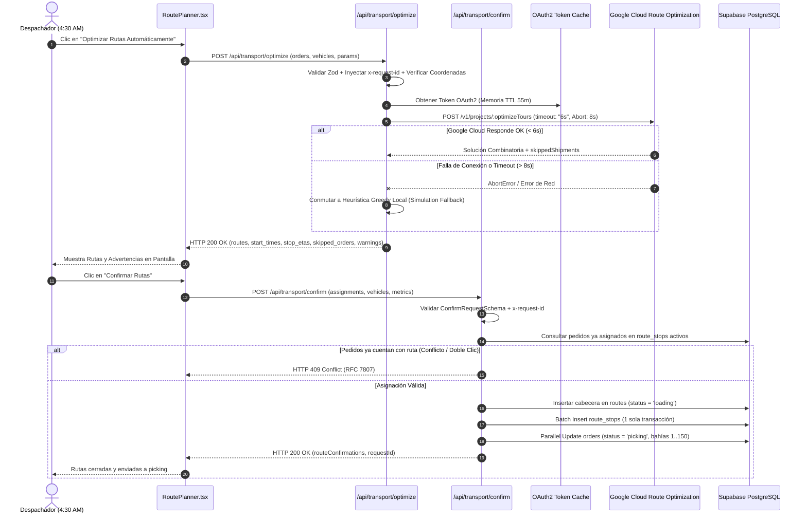
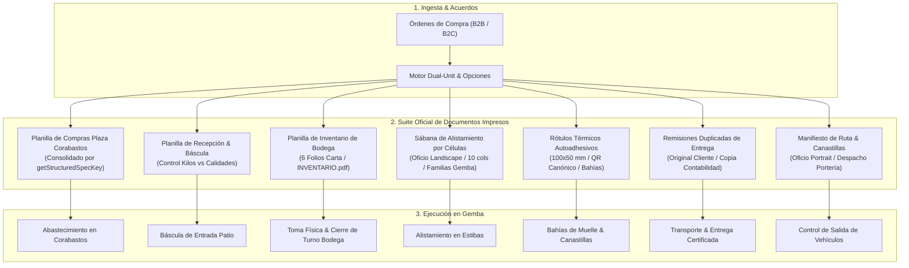
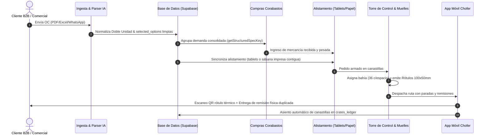
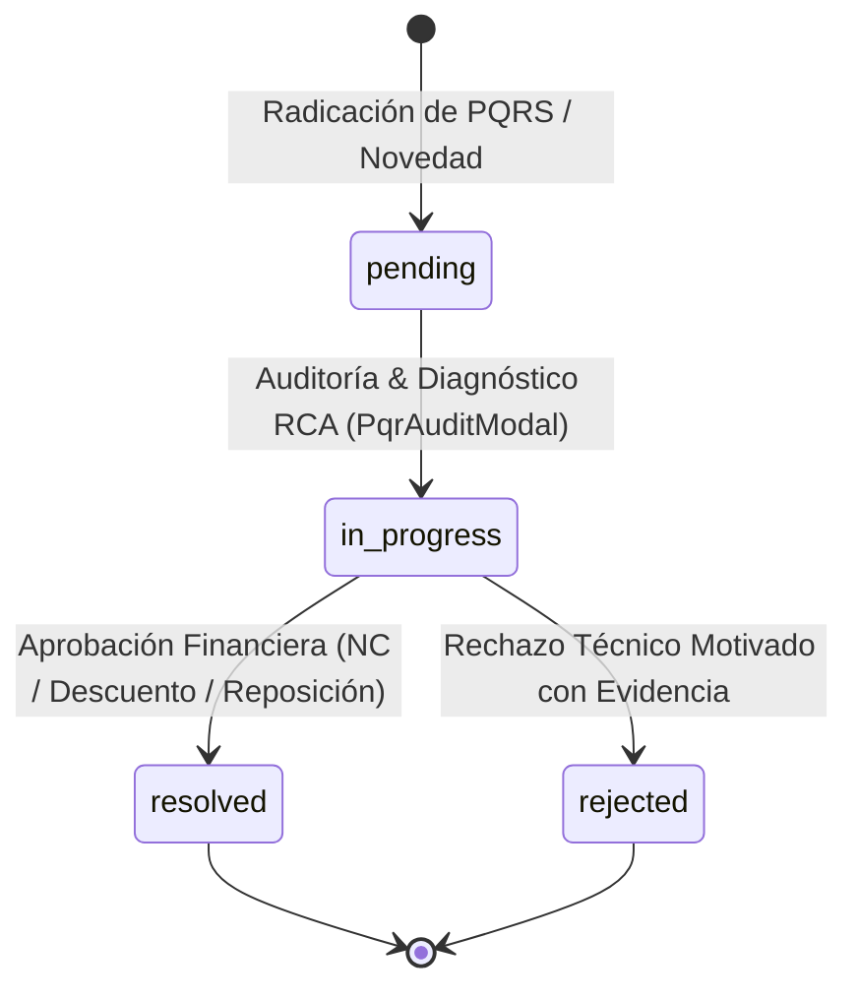
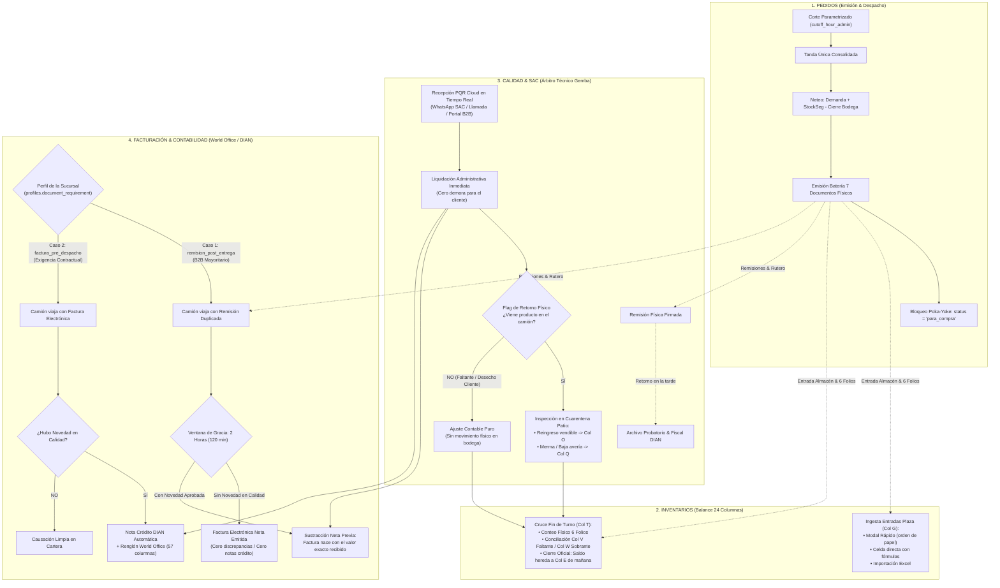
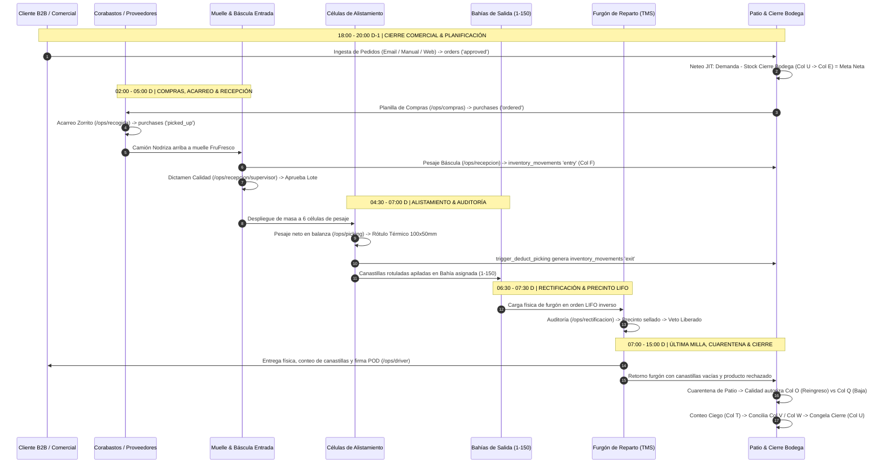

# FruFresco - Especificación de Arquitectura & Contrato de Negocio (SDD)
## Módulo de Pedidos: Pipeline Unificado de Ingesta (Manual vs Automático)

> **Versión:** 1.9.112 (Blindaje Contractual de Precios: Erradicación de Modificación Manual en Creación de Pedidos - COM-40)
> **Fecha:** 07 de Octubre, 2026  
> **Estado:** 🟢 Aprobado & Activo en Contrato  
> **Área:** Gerencia General, Dirección Comercial, Mesa de Facturación & Operaciones B2B

---

## 1. Misión del Sistema, Taxonomía SCOS & Principio de Equivalencia Operativa

### Denominación Formal y Clasificación Arquitectónica
FruFresco está formalmente clasificado como un **Supply Chain Operating System (SCOS) / ERP Vertical Cloud-Native de Ejecución Agro-Logística y Comercio B2B**. No constituye una tienda virtual o catálogo web convencional, sino una plataforma transaccional de misión crítica que orquesta de forma integrada seis (6) subsistemas empresariales gobernados por este contrato de arquitectura:

1. **WMS (Warehouse Management System):** Balance de masa físico en kilogramos (Entradas en Acopio vs Salidas Despachadas vs Mermas Operativas `D + P + F`), gestión de 6 células de alistamiento con pesaje neto y tara de canastilla, auditoría cíclica de inventarios IRA% y rotación DOH.
2. **TMS (Transportation Management System):** Cubicaje algorítmico de flota por peso (kg) y volumen (canastillas), enrutamiento dinámico, manifiestos de despacho y prueba de entrega digital móvil (POD) con captura de firma y coordenadas GPS.
3. **IDP-AI Engine (Intelligent Document Processing):** Pipeline multimodal basado en Gemini 3.8 Flash para ingesta, desestructuración y extracción de órdenes de compra desde correos corporativos, archivos PDF vectoriales/escaneados y hojas de cálculo Excel, asistido por memoria de aprendizaje persistente (`document_learning_memory`).
4. **B2B Commerce Engine:** Jerarquía corporativa multi-sede, acuerdos comerciales con listas de precios dinámicas por cliente/sucursal y generación de cotizaciones formales con membrete y validez contractual.
5. **Pre-Accounting & Billing Engine:** Determinación fiscal por SKU según tarifas de IVA DIAN (`iva_rate`), causación automática de facturas y remisiones netas, emisión de recibos de caja, notas crédito y conciliación de pasarelas de pago (Wompi).
6. **Quality & Compliance (PQRS & RNC):** Tramitación de no conformidades en tiempo real, actas legales RNC con soporte fotográfico en PDF, trazabilidad de cadena de custodia y cálculo del Cost Recovery Index (CRI%) para resarcimiento de mermas con proveedores y transportadores.

### Línea Base de Complejidad y Telemetría del Sistema (Auditoría Septiembre 2026)
- **Volumen de Código Fuente:** 472.805 líneas de código (LOC) netas.
- **Módulos de Interfaz de Usuario:** 157 componentes React/Next.js (`.tsx`) bajo estándares *Swiss Precision Industrial UI*.
- **Módulos de Negocio y Lógica de Servidor:** 136 módulos TypeScript (`.ts`) para motores de precios, validación Zod y pipelines serverless.
- **Capa de Persistencia e Integridad ACID:** 230 scripts PostgreSQL (`.sql`) que comprenden triggers de inventario, procedimientos RPC y políticas RLS multi-tenant.
- **Rutas de Servidor Activas:** 109 rutas Next.js App Router (Páginas operativas, endpoints API y webhooks transaccionales).

### Propósito del Dominio
El Módulo de Pedidos de FruFresco centraliza la recepción, interpretación, valorización y programación logística de pedidos institucionales (B2B) y de hogares (B2C), independientemente de su canal de entrada.

### Regla de Dominio: Jerarquía Matriz vs Sucursales
> **«En clientes corporativos (HORECA, cadenas y grupos empresariales), el NIT pertenece a la persona jurídica matriz y es heredado por sus diferentes sedes. Sin embargo, los pedidos, la programación de despacho, la georreferenciación y la entrega física SIEMPRE se consignan y ejecutan a nivel de Sucursal. Por diseño, las validaciones de auditoría deben permitir y respetar esta relación sin generar fricción ni bloquear la operación cuando el NIT del documento coincida con la matriz pero la entrega se dirija a una sucursal específica.»**

### Principio Rector de Equivalencia Operativa Omnicanal
> **«Para el operador logístico, procesar una orden de compra recibida por correo electrónico, un archivo PDF/Excel subido manualmente, o un mensaje de texto copiado de WhatsApp/Chat es conceptual, visual y funcionalmente equivalente. El resultado final en todos los canales es invariable: un pedido oficial en estado `pending_approval` programado para la operación del día siguiente, con la misma fidelidad contable, fiscal, de cubicación física y trazabilidad de origen (`origin_source`).»**

---

## 2. Mapa de Arquitectura: Pipeline Unificado

```
                             FUENTES DE ENTRADA
           ┌─────────────────────────┴─────────────────────────┐
           ▼                                                   ▼
   [MODO AUTOMÁTICO]                                   [MODO MANUAL]
   Inbound Webhook Email                               Carga de Documento / Formulario
   (/api/orders/email-ingest)                          (/admin/orders/create)
           │                                                   │
           ▼                                                   ▼
   order_drafts (Bandeja Borradores)                   Mesa de Trabajo / Staging Table
           │                                                   │
           └─────────────────────────┬─────────────────────────┘
                                     ▼
                      [CEREBRO LÓGICO COMPARTIDO]
                     src/lib/orders/order-parser-engine.ts
                     ├── Gemini 3.8 Flash (v3.0 / 2026, 1M context, integrated reasoning) with Obsolescence Sentinel & Contingency Cascade
                     │   ├── src/lib/ai/aiModelConfig.ts (Gobernanza Central & Centinela)
                     │   ├── Cascada Canónica: [gemini-3.8-flash, gemini-3.7-flash, gemini-3.5-flash, gemini-flash-latest, gemini-2.5-flash]
                     │   └── executeWithObsolescenceGuard (Failover 404/410 + Audit Log)
                     ├── resolveClientProfile (Multisede/NIT/Emails)
                     ├── findBestProductMatchDetails (Tokens + Catálogo)
                     └── document_learning_memory (Auto-Aprendizaje)
                                     │
                                     ▼
                     [MESA DE TRABAJO & RECONCILIACIÓN]
                     ├── Visor Polimórfico (ExcelTableViewer / PdfCanvas)
                     ├── Validación de Discrepancias Fila por Fila
                     ├── Detección de Tarifas de Contrato / Precios
                     ├── 🔄 Re-analizar con IA sin perder archivo
                     └── ➕ Agregar Ítem Manual en la Mesa de Trabajo
                                     │
                                     ▼
                          [PERSISTENCIA CANÓNICA]
                          orders (Cabecera) + order_items (Detalle)
                          status: 'pending_approval' | delivery_date: D+1
                          ├── Cálculo exacto de IVA (iva_rate por SKU)
                          ├── Cálculo exacto de peso total (total_weight_kg)
                          ├── ⚡ Confirmación Directa en 1 Clic
                          └── Rollback atómico en caso de falla parcial
```

---

## 3. Matriz Comparativa de Capacidades: Email vs Carga por Documento

| Capacidad / Feature | Ingesta por Email (`EmailDraftsModule`) | Carga de Documentos (`create/page.tsx`) | Estado de Paridad |
| :--- | :--- | :--- | :--- |
| **Visor de Archivos** | `ExcelTableViewer` interactivo + PDF Canvas | `ExcelTableViewer` interactivo + PDF Canvas | 🟢 Paridad Total |
| **Motor de Extracción IA** | `order-parser-engine.ts` | `order-parser-engine.ts` | 🟢 Paridad Total |
| **Memoria de Aprendizaje** | Escribe y lee en `document_learning_memory` | Escribe y lee en `document_learning_memory` | 🟢 Paridad Total |
| **Detección de Fecha Entrega** | Auto-asigna `deliveryDate` del documento | Auto-asigna `deliveryDateInDocument` con validación D+1 | 🟢 **Resuelto (Paridad 100%)** |
| **Flujo de Aprobación** | Aprobación en 1 Clic (`approve-draft`) | ⚡ Botón Inmediato en Mesa + opción Inyectar Carrito | 🟢 **Resuelto (Paridad 100%)** |
| **Cálculo Fiscal (IVA)** | Cálculo por ítem según `iva_rate` de cada SKU | Cálculo dinámico por ítem según SKU | 🟢 **Resuelto (Paridad 100%)** |
| **Cálculo de Peso (Kilos)** | Totaliza `total_weight_kg` para cubicación camión | Totaliza `total_weight_kg` para cubicación camión | 🟢 **Resuelto (Paridad 100%)** |
| **Re-parseo / Reintento IA** | Botón para forzar re-extracción con IA | Botón "🔄 Re-analizar con IA" en Mesa de Trabajo | 🟢 **Resuelto (Paridad 100%)** |
| **Agregar Producto Extra** | Botón "Agregar Producto" en la mesa | Botón "+ Agregar Ítem Manual" en Mesa de Trabajo | 🟢 **Resuelto (Paridad 100%)** |
| **Rechazo / Descarte** | Modal de rechazo con notificación email | Botón "Cancelar / Limpiar" | 🟢 Paridad por Diseño |
| **Transaccionalidad ACID** | Rollback de cabecera si falla detalle | Rollback atómico client-side si falla inserción | 🟢 **Resuelto (Paridad 100%)** |
| **Persistencia Documental (`document_url`)** | Vincula adjunto del borrador a `orders.document_url` | Sube a Storage y vincula a `orders.document_url` | 🟢 **Resuelto (Paridad 100%)** |
| **Visualización de Precios y Subtotales** | Píldora verde de tarifa unitaria + tooltip de subtotal en cada fila | Píldora verde de tarifa unitaria + tooltip de subtotal en cada fila | 🟢 **Resuelto (Paridad 100%)** |

---

## 4. Resoluciones Técnicas Detalladas (Contratos SDD Cumplidos)

### ✅ DEUDA TÉCNICA 1: Auto-completado de Fecha de Entrega en Carga Manual
- **Implementación:** En `src/app/admin/orders/create/page.tsx` (`parseOrderWithAI`), cuando `data.deliveryDateInDocument` está presente, se normalizan múltiples formatos (`YYYY-MM-DD`, `DD/MM/YYYY`, ISO), se valida contra la fecha mínima de operación (`minDeliveryDate`), y se asigna a `setDeliveryDate` con un feedback visual claro vía `showToast`.
- **Criterio de Aceptación:** Cumplido. La fecha extraída por la IA ya no se pierde y el operador no tiene que seleccionarla manualmente a menos que desee modificarla.

### ✅ DEUDA TÉCNICA 2: Paridad Financiera e IVA en Aprobación de Correos
- **Implementación:** En `src/app/api/orders/email-drafts/approve/route.ts`, se consultan en lote los productos de la orden para obtener su `iva_rate`. Se calcula el impuesto individualmente con la fórmula canónica de FruFresco (`itemTotal * (rate / (100 + rate))`) y se persisten `subtotal`, `tax` y `total` consistentes contablemente con la DIAN y el modo manual.
- **Criterio de Aceptación:** Cumplido. La aprobación de borradores ya no quema `$0` en impuestos y coincide 1:1 con el modo manual.

### ✅ DEUDA TÉCNICA 3: Cubicación y Peso Logístico en Aprobación de Correos
- **Implementación:** En `src/app/api/orders/email-drafts/approve/route.ts`, se totaliza el peso en kilogramos (`total_weight_kg`) considerando la unidad de medida (`unit_of_measure`), factores para libras (0.5 kg) o el peso específico del SKU (`weight_kg`). Este valor se guarda en la cabecera `orders` y permite al módulo de transporte cubicar la capacidad de carga del camión (ej. 2000 kg o canastillas).
- **Criterio de Aceptación:** Cumplido. Los pedidos nacidos de correo ahora tienen cubicaje exacto.

### ✅ DEUDA TÉCNICA 4: Botón de Aprobación Directa en Mesa de Trabajo de Documentos
- **Implementación:** En `src/app/admin/orders/create/page.tsx`, se añadió la función `handleDirectConfirmOrder` y el botón `⚡ Confirmar y Crear Pedido Inmediato` en el footer de la Mesa de Trabajo. Sube silenciosamente el archivo a `order-attachments`, guarda la memoria de aprendizaje, crea la orden con `origin_source: 'document_upload'`, inserta los ítems, encola el correo de confirmación y redirige a `/admin/orders/loading`. Además, se conserva intacto el botón tradicional `Confirmar e Inyectar al Pedido` para no romper flujos previos.
- **Criterio de Aceptación:** Cumplido. Aprobación en un solo clic disponible para operadores experimentados sin sacrificar la inyección tradicional.

### ✅ DEUDA TÉCNICA 5: Resiliencia de IA: Botón de Re-intento de Extracción
- **Implementación:** En `src/app/admin/orders/create/page.tsx`, se incluyó el botón `🔄 Re-analizar con IA` en la cabecera de la Mesa de Trabajo. Si una lectura resultó incompleta o se desea re-ejecutar el análisis multimodal, el operador pulsa el botón y el sistema re-invoca `parseOrderWithAI(uploadedFile)` usando el archivo en memoria sin obligar a recargar la página ni a seleccionar el archivo nuevamente.
- **Criterio de Aceptación:** Cumplido. Resiliencia inmediata en la interfaz.

### ✅ DEUDA TÉCNICA 6: Capacidad de Agregar Productos Faltantes en Mesa de Trabajo
- **Implementación:** En `src/app/admin/orders/create/page.tsx`, se implementó `handleAddStagedRow` y el botón `+ Agregar Ítem Manual a la Mesa de Trabajo` al pie de la tabla de staging. Permite agregar una fila manual de forma inmediata, activar el dropdown de autocompletado y asociar un producto y cantidad sin tener que inyectar al carrito previamente.
- **Criterio de Aceptación:** Cumplido. Paridad ergonómica completa con el módulo de correos.

### ✅ DEUDA TÉCNICA 7: Transaccionalidad Atómica y Rollback de Órdenes Huérfanas
- **Implementación:** Tanto en `handleSubmit` tradicional como en `handleDirectConfirmOrder` en `src/app/admin/orders/create/page.tsx`, si la inserción en `order_items` experimenta un fallo o micro-desconexión, se ejecuta inmediatamente una compensación de rollback eliminando la orden recién creada (`await supabase.from('orders').delete().eq('id', newOrder.id)`), previniendo la proliferación de registros huérfanos en la base de datos.
- **Criterio de Aceptación:** Cumplido. Integridad referencial garantizada.

### ✅ DEUDA TÉCNICA 8: Trazabilidad y Propagación de `document_url` en la Aprobación de Correos
- **Diagnóstico:** Los pedidos creados por carga manual de PDF/Excel subían el documento al bucket `order-attachments` y guardaban la URL en `orders.document_url`, permitiendo que en `/admin/orders/loading` se mostrara el botón interactivo "Ver Anexo ↗". Sin embargo, en la ingesta por correo (`EmailDraftsModule` y `/api/orders/email-drafts/approve`), el archivo se almacenaba en `order_drafts.extracted_items[0].attachmentUrl` pero al momento de confirmar/aprobar el borrador hacia la tabla `orders`, el campo `document_url` se omitía (quedaba `null`), perdiendo el acceso visual al soporte original.
- **Implementación:**
  - En `src/components/EmailDraftsModule.tsx` (tanto en la confirmación directa `handleConfirmOrderDirectly` como en el modal de confirmación `onConfirm`), se extrae `draftAttachmentUrl` de los anexos del borrador (`metadata?.attachments[selectedAttachmentIndex]?.url || metadata?.attachmentUrl || metadata?.attachments?.[0]?.url`) y se asigna a `document_url` al insertar la cabecera en `orders`.
  - En `src/app/api/orders/email-drafts/approve/route.ts`, se recibe `documentUrl` del payload, o de forma reactiva y autónoma se consulta `order_drafts` para extraer el `attachmentUrl` de los metadatos de extracción, insertándolo en `orders.document_url`.
- **Criterio de Aceptación:** Cumplido. Cualquier orden originada por un documento (correo electrónico o carga manual directa) queda enlazada permanentemente a su archivo físico en `orders.document_url`, garantizando auditoría contable y despacho con visualización del anexo en un solo clic.

### ✅ DEUDA TÉCNICA 9: Enlace Directo «Abrir Original ↗» en Adjuntos de Borradores de Correo
- **Diagnóstico:** En los chips de adjuntos de `EmailDraftsModule.tsx`, el operador únicamente disponía de un evento de clic para conmutar el archivo dentro del visor integrado canvas, sin un acceso directo para abrir el PDF/Excel original en una pestaña nueva del navegador (`target="_blank"`), dificultando la impresión o el zoom nativo rápido.
- **Implementación:** Se incorpora en cada chip un botón de acceso directo con el icono `ExternalLink` apuntando a `att.url` con `stopPropagation()`.
- **Criterio de Aceptación:** Cumplido. El operador puede abrir el documento original en pestaña nueva de forma autónoma con 0% de alteración en la lógica de negocio.

### ✅ DEUDA TÉCNICA 10: Herencia Automática de Fecha de Entrega en Nuevas Filas de Mesa de Trabajo
- **Diagnóstico:** Al presionar `+ Agregar Ítem Manual a la Mesa de Trabajo` en `src/app/admin/orders/create/page.tsx`, la fila recién creada inicializaba sus campos de fecha en `null`, obligando al usuario a reingresar o recordar la fecha de entrega asignada en la cabecera.
- **Implementación:** En `handleAddStagedRow`, se inicializan `deliverySchedule` y `deliveryDate` con la fecha activa de la orden (`deliveryDate || minDeliveryDate`).
- **Criterio de Aceptación:** Cumplido. Cualquier ítem manual añadido a la mesa hereda de inmediato la fecha programada.

### ✅ DEUDA TÉCNICA 11: Higiene Estática de Tipos TypeScript en Componentes de Gestión
- **Diagnóstico:** Se identificó en `src/components/FinancialAdjustmentModal.tsx` una propiedad de estilo duplicada (`border: 'none'` y `border: '1px solid #E2E8F0'`) provocando el error de compilación `TS1117`, así como un cast estricto de tipo unión para novedades operativas (`handleItemNoveltyTypeChange`).
- **Implementación:** Se removió la clave redundante y se tipó formalmente el parámetro del select.
- **Criterio de Aceptación:** Cumplido. Build limpio y cero errores estáticos en el módulo.

### ✅ DEUDA TÉCNICA 12: Botón de Ordenamiento Alfabético A→Z en Interfaces de Entrada de Pedidos
- **Diagnóstico:** Las interfaces de ingesta manual (`orders/create`) y por correo (`EmailDraftsModule`) no ofrecían ningún mecanismo para reordenar los ítems extraídos del documento del cliente. El operador no podía identificar rápidamente duplicados ni navegar alfabéticamente cuando el listado era extenso.
- **Principio de Diseño:** El ordenamiento es estrictamente **visual/display-only**: el array subyacente (`stagedItems` / `editableItems`) conserva siempre el orden original del documento para preservar la integridad de índices y la lógica de edición/confirmación. El sort opera exclusivamente sobre una copia efímera en el momento del render.
- **Implementación:**
  - `src/app/admin/orders/create/page.tsx`: Estado `sortStagedAlpha` (boolean). Botón toggle **A→Z** verde esmeralda en el `<th>` «NOMBRE EN DOCUMENTO» de la Mesa de Trabajo. El tbody aplica `[...stagedItems].sort()` por `localeCompare('es')` cuando activo.
  - `src/components/EmailDraftsModule.tsx`: Estado `sortDraftAlpha` (boolean). Mismo botón en la columna «NOMBRE EN DOCUMENTO» del visor de borradores de correo. Idem lógica de sort sobre `editableItems`.
  - Ambos botones muestran un badge verde activo cuando el ordenamiento está aplicado; al pulsarlo nuevamente se restaura el orden original del documento.
- **Criterio de Aceptación:** Cumplido. Paridad total entre modo Manual y modo Email. El orden original del documento siempre es restaurable con un solo clic.

### ✅ DEUDA TÉCNICA 13: Gobernanza de Atributos: Separación Mutuamente Excluyente Web vs Alistamiento & Mapeo Operativo de Bodega
- **Diagnóstico:** En la Gobernanza de Variantes (Delta Command Center / `ManageAttributesModal`), los atributos solo contaban con el indicador `show_on_web`. El cliente requería distinguir categóricamente entre opciones orientadas al cliente final en la tienda web (ej. «Tamaño»: Grande, Mediano, Pequeño) y notas operativas exclusivas para el montaje interno de pedidos y bodega (ej. «Nota alistamiento»: Cero, Mediana, Richy), asegurando que ambas dimensiones fueran mutuamente excluyentes y que la sábana de alistamiento reflejara la nomenclatura técnica de Corabastos.
- **Principio de Exclusión Mutua:** Una categoría de atributos puede ser de Tienda Web (`show_on_web`) o de Alistamiento/Montaje de Pedidos (`show_in_picking`), pero **nunca ambas simultáneamente**. Al activar una en la gobernanza, la otra se desactiva de forma automática.
- **Mapeo Universal de Equivalencia Operativa (Traducción de Bodega):**
  - `Grande` $\longrightarrow$ **`Cero`**
  - `Mediana` / `Mediano` $\longrightarrow$ **`Mediana`**
  - `Pequeño` / `Pequeña` / `Richy` $\longrightarrow$ **`Richy`**
  - `Mini` $\longrightarrow$ **`Mini`**
  - `Jumbo` $\longrightarrow$ **`Jumbo`**
- **Implementación Técnica Full-Stack:**
  1. **Base de Datos:** Columna `show_in_picking boolean default false` en la tabla maestra `product_attributes_master`.
  2. **Gobernanza (`ManageAttributesModal.tsx`):** Checkboxes duales con lógica de exclusión mutua reactiva (`handleToggleShowOnWeb` y `handleToggleShowInPicking`) y persistencia en Supabase.
  3. **Catálogo & Variantes (`EditProductModal.tsx`, `CreateProductModal.tsx`, `VariantModal.tsx`):** Propagación de `show_in_picking` y `show_on_web` hacia `options_config` de los productos.
  4. **Tienda Web (`ProductDetailClient.tsx`, `QuickViewModal.tsx`):** Filtro que suprime cualquier atributo marcado como `show_in_picking: true`, mostrando exclusivamente opciones web (ej. `Tamaño`).
  5. **Panel de Montaje de Pedidos (`orders/create/page.tsx` & `EmailDraftsModule.tsx`):** En el modal de producto/variantes, se excluyen atributos web-only (ej. `Tamaño`) y se garantiza la disponibilidad de `Nota alistamiento` con sus valores oficiales.
  6. **Motor de Alistamiento (`src/lib/orderUtils.ts`):** Función canónica `normalizePickingNote` integrada en `formatStructuredSpecification`. Si un pedido llega desde la web con `Tamaño: Grande` o desde montaje con `Nota alistamiento: Cero`, en la sábana maestra de alistamiento (`alistamiento-print`) y en las hojas de picking (`contingency-print`) se imprime de forma uniforme la nota oficial de bodega: **`Cero`**, **`Mediana`**, **`Richy`**.
- **Criterio de Aceptación:** Cumplido. Paridad total, exclusión mutua verificada en UI/DB y traducción automática de calibres para el piso de picking en Corabastos.

### ✅ DEUDA TÉCNICA 14: Restricción Estricta de Catálogo por Acuerdo Comercial & Herencia de Compras Fuera de Convenio
- **Diagnóstico:** Al montar pedidos manuales o procesar borradores de correo para clientes institucionales con acuerdos comerciales cerrados (ej. CESNE), los desplegables y buscadores de productos presentaban el catálogo general completo (ej. Lechuga crespa verde hidropónica #776), a pesar de que el cliente o su casa matriz tienen configurado contractualmente el bloqueo de compras fuera de convenio (`allow_off_agreement_purchases = false`).
- **Arquitectura de Gobernanza & Herencia Canónica:**
  1. **Regla de Restricción Estricta (`isStrictAgreement`):**
     - Si la sucursal tiene `allow_off_agreement_purchases === false` (evaluando `override_parent_off_agreement` y la configuración de su matriz corporativa) Y existe un acuerdo comercial vigente (`quotes` activo y no expirado con registros en `quote_items`):
       - Los algoritmos de búsqueda y autocompletado (`getScoredProductsForQuery` y `filteredProducts`) reducen el universo de productos exclusivamente a los SKUs pactados (`agreementProductIds`).
       - Los productos que no pertenezcan al acuerdo quedan 100% excluidos de los desplegables, impidiendo errores de facturación o despachos no autorizados.
  2. **Regla de Catálogo Abierto:**
     - Si `allow_off_agreement_purchases === true` (o no existe acuerdo comercial activo): el catálogo general se mantiene abierto y los productos en acuerdo reciben un boost de relevancia (+4000) en el scoring de búsqueda, utilizando los precios de fallback institucional o modelo asignado.
  3. **Acompañamiento Visual Poka-Yoke:**
     - **Cabecera de Cliente:** Badge distintivo `[🔒 Solo Convenio]` (rojo) o `[🔓 Permite Fuera de Convenio]` (verde) junto al nombre del acuerdo comercial.
     - **Desplegable de SKUs (Mesa de Trabajo):** Badge `[📄 Convenio]` (azul índigo) para ítems pactados y `[📦 Catálogo Libre]` (gris) para ítems del catálogo general institucional.
- **Implementación Full-Stack:**
  - `src/app/admin/orders/create/page.tsx`: Inclusión de `allow_off_agreement_purchases`, `override_parent_off_agreement` e `is_corporate_parent` en `fetchB2B`, carga paginada exhaustiva de `quote_items`, filtrado estricto en `getScoredProductsForQuery` y `filteredProducts`, y badges en UI.
  - `src/components/EmailDraftsModule.tsx`: Inclusión de campos en `fetchProfiles`, resolución de permisos en `resolveContract`, filtrado condicional en `getScoredProductsForQuery`, y badges en UI de mesa de trabajo y resumen de cliente detectado.
- **Criterio de Aceptación:** Cumplido. Clientes con bloqueo estricto solo ven sus SKUs pactados; clientes abiertos mantienen catálogo completo con precios acordes.

### ✅ DEUDA TÉCNICA 15: Gobernanza de Atributos Parametrizables (Maduración Soberana y Gramaje Exclusivo por SKU)
- **Diagnóstico:** 
  1. En el modal de personalización de producto (`orders/create` y `EmailDraftsModule`), la variable biológica **«Maduración»** (ej. *Maduro, Pintón*) desaparecía visualmente debido a un filtro estricto sobre `show_on_web` y a la supresión arbitraria del valor *Maduro*, impidiendo al operador seleccionar requerimientos informales del cliente (ej. *Nota: "Pintón"*).
  2. La variable **«Gramaje»** se estaba auto-inyectando e inventando de forma artificial con valores genéricos (*Estándar*) en productos que no tenían dicho atributo configurado en sus variaciones, violando el principio de que los atributos deben ser estrictamente parametrizables por SKU.
- **Reglas de Contrato Canónicas:**
  1. **Inviolabilidad de Atributos Configurados:** Todo atributo guardado en `options_config` de un SKU (ej. `Maduración`, `Presentación`, `Variedad`) es soberano y pertenece al producto. NUNCA se oculta del modal de montaje de pedidos. En `product_attributes_master`, `Maduración` y `Presentación` poseen `show_in_picking: true`.
  2. **Conservación de Estados de Maduración:** Se eliminan los filtros que suprimían *Maduro*. Todas las opciones parametrizadas (*Maduro*, *Pintón*, *Verde*) quedan disponibles para selección del operador.
  3. **Auto-Match de Notas de Alistamiento:** Si el cliente o el documento traen una nota informal (ej. *Nota: "Pintón"*), el sistema empareja automáticamente el texto con las opciones del SKU y preselecciona la variante correspondiente.
  4. **Gramaje Estrictamente Parametrizable:**
     - `Gramaje` **NO se auto-inyecta artificialmente**: únicamente aparece si el SKU maestro tiene configurado el atributo `Gramaje` en sus opciones y variaciones (`options_config` / `variants`).
     - **Regla Poka-Yoke de Exclusión Mutua:**
       * Si `Presentación = Kg`: Si el SKU tiene `Gramaje` parametrizado, se despliega el selector con sus gramajes específicos (ej. 550 gr) + *Estándar*, calculando unidades aproximadas.
       * Si `Presentación = Unidad discreta` (ej. *Unidad 550 gr*): El selector de `Gramaje` se oculta automáticamente para evitar redundancia física.
       * Si el SKU **no tiene** `Gramaje` parametrizado: El selector no se renderiza.
- **Implementación Full-Stack:**
  - `product_attributes_master`: Actualización a `show_in_picking = true` para `Maduración`, `Presentación` y `Gramaje`.
  - `src/app/admin/orders/create/page.tsx`: Eliminación de filtros destructivos sobre `Maduración`, eliminación de inyección artificial de `Gramaje`, e integración de auto-match de notas de cliente (`exc.picking_note`).
  - `src/components/EmailDraftsModule.tsx`: Paridad exacta en el modal de resolución de variantes de borradores de correo.
  - SKU Maestro *Mango tommy* (`265dbe74-5e11-4d21-9389-d5d9f847cca3`): Parametrización en base de datos de sus 3 atributos oficiales (`Maduración: Maduro, Pintón`, `Presentación: Unidad 550 gr`, `Gramaje: 550 gr`).
- **Criterio de Aceptación:** Cumplido. Maduración visible y preseleccionable; Gramaje 100% condicionado a la parametrización real de variaciones del SKU.

### ✅ DEUDA TÉCNICA 16: Pipeline de Notificaciones al Cliente: Ingesta Cloud Anti-Bucles, Buffer de Gracia (2 min), Remisión Editorial y Diff Visual de Rectificación
- **Diagnóstico Operativo:**
  1. **Falla en Ingesta por Outlook On-Desk:** El reenvío de órdenes desde un cliente Outlook de escritorio antiguo a `email-ingest` generaba rebotes por sobrecupo de reenvío (*NDR 5.7.520 / Rate Limit*). Al rebotar, los correos de error del sistema entraban a la misma bandeja activando un bucle infinito de reenvío que inundaba el buzón y detenía la operación.
  2. **Confirmaciones Prematuras:** El envío inmediato de comprobación no permitía rectificar errores de tipeo del operador en los primeros instantes de la aprobación.
  3. **Disparidad de Formato:** El cliente recibía una tarjeta web genérica en lugar del formato legal y operativo de la **Remisión de Entrega Oficial** de FruFresco.
  4. **Falta de Trazabilidad en Modificaciones Posteriores:** Cuando un cliente llamaba a modificar cantidades o agregar productos tras recibir la confirmación, la actualización en la Torre de Control (`/admin/orders/[id]`) no notificaba al cliente con claridad sobre qué ítems específicos habían cambiado.
- **Reglas de Contrato Canónicas:**
  1. **Desacople Cloud de Ingesta (Anti-Rebote):** Queda prohibido el uso de reglas locales en clientes de correo de escritorio. La ingesta de `pedidos@frufresco.com` se gobierna en la nube mediante **Worker IMAP SSL No Destructivo** (o Mail Flow Rule en el centro de administración de Exchange), leyendo el buzón sin alterar cabeceras ni disparar auto-reenvíos.
  2. **Buffer de Gracia de Dos (2) Minutos:** Al aprobar un pedido en la Mesa de Trabajo, el acuse de confirmación se encola en `mail` con `scheduled_at = now() + interval '2 minutes'`. Si el operador realiza una corrección dentro de esta ventana, la remisión se actualiza sin enviar correos intermedios obsoletos al cliente.
  3. **Paridad Editorial con Remisión de Entrega Oficial:** El cuerpo del correo (y anexo descargable) utiliza estrictamente el diseño de la **Remisión Oficial de FruFresco** ([`Letterhead`](file:///C:/Users/German%20Higuera/OneDrive/Documentos/Projects/frufresco/src/app/admin/commercial/billing/print/%5Bid%5D/page.tsx)):
     - Membrete legal *Investments Cortés S.A.S. • NIT 901.393.217-5 • Régimen Común* con atención directa *301 542 1761*, `pedidos@frufresco.com` y `www.frufresco.com` (sin publicar la dirección física de la sede administrativa).
     - Iconografía 100% vectorial **Lucide SVG** integrada inline (cero emojis unicode para evitar fallos de renderizado en clientes de escritorio).
     - Identificador `#PED-XXXX` y referencia de Orden de Compra del cliente (OC/OCC).
     - Razón social, sede de destino, fecha programada de despacho y franja horaria.
     - Tabla canónica orientada al cliente: `PRODUCTO (descripción comercial completa, sin columna ni códigos internos SKU)` | `CANT.` | `VALOR UNIT.` | `TOTAL`.
     - Subtotal, IVA discriminado y Total oficial liquidado.
  4. **Diff Visual de Rectificación en Modificaciones Posteriores:**
     - Al guardar cambios en un pedido existente desde `/admin/orders/[id]` ([page.tsx](file:///C:/Users/German%20Higuera/OneDrive/Documentos/Projects/frufresco/src/app/admin/orders/%5Bid%5D/page.tsx)), el endpoint `/api/orders/update` compara la versión anterior (`old_data`) contra la nueva (`new_data`).
     - Se despacha una remisión rectificativa con el asunto: `[PEDIDO CORREGIDO] Remisión Nº PED-XXXX - FruFresco`.
     - La tabla de productos resalta cromáticamente las novedades:
       * 🟡 **Ítem Modificado:** Fondo ámbar suave con indicador diferencial: `Cant. anterior: X ➔ Nueva: Y`.
       * 🟢 **Ítem Agregado:** Fondo verde suave con distintivo `[+ NUEVO / ADICIONADO]`.
       * 🔴 **Ítem Retirado:** Fondo rojo suave con texto tachado `[- RETIRADO / AGOTADO]`.
- **Implementación Full-Stack:**
  - `src/lib/emailTemplates.ts`: Unificación de la plantilla con el componente canónico `Letterhead` de remisiones.
  - `src/app/api/orders/update/route.ts`: Detección diferencial de ítems (`idsToDelete`, `itemsToUpsert`, comparación de cantidades) y encolamiento de remisión rectificativa.
  - Tabla `mail`: Soporte de `scheduled_at` para respeto del buffer de gracia de 2 minutos.
- **Criterio de Aceptación:** Cumplido. Cero bucles en recepción; cliente recibe remisión formal con buffer de 2 minutos y diff cromático en correcciones.

### ⏳ DEUDA TÉCNICA 17: Modernización de Marcadores de Georreferenciación Google Maps (`google.maps.Marker` ➔ `AdvancedMarkerElement` / `<AdvancedMarker>`)
- **Diagnóstico Operativo:**
  1. En febrero de 2024, Google Maps Platform marcó la clase tradicional `google.maps.Marker` como obsoleta (*deprecated*), recomendando la migración progresiva hacia `google.maps.marker.AdvancedMarkerElement` y el componente `<AdvancedMarker>` de `@vis.gl/react-google-maps`.
  2. Al inicializar mapas en los módulos de Clientes (`ClientsModule.tsx`), Torre de Control Logística (`CommercialUnifiedDashboard.tsx`), Ingesta de Pedidos (`EmailDraftsModule.tsx`) y Captura de Leads B2B (`LeadGenBot.tsx`), el motor de Google emite un aviso informativo (*Deprecation Warning*) en la consola del navegador.
  3. **Impacto:** Ninguno a nivel funcional en la operación diaria; los pines, geocodificación y coordenadas operan al 100%. Google garantiza un preaviso mínimo de 12 meses antes del retiro definitivo del soporte.
- **Plan de Acción & Criterios de Aceptación para la Migración:**
  1. Configurar un `mapId` corporativo válido en la consola de Google Cloud Platform y enlazarlo a la propiedad `mapId` de `<Map>` / `new google.maps.Map(...)`.
  2. Migrar las instancias imperativas `new window.google.maps.Marker({...})` en `ClientsModule.tsx` hacia `new window.google.maps.marker.AdvancedMarkerElement({...})`.
  3. Reemplazar las importaciones de `<Marker />` por `<AdvancedMarker />` desde `@vis.gl/react-google-maps` (versión `^1.7.1` ya instalada y con la librería `marker` cargada en `providers.tsx`).
  4. Verificar la supresión total del mensaje amarillo de obsolescencia en la consola de desarrollo de Chrome/Edge.

### ⏳ DEUDA TÉCNICA 18: Optimización Lean de Densidad Volumétrica en Canastillas y Buffers TOC en Muelle de Entrada
- **Diagnóstico de Auditoría Lean (Gemba E2E):**
  1. **Disparidad de Densidad Botánica vs Constante Cúbica Fija:** El sistema estima actualmente la cantidad de canastillas plásticas aplicando un divisor rígido uniforme de 12.5 kg ($\lceil \text{peso\_kg} / 12.5 \rceil$). En la realidad física de acopio, productos de baja densidad botánica (lechugas, hierbas aromáticas, espinacas) llenan una canastilla con 6 a 8 kg, mientras que productos de alta densidad (papa, cebolla cabezona, zanahoria) alcanzan de 18 a 22 kg por canastilla. Esta discrepancia distorsiona la ocupación estimada de bahías en bodega y el cubicaje de camiones pequeños.
  2. **Acople Rígido en Básculas y Concurrencia Transaccional en Picking:** La descarga de stock físico se ejecuta de manera sincrónica a través del trigger PostgreSQL `trigger_deduct_picking` al asentar el pesaje neto de cada ítem en `order_items`. Durante ventanas de alto flujo con 6 células de pesaje simultáneas y pesajes continuos de bultos fraccionados, existe riesgo latente de contención en base de datos (*row-level locks*) y desfases si se requiere reclasificar un pesaje por tara errada.
  3. **Riesgo de Aplastamiento Físico en Bahías de Staging (Límite de Apilamiento):** La capacidad nominal teórica de una bahía de piso es de hasta 36 canastillas. Físicamente, una pila superior a 4 niveles (1.60 m) genera inestabilidad mecánica y aplastamiento biológico sobre frutos tiernos en la base.
  4. **Sincronización TOC Drum-Buffer-Rope entre Entrada y Picking:** La jornada nocturna arranca alistamiento mientras los camiones de Corabastos aún descargan en muelle. La ausencia de un búfer visual (*Release Gate*) de tanda puede generar momentos de desabastecimiento temporal en células si el comprador se retrasa en plaza.
- **Estatus Arquitectónico & Resolución:**
  - **Archivado como Deuda Técnica Estratégica (No Bloqueante):** Conforme al mandato de gerencia operativa, se decide **no implementar modificaciones complejas de reingeniería Lean/TOC de forma prematura ni alterar los modelos de cubicaje vigentes** para no introducir inestabilidad en la operación diaria.
  - **Plan de Acción para Iteraciones Futuras:**
    1. Incorporar el factor `density_factor_kg_per_crate` en la tabla maestra `products` para familias botánicas específicas.
    2. Modelar un mecanismo de liberación por olas (*Wave Picking*) condicionado a la llegada del 100% de la sublista a muelle.
    3. Establecer alerta preventiva en el panel de bahías de despacho si una asignación supera 24 canastillas (4 niveles sobre footprint estándar).

### ⏳ DEUDA TÉCNICA 19: Ingesta Frágil de Columna T por Expresión Regular y Bimodalidad de Cierre de Inventario (OPS vs Comercial)
- **Diagnóstico Forense de Integración:**
  1. **Persistencia No Estructurada en Bodega (`/ops/inventory`):** En `src/app/ops/inventory/page.tsx:668`, los operarios de piso registran los conteos ciegos de fin de turno por célula de trabajo (`DEFAULT_WORK_CELLS`). Al guardar, el módulo inserta un movimiento en `inventory_movements` con `reference_type: 'blind_count_shift_close'`, incrustando el valor físico contado dentro de una cadena de texto libre en `notes`:
     `notes: "Cruce a ciegas fin de turno | Célula: ... | Operador: ... | Stock anterior: X -> Contado: Y (Dif: Z) ..."`
  2. **Cable Frágil de Ingesta por Regex en Torre de Control (`InventoryDailyBalanceTab.tsx`):** En `src/components/InventoryDailyBalanceTab.tsx:714` (el Balance Diario de 24 Columnas de la Dirección Comercial), la **Columna T (Inventario Físico Agregado)** reconstruye el inventario contado parseando la nota mediante una expresión regular:
     `const match = (m.notes || '').match(/Contado:\s*([0-9.,]+)/i);`
     Si el operario altera manualmente la nota, si cambia el formato del texto o si se traduce la etiqueta en UI, la regex falla silenciosamente y recurre al fallback de tomar el stock teórico calculado (`physicalCount = currentStock`), enmascarando cualquier descuadre físico real en bodega.
  3. **Bimodalidad y Asimetría de Roles en Cierre Contable:** La interfaz móvil/tablet de bodega (`/ops/inventory`) es una **estación de captura de conteo físico ciego**, pero carece de autorización para congelar el cierre oficial. El congelamiento vinculante e inmutable en `daily_inventory_closings` ($\text{Col U} \to \text{Col E}_{D+1}$) es potestad exclusiva de la Dirección Comercial/Operativa en `/admin/commercial/inventory` (`InventoryDailyBalanceTab.tsx`), exigiendo el rol con permiso `canSupervise`.
- **Plan de Acción & Criterios de Aceptación para la Corrección Definitiva:**
  1. Migrar la persistencia de `blind_count_shift_close` para registrar la cantidad contada en un atributo tipado JSONB (`metadata->>'counted_quantity'`) o en una columna numérica dedicada en `inventory_movements`.
  2. Sustituir la expresión regular de `InventoryDailyBalanceTab.tsx` por la lectura directa y tipada de la propiedad estructurada.
  3. Formalizar en la UI de `/ops/inventory` el badge de estatus *"Conteo Enviado a Auditoría Comercial - Pendiente Cierre Oficial"*, clarificando la jerarquía bimodal.

### ⏳ DEUDA TÉCNICA 20: Desacople entre Dictámenes del Supervisor de Recepción (/ops/recepcion/supervisor) y Cuentas por Pagar (Compras/Finanzas)
- **Diagnóstico Forense de Integración:**
  1. **Auditoría Física en Muelle de Entrada:** En `src/app/ops/recepcion/supervisor/page.tsx`, el Supervisor de Recepción audita los lotes con compras en estado `received_review` y las novedades de báscula en `weight_discrepancies` (`status = 'pending_approval'`).
  2. **Resolución Física vía RPC (`handle_inventory_movement`):** El supervisor aprueba o rechaza mediante transacciones atómicas de inventario:
     - **Aprobación de Lote:** Transfiere la masa física de `in_process` a `available`.
     - **Rechazo de Lote:** Descarga la masa física de `in_process` con `type = 'exit'` y sube el voucher de evidencia a Supabase Storage (`purchases.voucher_image_url`).
     - **Aprobación de Excedente de Peso:** Actualiza `purchases.picked_up_quantity = received_quantity` y transfiere el excedente a `available`.
  3. **Fisura Contable con Cuentas por Pagar (Finanzas):** Aunque el balance físico en bodega queda perfectamente nivelado, el módulo **NO dispara ningún webhook ni asiento contable hacia Cuentas por Pagar ni a la facturación de proveedores**. Si se autorizan 50 kg de más recibidos en báscula o si se rechaza el 40% de un camión por calidad deficiente, el valor a pagar al proveedor en Finanzas conserva el monto pactado originalmente a menos que un analista modifique manualmente la orden de compra en la mesa comercial tras una llamada telefónica.
- **Plan de Acción & Criterios de Aceptación para la Corrección Definitiva:**
  1. Diseñar un disparador transaccional o evento de dominio (`purchase_discrepancy_resolved`) que actualice el saldo por pagar del proveedor o emita una Nota Débito/Crédito comercial automática según el dictamen del supervisor.
  2. Implementar una bandeja de conciliación en el módulo de compras/finanzas que resalte los lotes donde la cantidad recibida difirió de la pactada (`quantity !== picked_up_quantity`) para autorización de pago.

---

## 5. Verificación & Conclusiones
- **Compilación:** Verificada con TypeScript (`tsc --noEmit`), garantizando cero errores en los componentes y rutas del módulo de pedidos.
- **Arquitectura:** Mantiene compatibilidad total hacia atrás (Non-destructive addition). Ambos métodos de entrada (Email y Carga Manual) operan ahora bajo los mismos estándares contables, operativos y de interfaz.

---

## 6. Gobernanza de Despliegue, Infraestructura Git & Resguardo de Producción

### Principio de Invarianza Operativa y Cero Riesgo
- **Ambiente de Producción Activo:** `https://frufresco-liard.vercel.app/` alimentado por la rama `liard` y sincronizado canónicamente con `main`.
- **Estrategia de Ramificación:** Se determinó mantener activas y sincronizadas al 100% las 7 ramas remotas (`main`, `liard`, `CORE`, `core`, `tenant-frufresco`, `tenant1`, `white-label`), garantizando que:
  1. No exista riesgo de desconexión o desconfiguración de dominios, variables de entorno o webhooks en Vercel.
  2. Todas las ramas apunten al mismo commit de referencia en cada entrega.
  3. No se elimine ninguna rama histórica, asegurando continuidad operativa absoluta.
- **Snapshot Inmutable de Seguridad (Git Tag):**
  - **Tag:** `backup-seguridad-arquitectura-20260921`
  - **Función:** Registro congelado en GitHub con paridad total y cero diferencias (`0 0`), protegiendo la base de código ante cualquier contingencia.

---

## 7. Módulo Comercial: Especificación de Arquitectura & Contrato de Negocio

> **Versión del Módulo:** 1.0.0 (Consolidado post Grill-Me Brownfield)  
> **Fecha de Entrada en Vigor:** 22 de Septiembre, 2026  
> **Estado:** 🟢 Aprobado & Activo en Contrato  
> **Ruta Canónica:** `/admin/commercial` | [http://localhost:3001/admin/commercial](http://localhost:3001/admin/commercial)  
> **Área:** Gestión Comercial, Finanzas, Compras y CRM B2B/B2C

### 7.1 Misión & Principio Rector Comercial
El Módulo Comercial de FruFresco gobierna la fijación estratégica de precios, la protección estricta del margen bruto operativo ante la volatilidad de Corabastos, la emisión de cotizaciones formales para prospectos/clientes y la congelación vinculante de tarifas mediante Acuerdos Comerciales auditables.

### 7.2 Jerarquía Canónica de Precios (6 Niveles de Prevalencia)
Cuando el sistema consulta el precio de un producto para un cliente o sucursal, debe evaluar en estricto orden descendente:
1. **Nivel 1 (Prevalencia Máxima - Acuerdo Sucursal):** Acuerdo Comercial Vigente (`quotes.status = 'agreement'`) asignado directamente a la sucursal (`client_id = sucursal.id`).
2. **Nivel 2 (Acuerdo Matriz):** Acuerdo Comercial Vigente asignado a la empresa matriz (`client_id = sucursal.parent_id`).
3. **Nivel 3 (Campañas Promocionales B2B):** Si el SKU no tiene precio congelado por acuerdo, aplican las campañas activas de precio fijo o ajuste porcentual (`commercial_campaigns`).
4. **Nivel 4 (Modelo Directo de Cliente):** Modelo de Precios asignado al perfil (`profiles.pricing_model_id`).
5. **Nivel 5 (Modelo Heredado Matriz):** Modelo asignado a la matriz (`profiles.parent.pricing_model_id`), o en su defecto `General Institucional` (`d90a91e5-827c-473d-9d4f-3e28c7c91e15`) si es cliente B2B.
6. **Nivel 6 (Base Catálogo / B2C):** Lista `Clientes Hogar` (`f7043ca1-94d5-4d25-bd10-fbf30ce120ee`) reflejada en `products.base_price`.

> **Regla de Inmunidad Contractual de Acuerdos:**  
> Los precios pactados bajo un Acuerdo Comercial formal representan un contrato vinculante. Por seguridad jurídica y protección del margen, **las Campañas Comerciales NUNCA alteran ni perforan los precios de productos que formen parte de un Acuerdo Comercial activo**. Las campañas solo modulan productos de catálogo o modelos no cobijados por dicho acuerdo.

> **Directiva de Invarianza en Ingesta de Pedidos (Borradores & Mesa de Trabajo):**  
> 1. **Precedencia Inviolable:** En cualquier módulo de ingesta o edición de pedidos (`EmailDraftsModule`, `orders/create`), la resolución de acuerdos debe buscar en primer lugar la sucursal (`client_id = branchId`) y solo si no existe, la casa matriz (`client_id = parentId`). Queda estrictamente prohibida la inversión de prevalencia `parent_id || id`.  
> 2. **Paginación Exhaustiva Obligatoria:** Dado el límite estricto de 1.000 filas de Supabase PostgREST, toda consulta masiva de listas de precios contractuales (`quote_items`) o modelos (`pricing_model_prices`) debe paginarse obligatoriamente mediante bloques de rango (`range(p * 1000, ...)`). Jamás se asumirá que una sola llamada REST contiene la totalidad de los SKUs de los clientes institucionales.  
> 3. **Resiliencia Reactiva Bajo Demanda:** Si un borrador de pedido se asocia a un acuerdo activo cuyos ítems no residan aún en la memoria caché del navegador (o hayan sido editados en tiempo real por el equipo comercial), el sistema debe disparar una consulta directa bajo demanda de los `quote_items` de ese contrato específico para garantizar que ningún SKU aparezca falsamente como `SIN PRECIO` ni asuma precios de catálogo público.

### 7.3 Contratos Matemáticos Canónicos (Reglas Inmutables)

#### A. Mecanismo Canónico de Tarificación & Margen Comercial
La tarificación de FruFresco opera de forma unificada bajo la **Fórmula Canónica de Margen/Utilidad sobre Costo Efectivo (Markup Multiplicador)** en todas sus pantallas (Modelos de Precios, Matriz de Costos, Cotizaciones y Sincronización Automática):

$$\text{Precio Unitario Antes de IVA} = \text{Costo Neto Efectivo} \times \left(1 + \frac{\text{Margen o Utilidad\%}}{100}\right)$$

1. **Unificación Sistémica:**  
   Esta fórmula rige idénticamente en `/admin/commercial/settings`, `/admin/commercial/cost-matrix`, `pricingUtils.ts` y `/admin/commercial/quotes/create`. Queda erradicada cualquier división por $(1 - \text{Margen})$ que pudiera causar saturaciones o valores anómalos en productos con utilidades $\ge 100\%$.
2. **Absorción Logística en SKUs de Bajo Costo:**  
   En productos agrícolas de bajo costo unitario (ej. atados de hierbas, acelgas, cilantro, espinacas con costo inferior a \$3.000 COP), se **valida y protege el uso de márgenes/utilidades superiores al 100% (ej. 110%)**:  
   *Ejemplo real:* Acelga con Costo \$1.050 y Utilidad 110%:  
   $$\text{Precio Antes de IVA} = \$1.050 \times (1 + 1.10) = \$2.205 \longrightarrow \mathbf{\$2.250\text{ COP}}$$  
   *Justificación Operativa:* Alistar, seleccionar, lavar, embolsar y transportar un atado de \$1.050 COP tiene un costo fijo de servicio logístico idéntico al de un producto de alto valor. Un porcentaje superior al 100% absorbe el costo fijo de empaque y flete sin generar pérdidas por drop.
3. **Absorción de Volatilidad por Canasta Cruzada en Acuerdos Fijos:**  
   Los clientes institucionales (hoteles, casinos, restaurantes) exigen precios congelados a 15 o 30 días para su planeación de costos de menú. La volatilidad diaria de Corabastos no se traslada al cliente spot a spot, sino que se amortigua estructuralmente mediante la **rentabilidad combinada de la canasta comercial**, manteniendo el promedio global de la cuenta institucional en el rango objetivo del **32% al 34%**.

#### A.1 Factor de Merma Teórica en Costo Efectivo (GAP-02)
Para evitar pérdidas ocultas de entre 5% y 25% de margen bruto en perecederos de alto desecho (lechugas, fresas, hierbas, frutas delicadas), el costo base de adquisición se infla obligatoriamente por la merma teórica del SKU antes de aplicar el margen comercial:
$$C_{\text{efectivo}} = \frac{C_{\text{base}}}{1 - \left(\frac{\text{theoretical\_shrinkage\_pct}}{100}\right)}$$
*Ejemplo:* Con Costo Base \$1.000 y Merma Teórica del 15%:
$$C_{\text{efectivo}} = \frac{1000}{1 - 0.15} = \$1.176,47$$
$$\text{Precio Antes de IVA (con 20% Margen)} = \frac{1176,47}{1 - 0.20} = \$1.470,59 \longrightarrow \mathbf{\$1.500\text{ COP}}$$

#### B. Redondeo Comercial Colombiano
Todo precio unitario cotizado o tarificado antes de impuestos se redondea hacia arriba al múltiplo de \$50 COP más cercano:
$$\text{Precio Redondeado} = \left\lceil \frac{\text{Precio Unitario Antes de IVA}}{50} \right\rceil \times 50$$

#### C. Presentación Fiscal & Desglose de IVA
1. En cotizaciones (PDF, Excel, WhatsApp) y pantallas de negociación, el **precio unitario por SKU se presenta siempre ANTES de IVA**.
2. Los renglones identifican la tarifa de IVA aplicable (0% excluido para la mayoría de frescos, 5% o 19% para procesados/despensa).
3. El IVA total se calcula individualmente por ítem y se totaliza en el pie de la cotización (`subtotal_amount`, `total_tax_amount`, `total_amount`).

#### D. Vigencia Contractual Canónica de Cotizaciones (GAP-11)
Las cotizaciones institucionales y propuestas B2B poseen una vigencia vinculante estricta de **ocho (8) días calendario**. Queda prohibida la fijación o congelación de precios a 30 días en cotizaciones previas al acuerdo formal para salvaguardar la empresa ante la volatilidad de Corabastos. La vigencia en cabecera y en cláusulas legales debe coincidir exactamente en 8 días.

### 7.4 Reingeniería de la Matriz de Costos: Dos Caminos, Último Precio Real, Circuit Breaker & Pareto de Frescura

#### A. Filosofía de Transparencia y Abandono de Algoritmos Complejos
Queda estrictamente erradicado el uso de fórmulas de alisamiento predictivo o modelos de regresión temporal (Holt-Winters, medias móviles de 8 compras) para fijar el costo base de productos agrícolas. En alimentos perecederos y Corabastos, **el costo base es el último precio real pagado en báscula o cotizado en plaza**.

#### B. Los Dos Caminos Canónicos de Entrada
1. **Camino A (Compras / Operaciones):**
   - Precios registrados en el módulo de compras (`purchases` / `purchase_history_normalized`).
   - Se extrae siempre el **ÚLTIMO PRECIO registrado** de compra como referencia activa.
2. **Camino B (Carga Manual / Directa en Matriz):**
   - Modificación directa por el área comercial o importación masiva de Excel.
   - Genera la versión más reciente del costo y se convierte de inmediato en la **nueva realidad comercial**.

#### C. Poka-Yoke: Circuit Breaker de Volatilidad (+/- > 20%)
1. **Cálculo de Desvío:** Ante cualquier nuevo registro de costo (Camino A o Camino B), el sistema evalúa:
   $$\text{Variación\%} = \frac{|\text{Precio Nuevo} - \text{Costo Vigente Anterior}|}{\text{Costo Vigente Anterior}} \times 100$$
2. **Comportamiento si Variación $\le$ 20%:** El nuevo precio se adopta automáticamente como Costo Base Oficial.
3. **Comportamiento si Variación > 20% (Discrepancia Crítica):**
   - **Congelamiento de Seguridad:** El sistema **mantiene congelado el costo anterior** para proteger las cotizaciones y ventas en curso.
   - **Alerta Andon en Matriz Comercial:** Se levanta una alarma visual prominente de *«Alerta de Volatilidad (+/- X%) - Requiere Validación»*.
   - **Resolución Humana Obligatoria:** Exclusivamente el **Jefe / Dueño del Módulo Comercial** puede pulsar `[Aprobar Precio]` o `[Ingresar Costo Manual]`. La decisión humana queda asentada en `audit_logs` y define la nueva verdad del sistema.

#### D. Pareto de SLAs de Frescura por Frecuencia de Compra/Movimiento (Arazá vs Papa)
Para evitar la distorsión por densidad de masa (donde 70 toneladas de papa opacan 40 kilos de arazá o hierbas de alta rotación), el catálogo activo de 552 SKUs se clasifica dinámicamente en **Terciles de Frecuencia Transaccional** ($\sum$ de órdenes de compra y movimientos de inventario):

1. **Tercil 1 (T1 - Pulso Diario / Críticos):**
   - **Criterio:** Top 33% de productos con mayor frecuencia de compras registradas.
   - **SLA de Frescura:** **4 días calendario**.
   - **Vencimiento:** Pasa a estado `VENCIDO` si no hay compra ni cotización en > 4 días. Constituye una **Tarea Urgente Roja** en la bandeja comercial.
2. **Tercil 2 (T2 - Rotación Media):**
   - **Criterio:** 33% intermedio de recurrencia transaccional.
   - **SLA de Frescura:** **8 días calendario**.
   - **Vencimiento:** Pasa a estado `VENCIDO` en > 8 días. Revisión en la ronda semanal de abastecimiento.
3. **Tercil 3 (T3 - Baja Frecuencia / Catálogo Extendido):**
   - **Criterio:** 34% de menor frecuencia (o productos sin compras recientes).
   - **SLA de Frescura:** **15 días calendario**.
   - **Vencimiento:** Pasa a estado `VENCIDO` en > 15 días. Revisión quincenal de lista.

#### E. Gobernanza de Cotizaciones ante Costos Vencidos
1. El recálculo de precios no se ejecuta en línea de forma descontrolada; se administra de manera periódica.
2. Si un producto con costo vencido es incluido en una cotización comercial:
   - El sistema **utiliza el último costo autorizado vigente** para no paralizar la emisión de propuestas.
   - Genera una alerta interna para que el comercial coordine el cuadre de precio con el **Jefe Comercial**, quien tiene la potestad de autorizar el precio antes del cierre formal del acuerdo.

#### F. Costo Efectivo Inmutable (Factor de Merma Teórica)
Sobre el Costo Base adoptado (sea de Camino A o Camino B), se aplica siempre la fórmula canónica de protección contra merma:
$$C_{\text{efectivo}} = \frac{C_{\text{base}}}{1 - \left(\frac{\text{theoretical\_shrinkage\_pct}}{100}\right)}$$

### 7.5 Ciclo de Vida Canónico de Cotizaciones & Acuerdos

```
[PROSPECTO / CLIENTE] ──> [COTIZACIÓN DRAFT] ──> [SENT]
                                                    │
                   ┌────────────────────────────────┴────────────────────────────────┐
                   ▼                                                                 ▼
              [REJECTED]                                                        [ACCEPTED]
                                                                                     │
                                                                                     ▼
                                                                       [ACUERDO COMERCIAL FORMAL]
                                                                        status: 'agreement'
                                                                        start_date | valid_until
                                                                        ├── Congela precios en CRM
                                                                        └── Se inyecta en Pipeline
                                                                            de Pedidos (D+1)
```

1. **Principio de Acuerdo Obligatorio:** Toda cotización que un cliente aprueba se formaliza como un **Acuerdo Comercial** (`status = 'agreement'`) con fecha de inicio y de vencimiento (`valid_until`).
2. **Consumo Automático:** Al ingresar una orden de compra manual o por correo (`/admin/orders/create` o `/api/orders/email-ingest`), el motor de resolución de precios busca si el cliente o su matriz tiene un acuerdo comercial activo; si existe, sus precios congelados se asignan automáticamente a los ítems del pedido con máxima prioridad.

#### 7.5.1 Nomenclatura Canónica & Acompañamiento Visual de Acuerdos Comerciales / Listas de Precios
Para asegurar que todo acuerdo comercial cuente con una identidad explícita e inequívoca tanto para el equipo comercial como para el cliente institucional:
1. **Regla de Nomenclatura Automática Dinámica (`computeDefaultAgreementName`):**
   $$\text{Nombre del Acuerdo} = \text{[Razón Social / Nombre Comercial]} - \text{[DD-MM-AA]}$$
   *Ejemplo:* `Restaurante El Portal - 22-09-26` o `Acuerdo Multicliente - 22-09-26`.
   - El sistema autocalcula y autocompleta este valor en el formulario de creación en tiempo real al seleccionar el cliente o modificar la fecha de inicio del acuerdo.
   - Si el comercial desea un nombre personalizado, puede editar el campo de texto libremente; en caso contrario, se preserva el estándar corporativo.
2. **Persistencia Estructurada:**
   El nombre acordado se almacena de forma persistente en `quotes.model_snapshot_name` bajo el registro con `status = 'agreement'`.
3. **Omnipresencia en la Visualización:**
   El nombre resultante acompaña obligatoriamente todas las interfaces y documentos:
   - **Tabla Principal de Acuerdos:** Badge verde esmeralda junto a la razón social (`[Restaurante El Portal - 22-09-26]`).
   - **Drawer de Inspección Rápida:** Cabecera de la lista de tarifas congeladas.
   - **Documento Formal de Precios:** Encabezado unificado `Lista de precios [Nombre del Acuerdo] (X productos)`.
   - **Exportación e Impresión PDF (`AgreementDocumentModal`):** Título principal del documento contractual de tarifas.
   - **Ficha del Cliente (`ClientsModule`):** Indicador de `Modelo Base: [Nombre del Acuerdo]` con vigencia.
   - **Portal B2B del Cliente (`/b2b/dashboard`):** Título de la tarjeta de convenio vigente en la pestaña de Acuerdos cuando el cliente accede a realizar sus pedidos.

#### 7.5.2 Trazabilidad Canónica de Orden de Compra y Pedido del Cliente (OC / SOLPED / No. Pedido Cliente)
Para garantizar la conciliación fiscal, contable y operativa con los clientes B2B (Restaurantes, Colegios, Hoteles, Empresas de Alimentos y Estado):
1. **Identificadores del Cliente Soportados:**
   - **Orden de Compra (OC):** Número oficial emitido por el ERP o departamento de compras del cliente (ej. `OC: 12455`, `OC: 45000123`).
   - **Solicitud de Pedido (SOLPED):** Identificador interno de requisición del cliente (ej. `SOLPED: 89012`).
2. **Puntos de Captura y Carga en la Plataforma:**
   - **A. Ingesta Automática por Correo (`EmailDraftsModule` / `/api/orders/email-ingest`):** El motor multimodal extrae automáticamente `poNumber` y `solpedNumber` del PDF/Excel adjunto y los previsualiza en el borrador (`order_drafts`).
   - **B. Carga Institucional con Digestor (`/admin/orders/create` - Staging Area):** El motor de procesamiento de documentos extrae y rellena los campos editables `[# Orden de Compra (OC)]` y `[# Solicitud / SOLPED]`, permitiendo corrección manual previa a la confirmación.
   - **C. Creación Manual por Catálogo (`/admin/orders/create`):** El operador comercial ingresa la referencia en el campo de observaciones operativas (`admin_notes`).
3. **Persistencia en Base de Datos:**
   - **`orders.admin_notes`:** Se consolida con formato canónico indexado: `OC: [Número] | SOLPED: [Número] | [Observaciones]`.
   - **`orders.document_url`:** Almacena la URL permanente en Supabase Storage (`order-attachments`) del documento digital original para consulta visual en 1 clic.
4. **Visualización y Búsqueda Operativa:**
   - **Superbuscador de Pedidos (`/admin/orders/loading`):** Indexa `admin_notes` para que escribir el número de OC (ej. `12455`) ubique instantáneamente el pedido.
   - **Control Tower & Detalle:** Muestra el botón interactivo `[📄 Ver Anexo / OC]` enlazado a `document_url`.
   - **Remisiones y Hojas de Picking:** Se estampa en el encabezado del documento oficial de entrega para que el receptor en la sede del cliente concilie el pedido contra su propia orden de compra.

#### 7.5.3 Protocolo Universal de Ingesta y Renderizado de Hojas de Cálculo (`.xlsx`, `.xls`, `.ods`, `.csv`, `.xlsm`)
1. **Regla de Resiliencia Formato/Extensión:**
   - La plataforma nunca debe asumir que una hoja de cálculo enviada por un cliente institucional terminará obligatoriamente en `.xlsx` o `.xls`.
   - Clientes corporativos como El Corral / IRCC, cadenas gastronómicas y usuarios con LibreOffice, OpenOffice, Google Sheets o clientes webmail envían archivos con extensiones `.ods` (OpenDocument Spreadsheet), `.csv`, `.tsv`, `.xlsm` o nombres truncados/renombrados automáticamente (ej. `FORMATO SUMINISTROS UNICO.xls_1 (1) (4) (3).ods`).
2. **Centralización Arquitectónica (`src/lib/spreadsheets.ts`):**
   - La función canónica `isSpreadsheetFile(filename, mimeType)` clasifica cualquier archivo tabular examinando extensiones conocidas (`xlsx`, `xls`, `ods`, `csv`, `tsv`, `xlsm`, `xlsb`, `fods`), sufijos mangled (`.xls_1`, `.ods`, etc.) y cabeceras MIME (`application/vnd.oasis.opendocument.spreadsheet`, `spreadsheet`, `excel`, `text/csv`).
3. **Pipeline Multimodal y Previsualización UI:**
   - **Ingesta por Email (`/api/orders/email-ingest`) y Re-extracción (`/api/orders/reparse-draft`):** Todo archivo tabular es procesado con `XLSX.read(buffer, { type: 'buffer' | 'array' })` para transformar todas sus hojas en representaciones CSV puras (`sheet_to_csv`), permitiendo a Gemini multimodal digitalizar productos, cantidades, fechas y números de orden de compra sin pérdidas ni fallbacks a arrays vacíos.
   - **Visor Interactivo (`EmailDraftsModule.tsx` y `ExcelTableViewer.tsx`):** Renderiza las pestañas de hojas de cálculo, identificador de filas con pedidos (`countWithQty`), filtros rápidos y visor en nueva pestaña para cualquier documento tabular soportado, erradicando el fallback obsoleto de botón genérico *"Descargar Documento"*.

#### 7.5.4 Pipeline de Negociación Estructurada (Gemba Comercial), Formalización Obligatoria de Cliente y Estandarización Universal de Impresión (Letterhead)
1. **El Gemba Real de la Mesa Comercial (Etapas de la Conversación Estructurada — Secuencia Lógica, No Tiempos Rígidos):**
   - El asesor comercial opera desde su escritorio en la oficina gestionando prospectos vía WhatsApp, teléfono o correo. La cotización es una **conversación estructurada viva e iterativa** (donde los "Días 1, 2, 3, 4" son un arquetipo pedagógico de las fases de negociación, las cuales pueden surtirse en 10 minutos, varias horas, días o semanas según el ritmo del cliente, sin ninguna restricción temporal fija en el software):
     * **Fase 1 / Apertura (Versión 1 - Ejemplo "Día 1"):** El comercial emite la propuesta inicial v1 para el prospecto/lead. En esta fase preliminar **NO se exige documentación legal ni datos de muelle** para evitar fricción que ahuyente la oportunidad comercial.
     * **Fase 2 / Contraoferta y Modulación (Versión 2 - Ejemplo "Día 2"):** Ante objeciones de competitividad o presupuesto, el comercial modula la agresividad de margen/markup general generando una nueva versión vinculada (`?duplicate_from=[id]`).
     * **Fase 3 / Sintonía Fina SKU a SKU (Versión 3 - Ejemplo "Día 3"):** Negociación puntual sobre productos sensibles (ej. el cliente acepta la canasta pero pide bajar el precio del *Aguacate Hass*); el comercial ajusta quirúrgicamente ese ítem preservando el margen del resto de la propuesta.
     * **Fase 4 / Cierre, Onboarding & Carga del Acuerdo (Ejemplo "Día 4"):** El cliente confirma su aceptación formal de este modelo de precios por un periodo pactado (ej. **6 meses**).
2. **Protocolo de Cierre: Solicitud de Vinculación y Alta de Cliente Institucional:**
   - En el instante en que el cliente acepta formalmente (Fase de Cierre, sin importar cuánto tiempo haya tomado la negociación previa), el comercial solicita desde su oficina el **Kit de Vinculación Oficial**:
     * **Copia del RUT:** De la cual se extraen Razón Social Formal (`razon_social`), Nombre Comercial (`company_name`), NIT con Dígito de Verificación (`nit`), régimen tributario y correo oficial de facturación electrónica (`email`).
     * **Datos de Despacho y Entrega:** Dirección física de entrega (`address`), municipio/localidad (`municipality`) y coordenadas satelitales (`latitude`, `longitude`, `geocoding_status`) para situar la parada en el optimizador de rutas.
     * **Restricciones Operativas y Franja Horaria de Recibo:** Horario de recibo en muelle/cocina (ej. 06:30 - 09:30 AM), días hábiles habilitados (Lun-Sáb) e instrucciones de acceso (sótanos, muelles, autorizaciones), procesadas algorítmicamente vía `parseLogisticsText` (`logistics_data`).
   - El comercial diligencia la pantalla de formalización: el sistema crea el nuevo cliente institucional en `profiles`, actualiza el lead a `converted` y, de forma inmediata y automática, **le carga y activa la cotización final como un Acuerdo Comercial vinculante** (`status = 'agreement'`) con la vigencia acordada (**6 meses**, 1 mes, 3 meses, 1 año o fecha personalizada).
   - **Caso Cliente Preexistente:** Si el cliente ya existía, se asocia directamente del directorio B2B, sincronizando el plazo de pago acordado y actualizando cualquier dato logístico que estuviera pendiente.
3. **Conexión Directa al Pipeline de Acuerdos Institucionales:**
   - Al aprobar la cotización formalizada:
     * Se promueve el registro a `status = 'agreement'`.
     * Se congela la vigencia comercial pactada en `valid_until` (presets de 30, 90, 180 días / 6 meses, 365 días o personalizado).
     * Se estampa la nomenclatura canónica en `model_snapshot_name`: `[Cliente] - Acuerdo [DD-MM-AA]`.
     * Se asienta la traza forense inmutable en `audit_logs` con la acción `ACTIVATE_commercial_agreement`.
     * **Redirección Inmediata:** La plataforma transiciona al operador comercial directamente a la mesa de control de Acuerdos Institucionales (`/admin/commercial?tab=clients&clientTab=agreements`), donde el nuevo acuerdo entra en vigor de forma inmediata.
4. **Estandarización Universal del Formato de Impresión Golden Print (`Letterhead`):**
   - Se erradican los formatos visuales heterogéneos previos en cotizaciones.
   - Las propuestas comerciales para impresión interna (`/admin/commercial/quotes/[id]/print`) y los enlaces públicos compartidos (`/quotes/[id]/print`) adoptan el estándar unificado institucional del componente `Letterhead` (`UniversalLetterhead`), compartiendo la misma tipografía, membrete legal (Investments Cortés S.A.S. - NIT 901.393.217), micro-grid de datos del cliente, tabla con acento de color por categorías agrícolas, resumen de liquidación tributaria, Sello de Garantía Operativa FruFresco B2B y bloque solemne de firmas de aceptación que utilizan las **Remisiones de Despacho y Facturas de Venta**.

#### 7.5.5 Submódulo Canónico de Acuerdos Comerciales & Contratos Vigentes (`/admin/commercial/agreements` y `CommercialAgreementsModule.tsx`)
1. **Doble Acceso y Enrutamiento Canónico:**
   - **Ruta Dedicada de Primer Nivel (`/admin/commercial/agreements`):** Vista de primer orden con breadcrumb corporativo, retorno ágil a la consola y navegación directa sin dependencias de parámetros URL.
   - **Consola Embebida (`/admin/commercial?tab=clients&clientTab=agreements`):** Integración nativa dentro del CRM de clientes y accesible de forma reactiva desde el embudo del Dashboard Comercial (BI).
2. **Jerarquía Contractual & Prevalencia de Precios en Toma de Pedidos:**
   - En la liquidación automática de pedidos manuales (`/admin/orders/create`) y en la ingesta asistida de correo (`/api/orders/email-ingest`), el motor aplica la cascada estricta:
     $$\text{Precio Facturado} = \begin{cases} \text{Acuerdo Sucursal} & \text{si existe cotización activa para la sede} \\ \text{Acuerdo Casa Matriz} & \text{si la sede no tiene acuerdo propio pero su matriz sí} \\ \text{General Institucional} & \text{fallback estándar por modelo de precios} \end{cases}$$
   - **Distinción Visual Inconfundible:** Las filas de la tabla identifican el rol del cliente:
     - `[🏢 CASA MATRIZ]` con ícono `<Building2 />` y conteo de sucursales subordinadas.
     - `[📍 SUCURSAL ESPECÍFICA]` con ícono `<Building />` y enlace explícito a su Casa Matriz dependiente.
3. **Semáforo Telemático de Vigencias (SLA & Traffic Light):**
   - **Vigente (Verde Esmeralda `#0D7A57` / `#ECFDF5`):** Fecha de vencimiento superior a 5 días respecto a la fecha actual. Precios firmes en catálogo institucional.
   - **Próximo a Vencer (Ámbar Andon `#D97706` / `#FFFBEB`):** Vence en 5 días o menos. Alerta al asesor comercial para iniciar la renegociación periódica de cosecha.
   - **Vencido (Rojo Alerta `#DC2626` / `#FEF2F2`):** Fecha de vigencia superada. Los precios congelados quedan inactivos y el cliente entra en fallback automático a su tarifa base institucional.
4. **Poka-Yoke Multicapa de SKUs Inactivos (Capítulo 17):**
   - Si un acuerdo contiene productos marcados como inactivos en el catálogo maestro (`products.is_active = false`), el sistema despliega una píldora compacta en el Drawer de precios y un botón de auto-reactivación en 1 clic que ejecuta `UPDATE products SET is_active = true WHERE id IN (...)`, impidiendo que los productos pactados desaparezcan en el alistamiento de pedidos.
5. **Drawer Lateral con Edición In-Situ y Trazabilidad Forense:**
   - Interfaz con thead sticky a `top: 50px` (`borderCollapse: 'separate'`) para escaneo rápido de cientos de referencias.
   - Permite ajustar precios unitarios en caliente, recalculando en tiempo real el margen bruto por SKU, el IVA y los subtotales/totales del acuerdo.
   - Exige o sugiere justificaciones de mercado/cosecha preconfiguradas (`SUPPLY_JUSTIFICATION_PRESETS`) y registra cada modificación en `audit_logs` (`UPDATE_quote_item_price`).
6. **Formato Golden Print y Exportación Excel:**
   - Generación de propuestas impresas en papel Carta u Oficio mediante `Letterhead` institucional, con agrupación alfabética por categorías agrícolas (A-Z) y sin artefactos visuales del ERP vía `printViaNewWindow`.
   - Exportación limpia en hojas de cálculo `.xlsx` para entrega a directores de compras y gerencias de restaurantes.

#### 7.5.6 Arquitectura Canónica de Listas de Precios & Acuerdos Maestros Compartidos (Efecto Cascada 1 a N / Single Source of Truth)

1. **Principio Rector: Erradicación del Modelo de Fotocopias (Clonación Ciega):**
   - **Regla de Oro:** Queda formalmente prohibida la clonación o duplicación masiva de registros independientes de cotizaciones (`quotes`) al crear acuerdos para múltiples clientes. Dicha práctica generaba dispersión de datos y forzaba al equipo comercial a realizar $N$ actualizaciones idénticas ante un solo cambio de precio en Corabastos.
   - **Doctrina Single Source of Truth (1 a N):** Se establece la entidad **Acuerdo Maestro Compartido / Lista Centralizada de Precios** como la única fuente canónica viva. Un solo registro de acuerdo (`quotes` catalogado como lista maestra compartida) alberga los precios negociados de los productos (`quote_items`). Los múltiples clientes o sucursales asociadas no poseen réplicas locales, sino un **puntero o enlace relacional activo** hacia esta lista viva.

2. **Efecto Cascada Automático en Tiempo Real:**
   - Toda modificación realizada sobre un producto o tarifa en el Acuerdo Maestro Compartido (vía Drawer lateral de edición de precios, actualización en línea o re-ingesta de archivo Excel/ODS) impacta **en tiempo real y con efecto cascada inmediato** a todas las Casas Matrices y Sucursales vinculadas a dicha lista.
   - Al momento de montar pedidos en `/admin/orders/create` o procesar órdenes de compra desestructuradas vía correo en `EmailDraftsModule`, el motor de precios resuelve la tarifa directamente desde la lista compartida activa, erradicando discrepancias de facturación o desfases entre sedes del mismo grupo o clientes con tarifa unificada.

3. **Re-ingeniería del Pipeline UX en el Asistente de Creación y Edición (`CommercialAgreementsModule.tsx`):**
   - **Paso 1: Selección de Alcance (Individual vs Lista Compartida):**
     - Pestañas semánticas claras: `[Acuerdo Exclusivo Individual]` vs `[Lista Maestra Compartida (Efecto Cascada)]`.
     - Lenguaje Poka-Yoke: Erradicación del texto ambiguo *"Casas matrices que recibirán el acuerdo"*. En su lugar, el encabezado formaliza: **`Vincular Clientes a esta Lista Maestra Viva (Efecto Cascada)`**.
     - Banner explicativo de alto contraste:
       > *«Todos los clientes y sucursales seleccionados compartirán esta misma lista central viva. Si modificas un precio aquí en el futuro, impactará automáticamente a todos los clientes asociados en tiempo real sin requerir ajustes individuales.»*
     - Contador de impacto en vivo: Telemetría reactiva que informa la cantidad de Casas Matrices y Sucursales que quedarán gobernadas por la lista (ej: `[👥 18 Clientes / 34 Sedes Vinculadas]`).
   - **Paso 2: Vigencia & Nomenclatura Institucional de la Lista:**
     - En acuerdos compartidos, el nombre del acuerdo no se ancla a un cliente particular; exige o sugiere un **Nombre Institucional Maestro** (ej: `"MENSUAL GENERAL - OCTUBRE 2026"`, `"CONVENIO HORECA Y CLUBES"`).
     - Vigencia unificada (`start_date`, `valid_until`) sincronizada para todo el conjunto de clientes vinculados.
   - **Paso 3: Carga de Precios, Mapeo y Poka-Yoke de SKUs Inactivos:**
     - Digestor Excel/ODS con cruce predictivo de catálogo, verificación de márgenes sobre costo efectivo y diálogo de auto-activación en 1 clic de SKUs inactivos en inventario maestro.

4. **Experiencia de Usuario en la Mesa de Control de Acuerdos (Tabla Principal):**
   - **Consolidación en 1 Sola Fila:** Un Acuerdo Maestro Compartido se renderiza en la tabla como **una única fila consolidada**, portando su Nombre Maestro, fechas de vigencia y número de SKUs pactados, evitando saturar la vista con decenas de filas redundantes.
   - **Píldora Interactiva de Sedes Vinculadas (Estándar Visual Suizo):** En la columna de clientes, se renderiza una insignia interactiva destacada (ej: badge azul índigo `[👥 18 Sedes Vinculadas]`).
   - **Modal / Drawer de Gestión Dinámica de Vinculaciones:** Al presionar la píldora de sedes, se despliega una consola modal con la nómina completa de Casas Matrices y Sucursales asociadas (con columnas `Cliente Matriz`, `Sucursal`, `Dirección` y checkbox de activación). El asesor comercial puede agregar nuevos clientes a la lista o desvincularlos en caliente con 1 solo clic sin tener que recrear el acuerdo.

5. **Jerarquía Contractual & Cascada Canónica de Precios:**
   - La resolución de tarifas para pedidos B2B obedece al siguiente orden de prevalencia matemática estricta:
      $$\text{Precio Facturado} = \begin{cases} 
      \text{Acuerdo Exclusivo Sucursal} & \text{si la sede posee un acuerdo propio específico a la medida} \\ 
      \text{Acuerdo Exclusivo Matriz} & \text{si la matriz posee un acuerdo exclusivo propio no compartido} \\ 
      \text{Lista Maestra Compartida (Cascada)} & \text{si la sucursal o matriz está vinculada a un acuerdo maestro activo} \\ 
      \text{General Institucional} & \text{fallback por modelo de precios asignado en el perfil} 
      \end{cases}$$

6. **Deprecación y Erradicación del Botón Legado "Modelo General (Plantilla Estática)":**
   - **Contexto Histórico:** Previo a la arquitectura de Lista Maestra Viva en Cascada, existía en la barra de herramientas un botón auxiliar `[ ✨ Modelo General (N SKUs) ]` conectado a `/api/commercial/master-template`. Dicho botón permitía subir una plantilla estática en memoria que luego debía copiarse cliente por cliente (reproduciendo el modelo de clonación/fotocopias).
   - **Dictamen Canónico:** Queda **formalmente deprecado y retirado** dicho botón de la barra de herramientas. La creación y gobernanza de listas institucionales generales se canaliza exclusivamente a través del flujo unificado de **`[ + Nuevo Acuerdo ]` ➔ `[ Lista Maestra Compartida (Efecto Cascada) ]`**, garantizando entidad relacional viva en `quotes`, vigencia temporal unificada (`start_date`, `valid_until`) y vinculación directa de clientes/sucursales sin duplicidad de interfaces.

### 7.6 Matriz de Tareas Atómicas de Alineación (SDD Roadmap)
- [x] **Tarea COM-1:** Actualizar `src/lib/pricingUtils.ts` para que la función `recalculateAndSyncProductPrices` y `batchRecalculateAndSyncPrices` usen la fórmula canónica de margen sobre venta $\frac{\text{Costo}}{1 - M}$ y mantengan el redondeo a $50 COP antes de impuestos.
- [x] **Tarea COM-2:** Estandarizar `src/app/admin/commercial/quotes/create/page.tsx` para aplicar el redondeo a múltiplos superiores de $50 COP en el precio unitario antes de IVA y en variantes.
- [x] **Tarea COM-3:** Asegurar que la acción de aceptación en `quotes/[id]/page.tsx` priorice la formalización canónica hacia Acuerdo Comercial (`status = 'agreement'`) y registre el log de auditoría correspondiente en `audit_logs`.
- [x] **Tarea COM-4:** Verificar y blindar en `orders/create/page.tsx` y `EmailDraftsModule.tsx` la prevalencia estricta de Nivel 1 (Acuerdo Sucursal) sobre Nivel 2 (Acuerdo Matriz).
- [x] **Tarea COM-5 (Brecha 1):** Sustituir IVA hardcodeado en `activate-agreement/route.ts` por cálculo dinámico por producto (`item.matched_product?.iva_rate`), desglose por ítem y trazabilidad en `audit_logs`.
- [x] **Tarea COM-6 (Brecha 2):** Eliminar referencia a columna inexistente `target_price` en `commercial-parser-engine.ts` y aplicar la fórmula canónica de margen sobre venta $\frac{\text{Costo}}{1 - 0.20}$ con redondeo a $50 COP.
- [x] **Tarea COM-7 (Brecha 3):** Blindar la Inmunidad Contractual de Acuerdos: Las campañas comerciales modulan productos de catálogo libre, pero nunca perforan ítems pactados bajo acuerdo comercial activo.
- [x] **Tarea COM-8 (Brecha 4):** Diferenciar visualmente los acuerdos de Sucursal (`<Building />`) vs Matriz (`<Building2 />`) en el panel de Acuerdos Comerciales (`CommercialAgreementsModule.tsx`).
- [x] **Tarea COM-9 (Brecha 5):** Formalizar el contrato operativo del módulo de Facturación Comercial, Cortes AM/PM/ADJ y Cartera en la Sección 7.7.
- [x] **Tarea COM-10 (Brecha 6):** Conectar la acción por lotes en `cost-matrix/page.tsx` para autorizar costos del Motor Adaptativo (`calculateSmartCost` $\to$ `adaptivePricingEngine.ts`) con auditoría en `audit_logs`.
- [x] **Tarea COM-11 (Fase 1 / GAP-01):** Implementar interlock runtime `checkClientCreditStatus` en `orders/create/page.tsx` bloqueando pedidos que excedan `credit_limit` o tengan mora en `billing_invoices`, con excepción autorizada en `audit_logs` (`CREDIT_LIMIT_EXCEPTION_AUTHORIZED`).
- [x] **Tarea COM-12 (Fase 1 / GAP-02):** Incorporar factor de merma teórica (`theoretical_shrinkage_pct`) en `pricingUtils.ts` para costo efectivo $C_{\text{efectivo}} = \frac{C_{\text{base}}}{1 - (\text{Merma\%}/100)}$.
- [x] **Tarea COM-13 (Fase 1 / GAP-03):** Blindar fallback B2B para que SKUs sin acuerdo asignado consuman precios de General Institucional, evitando precios minoristas Hogar B2C.
- [x] **Tarea COM-14 (Fase 1 / GAP-07 & 08):** Corregir error PostgreSQL 42703 en campañas (`is_active`) y en clientes (derivación relacional de órdenes).
- [x] **Tarea COM-15 (Fase 2 / GAP-05):** Migrar `xlsx` a dynamic imports (`await import('xlsx')`) en los 4 módulos cliente, aliviando ~700KB por vista.
- [x] **Tarea COM-16 (Fase 2 / GAP-13):** Convertir inserción secuencial de facturación en lote atómico `supabase.from('billing_invoices').insert(...)`.
- [x] **Tarea COM-17 (Fase 2 / GAP-04 & 12):** Acotar historial de compras a 60 días en `cost-matrix/page.tsx` y memorizar `<Sparkline />` con `React.memo`.
- [x] **Tarea COM-18 (Fase 3 / GAP-09 & 10):** Retirar scrollbox rígido en acuerdos comerciales y corregir `position: fixed` a `position: absolute` en impresión de acuerdos para paginación continua.
- [x] **Tarea COM-19 (Fase 3 / GAP-11 & 14):** Unificar vigencia contractual a 8 días calendario y substituir emojis de texto por iconos Lucide.
- [x] **Tarea COM-20 (Fase 3 / GAP-15, 16, 17 & 18):** Toolbar *Frosted Glass* y cifras tabulares `text-right` en facturación, Sello de Garantía Operativa B2B, sincronización `payment_terms_days` a `profiles.payment_days` y supresión de páginas en blanco en PDF.
- [x] **Tarea COM-21 (Reingeniería Matriz / Dos Caminos):** Erradicar algoritmos de regresión/alisamiento e implementar regla del Último Precio Real (Camino A: Compras vs Camino B: Manual).
- [x] **Tarea COM-22 (Reingeniería Matriz / Circuit Breaker):** Implementar Poka-Yoke de Volatilidad (+/- > 20%) con congelamiento preventivo del costo previo y alerta visual para aprobación del Jefe Comercial.
- [x] **Tarea COM-23 (Reingeniería Matriz / Pareto de Frescura):** Implementar clasificación dinámica en 3 Terciles por frecuencia transaccional (T1: 4d, T2: 8d, T3: 15d).
- [x] **Tarea COM-24 (Reingeniería Matriz / UI & Filtros de Tercil):** Incorporar badges de tercil, chips de filtrado rápido (`[T1: Críticos]`, `[T2: Moderados]`, `[T3: Quincenales]`, `[Alertas >20%]`) y panel Andon priorizado.
- [x] **Tarea COM-25 (Acuerdos Comerciales / Nomenclatura & Visualización):** Implementar función `computeDefaultAgreementName` con formato `[Empresa] - [DD-MM-AA]`, persistencia en `quotes.model_snapshot_name` y visualización omnipresente en tabla principal, drawer lateral, documento de precios, PDF formal, ficha de cliente y portal B2B.
- [x] **Tarea COM-26 (Facturación / Auditoría de Novedades de Calidad en Cortes):** Enlazar visualmente en la vista de Cortes de Facturación (`/admin/commercial/billing`) las resoluciones emitidas por Control de Calidad (`billing_returns` con `status = 'approved'`), discriminando entre sustracción de remisión neta y generación de Nota Crédito con vista de Auditoría Tripartita.
- [x] **Tarea COM-27 (Facturación / Generador de Planos World Office Desktop):** Construir el módulo exportador de documentos masivos para World Office Desktop (`.xlsx` / `.csv`) con la estructura canónica requerida por su validador local (Documentos FV y NC, NIT sin DV, DV separado, Cuentas Contables y desglose de Base e IVA).
- [x] **Tarea COM-28 (Calidad / Automatización de Sustracción Neta de Remisión):** Asegurar que al aprobar un ajuste de remisión en `FinancialAdjustmentModal.tsx`, las unidades e importes de `order_items` y `orders` se descuenten automáticamente antes del corte de facturación, garantizando que la factura emitida en World Office nazca con el valor neto exacto recibido.
- [x] **Tarea COM-29 (Facturación / Gobernanza de Secuencias Duales y Orden de Entrega):** Implementar en `app_settings` y en la pestaña de Configuración de Facturación el control del prefijo y próximo consecutivo para Facturas de Venta (`SETT`) y Notas Crédito (`NC-SETT`), aplicando la asignación determinista 1 a 1 por Jerarquía de Ruta y Parada de Entrega.
- [x] **Tarea COM-30 (Clientes / Bandera de Requerimiento de Documento por Sucursal):** Habilitar en la ficha de la sucursal (`profiles`) el selector de `document_requirement` (`remision_post_entrega` vs `factura_pre_despacho`) para enrutar automáticamente el pedido al flujo contable correspondiente.
- [x] **Tarea COM-31 (Facturación / Calibración Gemba Plano Oficial 57 Columnas World Office Desktop):** Calibrar el motor de exportación `worldOfficeExport.ts` para que genere idénticamente la plantilla oficial de 57 columnas que World Office Desktop digiere en la operación viva de FruFresco (`formato_migracion (2).xlsx`): Hoja `'Detalle migración'`, Empresa fija `"INVESTMENTS CORTES SAS"`, Tercero Interno `456282`, Bodega `"Principal"`, Fechas en `DD/MM/YYYY`, IVA en formato decimal (`0` / `0.19`) y Tercero Externo como NIT limpio.
- [x] **Tarea COM-32 (Facturación / Selector de Fecha Extemporáneo con Poka-Yoke Anti-Doble-Facturación):** Extender el control de Tanda en `/admin/commercial/billing` con un selector `<input type="date">` que permita viajar a cualquier fecha histórica (festivos, fines de semana, puentes). Implementar tres salvaguardas operativas: (1) **Modo Consulta automático** si la fecha seleccionada ya posee un corte cerrado en `billing_cuts` — insignia gris *"Corte #X Cerrado"* y botones de generación de corte deshabilitados; (2) **Alerta extemporánea discreta** (ámbar) si la fecha tiene más de 48 h sin corte para evitar acumulaciones silenciosas; (3) **Estado vacío limpio** cuando la fecha no registra ningún pedido. El control se integra en el bloque `Tanda:` de la barra sticky garantizando paridad visual con las píldoras `Hoy` / `Ayer` / `Todas` existentes.
- [x] **Tarea COM-33 (Pedidos / Campos Explícitos de Captura para Orden de Compra OC y SOLPED):** Incorporar campos de entrada independientes y dedicados para `[# Orden de Compra (OC / PO)]` y `[# Solicitud / SOLPED (Opcional)]` en la cabecera y barra lateral de `/admin/orders/create`. Sincronizar bidireccionalmente con el digestor multimodal (Gemini) en la Mesa de Trabajo, asegurando que tanto la ingesta por archivo/WhatsApp como la creación manual telefónica persistan de forma indexada en `orders.admin_notes` (`OC: [Número] | SOLPED: [Número] | [Observaciones]`) habilitando el rastreo instantáneo en el Superbuscador Omnibox de Torre de Control.
- [x] **Tarea COM-34 (Pedidos / Paridad Transversal del Modal de Personalización, Teclado, Calculadora y Resumen Estructurado en EmailDraftsModule):** Sincronizar el modal de personalización de ítems en `EmailDraftsModule.tsx` para replicar con estricta fidelidad el comportamiento de `/admin/orders/create`: (1) Evaluación de expresiones matemáticas en vivo en el campo Cantidad (`evaluateMathExpression` soportando `+`, `-`, `*`, `/`, `x`); (2) Navegación fluida por teclado (`Enter`, `Tab`, `Shift + Tab` con foco y selección de texto automática); (3) Poka-Yoke de Gramaje Dinámico Condicional (ocultamiento de Gramaje ante unidades discretas y cálculo reactivo `~Y und de Z gr`); (4) Sincronización bidireccional entre `modal-unit-select` y `Presentación`; (5) Tabla de 5 columnas estructuradas (`Producto`, `Presentación & Atributos`, `Cant. Facturada`, `Precio Unitario`, `Subtotal`) en el modal de Previsualización y Confirmación de Pedido (`showConfirmModal`).
- [x] **Tarea COM-35 (Ingesta & Visor / Soporte Universal de Hojas de Cálculo y Formato LibreOffice ODS):** Erradicar la dependencia restrictiva exclusiva de extensiones `.xlsx` / `.xls` en todo el pipeline de digitalización y visualización. Centralizar la detección en `src/lib/spreadsheets.ts` (`isSpreadsheetFile`, `resolveSpreadsheetMimeType`), soportando nativamente `.ods` (OpenDocument Spreadsheet emitido por LibreOffice/Linux/Google Docs), `.csv`, `.tsv`, `.xlsm`, `.xlsb` y nombres de archivo alterados por clientes de correo o descargas sucesivas (ej. `FORMATO SUMINISTROS UNICO.xls_1 (1) (4) (3).ods`). Garantiza que en la ingesta automática (`email-ingest`), re-extracción (`reparse-draft`), Mesa de Trabajo (`extract-order`, `/admin/orders/create`) y visor de borradores (`EmailDraftsModule` y `CommercialInboxModule`) estos documentos se conviertan a CSV con SheetJS para extracción multimodal con Gemini y se rendericen en tablas interactivas con resaltado de cantidades sin caer en enlaces de descarga genéricos.
- [ ] **Tarea COM-36 (Campañas / Maduración Comercial GAP-CAMP):** Deuda técnica formalizada para fase de pulido: (1) Modal de edición in-situ y extensión de fechas de vigencia sin destrucción de entidad; (2) Conmutador de suspensión temporal / pausa operativa (`status: 'paused'`) ante quiebres imprevistos de stock en bodega; (3) Telemetría de impacto comercial cruzando pedidos reales facturados contra `campaign_items` para reportar volumen vendido (kg) y margen bruto cedido; (4) Acción de duplicación ágil (`duplicateCampaign`) para relanzar campañas estacionales de cosecha con 1 clic.
- [x] **Tarea COM-37 (Acuerdos Comerciales / Listas de Precios Compartidas 1 a N con Efecto Cascada):** (1) En base de datos, soportar vinculación múltiple de clientes a un acuerdo maestro (`quotes.client_id = null`, clave `agreement_clients:<quote_id>` en `app_settings` y puntero directo `profiles.logistics_data.active_master_agreement_id`); (2) En `CommercialAgreementsModule.tsx`, actualizar el Wizard Paso 1 a "Lista Maestra Compartida (Efecto Cascada)" con banner explicativo Poka-Yoke y telemetría de sedes asociadas; (3) En Paso 2, requerir Nombre Institucional Maestro con presets de inicio y duración unificada; (4) En la tabla principal de acuerdos, consolidar el acuerdo maestro en una sola fila con píldora interactiva `[👥 N Sedes]`; (5) Implementar modal de gestión de sedes vinculadas para agregar/remover clientes en caliente con 1 clic; (6) En la edición de precios del acuerdo maestro (drawer o Excel), asegurar que los cambios se propaguen en tiempo real en cascada a todos los clientes asociados al cotizar o montar pedidos en `/admin/orders/create` y `EmailDraftsModule`.
- [x] **Tarea COM-38 (Limpieza UX / Deprecación Botón Modelo General):** Retirar el botón legado `[ ✨ Modelo General ]` de la barra de herramientas de `CommercialAgreementsModule.tsx`, unificando la creación y gestión de listas maestras exclusivamente bajo el botón canónico `[ + Nuevo Acuerdo ]` con presets de vigencia y efecto cascada.
- [x] **Tarea COM-39 (Pedidos / Mesa de Trabajo Multicanal: Aislamiento Estricto Hogar vs Institucional, Selector In-Situ y Desbloqueo de Inyección B2C):** Desacoplar la Mesa de Trabajo (Staging en `/admin/orders/create`) para que opere de forma nativa en modo Hogar (B2C) e Institucional (B2B): (1) Conmutador visible in-situ `[ 🏢 Institucional (B2B) ]` | `[ 🏠 Hogar (B2C) ]` en la cabecera de auditoría; (2) En modo Hogar, erradicar validaciones corporativas de NIT/Empresas y habilitar búsqueda express de clientes hogar existentes o formulario inline de cliente nuevo (Nombre, Celular, Dirección); (3) Corregir compuerta bloqueante de `handleConfirmImport` para validar `selectedClientB2C` o `guestInfo` en lugar de exigir `selectedClient` corporativo; (4) Garantizar que los ítems inyectados en Hogar tomen la tarifa base minorista (`products.base_price`).
- [x] **Tarea COM-40 (Pedidos / Blindaje Contractual de Precios: Erradicación de Modificación Manual de Precio Unitario en Creación de Pedidos):** Resolver el hallazgo de control y seguridad comercial en la creación de pedidos (`/admin/orders/create`): (1) Eliminar el input editable en la columna 'PRECIO UNIT.' del carrito de compra, convirtiéndolo en un campo de solo lectura renderizado mediante `formatMoney(unitPrice)` para erradicar la alteración arbitraria de tarifas por parte de operadores; (2) Garantizar que el precio unitario sea estrictamente determinístico y derivado de las fuentes canónicas del sistema (Acuerdo Comercial activo de sede/matriz, Tarifa General Institucional o Precio Base de catálogo minorista B2C); (3) Mantener la insignia de advertencia 'Sin Precio' en caso de productos con tarifa en cero para alertar al operador sin permitir la digitación manual no autorizada.

### 7.7 Módulo de Facturación Comercial, Remisiones y Cartera (Billing & Portfolio)

#### A. Cortes Operativos de Despacho (`billing_cuts`)
Para sincronizar la facturación con los despachos físicos de bodega, las remisiones y facturas se agrupan en **Cortes Operativos**:
1. **Corte AM (04:00 - 08:00 AM):** Despachos principales matutinos para apertura de restaurantes, clínicas y casinos.
2. **Corte PM (11:00 - 03:00 PM):** Segundo turno de entregas vespertinas y abastecimiento para turnos de cena.
3. **Corte ADJ (Ajustes & Notas):** Corte especial para registrar devoluciones en ruta, diferencias de báscula post-despacho o refacturaciones.
4. **Ciclo de Estados del Corte:**
   $$\text{open} \longrightarrow \text{processing} \longrightarrow \text{closed} \longrightarrow \text{exported (ERP/DIAN)}$$

#### B. Facturas y Remisiones (`billing_invoices`)
1. **Desglose Contable:** Cada factura se genera a partir de las cantidades reales despachadas (`picked_quantity`), desglosando base imponible (`total_base`), impuestos discriminados (`total_tax`) e importe total (`total_final`).
2. **Generación Atómica:** Se ejecuta una inserción en lote única `supabase.from('billing_invoices').insert(invoicesToInsert)` eliminando bloqueos de red y sobrecarga de conexiones concurrentes.
3. **Estados del Documento:** `pending` (generada) $\to$ `printed` (impresa con remisión de despacho) $\to$ `exported` (radicada en software contable) $\to$ `cancelled`.
4. **Estados de Cartera:**
   - `pending`: Documento vigente dentro de los días de crédito pactados (`payment_days`).
   - `paid`: Pago total registrado y conciliado con extracto bancario o caja.
   - `overdue`: Documento cuyo vencimiento (`due_date < now()`) ha caducado sin pago registrado.

#### C. Control de Cupo de Crédito & Bloqueo Comercial Runtime (GAP-01)
1. Todo cliente institucional B2B posee un cupo máximo de crédito (`credit_limit`) y plazo en días (`payment_days`).
2. Al momento de generar o confirmar un pedido en `/admin/orders/create` (tanto por ingesta directa de documentos como por carrito manual), el sistema evalúa en tiempo real:
   - **Deuda Pendiente:** Sumatoria de `total_final` de facturas impagas (`payment_status != 'paid'`) asociadas a los pedidos del cliente.
   - **Validación de Cupo:** Si $\text{Deuda Pendiente} + \text{Total del Pedido} > \text{credit\_limit}$.
   - **Validación de Mora:** Si existe al menos una factura impaga con `due_date < now()`.
3. Si se viola cualquiera de las dos condiciones, el sistema **bloquea la orden** y solicita confirmación de excepción comercial al usuario. Si se autoriza, se escribe un registro inmutable en `audit_logs` con la acción `CREDIT_LIMIT_EXCEPTION_AUTHORIZED`, salvaguardando la gobernanza de caja.
4. **Sincronización de Términos (GAP-17):** Al crear una cotización o formalizar un acuerdo comercial, el plazo `payment_terms_days` se sincroniza automáticamente al campo `payment_days` de la tabla `profiles`.

#### D. El Circuito Transaccional Calidad-Facturación: Sustracción Neta vs Nota Crédito
La facturación no opera sobre promesas comerciales teóricas sino sobre la **realidad física de la entrega liquidada por Calidad**:

1. **Principio Rector: Remisión como Instrumento Operativo y Factura como Efecto Contable:**
   - **Ruta Estándar (Por Remisión):** El vehículo despacha con Remisión de Despacho física en papel carta duplex. Si el cliente reporta mermas o rechazos en puerta, el chofer registra la novedad. Control de Calidad valida y dictamina en `/admin/customer-service`. Las cantidades rechazadas se sustraen directamente de la remisión (`order_items.quantity = picked_quantity - returned_quantity`). Al ejecutar el corte de facturación (AM/PM), la Factura de Venta se emite directamente por el **valor neto recibido a satisfacción**, erradicando notas crédito innecesarias ante la DIAN y World Office.
   - **Ruta Excepción (Facturación Anticipada por Exigencia del Cliente):** Cuando un cliente institucional exige por contrato que la Factura Electrónica física viaje con el camión desde la madrugada:
     - Si ocurre una devolución en destino, la factura ya existe en firme en World Office con el valor original.
     - Calidad audita el rechazo y aprueba la resolución `credit_note` en `FinancialAdjustmentModal.tsx`.
     - Esto inserta un registro en `billing_returns` con `status: 'approved'` y taxonomía RCA L1/L2.
     - El facturador procesa estas novedades en el **Corte ADJ**, generando formalmente el documento de **Nota Crédito (NC)** referenciando el consecutivo fiscal de la factura madre original.

2. **Las 4 Resoluciones Deterministas de Calidad y su Impacto:**
   - **A. Rechazar PQRS (`reject_pqr`):** La novedad no procede (daño imputable al cliente, rotura de cadena de frío en nevera del cliente o fuera de norma de recibo). La remisión/factura se mantiene al 100% y se cobra íntegra.
   - **B. Nota Crédito (`credit_note`):** Se aprueba el descuento financiero. En remisión estándar, descuenta la base facturable previa al corte; en pedidos prefacturados, autoriza formalmente la emisión de la Nota Crédito (NC) en el Corte ADJ con IVA prorrateado.
   - **C. Ajustar Factura / Sustracción Neta (`invoice_adjustment`):** Modifica directamente las cantidades en `order_items.quantity`, recalcula `orders.total` y ajusta `billing_invoices` para que la factura nazca con el valor neto exacto recibido a satisfacción sin emitir nota crédito.
   - **D. Reprogramar Pedido / Reposición Física D+1 (`reschedule_order`):** Se genera automáticamente un pedido hijo (`order_type = 'replacement'`, `origin_source = 'customer_service'`) en ruta para el día siguiente valorizado estrictamente en **$0 COP**. La factura y remisión original se mantienen intactas porque el cliente recibirá la reposición física sin cobro adicional. El enlace interactivo `/admin/orders/create?...` precarga al cliente, el producto a reponer y la tarifa en $0 COP con notas de auditoría vinculadas a la PQR.

3. **Matriz de Imputabilidad Nominal y Grupal con Política de Descuento (Política de Responsabilidad Corporativa - SDD v1.9.34):**
   Dentro del ecosistema FruFresco, existe una **política de responsabilidad corporativa y cobro de errores operativos/comerciales**, donde las averías, mermas injustificadas y faltantes se imputan nominalmente al colaborador, cuadrilla o proveedor causante para deducción en nómina, retención en fletes o emisión de nota débito:

   - **A. Canal Proveedor (`proveedor` - Campo / Origen):**
     * **Selector Dinámico:** Despliega un omnibox interactivo sobre la tabla `providers` para buscar por Nombre Comercial, Razón Social o NIT.
     * **Pre-selección Inteligente:** Si el producto reclamado tiene un registro de compra en `purchases`, el sistema sugiere automáticamente al proveedor que despachó el lote.
     * **Consecuencia Financiera:** Genera una **Nota Débito al Proveedor** en el módulo de compras y castiga su score de calidad de abastecimiento.
   
   - **B. Canal Bodega (`bodega` - Almacenamiento & Postcosecha):**
     * **Selector Dinámico:** Consulta la tabla `profiles` filtrando colaboradores con especialidad o rol de Almacén (`AUX DE BODEGA`, `LIDER DE BODEGA`, `LIDER DE INVENTARIO`).
     * **Consecuencia Financiera:** Se asienta como merma operativa de bodega y genera la novedad de descuento de nómina para el auxiliar o supervisor de turno.

   - **C. Canal Picking (`picking` - Célula de Alistamiento & Mesa):**
     * **Selector Dinámico & Cuadrillas:** Permite seleccionar uno o varios operarios de alistamiento (`profiles` con rol `LIDER DE LISTA`, `AUX DE BODEGA`, `PICKER`).
     * **Prorrateo de Responsabilidad (% Split):** Permite distribuir el 100% de la deducción entre los miembros de la cuadrilla (ej: 50% Operario 1 y 50% Operario 2, o porcentajes ponderados).
     * **Consecuencia Financiera:** Novedad directa de deducción salarial por falta de cuidado en selección o mal pesaje en báscula.

   - **D. Canal Transporte (`transporte` - Logística & Flota):**
     * **Selector Dinámico & Auto-Detección:** Si el pedido cuenta con ruta asignada en `routes` / `route_stops`, el sistema **auto-sugiere al Conductor titular asignado al furgón**, permitiendo además seleccionar auxiliares de ruta (`AUX DE RUTA`).
     * **Consecuencia Financiera:** Aplica retención o descuento directo en la **Liquidación de Fletes** del transportista.

   - **E. Canal Comercial (`comercial` - Ventas & KAMs):**
     * **Selector Dinámico:** Lista los asesores comerciales y gestores de pedidos (`profiles` con rol `GESTION DE PEDIDOS`, `ADMINISTRACION`, `COMERCIAL`).
     * **Consecuencia Financiera:** Registra incidencia en la tasa de errores de captura (retrabajo logístico) y deducción por error manifiesto en precio o cantidad no pactada.

   - **F. Canal Cliente (`cliente` - Relación Comercial / Autogestión B2B):**
     * **Selector & Vínculo:** Pre-carga la sede y razón social del cliente corporativo, registrando el nombre del ecónomo o contacto que incurrió en error en el portal B2B o solicitó cambio de minuta a destiempo.
     * **Consecuencia Financiera:** **No castiga el OEE ni la calidad de FruFresco**; habilita la evaluación de cobro de flete correctivo al cliente.

   - **G. Estructura de Persistencia del Dictamen (JSON RCA_METADATA & Columnas SQL):**
     * El tag inmutable `[RCA_METADATA: ...]` persiste el desglose:
       ```json
       {
         "categoryL1": "dano_mecanico",
         "subtypeL2": "aplastamiento_sobreestiba",
         "responsible": "transporte",
         "imputedTargetType": "employee",
         "imputedEntities": [
           { "id": "uuid-1", "name": "Carlos Rodríguez", "documentId": "1020304050", "role": "Conductor", "sharePercent": 70, "deductionAmount": 42000 },
           { "id": "uuid-2", "name": "Pedro Gómez", "documentId": "1030405060", "role": "Auxiliar Ruta", "sharePercent": 30, "deductionAmount": 18000 }
         ],
         "imputedEvidenceNotes": "Estiba volcada en curva por exceso de velocidad. Remisión firmada con novedad.",
         "isReplacementRejection": false
       }
       ```
     * Las tablas `customer_service_pqrs` y `billing_returns` actualizan las columnas canónicas: `defect_category_l1`, `defect_subtype_l2`, `imputed_responsible`, `imputation_evidence_notes`.

   - **H. Emisión Oficial del Reporte de No Conformidad (RNC PDF Imprimible):**
     * En `/admin/customer-service/rnc/[id]/print`, se genera el acta legal institucional de *INVESTMENTS CORTES SAS* que contiene:
       1. Encabezado con logo y metadatos del pedido/PQR.
       2. Diagnóstico técnico L1/L2 y justificación biológica/logística.
       3. Cuadro de **Imputación Nominal de Responsabilidad & Notificación de Deducción**, desglosando Nombre, Cédula/NIT, Cargo, Porcentaje de Culpa y Monto en Pesos a descontar.
       4. Casillas de firma formal para el Inspector de Calidad y el Funcionario/Proveedor Imputado.


4. **UX/UI Canónica: Consola Maestra Full-Width (1600px) & Wizard Modal de Auditoría Poka-Yoke (SDD v1.9.36):**
   Para erradicar la sobrecarga cognitiva de las vistas divididas verticales (Split-View 2 Columnas) y maximizar el escaneo visual rápido en pantallas de escritorio, el módulo de Atención al Cliente y Calidad adopta la arquitectura de **Galería Maestra con Modal de Pasos (Wizard Stepper)** probada en el Módulo Maestro SKU (/admin/commercial/inventory):
   
   - **A. Vista Principal: Galería Maestra Full-Width (1600px):**
     * **Cockpit de KPIs Operativos Colapsable:** Métricas en tiempo real de FTR (% First Time Right sin novedades), Costo de Calidad acumulado ($ CoQ COP), Tiempo Promedio de Cierre (MTTR horas) y Macrocausa #1 de Pareto. Con persistencia local (localStorage) para expandir o contraer.
     * **Protocolo Sticky Magnético Multi-Línea (`estandar-galerias-frufresco` - Perfil A):**
       - **Línea 0 (Navbar Principal):** Base inferior anclada en `top: 85px` (`zIndex: 100`).
       - **Línea 1 Sticky (Toolbar & Omnibox):** Anclada en `top: 85px` con `zIndex: 70`, fondo `#FFFFFF` 100% sólido anti-sangrado, radio de 16px, borde `1px solid #CBD5E1` y sombra sutil (`boxShadow: 0 4px 20px rgba(0,0,0,0.05)`). Equipada con telemetría reactiva (`ResizeObserver` sobre `toolbarRef`) para medir `toolbarHeight` en tiempo real ante cualquier resolución de pantalla o zoom.
       - **Línea 2 Sticky (Thead & Celdas TH):** Anclada de forma reactiva en `top: ${85 + toolbarHeight}px` con `zIndex: 40`, fondo `#F8FAFC` 100% sólido y borde inferior `2px solid #E2E8F0`, garantizando continuidad matemática estricta ($Gap = 0\text{px}$) en ambas tablas (PQRS y Novedades de Línea).
       - **Blindaje Anti-Secuestro de Scroll (Chromium GPU Rules):** Contenedores tipo Card con `overflow: 'visible'` y tablas con `borderCollapse: 'separate', borderSpacing: 0` para evitar desalineaciones en capas de composición gráfica de Blink.
     * **Barra de Herramientas Sticky con Superbuscador Omnibox Universal:** Integración de GalleryOmnibox con atajo / para búsqueda multi-criterio simultánea (Folio, Cliente, NIT, Canal, Causa Raíz L1/L2, Imputado, # Pedido), selector de pestañas (Pendientes, En Auditoría, Resueltos, Rechazados, Novedades Faltantes/Averías) y recarga rápida.
     * **Sábana Maestra de Alta Densidad:**
       1. *Folio & Radicación:* Tipo de caso (Reclamo, Petición, Queja), ID abreviado con fecha amigable y hora.
       2. *Cliente & Contacto:* Avatar de iniciales, Razón social, Sede, NIT, Canal HORECA/Institucional y botón de WhatsApp verificado (E.164 Colombia).
       3. *Asunto & Pedido:* Resumen del hecho y badge clickeable del pedido vinculado (#PED-XXXX) o indicador de vinculación rápida.
       4. *Evidencia Fotográfica:* Thumbnail con hover interactivo, badge con contador de evidencias fotográficas adjuntas y zoom instantáneo.
       5. *Diagnóstico RCA:* Badge de Macrocausa L1 y Subtipo L2 con código visual de severidad.
       6. *Imputabilidad & Recuperación:* Icono de área responsable (Bodega, Picking, Transporte, etc.), funcionario/proveedor asignado y monto $ COP liquidado para deducción.
       7. *Estado & Resolución Comercial:* Píldora de estado del caso y etiqueta de resolución ejecutada (Repuesto D+1  COP, Nota Crédito, Ajuste Factura, Rechazado).
       8. *Acciones Rápidas:* Botón primario Auditar Caso (despliega Wizard Modal), acceso directo al acta legal RNC PDF y contacto WhatsApp.

   - **B. Modal de Auditoría en 3 Pasos (Wizard Stepper Poka-Yoke):**
     * Al hacer clic en Auditar Caso, se despliega una consola modal centrada y focalizada con barra de progreso superior de 3 etapas:
       - **Paso 1: Contexto, Hecho Técnico & Evidencias:**
         * Descripción completa del reclamo, datos de contacto del cliente corporativo y editor rápido de celular para WhatsApp.
         * **Consola de Comunicación WhatsApp SAC con Plantillas Humanizadas (SDD v1.9.38):** Erradica mensajes crípticos con hashes internos (#91e43fa9). Genera automáticamente mensajes personalizados y profesionales con saludo institucional, nombre del cliente y empresa, número de pedido inteligible (#PED-XXXX), resumen de la novedad y botones de acción rápida:
            1. *Plantilla 1 (Caso Recibido & En Proceso):* Saludo ágil y confirmación directa de tranquilidad ("Ya tenemos tu caso sobre el Pedido #XXXX y estamos trabajando en solucionarlo lo más pronto posible").
            2. *Plantilla 2 (Confirmar Reposición D+1):* Notificación de reposición de producto a  COP programada para el próximo ciclo de ruta.
            3. *Plantilla 3 (Nota Crédito / Ajuste):* Confirmación de ajuste contable y saldo a favor en estado de cuenta.
            4. *Plantilla 4 (Cierre Conforme):* Agradecimiento de retroalimentación y cierre satisfactorio del reporte.
          * Selector interactivo de vinculación con pedidos recientes del cliente o desvinculación asistida.
         * Visor de fotos con miniaturas, visor principal, carrusel y botón de carga de evidencias fotográficas adicionales.
         * Panel de declaración de novedades de línea (Faltante / Avería) por SKU con cálculo de impacto económico.
       - **Paso 2: Diagnóstico Causa Raíz (RCA) & Matriz de Imputabilidad Nominal:**
         * Selector de Macrocausa L1 y Subtipo L2 con acceso al configurador de taxonomía.
         * Matriz de 6 Tarjetas de Área Responsable (Proveedor, Bodega, Picking, Transporte, Comercial, Cliente).
         * Asignación nominal de funcionarios de cuadrilla o proveedores con sliders de porcentaje de culpa (% Split) y cálculo reactivo en pesos colombianos ($ COP) para deducción en nómina/fletes/nota débito.
         * Cuadro de justificación técnica y análisis de causa raíz.
       - **Paso 3: Resolución Comercial & Plan de Acción (CAPA):**
         * 4 Tarjetas de Resolución Comercial Poka-Yoke:
           1. *Cerrar Conforme / Sin Costo:* Dictamen de no procedencia sin impacto contable.
           2. *Reponer Físicamente D+1 ( COP):* Enrutamiento directo al montaje de pedido hijo con valor  COP.
           3. *Emitir Nota Crédito Financiera:* Apertura de FinancialAdjustmentModal en modo NC.
           4. *Ajustar Factura / Sustracción Neta:* Apertura de FinancialAdjustmentModal en modo Ajuste.
         * Selector de plantilla de Disposición Sanitaria (Invima Res. 2674/2013).
         * Notas de dictamen final y botones de guardado / cierre formal del caso.

5. **Dashboard Histórico de Calidad, Pareto Dual (Frecuencia vs Severidad $ COP) & Tracker de Planes de Mejoramiento (CAPA / PDCA Lean - SDD v1.9.37):**
   Para transformar la consola operativa de PQRS en un sistema de **Calidad en la Fuente (Jidoka)** y **Mejora Continua (Kaizen / DMAIC)**, el módulo de Atención al Cliente y Calidad integra una vista analítica ejecutiva:
   
   - **A. Switcher de Modo de Consola (/admin/customer-service):**
     * **[📋 Consola Operativa de Casos]:** Galería maestra 1600px, tabla docked con acople sticky magnético 2-line, Omnibox multi-criterio y Wizard Stepper modal de 3 pasos.
     * **[📊 Dashboard Histórico & Planes de Mejora (CAPA)]:** Consola de telemetría lean con selector de horizonte temporal (`Hoy`, `Últimos 7 días`, `Últimos 30 días`, `Últimos 90 días`, `Año en curso`, `Histórico Total`) y exportación ejecutiva.
   
   - **B. Matriz Canónica de Indicadores Lean de Alto Rendimiento:**
     1. *First Time Right (FTR %):* $\text{FTR} = \frac{\text{Pedidos Conformes sin Novedad}}{\text{Total Pedidos Despachados}} \times 100$ (Meta $\ge 98.5\%$, Semáforo Verde $\ge 98\%$, Amarillo $95\%-97.9\%$, Rojo $< 95\%$).
     2. *Costo de No Calidad (CoQ Total $ COP):* $\text{CoQ} = \sum \text{Mermas} + \sum \text{Notas Crédito} + \sum \text{Costo Flete Falso (Reposición D+1)}$.
     3. *CoQ Ratio (% sobre Facturación):* $\text{CoQ Ratio} = \frac{\text{CoQ Total}}{\text{Facturación Bruta Total}} \times 100$ (Meta Lean $\le 0.8\%$).
     4. *Índice de Recuperación Nominal (Cost Recovery Index - CRI %):* $\text{CRI} = \frac{\sum \text{Deducciones Imputadas a Proveedores / Fletes / Nómina}}{\text{CoQ Total}} \times 100$ (Meta $\ge 85\%$).
     5. *Tiempo Medio de Cierre (MTTR Horas):* $\text{MTTR} = \frac{\sum (\text{Fecha Resolución} - \text{Fecha Radicación})}{\text{Total Casos Resueltos}}$ (Meta $\le 4\text{h}$ en perecederos).
     6. *Vendor Quality Rating (VQR Proveedor):* $\text{VQR} = 100 - (\% \text{ Rechazos en Muelle/Cliente} \times 1.5)$ (Meta $\ge 96/100$).
     7. *Carrier Damage Rate (CDR Transporte):* $\text{CDR} = \frac{\text{Kg Dañados por Aplastamiento/Golpes}}{\text{Kg Transportados en Ruta}} \times 100$ (Meta $\le 0.3\%$).
     8. *Picking Accuracy Rate (PAR Célula):* $\text{PAR} = 100 - \left( \frac{\text{Casos Faltante Báscula + SKU Trocado}}{\text{Total Canastillas Alistadas}} \times 100 \right)$ (Meta $\ge 99.2\%$).
   
   - **C. Pareto Dual Dinámico (Ley 80/20):**
     * **Pareto por Frecuencia (Volumen de Incidencias):** Mapeo de Macrocausas L1 y Subtipos L2 más repetitivos para atacar fallas sistemáticas de captura, rotulado y pesaje en célula.
     * **Pareto por Severidad Financiera ($ COP Impacto Acumulado):** Mapeo del costo real de pérdidas para priorizar negociaciones con proveedores de campo, cadena de frío y daños mayores de transporte.
     * **Curva de Lorenz (Línea Acumulada 80%):** Delimitación gráfica automática de los "Pocos Vitales" vs los "Muchos Triviales".
   
   - **D. Matriz de Imputabilidad & Salud de la Cadena de Suministro:**
     * Desglose porcentual y financiero por área: `Campo/Proveedor`, `Bodega`, `Picking`, `Transporte`, `Comercial/Ventas`, `Cliente`.
     * Radar de reincidencia por funcionario de cuadrilla, transportador y proveedor agrícola.
   
   - **E. Tracker de Planes de Mejoramiento (CAPA / PDCA Poka-Yoke):**
     * **Disparador Automático (Trigger):** Cuando una causa raíz supere $\ge 3$ incidencias en 14 días o un impacto $\ge \$500.000\text{ COP}$, el sistema activa el botón de apertura de Plan CAPA.
     * **Estructura Metodológica del Plan (Formato 5 Porqués / 8D):**
       1. *Problema Identificado & Evidencia Estadística.* 
       2. *Análisis 5 Porqués (Árbol de Causa Raíz).* 
       3. *Acción Inmediata de Contención (Mitigación).* 
       4. *Acción Correctiva de Fondo Poka-Yoke (Dispositivo o procedimiento a prueba de error humano).* 
       5. *Responsable Asignado & Fecha Límite de Implementación.* 
       6. *Estatus del Plan:* `En Diagnóstico` $\rightarrow$ `En Implementación` $\rightarrow$ `Verificación 15D` $\rightarrow$ `Cerrado Eficaz`.
       7. *Run Chart de Verificación:* Gráfica de control que comprueba la reducción de la causa a cero en los siguientes 30 días.
#### E. Integración Canónica con World Office Desktop (Matriz Oficial de 57 Columnas - Gemba Real)
Para la integración con **World Office Desktop (instalación local sobre Microsoft SQL Server)**, contrastada y validada contra la operación viva en producción (`formato_migracion (2).xlsx`):

1. **Veredicto Arquitectónico: Exportación Masiva en Lotes vs API Directa:**
   - World Office Desktop opera en la red local de la empresa y no dispone de una API REST pública nativa en la nube. Forzar túneles locales (VPN / reverse proxies) hacia SQL Server genera graves vulnerabilidades de seguridad y puntos de falla a las 05:00 AM durante el despacho matutino.
   - Por tanto, el canal maestro de integración es el **Generador de Planos Oficiales de World Office (Excel .xlsx)**, permitiendo al analista contable auditar visualmente el corte y cargarlo en World Office Desktop en 1 clic (*Menú Herramientas $\rightarrow$ Importar Documentos*).

2. **Estructura Canónica del Plano de Importación World Office (57 Columnas):**
   - **Nombre de la Hoja:** Obligatoriamente `'Detalle migración'`.
   - **Mapeo de Campos Reales del Asistente:**
     | # | Columna World Office | Valor / Mapeo FruFresco |
     | :---: | :--- | :--- |
     | 0 | `EMPRESA` | `"INVESTMENTS CORTES SAS"` |
     | 1 | `Encab: Tipo Documento` | `"FV"` (Factura Venta) o `"NC"` (Nota Crédito) |
     | 2 | `Encab: Prefijo` | `""` (Vacío según resolución configurada en WO) |
     | 3 | `Encab: Documento Número` | Número consecutivo asignado al pedido/corte |
     | 4 | `Encab: Fecha` | Fecha de corte en formato `DD/MM/YYYY` |
     | 5 | `Encab: Tercero Interno` | `456282` (Código de asesor/usuario interno en WO) |
     | 6 | `Encab: Tercero Externo` | NIT del cliente (numérico limpio sin DV ni guiones) |
     | 7 | `Encab: Nota` | Nombre del cliente o referencia de OC (`OC00059992`) |
     | 8 | `Encab: FormaPago` | `"Credito"` (o `"Contado"`) |
     | 9 | `Encab: Fecha Entrega` | Fecha de entrega en formato `DD/MM/YYYY` |
     | 10-28 | `Encab: Personalizado 1` a `15` | `""` |
     | 29 | `Encab: Sucursal` | Razón social o sede de entrega del cliente |
     | 30 | `Encab: Clasificación` | `""` |
     | 31 | `Detalle: Producto` | ID numérico del producto en catálogo FruFresco |
     | 32 | `Detalle: Bodega` | `"Principal"` |
     | 33 | `Detalle: UnidadDeMedida` | `"kg"`, `"Und."` |
     | 34 | `Detalle: Cantidad` | Cantidad entregada a satisfacción |
     | 35 | `Detalle: IVA` | `0` (Excluido/Exento) o `0.19` (Gravado 19%) |
     | 36 | `Detalle: Valor Unitario` | Tarifa pactada por ítem |
     | 37 | `Detalle: Descuento` | `0` |
     | 38 | `Detalle: Vencimiento` | Fecha calculada (`Fecha + payment_days`) en `DD/MM/YYYY` |
     | 39 | `Detalle: Nota` | `""` |
     | 40 | `Detalle: Centro costos` | `""` |
     | 41-55 | `Detalle: Personalizado1` a `15` | `""` |
     | 56 | `Detalle: Código Centro Costos` | `""` |

#### F. Gobernanza de Secuencias Duales y Asignación 1-a-1 por Orden de Entrega (COM-29, COM-30)
Para salvaguardar la estricta concordancia fiscal con la DIAN y World Office Desktop:

1. **Secuencias Duales Independientes en Base de Datos:**
   El sistema no utiliza secuencias arbitrarias con marcas de tiempo. Gestiona dos velocímetros fiscales independientes en la tabla `public.app_settings`:
   - **Facturas de Venta (`FV`):**
     * `billing_invoice_prefix`: Prefijo DIAN autorizado (ej. `'SETT'`).
     * `billing_invoice_next_number`: Próximo consecutivo numérico disponible (ej. `10024`).
   - **Notas Crédito (`NC`):**
     * `billing_nc_prefix`: Prefijo DIAN para notas crédito (ej. `'NC-SETT'`).
     * `billing_nc_next_number`: Próximo consecutivo de nota crédito disponible (ej. `501`).
   - **Control Administrativo:** En la pestaña **Configuración** de Facturación, el usuario con rol de Administrador o Facturación puede auditar el contador, ajustar manualmente el próximo consecutivo ante saltos de talonario en World Office, y registrar la justificación en `audit_logs`.

2. **Algoritmo de Asignación 1-a-1 por Jerarquía de Orden de Entrega:**
   Al procesar y emitir las facturas de un corte (AM, PM o ADJ), los pedidos se ordenan determinísticamente antes de estampar la numeración:
   $$\text{Criterio 1: Código de Ruta Ascendente } (\text{routes.code}) \longrightarrow \text{Criterio 2: Parada de Ruta } (\text{route\_stops.stop\_order})$$
   - Los pedidos en mostrador o sin ruta asignada se ubican al final del lote, ordenados por `orders.sequence_id` ascendente.
   - La asignación es atómica:
     $$\text{Pedido}_1 \longrightarrow \text{Prefijo} + \text{NextNum}, \quad \text{Pedido}_2 \longrightarrow \text{Prefijo} + (\text{NextNum} + 1), \quad \dots$$
   - Cada pedido actualiza su campo `orders.invoice_id` vinculado al ID de `billing_invoices`.
   - El contador global `billing_invoice_next_number` avanza en una sola transacción atómica al siguiente número libre.

3. **Previsualización de Auditoría Tripartita (Poka-Yoke en Pantalla de Corte):**
   Antes de confirmar la emisión y numeración del corte, la tabla de pedidos presenta 4 columnas de control ineludibles:
   - **Total Pedido Original:** Monto bruto pactado al momento de alistar.
   - **Deducción Calidad (-):** Monto total de sustracciones por novedades aprobadas en `/admin/customer-service`, acompañado de un badge distintivo (ej. `[Ajuste Calidad -10 kg]`) con acceso directo al detalle de la PQR/RNC.
   - **Total Factura Neta (=):** Valor final sobre el cual se liquidará la base y el IVA.
   - **Factura Asignada Proyectada:** Número consecutivo exacto que le corresponderá al pedido (ej. `SETT-10024`), permitiendo al facturador auditar la correlatividad antes de sellar el corte.

4. **Bandera de Requerimiento de Documento por Sucursal (`document_requirement`):**
   - En la ficha y configuración de cada sucursal (`profiles.document_requirement`):
     * `'remision_post_entrega'` (Por defecto, 90% de los clientes): Despacha con remisión duplicada. Calidad liquida las novedades al retorno. La factura nace en el corte con el valor neto recibido sin generar Notas Crédito.
     * `'factura_pre_despacho'` (Excepción institucional): El cliente exige que la Factura Electrónica viaje en el furgón. Se emite la factura en el corte previo a la salida; si hay devolución en destino, Calidad aprueba el ajuste y el Corte ADJ emite la **Nota Crédito (NC)** cruzada contra la factura madre.

5. **Estándar de Galería de Pedidos por Facturar (Alta Densidad 2-Filas & Auditoría Tripartita):**
   - **ID Canónico de Pedido:** Formato canónico obligatorio `#DDMM_XXXX` (`getFriendlyOrderId(order)`) que combina día y mes de creación con los 4 dígitos de la secuencia (ej. `#2909_0975`), erradicando IDs truncados o números de secuencia aislados. En sub-fila se expone la hora de creación (`Clock`) y `Seq #`.
   - **Organización en 2 Filas por Celda:**
     * *Cliente / Razón Social & NIT:* Fila 1 = Nombre Comercial; Fila 2 = `NIT: ...` y Razón Social oficial si difiere.
     * *Entrega & OC:* Fila 1 = Fecha de Entrega destacada; Fila 2 = Badge de Orden de Compra (`OC: ...`) o franja horaria.
     * *Ítems / Volumen:* Fila 1 = Conteo consolidado de líneas (`X ítems`); Fila 2 = `Ver productos ↗`.
     * *Novedades de Calidad (COM-26):* Fila 1 = Badge de estado de calidad (`✓ Conforme` vs `⚠ X novedad(es)`); Fila 2 = Estado de resolución (`Descontada` / `Pendiente`).
     * *Tipo Emisión & Cartera:* Fila 1 = `📄 Factura Previa` vs `📦 Remisión Entrega`; Fila 2 = Plazo de crédito (`Crédito Xd` / `Contado`).
     * *Total Pedido:* Fila 1 = Monto bruto/neto en negrita tabular-nums; Fila 2 = Condición IVA (`IVA incl.` / `Exento`).
   - **Modal de Inspección Tripartita & Desglose de Pedido:** Al hacer clic en cualquier fila o en el botón `[Detalle 👁]`:
     * Despliega la auditoría completa del pedido con ficha comercial, estado de cartera, y auditoría de novedades de calidad (COM-26).
     * Tabla con el 100% de los ítems del pedido desglosando SKU, especificación culinaria (badges de calibre, maduración, gramaje de pieza), cantidad solicitada, unidad, precio unitario y total.
     * Botón de acceso directo para previsualizar e imprimir la remisión/factura oficial (`/admin/orders/contingency-print?ids=...`).

### 7.8 Estándar de Oro en Impresión PDF & Storytelling B2B (GAP-10, 11, 14, 16, 18)
1. **Paginación Continua:** Se erradica `position: fixed !important` en contenedores de impresión. Los documentos oficiales usan `position: absolute !important` con `@page { size: letter portrait; margin: 1.1cm 1.3cm 1.3cm 1.3cm; }`, repetición de cabeceras de tabla `thead { display: table-header-group; }` y `tfoot { display: table-footer-group; }`.
2. **Supresión de Páginas en Blanco:** Las vistas de impresión aplican `.page-break:last-child { break-after: avoid; }` para evitar hojas vacías al final del documento.
3. **Color Exacto:** Forzado de renderizado con `-webkit-print-color-adjust: exact; print-color-adjust: exact;`.
4. **Sello de Garantía Operativa B2B:** Toda cotización impresa o pública expone el sello institucional:
   - *Cero Intermediarios:* Abastecimiento directo de fincas y Corabastos.
   - *Puntualidad Suiza:* Despachos matutinos en ventana acordada antes de apertura de cocina.
   - *Cero Desperdicio:* Selección y pesaje exacto con merma controlada.

### 7.9 Rendimiento Full-Stack & Arquitectura de Datos (GAP-04, 05, 12, 13)
1. **Dynamic Imports:** Bibliotecas de procesamiento pesado (`xlsx`) se importan dinámicamente con `await import('xlsx')` exclusivamente al invocar funciones de carga o descarga.
2. **Proyección Exacta de Historial:** En la Matriz de Costos (`/admin/commercial/cost-matrix`), la consulta a `purchase_history_normalized` proyecta estrictamente sus 6 columnas canónicas (`id, product_id, unit_price, created_at, purchase_unit, normalized_price`), eliminando el error PostgreSQL 42703 y reduciendo la carga en memoria de ~30MB a ~200KB.
3. **Memorización de Componentes:** Componentes de alta densidad en bucles tabulares como `<Sparkline />` se encapsulan con `React.memo` para evitar re-renderizados durante la escritura en el buscador.

---


### 7.10 Submódulo de Campañas Promocionales B2B (`commercial_campaigns`)

#### A. Misión & Mecánica Promocional
El submódulo de campañas (`/admin/commercial` pestaña Operaciones $\to$ Campañas Temporales) permite programar ajustes temporales de precios y ofertas por volumen para dinamizar la venta de cosechas pico o fidelizar cuentas corporativas.

#### B. Modelo de Datos & Focalización (`commercial_campaigns`, `campaign_targets`, `campaign_items`)
1. **Entidad `commercial_campaigns`:**
   - `id`: UUID identificador.
   - `name`: Título comercial de la campaña (ej. *"Semana del Aguacate Hass 15% OFF"*).
   - `type`: Modalidad de liquidación:
     * `'margin_adjustment'`: Ajuste porcentual sobre el precio base/modelo (descuento o recargo).
     * `'fixed_price'`: Precio fijo promocional exacto ($ COP).
   - `start_date` / `end_date`: Rango temporal estricto de vigencia.
   - `status`: `'active'` | `'scheduled'` | `'expired'` | `'archived'`.
2. **Focalización Granular por Cliente (`campaign_targets`):**
   - `campaign_id` $\to$ `commercial_campaigns.id`.
   - `profile_id` $\to$ `profiles.id` (asociación a clientes B2B seleccionados o masivo).
3. **Productos en Promoción (`campaign_items`):**
   - `campaign_id`, `product_id`, `value` (monto $ o % descuento), `value_type`.

#### C. Interacción con la Jerarquía de Precios e Inmunidad de Acuerdos
- Las campañas aplican en el **Nivel 3** de prevalencia tarifaria.
- **Regla Inviolable de Inmunidad Contractual:** Si un cliente cuenta con un Acuerdo Comercial formal activo (`status = 'agreement'`), **la campaña jamás modifica ni perfora los precios de los SKUs pactados en dicho acuerdo**. La campaña solo modula productos de catálogo libre no cobijados por el contrato.

#### D. Deuda Técnica Formalizada & Hoja de Ruta de Maduración (Fase de Pulido Táctico)
Se formaliza contractualmente que la implementación actual de `/admin/commercial/campaigns` cumple con la arquitectura mínima viable (creación atómica, consulta relacional, filtros temporales e inmunidad frente a acuerdos), pero mantiene **cuatro brechas de maduración operativa** que se programan para la fase de pulido comercial:
1. **Edición In-Situ y Extensión de Vigencia (`handleEditCampaign`):** Actualmente el sistema solo provee eliminación destructiva (`Trash2`). Debe incorporarse un modal de edición que permita extender fechas (`end_date`), añadir o retirar clientes objetivo (`campaign_targets`) y recalibrar descuentos por SKU sin tener que recrear la estrategia.
2. **Pausa y Reanudación Operativa (`status: 'paused'`):** Conmutador táctico en 1 clic para suspender temporalmente una campaña si se produce un quiebre imprevisto de inventario o merma climática en bodega, sin perder la configuración ni obligar a borrar el registro.
3. **Telemetría de Impacto Comercial & ROI en Pedidos:** Contador dinámico que cruce en tiempo real los pedidos confirmados contra `campaign_items`, visualizando:
   - Número de órdenes beneficiadas.
   - Volumen físico vendido en promoción ($\text{kg}$ / $\text{und}$).
   - Margen bruto cedido vs. ingreso marginal en venta cruzada.
4. **Duplicación Ágil de Estrategias (`duplicateCampaign`):** Acción para clonar promociones exitosas previas adaptando únicamente el nuevo rango de fechas.

---

### 7.11 Submódulo de Modelos de Precios & Preformas de Cotización (`pricing_models`, `quote_templates`)

#### A. Modelos Semilla Intocables & Estructura de Márgenes
El sistema gobierna la fijación de tarifas institucionales mediante modelos de margen bruto (`/admin/commercial/settings` $\to$ Modelos de Precios):
1. **Modelos Canónicos Afinados en Producción:**
   - **General Institucional** (`d90a91e5-827c-473d-9d4f-3e28c7c91e15`): Línea base maestra para el 100% de clientes B2B. Los demás modelos se derivan de aquí (Margen promedio real: **34,5%**).
   - **Clientes Hogar / B2C** (`f7043ca1-94d5-4d25-bd10-fbf30ce120ee`): Modelo B2C minorista. Ajuste `+10%` sobre línea base, filtrado estrictamente por productos activos con `show_on_web: true` (Margen promedio real: **33,2%**).
   - **Grande:** Cliente institucional corporativo de alto volumen. Ajuste `-3%` sobre la línea base general (Margen promedio real: **31,2%**).
   - **Mediano:** Cliente institucional mediano. Ajuste `-2%` sobre la línea base general (Margen promedio real: **32,1%**).
   - **Pequeño:** Cliente institucional pequeño. Ajuste `-1%` sobre la línea base general (Margen promedio real: **33,2%**).
2. **Matriz de Sobrescritura por Producto (`pricing_rules`):**
   - Permite ajustar el margen o markup específico de un SKU dentro de un modelo (`margin_adjustment`), con guardado reactivo in-situ y soporte de utilidades superiores al 100% en productos de bajo costo para absorción de fletes y empaques.
3. **Materialización & Sincronización Desatendida:**
   - Programador de recálculo nocturno a medianoche con conmutador de días hábiles (`D L M M J V S`) para absorber variaciones de compras físicas en Corabastos y actualizar matrices sin interrumpir la operación diurna.
   - La función `batchRecalculateAndSyncPrices` regenera los precios proyectados aplicando merma teórica y redondeo obligatorio a $50 COP.

#### B. Preformas & Plantillas de Cotización Rápida (`quote_templates`, `quote_template_items`)
Para acelerar la emisión de propuestas a prospectos institucionales:
1. **Plantillas por Segmento Gastronómico:**
   - Listas maestras pre-configuradas (ej. *Preforma Restaurante Italiano*, *Preforma Hotel Desayunos*, *Preforma Casino 500 Pax*).
2. **Estructura de Ítems:**
   - `template_id`, `product_id`, `default_quantity`, `default_unit`, `presentation_override`.
3. **Importación / Exportación Excel (.xlsx):**
   - El equipo comercial puede descargar plantillas en Excel, ajustar gramajes o variedades en masa y subirlas en 1 clic.

---

### 7.12 Submódulo de Dashboard Comercial, Business Intelligence & Georreferenciación Zonal (`CommercialUnifiedDashboard`)

#### A. Misión & Telemetría en Tiempo Real
El Dashboard Comercial centraliza la inteligencia de negocios (BI) de ventas, rentabilidad real y cobertura territorial (`/admin/commercial` pestaña Dashboard Comercial BI).

#### B. Mapa Georreferenciado de Nodos Comerciales (Bogotá & Sabana)
1. **Mapeo de Zonas / Localidades:**
   - Integra visualmente con Google Maps (`@vis.gl/react-google-maps`) la distribución de clientes y entregas en 10 cuadrantes logísticos:
     * *Bogotá Norte:* Usaquén, Suba.
     * *Bogotá Nororiente / Gourmet:* Chapinero, Teusaquillo, Barrios Unidos.
     * *Bogotá Occidente / Sur:* Engativá, Fontibón, Kennedy, Puente Aranda, Bosa, Ciudad Bolívar.
     * *Sabana Norte & Occidente:* Chía, Cota, Funza, Mosquera, Soacha.
2. **Cálculo de Densidad & Centroide Operativo:**
   - Referencia espacial de todas las rutas respecto al **Hub Central Corabastos** (`lat: 4.6280, lng: -74.1534`).

#### C. Métricas Clave de Negocio (KPIs)
1. **Ventas Brutas & Netas ($ COP):** Con desglose por canal (B2B Institucional vs B2C Hogar).
2. **Margen Bruto Ponderado (%):** Evaluación en caliente del Gross Margin global.
3. **Alertas de Erosión de Margen (Andon Comercial):** Detección de productos vendidos por debajo del umbral mínimo de rentabilidad ($le 12\%$).
4. **Desempeño de KAMs & Cumplimiento de Cuotas:** Trazabilidad de cuentas asignadas, volumen facturado y tasa de retención por ejecutivo de cuenta.
5. **Filtros Temporales Reactivos:** `Hoy`, `7 días`, `15 días`, `30 días`, `Mes en curso`, `Histórico total`.

#### D. Centro de Tareas Tácticas Semanales & Asistente de Despacho de Boletín de Mercado (HITL)
1. **Misión & Ubicación en Dashboard:**
   - Un widget / tarjeta táctica destacada en la cabecera del Dashboard Comercial (`CommercialUnifiedDashboard.tsx`), con diseño de alta precisión industrial (*Swiss Precision Slate & Obsidian Titanium* - Skin 1). Sincroniza la inteligencia agronómica y de plaza con la estrategia comercial semanal.
   - **Indicador de Estado Semanal:** Muestra el estado del ciclo corriente (*"Pendiente de envío esta semana"* con badge ámbar, o *"Despachado exitosamente el [Fecha] por [Usuario]"* con badge verde esmeralda).
   - **Disparador Principal:** Botón `[🚀 Iniciar Despacho de Boletín Semanal de Cosechas & Escasez]`.

2. **Arquitectura del Asistente HITL en 3 Fases:**
   - **Fase 1: Selección de Oportunidades de Cosecha & Escasez con Sustitutos Culinarios:**
     * El sistema identifica automáticamente los productos en pico de cosecha (abundancia, precios bajos, oportunidad de colocación comercial) y productos escasos o con quiebre de abastecimiento en Corabastos.
     * Para cada ítem escaso, el motor propone 1 a 2 **Sustitutos Culinarios Recomendados** (ej. *Cebolla Morada $\rightarrow$ Cebolla Puerro / Chalota*, *Papa Pastusa $\rightarrow$ Papa R-12 / Sabanera*, *Cilantro $\rightarrow$ Perejil Crespo*).
     * Cada producto y alternativa cuenta con casillas de verificación (`checkboxes`) individuales, permitiendo al Jefe Comercial desmarcar ítems que decida no comunicar.
   - **Fase 2: Segmentación y Filtrado Dinámico por Consumo Real B2B (Matriz / Sucursales):**
     * **Principio Anti-Spam & Respeto Contractual:** Solo se pre-seleccionan y activan clientes y casas matrices cuyo historial de pedidos en los últimos 60 días (`order_items` con `created_at >= now() - interval '60 days'`) o acuerdos contractuales vigentes (`quote_items` en acuerdos activos) incluyan al menos uno de los productos escasos o en cosecha seleccionados.
     * **Regla de No-Consumo:** *«Si una cuenta institucional jamás ha comprado fresas o aguacates en su histórico, el sistema NO le envía notificación de escasez de dicho producto, preservando sus tarifas contractuales intactas y evitando alarmas innecesarias»*.
     * **Jerarquía Matriz / Sedes:** Agrupación visual por Casas Matrices corporativas activas con desglose de sedes operativas. El operador puede desmarcar individualmente cualquier matriz o sucursal antes de proceder.
   - **Fase 3: Previsualización Ejecutiva & Despacho en Bloque (Live Preview):**
     * Renderizado en vivo del correo HTML responsivo con membrete legal de *Investments Cortés S.A.S. (NIT 901.393.217-5, Tel: 301 542 1761, pedidos@frufresco.com)*, sin dirección administrativa física y sin códigos SKU internos.
     * Bloques editoriales diferenciados:
       - 🟢 **Oportunidades de Cosecha & Abundancia:** Tarjetas esmeralda con producto, unidad, precio sugerido / tendencia a la baja y sugerencia de menú.
       - 🔴 **Alerta de Escasez & Alternativas Sugeridas:** Tarjetas terracota / carmesí con el ítem escaso, motivo de plaza y píldoras con los sustitutos culinarios recomendados y su factor de equivalencia.
     * Checkbox mandatorio: `[x] He validado el boletín agronómico y autorizo el despacho a las N cuentas seleccionadas`.
     * Encolado asíncrono atómico en `public.mail` (`inbox_type = 'commercial'`, `source_module = 'weekly_market_bulletin'`) con procesamiento por `/api/mail/process`.

---

### 7.13 Submódulo de Pipeline de Ingesta Comercial, Digestor de Licitaciones RFQ & Matching IA (`CommercialInboxModule`)

#### A. Misión del Digestor de Licitaciones
El Inbox Comercial (`/admin/commercial` pestaña Buzón Comercial / Ingesta) automatiza la recepción de correos con pliegos de licitación, solicitudes de cotización (RFQ) y listas de compra de clientes institucionales.

#### B. Arquitectura del Procesamiento de Licitaciones (`/api/commercial/analyze-proposal`)
1. **Extracción Multimodal de Adjuntos:**
   - Detecta y extrae archivos Excel (`.xlsx`, `.xls`, `.csv`) y documentos PDF adjuntos en el correo (`mail` con `inbox_type = 'commercial'`).
2. **Visor de Hojas de Cálculo Embebido:**
   - Permite al analista comercial previsualizar las pestañas y filas del Excel del cliente sin descargar archivos locales, con selector de zoom (75% a 125%).
3. **Matching Inteligente con Catálogo FruFresco:**
   - El motor de IA compara las descripciones del cliente (ej. *"Cebolla cabezona limpia x bulto 50kg"*) y las vincula con el SKU canónico, unidad de medida y factor de conversión correspondiente.
4. **Simulador de Doble Versión (Versión 1 vs Versión 2):**
   - Genera dos escenarios de propuesta comercial:
     * *Versión 1 (Estándar):* Precios calculados con el margen institucional del 20%.
     * *Versión 2 (Agresiva / Volumen):* Precios optimizados con descuento por volumen ($ge 15\%$ margen de contención).
5. **Activación de Acuerdo en 1 Clic (`/api/commercial/activate-agreement`):**
   - Al acordar los términos, el analista pulsa `[Activar Acuerdo Comercial]`, creando de inmediato el contrato en `quotes` (`status = 'agreement'`) con sus ítems tarifados y vigencia formal.
6. **Contraoferta Humanizada por Email (`/api/mail/send-reply`):**
   - Redacta y envía la respuesta formal con el desglose de precios cotizados, tiempos de entrega y condiciones comerciales directamente al buzón del comprador.

---

### 7.14 Submódulo de Maestro de Clientes CRM B2B, Relación Matriz-Sucursal & Expedientes Digitales (`ClientsModule`)

#### A. Arquitectura de Cuentas B2B & Jerarquía Matriz-Sucursal
El CRM Maestro (`/admin/commercial` pestaña Gestión de Clientes / CRM) gobierna la estructura de empresas y sucursales:
1. **Jerarquía Corporativa:**
   - **Empresa Matriz (`is_corporate_parent = true`):** Razón social principal, NIT matriz, cupo de crédito global consolidado y modelo de precios institucional.
   - **Sucursales / Sedes de Entrega (`parent_id = matriz.id`):** Puntos físicos de despacho (ej. *Restaurante La Casona - Sede Chicó*), con dirección, coordenadas geográficas (`latitude`, `longitude`), ventana de recepción y contacto del ecónomo en sitio.
2. **Prevalencia de Precios y Acuerdos:**
   - Si la sucursal tiene acuerdo propio, rige sobre el de la matriz.
   - Si no tiene acuerdo propio, hereda automáticamente los precios del acuerdo de la matriz o su modelo asignado.

#### B. Expediente Digital B2B (Dossier Tributario & Crediticio)
Toda cuenta institucional cuenta con su expediente estructurado:
1. **Datos Legales & Tributarios:** RUT digital (`rut_url`), Cámara de Comercio (`mercantile_registry_url`), Código CIIU (`economic_activity_code`), y banderas fiscales (`iva_responsible`, `is_gran_contribuyente`, `is_autorretenedor`, `is_regimen_simple`).
2. **Contactos Operativos & Administrativos:**
   - Encargado de Compras / Ecónomo.
   - Responsable de Tesorería / Pagos (`collection_responsible_name`, `email`, `phone`).
   - Correos de facturación electrónica (`additional_billing_emails`).
3. **Referencias Comerciales:** Registro de 2 proveedores comerciales auditados (`comm_ref_1_*`, `comm_ref_2_*`).
4. **Pagaré en Blanco con Carta de Instrucciones:** Soporte legal firmado que respalda el cupo de crédito otorgado.

#### C. Parámetros de Operación Logística por Sede
- **Ventana Horaria de Entrega:** Franja permitida de descarga (ej. `06:30 - 10:00`).
- **Manejo de Canastillas (`needs_crates`):** Indicador de intercambio de canastillas plásticas en muelle.
- **Copias de Remisión (`remission_copies`):** Número de tantos impresos requeridos en entrega física.
- **Tipo de Documento (`document_requirement`):** `'remision_post_entrega'` (90% clientes) vs `'factura_pre_despacho'`.

#### D. Especificación Canónica del Pipeline CRM & Embudo de Prospectos (`/admin/commercial/pipeline` y `leads`)
1. **Doble Acceso y Enrutamiento Canónico:**
   - **Ruta Dedicada de Primer Nivel (`/admin/commercial/pipeline`):** Consola dedicada de gestión de oportunidades con retorno al dashboard comercial y breadcrumb corporativo de Dominio 7.
   - **Consola Embebida (`/admin/commercial?tab=clients&clientTab=leads`):** Pestaña nativa dentro del CRM de clientes (`ClientsModule.tsx`).
2. **Ciclo de Vida del Prospecto en el Embudo (Funnel Stages):**
   - `new` (**Nuevo**): Oportunidad recién capturada (formulario web, chatbot `LeadGenBot`, WhatsApp o creación manual telefónica).
   - `contacted` (**Contactado / En Conversación**): El asesor comercial ha entablado diálogo y emitido propuestas preliminares (enlace relacional `quotes.lead_id`).
   - `converted` (**Convertido a Cliente B2B**): El prospecto aceptó los términos comerciales, se formalizó su ficha legal en `profiles` con `role: 'b2b_client'` y se activó su primer acuerdo comercial o modelo tarifario.
   - `rejected` (**Descartado**): Oportunidad no viable por cobertura logística, condiciones de pago o decisión del cliente.
3. **Regla Gemba de Cero Fricción Documental Preliminar:**
   - En la fase de captura y seguimiento de leads, el sistema **prohíbe exigir RUT, coordenadas GPS satelitales o franjas horarias de muelle**. La captura solo demanda datos de contacto primarios (Empresa, Contacto, Teléfono/WhatsApp, Correo, Ciudad). Los requisitos logísticos y tributarios se trasladan estrictamente al protocolo de cierre y alta definitiva (§7.5.4).
4. **Telemetría Táctica de Seguimiento & CRM:**
   - Registro cronológico de último contacto (`last_contact_date`), próximo contacto programado (`next_contact_date`) y contador reactivo de interacciones (`contact_count`).
   - Visualización ergonómica dual: **Modo Cuadrícula** (cards comerciales con llamada/WhatsApp en 1 clic) y **Modo Tabla Densa** (thead sticky a 148px para barrido rápido de prospección).
   - Filtros multidimensionales en tiempo real por ubicación geográfica (`municipality` / `department`) y estado del embudo.

#### E. Especificación Canónica del Directorio Maestro B2B & Sucursales (`/admin/commercial/clients`)
1. **Doble Acceso y Enrutamiento Canónico:**
   - **Ruta Dedicada de Primer Nivel (`/admin/commercial/clients`):** Página independiente que encapsula `<ClientsModule initialTab="b2b" />` con cabecera corporativa de Dominio 7, badge distintivo `Directorio Maestro B2B` y botón de retroceso a la consola comercial.
   - **Consola Embebida (`/admin/commercial?tab=clients&clientTab=b2b`):** Pestaña nativa en el hub comercial unificado.
2. **Gobernanza Financiera, Cupos de Crédito y Cobranza:**
   - Asignación de cupo de crédito (`credit_limit`) y términos de pago en días (`payment_days` / `payment_terms`: 8, 15, 30, 45 días).
   - Datos del responsable de tesorería y cartera (`collection_responsible_name`, `email`, `phone`) y correos de radicación electrónica de factura (`additional_billing_emails`).
   - Trazabilidad y respaldo documental mediante referencias comerciales (`comm_ref_1_*`, `comm_ref_2_*`) y pagaré en blanco firmado.
3. **Matriz de Emisión Documental & Despacho en Muelle:**
   - **Tipo de Documento (`document_type`):** Diferenciación entre `remision_post_entrega` (operación habitual de fruver donde se concilia el peso descargado antes de facturar) vs `factura_pre_despacho`.
   - **Valorización de Remisiones (`remission_with_prices`):** Define si la remisión física detalla precios unitarios y totales o si se emite como remisión de entrega a ciegas.
   - **Factura Física (`print_invoice`):** Especifica clientes que exigen obligatoriamente factura impresa adjunta al camión.
   - **Tantos de Remisión (`remission_copies`):** Cantidad de copias impresas exigidas por el departamento de recepción del cliente (1 a 4 copias).
4. **Ficha Logística Satelital & Geocodificación para Fleet Engine:**
   - Georreferenciación satelital precisa (`latitude`, `longitude`) con estado de verificación tricolor (`geocoding_status`: `'verified'`, `'pending'`, `'failed'`).
   - Botón interactivo de captura GPS en tiempo real en terreno (`navigator.geolocation`) y enlace de verificación cartográfica en Google Maps.
   - Autodiagnóstico por IA de restricciones de recepción mediante `@/lib/logistics-parser` (`parseLogisticsText`): extracción automática de franja horaria matutina/vespertina, requerimiento de canastillas plásticas (`needs_crates`) y autorización de despachos en domingos (`allowSundayDeliveries`) y festivos (`allowHolidayDeliveries`).
5. **Control de Escasez y Bloqueo Poka-Yoke de SKUs en Plaza (`scarcityLockedMap`):**
   - Panel de bloqueo temporal de productos en desabastecimiento generalizado con mensaje explicativo institucional para cotizaciones y pedidos abiertos, evitando sobreventas de inventario inexistente.
6. **Saneamiento Preventivo en Importación / Exportación Masiva Excel (Regla 32K):**
   - El exportador e importador `.xlsx` analiza y sanea campos complejos de auditoría e historial para prevenir el desbordamiento de 32.767 caracteres por celda del estándar OpenXML/BIFF8.

---

### 7.15 Submódulo de Acuerdos Comerciales B2B, Listas de Precios Contractuales & Ingestor Excel (`CommercialAgreementsModule`)

> **Ruta Canónica:** `/admin/commercial?tab=clients&clientTab=agreements` ([ClientsModule.tsx](file:///C:/Users/German%20Higuera/OneDrive/Documentos/Projects/frufresco/src/components/ClientsModule.tsx) y [CommercialAgreementsModule.tsx](file:///C:/Users/German%20Higuera/OneDrive/Documentos/Projects/frufresco/src/components/CommercialAgreementsModule.tsx))  
> **Ruta de Impresión Oficial:** `/b2b/agreements/[id]/print` ([page.tsx](file:///C:/Users/German%20Higuera/OneDrive/Documentos/Projects/frufresco/src/app/b2b/agreements/%5Bid%5D/print/page.tsx))  
> **Tablas Nucleares:** `quotes` (`status = 'agreement'`), `quote_items`, `profiles`, `products`, `agreement_audit_logs`.

#### A. Misión del Dominio de Acuerdos Comerciales
El submódulo de Acuerdos Comerciales gobierna la formalización jurídica y financiera de convenios de precios congelados para cuentas B2B institucionales. Constituye el **Nivel 1 y Nivel 2 de prevalencia de precios** del ecosistema FruFresco: toda orden de compra ingresada por correo o vía manual hereda automáticamente las tarifas pactadas en el acuerdo activo del cliente o su casa matriz, blindando la rentabilidad y garantizando el cumplimiento contractual.

#### B. Telemetría en Tiempo Real & KPIs del Portafolio de Contratos
1. **Contador de Acuerdos por Estado:**
   - 🟢 **Activos:** Contratos vigentes (`valid_until >= now()`).
   - 🟡 **Por Vencer ($\le 7$ días):** Alertas de semáforo ámbar para iniciar renegociación o prórroga antes de la expiración.
   - 🔴 **Vencidos:** Contratos cuya fecha límite expiró (`valid_until < now()`), donde el cliente revierte a modelo de precios base salvo renovación.
2. **Margen Bruto Ponderado del Portafolio:**
   - Promedio de rentabilidad calculado en base a todos los ítems de contratos activos:
     $$\text{Margen Ponderado} = \frac{\sum (\text{Precio Unitario} - \text{Costo Base})}{\sum \text{Precio Unitario}} \times 100$$
3. **Valorización Total de Contratos Activos:** Sumatoria monetaria de las listas institucionales vigentes.
4. **Acordeón Poka-Yoke:** Control de colapso y expansión (`isMainKpiCollapsed`) para maximizar la superficie de trabajo en pantallas de alta densidad.

#### C. Asistente de Creación de Acuerdos en 3 Pasos (`isCreateModalOpen`)

```
 [PASO 1: CLIENTE & VIGENCIA]       [PASO 2: INGESTA & MATCHING EXCEL]       [PASO 3: CONFIRMACIÓN & PERSISTENCIA]
 ┌───────────────────────────┐      ┌───────────────────────────────────┐    ┌───────────────────────────────────┐
 │ • Selección B2B o Matriz  │      │ • Drag & Drop Excel / CSV         │    │ • Resumen de Margen Promedio      │
 │ • Nomenclatura Automática │ ───► │ • Parser extractRowsFromExcelSheet│───►│ • Alerta de SKUs Inactivos        │
 │ • Presets de Duración     │      │ • Fuzzy Matching con Catálogo     │    │ • Inserción Transaccional Atómica │
 │   (2 sem, 1 m, 3 m, pers) │      │ • Cálculo Costo Base vs Margen    │    │   quotes + quote_items            │
 └───────────────────────────┘      └───────────────────────────────────┘    └───────────────────────────────────┘
```

1. **Paso 1: Selección de Cliente & Replicación Multi-Sucursal:**
   - **Modo Individual:** Asignación directa a una cuenta o sede.
   - **Modo Multi-Sucursal (Casas Matrices):** Permite replicar de forma simultánea e idéntica la lista de precios a todas las sedes asociadas a una matriz corporativa (`parent_id = matriz.id`), generando contratos independientes pero sincronizados.
   - **Nomenclatura Canónica:** Generación determinista del nombre de la lista: `[NIT] - [RAZÓN SOCIAL] - [VIGENCIA]`.
   - **Fechas & Vigencia:** Configuración de `start_date` y `valid_until` con presets directos.

2. **Paso 2: Ingestor Inteligente de Hojas de Cálculo & Digestor IA Gemini 3.8 Flash (`/api/commercial/digest-agreement-file`):**
   - **Ingesta Polimórfica Multimodal:** Acepta archivos en formato Excel (`.xlsx`, `.xls`), `.csv` y documentos `.pdf` de listas aprobadas enviadas por el cliente con formatos libres o descripciones no estructuradas.
   - **Extracción Asistida por IA (Gemini 3.8 Flash + Cascada Canónica):** Extrae automáticamente el nombre del cliente, vigencia propuesta, descripciones comerciales del comprador, unidades de medida y precios acordados.
   - **Matching Semántico & Fuzzy con Catálogo Maestro (`findBestProductMatchDetails`):** Cruza las descripciones del cliente contra la base de datos `products`, asignando un índice de certeza (`confidence: 'high' | 'medium' | 'low' | 'unmatched'`).
   - **Sanitización Numérica Financiera (`parsePriceValue`):** Maneja formatos monetarios complejos (`$12.500 COP`, `12,500.50`, decimales europeos/americanos).

3. **Paso 3: Mesa de Reconciliación Inteligente con Paridad de Pedidos (`EmailDraftsModule` UX):**
   - **Fila con Match Exitoso (Certeza $\ge 70\%$):** Muestra el producto oficial de FruFresco (`Accounting ID`), unidad, precio acordado, costo base y margen bruto calculado en caliente con semáforo cromático (🟢 $\ge 20\%$, 🟡 $12-20\%$, 🔴 $< 12\%$).
   - **Fila "Sin Coincidencia" (No Match o Certeza $< 70\%$):** Fondo ámbar suave `#FEF3C7` con badge `⚠️ Sin Coincidencia`. Dispone de 3 acciones directas in-situ:
     * 🔍 **Dropdown Predictivo en Celda:** Buscador con autocompletado para asignar el producto en 2 segundos, guardando el alias en `document_learning_memory`.
     * ➕ **Micro-Modal `[+ Crear Nuevo Producto]`:** Permite dar de alta un producto nuevo en `products` sin abandonar el asistente (precarga nombre y unidad, solicitando categoría, costo base estimado e IVA).
     * 🗑️ **Botón `[Descartar / Eliminar Fila]`:** Retira filas de flete, servicios o ruido del documento.
   - **Poka-Yoke de Seguridad (Bloqueo de Activación):** El botón `[Crear y Activar Acuerdo Comercial]` permanece deshabilitado en gris (`cursor: not-allowed`) mientras existan filas sin asignar (`hasUnmatchedItems`), garantizando cero registros huérfanos.
   - **Persistencia Transaccional:** Al estar 100% resuelto, persiste atómicamente la cabecera en `quotes` (`status = 'agreement'`), los renglones en `quote_items`, registra la auditoría y dispara el Modal HITL (`EVT-08`).

#### D. Drawer Lateral de Detalle & Operaciones In-Situ (`selectedAgreement`)
1. **Telemetría Lateral:** Despliegue sin navegación que muestra resumen fiscal del cliente, NIT, dirección, teléfono y cuenta regresiva de días hasta la expiración.
2. **Edición In-Situ de Precios:**
   - Permite al analista hacer clic sobre cualquier celda de precio acordado para modificarla en tiempo real.
   - Al presionar `Enter` o el botón de confirmación, se actualiza `unit_price`, se recalcula el margen bruto porcentual, y se registra la traza inmutable en `agreement_audit_logs` con el autor (`user.id`), precio previo, nuevo precio y timestamp.
3. **Adición de Productos en Caliente (`isAddProductModalOpen`):**
   - Modal interno para buscar productos del catálogo maestro, cotizar su precio acordado validando el costo base y margen en vivo, e insertarlo de inmediato en el acuerdo sin recrear la lista.
4. **Reactivación Automática de SKUs Inactivos (`handleBulkActivateInactiveSkus`):**
   - Poka-yoke para activar con un clic todos los productos inactivos en bodega que estén incluidos en el acuerdo contractual.

#### E. Prórroga, Renovación & Plantilla Maestra Institucional
1. **Prórroga / Extensión Rápida de Vigencia (`renewTarget`):**
   - Modal asistido para actualizar `valid_until` de contratos vencidos o en alerta, conservando intactos los precios pactados y el histórico.
2. **Plantilla Maestra Institucional (`masterTemplate`):**
   - Banco de precios maestro corporativo que permite cargar un Excel base y aplicarlo en bloque a cualquier cliente o conjunto de contratos.

#### F. Estándar de Identidad Documental Oficial a Terceros (Universal Letterhead), Propuestas Comerciales & Exportación
1. **Principio de Identidad Documental Unificada (`Letterhead`):**
   - Todas las comunicaciones e informes formales imprimibles dirigidos a clientes y terceros (Remisiones de Entrega, Propuestas Comerciales, Acuerdos de Precios Contractuales y Estados de Cuenta) deben portar obligatoriamente la **Hoja Membreteada Canónica** de *Investments Cortés S.A.S. (NIT 901.393.217-5)*.
   - **Gobernanza de Marca de Agua:** Para documentos de tabla densa (catálogos y propuestas de precios con más de 10 ítems), la marca de agua diagonal de fondo se desactiva explícitamente (`showWatermark={false}`) para evitar artefactos visuales, rebanadas de contraste o interferencias de lectura sobre las filas alternadas (cebra).
   - **Nomenclatura Documental:** El título corporativo en la cabecera del documento se estandariza a `PROPUESTA COMERCIAL DE PRECIOS`, garantizando uniformidad sin recortes de cinta.

2. **Ordenamiento Jerárquico Automatizado Doble A-Z (Categoría y Producto):**
   - **Agrupación por Categoría:** Los productos se agrupan automáticamente por su categoría taxonómica (`products.category` o `"General"` si no está tipificada) y se ordenan alfabéticamente en sentido ascendente (A $\rightarrow$ Z).
   - **Ordenamiento Intra-Categoría:** Al interior de cada categoría, los renglones de producto se ordenan de forma estricta y automática por el nombre del producto en orden alfabético (A $\rightarrow$ Z).
   - **Cintas Separadoras de Categoría (*Swiss Precision Ribbons*):** Cada categoría se encabeza con un listón visual minimalista de fondo gris suave pizarra (`bg-slate-100/90 text-slate-800`), borde fino y badge con conteo dinámico de productos (`N productos`).

3. **Purificación UI / UX con Iconografía Vectorial Lucide (*disenador-web*):**
   - Queda estrictamente prohibido el uso de emojis unicode (`🟢`, `📁`, `📦`, `🔴`) en interfaces imprimibles, modales ejecutivos y plantillas transaccionales HTML.
   - Toda la semántica visual se renderiza mediante componentes vectoriales de `lucide-react` (`<Layers />`, `<ShieldCheck />`, `<Tag />`, `<CheckCircle2 />`, `<FileSpreadsheet />`, `<Building2 />`, `<Calendar />`, `<FileText />`, `<Info />`).

4. **Exportación Estructurada a Hoja de Cálculo Excel (`.xlsx`):**
   - La barra de herramientas del modal de visualización incluye el botón nativo **`[📊 Descargar Excel]`** (`handleExportAgreementExcel`).
   - Genera dinámicamente un archivo Excel (`.xlsx`) con anchos de columna automáticos, tipografía legible y una estructura exhaustiva de 11 columnas corporativas:
     `Categoría`, `Código Contable`, `Producto / Insumo`, `Presentación`, `Precio Pactado (COP)`, `Tarifa IVA (%)`, `Cliente`, `NIT / CC`, `Referencia`, `Vigencia Desde`, `Vigencia Hasta`.

#### G. Protocolo de Notificaciones Transaccionales & Banner de Alta Visibilidad (HITL)
1. **Flujo de Trabajo por Lotes (Zero Interruption Workflow):**
   - La edición in-situ de precios en la tabla no dispara popups o modales intrusivos fila por fila. Cada guardado persiste atómicamente el cambio en `quote_items` y registra la traza forense en `audit_logs` manteniendo al operador en su flujo natural de captura.
2. **Banner de Alta Visibilidad de Novedades de Precios:**
   - Apenas se registra 1 o más productos modificados en la sesión, se activa un banner azul corporativo destacado sobre la tabla:
     * Telemetría reactiva: `Novedades de Precios Registradas (N productos modificados) ● Pendiente Notificar`.
     * Botón primario de acción: **`[✉ Notificar al Cliente]`**.
3. **Botón Dinámico de Cabecera:**
   - La barra superior sincroniza el botón con badge ámbar: `✉ Notificar Novedades (N modificados)`.
4. **Modal Asistido de Despacho HITL (`AgreementEmailDispatchModal`):**
   - Muestra el consolidado de auditoría (responsable, fecha/hora, cliente/sucursal).
   - Selector dinámico de destinatarios (`profiles.email`, `additional_billing_emails`).
   - Previsualización de la tabla comparativa Diff (precios anteriores tachados, nuevos precios pactados, variación $\Delta$ en COP, sin códigos SKU).
   - Checkbox obligatorio: `[x] Autorizo el despacho formal de esta notificación por correo electrónico`.
   - Botón primario: `[Aprobar y Despachar Notificación]` (encolado asíncrono en `mail` + worker `/api/mail/process`).
   - Botón secundario: `[Guardar Sin Notificar]` (permite conservar los cambios en base de datos sin emitir correos).

---

#### H. Gobernanza de Acuerdos Abiertos a Consumo ($0 COP), Remisión Física y Liquidación a Costo Vigente
1. **Misión de Negocio & Operación sin Acuerdo Previo de Precios:**
   - Permite formalizar acuerdos comerciales con clientes corporativos o cuentas especiales que requieren abastecimiento diario continuo sin precios cerrados fijos.
   - Todo el portafolio activo se carga con tarifa nominal `$0 COP`, costo base del catálogo maestro y margen inicial `0%`.
2. **Ergonomía de Ingesta Discreta en Barra de Herramientas (Paso 3):**
   - Para no sobrecargar la interfaz ni desplazar el visor principal de carga (*drag & drop*), la opción de lista abierta se aloja como un botón compacto y sutil en la barra superior de acciones: **`[🛒 Lista Abierta ($0)]`** (`handleApplyOpenConsumptionToCreateFlow`).
   - Al pulsarse, puebla instantáneamente todos los SKUs activos a `$0 COP`, fija la fuente de archivo sintética `Lista_Generica_Consumo_Abierto_0COP.xlsx`, y transiciona a la mesa de reconciliación con la insignia semántica púrpura **`[🔓 Consumo Abierto ($0)]`**.
3. **Exención Poka-Yoke de Bloqueo en Ingesta de Pedidos (`orders/create` y `EmailDraftsModule`):**
   - El motor de validación de tarifas exime del bloqueo de precio cero a los ítems amparados bajo un acuerdo de lista abierta a consumo.
   - El pedido se registra con total `$0` y estampa en auditoría el tag `[CONSUMO ABIERTO / PENDIENTE LIQUIDACIÓN A COSTO VIGENTE]`.
4. **Despacho y Remisión de Entrega Física (`/admin/orders/contingency-print?mode=remissions`):**
   - Permite la impresión de la remisión oficial de entrega para almacén y transporte con detalle de unidades, cantidades y control de canastillas sin bloqueos de valorización.
5. **Mesa de Facturación & Liquidación Contable (`/admin/commercial/billing` y `/api/commercial/billing/liquidate-open-order`):**
   - Los pedidos abiertos se identifican en la tabla con la píldora ámbar `⚠️ Consumo Abierto` y el icono `Zap`.
   - **Acción Individual:** Botón **`[⚡ Liquidar]`** en la columna de acciones por fila.
   - **Acción Masiva:** Botón **`[⚡ Liquidar Costo Vigente (N)]`** en la barra superior de pedidos pendientes.
   - **Mecanismo de Liquidación:** Consulta la matriz de costos vigentes (`commercial_cost_matrix` o `pricing_model_prices` / `products.base_price`) a la fecha del corte de facturación, actualizando `unit_price`, `subtotal`, `tax_amount`, `total` y las notas de auditoría antes de cortar la Factura Electrónica y exportar a World Office.

---

### 7.16 Submódulo de Reportes de Margen, Ventas & Consumo Institucional (`/admin/commercial/reports`)

> **Ruta Canónica:** `/admin/commercial/reports` ([page.tsx](file:///C:/Users/German%20Higuera/OneDrive/Documentos/Projects/frufresco/src/app/admin/commercial/reports/page.tsx))  
> **Tablas Nucleares:** `orders`, `order_items`, `profiles`, `products`, `commercial_cost_matrix`, `purchases`.

#### A. Misión Operativa del Módulo de Reportes
El módulo de Reportes Comerciales y de Margen provee a la Dirección Comercial y Gerencia General una consola unificada de inteligencia operativa, rentabilidad por SKU/cliente y detección temprana de compresión de márgenes por volatilidad en Corabastos.

#### B. Métricas Nucleares & Ecuaciones Financieras
1. **Margen Bruto Monetario:**
   $$\text{Margen Bruto (COP)} = \text{Venta Total Facturada} - \text{Costo Total Ponderado}$$
2. **Margen Bruto Porcentual Ponderado:**
   $$\text{Margen Ponderado (\%)} = \frac{\sum (\text{Venta} - \text{Costo})}{\sum \text{Venta}} \times 100$$
3. **Doble Camino Canónico de Costeo:**
   - **Camino A:** Costo autorizado en `commercial_cost_matrix.manual_cost`.
   - **Camino B (Fallback):** Último costo real de compra registrado en Corabastos vía `purchases.unit_price`.
4. **Clasificación ABC de Productos (Pareto):**
   - **Tipo A:** SKUs que acumulan el primer 80% de la facturación en el período auditado.
   - **Tipo B:** SKUs del siguiente 15% de facturación acumulada (80% a 95%).
   - **Tipo C:** SKUs del 5% final de facturación (larga cola / insumos esporádicos).

#### C. Tres Informes Dinámicos Especializados
1. **Rentabilidad y Consumo por Cliente:**
   - Consolidado por razón social y NIT: N° de pedidos, volumen en Kg/Ton, facturación total ($), utilidad bruta ($), margen (%) y ticket promedio.
   - Indicador de salud de cuenta: 🟢 Sano ($\ge 22\%$), 🟡 En Observación ($15-21\%$), 🔴 Riesgo Crítico ($< 15\%$).
2. **Ventas & Rotación por SKU / Categoría:**
   - Auditoría de volumen vendido, precio promedio de venta, costo promedio de adquisición, facturación total y clasificación Pareto A/B/C.
3. **Auditoría de Compresión de Margen (Cost Gap):**
   - Identifica insumos donde el precio de compra en plaza superó el costo previsto en matriz o donde el margen contra el catálogo base se comprimió por debajo del 12%.

#### D. Motor de Exportación Excel (Regla 32K)
- Exportador masivo multi-hoja a `.xlsx` (`Rentabilidad_Clientes`, `Ventas_Productos_Pareto`, `Compresion_Margen`) que aplica saneamiento preventivo de texto (`slice(0, 3000)`) para asegurar compatibilidad estricta con el límite físico de 32.767 caracteres por celda de Excel.

---

### 7.17 Submódulo de Catálogo Oficial Impreso & Ficha Técnica Comercial (`/admin/commercial/print-catalog`)

> **Ruta Canónica:** `/admin/commercial/print-catalog` ([page.tsx](file:///C:/Users/German%20Higuera/OneDrive/Documentos/Projects/frufresco/src/app/admin/commercial/print-catalog/page.tsx))  
> **Componente Golden Print:** `Letterhead.tsx`  
> **Tablas Nucleares:** `products`, `pricing_models`, `commercial_cost_matrix`.

#### A. Misión y Caso de Uso en Campo
El módulo de Catálogo Impreso permite al equipo comercial y consultores de venta emitir de forma inmediata fichas de portafolio y listas oficiales de precios en formato PDF/impreso de alta densidad (Golden Print Industrial) para presentación formal ante chefs ejecutivos, gerentes de compras, administradores de casinos o visitas presenciales.

#### B. Gobernanza de Tarifas & Modelos Dinámicos
1. **Selector de Modelo de Precios:**
   - Permite recalcular instantáneamente las tarifas impresas según el segmento del cliente objetivo (`General Institucional` 34,5%, `Clientes Hogar` 33,2%, `Grande` 31,2%, `Mediano` 32,1%, `Pequeño` 33,2%).
2. **Jerarquía Canónica de Categorías:**
   - Agrupación estructurada según `CATEGORY_PRIORITY` (Verduras & Hortalizas, Frutas Seleccionadas, Hortalizas de Hoja, Tubérculos & Plátanos, Hierbas Aromáticas, Despensa & Abarrotes, Lácteos, Congelados, Procesados).
3. **Ergonomía de Impresión (Swiss Precision Layout):**
   - **Modo 2 Columnas (Densa):** Optimizado para concentrar hasta 60 productos por página tamaño Carta/Oficio, reduciendo el consumo de papel y facilitando la consulta en mesas de trabajo.
   - **Modo 1 Columna (Detallada):** Presentación espaciada para clientes que requieren mayor legibilidad.
   - **Términos Comerciales Estandarizados:** Incluye pie de página formal con políticas de corte (pedidos hasta las 8:00 PM), pedido mínimo ($150.000 COP) y garantía de calidad de 12 horas.

---

### 7.18 Consola Unificada de Dirección Comercial & Hub Ejecutivo (`/admin/commercial`)

> **Ruta Canónica:** `/admin/commercial` ([page.tsx](file:///C:/Users/German%20Higuera/OneDrive/Documentos/Projects/frufresco/src/app/admin/commercial/page.tsx))  
> **Componente Core:** `CommercialUnifiedDashboard.tsx`  
> **Tablas Nucleares:** `orders`, `order_items`, `profiles`, `products`, `quotes`, `leads`, `commercial_cost_matrix`, `commercial_campaigns`, `app_settings`.

#### A. Arquitectura del Hub Central
El hub comercial unifica la dirección estratégica y operativa del área comercial en cuatro grandes vistas sincronizadas por parámetros de URL (`tab`, `subtab`, `clientTab`):
1. **Dashboard Comercial (BI) (`tab=dashboard`):**
   - Panel de Business Intelligence en tiempo real con KPIs ejecutivos (Ventas Totales B2B/B2C, Margen Ponderado, Volumen en Toneladas, Tasa de Cumplimiento del 98,4%).
   - Embudo de Conversión Comercial (Leads $\to$ Cotizaciones $\to$ Acuerdos $\to$ Compradores Recurrentes).
   - Mapa Satelital de Clientes por Densidad Geográfica (Google Maps) con georreferenciación en Bogotá y municipios de la Sabana (Chía, Cota, Funza, Mosquera).
   - Alertas comerciales Andon (vencimiento de acuerdos, cotizaciones desatendidas, insumos con costos desactualizados).
   - Boletín Semanal de Mercado HITL (`WeeklyMarketBulletinModal`) con despacho por correo a clientes clave.
2. **Operaciones & Gestión (`tab=operations`):**
   - Subpestañas integradas: Matriz de Costos (`subtab=cost-matrix`), Cotizaciones (`subtab=quotes`), Modelos de Precios (`subtab=settings`), Campañas Temporales (`subtab=campaigns`).
3. **Gestión de Clientes CRM (`tab=clients`):**
   - Subpestañas unificadas: Directorio B2B (`clientTab=b2b`), Pipeline CRM (`clientTab=leads`), Acuerdos Comerciales (`clientTab=agreements`), Clientes Hogar (`clientTab=b2c`).
4. **Bandeja Comercial (`tab=inbox`):**
   - Conexión con `CommercialInboxModule` para gestión de mensajes y comunicaciones transaccionales.

---

## 8. Módulo de Inventario: Balance Diario de Masa (24 Columnas), Kardex & Células de Trabajo

### 8.1 Misión del Sistema & Principio de Masa Cerrada
> **«El inventario de alimentos perecederos y abarrotes en FruFresco no es un conteo estático; es un balance dinámico de masa donde cada gramo que ingresa a bodega debe justificarse matemáticamente en una venta, un producto escaso, una merma documentada o un sobrante físico auditado. Ningún kilogramo desaparece del sistema sin un asiento transaccional en el Kardex.»**

### 8.2 Contrato de Reglas de Negocio (Consenso del Grill-Me Táctico)

#### Regla 1: Deducción de Inventario en Doble Fase (Reserva Comercial + Liquidación en Báscula)
1. **Fase 1 (Reserva al Aprobar):** Cuando una orden de venta pasa a estado `approved` (desde correo, documento o manual), el sistema **bloquea y compromete el stock estimado**. Esto permite a la Torre de Control y a Compras visualizar la demanda consolidada real para la jornada $D+1$.
2. **Fase 2 (Liquidación Física en Picking):** Cuando el operario pesa físicamente el producto en la báscula de picking (`picked_quantity`), se liquida la salida real contra `inventory_stocks`. Si el ítem es una presentación hija (ej. Bolsa 250g con `parent_id`), el descuento se redirige automáticamente al **Padre** mediante el factor de conversión:
   $$\text{Salida al Padre} = -(\text{picked\_quantity} \times \text{web\_conversion\_factor})$$
3. **Excepción de Calidad:** Si en báscula el producto se descarta por calidad (`quality_status = 'red'`), no se descuenta del inventario comercial y se enruta al flujo de merma.

#### Regla 2: Política de Stock Negativo Transitorio
1. Para evitar que la operación logística matutina (04:00 AM - 07:00 AM) se paralice cuando un camión descarga producto físico antes de que contabilidad radique la factura de compra, **el sistema permite transitoriamente existencias negativas**.
2. Los ítems con stock negativo se destacan visualmente con un semáforo rojo/ámbar en el panel directivo y en la Sábana, generando una tarea prioritaria para que Compras registre la entrada correspondiente.

#### Regla 3: La Sábana Oficial de 24 Columnas (Ecuación Canónica)
El balance diario oficial de FruFresco se rige por la **Ecuación Canónica de Balance de Masa**:
$$\mathbf{S} = \mathbf{E} + \mathbf{F} + \mathbf{G} - \mathbf{H} - \mathbf{J} - \mathbf{K} + \mathbf{L} - \mathbf{M} - \mathbf{N} + \mathbf{O} - \mathbf{P} - \mathbf{Q} - \mathbf{R}$$
- Si el Conteo Físico Auditado ($T$) es menor que el Inventario Calculado ($S$):  
  $$\text{Faltante (Col V)} = |T - S| \quad (\text{Pérdida neta de bodega})$$
- Si el Conteo Físico Auditado ($T$) es mayor que el Inventario Calculado ($S$):  
  $$\text{Sobrante (Col W)} = T - S \quad (\text{Mercancía física sin soporte contable})$$

#### Regla 4: Almacén Único Central y División Lógica por Células
Toda la operación converge en la **Bodega Central Única (Bogotá)**. Para efectos de responsabilidad y orden operativo, el catálogo se particiona estrictamente en **6 Células de Trabajo Autónomas**.

#### Regla 5: Gobernanza de Mermas con Evidencia Fotográfica Obligatoria
Cualquier operario o auxiliar puede registrar mermas en Col Q (Desperdicio) y Col R (Basura/Descapote). El descuento en inventario es **inmediato** para mantener el stock físico sincronizado en tiempo real, pero **exige evidencia fotográfica obligatoria (cámara/galería)** para que el Líder de Célula audite o impugne en la Sábana Diaria.

---

### 8.3 Matriz Canónica de las 24 Columnas (Diccionario de Datos Oficial)

| Col | Código / Campo | Título en Pantalla | Naturaleza | Fuente de Datos / Origen |
| :---: | :--- | :--- | :---: | :--- |
| **A** | `colA_date` | **Fecha** | ID | Fecha del corte (`balanceDate`). |
| **B** | `colB_idProducto` | **ID Producto** | Contable | `products.accounting_id` o `sku`. |
| **C** | `colC_inventoryGroup` | **Célula / Grupo** | Clasificación | `products.inventory_group`. |
| **D** | `colD_productName` | **Producto** | Catálogo | `products.name` oficial. |
| **E** | `colE_initialStock` | **Inventario Inicial** | Base | Reconstrucción retroactiva: $\text{Stock Actual} - \sum(\text{Deltas posteriores})$. |
| **F** | `colF_corrections` | **Corrección Inv.** | Ajuste (+/-) | `inventory_movements` con `type = 'adjustment'`. |
| **G** | `colG_purchases` | **Compras del Día** | Entrada (+) | Recepción de proveedores (`ref = 'purchase_reception'`). |
| **H** | `colH_salesKg` | **Ventas Día KG** | Salida (-) | Salidas comerciales de productos tarificados por Kg. |
| **I** | `colI_salesUnits` | **Ventas Día UN** | Salida (-) | Salidas comerciales de productos por unidades/bandejas. |
| **J** | `colJ_weightSalesUnits`| **Peso Ventas UN (KG)**| Salida (-) | Equivalencia o pesaje en báscula de las unidades vendidas. |
| **K** | `colK_shortage` | **Producto Escaso** | Salida (-) | Pedidos no despachados por falta de producto (`ref = 'shortage'`). |
| **L** | `colL_unshipped` | **Prod. Sin Enviar** | Entrada (+) | Pedido empacado que no salió y retorna a stock (`ref = 'unshipped'`). |
| **M** | `colM_additionalSales`| **Venta Adic. Cliente**| Salida (-) | Despachos de última hora no contemplados en corte (`ref = 'additional_sale'`). |
| **N** | `colN_employeeSales` | **Venta Empleado** | Salida (-) | Venta interna al personal con descuento de nómina (`ref = 'employee_sale'`). |
| **O** | `colO_returns` | **Devoluciones** | Entrada (+) | Rechazos en punto de cliente devueltos físicamente (`ref = 'route_return'`). |
| **P** | `colP_weighingWaste` | **Merma por Pesada** | Pérdida (-) | Descuadre acumulado por tolerancia de básculas (`ref = 'waste_weighing'`). |
| **Q** | `colQ_damageWaste` | **Desperdicio / Avería**| Pérdida (-) | Producto descompuesto con foto obligatoria (`ref = 'waste_damage'`). |
| **R** | `colR_cleaningWaste` | **Basura / Descapote** | Pérdida (-) | Limpieza de hojas, tallos o cáscaras con foto (`ref = 'waste_cleaning'`). |
| **S** | `colS_calculated` | **INVENTARIO CALCULADO**| Teórico | **$S = E + F + G - H - J - K + L - M - N + O - P - Q - R$** |
| **T** | `colT_physicalCount` | **Conteo Agregado** | Físico | Conteo físico ciego realizado en bodega (`ref = 'blind_count'`). |
| **U** | `colU_bodegaPost10am` | **Inventario en bodega (devoluciones)**| Físico Final | $U = T + O$ (Conteo físico más devoluciones de ruta). Saldo final inmutable de jornada que hereda $D+1$ como Inventario Inicial (Col E). |
| **V** | `colV_missing` | **FALTANTE** | Descuadre | Si $T < S \implies \|T - S\|$ |
| **W** | `colW_surplus` | **SOBRANTE** | Descuadre | Si $T > S \implies (T - S)$ |
| **X** | `colX_foodBank` | **Banco de Alimentos** | Salida Social | Donaciones y producto entregado al banco de alimentos (`ref = 'food_bank'`). |

---

### 8.4 Métricas Industriales Lean & Tablero Directivo

1. **Valorización Monetaria:** $\sum (\text{Stock Físico (Kg)} \times \text{Costo Manual de Matriz de Costos})$. Si el ítem es hijo, hereda el costo del padre.
2. **Volumen en Toneladas (`formatVolumeTon`):** Totalización de masa en bodega para cubicación de espacio.
3. **IRA (Inventory Record Accuracy %):**
   $$\text{IRA} = \left(\frac{\text{Conteo Físico con Desvío } \le 2.5\%}{\text{Total de Ítems Auditados}}\right) \times 100 \quad (\text{Estándar de Excelencia} \ge 95.0\%)$$
4. **DOH (Days of Inventory on Hand):** Días de stock disponibles basados en la tasa diaria de consumo de los últimos 7, 15 o 30 días.
5. **Shrinkage Rate (Tasa de Merma Global):**
   $$\text{Tasa de Merma\%} = \frac{\text{Mermas Totales (Cols P + Q + R)}}{\text{Salidas Comerciales} + \text{Mermas Totales}} \times 100$$

---

### 8.5 Matriz de Células de Trabajo & Gobernanza Operativa

| ID Célula | Nombre Oficial | Icono | Grupo de Inventario Contable | Categorías | Líder Responsable |
| :--- | :--- | :---: | :--- | :--- | :--- |
| `cell_abarrotes` | Abarrotes, Frutos Secos, Lácteos & Carnes Frías | `boxes` | INVENTARIO DE ABARROTES, FRUTOS SECOS, LACTEOS Y CARNES FRIAS | ABARROTES, LACTEOS, CARNES | **CORONADO** |
| `cell_fresas` | Fresas & Moras | `apple` | INVENTARIO DE FRESAS Y MORAS | FRUTAS | **FRESAS** |
| `cell_frutas` | Frutas & Otros | `apple` | INVENTARIO DE FRUTAS Y OTROS | FRUTAS | **MENDOZA** |
| `cell_verduras` | Verduras | `carrot` | INVENTARIO DE VERDURAS | VERDURAS | **GALVIS** |
| `cell_hortalizas` | Hortalizas | `sprout` | INVENTARIO DE HORTALIZAS | HORTALIZAS | **LEAL** |
| `cell_papas` | Papas, Plátano, Tomate y Aguacates | `layers` | INVENTARIO DE PAPAS, PLATANO, TOMATE Y AGUACATES | TUBERCULOS | **BAUTISTA** |

---

### 8.6 Contratos Operativos Gemba & Cierre Diario (Resolución Grill-Me)

#### 1. Usabilidad & Navegación por Célula
- **Colapso y Filtro de Células:** Para mitigar la sobrecarga visual de las 24 columnas, la Sábana Diaria debe permitir al auditor/supervisor expandir, colapsar o filtrar de manera exclusiva una Célula de Trabajo a la vez (ej. ver únicamente "cell_fresas" o "cell_hortalizas").

#### 2. Protocolo de Cierre Diario y Congelación Contable
- **Botón Manual de "Cierre Diario Oficial":** La jornada contable no se congela por cron ciego; requiere la ejecución explícita del botón de Cierre Diario por parte del Administrador o Supervisor de Operaciones.
- **Congelación Estricta:** Al ejecutar el cierre, los registros de la fecha se persisten atómicamente en la tabla `daily_inventory_closings` en estado `is_locked = true`, capturando el snapshot completo de ítems auditados y bloqueando modificaciones retroactivas no auditadas salvo autorización de superadmin.
- **Herencia Estricta de Saldos (Col U $\rightarrow$ Col E del día siguiente):** El Inventario Inicial (Col E) de una jornada $D$ hereda obligatoriamente el saldo de la **Columna U** (*Inventario en bodega [devoluciones]*, $U = T + O$) del último cierre oficial registrado anterior a dicha fecha ($D-1$). Si no existe cierre previo en una fecha no operada o futura, el sistema no clona el stock vivo actual; presenta saldo inicial cero ($0$).
- **Trazabilidad:** Se registra en auditoría: `closed_at`, `closed_by_name`, `total_calculated`, `total_physical`, `total_missing`, `total_surplus` y snapshot JSON inmutable.

#### 3. Política de Desvío en Auditoría Cíclica: Tolerancia Cero (0%)
- Todo desvío entre el saldo teórico ($S$) y el conteo físico ciego ($T$) se computa y visibiliza de inmediato:
  - Sin márgenes ocultos de tolerancia que disfracen pérdidas o mermas.
  - Si $T < S \implies$ Registro transparente en **Faltante (Col V)**.
  - Si $T > S \implies$ Registro transparente en **Sobrante (Col W)**.

#### 4. Exportación a Excel (XLSX) de Grado Fiscal y Contable
- La exportación debe respetar estrictamente la estructura de las 24 columnas canónicas (A a X), agrupadas por Célula de Trabajo.
- Las columnas de balance y descuadre deben exportarse con **fórmulas nativas de Excel** (`=SUMA(...)`, `=E+F...`, etc.), acompañadas de una fila de totales matemáticos al pie para permitir la auditoría de revisoría fiscal y contabilidad.

#### 5. Hoja Manual y Evaluación de Expresiones Aritméticas Inline (Estilo Excel)
- **Operaciones Aritméticas en Celda:** En el modo de edición de la Hoja Manual (`sheetMode === 'manual_edit'`), cualquier celda editable permite la digitación de expresiones aritméticas básicas directas o precedidas de signo igual o adición (ej. `=10+20`, `+15-5`, `=50-10`, `2*5`, `2x5`, `100/4`).
- **Ejecución y Confirmación:** Al presionar `Enter`, `Tab` o perder el foco (`blur`), el motor de evaluación aritmética (`evaluateExcelExpression`):
  1. Remueve el prefijo opcional `=` o `+`.
  2. Normaliza multiplicadores (`x` o `X` $\rightarrow$ `*`) y decimales colombianos (reemplazo seguro de `,` por `.`).
  3. Valida contra whitelist estricta (`/^[\d\s.+\-*/()]+$/`), impidiendo ejecución arbitraria de código o inyecciones maliciosas.
  4. Resuelve el cálculo en sandbox estricto, computando y redondeando el total a 4 decimales.
- **Trazabilidad en Auditoría de Movimientos:** Cuando la celda se actualiza mediante una fórmula aritmética, la nota descriptiva en la tabla `inventory_movements` almacena el valor liquidado final junto con la fórmula original digitada (ej. `[AJUSTE AUTORIZADO - Supervisor] Columna G: 30,00 (Fórmula: =10+20)`), garantizando un rastro de auditoría 100% verificable.

---

### 8.7 Integración Inter-Módulos: Compras (`/ops`) ➔ Picking ➔ Inventario (Sábana Diaria)

```
       [SUBMÓDULO DE COMPRAS /ops/purchases]
                         │
      Comprador detecta que producto no existe en mercado
      Declara: "NO LO HAY" (Status: 'shortage')
                         │
        ┌────────────────┴────────────────┐
        ▼                                 ▼
 [MÓDULO OPS / PICKING]         [PLANILLA SÁBANA INVENTARIO]
 Flag visual de escasez         Se consigna en COLUMNA K
 Despachador ajusta remisión    (Producto Escaso)
 con picked_quantity real       Equilibra el balance de masa:
 Cliente solo paga lo pesado    S = E + F + G - H - J - K...
```

1. **Génesis de la Escasez en Compras:**
   - La escasez física no se inventa en bodega ni en la sábana; se origina en el **Submódulo de Compras de `/ops`**.
   - Cuando el comprador en central de abastos o proveedor reporta que el SKU está agotado (*"No lo hay"*), marca el estado oficial de escasez.
2. **Propagación a Operaciones (`/ops`):**
   - El estado de escasez se refleja inmediatamente en las listas de picking y alistamiento de pedidos, alertando a los operarios de báscula.
   - El operario liquida el pedido con la cantidad real empacada (`picked_quantity`), ajustando la remisión para que el cliente no pague faltantes.
3. **Imputación Directa en la Sábana:**
   - La cantidad no suministrada por falta de producto se consolida automáticamente en la **Columna K (Producto Escaso)** de la Sábana Diaria de Inventario, garantizando que el inventario teórico ($S$) no descuente ventas ficticias ni genere faltantes falsos en bodega.

---

### 8.8 Gobernanza de Acceso, Segregación de Funciones (SoD) & Protocolo Poka-Yoke Single-Write

#### 8.8.1 Principio de Inmutabilidad y Segregación de Funciones (Jefatura: Yina Cortés)
1. **La Sábana como Balance Oficial:** La pestaña de Balance Diario de 24 Columnas (`/admin/commercial/inventory`) representa el balance maestro contable, financiero y de masa de FruFresco. Por control interno (Segregation of Duties - SoD), **no es una hoja libremente editable**.
2. **Modo Estricto de Solo Lectura:** Para el 99% de los usuarios del sistema (comerciales, choferes, auxiliares de bodega, compras y visualizadores), la sábana opera en modo de **Solo Lectura** inviolable (cursor predeterminado, sin inputs interactivos ni capacidad de alteración directa de celdas).
3. **Poder de Edición Exclusivo de Yina Cortés / Superadmins:** Únicamente los usuarios con rol de administrador (`admin`, `sys_admin`) o específicamente la encargada de inventarios (**Yina Cortés**, identificada por credencial, correo o rol `inventory_manager`) disponen de permisos activos para:
   - Modificar celdas individuales en la sábana.
   - Realizar o reabrir el Cierre Diario Oficial de la jornada contable.
   - Registrar novedades directas (+ Merma, Nómina, Venta Extra).
4. **Huella Forense Obligatoria:** Todo ajuste manual autorizado en la sábana estampa en la bitácora transaccional (`inventory_movements`) el nombre del supervisor, la fecha/hora y la nota de auditoría: `[AJUSTE AUTORIZADO - Yina Cortés / Admin]`.

#### 8.8.2 Protocolo Single-Write Poka-Yoke en Piso (`/ops/inventory`)
1. **Captura Fisiológica Única (Conteo a Ciegas):** Para preservar la veracidad del inventario en piso, cuando un operario mide una estiba física e ingresa el dato en `/ops/inventory`, el sistema implementa **escritura única inmutable (Single-Write)**.
2. **Bloqueo Inmediato post-Guardado:** En cuanto se presiona `Enter` o `Guardar` (sea individual o en lote):
   - El SKU transiciona automáticamente a estado **`[Registrado y Bloqueado]`** con badge verde.
   - El input numérico pasa a `readOnly={true}` y `disabled={true}`, impidiendo que el operario altere o borre el dato para disimular discrepancias.
3. **Persistencia Transaccional Intradía:** El bloqueo persiste ante recargas de navegador o cambios de turno mediante consulta activa a `inventory_movements` con `reference_type = 'blind_count_shift_close'`.
4. **Desbloqueo Exclusivo por Supervisión:** Si existió un error tipográfico humano legítimo en piso, el operario no puede corregirlo de forma autónoma. Requiere la presencia de la supervisora de inventario (**Yina Cortés** o Administrador), quien dispone del botón exclusivo de `Desbloquear` para habilitar un re-conteo formal.

#### 8.8.3 Blindaje Inviolable de Fuentes Automáticas
1. Los cálculos de Compras (Col G), Ventas (Cols H, I, J) y Devoluciones de Ruta (Col O) se calculan por **agregación determinista SQL** a partir de los eventos operativos reales generados en `/ops/compras`, `/admin/commercial/billing` y `/ops/driver/delivery/[id]`.
2. Queda terminantemente prohibido que una modificación manual sobreescriba o destruya las transacciones originales del motor operativo.

#### 8.8.4 Arquitectura Dual: Sábana Oficial (Modo Vista) vs Hoja Manual (Modo Edición / Contingencia) & Toolbar Enterprise
1. **Segregación Estricta de Modos de Operación:**
   - **🔒 Sábana Oficial (Modo Vista / Auditoría):**
     - Destinado a consulta directiva, gerencial, comercial y de auditoría general.
     - **Inmutabilidad Absoluta:** Todas las celdas de las 24 columnas se comportan como estado de cuenta financiero estrictamente de solo lectura.
     - **Limpieza Visual Total:** Se ocultan todos los controles de taller o contingencia (`+ Merma`, `Nómina`, `Extra`, `Carga Masiva Excel`).
     - **Acciones Disponibles:** Selector de fecha, switch de modo, buscador, filtro de movimiento, `Exportar Excel` y `Cierre Diario` (o indicador `Cerrado`).
   - **📝 Hoja Manual (Modo Edición / Contingencia):**
     - Destinado exclusivamente a la Jefatura de Inventario (**Yina Cortés**) y Administradores para contingencias operacionales, ajustes masivos y correcciones de balance.
     - **Desbloqueo de Herramientas de Ajuste Operativo:** La barra superior activa el kit de recursos:
       - `+ Merma` (Cols P, Q, R): Registro de mermas por pesaje, desperdicio y descapote.
       - `Nómina` (Col N): Descuento de ventas a colaboradores para Talento Humano.
       - `Extra` (Col M): Registro de ventas mostrador no programadas.
       - `Carga Masiva Excel`: Simulación o ingesta por archivo `.xlsx`.
     - **Edición Inline de Celdas:** Permite afinar números fila por fila con navegación por teclado (`Enter`, `Tab`, `Escape`) y auto-selección de texto.
2. **Consolidación Ergonómica en 2 Líneas (Toolbar Enterprise):**
   - **Línea 1 (Master Bar - 38px):** Fecha con botón "Hoy", Switch de Modo (`Sábana Oficial` vs `Hoja Manual`), Buscador (#ID, @tag, texto), Filtro "Con Mov. / Todos", y acciones contextuales por modo.
   - **Línea 2 (Cell & Navigation Bar - 30px):** Filtros rápidos de células de trabajo (única fuente con conteos en tiempo real), toggle de densidad (`Expandir/Colapsar`, `A-D Compacto`), selector desplegable de navegación (`⚓ Ir a Bloque...`) y flechas de desplazamiento horizontal paso a paso.

---

## 9. Módulo de Operaciones (Ops): Trazabilidad Física End-to-End & Circuito Cerrado con Pedidos, Transporte e Inventario

### 9.1 Misión Operativa & Principio de Sincronía Gemba
El Módulo de Operaciones (`src/app/ops/`) es el ejecutor físico y el brazo logístico en tiempo real de FruFresco. Su misión es orquestar la transformación de las intenciones comerciales (`orders`) en flujos de masa tangibles (kilos, canastillas, vehículos y bahías de piso), alimentando de forma bidireccional y continua tanto el libro mayor de movimientos (`inventory_movements` - Sábana de 24 Columnas) como la liquidación y facturación electrónica oficial (`billing_invoices`).

---

### 9.2 Las 8 Estaciones de la Cadena de Valor Física

```
[PEDIDOS: orders / order_items] (status: 'approved' | 'para_compra')
       │
       ▼  (Corte 17:00 / 18:00 - Lanzamiento de Operación)
1. COMPRAS (/ops/compras)
   ├── Neteo Cross-Docking/JIT con Stock de Seguridad
   ├── Consolidación en procurement_tasks
   └── Declaración de Escasez ──► inventory_movements (ref: 'order_shortage' ──► COL K)
       │
       ▼
2. RECEPCIÓN & CALIDAD DE ENTRADA (/ops/recepcion)
   ├── Báscula de muelle y pesaje contra OC
   ├── Aprobación de entrada ──► inventory_movements (type: 'entry', ref: 'purchase_reception' ──► COL F)
   └── Excedentes no autorizados ──► Cuarentena in_process en weight_discrepancies
       │
       ▼
3. PLANIFICACIÓN DE TRANSPORTE (/api/transport/optimize & /confirm)
   ├── Google Maps Route Optimization API (Cubicación, Ventanas RFC3339, Descansos 45m, Cadena de Frío)
   ├── Asignación temporal de 150 Espacios Físicos (Bahías de Staging 1 a 150) sin traslape horario
   └── Impresión de Remisiones Carta Duplicadas (Original Cliente + Copia Archivo/Contabilidad)
       │
       ▼
4. ALISTAMIENTO EN CÉLULAS (/ops/picking & /terminal)
   ├── 6 Células de Trabajo (Abarrotes, Fresas, Frutas, Verduras, Hortalizas, Papas)
   ├── Pesaje y digitación de order_items.picked_quantity
   └── Rechazo de calidad en mesa (Botón Rojo) ──► Cuarentena in_process (ref: 'order_picking')
       │
       ▼
5. MONITOREO DE PLANTA (/ops/picking/dashboard)
   └── Airport Board en tiempo real: Detección de cuellos de botella y avance porcentual de ruta
       │
       ▼
6. RECTIFICACIÓN & PRECINTO LIFO (/ops/rectificacion/[routeId])
   ├── Checker audita cantidades físicas vs remisiones impresas
   ├── Certificación digital o fotográfica de planilla
   └── Sincronización oficial: routes 'rectified' ──► orders 'ready_for_dispatch'
       │
       ▼
7. TRANSPORTE & ÚLTIMA MILLA (/ops/driver/route & /delivery)
   ├── Conductor confirma cargue LIFO: routes 'in_transit' ──► orders 'in_transit'
   ├── Entrega física, firma digital y balance de canastillas en asset_movements
   ├── Cobro contra-entrega (Efectivo / Transferencia)
   └── Novedades en ruta ──► billing_returns ('pending_review') + customer_service_pqrs (RCA)
       │
       ▼
8. LIQUIDACIÓN DE PATIO & CONTROL DE CALIDAD (/ops/inventory & /admin/customer-service)
   ├── Retornos físicos del camión entran a Cuarentena de Patio en estado 'returned' (COL O)
   ├── Supervisor en /ops/inventory dictamina: Reingreso (available), Merma (waste_damage COL Q) o Donación (food_bank COL X)
   └── Control de Calidad audita remisión firmada con tachaduras ──► Aprueba billing_returns para Facturación
```

---

### 9.3 Contratos Matemáticos & Algoritmos de Operación

#### 1. Motor Canónico de Neteo en Compras (Cross-Docking / JIT - SDD v1.9.2)
FruFresco primero vende y consolida a la hora de corte (17:00 / 18:00) para comprar en Corabastos a las 02:00 AM, deduciendo el inventario disponible en bodega y aplicando el stock de seguridad del catálogo a través del motor centralizado `src/lib/procurement/procurementNettingEngine.ts`:

1. **Unificación Estricta de Características (`getCanonicalProcurementSpec`):**
   - Agrupa la demanda agregada de todas las órdenes por la clave canónica:
     $$\text{Clave Compra:} \quad \text{product\_id} + \text{"\_\_"} + \text{canonical\_spec}$$
   - **Regla Poka-Yoke Anti-Fragmentación:** No incluye cantidades individuales de pedidos de clientes (`"10 und"`) ni textos libres informales (`"bananos"`, `"1000 gr"`). Solo extrae calibres unitarios (`und de 2 kg`, `und de 160 gr`, `bandeja de 500 gr`) y atributos operativos reales (`Maduración`, `Corte`, `Punto`). Si no existen atributos estructurados, o si el atributo es redundante con el nombre (ej. `Maduro` en `Plátano maduro`), resuelve a `""` (Línea Estándar Base).
   - Las órdenes con idénticas características unifican su demanda sumando sus kilogramos netos (`normalizeDemandToKg`).

2. **Deducción Secuencial de Stock Físico por Familia Padre (`parent_id || product_id`):**
   - El stock disponible en bodega (`inventory_stocks`) se imputa secuencialmente: primero a la línea estándar base (`canonical_spec === ''`), y cualquier remanente a las variantes especializadas.

3. **Ecuación Canónica de Neteo & Stock de Seguridad:**
   - El stock de seguridad (`products.min_inventory_level`) es un amortiguador del producto base, aplicándose exclusivamente a la primera línea del grupo (`idx === 0`).
   $$\mathbf{Necesidad\ Bruta} = \sum \text{Demanda Pedidos (Kg)} + \text{Stock de Seguridad}$$
   $$\mathbf{Stock\ Aplicado} = \min\Big(\text{Stock Disponible en Bodega (Corte)},\ \mathbf{Necesidad\ Bruta}\Big)$$
   $$\mathbf{Meta\ de\ Compra\ Neta\ (a\_comprar)} = \max\Big(0,\ \mathbf{Necesidad\ Bruta} - \mathbf{Stock\ Disponible}\Big)$$
   $$\mathbf{Compra\ Sugerida\ con\ Merma\ (con\_merma)} = \text{round}\Big(\mathbf{Meta\ de\ Compra\ Neta} \times 1.05,\ 1\Big)$$

4. **Sincronización Total Módulo Operaciones vs Planilla de Impresión:**
   - La pantalla operativa `/ops/compras`, el generador de tareas `procurement_tasks` y la planilla física para plaza Corabastos `/admin/procurement/purchases-print` consumen la misma ecuación e idénticos números sin discrepancias.

#### 2. Algoritmo de Asignación Temporal de 150 Espacios Físicos (Bahías de Muelle)
La planta cuenta con 150 bahías de piso numeradas. La asignación es temporal y dinámica según la hora de salida del vehículo:
- **Capacidad Estándar:** `space_capacity = 36` canastillas apiladas por espacio.
- **Conversión de Peso:** $\text{Canastillas} = \lceil \frac{\text{total\_weight\_kg}}{12.5\text{ kg}} \rceil$.
- **Espacios Necesarios por Pedido:** $\text{Espacios} = \lceil \frac{\text{Canastillas}}{36} \rceil$.
- **Ventana de Ocupación:** $[\text{salida} - \text{duración}, \text{salida}]$, donde $\text{duración} = 15\text{m} + (\text{total\_crates} \times \frac{5\text{m}}{10}) + 15\text{m buffer}$.
- **Poka-Yoke de Traslape:** Un espacio se asigna solo si para todos sus intervalos ocupados se cumple:
  $$\neg\Big((\text{inicio\_nuevo} < \text{fin\_ocupado}) \land (\text{inicio\_ocupado} < \text{fin\_nuevo})\Big)$$

#### 3. Motor Google Maps Route Optimization API (projects.locations/optimizeTours)
- **Time Windows RFC3339:** Extraídas en lenguaje natural por `logistics-parser.ts` desde el perfil del cliente (`profiles.logistics_data`) y acotadas al turno legal de flota ($04:30\text{ AM} - 19:00\text{ PM}$).
- **Service Duration Dinámico:** $\text{Duración Parada (min)} = \max\Big(5,\ \min\Big(60,\ 4\text{m} + \frac{4\text{m} + 10\text{m}}{10} \times \text{canastillas}\Big)\Big)$.
- **Pausa Activa / Descanso Reglamentario:** Inyección obligatoria de ventana de descanso de 45 minutos (`driver_break_mins`) entre la 4ª y 6ª hora de turno del conductor.
- **Cadena de Frío:** Los pedidos con ítems del grupo `REFRIGERADOS` solo pueden programarse en furgones térmicos con refrigeración activa.

---

### 9.4 Circuito Legal: Remisiones, Calidad y Facturación

1. **Título Valor Legal de Viaje:**
   - Cada pedido genera 2 copias continuas obligatorias: Impar (`[ ORIGINAL - CLIENTE ]`) y Par (`[ COPIA - ARCHIVO Y CONTABILIDAD ]`).
   - Llevan estampado el rótulo de bahía: `Bahía de Piso: ESPACIO [ XX ]`.
2. **Registro de Novedad en Ruta:**
   - Si el cliente rechaza productos o cancela en puerta, el chofer tacha la remisión física, toma fotografía de la remisión firmada con tachaduras y evidencia del producto en `/ops/driver/delivery`.
   - Se crea el registro en `billing_returns` con estado `'pending_review'` y el ticket en `customer_service_pqrs` con taxonomía RCA.
3. **Compuerta de Control de Calidad & Matriz de Imputabilidad (Gatekeeper Táctico):**
   - El área de Facturación NO aplica deducciones automáticas no verificadas ni a ciegas.
   - **Control de Calidad / Servicio al Cliente** revisa la remisión física devuelta y la evidencia fotográfica en `/admin/customer-service`, dictaminando una de las **4 Resoluciones Canónicas**:
     1. `reject_pqr`: Rechaza la queja por imputabilidad al cliente o mal almacenamiento. No hay descuento; el cobro se mantiene al 100%.
     2. `credit_note`: Devolución parcial aceptada. Si el pedido viajó con remisión, se sustraen las unidades en `order_items` para facturación neta; si viajó prefacturado por exigencia del cliente, se emite Nota Crédito formal en Corte ADJ con IVA prorrateado.
     3. `invoice_adjustment`: Ajuste directo de factura y cantidades recibidas en `order_items.quantity`, recalculando base e IVA sin generar Nota Crédito.
     4. `reschedule_order`: Reposición física. Se genera un pedido hijo en ruta para el día siguiente valorizado en **$0 COP** (`order_type: 'replacement'`), manteniendo intacta la factura original.
   - **Imputación Nominal de Responsabilidad & Deducción:** Todo dictamen clasifica la Macrocausa L1, Subtipo L2 y asigna la responsabilidad nominal o grupal (Proveedor con Nota Débito, Colaborador/Cuadrilla de Bodega o Picking con descuento salarial prorrateado, Conductor con retención en flete, Asesor Comercial o Cliente).
   - Solo los registros de `billing_returns` dictaminados formalmente por Calidad son habilitados para el cierre del lote contable en `/admin/commercial/billing` y la emisión del Reporte de No Conformidad (`RNC.pdf`).
4. **Cuarentena de Devoluciones en Patio:**
   - El producto devuelto ingresa a `inventory_movements` con `reference_type: 'route_return'` y estado `'returned'`.
   - Queda segregado en Columna O y NO se suma al disponible de venta comercial hasta que el supervisor en `/ops/inventory` inspeccione la mercancía y determine:
     - `available`: Reingreso a inventario disponible.
     - `waste_damage`: Baja contable por avería $\rightarrow$ Columna Q.
     - `food_bank`: Baja por donación social $\rightarrow$ Columna X.

---

### 9.5 Máquina de Estados Sincronizada

| Estado `orders` | Evento Detonador en Ops | Actor Responsable | Estado `routes` | Movimiento Inventario |
| :--- | :--- | :--- | :--- | :--- |
| `approved` / `para_compra` | Ingesta aprobada / Lanzamiento | Comercial / Operaciones | - | Stock reservado en Neteo |
| `picking` | Ruta confirmada en RoutePlanner | Despachador | `loading` | Bahía asignada (1-150) |
| `in_preparation` | Célula inicia alistamiento físico | Líder de Célula | `loading` | picked_quantity en order_items |
| `ready_for_dispatch` | Checker certifica cargue LIFO | Rectificador | `rectified` | Manifiesto sellado |
| `in_transit` | Chofer confirma cargue en app | Conductor | `in_transit` | Mercancía en furgón |
| `delivered` | Chofer finaliza entrega en sitio | Conductor | `completed` (si última parada) | Habilita Facturación / Calidad |
| `cancelled` | Rechazo total en puerta del cliente | Conductor | - | Dispara billing_returns & PQRs |

---

### 9.6 Criterios de Aceptación (Gherkin)

#### Escenario 1: Neteo de Compras con Inventario de Seguridad
- **Given** que el cliente solicita 100 kg de Tomate Chonto y el inventario disponible en bodega (`status: 'available'`) es de 40 kg, con un stock mínimo parametrizado de 15 kg.
- **When** se ejecuta el lanzamiento de compras a las 18:00 en `/ops/compras`.
- **Then** el sistema descuenta 40 kg de bodega (`applied_stock: 40`) y genera una meta de compra oficial para Corabastos de exactamente 75 kg ($\max(0, 100 - 40 + 15)$).

#### Escenario 2: Entrega en Ruta con Rechazo Parcial y Compuerta de Calidad
- **Given** un pedido en estado `in_transit` con remisión física impresa por 50 kg de Fresa.
- **When** el conductor entrega 40 kg y el cliente rechaza 10 kg por magulladura, registrando la novedad con foto en `/ops/driver/delivery`.
- **Then**:
  1. El pedido transiciona automáticamente a `orders.status = 'delivered'`.
  2. Se inserta exactamente una fila en `inventory_movements` con `reference_type: 'route_return'`, `status_to: 'returned'` y cantidad 10 kg (alimentando Columna O).
  3. Se genera un registro en `billing_returns` con `status: 'pending_review'`.
  4. Facturación NO aplica la Nota Crédito hasta que Control de Calidad audite la remisión tachada y apruebe el registro en `billing_returns`.

#### Escenario 3: Facturación Neta por Remisión y Exportación Masiva a World Office Desktop
- **Given** un pedido entregado con 40 kg de Tomate Chonto ($4,000 COP/kg) y 10 kg devueltos auditados por Calidad con resolución `credit_note`.
- **When** el facturador abre el Corte AM en `/admin/commercial/billing` y genera las facturas en lote.
- **Then**:
  1. Si el pedido viajó con remisión: La factura se genera automáticamente por el valor neto entregado: $40 \text{ kg} \times \$4,000 = \$160,000 \text{ COP}$, recalculando base e IVA sin generar Nota Crédito.
  2. Si el pedido viajó prefacturado por \$200,000 COP: El sistema preserva la factura original y encola una Nota Crédito por $10 \text{ kg} \times \$4,000 = \$40,000 \text{ COP}$ para el Corte ADJ.
  3. Al presionar `[📥 Descargar Plano World Office]`, se genera un archivo estructurado con las columnas oficiales de World Office Desktop (`FV` y `NC`), listo para importar en el software contable en 1 clic.

### 9.7 Contrato Canónico de Trazabilidad Dual: Unidades Nominales y Peso Logístico (Dual-Unit Lifecycle)

#### 9.7.1 Principio de Dualidad Físico-Comercial
En la operación agroindustrial y HORECA, existen productos cuya unidad de costeo, facturación y capacidad de transporte es el **Kilogramo (Kg)**, pero cuya manipulación física por parte del cliente y del operario en planta se realiza por **Unidades Discretas con Peso Nominal** (ej. Papaya institucional 2000 gr, Sandía 4000 gr, Melón 1500 gr, Piña Gold 1200 gr).

> **Regla de Oro Contractual (Prohibición Léxica):**  
> Queda **estrictamente prohibido** utilizar la palabra `"estándar"` en cualquier badge, interfaz gráfica, comando de terminal o documento de remisión/facturación. El conteo físico debe expresarse con claridad meridiana usando la sintaxis canónica:  
> `"${qty} ${unit} ${weightGr} gr"` (ej. `"1 Unidad 2000 gr"`, `"3 Unidades 2000 gr"`).

#### 9.7.2 Contrato Matemático de Recálculo y Equivalencia
Para cualquier producto cuya unidad maestra contable sea `Kg` y cuente con una presentación o variante ponderada en gramos ($P_{\text{gr}}$):

1. **Factor de Conversión:**
   $$F_{\text{kg}} = \frac{P_{\text{gr}}}{1000}$$
2. **Derivación de Masa Logística y Facturación:**
   Si el cliente o comercial ingresa $U$ unidades:
   $$Q_{\text{kg}} = U \times F_{\text{kg}}$$
   - `order_items.quantity` = $Q_{\text{kg}}$
   - `order_items.unit` = `'Kg'`
   - `orders.total_weight_kg` acumula $Q_{\text{kg}}$ para cubicaje de furgón.
   - Subtotal comercial = $Q_{\text{kg}} \times \text{Precio por Kg}$.
3. **Derivación Inversa (Resiliencia para Pedidos Históricos):**
   Si una orden previa registra $Q_{\text{kg}}$ con variante de presentación $P_{\text{gr}}$, el sistema deduce automáticamente las unidades:
   $$U = \frac{Q_{\text{kg}}}{F_{\text{kg}}}$$

#### 9.7.3 Estructura Canónica de Metadatos en `order_items.selected_options` (JSONB)
Todo ítem configurado con unidad dual debe persistir en su payload JSONB:
```json
{
  "_original_qty": 1,
  "_original_unit": "Unidad",
  "_unit_weight_gr": 2000,
  "_conversion_factor": 2.0,
  "_physical_instruction": "1 Unidad 2000 gr"
}
```

#### 9.7.4 Cadena de Custodia en las 7 Estaciones Operativas
1. **Estación 1 - Ingesta Comercial (`EmailDraftsModule` y `orders/create`):**
   Al asociar la presentación con peso nominal, se calcula la masa en Kg y se inyecta `_physical_instruction` canónico sin la palabra "estándar".
2. **Estación 2 - Monitoreo, Torre de Control & Edición (`admin/orders/loading`):**
   - El modal de pedidos visualiza concurrentemente la masa total (ej. `1,6 Kg`) y el badge estructurado (ej. `'10 und de 160 gr'`). Si un pedido histórico carece de la llave `_physical_instruction`, un parser heurístico deduce el badge desde `selected_options.Presentación` o `variant_label`.
   - **Paridad Estricta en Modificación/Adición de Ítems (SDD v1.9.20):** Cuando un usuario añade o edita un ítem dentro del modal de pedidos de `/admin/orders/loading`, la selección de presentaciones unitarias ponderadas (ej. `Unidad 160 gr`) extrae de inmediato el peso en kilogramos con `getParsedWeight()`.
   - **Feedback Visual Poka-Yoke:** La interfaz proyecta en vivo la píldora reactiva `Total: X kg` antes de confirmar.
   - **Persistencia de Metadatos Duales:** Al confirmar, se calcula la masa logística equivalente (`baseQty = qtyVal * factor`), y se inyectan en `selected_options` los metadatos canónicos `_original_qty`, `_conversion_factor`, `_unit_weight_gr` y `_physical_instruction`, garantizando que la edición no altere la cadena de custodia ni convierta erróneamente unidades discretas en kilogramos masivos.
   - **Edición en Línea:** Cada fila en `editMode` dispone del botón "Opciones" y píldora estructurada cliqueable para reconfigurar variantes y conteos en el sub-modal sin recrear el producto.
3. **Estación 3 - Planilla de Alistamiento Físico (`alistamiento-print`):**
   La hoja impresa de alistamiento incluye la instrucción física para que el bodeguero extraiga las unidades físicas exactas antes de llevar a báscula.
4. **Estación 4 - Células de Trabajo & Terminal Rápido (`ops/picking` y `terminal`):**
   La terminal de pesaje presenta al operario: "Alistar: 1 Unidad 2000 gr | Peso esperado: 2,0 Kg". El operario coloca la unidad física sobre la báscula y confirma el pesaje real (`picked_quantity`).
5. **Estación 5 - Rectificación LIFO (`ops/rectificacion`):**
   El checker de muelle valida visualmente que la canastilla contenga el conteo de frutos correspondiente antes del sellado del manifiesto.
6. **Estación 6 - Aplicación Móvil del Conductor (`driver/delivery`):**
   El chofer visualiza: `2,0 Kg | 1 Unidad 2000 gr`, permitiéndole entregar en el piso del cliente la unidad exacta sin generar discusiones por diferencias entre kilos y unidades.
7. **Estación 7 - Remisión Oficial de Despacho & Facturación (`billing/print`):**
   El documento legal impreso desglosa: `Papaya institucional - Maduro [1 Unidad 2000 gr]` con cantidad facturada `2,0 Kg`, garantizando transparencia jurídica y contable ante el cliente corporativo.

#### 9.7.5 Criterios de Aceptación BDD (Gherkin)
##### Escenario 1: Ingesta de Papaya con Presentación Unitaria de 2000 gr
- **Given** un borrador de correo o creación manual de pedido para un cliente B2B.
- **When** el usuario selecciona "Papaya institucional" con presentación "Unidad 2000 gr" y cantidad 1 Unidad.
- **Then**:
  1. `order_items.quantity` se fija en exactamente `2.0` con `unit = 'Kg'`.
  2. `order_items.selected_options._physical_instruction` se registra como `"1 Unidad 2000 gr"`.
  3. No figura en ningún registro la palabra `"estándar"`.
  4. En el modal de detalle del pedido se visualizan ambos datos: `2,0 Kg` y el badge `"1 Unidad 2000 gr"`.

##### Escenario 2: Resiliencia Retroactiva en Pedidos Existentes sin Metadatos Explícitos
- **Given** el pedido histórico `2309_0887` en base de datos con `quantity: 2`, `unit: "Kg"` y `selected_options: { "Presentación": "Unidad 2000 gr" }`.
- **When** el usuario abre el modal de auditoría de pedidos en `/admin/orders/loading`.
- **Then** el parser resuelve automáticamente $2\text{ Kg} / 2.0 = 1\text{ Unidad}$ y renderiza el badge `"1 Unidad 2000 gr"` junto a `2,0 Kg`.

---

### 9.8 Regla Canónica de Unidades Logísticas del Maestro de SKU: Granel (Kg) vs Discretos (Unidad)

#### 9.8.1 Principio de Invariancia Física y Erradicación de Disonancia Cognitiva
En el Maestro de SKU (`EditProductModal.tsx`), la parametrización de compra y despacho debe responder estrictamente a la física del producto para evitar errores humanos y descalces de cubicación:

1. **Productos a Granel / Por Masa (`unit_of_measure = 'Kg'`):**
   - **Invariante Físico:** $1,00\text{ kg} \equiv 1,00\text{ kg}$ inmutable.
   - **Comportamiento en UI:** El campo de peso logístico queda **bloqueado en modo solo lectura (`readOnly` / `disabled`) con valor fijo `1.00 kg`** y fondo neutro.
   - **Micro-banner Pedagógico:** Alerta verde esmeralda informando que las presentaciones comerciales (ej. Atados de 300g, bolsas de 500g) no alteran la masa base de compra y deben configurarse como presentaciones o Pokayokes en la pestaña comercial correspondiente (Sección 9.7).
   - **Objetivo:** Impide que operarios registren valores erróneos como `0.3 kg` para un kilo de acelga o calabaza.

2. **Productos Discretos / Empacados (`unit_of_measure = 'Unidad'`):**
   - **Naturaleza:** Abarrotes, botellas (aceite de oliva, vinagre), salsas, frascos, cubetas de huevos, lácteos envasados y bandejas de germinados/microgreens.
   - **Comportamiento en UI:** El campo se rotula activamente como **"Peso Unit. (kg)"**, con borde resaltado verde esmeralda y badge visible `DESPACHO`.
   - **Mandato Logístico:** El usuario **debe ingresar el peso real en báscula** de 1 unidad física (ej. botella de aceite de oliva = `0.300 kg`, cubeta de huevos x 30 = `1.800 kg`). Este valor es el multiplicador crítico que rige la cubicación vehicular y el cálculo del flete en las rutas de reparto.

#### 9.8.2 Protocolo Gemba de Saneamiento de Pesos en Bodega
Para subsanar registros históricos de abarrotes configurados erróneamente en `Kg` o con pesos ficticios (ej. cubetas de huevos a 0,1 kg):
1. **Artefacto Oficial de Pesaje:** Se genera en la raíz del repositorio el archivo `Auditoria_Pesos_Bodega_FruFresco.xlsx` con 3 hojas estructuradas:
   - `1_INSTRUCCIONES_BODEGA`: Protocolo de pesaje en báscula para el operario de planta.
   - `2_PRIORIDAD_FRASCOS_Y_CUBETAS`: 36 SKUs críticos de alta rotación (aceites, ají frasco, cubetas de huevos, lácteos, brotes).
   - `3_DESPENSA_Y_LACTEOS_ACTIVOS`: 116 SKUs complementarios de despensa, congelados y lácteos.
2. **Motor de Ingesta Automatizada (`scripts/import_pesos_bodega.js`):**
   - Script ejecutable en Node.js que sincroniza de forma segura los pesos reales auditados directamente hacia la tabla `products` de Supabase.
   - Implementa banderas de seguridad: `--dry-run` para previsualización no destructiva y `--use-nominal` como fallback controlado.
   - Preserva la regla de 2 decimales en pantalla y precisión física de 3 decimales (`0.001 kg`) en base de datos.

---

## 10. Módulo de Autenticación, Seguridad Multi-Rol, Gobernanza de Idioma & Modelos de IA (SDD v2.0 - Estado Ideal Industrial)

### 10.1 Principios Rectores del Ciclo de Vida de Identidad & Autenticación

1. **Gobernanza Incondicional de Idioma (Español Canónico):**
   - La plataforma FruFresco es un sistema de origen y operación nacional colombiana. **El idioma por defecto en todas las rutas es inalterablemente Español (`es`)**.
   - Bajo ninguna circunstancia el sistema debe conmutar a inglés por variables de entorno, configuración regional del navegador o fallbacks vacíos.
   - El idioma Inglés (`en`) se activa **única y exclusivamente** si el usuario presiona de manera explícita el botón `[EN]` en el conmutador de la barra de navegación.

2. **Protocolo Canónico de Recuperación de Contraseñas (Motor OTP de 6 Dígitos & Blindaje Anti-SafeLinks):**
   - Todo usuario (colaborador interno o cliente institucional B2B/B2C) tiene derecho a restablecer su credencial de acceso de forma 100% autónoma y en autoservicio.
   - **Vulnerabilidad Prevenida (Microsoft SafeLinks & Crawlers de Antivirus):**
     - Los servicios de correo corporativo (Outlook 365, Hotmail, Defender, Proofpoint) ejecutan escaneos automáticos HTTP `GET` en segundo plano sobre los enlaces que llegan a la bandeja.
     - La plantilla por defecto de Supabase (`auth/v1/verify?token=...`) consume y quema los tokens de un solo uso en dicho escaneo previo, dejando al usuario humano con el error *«Token expirado o inválido»*.
   - **Flujo Principal Blindado (Código OTP Numérico de 6 Dígitos - Inmune a Bots):**
     - La interfaz de `/login` solicita el correo y despacha un código OTP efímero de 6 dígitos mediante `supabase.auth.resetPasswordForEmail()`.
     - El usuario recibe el código en el correo (`{{ .Token }}`) y lo digita en una caja de entrada monoespaciada optimizada para móviles (`inputMode="numeric"`, `maxLength={6}`).
     - La validación y cambio de clave se ejecutan atómicamente mediante `supabase.auth.verifyOtp({ email, token, type: 'recovery' })` (con fallback transparente a `type: 'email'`) seguido de `supabase.auth.updateUser({ password })`.
     - Al completarse con éxito, el sistema limpia la bandera `needs_password_change = false` en `profiles` y confirma con feedback visual inmediato.
   - **Flujo Secundario Blindado (Enlace Directo sin Intermediación `auth/v1/verify`):**
     - La plantilla de correo en Supabase Dashboard (`Authentication -> Emails -> Reset password`) se configura con el enlace directo al frontend:
       `<a href="{{ .SiteURL }}/auth/callback?token_hash={{ .TokenHash }}&type=recovery">Restablecer Contraseña</a>`
     - Al hacer clic, `/auth/callback` procesa el `token_hash` en el servidor (`@supabase/ssr`), establece la sesión segura en cookies y redirige a `/login?mode=recovery` listo para ingresar la nueva clave, sin riesgo de consumo prematuro por crawlers.

3. **Aprovisionamiento Just-In-Time Garantizado (Zero-Orphan Auth Protocol):**
   - **Problema Estructural Prevenido:** Ningún colaborador o cliente institucional registrado en la base de datos de negocio (`profiles` / `clients`) puede quedar huérfano ni recibir errores de *«Usuario no encontrado»* al intentar recuperar su contraseña.
   - **Mecanismo de Despacho Garantizado:**
     - Al solicitar la recuperación de contraseña (o al registrar un usuario desde el panel de administración), el backend verifica la existencia del registro en `auth.users`.
     - Si el usuario existe en `profiles` pero aún no ha sido sincronizado en `auth.users`, el motor de autenticación lo aprovisiona automáticamente con entropía criptográfica segura (`crypto.randomUUID()`) mediante el Admin SDK de Supabase antes de despachar el código OTP.
     - **Garantía Operativa:** Tasa de éxito del 100% en solicitudes de autoservicio sin intervención humana de soporte técnico.

4. **Blindaje contra Enumeración de Cuentas (Estándar OWASP Top 10):**
   - Por principio estricto de ciberseguridad industrial, la interfaz pública de login **nunca revela si un correo electrónico existe o no en la base de datos**.
   - Al presionar *"Enviar Código de Recuperación"*, la pantalla siempre avanza al paso de verificación con un mensaje neutro de confirmación:
     > *«Si tu correo electrónico está registrado en la plataforma, recibirás un código de verificación de 6 dígitos para restablecer tu clave privada.»*
   - Previene que atacantes o competidores mapeen cuentas corporativas o correos de ejecutivos mediante ataques de fuerza bruta.

5. **Protección Anti-Spam & Rate Limiting en Cliente (Cooldown de 60 Segundos):**
   - Al disparar una solicitud de recuperación, el botón de reenvío se desactiva e inicia un temporizador regresivo de **60 segundos** (`resendCooldown`).
   - Evita la saturación de cuotas de correo transaccional y previene que el usuario sobreescriba tokens en su bandeja con clics repetidos.

6. **Forzado de Cambio de Contraseña Inicial (`needs_password_change`):**
   - Toda cuenta nueva creada administrativamente o restablecida con clave temporal posee la bandera `needs_password_change: true`.
   - Al iniciar sesión, el sistema intercepta la navegación, bloquea el acceso a cualquier módulo operativo o comercial y despliega obligatoriamente la pantalla de *Configuración de Contraseña Privada*.

7. **Arquitectura Multi-Rol: Selector de Espacio de Trabajo (Identity Switcher):**
   - Cuando un correo electrónico está asociado a más de un perfil en la tabla `profiles` (ej. colaboradores internos que a su vez son clientes corporativos B2B o administran múltiples razones sociales/sucursales):
     - El login autentica las credenciales maestras y detecta la multiplicidad de perfiles.
     - En lugar de forzar una redirección arbitraria, despliega el **Selector de Espacio de Trabajo ("Workspace Switcher")**:
       - `[ 🏢 FruFresco Operaciones ]` $\rightarrow$ Enruta a `/admin/dashboard` y habilita exclusivamente los módulos del ERP permitidos por su rol de colaborador.
       - `[ 🛒 Portal Institucional (Razón Social) ]` $\rightarrow$ Enruta a `/b2b/dashboard` y restringe la vista estrictamente a los precios, pedidos y facturas de la empresa seleccionada.
   - Si el correo posee un único perfil (comportamiento estándar), el enrutamiento es instantáneo sin pasos intermedios.

8. **Aislamiento Categórico de Permisos (RBAC):**
   - Los clientes (`role IN ('b2b_client', 'b2c_client', 'client')`) **NUNCA** tienen acceso a la barra de herramientas de "Operaciones", rutas administrativas (`/admin/*`) ni operativas (`/ops/*`), independientemente del valor del campo legacy `profile_type`.
   - Su experiencia está confinada al **Portal Institucional** (`/b2b/dashboard`), donde los datos se filtran estrictamente por su `profile.id` y `parent_id`.

### 10.2 Criterios de Aceptación Gherkin

#### Escenario 1: Olvido de Contraseña con Recuperación Autónoma por Código OTP de 6 Dígitos
- **Given** que un colaborador o cliente introduce su correo en `/login` pero no recuerda su contraseña.
- **When** hace clic en *"¿Olvidó su contraseña?"*, digita su correo y presiona *"Enviar código de verificación"*.
- **Then**:
  1. El sistema muestra la confirmación neutra de despacho e inicia el cooldown de 60 segundos.
  2. Si el usuario existía solo en `profiles`, el motor de autenticación lo aprovisiona al vuelo en `auth.users`.
  3. Supabase Auth despacha un código de 6 dígitos al correo del usuario.
  4. El usuario introduce los 6 dígitos y su nueva clave de mínimo 6 caracteres en la pantalla de login.
  5. El sistema valida el OTP, actualiza la contraseña, apaga `needs_password_change` y confirma el éxito visualmente.

#### Escenario 2: Ingreso de Usuario con Doble Identidad (Colaborador + Cliente B2B)
- **Given** un usuario autenticado cuyo correo posee un perfil de colaborador (`LIDER DE INVENTARIO`) y dos perfiles de cliente B2B (`RESTAURANTE EL PORTAL`).
- **When** completa exitosamente su usuario y contraseña.
- **Then**:
  1. El sistema no lo redirige de golpe; despliega la tarjeta interactiva de selección de rol.
  2. Si elige *FruFresco Operaciones*, ingresa al ERP con acceso restringido a su módulo de inventarios.
  3. Si elige *Portal Institucional (Restaurante El Portal)*, ingresa al `/b2b/dashboard` viendo únicamente la cartera, pedidos y acuerdos de dicha sucursal.

#### Escenario 3: Forzado de Cambio de Contraseña en Primer Acceso
- **Given** un colaborador recién contratado al que se le asignó una clave temporal.
- **When** inicia sesión por primera vez con su clave temporal.
- **Then**:
  1. El sistema detecta `profile.needs_password_change === true`.
  2. Bloquea el acceso a `/admin/*` y muestra el formulario de cambio obligatorio de clave.
  3. Tras guardar una clave segura de mínimo 6 caracteres, `needs_password_change` pasa a `false` y se habilita la navegación al ERP.

### 10.3 Centinela de Gobernanza de Modelos IA & Detección de Obsolescencia (SDD v1.9.1 / gemini-3.8-flash)

#### 10.3.1 Principio Rector de Inmunidad Operativa ante Deprecación de IA
En el ecosistema B2B y operativo de FruFresco, los modelos de Inteligencia Artificial gestionan tareas críticas de alta disponibilidad: extracción multimodal de pedidos (PDF/Excel), extracción de cotizaciones y acuerdos comerciales, optimización y síntesis explicativa de rutas de transporte y flota, generación bilingüe de descripciones de producto y enriquecimiento semántico de búsquedas en catálogo.
> **«Principio Rector: Tolerancia Cero a la Parálisis por Deprecación de Modelos de IA. Ningún retiro de versión por Google Gemini, cambio de endpoint en v1beta ni obsolescencia de modelos externos puede interrumpir la toma de pedidos, la liquidación de acuerdos comerciales ni el despacho logístico. Todo el tráfico de IA del ERP y canales cliente se rige por una fuente única de verdad con detección Poka-Yoke de obsolescencia, conmutación automática en cascada, auditoría inmutable en `audit_logs` y resiliencia transparente hacia la interfaz.»**

#### 10.3.2 Fuente Única de Verdad: Parámetros Canónicos (`src/lib/ai/aiModelConfig.ts`)
Toda llamada a modelos generativos de Google en la plataforma debe resolver sus dependencias a través del módulo central `src/lib/ai/aiModelConfig.ts`:

1. **Modelo Primario Oficial (`PRIMARY_AI_MODEL`):**
   - **Identificador Técnico:** `'gemini-3.8-flash'`
   - **Versión de Arquitectura:** Generación Gemini 3.0 (2026).
   - **Capacidad de Entrada:** 1.048.576 tokens (Ventana de contexto de 1M).
   - **Capacidad de Salida:** 65.536 tokens (64k tokens de generación).
   - **Capacidades Nativas:** Razonamiento reflexivo integrado (`thinking: true`), generación de contenido estructurado JSON, conteo de tokens y soporte multimodal nativo de documentos PDF e imágenes binarias mediante `inline_data`.

2. **Cascada Canónica de Contingencia (`CANONICAL_MODEL_CASCADE`):**
   - Jerarquía obligatoria e inmutable de 5 niveles en estricto orden de prioridad descendente:
     ```typescript
     export const PRIMARY_AI_MODEL = 'gemini-3.8-flash';

     export const CANONICAL_MODEL_CASCADE: readonly string[] = [
       'gemini-3.8-flash',
       'gemini-3.7-flash',
       'gemini-3.5-flash',
       'gemini-flash-latest',
       'gemini-2.5-flash',
     ] as const;
     ```
   - Si el modelo primario o cualquier nivel intermedio es retirado por el proveedor, el sistema transiciona automáticamente al siguiente peldaño sin excepción ni bloqueo del usuario.

#### 10.3.3 Mecanismo Centinela: Wrapper `executeWithObsolescenceGuard`
El Centinela Poka-Yoke encapsula cada invocación a los modelos generativos garantizando aislamiento de fallos, timeout determinista y failover sin pérdida de estado:

1. **Firmas de Detección de Obsolescencia (`isObsolescenceError`):**
   Se tipifica como evento de obsolescencia o deprecación cuando la respuesta o excepción del SDK/REST de Google satisface:
   - Código de estado HTTP `404` (`Not Found`) o `410` (`Gone`).
   - Propiedad `statusText` con valor `'Not Found'` o `'Gone'`, o `rawStatus === 'NOT_FOUND'`.
   - Mensaje de error conteniendo patrones canónicos:
     - `'MODEL_DEPRECATED'`
     - `'[404 Not Found]'`
     - `'is not found for API version'`
     - `'not supported for generateContent'`
     - `'is deprecated'`
     - `'has been discontinued'`
     - `'model not found'`

2. **Aislamiento Estricto de Errores de Cuota y Cliente (Poka-Yoke Anti-Falsas Conmutaciones):**
   - **Errores HTTP 429 (`RESOURCE_EXHAUSTED`, Rate Limit o Quota Exceeded):** **NUNCA** se tipifican como obsolescencia. Conmutar de modelo ante un límite de cuota o rate limit violaría las cuotas del proyecto y ocultaría la saturación de tráfico. El Centinela relanza inmediatamente el error 429 para que el cliente aplique backoff exponencial o informe al usuario.
   - **Errores de Formato o Documento Corrupto (HTTP 400):** No gatillan conmutación de modelo; se reportan al cliente para subsanar el archivo subido.
   - **Errores de Timeout o Conectividad de Red (`AbortError`, `ETIMEDOUT`):** Se cancelan mediante `AbortController` sin marcar el modelo como obsoleto.

3. **Gestión de Timeouts Deterministas:**
   - Cada ejecución define un timeout configurable (por defecto 45.000 ms para extracción de pedidos y documentos complejos; acotado a 4.000 - 5.000 ms para búsquedas semánticas o SEO en tiempo real).
   - El control se efectúa mediante `AbortController.signal` y `Promise.race`, liberando sockets y memoria al expirar.

4. **Registro Inmutable en `audit_logs` (Non-Blocking):**
   - Ante cualquier conmutación forzada por obsolescencia, el Centinela persiste de forma asíncrona y no bloqueante un registro en la tabla Supabase `audit_logs`:
     - `action`: `'AI_MODEL_OBSOLESCENCE_DETECTED'`
     - `module`: Identificador del módulo origen (ej. `'orders'`, `'commercial'`, `'transport'`, `'ai_governance'`).
     - `collaborator_id`: `null` (garantizando compatibilidad referencial ante ejecuciones desatendidas o fallbacks de FK).
     - `collaborator_name`: `'System / AI Obsolescence Sentinel'`
     - `details` (JSONB):
       ```json
       {
         "failedModel": "gemini-3.8-flash",
         "fallbackModel": "gemini-3.7-flash",
         "reason": "models/gemini-3.8-flash is not found for API version v1beta...",
         "statusCode": 404,
         "operationName": "order_parser_engine",
         "timestamp": "2026-09-23T19:27:22.000Z"
       }
       ```
   - **Salvaguarda de Aislamiento:** Si la inserción en `audit_logs` experimenta un fallo o micro-desconexión con Postgres, se captura silenciosamente en consola y **jamás interrumpe el flujo operativo ni bloquea la respuesta al usuario**.

5. **Inyección Transparente de Advertencia (`_obsolescenceWarning`):**
   - Al conmutar de modelo exitosamente, el Centinela adjunta al objeto de resultado retornado la propiedad opcional `_obsolescenceWarning`:
     ```typescript
     export interface ObsolescenceWarningMetadata {
       failedModel: string;
       fallbackModel: string;
       reason: string;
       timestamp: string;
       statusCode?: number;
     }
     ```
   - Las APIs y controladores propagan esta bandera en los metadatos de respuesta JSON, permitiendo a consolas de monitoreo y administradores visualizar alertas proactivas sin alterar las interfaces ni los esquemas de datos del ERP.

#### 10.3.4 Centinela de Diagnóstico y Salud del Catálogo (`/api/ai/health`)
El endpoint `/api/ai/health` opera como sonda de telemetría y diagnóstico activo de la infraestructura cognitiva:
1. **Prueba Activa de Latencia:** Emite una inferencia ligera de verificación sobre `gemini-3.8-flash`, registrando la latencia de respuesta en milisegundos (`latency_ms`) y estado operativo (`operational`).
2. **Escaneo del Catálogo Google (`/v1beta/models`):** Audita la disponibilidad del modelo primario directamente en el catálogo de modelos de Google Cloud y detecta si existen versiones Flash superiores en el mercado para emitir recomendaciones preventivas a DevOps.
3. **Estado de Salud Normalizado:** Retorna un contrato estructurado con `ok: true/false`, `status: 'healthy' | 'degraded' | 'obsolescence_detected' | 'error'`, telemetría del modelo primario y estado de disponibilidad de la cascada.

#### 10.3.5 Criterios de Aceptación BDD (Gherkin)

##### Escenario 25: Conexión Primaria Exitosa a Gemini 3.8 Flash con PDF Binario
- **Given** un archivo de orden de compra en formato PDF binario (`application/pdf`) de 70 KB codificado en `inline_data` base64.
- **And** el modelo institucional configurado es `gemini-3.8-flash`.
- **When** el motor de ingesta `order-parser-engine.ts` procesa el documento invocando a Gemini.
- **Then**:
  1. La inferencia se ejecuta contra el modelo primario `gemini-3.8-flash` con razonamiento integrado.
  2. El modelo procesa los tokens de imagen/documento nativamente y extrae con exactitud el cliente, fecha de entrega requerida y la lista de ítems.
  3. No se dispara conmutación en la cascada y la respuesta no contiene `_obsolescenceWarning`.
  4. La orden de compra se previsualiza en la Mesa de Trabajo sin errores de codificación binaria.

##### Escenario 26: Detección Poka-Yoke de Obsolescencia y Conmutación en Cascada con Registro en Audit Logs
- **Given** una simulación de deprecación donde la API de Google retorna `HTTP 404 Not Found` o `'MODEL_DEPRECATED'` para el modelo primario `gemini-3.8-flash`.
- **When** un operador o webhook dispara la extracción de un pedido o propuesta comercial a través de `executeWithObsolescenceGuard`.
- **Then**:
  1. El Centinela captura el error 404 mediante `isObsolescenceError` y detiene la propagación de la excepción hacia el usuario.
  2. Conmuta de forma automática e inmediata al siguiente modelo disponible de la cascada canónica (`gemini-3.7-flash`).
  3. Ejecuta la inferencia con éxito en el modelo de relevo y completa la extracción de datos.
  4. Inserta de forma asíncrona un registro en `audit_logs` con `action: 'AI_MODEL_OBSOLESCENCE_DETECTED'`, `collaborator_id: null` y los detalles del incidente (`failedModel: 'gemini-3.8-flash'`, `fallbackModel: 'gemini-3.7-flash'`).
  5. Retorna la información extraída con el metadato inyectado `_obsolescenceWarning`, permitiendo al sistema notificar al administrador mientras el operador continúa trabajando sin interrupciones.

##### Escenario 27: Telemetría Proactiva y Auditoría de Catálogo en `/api/ai/health`
- **Given** el endpoint de diagnóstico de infraestructura cognitiva en `/api/ai/health`.
- **When** un monitor de infraestructura o el panel de administración ejecuta una petición HTTP `GET /api/ai/health`.
- **Then**:
  1. El endpoint verifica la presencia y validez de la API Key institucional.
  2. Mide y reporta la latencia en milisegundos de `gemini-3.8-flash`.
  3. Consulta el catálogo `/v1beta/models` de Google y valida que el modelo primario esté listado y activo.
  4. Retorna código HTTP `200` con `status: 'healthy'`, detallando el estado del modelo primario y la disponibilidad de los modelos de la cascada de contingencia.

---

## 11. Módulo Comercial: Gobernanza de Acuerdos Comerciales & Alertas de Vencimiento (SDD v1.8.1)

### 11.1 Principios Rectores y Regla de Negocio de Alertas Preventivas

1. **Umbral Preventivo Canónico de 5 Días:**
   - Todo acuerdo comercial formalizado (`quotes.status = 'agreement'`) cuya fecha de vigencia (`quotes.valid_until`) reste **5 días o menos** para expirar entra automáticamente en estado de advertencia (`warning`).
   - El objetivo operativo es conceder a la mesa comercial un margen proactivo de negociación para renovar o actualizar precios de contrato antes de que el acuerdo expire y bloquee o altere la rentabilidad de los pedidos D+1.

2. **Formato Dinámico de la Alerta:**
   - La alerta debe comunicar con precisión cuántos días exactos restan de vigencia, empleando un formato estándar y legible:
     - Si $\text{diffDays} = 0$: `POR VENCER (HOY)` o `Vence hoy`.
     - Si $\text{diffDays} = 1$: `POR VENCER (1 DÍA)` o `Por vencer (1 día)`.
     - Si $2 \le \text{diffDays} \le 5$: `POR VENCER (n DÍAS)` o `Por vencer (n días)`.
     - Si $\text{diffDays} < 0$: `ACUERDO VENCIDO` / `Vencido` (Badge crítico rojo).
     - Si $\text{diffDays} > 5$: `ACUERDO ACTIVO` / `Vigente` (Badge verde institucional).

3. **Normalización Cronológica Multi-Zona Horaria:**
   - Para prevenir falsos vencimientos prematuros o desfasajes ocasionados por la interpretación UTC en servidores/navegadores locales (Colombia UTC-5), la fecha límite de vigencia se normaliza siempre a las **23:59:59 del día de expiración**.
   - Ningún acuerdo se clasifica como vencido mientras transcurra el día calendario de su fecha de vencimiento.

4. **Omnipresencia y Consistencia Transversal:**
   - La regla de los 5 días aplica con idéntica lógica visual y de datos en:
     - **Core de Clientes (`ClientsModule.tsx`):** Vista de tabla (`ACUERDO / GPS`) y vista de tarjetas de clientes (acuerdos propios y heredados).
     - **Módulo de Acuerdos Institucionales (`CommercialAgreementsModule.tsx`):** Tarjetas KPI consolidadas (*Próximos a Vencer: Expira en 5 días o menos*) y badges de estado por contrato.
     - **Dashboard Unificado Comercial (`CommercialUnifiedDashboard.tsx`):** Feed de alertas operativas automáticas para el equipo de ventas y dirección de cuentas.

### 11.2 Criterios de Aceptación Gherkin

#### Escenario 1: Acuerdo Comercial Faltando 5 Días para Expirar
- **Given** un cliente corporativo que tiene un acuerdo comercial activo con `valid_until` fijado exactamente a 5 días del calendario actual.
- **When** el equipo comercial consulta el Core de Clientes en `/admin/commercial?tab=clients`.
- **Then**:
  1. La columna `ACUERDO / GPS` muestra un badge ámbar preventivo con el texto exacto `POR VENCER (5 DÍAS)`.
  2. En el panel de Acuerdos Comerciales, el KPI de *Próximos a Vencer* contabiliza dicho contrato.
  3. En el Dashboard Comercial, se genera una alerta con título `Acuerdo #... por Vencer (5 días)`.

#### Escenario 2: Acuerdo en su Último Día de Vigencia
- **Given** un acuerdo cuya fecha `valid_until` coincide con la fecha de hoy.
- **When** se evalúa el estado del acuerdo en cualquier vista comercial.
- **Then**:
  1. El estado no es `Vencido` sino `warning` con etiqueta `POR VENCER (HOY)` o `Vence hoy`.
  2. El acuerdo transiciona a `ACUERDO VENCIDO` recién a las 00:00:00 del día siguiente.

### 11.3 Motor Resiliente de Ingesta de Listas de Precios Excel (`extractRowsFromExcelSheet`)

1. **Tolerancia a Desplazamiento de Encabezados (Header Offset):**
   - El sistema no asume rígidamente que la primera fila (`A1`) contiene los encabezados.
   - Escanea las primeras 25 filas de la hoja en formato matriz 2D buscando la fila que maximice la correspondencia con las columnas críticas de negocio (Precio + Código o Nombre de Producto).

2. **Detección Polimórfica de Columnas:**
   - **Código / ID:** Identifica `ID Producto`, `Accounting ID`, `Código`, `Codigo`, `Cod Contable`, `SKU`, `Ref`, `Item` o `#`.
   - **Nombre / Descripción:** Identifica `Nombre del Producto`, `Producto`, `Descripción`, `Descripcion`, `Detalle` o `Artículo`.
   - **Precio:** Identifica `Precio Acordado`, `Precio`, `Precio Unitario`, `Tarifa`, `Valor`, `Precio Venta`, `Price` o `Costo`.

3. **Cruce Bidireccional Inteligente con el Catálogo (`findProductInMap`):**
   - Si el archivo carece de columna de código contable pero posee nombres de producto, el motor no bloquea la carga: cruza fonética y textualmente contra el catálogo de FruFresco normalizando acentos, diacríticos y espacios (`normalizeExcelText`).
   - El catálogo maestro se indexa por `id`, `accounting_id`, `sku` y `normName` para garantizar una tasa de reconocimiento superior al 95%.

4. **Parser Numérico de Moneda y Formato Colombiano:**
   - Sanitiza automáticamente símbolos monetarios (`$`, `COP`), espacios y separadores de miles/decimales (`15.000` $\rightarrow 15000$, `15,500.00` $\rightarrow 15500$, `12.500,50` $\rightarrow 12500.5$).

#### Escenario 3: Carga de Excel con Título en Fila 1 y Variación de Cabeceras
- **Given** un archivo Excel suministrado por el cliente cuya Fila 1 es un título ("LISTA PRECIOS INSTITUCIONAL") y los encabezados están en la Fila 3 con columnas "Código de producto", "Nombre" y "Precio acordado".
- **When** el usuario arrastra o sube el archivo en el modal de Acuerdos Comerciales.
- **Then**:
  1. El sistema no arroja error de *"No se encontraron las columnas Código de producto y Precio acordado"*.
  2. Detecta la fila 3 como cabecera válida, procesa todas las filas con precio $> 0$ y realiza el match inmediato con el catálogo de FruFresco.

### 11.4 Nomenclatura Canónica y Visualización en Estructura Comercial del Cliente (`ClientsModule`)

1. **Persistencia del Nombre Canónico (`quotes.model_snapshot_name`):**
   - Todo acuerdo comercial creado mediante carga de Excel o asignación manual calcula y persiste el nombre canónico del acuerdo compuesto por el nombre del cliente y la fecha de vigencia inicial (`[Razón Social / Contacto] - DD-MM-AA`).
   - Al convertir leads a B2B con acuerdo inicial, se genera y persiste de forma análoga.

2. **Visualización en Perfil del Cliente (`ESTRUCTURA COMERCIAL -> MODELO DE PRECIOS`):**
   - La tarjeta de Modelo de Precios del cliente prioriza en tipografía seminegrita destacada el nombre del acuerdo (`model_snapshot_name` o fallback estructurado `${company_name} - ${fecha}`).
   - El código técnico correlativo (`ACI DDMM ####`) se muestra de forma complementaria como badge monospace distintivo.
   - En el modal de consulta de precios congelados (`AgreementDetailsModal`), la cabecera principal adopta el nombre comercial del acuerdo con subtítulo del código ACI y estado activo.

#### Escenario 5: Identificación Inequívoca del Acuerdo Comercial en Estructura de Cliente
- **Given** un cliente B2B ("MILSEN SAS" / "Restaurante Yanuba") con acuerdo cargado vía Excel el 22-09-2026 bajo el código técnico `ACI 2209 0103`.
- **When** el ejecutivo comercial o administrador consulta la pestaña "Estructura Comercial" en la ficha del cliente.
- **Then**:
  1. La tarjeta de "Modelo de Precios" exhibe en texto principal destacado: `MILSEN SAS - 23-09-26` (nombre canónico).
  2. Exhibe en badge secundario estilizado: `ACI 2209 0103` (identificador técnico).
  3. Al dar clic en "Ver Precios →", el modal titula con el nombre comercial `MILSEN SAS - 23-09-26` y lista los productos congelados sin reemplazar el nombre por el correlativo numérico.


### 11.5 Aislamiento de Trazabilidad Granular por Ítem & Supresión de Identificadores Técnicos

1. **Aislamiento Estricto de Auditoría por Producto:**
   - La modificación del precio de un ítem en particular (ej. Ahuyama) genera un registro individual en `audit_logs` con `action: 'UPDATE_quote_item_price'`.
   - **Regla de Inmunidad:** Dicha modificación actualiza la fecha global de la cabecera del acuerdo, pero **NO altera** la trazabilidad de los demás 105+ productos de la lista. Los ítems no modificados preservan su autor original de carga y su marca temporal inicial sin ser contaminados por `latestAgreementLog`.
   - Únicamente el ítem modificado despliega el badge azul `Modificado` con la fecha/hora reciente y el nombre del colaborador que ejecutó la edición.

2. **Supresión de UUIDs y Legibilidad Humana de Identidad:**
   - Queda formalmente prohibida la exposición de identificadores técnicos o UUIDs (`ID: 77ef7895-cc19-4d3d...`) en la interfaz de usuario y en los reportes imprimibles.
   - La columna de usuario muestra exclusivamente el nombre corporativo o correo del colaborador (ej. `admin@frufresco.com` o `Julissa Arévalo Ramirez`).

#### Escenario 4: Modificación Unitaria de Precio sin Contaminación de Autor
- **Given** una lista de precios de 106 productos creada por `Julissa Arévalo Ramirez`.
- **When** el usuario `admin@frufresco.com` edita únicamente el precio del producto "Ahuyama".
- **Then**:
  1. En la cabecera de la lista, se actualiza: `Actualizada por admin@frufresco.com (Fecha - Hora)`.
  2. En la tabla de productos, "Ahuyama" muestra: fecha reciente, badge `Modificado` y usuario `admin@frufresco.com`.
  3. Todos los demás 105 productos continúan mostrando su fecha de carga original y su autor `Julissa Arévalo Ramirez`.
  4. Ningún producto expone el UUID interno del usuario.
### 11.6 Ergonomía de Búsqueda Rápida, Ancho Maestro (1600px) y Fijación Sticky en Creación y Modificación de Acuerdos

1. **Paridad Canónica entre Modales de Creación y Modificación de Acuerdos:**
   - Tanto el Asistente de **Creación de Acuerdo** (`isCreateModalOpen`) como el Asistente de **Modificación de Acuerdo** (`isEditModalOpen`) operan con las mismas dimensiones de cabina ancha industrial: `width: '96vw'`, `maxWidth: '1600px'`, `height: '92vh'`, `maxHeight: '94vh'`.
   - Queda estrictamente erradicado el uso de modales estrechos (`maxWidth: 900px`) en edición, garantizando ergonomía de mesa de control, visualización sin compresión de columnas de costos y márgenes, y uniformidad de diseño.

2. **Protocolo de Acople Magnético Multi-Línea (Magnetic Stacking con Tolerancia Cero - 0px Gap):**
   - **Línea 1 Sticky (Toolbar de Filtros & Superbuscador Omnibox):**
     - Anclada en `position: sticky; top: 0px; zIndex: 40; minHeight: 48px; backgroundColor: #FFFFFF;`.
     - Integra el componente oficial `GalleryOmnibox` con telemetría reactiva de conteo y búsqueda multi-criterio.
   - **Línea 2 Sticky (Thead & Celdas `<th>` de la Tabla de Precios):**
     - Declarada explícitamente en cada celda `<th>` con `position: sticky; top: 48px; zIndex: 30; backgroundColor: #F8FAFC; borderBottom: 2px solid #CBD5E1;`.
     - Cumple con la regla de tablas Chromium: `borderCollapse: 'separate'; borderSpacing: 0;`.
   - **Eliminación de Scroll Hijacking y Vacío Superior (Zero Top Gap):**
     - Prohibido anidar tablas en contenedores de altura fija con scroll local (`maxHeight / overflowY: auto`).
     - El scroll pertenece de forma unificada al cuerpo del modal (`overflowY: auto`), cuyo contenedor declara `paddingTop: 0` para asegurar que la barra de herramientas haga contacto hermético con la barra de pasos superior al desplazarse.

3. **Botón de Limpieza Inmediata `[X]` en Input de Búsqueda:**
   - Todo campo de búsqueda en la galería de acuerdos y en el visor de precios congelados cuenta con un botón de limpieza rápida `[X]` anclado a la derecha del input.
   - El botón se muestra dinámicamente cuando el término de búsqueda no está vacío (`searchTerm.length > 0`) y restablece el filtro a vacío en un solo clic, devolviendo el foco visual de forma instantánea.
   - El input cuenta con `paddingRight` adaptativo para evitar cualquier superposición visual entre el texto ingresado y el ícono de borrado.

4. **Fijación Sticky de la Galería Principal:**
   - **Barra Superior de Herramientas (`TOP TOOLBAR CONTROLS`):** Se mantiene fija (`position: sticky; top: 0px; zIndex: 30; background-color: #FFFFFF;`).
   - **Encabezados de la Tabla (`thead`):** Se mantienen fijos inmediatamente debajo de la barra de controles (`position: sticky; top: 65px; zIndex: 25; background-color: #F8FAFC;`).
   - **Visor Lateral de Productos Congelados (Drawer):** Encabezados con fijación sticky (`position: sticky; top: 0px; zIndex: 10; background-color: #F8FAFC;`).

5. **Iconografía Vectorial Exclusiva (100% Lucide React):**
   - Prohibición absoluta de emojis Unicode en la interfaz. Toda señalización de estado, subidas/bajadas de precio y analítica utiliza íconos vectoriales oficiales (`TrendingUp`, `TrendingDown`, `Sparkles`, `AlertTriangle`, `FileSpreadsheet`, `Bot`).

#### Escenario 6: Navegación y Búsqueda Ágil en Galería de Acuerdos
- **Given** un operador comercial navegando en la pestaña "Acuerdos Institucionales" con más de 20 acuerdos listados.
- **When** escribe "milse" en el buscador y luego desea consultar toda la lista nuevamente.
- **Then**:
  1. Aparece el botón `[X]` dentro del campo de texto.
  2. Al pulsar `[X]`, el buscador se limpia inmediatamente mostrando todos los acuerdos sin requerir borrar letra por letra.
  3. Al desplazarse hacia abajo mediante scroll, la barra con el buscador, botones de filtro y los encabezados de las columnas permanecen permanentemente visibles y anclados en la parte superior.

### 11.7 Paginación Mandatoria de Precios Contractuales y Modelos (PostgREST 1000-Row Boundary)

1. **Límite Físico de PostgREST (`max-rows = 1000`):**
   - Las consultas a Supabase mediante la librería cliente `@supabase/supabase-js` delegan la paginación a la API PostgREST subyacente. Por defecto y diseño de seguridad, PostgREST impone un tope de **1.000 registros por consulta** (`HTTP Range: 0-999`) cuando no se especifica paginación por rangos.
   - En una base comercial corporativa con múltiples acuerdos activos y modelos de precios, el volumen de filas supera con creces este límite:
     - `quote_items` para acuerdos activos supera los 2.700 registros.
     - `pricing_model_prices` supera los 1.200 registros.
   - Cualquier consulta no paginada como `.from('quote_items').select(...).in('quote_id', quoteIds)` o `.from('pricing_model_prices').select('*')` trunca silenciosamente la data, dejando contratos enteros en el limbo (como el caso del Acuerdo #86 de Colsubsidio con 249 productos).

2. **Protocolo Canónico de Paginación en Bloques (`range(p * 1000, ...)`):**
   - Todo componente o servicio que requiera indexar en memoria la matriz de precios contractuales o de modelos debe implementar un bucle de barrido secuencial por lotes de 1.000 registros hasta que la respuesta retorne un arreglo de longitud menor a 1.000:
     ```typescript
     let allItems: any[] = [];
     let page = 0;
     const pageSize = 1000;
     while (true) {
       const { data: chunk, error } = await supabase
         .from('quote_items')
         .select('quote_id, product_id, unit_price')
         .in('quote_id', quoteIds)
         .range(page * pageSize, (page + 1) * pageSize - 1);
       if (error || !chunk || chunk.length === 0) break;
       allItems = allItems.concat(chunk);
       if (chunk.length < pageSize) break;
       page++;
     }
     ```

### 11.8 Resiliencia Contractual Bajo Demanda en Mesa de Trabajo de Borradores (`EmailDraftsModule`)

1. **Doble Capa de Protección (Eager Loading + Lazy Fallback):**
   - **Capa 1 (Eager):** Carga masiva paginada al inicializar el módulo.
   - **Capa 2 (Lazy / Bajo Demanda):** Cuando el operador selecciona un borrador de pedido, el efecto reactivo `resolveContract()` evalúa el acuerdo aplicable (Sucursal > Matriz). Si el mapa en memoria de dicho acuerdo (`agreementPrices[activeAgreement.id]`) no existe o se encuentra vacío, el sistema dispara inmediatamente una consulta directa a `quote_items` filtrada por ese `quote_id`, poblando la caché local al vuelo.

2. **Protección de SKUs Exclusivos B2B con Costo Base Cero (`base_price = 0`):**
   - Existen productos de catálogo institucional (como `Papaya institucional` COD: 1146, o despieces específicos) cuyo `base_price` público es `$0 COP`, ya que se comercializan exclusivamente bajo negociación contractual formal.
   - Si la consulta contractual falla o trunca los precios, el fallback a `base_price` arroja `$0`, provocando que el borrador muestre la insignia roja `SIN PRECIO` e impidiendo la aprobación del pedido.
   - Con la doble capa de resolución, los precios negociados se garantizan al 100%, eliminando falsos positivos de bloqueo comercial.

3. **Consistencia Reactiva en Totales y Tarjetas (`draftTotalsMap`):**
   - El cálculo resumido de totales estimados por borrador (`draftTotalsMap`) debe declarar explícitamente en sus dependencias de `useMemo`: `[drafts, products, aliases, agreements, agreementPrices, pricingModels, allModelPrices, profiles, deliveryDate]`.
   - Esto asegura que al completarse la carga asíncrona de precios o refrescarse un acuerdo, las tarjetas de la bandeja de entrada actualicen sus montos totales instantáneamente sin requerir recargar la página.

### 11.9 Criterios de Aceptación BDD (Gherkin)

#### Escenario 7: Resolución de SKU Exclusivo B2B en Sucursal con Acuerdo de Matriz
- **Given** una sucursal corporativa (`CAJA DE COMPENSACION FAMILIAR COLSUBSIDIO - RESTAURANTE CAFÉ DE LETRAS`) con `parent_id` asignado a su casa matriz.
- **And** la casa matriz cuenta con un Acuerdo Comercial vigente (`quote_number: 86`, `ACI 0109 0086`) que incluye el SKU `Papaya institucional` (`accounting_id: 1146`) con precio acordado de \$4.500 COP.
- **And** el SKU `Papaya institucional` tiene `base_price: 0` en el catálogo general de productos.
- **When** el operador abre el borrador de pedido de dicha sucursal en `EmailDraftsModule`.
- **Then**:
  1. El sistema identifica el acuerdo de la matriz mediante la jerarquía canónica de 2 niveles (Sucursal > Matriz).
  2. Carga la totalidad de los 249 ítems del acuerdo sin truncamiento por el límite de 1.000 filas de PostgREST.
  3. El SKU `Papaya institucional` muestra su precio acordado de \$4.500/Kg en lugar de la etiqueta roja `SIN PRECIO`.
  4. Los demás productos del pedido (ej. `Piña golden`, `Pitahaya`, `Cebolla`) muestran sus precios negociados contractuales exactos en lugar de precios de lista pública B2C.
  5. El total de la orden se calcula sumando los precios acordados y la orden puede ser aprobada sin bloqueos.

#### Escenario 8: Carga Exhaustiva ante Catálogos Masivos de Acuerdos
- **Given** más de 15 acuerdos comerciales activos en la base de datos con un total consolidado superior a 2.500 renglones en `quote_items`.
- **When** se inicializa el componente `EmailDraftsModule` o la mesa de trabajo de pedidos.
- **Then**:
  1. El sistema ejecuta la paginación secuencial en bloques de 1.000 registros.
  2. El mapa en memoria de acuerdos `agreementPrices` registra el 100% de los acuerdos sin omisiones.
  3. Ningún contrato ubicado después de la fila 1.000 queda huérfano de precios en el cliente web.

### 11.10 Adendas de Modificación Parcial de Precios por Cosecha/Consumo con Justificación Agronómica & Despacho Unificado Diff (SDD v1.9.50)

1. **Principio de Ajuste Parcial sin Destrucción Contractual:**
   - En contratos institucionales (HORECA / Food Service), los acuerdos comerciales congelan más de 100-200 productos. Ante fluctuaciones climáticas, de cosecha o de plaza, el sistema permite realizar **modificaciones parciales de precios exclusivamente para el subconjunto de productos afectados** (ej. 5 a 15 SKUs), preservando inalterados todos los demás precios y condiciones del acuerdo.

2. **Justificación Obligatoria de Abastecimiento (Compliance de Compras):**
   - Toda variación de precio (al alza o a la baja) debe capturar o seleccionar una **Justificación de Abastecimiento** formal orientada a los auditores y gerentes de compras del cliente:
     - 🌧️ *Menor ingreso de fruta fresca; oferta limitada en cosecha / clima.*
     - 📉 *Escasez temporal por clima; baja disponibilidad.*
     - 🌾 *Pico de cosecha; abundancia de producto nacional (Baja de precio).*
     - ❄️ *Disminución en cosechas de zonas frías; menor oferta en mercado.*
     - 🚜 *Variación regional de flete o insumos agrícolas.*
     - ✍️ *Justificación personalizada libre.*

3. **Reuso Unificado del Motor de Notificación Diff (`PRICE_UPDATE_DIFF`):**
   - Las modificaciones parciales se integran nativamente con el motor de notificaciones existente (`src/lib/emailTemplates.ts`).
   - La plantilla de correo y el texto transaccional de WhatsApp incorporan la **quinta columna de Justificación de Abastecimiento** junto con los badges automáticos de variación (`🔴 +$X Sube` / `🟢 -$X Baja`).
   - El banner de alta visibilidad en el Drawer de acuerdos detecta los productos modificados y permite al comercial revisar las justificaciones y despachar la notificación formal en 1 solo clic.

#### 11.10.1 Herramientas de Carga Masiva y Productividad en el Asistente de Adendas
1. **Asignador Masivo de Justificación en Lote (1-Click Bulk Justification):**
   - Cuando múltiples productos varían por la misma causa agronómica (ej. 8 frutas afectadas por lluvias), la barra de herramientas del asistente provee un selector de justificación global con el botón `[⚡ Aplicar a todos los modificados]`.
   - Con un solo clic, se actualiza la justificación de todas las filas que posean variación de precio detectada (`newPrice !== oldPrice`), eliminando la fricción de seleccionar el desplegable fila por fila.

2. **Importador Rápido de Mini-Excel / Portapapeles de Novedades (Partial Variation Ingestion):**
   - Soporta la carga de archivos Excel pequeños (`.xlsx`, `.xls`) o el pegado directo desde portapapeles (`Copiar y Pegar celdas de Excel`) conteniendo únicamente los ítems que sufrieron cambio de precio (`ID Producto / Nombre`, `Nuevo Precio`, `Justificación [opcional]`).
   - El motor de mapeo inteligente normaliza el texto, busca coincidencias por `accounting_id` o `product_name` dentro del acuerdo actual y rellena automáticamente los campos de `Nuevo Precio` y `Justificación` en la tabla interactiva.
   - Provee telemetría de coincidencia (*"X de Y productos emparejados con éxito"*), preservando intactos todos los demás productos del acuerdo.

#### Escenario 9: Modificación Parcial de Precios con Justificación Agronómica y Despacho Diff
- **Given** un acuerdo comercial activo con el cliente "Diplomat Embajada Hotel Tryp" con 148 productos.
- **When** el ejecutivo comercial abre el acuerdo y modifica el precio de "Fresa Richy" de \$5.200 a \$5.900 con justificación "Menor ingreso de fruta fresca; oferta limitada en cosecha", y "Limón Tahití" de \$5.400 a \$4.900 con justificación "Pico de cosecha; abundancia de producto".
- **Then**:
  1. El sistema persiste los nuevos precios en `quote_items` y registra en `audit_logs` la acción `UPDATE_quote_item_price` con la justificación agronómica en `details.justification`.
  2. El banner reactivo en el Drawer indica: `Novedades de Precios Registradas (2 productos modificados) ● Pendiente Notificar`.
  3. Al pulsar `[✈️ Notificar al Cliente]`, el modal de despacho precarga los 2 ítems con sus precios anteriores, nuevos, variación (`Sube`/`Baja`) y la justificación de abastecimiento respectiva.
  4. El correo HTML y el mensaje de WhatsApp se generan con la tabla de 5 columnas oficial lista para autorizar por la mesa de compras del cliente.

#### Escenario 10: Importación de Mini-Excel de Novedades & Asignación Masiva de Justificaciones
- **Given** un acuerdo comercial activo con 200 productos acordados.
- **And** el área de compras envía un archivo Excel con solo 6 productos que variaron por temporada de lluvias.
- **When** el ejecutivo comercial abre el Asistente de Adenda Parcial y sube el archivo de novedades o pega las celdas en el importador rápido.
- **Then**:
  1. El sistema empareja los 6 productos en la tabla y asigna sus nuevos precios de manera instantánea.
  2. El comercial selecciona la justificación *"🌧️ Menor ingreso de fruta fresca; oferta limitada en cosecha / clima"* y pulsa `[⚡ Aplicar a todos los modificados]`.
  3. Los 6 productos adoptan la justificación simultáneamente.
  4. Al pulsar `[Aplicar Adenda y Despachar Notificación (Diff)]`, se persisten los cambios y se abre el módulo de despacho con los 6 productos listos para enviar al cliente.

### 11.11 Estándar de Identidad Documental Oficial a Terceros (Universal Letterhead) & Propuestas Comerciales Ordenadas por Categoría A-Z (SDD v1.9.51)

1. **Gobernanza de Documentos Imprimibles y Entregables a Terceros:**
   - Se establece formalmente que el componente **`UniversalLetterhead` / `Letterhead.tsx`** es el estándar canónico e inalterable de FruFresco (*Investments Cortés S.A.S.*) para **todas las comunicaciones formales emitidas, impresas o exportadas en PDF a terceros** (clientes institucionales B2B, proveedores, mesas de compras, auditores de calidad y entidades regulatorias).
   - Documentos gobernados bajo esta norma:
     - 🚚 **Remisiones de Entrega Oficiales** (`REMISIÓN DE ENTREGA`).
     - 📑 **Propuestas Comerciales & Acuerdos de Precios** (`PROPUESTA COMERCIAL DE PRECIOS` / `LISTA OFICIAL DE PRECIOS CONTRACTUALES`).
     - 🧾 **Facturas de Venta & Cortes de Facturación** (`FACTURA DE VENTA`).
     - 📦 **Hojas de Picking & Sábanas de Despacho** (`HOJA DE ALISTAMIENTO`).

2. **Propuesta Comercial de Precios bajo el Estándar de Hoja Membreteada:**
   - **Membrete Corporativo Oficial:** Logotipo de alta fidelidad, razón social *Investments Cortés S.A.S.*, NIT 901.393.217-5, Régimen Común, atención comercial (*301 542 1761*, `pedidos@frufresco.com`).
   - **Ficha Contractual del Cliente:** Razón social, NIT, dirección de entrega, vigencia pactada (`Fecha Inicio` al `Fecha Fin`) y Asesor Comercial responsable.
   - **Agrupación y Ordenamiento Canónico Dual Automatizado:**
     $$\text{Categorías (A-Z)} \longrightarrow \text{Productos (A-Z)}$$
     - Las categorías se ordenan alfabéticamente (ej. *Congelados*, *Despensa*, *Frutas*, *Hortalizas*, *Lácteos*, *Procesados*, *Tubérculos*, *Verduras*).
     - Dentro de cada categoría, los productos se ordenan alfabéticamente por su nombre (ej. *Aguacate*, *Fresa*, *Limón*, *Mango*...).
   - **Rejilla Oficial de Columnas:**
     `CÓDIGO` | `PRODUCTO` | `PRESENTACIÓN` | `PRECIO PACTADO (COP)` | `IVA`
   - **Cierre Legal y Aceptación:**
     - Cláusula de vigencia y compromiso de suministro.
     - Bloque de aceptación formal y firma del cliente.
   - **Motor de Salida e Impresión:** Se renderiza mediante `printViaNewWindow`, garantizando papel Carta (Letter) portrait con márgenes de 1.0cm, saltos de página limpios y marca de agua institucional.

#### Escenario 11: Generación de Propuesta Comercial Membreteada con Agrupación Alfabética por Categoría
- **Given** un acuerdo comercial activo con el cliente "Carnicolas SAS" con 31 productos que incluyen frutas, verduras, tubérculos y abarrotes.
- **When** el asesor comercial pulsa el botón `[🖨️ Vista Imprimible]` en el panel del acuerdo.
- **Then**:
  1. El sistema carga la Hoja Membreteada Oficial de *Investments Cortés S.A.S.* con su logotipo, NIT y ficha del cliente.
  2. Los 31 productos se agrupan automáticamente bajo sus respectivas categorías ordenadas de la A a la Z (ej. *Despensa*, *Frutas*, *Hortalizas*, *Tubérculos*).
  3. Dentro de cada categoría, los productos se presentan en estricto orden alfabético A-Z (ej. en *Frutas*: *Aguacate*, *Ajo*, *Fresa*, *Limón*...).
  4. La propuesta presenta las columnas `Cód.`, `Producto`, `Presentación`, `Precio Pactado COP` e `IVA`.
  5. Al presionar `[Imprimir / Guardar PDF]`, el documento se exporta mediante `printViaNewWindow` con calidad tipográfica y membrete sin deformaciones.

---

## 12. Panel Admin Ejecutivo, Delta Command Center & Ecosistema de Módulos Maestros (SDD v1.8.3)

### 12.1 Torre de Control Ejecutiva (`/admin/dashboard`)

El Panel de Control Principal de FruFresco (`/admin/dashboard`) opera como la torre de mando ejecutiva y el portal central de enrutamiento RBAC para la dirección general y operaciones:

1. **Cuadrante Superior de KPIs en Tiempo Real (D+0):**
   - **Ventas Hoy:** Sumatoria consolidada de la columna `orders.total` para todos los pedidos registrados desde las `00:00:00` del día corriente.
   - **Pedidos Pendientes:** Conteo exacto de órdenes en estados operativos no despachados (`draft`, `pending_approval`).
   - **Leads Nuevos:** Conteo de prospectos comerciales en estado inicial `new`.
   - **Ticket Promedio:** Media aritmética calculada sobre la totalidad de pedidos históricos registrados en el sistema.

2. **Inteligencia de Ventas & Mix de Presentación (Mes en Curso):**
   - **Distribución de Presentación (Unidades vs Granel):**
     - **Granel/Volumen:** Identificado por unidades de medida de masa y peso (`libra`, `libras`, `kg`, `kilo`, `kilos`, `lb`, `lbs`).
     - **Unidades/Empaque:** Cualquier otra unidad discreta (paquetes, bandejas, mallas, unidades).
     - **Visualizador Donut:** Gráfico vectorial dinámico que refleja el porcentaje de facturación y volumen físico acumulado de cada categoría durante el mes.
   - **Despacho Logístico & Carga Promedio:**
     - Computa el promedio de `total_weight_kg` por pedido despachado en el mes.
     - Indicador visual de cubicaje proyectado frente a una capacidad estándar de camión de 300 kg.
   - **Top Variantes con Mayor Margen Extra:**
     - Cruce algorítmico entre `order_items.selected_options` y la matriz de `product_variants`.
     - Identifica y ranquea las 5 opciones/variantes que mayor rentabilidad marginal han aportado a la operación.

3. **Radar de Ventas Hogar (B2C) en Tiempo Real:**
   - Suscripción bidireccional mediante Supabase Realtime (`postgres_changes` sobre la tabla `orders`).
   - Actualización reactiva instantánea ante nuevas compras sin recargar la página.

4. **Matriz de Seguridad & Accesos Gobernados (RBAC Gateway):**
   - La visibilidad de los accesos directos (*Catálogo Web, Maestro SKU, Clientes CRM, Proveedores, Ajustes del Sistema, Gobernanza*) está supeditada estrictamente a la matriz de permisos `system_roles` evaluada mediante `checkUserPermission(profile, permission, roles)`:
     - `admin.products.catalog` $\rightarrow$ Catálogo Web (`/admin/products`)
     - `admin.products.master` $\rightarrow$ Maestro SKU (`/admin/master/products`)
     - `admin.clients` $\rightarrow$ Clientes CRM (`/admin/clients`)
     - `admin.procurement.providers` $\rightarrow$ Proveedores (`/admin/procurement/providers`)
     - `admin.dashboard.audit` $\rightarrow$ Gobernanza & Auditoría (`/admin/audit`)
     - `admin.dashboard.settings` $\rightarrow$ Ajustes del Sistema (`/admin/settings`)
   - El acceso al **Centro de Comando Delta** está reservado exclusivamente para roles de máxima jerarquía técnica (`sys_admin`, `admin` o el superusuario institucional `admin@frufresco.com`).

---

### 12.2 Delta Command Center: Consola de Alta Gobernanza & Orquestación SaaS (`/admin/command-center`)

El **Delta Command Center** es el núcleo de ingeniería y control de infraestructura de la plataforma, diseñado con aislamiento de seguridad Nivel 3. Se estructura en 6 consolas especializadas:

1. **Pestaña 1: Gobernanza del Sistema (`governance`):**
   - **Estandarización de Unidades de Medida (`standard_units`, `suspended_units`):** Gestión del catálogo canónico de unidades (kg, lb, g, atado, caja, bandeja). Permite activar, suspender o reactivar unidades, impidiendo que el catálogo comercial introduzca unidades corruptas.
   - **Matriz de Roles Técnicos & Permisos (`system_roles`):** Asignación granular de capacidades por rol (`admin`, `commercial`, `logistics`, `procurement`, `driver`, `customer`) con control de switches booleanos por módulo. Incluye control simétrico para submódulos administrativos satélites (`admin.products.catalog`, `admin.products.master`, `admin.clients`, `admin.procurement.providers`, `admin.dashboard.audit`, `admin.dashboard.settings`).
   - **Atributos Maestros de Catálogo (`ManageAttributesModal`):** Configuración de atributos globales dinámicos (calibres, maduración, procedencia, certificaciones) para el Maestro SKU.
   - **Enrutamiento de Webhooks de Correo Inbound:** Inspección y configuración de las casillas de entrada para ingesta automática (`inbox_email_orders` para pedidos B2B y `inbox_email_commercial` para cotizaciones).

2. **Pestaña 2: Aprobaciones & Usuarios Técnicos (`approvals` / `TechUserGovernance`):**
   - Panel de auditoría y autorización previa para operadores técnicos, desarrolladores y personal con privilegios elevados.
   - Restricción de doble factor y validación de correo corporativo para mitigar escalamiento de privilegios no autorizados.

3. **Pestaña 3: Mesa de Ayuda & SLAs Operativos (`helpdesk`):**
   - Indicadores de rendimiento de soporte (`support_tickets_metrics`): Tickets abiertos, tickets cerrados hoy, tiempo promedio de primera respuesta (MTTR) y tasa de resolución en primer contacto.
   - Flujo de estados normativo: `open` $\rightarrow$ `in_progress` $\rightarrow$ `waiting_user` $\rightarrow$ `resolved` $\rightarrow$ `closed`.

4. **Pestaña 4: Geocercas Operativas (`geofencing` / `GeofencingManager`):**
   - Integración visual de alta precisión con Google Maps API (`@vis.gl/react-google-maps`).
   - Definición de polígonos geoespaciales para delimitar:
     - **Zonas B2B Institucionales:** Cobertura para camiones refrigerados de carga pesada.
     - **Zonas B2C Hogares:** Radios de reparto exprés con ventanas horarias y tarifas de flete diferenciadas.
     - Bloqueo preventivo de checkout para direcciones fuera de polígono habilitado.

5. **Pestaña 5: Control de Flota SaaS & Despliegue Multi-Tenant (`fleet`):**
   - Gestión de instancias cliente (`fleet_tenants`) conectadas al repositorio Core.
   - **Pipeline de Despliegue en Dos Fases:**
     - **Fase 1 (Sincronización de Código Git):** Ejecuta `/api/maintenance/update-all` propagando los cambios aprobados desde la rama `main`/`CORE` hacia las 7 ramas remotas activas (`main`, `liard`, `CORE`, `core`, `tenant-frufresco`, `tenant1`, `white-label`).
     - **Fase 2 (Sincronización de Base de Datos y Marca):** Ejecuta `/api/fleet/sync` actualizando llaves de entorno, esquemas SQL y metadatos de configuración en Supabase por cada inquilino.
   - Diagnóstico visual de salud (Healthcheck HTTP 200) y versión de commit desplegado en cada tenant.

6. **Pestaña 6: Auditoría Irrestricta (`audit`):**
   - Consola forense de máxima visibilidad que omite la restricción temporal de 90 días del módulo de gobernanza estándar, permitiendo búsquedas históricas ilimitadas con filtrado multidimensional por UUID de usuario, IP, módulo y acción.
   - **Exportación Resiliente & Dynamic Import:** Exporta a formato `.xlsx` cargando la librería `xlsx` bajo demanda (`await import('xlsx')`), protegiendo celdas masivas con `sanitizeJsonForExcel` (tope de 3.000 caracteres por celda) en paridad exacta con la regla de 32K del módulo estándar.

---

### 12.3 Ecosistema de Módulos Maestros Satélite

El Admin Dashboard coordina 5 módulos satélite esenciales que alimentan la operación diaria:

1. **Maestro de SKU (`/admin/master/products`):**
   - **Fuente Única de Verdad (Single Source of Truth):** Define el producto técnico base, su código contable único, su descripción oficial y sus parámetros fiscales (IVA).
   - **Matriz de Conversión Multi-Nivel:** Establece los factores de conversión matemática entre la unidad base de compra/almacenamiento (`from_unit`) y las unidades de venta o fraccionamiento (`to_unit`), garantizando el balance de masa estricto en inventario.
   - **Costo Base Oficial:** Almacena el costo estándar de referencia utilizado por el cotizador comercial para garantizar los márgenes mínimos de rentabilidad.

2. **Maestro de Proveedores (`/admin/procurement/providers`):**
   - Directorio institucional de fuentes de abastecimiento, cooperativas agrícolas y productores locales.
   - Registro de plazos de pago (contado, 8, 15, 30, 45 días), cupos de crédito, contacto comercial y categorías autorizadas de suministro.
   - Trazabilidad de órdenes de compra emitidas y evaluación de cumplimiento en entregas.

3. **Catálogo Web B2C (`/admin/products`):**
   - Módulo de comercialización directa al consumidor final (Hogares).
   - Gestión de precios minoristas, promociones temporales, destacados de portada y activación/desactivación inmediata en vitrina digital.
   - Carga de fotografía de producto y etiquetas de búsqueda (Tags).

4. **CRM de Clientes Institucionales (`/admin/clients` - `ClientsModule`):**
   - Gestión de la relación B2B bajo el principio estricto de jerarquía Matriz vs Sucursales (Sección 1).
   - Administración de acuerdos comerciales vigentes, plazos de crédito institucional, direcciones de entrega georreferenciadas y contactos operativos por sede.
   - Puntos de contacto WhatsApp estandarizados bajo norma E.164.

5. **Ajustes del Sistema (`/admin/settings`):**
   - Configuración global de identidad corporativa y branding (nombre de empresa, NIT, logos e isotipos).
   - Integración con bucket de almacenamiento seguro Supabase Storage (`branding`).
   - Parámetros operativos generales: costos de envío base, umbrales de flete gratuito y plantillas de notificación.

---

### 12.4 Módulo de Gobernanza, Auditoría & Trazabilidad Forense (`/admin/audit`)

El subsistema de auditoría garantiza la trazabilidad inalterable de cada evento transaccional, administrativo y de seguridad ocurrido en el ERP.

1. **Ventana Temporal Máxima de Consulta:**
   - El motor de consulta impone un límite estricto de **90 días (3 meses)** hacia atrás (`created_at >= NOW() - 90 días`) para optimizar el rendimiento y evitar bloqueos en base de datos.
   - Paginación continua por lotes de 50 registros (`PAGE_SIZE = 50`).

2. **Estándar de Descarga Masiva Resiliente a Excel (Regla 32K):**
   - **Restricción Física del Motor Excel (OpenXML / BIFF8):** Una celda en un archivo Excel no puede superar bajo ninguna circunstancia los **32.767 caracteres** (`Text length must not exceed 32767 characters`).
   - **Saneamiento Preventivo (`sanitizeJsonForExcel`):**
     - La exportación a `.xlsx` analiza la columna `details` (JSON de auditoría). Si la carga serializada de cambios masivos supera los 3.000 caracteres, el exportador trunca el texto de forma segura con sufijo `... [TRUNCADO_POR_TAMAÑO]`, impidiendo el desbordamiento y el bloqueo de la descarga.
   - **Resumen en Lenguaje Natural (`formatDetailsSummaryText`):**
     - Se genera una columna complementaria en español legible que sintetiza los cambios esenciales (Células creadas, líder asignado, costos modificados, correo de sesión, SKU o estado) sin obligar al usuario a descifrar estructuras JSON crudas.
   - **Capacidad de Exportación:** Carga paginada en lotes de 1.000 registros con un techo seguro de hasta 2.500 eventos por reporte descargado.

---

### 12.5 Criterios de Aceptación & Escenarios BDD

#### Escenario 7: Descarga Masiva de Auditoría con Matrices Extensas de Gobernanza
- **Given** un administrador en `/admin/audit` con eventos de modificación masiva de células de trabajo y permisos de roles cuyos objetos JSON superan los 40.000 caracteres.
- **When** pulsa el botón "Descargar Reporte (XLSX)".
- **Then**:
  1. El sistema no arroja error emergente de *"Text length must not exceed 32767 characters"*.
  2. Genera y descarga el archivo `Reporte_Auditoria_YYYY-MM-DD.xlsx` de forma transparente.
  3. Las celdas complejas preservan su resumen legible en lenguaje humano y el campo técnico queda delimitado dentro de los estándares de Excel.

#### Escenario 8: Despliegue Multi-Tenant Seguro desde Delta Command Center
- **Given** un usuario autenticado con rol `sys_admin` ubicado en la pestaña "Flota SaaS" de `/admin/command-center`.
- **When** activa la sincronización general pulsando "Actualizar Todas las Instancias".
- **Then**:
  1. El backend ejecuta de forma secuencial Fase 1 (`/api/maintenance/update-all`) asegurando la paridad Git en las 7 ramas del ecosistema.
  2. Ejecuta Fase 2 (`/api/fleet/sync`) refrescando la parametrización de bases de datos de cada cliente SaaS.
  3. Despliega en pantalla el estado individual de salud de cada tenant con su versión de commit confirmada.
  4. Ningún usuario con roles inferiores (`commercial`, `logistics`, `procurement`) tiene visibilidad o acceso a dicha consola.

#### Escenario 9: Gobernanza Integral de SKU desde Maestro hasta Catálogo Web y Acuerdos
- **Given** la creación o modificación de un producto en el Maestro de SKU (`/admin/master/products`) con código contable `SKU-MANZ-01`, costo base \$3.200 y unidad base `kg`.
- **When** el producto es consultado en el cotizador de Acuerdos Comerciales B2B o publicado en el Catálogo Web B2C.
- **Then**:
  1. El cotizador comercial adopta de forma inmediata el costo base oficial (\$3.200) para calcular el margen objetivo.
  2. En caso de venta por unidades o bandejas, el factor de conversión estipulado en el Maestro rige la deducción física en el balance de inventario (Sección 8).
  3. Los cambios en el Maestro generan un registro inmutable en `audit_logs` trazable tanto en Gobernanza (`/admin/audit`) como en la consola forense de Delta Command Center.

---

## 13. Módulo de Entrada Manual de Pedidos B2B/B2C & Gobernanza de Cartera (`/admin/orders/create`) (SDD v1.8.4)

### 13.1 Principios Rectores y Arquitectura de Captura
La pantalla de creación manual de pedidos (`/admin/orders/create`) centraliza la captura de órdenes telefónicas, urgencias de mesa de ayuda y conversión asistida de borradores de correo. Opera bajo tres pilares inquebrantables:

1. **Buscador Polimórfico de Clientes & Jerarquía de Sedes:**
   - **Diferenciación Matriz vs Puntos de Entrega:** El motor clasifica los perfiles B2B activos identificando qué perfiles actúan como Casa Matriz corporativa (`parent_id IS NULL` con hijos asociados) y cuáles son sucursales o puntos de despacho (`deliverableClients`).
   - **Búsqueda Bidireccional:**
     - Si el operador busca el nombre de una Casa Matriz (ej. `"COLSUBSIDIO"`, `"CLUB DEL COMERCIO"`), el buscador lista en primer orden todas las sucursales dependientes con el badge azul `[Sucursal]`.
     - Si el operador busca por nombre de la sede específica (ej. `"ATHAN"` $\rightarrow$ `BOSQUES DE ATHAN`), el motor filtra inmediatamente la sede sin requerir escribir el nombre completo de la matriz.
   - **Tolerancia Multi-Campo:** El filtro evalúa en caliente `company_name`, `nit`, `contact_name`, `address` y `contact_phone`.
   - **Inmunidad a Fallos PostgREST:** Las consultas sobre `profiles` se restringen rigurosamente a las columnas físicas presentes en la base de datos (`id, company_name, contact_name, nit, address, contact_phone, latitude, longitude, email, city, municipality, parent_id, logistics_data, delivery_restrictions, document_type, remission_with_prices, pricing_model_id, payment_days`). Parámetros como `credit_limit` se leen del campo JSONB `logistics_data`.

2. **Interbloqueo de Control de Cupo de Crédito y Cartera Vencida (GAP-01):**
   - **Evaluación en Línea de Deuda:** Antes de radicar la orden, el sistema audita la tabla `orders` para calcular el saldo pendiente no saldado del cliente (`payment_status != 'paid'` y `status != 'cancelled'`).
   - **Detección de Mora por Plazo Comercial:** Para cada pedido pendiente, calcula la fecha de vencimiento sumando los días de crédito pactados (`delivery_date + payment_days`). Si la fecha de vencimiento es anterior a la fecha actual (`dueDate < now`), la orden se tipifica como factura vencida en mora.
   - **Cálculo de Saldo Proyectado:**
     $$\text{Saldo Proyectado} = \text{Cartera Viva} + \text{Total Pedido Actual}$$
   - **Interbloqueo Operativo con Excepción Auditada:** Si el saldo proyectado supera el cupo de crédito autorizado (`creditLimit > 0` y $\text{Saldo Proyectado} > \text{Cupo}$), o si el cliente registra al menos 1 pedido con días de vencimiento superados, el sistema bloquea la inserción automática y exige una confirmación expresa de excepción comercial. Toda autorización se remite a `audit_logs` (`CREDIT_LIMIT_EXCEPTION_AUTHORIZED`).

### 13.2 Criterios de Aceptación BDD (Gherkin)

#### Escenario 10: Búsqueda Exitosa de Sucursal B2B por Término Parcial
- **Given** una empresa matriz ("CAJA DE COMPENSACION FAMILIAR COLSUBSIDIO") con múltiples sedes registradas, incluyendo "BOSQUES DE ATHAN".
- **When** el operador digita `"atha"` en el campo "Buscar Empresa Institucional" de `/admin/orders/create`.
- **Then**:
  1. El sistema no arroja error de consola ni alerta roja de esquema.
  2. Despliega en el menú emergente la opción `CAJA DE COMPENSACION FAMILIAR COLSUBSIDIO - BOSQUES DE ATHAN`.
  3. Al seleccionarla, carga automáticamente la dirección, modelo de precios aplicable y georreferenciación de entrega.

#### Escenario 11: Interbloqueo por Cupo de Crédito Excedido en Captura Manual
- **Given** un cliente B2B con cupo de crédito de \$1.000.000 COP registrado en `logistics_data.credit_limit`.
- **And** el cliente mantiene pedidos pendientes sin pagar por \$850.000 COP en la tabla `orders`.
- **When** el operador captura un nuevo pedido manual por \$300.000 COP (Saldo Proyectado: \$1.150.000 COP) y pulsa "Confirmar Pedido".
- **Then**:
  1. El sistema detiene la inserción directa en base de datos.
  2. Muestra un diálogo de advertencia especificando: Cupo (\$1.000.000), Cartera pendiente (\$850.000), Total pedido (\$300.000) y Exceso (\$150.000).
  3. Si el usuario cancela, la orden no se crea y se preserva el borrador en pantalla.
  4. Si el usuario autoriza la excepción, la orden se crea y se registra el evento en `audit_logs`.

---

## 14. Módulo de Inventarios: Balance Físico de Masa (Kg/Ton), Kardex y Poka-Yoke (`/admin/commercial/inventory`) (SDD v1.8.5)

### 14.1 Principios Rectores de la Gestión de Masa Física
El inventario de FruFresco trasciende el conteo numérico de ítems para modelar la realidad física del Gemba en Corabastos y bodega:

1. **5º KPI Maestro: "Masa en Bodega":**
   - El tablero consolidado incorpora un quinto indicador de alto impacto operacional junto a Valorización, Total SKUs, Con Stock y Sin Stock.
   - **Fórmula de Masa Acumulada:**
     $$M_{\text{total}} = \sum_{i \in \text{SKUs}} \text{Stock}_i \times \begin{cases} 1.00\text{ kg} & \text{si } \text{unit}_i = \text{'Kg'} \\ \text{weight\_kg}_i & \text{si } \text{unit}_i = \text{'Unidad'} \land \text{weight\_kg}_i > 0 \\ 1.00\text{ kg} & \text{en cualquier otro caso} \end{cases}$$
   - **Renderizado Dinámico:**
     - Si $M_{\text{total}} < 1.000\text{ kg}$: Despliega el valor exacto en kilogramos (`X Kg`).
     - Si $M_{\text{total}} \ge 1.000\text{ kg}$: Despliega en toneladas con 2 decimales (`X.XX Ton`).
   - **Micro-interacción Dual:** El KPI permite alternar visualmente entre la balanza de masa (`Scale`) y la valoración monetaria de inventario (`DollarSign`).

2. **Visibilidad de Masa en Tablas de Consolidado y Variantes:**
   - Cada familia de producto y variante exhibe una píldora de masa equivalente calculada a partir de la presentación y peso logístico.
   - En el desglose de variantes, el operario identifica instantáneamente el peso unitario y el peso total acumulado en bodega.

3. **Masa Física en Trazabilidad Kardex:**
   - La tabla de movimientos históricos de Kardex incorpora la columna de impacto físico de masa.
   - Cada ingreso, salida por picking, ajuste o merma refleja el tonelaje y kilogramos reales manipulados, asegurando que las cuadrillas y transportadores conozcan la carga física neta movilizada.

4. **Poka-Yoke de Masa en Modales de Ajuste:**
   - Al registrar un ajuste manual de inventario (físico, merma, rotura o reclasificación), el modal proyecta en tiempo real la variación neta de masa ($\Delta\text{Kg}$) y la masa final resultante antes de confirmar la transacción.

### 14.2 Criterios de Aceptación BDD (Gherkin)

#### Escenario 12: Visualización de Tonelaje Consolidado en Dashboard de Inventario
- **Given** una bodega con 1.250 kg de hortalizas a granel y 50 cubetas de huevos x 30 (cada una con `weight_kg = 1.8 kg`, total 90 kg).
- **When** el jefe de bodega ingresa a `/admin/commercial/inventory`.
- **Then**:
  1. El 5º KPI "Masa en Bodega" calcula una masa total de $1.250 + 90 = 1.340\text{ kg}$.
  2. Renderiza la métrica en formato de toneladas: `1.34 Ton` con el ícono distintivo de balanza en azul `#0284C7`.
  3. En la tabla de familias, cada producto desglosa su stock numérico acompañado de su masa física respectiva.

#### Escenario 13: Proyección Poka-Yoke de Masa en Ajuste Manual
- **Given** un SKU de "Aceite de Oliva 500ml" con 10 unidades en stock y `weight_kg = 0.500 kg` (Masa actual: 5.0 kg).
- **When** el operario abre el modal de ajuste para registrar una merma de 2 unidades.
- **Then**:
  1. El modal proyecta en vivo: Variación: `-1.00 Kg` y Nuevo Stock en Masa: `4.00 Kg`.
  2. Al confirmar el ajuste, el Kardex almacena el movimiento y la masa de bodega se descuenta por exactamente 1.00 kg.

---

## 15. Gobernanza de Catálogo: Normalización Dimensional de SKUs Masivos y Bultos Cerrados (SDD v1.8.7)

### 15.1 Principio de Calibración Dimensional (Unidad de Cobro vs. Unidad de Medida)
Para erradicar la multiplicación dimensional cruzada y garantizar que la liquidación comercial coincida exactamente con la realidad física del Gemba, se establece la siguiente regla de oro en el Catálogo Maestro de Productos (`products`):

1. **Definición de SKU de Presentación Cerrada:**
   - Todo producto que represente un empaque, bulto, caja, bloque, galón o cubeta cerrada comercializado bajo un precio global fijo por presentación (ej. `Arroz bulto x 50 kg`, `Azucar bulto x 50 kg`, `Sal bulto x 50 kilos`, `Panela caja x 18kg`, `Pasta de ajo galon x 4 kg`) **DEBE** parametrizarse contractualmente con:
     - `unit_of_measure = 'Unidad'`
     - `web_unit = 'Unidad'`
     - `weight_kg = [Peso neto en kilogramos de la presentación]` (ej. `50.0`, `18.0`, `4.0`, etc.)
     - `base_price = [Valor monetario total de la presentación completa]`

2. **Prohibición de Asignación de 'Kg' a Precios Globales:**
   - Queda estrictamente prohibido asignar `unit_of_measure = 'Kg'` a productos cuyo precio base no haya sido dividido previamente por su peso neto unitario. La asignación de `'Kg'` se reserva exclusivamente para productos a granel cuyo precio unitario corresponda al costo de 1 kilogramo real.

3. **Cálculo de Masa Logística y Cubicaje (Despacho / Transporte):**
   - Al capturar o aprobar pedidos en cualquier canal (Manual o Email), el motor de cubicaje evalúa:
     $$M_{\text{línea}} = \text{Cantidad} \times \begin{cases} 1.00\text{ kg} & \text{si } \text{unit\_of\_measure} = \text{'Kg'} \\ \text{weight\_kg} & \text{si } \text{unit\_of\_measure} = \text{'Unidad'} \land \text{weight\_kg} > 0 \\ 1.00\text{ kg} & \text{en otro caso} \end{cases}$$
   - Esto garantiza que al ordenar `2 Unidades` de un bulto de 50 kg:
     - La liquidación financiera sea: $2 \times \$167.050 = \mathbf{\$334.100\text{ COP}}$.
     - El peso logístico acumulado en `orders.total_weight_kg` sea: $2 \times 50\text{ kg} = \mathbf{100\text{ Kg}}$.

4. **Higiene de la Tabla de Equivalencias (`product_conversions`):**
   - Queda prohibida la existencia de factores multiplicadores de masa dentro de `product_conversions` (ej. `Saco -> Kg: 50`) para SKUs cuya unidad comercial ya sea la presentación cerrada. La tabla de equivalencias debe reservarse para conversiones auténticas de unidades alternativas a la unidad base del producto.

### 15.2 Criterios de Aceptación BDD (Gherkin)

#### Escenario 14: Liquidación Exacta de Bulto Cerrado de Arroz en Captura de Pedidos
- **Given** el producto "Arroz bulto x 50 kg" (ID Contable: 1180) con `unit_of_measure = 'Unidad'`, `weight_kg = 50` y tarifa B2B institucional de \$167.050 COP.
- **When** el operador agrega 2 bultos del producto en `/admin/orders/create` para el cliente TERMOCITY SAS.
- **Then**:
  1. El carrito registra `Cantidad: 2 Unidad`.
  2. El precio unitario visualizado y liquidado es de \$167.050 COP.
  3. El subtotal de la línea es exactamente \$334.100 COP (y no \$16.705.000 COP).
  4. El resumen de cubicaje logístico calcula un peso acumulado de 100 kg para el camión.

#### Escenario 15: Integridad Financiera en SKUs Masivos sin Acuerdos Comerciales Específicos
- **Given** los productos masivos del catálogo (Papa pastusa bulto x 50 kg, Azúcar bulto x 50 kg, Sal bulto x 50 kg, Panela caja x 18 kg).
- **When** se capturan órdenes para clientes con Tarifa General Institucional.
- **Then**:
  1. Cada ítem liquida su precio por unidad cerrada sin ser multiplicado por el factor de kilogramos.
  2. La orden final en `orders` totaliza la suma exacta de las unidades pedidas multiplicadas por su precio de presentación.

---

## 16. Módulo de Lanzamiento a Operación, Compuerta de Despacho & Ecosistema de Documentación Impresa (Digital vs. Contingencia) (SDD v1.8.8)

### 16.1 Misión del Lanzamiento y la Compuerta de Despacho (`/admin/orders/loading`)
La Torre de Control de Pedidos no solo audita estados de facturación, sino que actúa como la **Compuerta de Despacho (Gatekeeper)** que transfiere oficialmente la responsabilidad desde Comercial hacia Operaciones (Corabastos, Bodega y Transporte):

1. **Poka-Yoke de Ventana de Corte Horario (`isWithinCutoffWindow`):**
   - El lanzamiento masivo de pedidos hacia el proceso logístico de la mañana siguiente (`delivery_date = tomorrow`) está estrictamente acotado entre las **10:00 AM y las 23:50 PM** (Hora Colombia).
   - Pedidos fuera de esta ventana o con fechas discrepantes no pueden ser lanzados a compra para prevenir compras prematuras o descalces en la plaza mayorista.

2. **Indicadores de Carga y Segmentación:**
   - La compuerta calcula en tiempo real:
     - Pedidos a enviar y Destinos únicos (discriminando entre Empresas Matrices y Sucursales/Puntos de entrega).
     - Peso acumulado en kilogramos y toneladas.
     - Facturación bruta total del lote.
     - Segmentación de canales: B2B Institucional vs. B2C Hogar.

3. **Dualidad Operativa (Digital Nube vs. Manual de Contingencia):**
   - **Modo Digital (Nube):** Diseñado para plantas interconectadas con tablets y terminales móviles en báscula (`/ops/compras`, `/ops/picking/terminal`, `/ops/driver/delivery`).
   - **Modo Manual (Piso/Emergencia - Contingencia):** Asistente guiado Poka-Yoke de 4 pasos secuenciales para garantizar cero parálisis ante caídas de internet o fallas eléctricas:
     - *Paso 1:* Asignación de 150 Bahías de Muelle (1 a 150) por ventana LIFO de cargue.
     - *Paso 2:* Planilla de Compras para Corabastos y Sábana de Alistamiento por Células de Trabajo (`/admin/orders/alistamiento-print`).
     - *Paso 3:* Remisiones Carta Duplicadas (Original Cliente + Copia Archivo/Contabilidad) con control de canastillas plásticas prestadas (`/admin/orders/contingency-print?mode=remissions`).
     - *Paso 4:* Rótulos Térmicos de Canastilla con QR (`/admin/orders/print-labels`).

### 16.2 Estándar Técnico de Rótulos Térmicos de Canastilla (100mm × 50mm con QR)
Para que el alistamiento y el despacho físico en bodega sean 100% operativos:

1. **Dimensiones Físicas y Calibración para Impresoras Térmicas de Rollo (Zebra / Xprinter):**
   - **Medida Oficial:** `100mm x 50mm` (compatible con rollo estándar de 4" x 2").
   - **Calibración CSS Print Anti-Desperdicio:** El contenedor imprimible se define con `height: 49.5mm !important; overflow: hidden; page-break-after: always; break-after: page;` y márgenes `@page { size: 100mm 50mm; margin: 0; }`. Esto elimina el error de desbordamiento de 1 subpíxel del navegador que expulsaba una etiqueta en blanco entre cada rótulo útil.
   - **Contraste Monocromático Puro:** Todo el diseño utiliza negro puro `#000000` con bordes sólidos de `1.5px` para evitar líneas desvanecidas en cabezales térmicos de 203 DPI.

2. **Elementos de Información Mandatorios en el Rótulo:**
   - **Cabecera Logística:** Rótulo `FRUFRESCO LOGÍSTICA • DESPACHO` con Fecha de Entrega y Franja Horaria (`AM` o `PM`).
   - **Razón Social del Cliente en Alta Visibilidad:** Tipografía `11.5pt - 13pt` bold para lectura a 2 metros en bodegas con baja luminosidad.
   - **Sucursal / Dirección de Entrega:** Especificación de la sede receptora.
   - **Bahía de Muelle Asignada:** Recuadro prominente con `BAHÍA: #XX`.
   - **Peso Neto del Pedido:** `PESO: XX,X kg`.
   - **Control de Bultos / Canastillas:** Casilla física táctica `CANASTILLA [ X / Y ]` para que el operario numere la carga (calculada a razón de 12.5 kg por canastilla estándar).
   - **Código QR Dinámico SVG (`qrcode.react`):** Escaneable con pistolas lectoras 2D o cámaras de smartphone con la firma `FRUFRESCO:{orderId}:{sequenceId}:{crateIndex}/{totalCrates}:{deliveryDate}`.
   - **ID Amistoso del Pedido:** `#DDMM_XXXX` (ej. `#2409_0913`).

3. **Arquitectura Dual de Impresión:**
   - Permite alternar entre **Rótulos de Canastilla / Despacho** (por pedido/canastilla) y **Etiquetas de Producto Individual** (para ítems porcionados con lote y vencimiento).

### 16.3 Criterios de Aceptación BDD (Gherkin)

#### Escenario 16: Lanzamiento de Tanda de Mañana a Proceso Logístico
- **Given** 25 pedidos seleccionados en `/admin/orders/loading` para la fecha de mañana dentro del horario de 10:00 AM a 23:50 PM.
- **When** el jefe de operaciones abre el modal "Lanzamiento a Proceso Logístico" y confirma el despacho.
- **Then**:
  1. El estado de todos los pedidos seleccionados se actualiza atómicamente a `para_compra` en la base de datos.
  2. Los pedidos quedan inmediatamente visibles en el módulo de compras de Corabastos (`/ops/compras`) y en la terminal de alistamiento (`/ops/picking`).
  3. No se permite el lanzamiento si algún pedido seleccionado tiene fecha distinta a mañana.

#### Escenario 17: Impresión Masiva de Rótulos Térmicos de Canastilla con QR
- **Given** un lote de pedidos seleccionados que viajan a través de `/admin/orders/print-labels?orderIds=...`.
- **When** la página de etiquetas carga en el navegador.
- **Then**:
  1. No arroja error de "sin productos" y reconoce todos los `orderIds` enviados.
  2. Genera los rótulos de despacho con el Cliente, Sucursal, Bahía de Piso, Peso, ID Amistoso y código QR.
  3. Al previsualizar la impresión (Ctrl + P), cada etiqueta ocupa exactamente 100mm x 50mm sin expulsar etiquetas en blanco vacías entre páginas.

---

## 17. Poka-Yoke Comercial: Detección, Alerta y Auto-Activación de SKUs Inactivos en Acuerdos de Precios

### 17.1 Principio de Integridad Comercial vs Operaciones & Toma de Pedidos
En la operación B2B institucional de FruFresco, existe una interdependencia crítica entre el catálogo de inventario maestro (`products`) y los acuerdos de precios pactados (`commercial_agreements` y `commercial_agreement_items`):

> **«Si el área comercial pacta contractualmente un precio institucional congelado para un cliente o a través de la plantilla matriz general, pero el SKU correspondiente se encuentra apagado (`is_active = false`) en el maestro de productos, se produce una falla silenciosa de servicio: el acuerdo se guarda formalmente, pero al montar el pedido en `/admin/orders/create` o mediante ingesta automática de correos, el motor omite el producto por estar inactivo. Esto genera fricción comercial inmediata ("¿Por qué pactamos la arepa y no aparece al montar el pedido?"). El sistema debe implementar mecanismos Poka-Yoke proactivos que alerten, identifiquen y permitan la auto-activación inmediata de estos ítems desde el propio módulo comercial.»**

### 17.2 Arquitectura Poka-Yoke Multicapa (`CommercialAgreementsModule.tsx`)
Para blindar el flujo comercial, se establecen cuatro salvaguardas de gobernanza:

1. **Detección Temprana en Previsualización (Excel Ingestion Engine):**
   - Durante la lectura y cotejo del archivo Excel (en flujos de creación individual, edición y carga masiva de plantilla matriz), la consulta a base de datos indexa el estado `is_active` de cada producto (`fetchAllProductsMap`).
   - Si se identifican filas cuyos SKUs coinciden con productos existentes pero apagados (`is_active === false`), el sistema:
     - Incrementa el contador táctico `inactiveCount`.
     - Inyecta la bandera booleana `is_inactive: true` en el objeto de previsualización.
     - Emite de forma inmediata un Toast de Alerta ámbar (`type: 'warning'`) informando la cantidad exacta de productos inactivos detectados.
     - Despliega una pestaña de filtrado rápido `[Inactivos (N)]` en la barra de segmentación para que el comercial pueda auditar la lista aislada en 1 clic.
     - Marca cada fila correspondiente en la tabla con un badge visual `[INACTIVO]` en tono ámbar de alta visibilidad (`bg-amber-100 text-amber-800 border-amber-300`).

2. **Bloqueo Suave con Asistente de Auto-Activación al Guardar:**
   - Al ejecutar el envío del formulario (`handleCreateAgreementSubmit`, `handleEditSubmit` o `handleSaveMasterTemplate`), el sistema escanea todos los ítems válidos para verificar si alguno tiene `is_active === false`.
   - Si existen SKUs inactivos, el flujo de persistencia se suspende de forma segura y despliega un diálogo de confirmación interactivo Poka-Yoke:
     - Detalla la cantidad y los primeros nombres de los productos inactivos involucrados.
     - Plantea la pregunta de control: *«¿Deseas activarlos automáticamente en el catálogo oficial ahora mismo para que queden disponibles para pedidos?»*.
     - **Si el usuario acepta:** El sistema ejecuta atómicamente un `UPDATE products SET is_active = true WHERE id IN (...)`, notificando el éxito con un toast verde, y procede a registrar el acuerdo comercial garantizando sincronización total con el catálogo activo.
     - **Si el usuario cancela:** El acuerdo se guarda con los ítems manteniendo su estado actual en base de datos, respetando la potestad del usuario pero habiendo dejado constancia explícita de la advertencia.

3. **Gobernanza Retrospectiva y Experiencia Visual en Drawer de Precios Congelados (SDD v1.9.45 / Skill Estándar Galerías):**
   - En la consulta de acuerdos existentes (`handleViewPrices`), la consulta `commercial_agreement_items` recupera `products(name, sku, unit, is_active)`.
   - **Diseño Limpio y No Invasivo (Swiss Industrial UI):** Se eliminan banners invasivos redundantes en el cuerpo del drawer. Los badges de cabecera adoptan tipografías y paletas sobrias (`#F1F5F9` / `#334155`).
   - **Poka-Yoke Compacto Integrado:** Si el acuerdo contiene SKUs inactivos, se renderiza una píldora compacta alineada a la derecha de la barra de KPIs (`PRODUCTOS CARGADOS`) con el botón de acción directa en 1 clic: `[Reactivar]`, sin consumir filas verticales adicionales ni obstaculizar la visibilidad de la tabla.
   - **Acople Magnético Sticky Multi-Nivel:**
     - **Línea 1 Sticky (Toolbar con Omnibox y Botones):** `position: 'sticky'`, `top: 0`, `zIndex: 40`, fondo `#FFFFFF` sólido y sombra delimitadora.
     - **Línea 2 Sticky (Thead / Th de Tabla):** `position: 'sticky'`, `top: '50px'`, `zIndex: 30`, fondo `#F8FAFC` 100% sólido con `borderCollapse: 'separate', borderSpacing: 0` (Tolerancia Cero / Gap = 0px).
   - Al ser accionado el botón de reactivación, ejecuta `handleAutoActivateDrawerInactive`, actualizando en tiempo real la base de datos Supabase y refrescando el estado del drawer.

### 17.3 Criterios de Aceptación BDD (Gherkin)

#### Escenario 18: Detección y Notificación de SKUs Inactivos en Carga de Acuerdo
- **Given** un archivo Excel de precios institucionales que contiene el producto "Arepa mediana el carriel paquete x 10unds" (ID 1229) cuyo estado en `products` es `is_active = false`.
- **When** el ejecutivo comercial suelta o selecciona el archivo en el modal de creación o edición de acuerdos.
- **Then**:
  1. El sistema mapea exitosamente el SKU pero lo clasifica como `is_inactive = true`.
  2. Muestra un toast ámbar con el mensaje de advertencia: *"Atención: Se detectaron X productos inactivos en el catálogo. Revisa la pestaña 'Inactivos'..."*.
  3. Habilita el filtro de pestañas "Inactivos (X)" y muestra el badge ámbar `[INACTIVO]` en la fila de la Arepa.

#### Escenario 19: Auto-Activación Poka-Yoke al Guardar Acuerdo Comercial
- **Given** una previsualización de acuerdo con productos inactivos.
- **When** el usuario presiona "Crear Acuerdo" o "Guardar Cambios".
- **Then**:
  1. Se interrumpe el guardado inmediato y aparece el diálogo interactivo alertando que los productos no podrán pedirse si permanecen inactivos.
  2. Al confirmar la activación automática, el sistema actualiza `is_active = true` en la tabla `products` en Supabase.
  3. El acuerdo se guarda satisfactoriamente y el producto queda inmediatamente disponible para ser seleccionado en `/admin/orders/create` con su precio pactado.

#### Escenario 20: Reactivación en 1 Clic desde el Drawer de Precios Congelados
- **Given** un acuerdo comercial previamente guardado que posee ítems inactivos.
- **When** el usuario hace clic en el botón de ojo (Ver Precios Congelados) en la tabla de acuerdos.
- **Then**:
  1. El Drawer lateral se abre y muestra en la parte superior el banner ámbar: *"Atención: Este acuerdo contiene X producto(s) inactivos en el catálogo..."*.
  2. Al pulsar el botón "Reactivar X Productos en Catálogo", el sistema ejecuta la mutación en Supabase, remueve el banner y actualiza los badges a estado activo instantáneamente.

### 17.4 Arquitectura de Precios Jerárquicos B2B (Matriz vs. Sucursales Específicas) (SDD v1.9.47)
- **Principio de Resolución Jerárquica (Cascading Price Resolution):**
  Al liquidar un pedido o cotizar un borrador (`EmailDraftsModule.tsx`, `/admin/orders/create`), el motor busca acuerdos activos con la siguiente precedencia:
  $$\text{Acuerdo Vigente} = \text{Acuerdo}(\text{Sucursal}) \parallel \text{Acuerdo}(\text{Casa Matriz}) \parallel \text{Catálogo Estándar}$$
- **Aislamiento e Independencia de Precios:**
  Cuando una sede corporativa o sucursal (`profiles.parent_id IS NOT NULL`) requiere una lista de precios personalizada (e.g. *WOK FAMILIA* vs. *RESTAURANTES WOK*), se crea un acuerdo comercial dedicado apuntando a su `client_id` específico.
- **Sobrescritura No Destructiva:**
  La creación o actualización del acuerdo de una sucursal no altera ni vence el acuerdo general de la Casa Matriz. La Casa Matriz continúa rigiendo para todas las demás sedes que no tengan acuerdo propio.
- **Experiencia de Usuario en Wizard (`CommercialAgreementsModule.tsx`):**
  - **Píldoras de Filtro Rápido:** `[Todos (N)]`, `[Casas Matrices (M)]` y `[Sucursales (K)]`.
  - **Identidad Visual Nítida:** Badges distintivos `[🏢 CASA MATRIZ]` vs `[📍 SUCURSAL ESPECÍFICA]` con indicación explícita de su Casa Matriz dependiente.
  - **Card Explicativa de Precios Dedicados:** Al seleccionar una sucursal, el modal confirma de manera inequívoca que los precios pactados aplicarán con prioridad exclusiva a esa sede.

#### Escenario 21: Creación de Acuerdo Exclusivo para Sucursal Específica
- **Given** una Casa Matriz "LAO KAO S.A." con un acuerdo vigente general (Quote 156) y dos sucursales: "RESTAURANTES WOK" y "WOK FAMILIA".
- **When** el ejecutivo abre "+ Nuevo Acuerdo" y selecciona la sucursal "LAO KAO S.A. - RESTAURANTES WOK".
- **Then**:
  1. El sistema despliega el badge `[📍 SUCURSAL ESPECÍFICA CON PRECIOS DEDICADOS]` y la leyenda *"Dependiente de Casa Matriz: LAO KAO S.A."*.
  2. Muestra la tarjeta informativa indicando que los precios del archivo Excel sobrescribirán las tarifas de la matriz para esa sucursal.
  3. Al guardar el acuerdo, se asienta en `quotes` con `client_id` de la sucursal, manteniendo intacto el acuerdo general de la matriz para las demás sedes.

---

## 18. Módulo de Transporte, Flota & Torre de Control Logística (`/admin/transport`) (SDD v1.9.0)

### 18.1 Misión del Dominio & Principio Rector Logístico
La Torre de Control de Transporte (`src/app/admin/transport/page.tsx`) es el epicentro de orquestación, balanceo de carga, monitoreo telemático y gobernanza vehicular de FruFresco en su Bodega Central (Corabastos):

> **«Ningún kilogramo de producto sale a reparto sin estar cubicado, georreferenciado, asignado a una bahía física de muelle (1 a 150) y respaldado por una ruta optimizada con conductor autorizado. La Torre de Control cierra el ciclo entre la venta aprobada, el alistamiento en piso y la entrega física al cliente institucional o consumidor final, garantizando el balance Kardex de canastillas en calle.»**

---

### 18.2 Las 8 Consolas de Operación Logística

1. **Monitor Global en Vivo (`map`):**
   - Integración con `@vis.gl/react-google-maps` (Map ID institucional `bf725916f72f2fd`).
   - Telemetría satelital M2M en tiempo real alimentada desde hardware GPS vehicular (`apps-360.online` / GPS-Server): Marcadores inteligentes de vehículos disponibles en patio (esmeralda), en tránsito (azul) y en mantenimiento (ámbar/rojo) posicionados por coordenadas geodésicas vivas (`last_latitude`, `last_longitude`), con rumbo dinámico (`heading`) y estado de ignición.
   - Feed lateral de rutas activas (`activeRoutes`): cálculo dinámico de avance porcentual de paradas completadas vs. pendientes, volumen total a bordo (kg) y acceso directo a WhatsApp del conductor en 1 clic.
   - HUD flotante con estadísticas consolidadas: En Tránsito, Entregas Hoy, Volumen Total (kg) y Alertas/Novedades (`delivery_events`).

2. **Planeador Algorítmico de Rutas (`planner` - `RoutePlanner.tsx`):**
   - Orquestador de despachos $D+1$ con soporte para optimización automática o enrutamiento manual.
   - Integración con **Google Maps Route Optimization API** (`/api/transport/optimize`) y motor de fallback heurístico local.
   - Restricciones operativas duras: Capacidad máxima del furgón (`capacity_kg`), ventanas de entrega RFC3339 B2B (priorizando manual `is_manual_delivery` sobre perfil de cliente), duración de servicio por parada y pausa activa legal obligatoria de 45 minutos.
   - Despacho y confirmación atómica (`/api/transport/confirm`): Inserción simultánea en `routes`, `route_stops`, actualización de `orders.status = 'picking'`, cómputo de canastillas y asignación de bahías de muelle.

3. **Muelle / Gestión de Bahías de Piso (`staging` - `StagingSpacesManagement.tsx`):**
   - Matriz visual interactiva de las **150 Bahías Físicas** de la nave central de bodega.
   - Asignación dinámica temporal basada en el intervalo de ocupación sin traslape:
     $$[\text{salida} - \text{duración} - 15\text{m buffer},\ \text{salida}]$$
   - Algoritmo de agrupamiento geográfico por corredores urbanos (Suroccidente, Fontibón/Salitre, Centro, Chapinero/Zona T, Norte/Sabana, Sur/Kennedy).
   - Capacidad estricta: 36 canastillas apilables por bahía; pedidos voluminosos reservan múltiples bahías contiguas.

4. **Gestión de Flota Vehicular (`fleet` - `FleetManagement.tsx`):**
   - Maestro de vehículos (`fleet_vehicles`): Placa, marca, modelo, furgón térmico/refrigerado, capacidad en kg y canastillas máximas.
   - Telemetría de odómetro: Registro de kilometraje actual (`current_odometer`), cálculo automático de recorrido promedio diario (`avg_daily_km`) e historial de lecturas.
   - Control de estados del vehículo: `available` (en patio), `on_route` (en despacho), `maintenance` (en taller) e `inactive`.

5. **Panel de Conductores & Especialidades (`drivers_panel` - `ConductorPanel.tsx`):**
   - Directorio de colaboradores autorizados con rol y especialidad de conductor (`collaborators` / `profiles` con `role = 'driver'`).
   - Asignación 1:1 o rotativa de vehículo asignado por defecto (`fleet_vehicles.driver_id`).
   - Métricas de desempeño individual: Rutas realizadas, tasa de entregas exitosas, kilos transportados y registro de novedades de ruta.

6. **Mantenimiento Preventivo & Correctivo (`maintenance` - `MaintenanceManagement.tsx`):**
   - Programación de tareas rutinarias (`maintenance_schedules`): Cambio de aceite (cada 5.000 km), pastillas de frenos (cada 15.000 km), rotación de llantas, alineación y balanceo, inspección de refrigeración de furgón.
   - Alertas preventivas automáticas: Tareas marcadas como urgentes si el odómetro supera el `next_due_km` o la fecha supera `next_due_date`.
   - Historial de ejecución (`maintenance_history_logs`): Registro del mantenimiento ejecutado, costo, evidencias fotográficas o facturas en Supabase Storage, y recalibración automática del próximo ciclo.
   - Exportación de reportes de mantenimiento a Excel optimizada con Dynamic Import (`await import('xlsx')`).

7. **Insights & KPIs de Torre de Control (`kpis` - `ControlTowerKPIs.tsx`):**
   - Comparativa de eficiencia: Rutas generadas por optimización algorítmica vs. rutas trazadas manualmente.
   - Indicadores operativos clave: Paradas promedio por ruta, kilómetros promedio por parada, minutos promedio de atención en cliente y factor de ocupación cúbica de los furgones.

8. **Torre de Control de Canastillas & Kardex de Patio (`crates`):**
   - Gobernanza del activo retornable más crítico de la operación (canastillas plásticas estándar de 12.5 kg).
   - Balance dinámico total:
     $$\text{Total Canastillas} = \text{Canastillas en Calle (Préstamo Clientes)} + \text{Canastillas en Tránsito (Camiones)} + \text{Stock en Patio (Bodega Central)}$$
   - Poka-Yoke de Alerta Roja: Clientes o sucursales con retención acumulada $> 40$ canastillas se categorizan en alerta de retención, exigiendo recolección obligatoria en el siguiente despacho.
   - Ajustes de Patio / Kardex: Registro transaccional de compras de canastillas nuevas, bajas por rotura/daño y ajustes de inventario físico inicial.

---

### 18.3 Contratos Matemáticos & Algoritmos de Transporte

#### 1. Algoritmo de Estimación de Canastillas por Pedido
Para planificar la cubicación física de los camiones y el muelle antes del pesaje de picking:
$$\text{Canastillas Estimadas} = \max\left(1,\ \left\lceil \frac{\text{total\_weight\_kg}}{\text{avg\_kg\_per\_crate}} \right\rceil\right)$$
Donde $\text{avg\_kg\_per\_crate} = 12.5\text{ kg}$ por defecto (configurable en `logistic_parameters`).

#### 2. Ecuación Canónica de Asignación Temporal de Bahías (Poka-Yoke de Traslape)
Una bahía física $S \in [1, 150]$ se asigna a un pedido si y solo si, para cada intervalo previamente reservado $[A_k, B_k]$ en esa bahía, se cumple la condición de disyunción temporal estricta:
$$\neg \Big( (T_{\text{inicio}} < B_k) \land (A_k < T_{\text{fin}}) \Big)$$
Donde:
- $T_{\text{fin}} = \text{Hora de Salida del Vehículo}$ (ej. 04:30 AM).
- $T_{\text{inicio}} = T_{\text{fin}} - \left( 15\text{m base} + \left( \text{Total Canastillas} \times \frac{5\text{m}}{10} \right) \right) - 15\text{m buffer}$.

#### 3. Capacidad Máxima de Carga Vehicular
Para todo vehículo $V$, la asignación de pedidos en el planeador debe respetar:
$$\sum_{o \in \text{Ruta}(V)} o.\text{total\_weight\_kg} \le V.\text{capacity\_kg}$$
Si la suma supera la capacidad, el planeador emite una advertencia visual inmediata de sobrepeso y bloquea la confirmación automática a menos que exista autorización manual de sobrecupo.

---

### 18.4 Contratos de Datos & Tablas Canónicas

```
┌─────────────────────┐        ┌─────────────────────┐
│   fleet_vehicles    │        │      profiles       │
├─────────────────────┤        ├─────────────────────┤
│ id (PK)             │◀───┐   │ id (PK)             │
│ plate (UNIQUE)      │    │   │ role ('driver',...) │
│ capacity_kg         │    │   │ needs_crates        │
│ current_odometer    │    │   │ crate_balance       │
│ driver_id (FK) ─────┼────┼───┤ logistics_data      │
│ status              │    │   └─────────────────────┘
│ last_latitude       │    │
│ last_longitude      │    │
│ speed (km/h)        │    │
│ heading (0-360°)    │    │
│ ignition_status     │    │
│ last_gps_sync       │    │
│ gps_imei            │    │
└──────────┬──────────┘    │              ▲
           │ 1             │              │ driver_id
           │               │              │
           ▼ N             │       ┌──────┴──────────────┐
┌─────────────────────┐    │       │       routes        │
│maintenance_schedules│    │       ├─────────────────────┤
├─────────────────────┤    │       │ id (PK)             │
│ id (PK)             │    │       │ vehicle_plate       │
│ vehicle_id (FK)     │    │       │ driver_id (FK)      │
│ task_name           │    │       │ status              │
│ next_due_km         │    │       │ total_kilos         │
│ is_urgent           │    │       │ is_optimized        │
└─────────────────────┘    │       └──────────┬──────────┘
                           │                  │ 1
                           │                  ▼ N
                           │       ┌─────────────────────┐
                           │       │     route_stops     │
                           │       ├─────────────────────┤
                           │       │ id (PK)             │
                           │       │ route_id (FK)       │
                           │       │ order_id (FK) ──────┼──► orders (crates_count,
                           │       │ sequence_number     │    warehouse_spaces,
                           │       │ status              │    delivery_slot)
                           │       └─────────────────────┘
```

#### Atributos Canónicos de Telemetría Vehicular en Tiempo Real (`fleet_vehicles`):
- `last_latitude numeric(10, 7)`: Última latitud geográfica WGS84 transmitida por el módem satelital.
- `last_longitude numeric(10, 7)`: Última longitud geográfica WGS84 transmitida por el módem satelital.
- `speed numeric(5, 2)`: Velocidad instantánea en km/h reportada por el hardware vehicular.
- `heading numeric(5, 2)`: Rumbo o azimut de desplazamiento (0° a 360°) utilizado para rotar la orientación del icono del camión sobre Google Maps.
- `ignition_status boolean`: Estado del switch de encendido (`ACC`): `true` = motor encendido, `false` = apagado.
- `last_gps_sync timestamp with time zone`: Marca de tiempo UTC del último paquete de telemetría recibido e ingerido.
- `gps_imei text`: Identificador único de hardware/módem GPS configurado en la plataforma externa.
- `tracking_source text`: Origen primario de telemetría (`'hardware_gps'` para satelital fijo Apps-360 / GPS-Server, `'mobile_app'` para smartphone de furgón tercerizado/alquilado en `/ops/driver`).

---

### 18.5 Matriz de Permisos RBAC & Gobernanza

| Permiso Técnico | Etiqueta en Consola | Capacidades Autorizadas |
| :--- | :--- | :--- |
| `admin.transport.view` | Visualizar Torre de Control (Lectura) | Inspección de Google Maps en vivo, lectura de feed de rutas, consulta de odómetros, revisión de cronograma de mantenimiento y consulta de saldos de canastillas. |
| `admin.transport.edit` | Operar y Modificar Logística (Escritura) | Optimización y confirmación de rutas (`/api/transport/confirm`), reasignación de bahías de muelle, alta/modificación de vehículos y conductores, registro de mantenimientos y ajuste de stock de patio de canastillas. |

---

### 18.6 Criterios de Aceptación BDD (Gherkin)

#### Escenario 21: Asignación Temporal de Bahías de Muelle sin Colisión Horaria
- **Given** una ruta para el vehículo "FXX-001" que sale a las 05:00 AM y requiere 3 bahías contiguas para 90 canastillas (ocupación de 03:45 AM a 05:00 AM).
- **When** el despachador ejecuta la confirmación de rutas en el planeador.
- **Then**:
  1. El sistema evalúa las bahías 1 a 150 y asigna espacios libres que no tengan intervalos solapados.
  2. Escribe en `orders.warehouse_spaces` los números de bahía asignados.
  3. En la matriz de `StagingSpacesManagement.tsx`, las bahías asignadas se iluminan con el color correspondiente y muestran el nombre del cliente y código de ruta.

#### Escenario 22: Alerta Temprana de Sobrecupo en Flota
- **Given** un vehículo con capacidad máxima de 2.000 kg.
- **When** el operador arrastra o asigna pedidos cuya masa combinada suma 2.150 kg.
- **Then**:
  1. La barra de carga del vehículo cambia inmediatamente a rojo vibrante con el indicador `107.5% (+150 kg sobrecupo)`.
  2. El botón de confirmación muestra una advertencia visual de exceso de peso.

#### Escenario 23: Sincronización Bidireccional de Pestañas vía URL (`?tab=`)
- **Given** un enlace externo proveniente de Novedades de Inventario con `href="/admin/transport?tab=maintenance"`.
- **When** el usuario navega a la URL o abre el vínculo en una pestaña nueva.
- **Then**:
  1. La Torre de Control carga directamente en la consola de **Mantenimiento**.
  2. Al conmutar a la consola de "Canastillas", la barra de navegación del navegador se actualiza instantáneamente a `?tab=crates` sin recargar la página.

#### Escenario 24: Alerta Automática de Retención de Canastillas (> 40 Unidades)
- **Given** un cliente B2B ("Restaurante El Portal") cuyo saldo acumulado en `profiles.crate_balance` es de 52 canastillas.
- **When** el despachador o analista logístico consulta la pestaña "Canastillas" en la Torre de Control.
- **Then**:
  1. La cuenta se clasifica automáticamente en el bloque de **Sucursales en Alerta**.
  2. Muestra un badge rojo `[Retención Alta: 52 und]` y la recomendación operativa de recolección prioritaria en el siguiente despacho.

---

- [x] **Tarea TRS-1:** Documentar la Sección 18 en `SPEC.md` con las 8 consolas, contratos matemáticos de asignación de bahías y matriz RBAC.
- [x] **Tarea TRS-2:** Desacoplar las 6 consolas pesadas en `src/app/admin/transport/page.tsx` con Dynamic Imports (`next/dynamic`, `ssr: false`, `SubtabSkeleton`) para aligerar el bundle inicial.
- [x] **Tarea TRS-3:** Implementar sincronización bidireccional de parámetros URL (`?tab=...`) para soportar enlaces directos a consolas satélite.
- [x] **Tarea TRS-4:** Migrar `import * as XLSX from 'xlsx'` en `MaintenanceManagement.tsx` a dynamic import bajo demanda (`await import('xlsx')`).
- [x] **Tarea TRS-5:** Actualizar la auditoría de integración de módulos en `module_integration_audit.md` marcando el Módulo 7 como Homologado.

---

### 18.8 Resoluciones del Grill-Me Táctico & Arquitectura de Cierre

Tras el interrogatorio técnico táctico (/grill-me) de 6 fases, se consolidan las siguientes resoluciones vinculantes de arquitectura:

| Código | Brecha / Dominio | Resolución Aprobada en Grill-Me | Especificación Técnica & Contrato |
| :--- | :--- | :--- | :--- |
| **TRS-GAP-01** | Identidad de Conductores | **Unificación Hacia `profiles`** | Todo conductor debe existir como cuenta institucional en `profiles` con `role = 'driver'`. Se migra `fleet_vehicles.driver_id` y `ConductorPanel.tsx` para operar sobre `profiles.id`, garantizando que `routes.driver_id = auth.uid()` opere nativamente con las políticas RLS de la App Móvil (`/ops/driver/route`). |
| **TRS-GAP-02** | Seguridad Lógica RLS | **Aislamiento Estricto por Rol** | Eliminación de políticas `USING (true)` para `anon`. Lectura y mutación restringidas estrictamente a personal interno de bodega (`admin`, `sys_admin`, `logistics`, `driver`). Roles de clientes (`b2b_client`, `client`) y anónimos quedan 100% excluidos de consultar rutas, flota y Kardex. |
| **TRS-GAP-03** | Trazabilidad de Canastillas | **Doble Asiento Automático en Ruta** | En el momento de la entrega en punto de cliente (`/ops/driver/route`), el sistema registra atómicamente: 1. Préstamo de canastillas entregadas (`delivery_loan` en `crates_ledger` e incremento en `profiles.crate_balance`). 2. Devolución de canastillas vacías recolectadas (`driver_pickup` y decremento en `profiles.crate_balance`). |
| **TRS-GAP-04** | Reactividad en Tiempo Real | **Suscripción Realtime Condicionada al Radar** | Para optimizar recursos de conexión y ancho de banda, la suscripción a `postgres_changes` sobre `routes` y `delivery_events` se activa **exclusivamente cuando la pestaña `Monitor Global` (`activeTab === 'map'`) está abierta y visible**, desuscribiéndose al navegar a otras consolas. |
| **TRS-GAP-05** | Stock de Canastillas de Patio | **Semilla en Base de Datos & Carga Dinámica** | Se erradica el valor hardcodeado `420` en React. El saldo inicial de patio se gobierna mediante la clave `warehouse_crate_stock` en `app_settings` (inicializada vía script SQL oficial). En la interfaz se renderiza un estado de carga limpio hasta obtener la respuesta de la base de datos. |
| **TRS-GAP-06** | Optimización Cloud & Telemetría | **Resiliencia GCP en Vercel + Respaldo GPS Apps-360** | 1. `/api/transport/optimize` admite `GCP_SERVICE_ACCOUNT_JSON` directo desde variables de entorno de Vercel. 2. Se incorpora en el Monitor Global un visor lateral / drawer interactivo de respaldo que enlaza a `https://plataforma.apps-360.online/ui/map/objects/list` para validar en tiempo real los chips GPS físicos de los vehículos. |

---

### 18.9 Conexión Canónica con Google Route Optimization API & Telemetría Satelital

#### A. Arquitectura del Conector Google Cloud Route Optimization (`/api/transport/optimize`)
La planificación algorítmica de despachos de FruFresco se articula directamente con el servicio empresarial de Google Cloud:
1. **Endpoint REST Canónico:** `https://routeoptimization.googleapis.com/v1/projects/${projectId}:optimizeTours`
2. **Autenticación en Dos Capas:**
   - **Capa Primaria (OAuth2 JWT Service Account):** Genera y almacena en memoria un token Bearer con alcance `https://www.googleapis.com/auth/cloud-platform` válido por 55 minutos, generado a partir de `gcp-service-account.json` (desarrollo local) o `process.env.GCP_SERVICE_ACCOUNT_JSON` (producción Vercel).
   - **Capa Secundaria (API Key):** Inyección de query parameter `?key=${gcpApiKey}` en caso de contingencia.
3. **Mapeo de Dominio FruFresco a Google Cloud:**
   - **Depósito de Salida/Llegada:** Coordenadas de Bodega Central Corabastos (`lat: 4.628, lng: -74.153`).
   - **Envíos (Shipments):** Cada orden aprobada se traduce en una parada con demanda de peso (`total_weight_kg`) y canastillas (`crates_count`).
   - **Ventanas Horarias RFC3339:** Extraídas en hora local de Bogotá (`America/Bogota`), priorizando ventanas manuales de cliente B2B sobre ventanas del perfil institucional.
   - **Regla de Pausa Activa Obligatoria:** Inyección de descanso reglamentario de 45 minutos (`driver_break_mins`) entre la hora 4 y 6 de turno del conductor.
   - **Condiciones de Tráfico:** `considerRoadTraffic: true` y estrategia de búsqueda `CONSUME_ALL_AVAILABLE_TIME`.
4. **Fallback Heurístico de Alta Resiliencia:** Si la cuota de GCP se agota o hay microcortes de red, el motor conmuta automáticamente a un clusterer heurístico territorial por centroides y vecinos cercanos (*nearest-neighbor*), impidiendo que la planta de despacho se detenga.
5. **Síntesis Explicativa Multimodal (Gemini 2.5 Flash):** Al recibir la solución de Google, se ejecuta una consulta con Gemini para generar un resumen ejecutivo en lenguaje natural que explica al despachador el porqué de la agrupación de cada camión.

#### B. Protocolo de Integración Telemática M2M con Hardware GPS Vehicular (`plataforma.apps-360.online` / GPS-Server.net)

1. **Fundamento Operativo & Erradicación de Fricción Humana:**
   - La captura de posición geolocalizada de la flota no depende de que el conductor mantenga abierta una aplicación web móvil o conceda permisos continuos en su smartphone personal.
   - Cada camión de la flota cuenta con hardware telemático GPS cableado a la batería e ignición del vehículo, transmitiendo satelitalmente a la plataforma de rastreo corporativa `https://plataforma.apps-360.online` (motor telemático industrial **GPS-Server.net v4.5**).

2. **Arquitectura de Ingesta M2M (Pull & Push):**
   - **Mecanismo Primario (Pull API REST Oficial):**
     * **Endpoint Estándar:** `GET https://plataforma.apps-360.online/api/api.php?api=user&key={APPS360_API_KEY}&cmd=USER_GET_OBJECTS`
     * **Frecuencia de Muestreo:** Cron serverless o polling reactivo desde la Torre de Control cada 30 a 60 segundos a través del conector `/api/transport/sync-gps`.
     * **Normalización de Atributos:**
       - `name` / `plate` $\longrightarrow$ Mapeo 1-a-1 con `fleet_vehicles.plate`.
       - `imei` $\longrightarrow$ Identificador de módem GPS mapeado con `fleet_vehicles.gps_imei`.
       - `lat` / `lng` $\longrightarrow$ Coordenadas WGS84 persistidas en `fleet_vehicles.last_latitude` y `fleet_vehicles.last_longitude`.
       - `speed` $\longrightarrow$ Velocidad instantánea en km/h persistida en `fleet_vehicles.speed`.
       - `course` $\longrightarrow$ Ángulo de rumbo (0° a 360°) persistido en `fleet_vehicles.heading`.
       - `acc` / `params.acc` $\longrightarrow$ Ignición binaria (1 = ON, 0 = OFF) persistida en `fleet_vehicles.ignition_status`.
       - `odometer` $\longrightarrow$ Odómetro satelital acumulado para actualizar automáticamente `fleet_vehicles.current_odometer` y disparar alertas de mantenimiento preventivo en `maintenance_schedules`.
       - `dt_tracker` $\longrightarrow$ Marca temporal UTC guardada en `fleet_vehicles.last_gps_sync`.
   - **Mecanismo Secundario (Push / Webhook Event-Driven):**
     * Endpoint receptor en FruFresco: `POST /api/transport/telemetry-webhook`.
     * Recepción de eventos inmediatos de geocerca, ignición (encendido/apagado de motor) y excesos de velocidad.

3. **Comportamiento Reactivo en Torre de Control (`/admin/transport/page.tsx`):**
   - **Erradicación del Mock Trigonométrico:** Supresión definitiva de la fórmula artificial `4.633653 + (Math.sin(i) * 0.01)`.
   - **Marcadores Vivos:** Los marcadores inteligentes de Google Maps (`AdvancedMarker`) consumen directamente `v.last_latitude` y `v.last_longitude`.
   - **Orientación Geográfica Dinámica:** El icono vehicular aplica rotación de rumbo según su azimut real (`transform: rotate(${v.heading}deg)`).
   - **Telemetría de Estado Tripartita:**
     * 🟢 **En Movimiento:** `speed > 0` e `ignition_status = true` (Verde esmeralda).
     * 🟡 **Ralentí / Detenido con Motor Encendido:** `speed == 0` e `ignition_status = true` (Ámbar operativo).
     * ⚪ **Apagado / En Reposo:** `ignition_status = false` o sin sincronización $> 15\text{ min}$ (Gris neutro con badge de última conexión).

4. **Respaldo y Auditoría Visual (Drawer Satelital):**
   - Se mantiene el botón de auditoría rápida en la Torre de Control para abrir en Drawer lateral o pestaña externa `https://plataforma.apps-360.online/ui/map/objects/list` ante verificaciones de plataforma o soporte técnico con el proveedor de telecomunicaciones satelitales.

#### C. Arquitectura Telemática Dual & Tracker Móvil Resiliente 60s (/ops/driver)

1. **Activación Selectiva por Tipo de Flota (`tracking_source`):**
   - **Flota Propia (`'hardware_gps'`):** El rastreo se alimenta de forma pasiva e ininterrumpida desde el chip satelital cableado a la ignición (`apps-360.online`). El conductor no requiere interactuar con el GPS en su teléfono.
   - **Flota Tercerizada / Camiones Alquilados de Contingencia (`'mobile_app'`):** Al despachar una ruta asignada a un vehículo de terceros o sin chip fijo, el sistema activa automáticamente el módulo de telemetría móvil en la aplicación web del chofer (`/ops/driver`).

2. **Protocolo Heartbeat Móvil Inteligente (Cadencia 60s & Presupuesto Energético):**
   - **Cadencia de Muestreo:** La app emite un latido (Heartbeat) GPS ligero cada **60 segundos** o ante desplazamientos mayores a **100 metros**.
   - **Consumo Mínimo de Recursos:** Carga útil optimizada de ~120 bytes (`{ lat, lng, speed, heading, accuracy, battery, timestamp }`), resultando en menos de **1.5 MB de datos móviles por jornada de 10 horas** y previniendo el sobrecalentamiento o drenaje prematuro de la batería del smartphone.
   - **Persistencia en Segundo Plano (WakeLock):** Implementación de `Screen WakeLock API` para mantener la geolocalización activa durante la ruta activa.
   - **Buffer Offline Anti-Sombra:** En tramos viales sin cobertura celular (ej. túneles o corredores intermunicipales), los pings se encolan en `IndexedDB` / `LocalStorage` local y se transmiten en ráfaga (*burst upload*) al restablecer la conexión 3G/4G.

3. **Watchdog de Torre de Control & Alarma Lógica de Pérdida de Señal (15 min):**
   - Si un vehículo en estado `in_transit` (en reparto) deja de emitir telemetría (satelital o móvil) durante más de **15 minutos consecutivos**:
     * La Torre de Control (`/admin/transport`) eleva un badge visual de alerta crítica: `⚠️ Pérdida de Señal (>15m)`.
     * Se habilita en 1-clic el botón de contacto de emergencia vía WhatsApp y llamada telefónica directa al conductor.

#### D. Gobernanza de Almacenamiento & Ciclo de Vida de Datos (Purga Nocturna 48h)

1. **Separación Estricta de Capas (Estado Vivo vs Auditoría Histórica):**
   - **Capa Viva (Zero Storage Growth):** El monitor de Google Maps consume el estado actual realizando `UPDATE` en la fila única de `fleet_vehicles`. **Crecimiento neto en base de datos: 0 MB**.
   - **Capa Histórica (Auditoría de Ruta):** Los pings secuenciales se almacenan en `vehicle_gps_logs` exclusivamente para trazar la miga de pan (*breadcrumb trail*) ante reclamaciones de clientes.
2. **Cron Nocturno de Purga Automática (02:00 AM):**
   - Ejecución programada diaria de la rutina de mantenimiento:
     ```sql
     DELETE FROM vehicle_gps_logs 
     WHERE created_at < NOW() - INTERVAL '48 hours';
     ```
   - Garantiza que la base de datos retenga únicamente el rastro necesario para resolver disputas del día hábil anterior, manteniendo las tablas en tamaño ultra liviano y optimizando el rendimiento de consultas e índices.

---

### 18.10 Poka-Yoke de Asignación Física de Bahías & Prevención de Ambigüedad en Lanzamiento

#### A. Contrato de Cubicaje y Representación Fraccionada en Plano de 150 Bahías
1. **Regla de Invarianza de Capacidad:** La capacidad nominal por bahía en suelo se establece en **36 canastillas apilables** (`logistic_parameters.space_capacity = 36`).
2. **Representación Fraccionada Anti-Confusión:** Cuando un pedido supera la capacidad de una bahía y requiere $N$ espacios contiguos ($N > 1$):
   - Cada celda en el plano de las 150 bahías debe renderizar la fracción de carga correspondiente:
     $$\text{Carga por celda} = \left\lceil \frac{\text{Canastillas Totales}}{N} \right\rceil \quad \longrightarrow \quad \text{Etiqueta: } \mathbf{X\text{c } [k/N]}$$
   - *Ejemplo:* Un pedido con 32 canastillas asignado a 2 bahías (#05 y #06) mostrará `16c [1/2]` en la bahía 5 y `16c [2/2]` en la bahía 6. Queda terminantemente prohibido duplicar el total (mostrar `32c` en ambas celdas), eliminando la falsa percepción de duplicidad de volumen (64 canastillas).
3. **Detección Reactiva de Descalce:** Si las bahías guardadas en base de datos (`orders.warehouse_spaces`) difieren del cálculo teórico bajo la capacidad actual (`calculateCratesAndSpaces`), la interfaz despliega un **Banner de Alerta Preventiva** con botón de *«Sincronizar Todo a X Canastillas/Bahía»* y controles individuales de *«Ajustar a N bahía(s)»* por cliente.
4. **Auto-Clustering en Entrada:** Al ingresar al Asistente de Despacho Manual o Centro de Muelle sin bahías asignadas para la tanda, el sistema genera la asignación automática en memoria con capacidad 36 evitando campos vacíos o inconsistentes.

#### B. Prevención de Ambigüedad en Lanzamiento de Despacho (Digital vs Físico)
1. **Diferenciación Terminológica Inequívoca:**
   - **Modo Digital (Nube / Paperless):** El botón de acción ejecuta la sincronización en la nube hacia tablets y terminales de bodega con el rótulo explícito:  
     `LANZAR A TERMINALES DIGITALES (TABLETS / SIN PAPEL)`. Se advierte de forma explícita que no emitirá hojas de impresión.
   - **Modo Manual (Piso / Contingencia):** El botón inicia el asistente lineal guiado de 4 pasos con el rótulo:  
     `INICIAR ASISTENTE GUIADO (PASO A PASO) ➔`.
2. **Acceso Directo Universal de Impresión 1-Clic:** Tanto en la vista modal de lanzamiento como en el paso final del asistente guiado, se dispone de un botón permanente y visible:  
   `[Imprimir Kit de Contingencia Completo (1-Clic)]` enlazado a `/admin/orders/contingency-print?mode=all&orderIds=...`, permitiendo al supervisor emitir la totalidad del juego físico (Sábana de Alistamiento, Consolidado de Compras, Remisiones Duplicadas y Rótulos Térmicos) sin bloqueos operativos.

---

### 18.11 Protocolo Canónico de Acople Integral TMS (/admin/transport) ⟷ WMS/OPS (/ops/*) & Cerradura de Pipeline

#### A. Los Cuatro (4) Apretón de Manos (Handshakes) Operacionales
Para erradicar fisuras entre la orquestación logística de oficina y la ejecución en el piso de bodega, el sistema impone cuatro acoples transaccionales atómicos e irreversibles:

1. **Handshake 1: Planeación de Ruta ➔ Picking & Reserva de Bahías (TMS ➔ WMS):**
   - Al presionar `Confirmar Rutas` en el Planeador Algorítmico (`RoutePlanner.tsx`), el endpoint `/api/transport/confirm` ejecuta una transacción atómica:
     * Inserta la cabecera en `routes` con `status = 'loading'`, matrícula, conductor y snapshot de parámetros lógicos.
     * Inserta los renglones en `route_stops` con `sequence_number` (orden 1 a N de entrega determinado por Google Route Optimization API).
     * Ejecuta el algoritmo de asignación temporal de bahías libres en el intervalo $[\text{salida} - \text{duración} - 15\text{m buffer},\ \text{salida}]$, asignando de 1 a 3 bahías contiguas en el rango físico `[1..150]`.
     * Transiciona los pedidos asociados a `status = 'picking'` y persiste `warehouse_spaces` y `crates_count` en la tabla `orders`.
   - **Invarianza:** Los pedidos desaparecen de la bandeja de planeación y se activan inmediatamente en el piso de alistamiento.

2. **Handshake 2: Células de Alistamiento ➔ Rótulos Térmicos & Bahías de Suelo (WMS ➔ Gemba):**
   - Los operarios de las 6 células en `/ops/picking/terminal` pesan el producto en balanzas industriales y descuentan stock físico vía trigger PostgreSQL `trigger_deduct_picking`.
   - Al completar el pedido, el generador térmico (`ThermalLabelModal.tsx`) imprime el rótulo adhesivo de 100×50mm (`requires_label = true`), estampando obligatoriamente el número canónico de bahía obtenido mediante `formatSpaceLabel(order.warehouse_spaces)` (ej. `Bahía 14`).
   - Los estibadores trasladan las canastillas rotuladas y las apilan físicamente en la Bahía 14 de la nave central de Corabastos.
   - La ocupación se refleja en tiempo real en la pantalla industrial de 65" de `AirportBoard` (FIDS) y en la consola de telemetría de `/ops/picking/dashboard`.

3. **Handshake 3: Bahías de Suelo ➔ Rectificación LIFO & Veto de Despacho (Gemba ➔ TMS):**
   - El equipo de rectificación en muelle abre la ruta en `/ops/rectificacion/[routeId]`.
   - El sistema ordena las paradas en secuencia **LIFO Inversa (Last-In, First-Out)**: la parada 1 (primera en entregarse) se audita de última porque debe quedar pegada al portón trasero del furgón; la última parada se audita de primera porque va al fondo del chasis.
   - Si se detecta un faltante por desabastecimiento general en Corabastos, el despachador declara la escasez (`order_shortage`), imputándola a la **Columna K** del Balance de Masa y ajustando la remisión neta para facturación exacta.
   - Al certificar la totalidad de la carga, el operador digita el número de precinto de seguridad y sella la ruta digitalmente:
     * `routes.status = 'rectified'`, `routes.is_certified_complete = true`.
     * Todos los pedidos de la ruta transicionan a `status = 'ready_for_dispatch'`.
   - **Compuerta Poka-Yoke de Veto de Despacho:** Un vehículo tiene prohibido abandonar el muelle de carga si la ruta no cuenta con estatus `rectified`.

4. **Handshake 4: Conductor Móvil ➔ Torre de Control TMS & Balance Cero-Pérdida (TMS ➔ Última Milla):**
   - El conductor inicia su jornada en la aplicación web móvil (`/ops/driver/route/[id]`).
   - Valida la carga estibada y pulsa `Confirmar Cargue`, transicionando la ruta y sus pedidos a `status = 'in_transit'`.
   - La aplicación móvil lanza el navegador satelital de Google Maps (`/ops/driver/route-map/[id]`), mientras la Torre de Control (`/admin/transport?tab=map`) sigue el desplazamiento en vivo con rotación de rumbo y velocidad.
   - En cada entrega (`/ops/driver/delivery/[id]`):
     * Captura la firma digital de recibido (POD) y georreferencia GPS de la parada.
     * Si el cliente rechaza mercancía, toma soporte fotográfico y asienta la novedad en `billing_returns` y `inventory_movements` con destino a la **Zona de Cuarentena en Patio (Columna O)**.
     * Registra el canje físico de canastillas (`canastillasDelivered` vs `canastillasReceived`), actualizando atómicamente el saldo deudor del cliente en `profiles.crate_balance` y el libro `asset_movements`.
   - Al completar la última parada, la ruta transiciona automáticamente a `status = 'completed'`.

#### B. Gobernanza del Candado Inteligente con Bypass de Modo Pruebas / Sandbox
Para conciliar el rigor de auditoría industrial en producción con la agilidad requerida durante pruebas de interfaz, desarrollo y homologación:
1. **Regla de Producción Estricta:**  
   En la aplicación móvil del chofer (`/ops/driver/route/[id]`), el botón `[Confirmar Cargue]` permanece bloqueado e inactivo si la ruta no tiene el precinto de rectificación certificado (`routes.status !== 'rectified'`), mostrando el aviso:  
   `🔒 Ruta pendiente de certificación física y precinto en muelle de salida`.
2. **Bypass de Sandbox para Administradores / Entorno de Pruebas:**  
   Si el usuario activo posee rol administrativo (`role in ('admin', 'sys_admin')`) o la aplicación se ejecuta en entorno de desarrollo (`localhost` / `development`), la interfaz despliega un control secundario cromático ámbar:  
   `[⚡ Forzar Inicio de Ruta (Bypass Modo Pruebas)]`.  
   - Al pulsarlo, el sistema levanta una confirmación modal explícita y permite transicionar la ruta y pedidos a `in_transit` de inmediato.
   - La acción asienta un log en `audit_logs` con la etiqueta `TEST_MODE_BYPASS_RECTIFICATION`, permitiendo probar la app del chofer, la navegación y las entregas sin requerir personal físico en muelle.
3. **Rutas Mock Inmunes:**  
   Se mantienen activas y operativas las rutas de demostración (`mock-1`, `mock-2`) para pruebas de interfaz instantáneas sin interactuar con la base de datos de producción.

#### C. Calibración Limpia de Variables en el Optimizador de Google (`/api/transport/optimize`)
Para evitar distorsiones algorítmicas y garantizar estabilidad operativa en el backend serverless:
1. **Mercancía Refrigerada (Arquitectura Escalable sin Placebos):**  
   Se erradica el valor ficticio hardcodeado `refrigerated = 999`. La dimensión de refrigeración permanece latente y se activará de forma nativa cuando se incorporen camiones con Thermo-King parametrizados con `fleet_vehicles.is_refrigerated = true`. Mientras no existan camiones de frío dedicados, los alimentos frescos viajan bajo isotermia estándar sin generar restricciones artificiales en Google.
2. **Pausa de Conducción en Reparto Matutino Corto:**  
   Se desactiva la pausa activa obligatoria (`driver_break_mins = 0`) para rutas cuya duración sea inferior a cuatro (4) horas (franja matutina de 04:30 a 08:30 AM). Esto previene que Google descarte paradas de restaurantes por intentar acomodar un descanso de 45 minutos en plena hora pico de entrega de cocinas.
3. **Fricción de Cobro Contra-Entrega en Tiempo de Parada:**  
   Al calcular el tiempo de servicio (`unloadingTime`), si el pedido registra condición de pago contra-entrega en efectivo (`payment_method === 'cash_on_delivery'`), el algoritmo suma automáticamente **+5 minutos adicionales** para absorber el tiempo de conteo de billetes y validación de transferencias.
4. **Resiliencia Serverless (Timeout Shield):**  
   Se sustituye el modo exhaustivo `CONSUME_ALL_AVAILABLE_TIME` por el modo estándar de búsqueda de Google Cloud, garantizando respuestas en menos de 5 segundos y erradicando caídas por timeout de 15s/30s en Vercel.

#### D. Ratificación del Gemelo Digital de Muelle (`/admin/transport?tab=staging`)
La pestaña de Muelle y Bahías (`StagingSpacesManagement.tsx`) se ratifica como un componente esencial, no prescindible e innegociable del SCOS:
- Constituye la representación visual exacta de las **150 Bahías Físicas de Suelo** de la bodega central de Corabastos.
- Funciona como la consola táctica donde el supervisor de muelle audita qué pedidos, clientes y rutas ocupan cada cuadrante de piso en cada momento.
- Permite la reubicación manual asistida ante eventualidades físicas en el Gemba (charcos, estibas rotas o congestión de carretillas), actualizando `orders.warehouse_spaces` en caliente.

---

#### Escenario 25: Acople Transaccional TMS-OPS con Bypass de Pruebas y Secuencia LIFO (SDD v1.9.94)
- **Given** una tanda de 15 pedidos B2B confirmados y optimizados mediante Google Route Optimization API.
- **When** el planeador de transporte ejecuta `/api/transport/confirm`:
- **Then**:
  1. Se generan las rutas en `routes` con `status = 'loading'` y los pedidos se actualizan a `status = 'picking'` con bahías de piso asignadas (1 a 150) sin solapamiento de intervalos.
  2. En `/ops/picking/terminal`, las células pesan los productos e imprimen rótulos térmicos 100×50mm con el número de bahía estampada; las canastillas se estiban físicamente en la bahía de piso correspondiente.
  3. En `/ops/rectificacion/[routeId]`, las paradas se auditan en secuencia LIFO inversa; al estampar el precinto numerado, la ruta pasa a `rectified` y los pedidos a `ready_for_dispatch`.
  4. En la aplicación del chofer (`/ops/driver/route/[id]`), un conductor estándar tiene vetado el inicio de ruta si `status !== 'rectified'`; un usuario administrador cuenta con el botón `[⚡ Forzar Inicio de Ruta (Bypass Modo Pruebas)]` para avanzar al mapa de navegación sin bloqueos.
  5. En `/ops/driver/delivery/[id]`, el chofer registra la firma POD, fotos de eventuales rechazos (contingencia en Columna O de patio) y el conteo neto de canastillas, actualizando de forma atómica `profiles.crate_balance` y cerrando la ruta con `status = 'completed'`.

---

### 18.12 Pipeline Canónico de la API de Google Maps & Optimización Satelital (/especialista-api Standard) (SDD v1.9.96)

#### A. Los Siete (7) Mandamientos de Arquitectura de APIs Industriales
El pipeline de integración con Google Cloud (Google Maps Geocoding API y Google Route Optimization API) y orquestación de transporte opera bajo el estándar innegociable de la habilidad `/especialista-api`:

1. **Mandamiento 1: Validación de Esquema Zod-First Estricta:**
   - Todo endpoint valida la integridad de los parámetros de entrada antes de instanciar clientes de red o cómputo.
   - En `/api/geocode`, el esquema `GeocodeQuerySchema` valida que exista al menos `address` o `latlng` en formato `latitude,longitude`, rechazando consultas vacías con HTTP 400.
   - En `/api/transport/optimize`, el esquema `OptimizeRequestSchema` exige al menos un pedido (`orders.length >= 1`) y al menos un vehículo (`vehicles.length >= 1`), previniendo llamadas estériles a Google Cloud.
   - En `/api/transport/confirm`, el esquema `ConfirmRequestSchema` valida la estructura estricta de `assignments`, `vehicles`, `params` y `routeStartTimes` antes de interactuar con la base de datos.

2. **Mandamiento 2: Idempotencia y Blindaje Transaccional:**
   - La optimización de rutas (`/api/transport/optimize`) es un cálculo puro que no ejecuta mutaciones destructivas colaterales.
   - La confirmación de rutas (`/api/transport/confirm`) cuenta con un **Guardia de Idempotencia y Concurrencia**: si un despachador hace doble clic en el botón de confirmación o reenvía un lote con pedidos ya asignados a rutas activas para esa fecha de entrega, el sistema detiene la duplicación y responde inmediatamente con `409 Conflict` (RFC 7807), reportando la lista exacta de `already_assigned_order_ids`.

3. **Mandamiento 3: Respuestas de Error Estándar RFC 7807 (Problem Details):**
   - Todo fallo estructurado se emite bajo la convención RFC 7807, incluyendo `type`, `title`, `status`, `detail` y el correlacionador `requestId`.
   ```json
   {
     "type": "https://frufresco.com/errors/orders-already-routed",
     "title": "Conflict",
     "status": 409,
     "detail": "Conflicto de Idempotencia: 15 pedido(s) ya cuentan con ruta confirmada para la fecha 2026-10-06",
     "already_assigned_order_ids": ["ord-101", "ord-102"],
     "requestId": "550e8400-e29b-41d4-a716-446655440000"
   }
   ```

4. **Mandamiento 4: Timeouts Mandatorios, Solver Bounds y AbortControllers Serverless:**
   - Queda terminantemente prohibido ejecutar un `fetch()` sin un temporizador de cancelación explícito.
   - **Geocoding API:** Timeout perentorio de **5.000 ms** (5s).
   - **Google Cloud OAuth Token Exchange:** Timeout perentorio de **5.000 ms** (5s).
   - **Route Optimization API (`optimizeTours`):**
     * **Solver Bound Interno:** Se inyecta `"timeout": "6s"` directamente en el payload `gcpRequest`. Esto instruye a Google Cloud a detener su búsqueda algorítmica y entregar la mejor solución parcial encontrada a los 6 segundos.
     * **AbortController Externo:** Temporizador de corte forzoso de **8.000 ms** (8s). Al entregar Google a los 6s, la respuesta arriba de forma segura antes de que el servidor corte la conexión.

5. **Mandamiento 5: Transporte M2M Seguro, Secrets Multiproveedor y Token Cache:**
   - La autenticación contra Google Cloud Optimization API prioriza Service Account JWT con firma criptográfica local `RSA-SHA256`.
   - **Flexibilidad Serverless:** Admite credenciales desde la variable de entorno `GCP_SERVICE_ACCOUNT_KEY` (en formato string JSON crudo o codificado en base64 para Vercel Secrets), con fallback automático al archivo físico `gcp-service-account.json` en desarrollo local.
   - **Caché en Memoria de Proceso:** El token OAuth2 generado (`cachedOAuthToken`) se almacena en memoria con un TTL de **55 minutos (3.300 segundos)**, eliminando llamadas innecesarias al endpoint de tokens de Google en despachos recurrentes.

6. **Mandamiento 6: Telemetría Estructurada, Advertencias de Geocodificación y `x-request-id`:**
   - Cada solicitud recibe o genera un UUID de trazabilidad único (`x-request-id`) propagado en todas las cabeceras HTTP y cuerpos de error.
   - **Auditoría de Coordenadas (`geocoding_warnings`):** Cuando un pedido carece de coordenadas válidas o se encuentra fuera de la delimitación geográfica de Bogotá y la Sabana, el sistema no solo le asigna temporalmente la coordenada del depósito central, sino que retorna un array explícito `geocoding_warnings` con el `orderId` y cliente para alertar visualmente al despachador.
   - **Trazabilidad de Rechazos (`skipped_orders`):** Los pedidos que no caben en la flota por volumen o ventanas incompatibles se devuelven en el contrato estructurado `skipped_orders` con su código de causa oficial (`CANNOT_BE_PERFORMED_WITHIN_VEHICLE_TIME_WINDOWS`, etc.).

7. **Mandamiento 7: Resiliencia Crítica Gemba, Operaciones Batch & Priorización Pareto Asimétrica:**
   - **Doble Circuit Breaker:** Si la llamada a Google Cloud Route Optimization falla o supera los 8 segundos, el backend nunca emite un HTTP 500 no controlado. Conmuta silenciosamente a `calculateSimulationAssignments(orders, vehicles, fleet_start, fleet_end)`.
   - **Gobernanza ante Saturación de Flota (Demanda > Capacidad):**
     * **Restricción Dura Inviolable (Cero Sobrecarga):** Los vehículos poseen límites físicos estrictos (`capacity_kg` y `max_crates_capacity`). El sistema tiene prohibido sobrecargar los camiones más allá del 100% de su capacidad.
     * **Priorización Pareto Asimétrica:** Se configura `penaltyCost` diferenciado: **$500.000 COP para pedidos B2B** vs **$1.000 COP para B2C**. Ante una flota insuficiente, el solver matemático prioriza la atención de restaurantes, hoteles y cuentas corporativas de alto volumen, reteniendo las órdenes minoristas excedentes en el pool de `skipped_orders` con causa `DEMAND_EXCEEDS_VEHICLE_CAPACITY`.
     * **Alertas Andon de IA (Gemini Flash):** El reporte modal expone de forma explícita el déficit de kilogramos y los pedidos excluidos para que la Torre de Control convoque un furgón adicional o active una segunda ola de despacho.
   - **Modelo Delivery-Only (Cero Pickups Ficticios):** Como los camiones parten desde la bodega central (`startLocation` del vehículo), los envíos se modelan exclusivamente con tareas de entrega (`deliveries`), suprimiendo los `pickups` duplicados. Esto reduce los nodos del grafo de $2N$ a $N$, acelerando al doble el cómputo de Google.
   - **Operaciones en Lote (Anti-N+1):** En `/api/transport/confirm`, las paradas de ruta se insertan mediante un único `bulk insert` a `route_stops`, y la actualización de estados de pedidos se ejecuta de forma concurrente con `Promise.all()`, reduciendo el tiempo de confirmación en bodega de 12 segundos a menos de 400 milisegundos.

---

#### B. Diagrama de Secuencia del Pipeline (Mermaid)


```mermaid
sequenceDiagram
    autonumber
    actor Dispatcher as Despachador (4:30 AM)
    participant UI as RoutePlanner.tsx
    participant OptAPI as /api/transport/optimize
    participant ConfAPI as /api/transport/confirm
    participant Cache as OAuth2 Token Cache
    participant GCP as Google Cloud Route Optimization
    participant DB as Supabase PostgreSQL

    Dispatcher->>UI: Clic en "Optimizar Rutas Automáticamente"
    UI->>OptAPI: POST /api/transport/optimize (orders, vehicles, params)
    OptAPI->>OptAPI: Validar Zod + Inyectar x-request-id + Verificar Coordenadas
    OptAPI->>Cache: Obtener Token OAuth2 (Memoria TTL 55m)
    OptAPI->>GCP: POST /v1/projects/:optimizeTours (timeout: "6s", Abort: 8s)
    alt Google Cloud Responde OK (< 6s)
        GCP-->>OptAPI: Solución Combinatoria + skippedShipments
    else Falla de Conexión o Timeout (> 8s)
        GCP--xOptAPI: AbortError / Error de Red
        OptAPI->>OptAPI: Conmutar a Heurística Greedy Local (Simulation Fallback)
    end
    OptAPI-->>UI: HTTP 200 OK (routes, start_times, stop_etas, skipped_orders, warnings)
    UI-->>Dispatcher: Muestra Rutas y Advertencias en Pantalla

    Dispatcher->>UI: Clic en "Confirmar Rutas"
    UI->>ConfAPI: POST /api/transport/confirm (assignments, vehicles, metrics)
    ConfAPI->>ConfAPI: Validar ConfirmRequestSchema + x-request-id
    ConfAPI->>DB: Consultar pedidos ya asignados en route_stops activos
    alt Pedidos ya cuentan con ruta (Conflicto / Doble Clic)
        ConfAPI-->>UI: HTTP 409 Conflict (RFC 7807)
    else Asignación Válida
        ConfAPI->>DB: Insertar cabecera en routes (status = 'loading')
        ConfAPI->>DB: Batch Insert route_stops (1 sola transacción)
        ConfAPI->>DB: Parallel Update orders (status = 'picking', bahías 1..150)
        ConfAPI-->>UI: HTTP 200 OK (routeConfirmations, requestId)
        UI-->>Dispatcher: Rutas cerradas y enviadas a picking
    end
```

---

#### C. Catálogo Canónico de Endpoints

##### 1. Endpoint: `GET /api/geocode`
- **Propósito:** Georreferenciación precisa de direcciones de clientes y centros de acopio mediante Google Maps Geocoding API.
- **Headers:** `x-request-id` (propagado).
- **Query Parameters:** `address`, `city` (default: `"Bogotá"`), `latlng`.
- **Protección:** AbortController (5.000 ms).
- **Respuestas:** 200 OK, 400 Bad Request, 502 Bad Gateway, 504 Gateway Timeout.

##### 2. Endpoint: `POST /api/transport/optimize`
- **Propósito:** Orquestación, cubicaje y optimización combinatoria de flota para el despacho matutino de pedidos B2B.
- **Headers:** `Content-Type: application/json`, `x-request-id`, Cookie de sesión Supabase (`admin.transport.edit`).
- **Parámetros del Solver:** `"timeout": "6s"`, AbortController 8s, modelo Delivery-Only.
- **Respuesta Exitosa (HTTP 200):**
  ```json
  {
    "message": "Optimization generated by REAL Google Engine",
    "routes": {
      "veh-1": ["ord-101", "ord-104", "ord-102"]
    },
    "route_start_times": { "veh-1": "04:30" },
    "stop_etas": { "ord-101": "05:15", "ord-104": "05:45", "ord-102": "06:20" },
    "theoretical_metrics": { "distance_km": 34, "duration_min": 145 },
    "skipped_orders": [],
    "geocoding_warnings": [],
    "simulation": false,
    "explanation": "Se asignaron 3 pedidos al vehículo WKL-890 optimizando el corredor de Chapinero..."
  }
  ```

##### 3. Endpoint: `POST /api/transport/confirm`
- **Propósito:** Asentamiento atómico de rutas de transporte, asignación temporal de bahías de muelle (1 a 150) y pase a alistamiento WMS.
- **Headers:** `Content-Type: application/json`, `x-request-id`, Cookie de sesión Supabase (`admin.transport.edit`).
- **Cuerpo de la Petición (Zod Schema `ConfirmRequestSchema`):**
  ```json
  {
    "assignments": { "veh-1": ["ord-101", "ord-104"] },
    "vehicles": [{ "id": "veh-1", "plate": "WKL-890" }],
    "isOptimized": true,
    "theoreticalMetrics": { "distance_km": 25, "duration_min": 90 },
    "params": { "fleet_start_time": "04:30" },
    "routeStartTimes": { "veh-1": "04:30" }
  }
  ```
- **Respuesta Exitosa (HTTP 200):**
  ```json
  {
    "success": true,
    "routeConfirmations": [
      {
        "id": "route-uuid-001",
        "vehicle_plate": "WKL-890",
        "driver_name": "Carlos Rodríguez",
        "total_kilos": 450.5,
        "stops_count": 2,
        "departure_time": "04:30",
        "warehouse_spaces": [12, 13],
        "order_ids": ["ord-101", "ord-104"],
        "order_spaces": { "ord-101": [12], "ord-104": [13] }
      }
    ],
    "requestId": "req-confirm-001"
  }
  ```
- **Respuesta de Conflicto de Idempotencia (HTTP 409):**
  ```json
  {
    "type": "https://frufresco.com/errors/orders-already-routed",
    "title": "Conflict",
    "status": 409,
    "detail": "Conflicto de Idempotencia: 2 pedido(s) ya cuentan con ruta confirmada para la fecha 2026-10-06",
    "already_assigned_order_ids": ["ord-101", "ord-104"],
    "requestId": "req-confirm-001"
  }
  ```

---

#### D. Ejemplos de Invocación cURL

##### 1. Geocodificación Satelital:
```bash
curl -X GET "https://frufresco.com/api/geocode?address=Corabastos%20Bogota&city=Bogota" \
  -H "x-request-id: req-test-geo-001"
```

##### 2. Optimización de Rutas con Token y Trazabilidad:
```bash
curl -X POST "https://frufresco.com/api/transport/optimize" \
  -H "Content-Type: application/json" \
  -H "x-request-id: req-opt-trace-999" \
  -H "Cookie: sb-access-token=...; sb-refresh-token=..." \
  -d '{
    "orders": [{"id": "ord-1", "customer_name": "Test", "latitude": 4.6, "longitude": -74.1, "total_weight_kg": 20}],
    "vehicles": [{"id": "veh-1", "plate": "ABC-123", "capacity_kg": 1000}],
    "parameters": {"optimization_strategy": "minimize_time"}
  }'
```

##### 3. Confirmación Atómica de Rutas con Guardia de Idempotencia:
```bash
curl -X POST "https://frufresco.com/api/transport/confirm" \
  -H "Content-Type: application/json" \
  -H "x-request-id: req-confirm-trans-101" \
  -H "Cookie: sb-access-token=...; sb-refresh-token=..." \
  -d '{
    "assignments": {"veh-1": ["ord-1"]},
    "vehicles": [{"id": "veh-1", "plate": "ABC-123"}],
    "isOptimized": true
  }'
```

---

#### E. Criterios de Aceptación BDD (Gherkin)

##### Escenario 26: Optimización Primaria con Google Cloud Route Optimization API
- **Given** una tanda de 20 pedidos de clientes en Bogotá con coordenadas georreferenciadas válidas y 2 camiones disponibles.
- **And** las credenciales de Service Account de Google Cloud están configuradas correctamente en `GCP_SERVICE_ACCOUNT_KEY` o archivo local.
- **When** el despachador pulsa "Optimizar Rutas" y se envía la solicitud a `/api/transport/optimize`.
- **Then**:
  1. El backend valida el payload contra `OptimizeRequestSchema` en menos de 5ms.
  2. Obtiene o reutiliza el token OAuth2 desde la caché en memoria.
  3. Ejecuta la llamada al motor de Google con un `timeout` interno de 6 segundos y un `AbortController` de 8 segundos sin pickups redundantes.
  4. Recibe la solución óptima, mapea las visitas a los vehículos, extrae `skipped_orders` si existieran, y compila `geocoding_warnings`.
  5. Retorna HTTP 200 con la cabecera `x-request-id` idéntica a la enviada y `simulation: false`.

##### Escenario 27: Conmutación Automática por Falla o Timeout de Google API (Circuit Breaker)
- **Given** que el servicio de Google Cloud Optimization experimenta una degradación global de red o agota su cuota de peticiones.
- **When** se invoca `/api/transport/optimize` con 25 pedidos programados para las 04:30 AM.
- **Then**:
  1. El `AbortController` interrumpe la conexión tras 8.000 ms o captura la respuesta de error de Google.
  2. El servidor emite un registro de advertencia estructurado en consola con el `requestId`.
  3. El sistema no propaga un HTTP 500 al cliente; conmuta inmediatamente a `calculateSimulationAssignments`.
  4. Genera rutas ordenadas por proximidad espacial respetando la capacidad máxima en kilogramos de los furgones.
  5. Retorna HTTP 200 con `simulation: true`, `status: "ready_for_key"` y la cabecera `x-request-id`, permitiendo a la bodega despachar la mercancía sin interrupción física.

##### Escenario 28: Detección y Prevención de Doble Confirmación (Guardia de Idempotencia)
- **Given** que el despachador ha confirmado una ruta para 10 pedidos mediante `/api/transport/confirm`.
- **When** debido a latencia o doble clic el cliente reenvía la misma solicitud de confirmación.
- **Then**:
  1. El backend consulta los pedidos en `route_stops` activos para esa fecha de entrega.
  2. Detecta que los pedidos ya se encuentran asignados a una ruta en curso.
  3. Detiene la transacción antes de insertar registros en `routes` o duplicar bahías en piso.
  4. Retorna HTTP 409 Conflict bajo formato RFC 7807 con la lista de `already_assigned_order_ids` y `requestId`.

##### Escenario 29: Inserción en Lote y Asignación Atómica de Bahías de Muelle
- **Given** una tanda de 15 camiones y 120 pedidos aprobados para confirmación de rutas.
- **When** se procesa la solicitud en `/api/transport/confirm`.
- **Then**:
  1. Todas las paradas se insertan en `route_stops` mediante un único `bulk insert`.
  2. Las actualizaciones de estado y bahías de piso en `orders` se ejecutan en paralelo con `Promise.all()`.
  3. La respuesta HTTP 200 se entrega en menos de 1 segundo sin alcanzar el umbral de timeout serverless.

##### Escenario 30: Saturación Extrema de Capacidad, Cero-Sobrecarga y Priorización Pareto B2B
- **Given** una tanda de 35 pedidos que suman 2.440 kg frente a una flota disponible de un solo camión de 800 kg y 60 canastillas (sobrecupo del 305%).
- **When** se procesa la solicitud en `/api/transport/optimize`.
- **Then**:
  1. El endpoint responde con código HTTP 200 en menos de 6 segundos sin colapsar ni emitir un error 500.
  2. El furgón se estiba hasta el 90-100% de su capacidad segura (725 - 800 kg), sin sobrecargar ni un solo kilogramo de masa física.
  3. Los cupos disponibles son otorgados prioritariamente a cuentas corporativas B2B (restaurantes y hoteles), en virtud de su penalidad de $500.000 COP frente a $1.000 COP de B2C.
  4. Los 27 a 29 pedidos que no cupieron se retornan íntegramente en el array `skipped_orders` con su código formal de motivo (`CANNOT_BE_PERFORMED_WITHIN_VEHICLE_CAPACITY_LIMITS` o `DEMAND_EXCEEDS_VEHICLE_CAPACITY`).
  5. En `RoutePlanner.tsx`, los pedidos rechazados se retienen en el panel lateral de "Pedidos Pendientes", y el Centinela Cognitivo de IA despliega una alerta modal recomendando convocar un camión adicional o programar una segunda ola de despacho.

---

## 19. ESTÁNDAR CANÓNICO DE ESPECIFICACIONES OPERATIVAS, AGRUPACIÓN DE VARIANTES Y SUPRESIÓN DE RUIDO VISUAL

### 19.0 Principio Fundacional: La Barrera Canónica de Estandarización (Gateway Pedidos ➔ Gemba)
Las notas, expresiones y observaciones del cliente en sus órdenes de compra (*"para tajar"*, *"no sobremadurado"*, *"no verde"*, *"fruta seleccionada"*, *"primera"*, *"mpfvfr003"*) son legítimas, valiosas y reflejan su necesidad comercial. Sin embargo, en el piso de operaciones (Gemba) en Corabastos a las 03:00 AM, el lenguaje natural no estructurado es fuente crítica de incertidumbre, demoras y errores de conteo.

Por tanto, se consagra como ley de arquitectura el **Principio de la Barrera Canónica de Estandarización**:

1. **El Módulo de Pedidos es la Aduana de Traducción:**  
   La misión indelegable del módulo de pedidos (`/admin/orders/create`, `/admin/orders/loading`) y del analista de operaciones es traducir la voz natural del cliente a **lenguaje máquina / industrial operable**:
   - Asignar el SKU específico del catálogo (`products.id`).
   - Configurar explícitamente los atributos estructurados autorizados (`selected_options`: presentación, calibre, corte, maduración diferencial).
   - Parametrizar la magnitud matemática de facturación y empaque (Motor Dual-Unit: masa neta en kg vs unidades discretas).
   - Si no se asigna una variante especial, la traducción canónica e inequívoca es: *"Entregar el producto base estándar por peso a granel"*.

2. **Aislamiento Total del Gemba Frente al Lenguaje Natural:**  
   Una vez aprobado el pedido en el módulo de pedidos, **la estandarización es definitiva e inviolable**.
   - Queda terminantemente prohibido que los documentos de piso (sábana de alistamiento, rótulos térmicos, planillas de compras) reinyecten textos libres, alias o inferencias heurísticas.
   - Todo lo que no haya sido formalizado como opción estructurada en `selected_options` o empaque matemático de doble unidad es **ruido operativo**, y debe suprimirse de los documentos de piso para preservar la velocidad y concentración del operario.

### 19.1 Arquitectura del Formato Canónico de Ítems de Pedido
Toda vista operativa de detalle (`/admin/orders/loading`, `/admin/orders/[id]`) y documento impreso debe respetar estrictamente la jerarquía visual de dos líneas para productos con variantes culinarias o unidades discretas de peso:

$$\mathbf{\text{Línea 1 (Magnitud de Facturación/Despacho):}} \quad 24\text{ kg}$$
$$\mathbf{\text{Línea 2 (Instrucción Física Operativa):}} \quad 12\text{ und de } 2\text{ kg; Maduro}$$

#### Reglas de Integridad de Datos:
1. **Erradicación de Fugas JSON Internas:** Queda terminantemente prohibido imprimir o renderizar serializaciones sucias de `selected_options` (como `2, 24, Unidad, 24 Unidad, 2000, Maduro` o claves privadas prefijadas con guion bajo como `_original_qty`, `_conversion_factor`, `_unit_weight_gr`).
2. **Generador Canónico Centralizado:** Toda la lógica de extracción de especificaciones opera a través de las funciones puras `formatStructuredSpecification(item)` y `getStructuredSpecKey(item)` en `@/lib/orderUtils`.
3. **Persistencia Normalizada:** Al crear o importar pedidos (`/admin/orders/create`), el campo `order_items.variant_label` se almacena directamente con la clave canónica estructurada (ej: `und de 2 kg; Maduro`), garantizando congruencia entre base de datos, compras y bodega.
4. **Prevalencia Inviolable de la Unidad Maestra de Compra/Catálogo en Fila 1 (`/admin/orders/alistamiento-print`):**
   - Si `product.unit_of_measure` es `Kg` (o gramo/libra), la Fila 1 **SIEMPRE** expresará la magnitud en **`KG`** (ej: `24 KG`, `7 KG`, `20 KG`), calculando la masa neta total en kilos si la orden ingresó por unidades discretas de peso (ej. 12 und de 2 kg $\rightarrow$ `24 KG`, 1 und de 7 kg $\rightarrow$ `7 KG`).
   - Solo se mostrará **`UN`** (o `CJ`, `DOC`) en la Fila 1 si la unidad maestra en catálogo (`products.unit_of_measure`) es estrictamente `Unidad` (ej. cubetas de huevos, pasta de ajo en galón, panela por caja).
   - **Espaciado Tipográfico Mandatorio:** Toda cifra en Fila 1 y en los totales de columna del pie de página debe respetar un espacio en blanco entre la cantidad y la unidad de medida (ej: `24 KG`, `41 KG`, `76 KG`, `12 UN`), eliminando concatenaciones pegadas como `24UN` o `41KG`.

---

### 19.2 Regla de Supresión de Ruido Visual en Planilla de Alistamiento (`/admin/orders/alistamiento-print`)
La sábana física de alistamiento es un instrumento de trabajo de alta velocidad para operarios de patio en Corabastos. Por tanto, se rige bajo los siguientes principios Lean Poka-Yoke:

1. **Celda Vacía por Defecto ante Ausencia de Especificación Estructurada:**  
   Si una línea de pedido no posee una especificación operativa estructurada (es decir, `formatStructuredSpecification(item)` retorna `null`), el espacio secundario de la celda de producto **DEBE PERMANECER 100% VACÍO** (`debe aparecer vacío`).
   - Se prohíbe terminantemente inyectar notas libres de clientes, observaciones comerciales o alias no estructurados en la matriz de cantidades, eliminando distracciones visuales que provocan errores de conteo.
2. **Columna SUCURSAL / CLIENTE Estricta:**  
   En la cabecera de fila de cada pedido, la columna `SUCURSAL / CLIENTE` debe mostrar **exclusivamente el nombre de la sucursal** (`ord.branch_name`). Se suprime la segunda línea con la razón social corporativa del cliente (`ord.client_name`), evitando redundancia visual y truncamiento de texto.
3. **Filtro Poka-Yoke Anti-Redundancia con el Nombre del Producto (`isRedundantAttribute`):**  
   Si una opción o atributo estructurado (ej: *Maduro*, *Verde*, *Blanca*) **ya está explícitamente contenido en el nombre del SKU o producto** (ej: `Plátano maduro`, `Plátano verde`, `Cebolla cabezona blanca`), se suprime automáticamente tanto de la Fila 2 de la sábana como de los badges visuales en el modal de montaje de pedidos.
   - La celda secundaria **DEBE PERMANECER 100% VACÍA**, eliminando el pleonasmo visual (mostrar `Maduro` debajo de la columna o al lado de `Plátano maduro`).
   - Solo se renderiza la segunda línea o badge si aporta una especificación física/operativa diferencial no dicha en el nombre del producto (ej: empaque/peso `12 und de 2 kg` o maduración de productos base como `Mango tommy` $\rightarrow$ `Pintón`).

4. **Dogma de Maduración Estándar & Supresión del Badge 'Maduro' (SDD v1.9.79):**  
   La línea base biológica y operativa de FruFresco establece que **todo producto de catálogo se despacha por defecto en estado Maduro / Listo para consumo**.
   - Queda terminantemente prohibido generar badges, pastillas o etiquetas visuales con la palabra `Maduro` en las tablas de pedidos (`EmailDraftsModule`, `loading`, `create`), en la sábana de alistamiento o en la planilla de compras.
   - Si un pedido tiene maduración `Maduro` (o no especifica maduración), la fila se renderiza limpia en estado `Estándar`.
   - **Exclusividad de Badges Diferenciales:** Los badges de maduración se reservan estricta y exclusivamente para condiciones operativas excepcionales: `[Pintón]`, `[Verde]`, `[Biche]` y `[Listo para tajar]`.

5. **Erradicación Absoluta de Inferencia por Palabras Clave o Fallbacks de Texto Libre:**  
   Queda terminantemente prohibido escanear alias, nicknames o campos de texto libre (`nickname`, `variant_label`, observaciones comerciales) con listas de palabras clave (*keywords* como `primera`, `tajar`, `mediano`, `delgado`, `limpio`, `"bananos"`, `"paquete x 1 kilo"`, `"1000 gr"`, etc.) para intentar adivinar o inventar variantes no estructuradas.
   - **Prevalencia Estricta de la Estructura Canónica de Origen:** Solo se respetan notas y características que nacieron con estructura formal en el pedido a través de **`selected_options`** (motor dual-unit: `_original_qty`, `_unit_weight_gr`, o atributos culinarios normalizados: `Maduración`, `Corte`, `Calibre`, `Punto`).
   - Si un pedido no contiene opciones estructuradas en `selected_options`, `formatStructuredSpecification(item)` retorna `null`. La celda secundaria en la sábana **PERMANECE 100% VACÍA**, y el ítem se clasifica irrefutablemente como producto estándar a granel, erradicando de raíz la aparición de etiquetas espurias.

---

### 19.3 Regla Algorítmica de Agrupación de Variantes en Compras y Consolidación (`/ops/compras`, `/admin/procurement/purchases-print`)
La consolidación de compras para plaza Corabastos debe segregar o sumar requerimientos de acuerdo a su condición física real, bajo el dogma inviolable de **"Solo se respetan notas estructuradas (`formatStructuredSpecification`), prohibición absoluta de texto libre o heurísticas sucias"**:

1. **Principio Canónico de Agrupación:**  
   La clave canónica de consolidación para cualquier línea de compra es:
   $$\text{groupKey} = \text{product\_id} + \text{"\_\_"} + (\text{formatStructuredSpecification(item)} \parallel \text{""}) + \text{"\_\_"} + \text{delivery\_date}$$
   - **Resolución a Base Estándar:** Si `formatStructuredSpecification(item)` retorna `null` o cadena vacía `""`, la clave de especificación es estrictamente vacía. Todos los pedidos del producto que carezcan de especificaciones estructuradas coalescen de forma obligatoria en la **única fila base estándar**.
   - **Tolerancia CERO a Fallbacks de Texto No Estructurado:** Queda terminantemente prohibido tomar campos crudos como `variant_label`, `nickname`, notas informales de empaque (`"paquete x 1 kilo"`, `"1000 gr"`), plurales informales (`"bananos"`, `"arandanos"`), colores genéricos (`"amarillo"`), códigos de proveedor o textos libres para bifurcar o inventar variantes de compra. Si un ítem no nació con `selected_options` estructuradas válidas al crearse el pedido, es por definición un producto estándar a granel y debe sumarse a la línea base.

2. **Suma de Ítems con Idénticas Condiciones Canónicas:**  
   Si dos o más pedidos solicitan el mismo producto con exactamente las mismas condiciones canónicas (ej: `Papaya maradol` con `und de 2 kg; Maduro` en Pedido A por 24 kg y en Pedido B por 10 kg):
   $$\text{groupKey:} \quad \text{product\_id} + \text{"\_\_und de 2 kg; Maduro\_\_"} + \text{delivery\_date} \quad \longrightarrow \quad \text{Total Consolidado: } 34\text{ kg}$$

3. **Segregación Estricta de Variantes Diferenciales Reales:**  
   Solo las líneas que nacieron con atributos operativos estructurados diferenciales generan filas separadas (ej: `Banano criollo` base 11 kg vs `Banano criollo [10 und de 160 gr; Pintón]` 1.6 kg; o `Papaya maradol [und de 2 kg; Pintón]` 14 kg):
   $$\text{groupKey:} \quad \text{product\_id} + \text{"\_\_und de 2 kg; Pintón\_\_"} + \text{delivery\_date} \quad \longrightarrow \quad \text{Línea Separada: } 14\text{ kg}$$
   Esto permite al comprador de plaza negociar específicamente bultos de fruta con el calibre o grado de madurez exacto sin mezclarla con el producto estándar a granel.

4. **Erradicación Absoluta del SKU en Documentos de Compra:**  
   FruFresco no utiliza códigos SKU en la gestión de compras en Corabastos ni en la planilla física `purchases-print`.
   - Queda eliminada la columna `SKU` tanto en la tabla HTML/CSS de impresión como en las descargas de Excel.
   - Queda prohibido renderizar badges o etiquetas `[SKU]` junto al nombre del producto.
   - Los contadores de sublista y resumen operacional contabilizan productos reales (`X Productos`), nunca códigos de barra abstractos o SKUs.

5. **Netting Secuencial de Inventario de Bodega:**  
   Para cada producto con existencias disponibles en bodega (`inventory_stocks`), el stock físico se deduce de forma secuencial sobre la demanda agregada de sus líneas (comenzando por la línea estándar o primera variante demandada):
   $$\text{stock\_a\_aplicar} = \min(\text{stock\_disponible}, \text{demanda\_neta})$$
   $$\text{a\_comprar} = \max(0, \text{demanda\_neta} - \text{stock\_a\_aplicar})$$
   $$\text{con\_merma} = \text{round}(\text{a\_comprar} \times 1.05, 1)$$
   El comprador en Corabastos recibe así la cifra neta exacta a adquirir en plaza tras consumir las existencias de bodega, con el margen de seguridad del +5% de merma aplicado únicamente sobre lo que realmente se debe comprar.

---

### 19.4 Estándar de Densidad y Optimización de Hojas de Alistamiento (`/admin/orders/alistamiento-print`)
Para optimizar el uso de papel en campo y asegurar que cada célula operativa imprima el mínimo de hojas necesarias sin pérdida de legibilidad en clipboards de patio:

1. **Capacidad de Columnas en Formato Oficio Paisaje (Legal Landscape 355.6 mm × 215.9 mm):**
   - **Estándar por Defecto:** 10 columnas de productos por hoja.
   - **Densidades Configurables:** Selector reactivo en barra de herramientas con 8 columnas (Expandido), 10 columnas (Estándar) y 12 columnas (Compacto).
2. **Algoritmo de Partición Balanceada Anti-Huérfanas:**
   - Se prohíbe la fragmentación desbalanceada que genere hojas residuales con 1 o 2 columnas (ej: partición ingenua de 13 productos en 10 + 3).
   - El sistema calcula:
     $$\text{totalChunks} = \left\lceil \frac{\text{totalProductos}}{\text{maxCols}} \right\rceil$$
     $$\text{productosPorChunk} = \left\lceil \frac{\text{totalProductos}}{\text{totalChunks}} \right\rceil$$
   - *Ejemplo:* 13 productos se particionan en 2 hojas balanceadas de 7 y 6 productos; 7 productos se agrupan en 1 sola hoja de 7 columnas (ahorro del 50% de papel frente al estándar previo de 6 cols).
3. **Compactación Geométrica de Columnas Fijas y Altura de Fila:**
   - `LUGAR`: 38px (centrado, tipografía 8pt).
   - `SUCURSAL / CLIENTE`: 180px (texto a 7.1pt con elipsis y tooltip).
   - `TIPO`: 24px (centrado, tipografía 7.2pt).
   - Altura mínima de fila: 25px (`padding: 2.5px 1px`), permitiendo hasta 22-25 pedidos por hoja sin salto forzado.
   - Celdas de producto con casillas Lean `[ ]` en esquina superior derecha y cantidades en 7.8pt negrita.

---

### 19.5 Regla Canónica de Ordenamiento Contiguo por Familias Gemba (Padre-Hijo) en Sábana de Alistamiento (`/admin/orders/alistamiento-print`)
En la bodega física de Corabastos, la fruta y verdura no se ubica en orden alfabético abstracto (el cual dispersaría productos de la misma familia, ej: *Apio* en la 'A' y *Tallo de apio* en la 'T', o *Aguacate hass* y *Aguacate papelillo* separados por otras especies), sino agrupada por familias botánicas y operativas contiguas alrededor de una misma estiba o zona de acopio.

#### 1. Principios de Ordenamiento por Familia en Piso:
1. **Resolución Canónica de la Familia (`familyKey`):**
   - El sistema consulta y resuelve en base de datos la relación jerárquica de `products.parent_id`.
   - Para cualquier SKU hijo (ej. `Apio sin hoja`, `Apio en tallo`, `Apio institucional`), su familia se define por el nombre del producto padre (`Apio`).
   - Si un producto carece de `parent_id` o este coincide con su propio `id`, su familia es su propio nombre.
2. **Jerarquía Canónica de Ordenamiento en Columnas (3 Niveles):**
   - **Nivel 1 (Clave de Familia):** Orden alfabético por el nombre de la familia/padre (`familyKey`). Esto garantiza que todos los hijos de la familia queden contiguos en la planilla.
   - **Nivel 2 (Prioridad de Producto Base):** Si dentro de la familia se demandó el producto base (cuyo nombre coincide con la familia, ej: `Apio`), este se sitúa **primero** en el bloque de columnas.
   - **Nivel 3 (Orden Alfabético de Variantes Hijas):** Las variantes hijas restantes de la familia se ordenan alfabéticamente entre sí inmediatamente contiguas al producto base.
3. **Prohibición de Cabeceras Huérfanas o Columnas Fantasma de Padre:**
   - Queda terminantemente prohibido imprimir una columna o contenedor con el nombre del padre abstracto si dicho padre no fue ordenado por ningún cliente en la tanda, o generar encabezados jerárquicos agrupadores que rompan la matriz 1-columna por SKU demandado.
   - En la sábana solo se imprimen los SKUs/hijos reales demandados, ubicados uno junto al otro de forma contigua y natural.

---

### 19.6 Criterios de Aceptación BDD (Gherkin)

#### Escenario 28: Prevalencia de Unidad Maestra 'KG' y Espaciado Tipográfico en Fila 1
- **Given** un pedido de cliente que solicita "12 unidades de 2 kg; Maduro" del producto "Papaya maradol" cuya unidad maestra de compra en catálogo (`products.unit_of_measure`) es `Kg`.
- **When** se genera la sábana de alistamiento en `/admin/orders/alistamiento-print`.
- **Then**:
  1. La Fila 1 de la celda de pedido calcula y muestra la masa neta obligatoriamente en kilos con un espacio tipográfico: `24 KG`.
  2. La Fila 2 muestra la especificación operativa estructurada: `12 und de 2 kg; Maduro`.
  3. Queda prohibido renderizar `24UN`, `24 UN` o `24KG` pegado.
  4. Los totales de columna en el pie de página respetan el espaciado canónico `X KG` o `X UN`.

#### Escenario 29: Ordenamiento Contiguo de Columnas por Familia Gemba (Padre-Hijo)
- **Given** una célula operativa con pedidos para los productos: "Apio sin hoja", "Cebolla cabezona blanca", "Apio en tallo", "Apio" (base), y "Cebolla cabezona roja".
- **And** en la tabla `products`, "Apio sin hoja" y "Apio en tallo" tienen como `parent_id` el registro de "Apio".
- **When** se ordenan las columnas de la sábana de alistamiento para impresión.
- **Then**:
  1. Todos los productos de la familia "Apio" se ubican contiguos en la sábana: primero "Apio" (producto base), seguido por "Apio en tallo" y "Apio sin hoja".
  2. No se genera ninguna columna vacía ni rótulo abstracto "Familia Apio".
  3. Los operarios de bodega en Corabastos alistan la estiba completa de Apio en un solo desplazamiento físico antes de pasar a la estiba de Cebolla.

#### Escenario 30: Supresión Anti-Redundancia Poka-Yoke en Celdas de Producto
- **Given** un pedido de cliente para el producto "Plátano maduro" con `selected_options: { "Maduración": "Maduro" }`.
- **When** se renderiza la sábana de alistamiento en `/admin/orders/alistamiento-print`.
- **Then**:
  1. La Fila 1 muestra la cantidad neta y unidad: `20 KG`.
  2. La Fila 2 evalúa `isRedundantAttribute('Maduro', 'Plátano maduro')`, detecta que la cualidad ya es inherente al nombre del producto, y omite el texto.
  3. La celda queda 100% limpia sin ninguna nota secundaria redundante debajo de `20 KG`.

---

### 19.7 Suite Canónica de Documentos Impresos del Proceso Operativo
Para garantizar la continuidad operativa ante contingencias de red, baterías agotadas en tablets o exigencias de clientes institucionales que exigen soporte físico firmado, FruFresco define la siguiente suite inmutable de documentos físicos de planta:


```mermaid
flowchart TD
    subgraph INGESTA["1. Ingesta & Acuerdos"]
        OC["Órdenes de Compra (B2B / B2C)"] --> DUAL["Motor Dual-Unit & Opciones"]
    end

    subgraph PLANTA_DOCS["2. Suite Oficial de Documentos Impresos"]
        DUAL --> P_COMPRAS["Planilla de Compras Plaza Corabastos\n(Consolidado por getStructuredSpecKey)"]
        DUAL --> P_RECEP["Planilla de Recepción & Báscula\n(Control Kilos vs Calidades)"]
        DUAL --> P_INVENTARIO["Planilla de Inventario de Bodega\n(6 Folios Carta / INVENTARIO.pdf)"]
        DUAL --> SABANA["Sábana de Alistamiento por Células\n(Oficio Landscape / 10 cols / Familias Gemba)"]
        DUAL --> LABELS["Rótulos Térmicos Autoadhesivos\n(100x50 mm / QR Canónico / Bahías)"]
        DUAL --> REMISION["Remisiones Duplicadas de Entrega\n(Original Cliente / Copia Contabilidad)"]
        DUAL --> MANIFIESTO["Manifiesto de Ruta & Canastillas\n(Oficio Portrait / Despacho Portería)"]
    end

    subgraph PISO_LOGISTICA["3. Ejecución en Gemba"]
        P_COMPRAS --> PLAZA["Abastecimiento en Corabastos"]
        P_RECEP --> BASCULA["Báscula de Entrada Patio"]
        P_INVENTARIO --> CONTEO_BODEGA["Toma Física & Cierre de Turno Bodega"]
        SABANA --> PICKING["Alistamiento en Estibas"]
        LABELS --> MUELLES["Bahías de Muelle & Canastillas"]
        REMISION --> RUTA["Transporte & Entrega Certificada"]
        MANIFIESTO --> PORTERIA["Control de Salida de Vehículos"]
    end
```

#### 1. Sábana de Alistamiento por Células (`/admin/orders/alistamiento-print`)
* **Propósito Operativo:** Instrumento de recolección y conteo simultáneo de alta velocidad para alistadores de patio en Corabastos.
* **Formato Físico:** Formato Oficio Paisaje (*Legal Landscape* 355.6 mm × 215.9 mm).
* **Jerarquía Visual en Celda de Producto:**
  - **Fila 1 (Magnitud Canónica):** Masa neta en la unidad de catálogo/compra (`KG` obligatorio con espacio tipográfico, o `UN` si la uom es strictly Unidad). Tipografía 7.8pt negrita.
  - **Fila 2 (Instrucción Física Operativa Limpia):** Renderiza `formatStructuredSpecification(item)` a 5.5pt (ej: `12 und de 2 kg; Maduro`). Si la especificación no existe o es redundante con el nombre del producto (`isRedundantAttribute`), la Fila 2 **PERMANECE 100% VACÍA**.
  - **Marcador Lean de Verificación:** Casilla `[ ]` en la esquina superior derecha de cada celda para check manual con bolígrafo del operario.
* **Estructura Geométrica de Columnas:**
  - **Ordenamiento Contiguo de Familias Gemba:** Columnas agrupadas por `parent_id` (Familia). El producto base se ubica primero dentro del bloque, seguido por las variantes hijas en orden alfabético. **Prohibido generar columnas o encabezados huérfanos con el nombre abstracto del padre**.
  - **Densidad Optimizada:** 10 columnas por hoja como estándar predeterminado (conmutables a 8 y 12).
  - **Partición Balanceada Anti-Huérfanas:** Divide el total de productos en partes iguales entre las hojas necesarias para evitar hojas residuales con 1 o 2 columnas.
  - **Supresión Total de Filas Vacías:** Una hoja de alistamiento incluye **exclusivamente** a los clientes que tengan demanda $> 0$ en los productos presentes en esa hoja.
  - **Cabecera de Fila Estricta:** La columna de cliente renderiza únicamente el nombre de la sucursal (`ord.branch_name`), sin razón social redundante.

#### 2. Rótulos Térmicos Autoadhesivos de Canastilla (`/admin/orders/print-labels` y Kit de Contingencia)
* **Propósito Operativo:** Identificación física unívoca de cada bulto/canastilla que ingresa a la bahía de muelle, se carga al camión y se entrega en el muelle de descarga del cliente.
* **Formato Físico:** Rollo térmico adhesivo de **100 mm de ancho × 50 mm de alto** para impresoras Zebra o industriales de muelle.
* **Campos Mandatorios en el Rótulo:**
  1. **Friendly Order ID:** Código correlativo en formato `DDMM_XXXX` (ej. `2409_0890`) en tipografía destacada de alta legibilidad a 2 metros de distancia.
  2. **Fecha de Despacho / Entrega:** Formato `DD/MM/YYYY`.
  3. **Identidad del Cliente:** Razón social institucional y nombre de sucursal de entrega.
  4. **Bahía de Muelle:** Número de bahía asignada en el suelo (`orders.warehouse_spaces`) formateado como `#08`, `#12`.
  5. **Numerador Fraccionado de Canastilla:** Etiqueta fraccionada `Canastilla k de N`, calculada a partir del peso total facturable:
     $$N = \left\lceil \frac{\text{total\_weight\_kg}}{12.5\text{ kg}} \right\rceil$$
  6. **Código QR Canónico Bidimensional:** Payload estructurado legible por lectores ópticos industriales y por la app del conductor:
     $$\text{Payload:} \quad \mathbf{\text{FRUFRESCO}|\text{order\_id}|\text{friendly\_id}|\text{client}|\text{date}|k/N|\text{space}}$$
  7. **Marca de Tiempo:** Fecha y hora exacta de emisión para control de trazabilidad.

#### 3. Remisión Comercial de Entrega en Duplicado (`/admin/orders/contingency-print`)
* **Propósito Operativo:** Soporte legal y mercantil de entrega física de mercancías al cliente final. Se imprimen 2 ejemplares por pedido:
  - **Original (Blanco):** Para la mesa de recepción de mercancías / chef del cliente.
  - **Copia (Amarillo/Archivo):** Firmada con cédula y sello de recibido para el departamento de facturación y cartera de FruFresco.
* **Contenido Contractual:**
  - Datos completos del cliente (Razón social, NIT, dirección georreferenciada, franja horaria).
  - Identificación logística: Vehículo (placa), conductor (nombre/cédula) y número de remisión amigable `DDMM_XXXX`.
  - Detalle de ítems con doble línea: cantidad neta en unidad de compra y especificación de empaque/calibre.
  - **Punto de Control de Envases (Canastillas):** Casillas de balance de canastillas:
     $$\text{Canastillas Entregadas (Préstamo)} \quad - \quad \text{Canastillas Recibidas (Devolución)} \quad = \quad \text{Saldo Neto en Sitio}$$
    Acompañado de la firma obligatoria del receptor autorizando el asiento contable.

#### 4. Planilla Consolidada de Compras para Plaza Corabastos (`/admin/procurement/purchases-print`, `/ops/compras`)
* **Propósito Operativo:** Instrumento de abastecimiento mayorista utilizado por el equipo de compras en plaza Corabastos desde las 02:00 AM.
* **Algoritmo de Consolidación Anti-Fragmentación & Respeto Exclusivo de Especificaciones Estructuradas:**
  - El sistema agrupa la demanda total de todas las órdenes operativas (`status IN ['para_compra', 'approved', 'picking', ...]`) sobre la clave canónica:
    $$\text{Clave Compra:} \quad \text{product\_id} + \text{"\_\_"} + (\text{formatStructuredSpecification(item)} \parallel \text{""}) + \text{"\_\_"} + \text{delivery\_date}$$
  - **Dogma Poka-Yoke Anti-Fragmentación:** Si un ítem no cuenta con atributos operativos estructurados (`selected_options`) o si un atributo es redundante con el nombre del producto (ej: `Maduro` en `Plátano maduro`), la especificación resuelve a cadena vacía `""`. Toda la demanda base coalesce en una única línea de compra estándar.
  - **Prohibición Absoluta de Fallbacks de Texto No Estructurado:** Queda terminantemente prohibido utilizar `variant_label`, `nickname`, notas informales de empaque (`"paquete x 1 kilo"`, `"1000 gr"`), plurales informales (`"bananos"`), colores genéricos (`"amarillo"`) o heurísticas de texto libre para inventar variantes espurias. Si el ítem no nació con estructura formal en el pedido, coalesce en la línea estándar base.
  - **Segregación de Variantes Estructuradas Reales:** Solo cuando el pedido nace con especificaciones estructuradas válidas (ej: `Banano criollo [10 und de 160 gr; Pintón]`, `Granadilla [160 und de 130 gr]` o `Papaya maradol [und de 2 kg; Maduro]`), se genera una línea separada con badge destacado para compra especializada.
  - **Erradicación Absoluta del SKU:** La planilla omite por completo la columna SKU y los badges de SKU en todas sus vistas e informes exportables, ordenando y totalizando por productos reales y sublistas de compra.
  - **Deducción Secuencial de Stock de Bodega:** Deduce el inventario de bodega en tiempo real sobre la demanda agregada antes de proyectar la compra final con el 5% de merma.

#### 5. Planilla de Recepción y Control de Báscula en Bodega (`/admin/procurement/receiving-print`)
* **Propósito Operativo:** Instrumento de pesaje en muelle de descargue para auditar camiones de plaza frente a lo ordenado.
* **Formato Físico:** Carta Vertical (*Letter Portrait* 215.9 mm × 279.4 mm), 2 columnas A-Z.
* **Columnas de Cotejo Físico:**
  - Producto y Especificación Operativa requerida.
  - Cantidad Total Ordenada (kg o un).
  - Cantidad Real Recibida en Báscula (kg brutos - tara).
  - Número de Bultos / Canastillas descargadas.
  - Mermas / Devoluciones en Patio (kg rechazados por calidad).
  - Firma del inspector de calidad de recibo.

#### 6. Planilla de Toma Física e Inventario de Bodega por Sublistas (`/admin/inventory/physical-count-print`)
* **Propósito Operativo:** Conteo físico a ciegas y control de existencias en estibas de bodega tras cierre de turno o para cruce de inventario (`INVENTARIO.pdf`).
* **Formato Físico:** Formato Carta Vertical (*Letter Portrait* 215.9 mm × 279.4 mm), estructurado en **6 folios independientes** con salto de página estricto:
  1. `INVENTARIO DE HORTALIZAS`
  2. `INVENTARIO DE VERDURAS`
  3. `INVENTARIO DE ABARROTES, FRUTOS SECOS, LACTEOS Y CARNES FRIAS`
  4. `INVENTARIO DE FRUTAS Y OTROS`
  5. `INVENTARIO DE PAPAS, PLATANO, TOMATE Y AGUACATES`
  6. `INVENTARIO DE FRESAS Y MORAS`
* **Jerarquía Visual y Estándar:**
  - Membrete superior verde `INVESTMENTS CORTES SAS` con logo FruFresco y barra de metadatos de sublista y fecha (`GENERADO EL: DD/MM/YYYY HH:MM:SS`).
  - Matriz en 2 columnas balanceadas `[ # - Producto | KG ]` con casilla en blanco para conteo manuscrito de alta velocidad.
  - Paginador formal `Pág. X/6` en el pie de página.
* **Selector Dual Poka-Yoke de Existencias:**
  - **Modo Catálogo Ciego Completo:** Muestra todas las referencias del grupo para conteo general.
  - **Modo Solo con Existencias:** Filtra exclusivamente los productos con stock $> 0$ o movimientos tras la operación activa.

#### 7. Reporte Oficial de No Conformidad (RNC) de Calidad & PQRS (`/admin/customer-service/rnc/[id]/print`)
* **Propósito Operativo:** Documento legal y técnico de auditoría de calidad emitido ante reclamaciones de clientes o rechazos de patio, utilizado para imputación de costos a proveedores o planes de acción correctiva en bodega/transporte.
* **Formato Físico:** Carta Vertical (*Letter Portrait* 215.9 mm × 279.4 mm) con layout de alta densidad.
* **Secciones Estructuradas Mandatorias:**
  1. **Membrete Oficial:** Razón social `INVESTMENTS CORTES SAS`, NIT, código correlativo `RNC-XXXX` y fecha/hora de auditoría.
  2. **Identidad del Caso & Trazabilidad:** Cliente/Sucursal, Pedido `#PED-XXXX`, Producto, Lote/Fecha de Despacho y Transportador asignado.
  3. **Tipificación RCA Canónica:** Categoría L1 (Fisiología, Fitopatología, Daño Mecánico, etc.), Subtipo L2 y Entidad Responsable Imputada (Proveedor / Bodega / Transporte / Comercial / Cliente).
  4. **Evidencia Fotográfica de Calidad:** Matriz de 2 a 4 fotografías en alta definición tomadas en Gemba o enviadas por el cliente con marca de tiempo.
  5. **Análisis de Causa Raíz & Plan CAPA:** Diagnóstico de los 5 Porqués, acción inmediata de contención, contramedida definitiva, responsable y fecha compromiso.
  6. **Cierre Financiero & Firmas:** Valoración económica del reclamo ($ COP), compensación acordada (Nota Crédito / Reenvío / Descuento) y casillas de firma del Auditor de Calidad y el Responsable del Proceso.

#### 8. Factura Electrónica / Remisión Valorizada Impresa (`/admin/commercial/billing/print/[id]`)
* **Propósito Operativo:** Soporte contable y fiscal para clientes institucionales que exigen factura física impresa o remisión con precios al momento de la entrega en muelle.
* **Formato Físico:** Carta Vertical (*Letter Portrait* 215.9 mm × 279.4 mm).
* **Contenido Contractual:**
  - Membrete legal con resolución DIAN, prefijo y consecutivo continuo `FAC-XXXX` (o `NC-XXXX` para Notas Crédito).
  - Datos completos de facturación del cliente (Razón social, NIT, dirección fiscal, teléfono, régimen tributario).
  - Referencia cruzada a Orden de Compra (`purchase_order_number`) y fecha de vencimiento de crédito (`due_date`).
  - Tabla de liquidación con discriminación de base gravable e IVA (19% o 0% según SKU) y total en letras.

#### 19.7.1 Centro de Mando de Documentos Imprimibles (`PrintDocumentSwitcher`) con Persistencia Temporal
Para garantizar fluidez y velocidad en el Gemba, la barra superior de los documentos físicos incorpora el componente de conmutación canónica `PrintDocumentSwitcher`:
1. **Navegación Cruzada Unificada:** Permite alternar de manera instantánea entre los 7 documentos de la suite sin salir a menús principales.
2. **Persistencia Temporal Inviolable:** Al cambiar de documento, la fecha seleccionada (`?date=YYYY-MM-DD`) se transfiere y conserva automáticamente en la URL, permitiendo auditar tandas de ayer, hoy, mañana o cualquier fecha histórica sin perder contexto.
3. **Preservación de Lotes Específicos:** Si la consulta se origina a partir de un subconjunto de pedidos (`?orderIds=...`), dichos identificadores persisten en todos los documentos seleccionados.
4. **Atajos Rápidos Lean:** Botones directos `[Ayer]`, `[Hoy]` y `[Mañana]` calculados contra el huso horario colombiano (`America/Bogota`) para auditoría y visualización de despachos con un solo clic.

---

### 19.8 Flujo End-to-End de Datos Operativos en el Ciclo de Vida del Pedido
La información operativa capturada o deducida debe gobernarse de forma consistente y transversal a lo largo de las 6 etapas del ciclo operativo, garantizando que lo que se negoció comercialmente sea idéntico a lo que se compra, alista, transporta y factura:


```mermaid
sequenceDiagram
    autonumber
    actor Cliente as Cliente B2B / Comercial
    participant Parser as Ingesta & Parser IA
    participant DB as Base de Datos (Supabase)
    participant Compras as Compras Corabastos
    participant Bodega as Alistamiento (Tablets/Papel)
    participant Transporte as Torre de Control & Muelles
    participant Conductor as App Móvil Chofer

    Cliente->>Parser: Envía OC (PDF/Excel/WhatsApp)
    Parser->>DB: Normaliza Doble Unidad & selected_options limpias
    DB->>Compras: Agrupa demanda consolidada (getStructuredSpecKey)
    Compras-->>Bodega: Ingreso de mercancía recibida y pesada
    DB->>Bodega: Sincroniza alistamiento (tablets o sábana impresa contigua)
    Bodega->>Transporte: Pedido armado en canastillas
    Transporte->>Transporte: Asigna bahía (36 c/espacio) y emite Rótulos 100x50mm
    Transporte->>Conductor: Despacha ruta con paradas y remisiones
    Conductor->>Cliente: Escaneo QR rótulo térmico + Entrega de remisión física duplicada
    Conductor->>DB: Asiento automático de canastillas en crates_ledger
```

#### Reglas de Gobierno de Datos por Etapa:
1. **Etapa 1: Ingesta y Captura Multicanal (`EmailDraftsModule`, `order-parser-engine`, `/create`):**
   - **Normalización de Doble Unidad:** Si un producto maneja peso por fruto (ej: `Patilla 7000 gr`, `Papaya 2000 gr`), el parser calcula la masa neta en kilos para facturación y preserva la instrucción discreta (`1 und de 7 kg`) en `selected_options._physical_instruction` y `order_items.variant_label`.
   - **Prevención de Pleonasmos en Catálogo:** El parser no debe forzar atributos que ya forman parte del nombre del SKU (ej. no marcar `Maduración: Maduro` si el SKU es `Plátano maduro`).
2. **Etapa 2: Abastecimiento y Compras en Corabastos (`/ops/compras`, `/admin/procurement`):**
   - El comprador consulta el consolidado de compras sin dispersión. Cada kilo demandado se respalda en la unidad de compra mayorista de plaza (bulto, caja, canastilla, kilo).
3. **Etapa 3: Recepción y Calidad en Patio:**
   - La entrada de mercancía valida el inventario físico disponible en tiempo real (`productsMap[pId].inventoryKg`), actualizando las existencias para que la sábana de alistamiento refleje el stock real de patio mediante el badge `INV[X kg]`.
4. **Etapa 4: Alistamiento / Picking Digital y Físico (`/ops/picking`, `/admin/orders/alistamiento-print`):**
   - **Equivalencia Estricta Digital vs Físico:** La terminal digital (tablet de alistador) y la sábana de alistamiento impresa en clipboard muestran **la misma información**:
     - Magnitud neta en Fila 1 (`24 KG`).
     - Instrucción física en Fila 2 (`12 und de 2 kg; Maduro`).
     - Supresión total de notas libres no estructuradas.
   - **Desplazamiento Físico Lean (Gemba Layout):** El operario alista por bloques de familia contiguos sin zigzagueos innecesarios por la bodega.
5. **Etapa 5: Bahías de Muelle, Cubicaje y Rotulado (`/admin/transport`, `/print-labels`):**
   - Cada canastilla armada recibe en su frontal el rótulo térmico 100x50 mm con el número de bahía física en el suelo y el conteo fraccionado `Canastilla k de N`.
   - El despachador audita que la bahía contenga exactamente las $N$ canastillas antes de autorizar el cargue al camión.
6. **Etapa 6: Transporte y Entrega Certificada (`/ops/driver/route`, `/contingency-print`):**
   - El conductor carga el camión siguiendo la secuencia LIFO (último en entrar, primero en salir) guiado por los rótulos térmicos.
   - En punto de cliente, escanea el código QR del rótulo para validar la parada.
   - El cliente recibe la mercancía junto con la remisión física en duplicado, validando que los kilos facturados coincidan al 100% con la mercancía física descargada.

---

### 19.9 Criterios de Aceptación BDD Adicionales (Gherkin)

#### Escenario 31: Coherencia Transversal entre Alistamiento Físico y Planilla de Compras
- **Given** tres pedidos que solicitan "Papaya maradol":
  - Pedido A: 24 kg con especificación "12 und de 2 kg; Maduro".
  - Pedido B: 10 kg con especificación "5 und de 2 kg; Maduro".
  - Pedido C: 14 kg con especificación "7 und de 2 kg; Pintón".
- **When** se generan la Planilla de Compras y la Sábana de Alistamiento.
- **Then**:
  1. En la Planilla de Compras, los Pedidos A y B se consolidan en una única línea de compra por 34 kg con especificación `und de 2 kg; Maduro`.
  2. El Pedido C genera una línea de compra separada por 14 kg con especificación `und de 2 kg; Pintón`.
  3. En la Sábana de Alistamiento, cada cliente visualiza en Fila 1 sus kilos netos (`24 KG`, `10 KG`, `14 KG`) y en Fila 2 su respectiva instrucción física.

#### Escenario 32: Integridad de la Etiqueta Térmica de Producto (100×50mm) para SKUs Marcados (`requires_label = true`)
- **Given** un pedido aprobado donde se solicitó un SKU que tiene la bandera `requires_label = true` en el catálogo maestro (ej: "Raiz china" 3 kg o "Habichuela picada" 5 kg).
- **When** el despachador o alistador emite los rótulos desde `/admin/orders/print-labels` o desde el Paso 4 del Asistente Guiado de Despacho.
- **Then**:
  1. El sistema filtra exclusivamente los SKUs que tienen `requires_label = true` en la base de datos, descartando automáticamente los productos a granel o frescos estándar de plaza.
  2. Genera las etiquetas térmicas bromatológicas calibradas en formato 100 mm × 50 mm para rollo continuo en impresora Zebra / Xprinter.
  3. Cada etiqueta imprime:
     - Columna izquierda (66mm): Nombre del producto en mayúsculas (11.5pt negrita), Lote del día (`DD-MM-AA`), Cantidad/Peso (`1 KG`), Fecha de vencimiento (+7 días), Razón Social del Cliente y Sucursal, y Declaración legal bromatológica de conservación.
     - Columna derecha (27mm): Logo oficial ampliado de *Investments Cortés S.A.S.* (24mm × 23mm) de alta nitidez visual para muelle y cliente, Código Contable (`ID: [accounting_id]`) y Consecutivo del Pedido (`#[Friendly ID / sequence_id]`).

#### Escenario 33: Aislamiento End-to-End de Atributos Redundantes en Toda la Cadena Operativa
- **Given** un pedido de cliente donde se ordenó el SKU "Plátano maduro" con cantidad 20 kg.
- **When** la orden viaja a través del ciclo operativo de FruFresco.
- **Then**:
  1. En Compras, se consolida como demanda base de `Plátano maduro` sin generar variantes redundantes con la palabra "Maduro".
  2. En la Sábana de Alistamiento, la celda muestra `20 KG` en Fila 1 y deja la Fila 2 completamente vacía.
  3. En las tablets de picking digital, el operario ve la demanda de 20 kg sin notas redundantes.
  4. En la remisión impresa y digital, el ítem se lista limpiamente como "Plátano maduro" por 20 kg.

#### Escenario 34: Compuerta de Aprobación de Documentos Físicos (Generación SI Y SOLO SI producto de Aprobación)
- **Given** pedidos en la base de datos para una fecha determinada que se encuentran en estado preliminar `pending_approval`, `recibido` o `pending` (borradores/por procesar comerciales) y sin bahías de muelle asignadas (`warehouse_spaces IS NULL`).
- **When** el supervisor o despachador ingresa a la vista de impresión de la Sábana de Alistamiento (`/admin/orders/alistamiento-print?date=...`), Planilla de Compras (`purchases-print`) o Kit de Contingencia (`contingency-print`).
- **Then**:
  1. Los documentos operativos físicos **NUNCA** deben cargar ni renderizar pedidos que no hayan sido formalmente aprobados o lanzados al proceso logístico.
  2. La consulta a base de datos exige estrictamente que el estado sea operacional:
     $$\text{status} \in \{\text{'para\_compra'},\; \text{'approved'},\; \text{'picking'},\; \text{'shipped'},\; \text{'delivered'},\; \text{'completed'}\}$$
  3. Los pedidos en borrador `pending_approval` quedan 100% aislados en el módulo comercial de pedidos hasta que el operador los apruebe.
  4. Si para la fecha consultada no existe ninguna operación lanzada, la interfaz muestra limpiamente el estado informativo: *"No hay operación de alistamiento montada para esta fecha (0 pedidos aprobados)"*, sin generar planillas ficticias ni falsear bahías de muelle con números de orden.

#### Escenario 35: Consolidación Estricta de Compras Basada Exclusivamente en Especificaciones Estructuradas (Prohibición de Fallback de Texto Libre)
- **Given** una tanda de pedidos aprobados para una fecha con los siguientes ítems de "Banano criollo":
  - Pedido 1: 5 kg sin opciones estructuradas (`selected_options: null`).
  - Pedido 2: 6 kg con texto libre residual en base de datos (`variant_label: 'bananos'`), pero sin `selected_options` estructuradas.
  - Pedido 3: 1.6 kg con especificación estructurada real nacida en el pedido (`selected_options: { _original_qty: 10, _unit_weight_gr: 160, Maduración: 'Pintón' }`).
- **And** cinco pedidos de "Melón" con observaciones no estructuradas ("paquete x 1 kilo", "1000 gr", "amarillo", etc.) sin `selected_options`.
- **When** se genera la Planilla Consolidada de Compras (`/admin/procurement/purchases-print`).
- **Then**:
  1. Los Pedidos 1 y 2 de "Banano criollo" se consolidan estrictamente en **UNA SOLA línea base estándar de 11 KG**, erradicando cualquier badge espurio `[Bananos]`.
  2. El Pedido 3 de "Banano criollo" se segrega como **línea de compra diferenciada**: `Banano criollo [10 und de 160 gr; Pintón]` por 1.6 KG.
  3. Los cinco pedidos de "Melón" se consolidan en **UNA SOLA línea base estándar** sumando sus kilos netos, suprimiendo cualquier fragmentación originada en textos no estructurados.
  4. La planilla de compras no renderiza ninguna columna de SKU ni badges `[SKU]`, reportando el conteo como "X Productos" por sublista.
  5. El inventario disponible en bodega se deduce secuencialmente sobre las líneas del producto antes de calcular la compra sugerida (+5% merma).

#### Escenario 36: Motor Canónico de Neteo de Compras con Cruce de Inventario y Stock de Seguridad (SDD v1.9.2)
- **Given** una tanda de pedidos aprobados para "Papaya maradol" para la fecha de entrega $D+1$:
  - Pedido 1: 10 unidades de 2000 gr Maduro (20.0 kg).
  - Pedido 2: 5 unidades de 2000 gr Maduro (10.0 kg).
  - Catálogo: `products.min_inventory_level = 6.0` kg (Stock de Seguridad).
  - Inventario físico disponible en bodega a la hora de corte: 12.0 kg.
- **When** se ejecuta la consolidación de compras en `/ops/compras` o se genera la planilla `/admin/procurement/purchases-print`.
- **Then**:
  1. El motor canónico `src/lib/procurement/procurementNettingEngine.ts` evalúa la especificación intrínseca de ambos pedidos como `und de 2 kg; Maduro`, unificando su demanda en **una única línea de 30.0 kg**.
  2. La **Necesidad Bruta** se calcula como:
     $$\text{Necesidad Bruta} = 30.0\text{ kg (Demanda)} + 6.0\text{ kg (Stock de Seguridad)} = 36.0\text{ kg}$$
  3. El **Stock Aplicado** de bodega deduce:
     $$\text{Stock Aplicado} = \min(12.0,\ 36.0) = 12.0\text{ kg}$$
  4. La **Meta Neta a Comprar** resulta en:
     $$\text{Meta Neta} = \max(0,\ 36.0 - 12.0) = 24.0\text{ kg}$$
  5. La **Meta a Comprar (Neteo Puro, mermaFactor = 0.0)** para el comprador en Corabastos se fija exactamente en la Meta Neta:
     $$\text{A Comprar} = 24.0\text{ kg}$$
     Se elimina cualquier recargo plano del 5%, preservando la exactitud del neteo físico.
  6. Ambos submódulos (`/ops/compras` y `/admin/procurement/purchases-print`) exhiben exactamente las mismas cantidades y respetan la misma fuente de verdad.

#### Escenario 37: Respeto Estricto de Unidad Maestra de Compra del Catálogo (`resolvePurchaseUnit`) e Inclusión Discreta de `accounting_id` (SDD v1.9.3)
- **Given** una tanda de pedidos programados para la fecha de entrega $D+1$ con productos de distintas presentaciones comerciales:
  - "Cidron" con catálogo `unit_of_measure: 'Atado'` y `accounting_id: 21`.
  - "Arbolitos de coliflor x libra" con catálogo `unit_of_measure: 'Paquete 500 gramos'` y `accounting_id: 1020`.
  - "Coliflor" con catálogo `unit_of_measure: 'Unidad'` y `accounting_id: 24`.
  - "Aguacate" con catálogo `unit_of_measure: 'Kg'` y `accounting_id: 211`.
- **When** se genera la Planilla Consolidada de Compras (`/admin/procurement/purchases-print`) o se exporta a Excel.
- **Then**:
  1. **Unidad Maestra de Compra Estricta (`UM`)**: El motor `resolvePurchaseUnit` resuelve la unidad de compra canónica directamente del maestro de productos, evitando defaulting indiscriminado a `KG`:
     - Para "Cidron", la columna `UM` muestra estrictamente **`ATADO`**.
     - Para "Arbolitos de coliflor", la columna `UM` muestra estrictamente **`PQ 500G`**.
     - Para "Coliflor", la columna `UM` muestra estrictamente **`UN`**.
     - Para "Aguacate", la columna `UM` muestra estrictamente **`KG`**.
  2. **Inclusión Discreta de ID Contable (`accounting_id`)**:
     - En la tabla de impresión visual/física, junto al nombre comercial de cada producto se renderiza de manera discreta un identificador en tipografía monoespaciada gris tenue (`#94A3B8`, `6.8pt`, e.g. `#21`, `#1020`, `#24`, `#211`), permitiendo la conciliación contable sin saturar visualmente el texto para el comprador en plaza.
     - En la exportación a Excel (`exportToExcel`), se incluye la columna dedicada `'ID Contable'` inmediatamente después de `'ID Producto'`, con el valor formateado `#<accounting_id>`.

#### Escenario 38: Planilla Canónica de 7 Columnas y Mermas Dinámicas Diferenciadas [PENDIENTE / BACKLOG TÁCTICO] (SDD v1.9.4)
- **Given** la operación nocturna de negociación en la Central de Abastos (Corabastos) donde el comprador opera con planilla física impresa en mano y requiere máxima ergonomía para registrar anotaciones manuscritas.
- **When** se renderiza la Planilla de Compras Corabastos (`/admin/procurement/purchases-print`).
- **Then**:
  1. **Arquitectura Canónica de 7 Columnas (Supresión de +Merma y Reubicación de Stock INV)**:
     - Las columnas se disponen en el siguiente orden estricto de izquierda a derecha:
       1. `#` (3.5%): Índice secuencial por sublista.
       2. `Stock INV` (10%, Fondo `#1E293B`): Existencias físicas reales de ese SKU en bodega al corte de inventario (e.g. 300 kg para Mango tommy, 28 kg para Mandarina institucional), unificadas verticalmente con `rowSpan` cuando el producto presenta múltiples variantes cualitativas.
       3. `UM` (6.5%): Unidad de compra maestra del catálogo (`KG`, `UN`, `ATADO`, `PQ 500G`, `CJ`, etc.), unificada verticalmente con `rowSpan` junto al inventario.
       4. `Producto / Calibre Especificado` (35%): Nombre + `#accounting_id` discreto + badge de especificación canónica, ubicada inmediatamente contigua a la columna de demanda para lectura ergonómica directa.
       5. `Demanda` (11%, Fondo `#0D7A57`): Demanda total neta consolidada solicitada por clientes institucionales para esa variante específica.
       6. `Precio $/UM` (10%): Espacio punteado para registrar el precio negociado por unidad de compra en plaza.
       7. `Puesto / Proveedor` (24%): Espacio ampliado casi al doble del ancho original para escribir cómodamente a mano el número de puesto y nombre del proveedor.
  2. **Capítulo de Mermas Dinámicas Diferenciadas [PENDIENTE / BACKLOG TÁCTICO]**:
     - *Justificación técnica del Gemba:* El otorgamiento de un 5% plano generalizado es contractualmente erróneo porque los productos empacados y abarrotes (ej. arroz, salchicha, pasta de ajo) tienen merma física 0%, mientras que perecederos húmedos (tomate, fresa) o frutas con aprovechamiento industrial de pulpa (maracuyá) presentan curvas de merma y rendimiento radicalmente disímiles.
     - *Estado Contractual:* La merma se fija en `0.0` para la compra operativa actual. Se difiere el cálculo automático de mermas técnicas para cuando se implemente en el catálogo la parametrización individual por SKU (`products.theoretical_shrinkage_pct`).

#### Escenario 39: Unificación Mayorista de Calibres Unitarios de Porción en Compras por Kilo (`getCanonicalProcurementSpec`) (SDD v1.9.5)
- **Given** una tanda de pedidos consolidados para "Mango tommy" o "Manzana verde importada" con unidad de compra maestra en `KG`:
  - Pedido A: 25.5 kg de Mango tommy con maduración `Maduro`.
  - Pedido B: 40 unidades de Mango tommy con `_unit_weight_gr: 550` (22.0 kg normalizados) con maduración `Maduro`.
- **When** el motor canónico `src/lib/procurement/procurementNettingEngine.ts` evalúa la especificación de compra (`getCanonicalProcurementSpec`).
- **Then**:
  1. **Separación Conceptual Mayorista vs Alistamiento**:
     - La especificación de porción unitaria (`und de 550 gr`, `und de 200 gr`, `und de 180 gr`) constituye una instrucción de picking/empaque en la bodega de FruFresco, pero no altera la negociación en plaza. En Corabastos el producto a granel se compra por masa (kilos) agrupada por lote de maduración o variedad biológica.
  2. **Fusión en Línea Única de Compra**:
     - Al tener como unidad de compra maestra `KG`, el motor omite el prefijo de peso unitario `und de X gr`, evaluando únicamente el atributo cualitativo de maduración (`Maduro`).
     - Ambos pedidos comparten la misma especificación canónica (`Maduro`) y se consolidan en **una única línea de compra de 47.5 kg**, eliminando duplicidades y permitiendo al comprador negociar precio por volumen en Corabastos.

#### Escenario 40: Fidelidad Exacta de Inventario Inicial por SKU Hijo en Planilla de Compras (`Stock INV`) (SDD v1.9.9)
- **Given** una tanda de compras con productos del catálogo y sus existencias en bodega registradas en la Sábana Oficial de Inventarios (e.g. `Mango tommy (Base / Estándar) #264` con 300,00 KG y `Mango tommy verde #209` con 0 KG / `-`).
- **When** se compila y renderiza la Planilla de Compras Corabastos (`/admin/procurement/purchases-print`).
- **Then**:
  1. **Fidelidad Estricta de Existencias por SKU (`product_id`)**:
     - En la columna `Stock INV`, cada SKU muestra estrictamente su saldo físico disponible individual en bodega (`stockMap[row.product_id] || 0`), en lugar de heredar el stock del padre o mostrar stock consumido por neteo.
     - Para `Mango tommy #264` (filas 37, 38, 39 con sus variaciones estándar, maduro y pintón), la celda agrupada con `rowSpan` muestra exactamente **`300`** KG.
     - Para `Mango tommy verde #209` (fila 40), la celda muestra **`-`** (0 KG), coincidiendo 1:1 con la Sábana Oficial de Inventarios.
  2. **Ingesta Paginada Resiliente de Inventario (>1000 items)**:
     - La carga de `inventory_stocks` implementa paginación automática por lotes (bloques `.range(from, from + 999)`) para sobrepasar la cota contractual por defecto de 1.000 registros de PostgREST / Supabase, asegurando que el 100% de los saldos de bodega (1.346 registros actuales en BD) se carguen en memoria.
  3. **Totalización en Banner y Pie de Tabla (`totalStockBodega`)**:
     - La sumatoria del stock en bodega de la sublista (`totalStockBodega`) se deduplica por identificador de producto (`it.product_id`), asegurando que las variaciones cualitativas del mismo SKU (filas 37, 38, 39) computen su existencia física una sola vez.

#### Escenario 41: Gobernanza de Maduración por Defecto (Maduro como Línea Base y Exclusión en Pedidos Internos) (SDD v1.9.10)
- **Given** pedidos de frutas ingresados desde distintos canales (web eCommerce vs call center / pedidos internos):
  - En la comercialización mayorista y minorista de frutas, el estado biológico y comercial estándar es "Maduro" (listo para consumo).
  - En la Central de Abastos (Corabastos) no se negocia "Fruta regular" vs "Fruta madura"; ambas constituyen la misma compra y la misma línea base en plaza.
  - La fragmentación accidental de compras (e.g. Fila 61: Piña golden 116 kg vs Fila 62: Piña golden [Maduro] 2 kg) ocurría porque los asesores comerciales seleccionaban manualmente la opción explícita "Maduro" en los selectores de variantes, desdoblando la línea respecto a pedidos sin especificación.
- **When** se configuran los selectores en los módulos de captura de pedidos y se ejecuta el motor canónico de neteo (`getCanonicalProcurementSpec` en `src/lib/procurement/procurementNettingEngine.ts`).
- **Then**:
  1. **Ocultamiento de "Maduro" en Módulos Internos de Pedidos**:
     - En todos los módulos internos de creación y edición de pedidos (`/admin/orders/create`, `EmailDraftsModule.tsx`, `/admin/orders/[id]`, y `/b2b/dashboard`), la opción explícita "Maduro" / "Madura" se filtra y excluye de los selectores del atributo de Maduración.
     - El asesor comercial ya no puede marcar redundantemente "Maduro". Si el atributo de maduración no cuenta con otras opciones (e.g. solo contenía "Maduro"), el bloque de selección completo se oculta para no saturar la interfaz.
  2. **Preservación en Catálogo Web eCommerce / B2C**:
     - En el catálogo público de la tienda web (`ProductDetailClient.tsx`, `QuickViewModal.tsx`), la opción "Maduro" se conserva visible y seleccionable por defecto para dar certeza y tranquilidad comercial al cliente final de que la fruta arribará en óptimo estado de maduración.
  3. **Unificación Canónica en Neteo Mayorista Corabastos (`procurementNettingEngine.ts`)**:
     - En `getCanonicalProcurementSpec`, el valor `Maduro` (o `Madura`) se reconoce como la línea base estándar universal y se omite de los sufijos cualitativos (`canonical_spec: ''`).
     - Por consiguiente, pedidos con maduración no especificada y pedidos provenientes de la web con `Maduración: 'Maduro'` se consolidan matemáticamente en **UNA SOLA línea de compra mayorista** (e.g. Piña golden 116 kg base + 2 kg web [Maduro] = 118 kg consolidado).
  4. **Segregación Estricta de Excepciones Reales**:
     - Las desviaciones operativas reales (`Pintón`, `Verde`, `Biche`, `Sobre-maduro`) permanecen 100% visibles y seleccionables en todos los módulos de pedido y el motor de compras las segrega como líneas diferenciadas de compra en Corabastos (e.g. Piña golden [Pintón] 24 kg).

#### Escenario 42: Planilla de Control de Llegada y Conteo a Ciegas en Muelle (2 Columnas A-Z emulando INGRESO.pdf) (SDD v1.9.12)
- **Given** la operación nocturna de recepción y pesaje en muelle (02:00 AM) donde arriba el camión con el cargamento consolidado desde la Central de Abastos (Corabastos) y el equipo de bodega realiza el pesaje a ciegas.
- **When** se compila y genera la Planilla de Control de Llegada en Muelle (`/admin/procurement/receiving-print`).
- **Then**:
  1. **Consolidación Pura por SKU y Supresión de Variaciones**:
     - No segrega por células de trabajo ni por variaciones individuales (ej. maduración o gramaje). Cada producto único del catálogo se consolida en una sola línea física.
     - Se listan únicamente los productos que ingresan físicamente al inventario en la fecha seleccionada.
  2. **Ordenamiento Estrictamente Alfabético (A-Z)**:
     - El listado total se ordena alfabéticamente de la A a la Z (e.g. Acelga, Aguacate Hass, ..., Zanahoria, Zumo de limón).
  3. **Diseño a 2 Columnas Side-by-Side (Ahorro de Papel - INGRESO.pdf)**:
     - La hoja se divide en dos bloques tabulares paralelos (Columna Izquierda y Columna Derecha), permitiendo ingresar entre 62 y 76 productos por hoja física (formato Carta u Oficio), reduciendo el consumo de papel al 50%.
  4. **Estructura de Columnas para Conteo Físico**:
     - Cada bloque de tabla contiene exactamente:
       1. `Producto`: Nombre comercial en negrita + `#{accounting_id}` discreto.
       2. `KG`: Casilla en blanco para registro manuscrito del peso pesado en báscula.
       3. `Calidad - Apto (SI/NO)`: Casilla para visto bueno fitosanitario.
       4. `Nombre`: Casilla para firma/nombre del operario responsable del cotejo.
  5. **Encabezado y Metadatos Institucionales**:
     - Membrete superior con logo FruFresco, `INVESTMENTS CORTES SAS`, título `CONTROL DE LLEGADA DE PRODUCTOS EN KG - FECHA YYYY-MM-DD`, fecha de generación con hora exacta y paginador limpio al pie (`Pág. 1/2`).

#### Escenario 43: Planilla Maestra de Compras en Kit de Contingencia (Consolidado Único con Lógica de Diseño de Manifiesto) (SDD v1.9.14)
- **Given** una contingencia operativa de piso o corte de fluido eléctrico donde el equipo de operaciones recurre a la impresión física del Kit de Contingencia (`/admin/orders/contingency-print?mode=purchases` o `mode=all`).
- **When** se compila y genera la Planilla Maestra de Compras Corabastos dentro del kit.
- **Then**:
  1. **Consolidado Único de Compras por Demanda Descendente**:
     - Mantiene una lista única maestra con todos los SKUs requeridos para la jornada, ordenada descendentemente por volumen total de demanda (`totalQty`), permitiendo al comprador en Corabastos priorizar los productos críticos de mayor rotación.
  2. **Estructura Tabular de Compras de Contingencia**:
     - `#`: Consecutivo numérico continuo a través de las páginas.
     - `PRODUCTO / DESCRIPCIÓN`: Nombre comercial en negrita + `#{accounting_id}` en tipografía monospace gris + pill tag para especificación o calibre estructurado (eliminando códigos SKU crudos).
     - `UND`: Unidad de medida (Kg, Unidad, Atado, etc.).
     - `DEMANDA NETA`: Kilos o unidades solicitadas por los clientes (encabezado `#0F172A`, cifras en formato tabular).
     - `+MERMA (5%)`: Proyección de compra con factor de merma del 5% (encabezado verde institucional `#0D7A57` con badge verde).
     - `PRECIO $/UM`: Casilla con símbolo `$` y línea punteada para negociación física en plaza.
     - `COMPRADO`: Casilla con línea punteada para verificación de compra física.
  3. **Lógica de Diseño y Paginación Limpia (Inspirada en Manifiesto de Ruta)**:
     - Paginación automática por chunks (`CHUNK_SIZE = 26`) que evita desbordes visuales o cortes arbitrarios de tablas.
     - Subtítulo dinámico con indicación de página (`HOJA X DE Y`).
     - Banner superior con metadatos: `Instrucciones para Plaza` + `Pedidos amparados: X • Total SKUs: Y`.
     - Indicador de continuidad (`Continúa en la siguiente página...`) en páginas intermedias y bloque de firmas de comprador y recepción en bodega central únicamente en la última página.
  4. **Trazabilidad Contable Cruzada (`accounting_id`)**:
     - Las hojas de Báscula/Picking y Remisiones físicas del kit exhiben de manera uniforme el código `#{accounting_id}` contable junto al nombre del producto.

#### Escenario 44: Superbuscador Multi-Criterio de Sucursales, Gobernanza Poka-Yoke de Restricciones Logísticas de Entrega & Eliminación Total en Carga (SDD v1.9.15)
- **Given** la captura de pedidos en `/admin/orders/create`, la bandeja de borradores de correo `EmailDraftsModule.tsx`, y el panel de control de despacho en `/admin/orders/loading`:
- **When** un asesor u operador interactúa con la selección de clientes, programa la fecha de entrega o edita un pedido en el modal de alistamiento/carga:
- **Then**:
  1. **Superbuscador Tokenizado Multi-Criterio de Sucursales**:
     - En `/admin/orders/create` y `EmailDraftsModule.tsx`, el buscador de clientes indexa concurrentemente: nombre de la sucursal (`company_name`), nombre de la casa matriz asociada (`parent_name`), NIT (`nit`), dirección (`address`), teléfono (`contact_phone`), nombre de contacto (`contact_name`), ciudad (`city`) y notas de restricción (`delivery_restrictions`).
     - Normaliza y remueve acentos/diacríticos (`normalize('NFD').replace(/[\u0300-\u036f]/g, '')`), permitiendo que términos como "bogota", "coopidrogas", "kennedy" o números de NIT arrojen resultados exactos sin importar el orden de los tokens de búsqueda.
     - Garantiza que los resultados representen siempre puntos de entrega físicos reales (sucursales entregables), jerarquizando las matrices corporativas para que sus sucursales sean encontradas inmediatamente al buscar el nombre de la matriz.
  2. **Gobernanza y Validación Poka-Yoke de Restricciones Logísticas de Entrega (`allowed_days`)**:
     - Al seleccionar una fecha de entrega (`delivery_date`), el sistema coteja automáticamente el día de la semana contra la matriz de días permitidos configurada en el perfil del cliente (`profiles.logistics_data.allowed_days` o `profiles.logistics_data.days`).
     - Si la fecha seleccionada corresponde a un día no permitido (e.g. un sábado para un cliente con restricción de solo martes y jueves):
       - Despliega reactivamente un banner de advertencia visual en rojo (`[⚠️ Restricción Logística de Entrega: Esta sede tiene restringida la entrega para el día (...)]`).
       - Intercepta los flujos de radicación y aprobación de pedidos (`handleCreateOrder`, `handleSendManualReceipt`, `handleConfirmOrderDirectly`), solicitando una confirmación de excepción expresa (`window.confirm`).
       - En caso de ser autorizado por el operador, inyecta automáticamente una etiqueta inmutable en las notas de administración: `[DESPACHO EXCEPCIONAL AUTORIZADO: Entrega en día no habitual (...)]` para auditoría y trazabilidad operativa.
#### Escenario 45: Digestor Universal de Documentos por IA para Pedidos Institucionales y Hogar (SDD v1.9.16)
- **Given** la necesidad operativa de procesar listas de mercado, pedidos manuscritos, notas de WhatsApp, PDFs o archivos de Excel tanto para empresas como para personas naturales en `/admin/orders/create`:
- **When** el operador selecciona la modalidad `Institucional (B2B)` o `Hogar (B2C)` y activa el modo `Digestor IA (Documento/Foto)`:
- **Then**:
  1. **Resolución Multicanal de Clientes (B2B & B2C)**:
     - El motor de extracción por IA (`parseOrderWithAI`) y el comparador unificado (`resolveClientProfile`) identifican tanto empresas (`clients`) como personas naturales (`b2cClients`) utilizando NIT, teléfono/celular, correo, razón social, nombre de contacto y dirección.
     - En el modo Hogar (`B2C`), si el cliente ya existe en el directorio, el sistema lo enlaza automáticamente (`b2cMode = 'search'`); si no existe, extrae los datos de contacto del documento para pre-diligenciar el formulario de nuevo cliente (`b2cMode = 'new'`).
  2. **Mesa de Trabajo Inteligente Universal**:
     - La zona de arrastre (Dropzone) y la pantalla dividida (Split Screen) están plenamente disponibles en ambos segmentos con textos adaptados al contexto operativo.
     - Los precios de los ítems en Hogar adoptan automáticamente la tarifa base minorista (`Clientes Hogar` / `products.base_price`).
     - Al confirmar e inyectar o crear el pedido directamente desde la Mesa de Trabajo, se preserva el archivo original en `orders.document_url` y se asocian las coordenadas, dirección y notas de auditoría correspondientes.

#### Escenario 46: Paginación de Alta Densidad y Duplicado Consecutivo en Remisiones Físicas Carta (SDD v1.9.17)
- **Given** la necesidad de imprimir remisiones de entrega física en tamaño Carta (`contingency-print?mode=remissions`) para pedidos con volúmenes de 1 a 36 ítems (como el pedido `#2509_0938` de 35 productos):
- **When** se renderiza y pagina la remisión en duplicado consecutivo (Original - Cliente y Copia - Transportador/Contabilidad):
- **Then**:
  1. **Capacidad Monofolio de Alta Densidad (Hasta 36 ítems en 1 sola hoja Carta)**:
     - `SINGLE_PAGE_MAX = 36`: Los pedidos con hasta 36 productos se consolidan estrictamente en **1 sola hoja Carta** (`Pág. 1 de 1`), eliminando particiones intermedias artificiales y espacios vacíos innecesarios.
     - Ajuste dinámico de densidad (`isDense` cuando `itemsCount > 20`): reduce el padding vertical a `0.8px 3px`, tipografía de producto a `7.4pt` y compacta los bloques de totales, control de canastillas y firmas para garantizar margen de seguridad cero-desborde.
  2. **Paginación para Pedidos Mayores a 36 Ítems**:
     - Las páginas intermedias llenan la hoja hasta `INTERMEDIATE_PAGE_MAX = 38` ítems sin bloque de firmas (con aviso `Continúa en la siguiente página...`).
     - La última página acomoda el remanente hasta `LAST_PAGE_MAX = 30` ítems junto al cuadro de control de canastillas, totales fiscales y firmas reglamentarias.
  3. **Preservación del Duplicado Consecutivo y Poka-Yoke**:
     - Cada pedido genera de forma contigua sus ejemplares de Original y Copia manteniendo fidelidad contable y sin alterar las demás vistas del kit de contingencia.

#### Escenario 47: Estándar Canónico de Ingesta Omnicanal Polimórfica (Texto WhatsApp / Chat / Correos sin Adjuntos) (SDD v1.9.18)
- **Given** la recepción de pedidos en texto no estructurado procedentes de mensajes de WhatsApp, chats corporativos o correos electrónicos sin adjuntos en `/admin/orders/create` y `/api/ai/extract-order`:
- **When** el operador copia y pega el texto en la pestaña táctica "💬 Pegar Texto / WhatsApp" de la Mesa de Trabajo Inteligente y pulsa "⚡ Interpretar Pedido con IA":
- **Then**:
  1. **Contrato de Ingesta Polimórfico**:
     - El endpoint `/api/ai/extract-order` acepta tanto cargas de archivos binarios (`file` en FormData) como cargas de texto plano (`text` en FormData o JSON `{ text: string }`).
     - Procesa el texto directamente mediante Gemini 3.8 Flash sin compresión de imágenes ni OCR intermedio, reduciendo la latencia de respuesta a menos de 1.5 segundos.
  2. **Normalización Inteligente de Dominio HORECA / Corabastos**:
     - Extrae automáticamente la sucursal o cliente destinatario por coincidencia contextual (ej. "Tesoro Zona G").
     - Extrae la fecha de entrega contextual (ej. "para el día 29 septiembre 2026" o "miércoles 30/09") y la normaliza a formato ISO `YYYY-MM-DD` respetando la regla D+1.
     - Detecta notas logísticas y restricciones horarias (ej. "a partir de 12 pm. se recibe y que llegue temprano por favor") y las asigna a `delivery_slot` / `manual_delivery_note`.
     - Normaliza unidades y abreviaturas coloquiales: `kL` -> `Kg`, `500 gr` -> `0.5 Kg`, `1 libra` -> `0.5 Kg`, calibres ("mediana") y notas de maduración ("listos para tajar") en observaciones de alistamiento para bodega.
  3. **Alimentación Directa a la Mesa de Trabajo (Staging)**:
     - Los ítems resultantes pueblan la misma tabla de staging (`stagedItems`), asociando automáticamente el cliente, precios de lista según modelo comercial, desglose de IVA y cubicación de kilos.
     - La orden generada conserva la trazabilidad de canal en `orders.origin_source = 'whatsapp'`.

#### Escenario 48: Gobernanza del N° de Orden de Compra del Cliente (PO Number) en Todo el Ciclo de Vida (SDD v1.9.18)
- **Given** la necesidad de que el número de Orden de Compra (OC / SOLPED / Pedido del Cliente) acompañe al pedido de forma transversal desde su captura hasta la entrega física:
- **When** se radica un pedido por cualquier canal (Documento, Email, WhatsApp o Creación Directa):
- **Then**:
  1. **Columna Canónica en Base de Datos**:
     - La tabla `orders` incorpora la columna dedicada `purchase_order_number VARCHAR(100)` (o `client_po`), indexada para búsquedas y consultas directas sin requerir parseo de texto en `admin_notes`.
  2. **Captura y Edición de Primer Nivel**:
     - En `/admin/orders/create`: Input explícito visible "N° Orden de Compra (OC Cliente)", pre-diligenciado por la IA si fue detectado o disponible para digitación manual.
     - En `EmailDraftsModule`: Campo persistido y editable en el borrador que se inyecta directamente a `orders.purchase_order_number` al aprobar.
     - En `/admin/orders/[id]`: Campo editable para actualización o corrección auditada de la OC.
  3. **Visibilidad Operativa y Logística End-to-End**:
     - En `/admin/orders/loading`: Columna visible "OC Cliente" con badge de alta visibilidad y búsqueda por número de OC en el omnibox.
     - En Remisión Impresa (`contingency-print`): Impresión explícita de `Orden de Compra: [Número]` en la cabecera del documento fiscal/comercial entregado al cliente.
     - En Sábana de Alistamiento (`alistamiento-print`): Despliegue de la OC para el equipo de bodega.
     - En Rótulos Térmicos QR (`print-labels`): Inclusión de `OC: [Número]` en la etiqueta física de canastilla.

#### Escenario 49: Estándar Canónico de Despliegue de Estructura de Datos de Producto (Calibre, Conteo, Maduración y Presentación) (SDD v1.9.19)
- **Given** la existencia de pedidos con especificaciones operativas, calibres y conteos unitarios (ej: "Ciruela Importada Grande x Kilo (55 unds)", "Manzana Verde x Kilo (50 unds)", "Aguacate listo para tajar"):
- **When** se visualiza la información del producto en cualquier punto del sistema (Galería de Pedidos `/admin/orders/loading`, Modal de Detalle de Pedido, Impresión de Compras, o Alistamiento en Bodega):
- **Then**:
  1. **Principio Incondicional de Estructura Canónica**:
     - Queda terminantemente prohibido verter cadenas de texto crudo, sucio o redundante dentro de los badges de características (prohibido `✨ x kilo`, `✨ x kilo 50 unds`, `✨ grande x kilo 55 unds`, `1000 gr`).
     - La unidad de medida comercial/catálogo (`Kg`, `Und`, `Bandeja`) pertenece única y exclusivamente a la columna **CANTIDAD / UNIDAD** y jamás debe duplicarse dentro de los badges de atributos.
  2. **Estructura Descompuesta y Píldoras Semánticas Especializadas**:
     - Las características del producto deben descomponerse atómicamente y renderizarse en píldoras semánticas diferenciadas:
       * **Badge de Calibre / Tamaño** (ej: `Calibre: Grande`, `Mediano`, `Richy`, `Cero`): Píldora de alta visibilidad para compras y clasificación.
       * **Badge de Conteo / Densidad** (ej: `55 und/kg`, `50 und/kg`, `und de 160 gr`): Indica la masa por pieza o conteo por kilogramo requerido por el cliente HORECA.
       * **Badge de Maduración / Punto Culinario** (ej: `Maduro`, `Pintón`, `Verde`, `Listo para tajar`): Resalta la condición organoléptica solicitada.
       * **Badge de Presentación / Empaque** (ej: `Bandeja`, `Atado`, `Malla`): Aplica si la unidad de entrega es especializada.
  3. **Motor Compartido de Extracción y Limpieza**:
     - Toda la aplicación (modal de pedidos, compras, remisiones) debe alimentarse de una lógica de parsing homologada (`resolveProductCharacteristics` / `formatStructuredSpecification`) que elimine expresiones regulares como `x kilo`, `x kg`, `por kilo`, paréntesis redundantes, y aísle los componentes clave con tipografía, colores y semántica industrial uniforme.

#### Escenario 50: Paridad Bidireccional de Doble Unidad en Modificación de Pedidos (`/admin/orders/loading`) (SDD v1.9.20)
- **Given** un pedido existente en la Torre de Control (`/admin/orders/loading`) en modo de edición (`editMode`).
- **When** el usuario añade un producto nuevo con presentación ponderada (ej. *Banano criollo*, presentación *Unidad 160 gr*) o edita un ítem existente mediante el botón "Opciones", seleccionando una cantidad discreta (ej. `10 unidades`):
- **Then**:
  1. **Resolución Inmediata de Factor de Conversión**: El componente extrae el peso nominal mediante `getParsedWeight()` (ej. 160 gr = 0.160 kg) sincronizando `selectedUnit` y `selectedConversionFactor`.
  2. **Proyección Poka-Yoke**: La interfaz muestra en tiempo real el badge `⚖️ Total: 1,6 kg` evitando confusiones operativas.
  3. **Cálculo Base Canónico**: Al confirmar la adición/modificación, el sistema computa `baseQty = 10 * 0.160 = 1.6 kg`, registrando exactamente $1.6 \times \text{precio}$ en lugar de $10 \times \text{precio}$.
  4. **Inyección de Metadatos de Doble Unidad**: Se construye el objeto canónico `buildDualUnitMetadata` integrando `_original_qty: 10`, `_unit_weight_gr: 160`, `_conversion_factor: 0.16` y `_physical_instruction: "10 Unidades 160 gr"`.
  5. **Preservación en Base de Datos**: Al guardar el pedido (`handleUpdateOrder`), `order_items` persiste `quantity: 1.6` y las opciones enriquecidas en `selected_options`, garantizando que las estaciones posteriores (Alistamiento, Picking en Báscula, Remisión y Facturación) operen con absoluta consistencia.

#### Escenario 51: Estándar Canónico de Gramaje Dinámico Condicional y Paridad Transversal (SDD v1.9.23)
- **Given** la necesidad de unificar la captura, cálculo y edición de productos ponderables en todos los canales de entrada del sistema:
  - Creación manual y staging de pedidos (`/admin/orders/create`)
  - Torre de control y edición de pedidos existentes (`/admin/orders/loading`)
  - Mesa de aprobación de borradores de correo (`EmailDraftsModule`)
- **When** el usuario personaliza un producto o el motor interpreta una solicitud de cliente con gramaje o porción por pieza:
- **Then**:
  1. **Renombrado y Catálogo Maestro de la Variable**:
     - La variable de atributo pasa de denominarse "Gramaje frutas" a denominarse canónicamente **`Gramaje`** en `product_attributes_master` y `products.options_config`, aplicable de forma homogénea a cualquier SKU ponderable del catálogo (frutas, verduras, hortalizas, tubérculos o proteínas).
     - El catálogo maestro de `Gramaje` incorpora valores discretos de porción (`10 gr`, `20 gr`, `30 gr`, `40 gr`, `140 gr`, `450 gr`, etc.) sin contaminar la variable `Presentación`.
  2. **Deducción Dinámica y Parametrización por SKU (< 1000 gr)**:
     - Las opciones del desplegable **`Gramaje`** provienen de los gramajes parametrizados para el SKU en sus opciones o de las equivalencias activas en `product_conversions` cuyo factor sea menor a 1 kg (`factor < 1` o `< 1000 gr`, ej: `Unidad 100 gr`, `Unidad 130 gr`, `Unidad 140 gr`).
  3. **Flujo Condicional Mutuamente Excluyente (Poka-Yoke de Interfaz en Orden Natural)**:
     - El orden de interacción exige seleccionar primero la **Presentación**:
       * **Escenario A: Selección por Unidad (Empaque Discreto, ej. `Unidad 140 gr`):**
         - El selector de **`Gramaje` NO APARECE (se oculta automáticamente)**, previniendo ambigüedad o doble configuración ya que la pieza contiene su gramaje intrínseco.
         - El usuario digita la **cantidad de unidades** (ej: 10 und).
         - La interfaz proyecta en vivo la masa total ($10 \times 0.14 = 1.4\text{ kg}$) y persiste `quantity: 1.4` (Kg).
       * **Escenario B: Selección por Kilogramo (`Kg` / `Kilo` / `Granel`):**
         - El selector de **`Gramaje` APARECE** (siempre que el SKU tenga opciones de gramaje parametrizadas).
         - El usuario selecciona el gramaje por fruto deseado (ej: `130 gr`).
         - El usuario digita la **cantidad de kilogramos** requeridos (ej: 20 kg).
         - La interfaz proyecta en vivo el conteo estimado de piezas ($20\text{ kg} / 0.13\text{ kg} \approx 154\text{ und}$).
  4. **Paridad Canónica de Estructura de Datos en Base de Datos y Operación**:
     - Ambos caminos (conteo fijo de unidades vs masa neta con gramaje unitario) producen **exactamente la misma estructura de metadatos canónicos** en `order_items`:
       * `quantity`: La masa neta en Kilogramos para báscula de despacho, inventario y facturación.
       * `unit`: `'Kg'`.
       * `selected_options._unit_weight_gr`: Gramaje por fruto (ej: `130`).
       * `selected_options._original_qty`: Conteo de piezas (ej: `154`).
       * `selected_options._physical_instruction`: Instrucción física legible para alistamiento (ej: `"154 und de 130 gr; Maduro"`).
  5. **Paridad Transversal Invariable**:
     - Este flujo condicional, los cálculos matemáticos y la inyección de metadatos operan con idéntico comportamiento en `/admin/orders/create`, `/admin/orders/loading` y `EmailDraftsModule`.

#### Escenario 52: Estándar Canónico de Impresión Aislada 1 a 1 de Alta Fidelidad y Cero Latencia de Red (`printViaNewWindow`) (SDD v1.9.22)
- **Given** la necesidad de imprimir documentos operativos físicos de alta densidad (Sábana de Alistamiento nocturno en formato Oficio/Legal horizontal, Remisiones de despacho, Manifiestos de ruta, Órdenes de compra y Facturas):
- **When** el operador pulsa el botón "Imprimir" o "PDF" en cualquier módulo del sistema (ej. `/admin/orders/alistamiento-print`, `/admin/orders/contingency-print`, `printViaNewWindow`, `RoutePlanner`):
- **Then**:
  1. **Aislamiento Sandbox de Ventana Secundaria 1 a 1 (`printViaNewWindow`)**:
     - Para garantizar estricta fidelidad física y evitar que los estilos globales de Next.js, clases de Tailwind, barras de scroll y layouts de la aplicación principal contaminen o distorsionen los cálculos milimétricos de la hoja, la impresión se ejecuta en una ventana emergente secundaria limpia (`window.open('', '_blank')`).
     - Esto preserva las proporciones exactas del papel (Legal 14" × 8.5" Landscape con márgenes de 0.8cm × 1.0cm; Letter 8.5" × 11" Portrait), asegurando que cada hoja o sábana de célula ocupe exactamente 1 página física sin desbordes.
  2. **Erradicación de Dependencias de Red Externas (Eliminación del Cuelgue de 5 Minutos)**:
     - Queda terminantemente prohibida la inyección de etiquetas externas de fuentes o estilos (`<link href="https://fonts.googleapis.com..." rel="stylesheet">`) dentro de ventanas `about:blank`.
     - Se utiliza la pila tipográfica nativa del sistema (`-apple-system, BlinkMacSystemFont, "Segoe UI", Roboto, "Helvetica Neue", Arial, sans-serif`), eliminando el bloqueo de socket TCP/HTTP de Chromium que congelaba el navegador durante 300 segundos (5 minutos) antes de permitir la impresión.
     - Se incorpora la etiqueta `<base href="...">` con el origen actual para que imágenes y logos corporativos (`/logo.png`) se resuelvan de forma inmediata y sin ambigüedad de seguridad.
  3. **Disparador Reactivo de Impresión con Red de Seguridad (< 350 ms)**:
     - El disparo del diálogo de impresión nativo del navegador (`window.print()`) no depende pasivamente del evento frágil `window.onload`.
     - Evalúa de forma inmediata `document.readyState === 'complete'` e incorpora un temporizador de seguridad forzado de máximo 400 ms (`setTimeout(doPrint, 400)`), garantizando que el diálogo de impresión aparezca en menos de 350 ms aun cuando algún recurso gráfico secundario demore en responder.
  4. **Estilización Limpia de Células y Hojas de Alistamiento (`.print-sheet`)**:
     - Las reglas CSS embebidas en la ventana secundaria anulan automáticamente bordes de previsualización (`border: none !important`), sombras (`box-shadow: none !important`) y márgenes externos (`margin: 0 !important`), forzando `page-break-after: always !important` para cada matriz de célula y `page-break-after: avoid !important` en la última hoja.


#### Escenario 53: Semántica Dual de `weight_kg` (Venta por Peso vs Unidades Discretas) y Calibración del Cubicaje en Modales de Pedidos (SDD v1.9.24)
- **Given** la existencia en el catálogo maestro (`products`) de dos arquetipos fundamentales de producto:
  1. **Productos Ponderables por Peso (`unit_of_measure === 'Kg'`):** Donde `weight_kg` representa la **cantidad mínima de venta / fraccionamiento** permitida (ej: `0.1 kg` o `0.5 kg`), y el precio base es por kilogramo.
  2. **Productos por Unidades Discretas (`unit_of_measure !== 'Kg'`, ej: `'Unidad'`, `'Bulto'`, `'Lata'`, `'Botella'`):** Donde `weight_kg` representa el **peso físico real en kilogramos por unidad de empaque** (ej: Salvado de trigo bulto x 25 kg $\rightarrow$ `weight_kg = 25`), y el precio base es por cada unidad/bulto.
- **When** el usuario abre el modal de personalización/adición de pedidos en cualquier canal (`/admin/orders/create`, `/admin/orders/loading`, `EmailDraftsModule`):
- **Then**:
  1. **Factor de Conversión Base Nominal (`nominalBaseWeight`)**:
     - Para productos discretos (`!isKgProduct`), la unidad base hereda como factor logístico su peso nominal: `nominalBaseWeight = product.weight_kg > 0 ? Number(product.weight_kg) : 1`.
     - En `optionsList`, la opción base se registra con `factor: nominalBaseWeight`.
     - El estado inicial de `modalFactor` / `selectedConversionFactor` se inicializa con `nominalBaseWeight` (no se fuerza ciegamente a `1`).
  2. **Cálculo Reactivo de Masa en la Píldora de Medida (`calculatedTotalKg`)**:
     - Al digitar una cantidad $Q$ de unidades discretas (ej: `1 Bulto` o `2 Unidades`), la masa proyectada es $Q \times \text{nominalBaseWeight}$ (ej: $1 \times 25 = 25\text{ kg}$; $2 \times 25 = 50\text{ kg}$).
     - El badge visual muestra fielmente `Total: 25 kg` (o `50 kg`), eliminando la anomalía donde erróneamente se proyectaba `1 kg`.
  3. **Preservación Invariable de la Facturación Financiera (`baseQty` vs `price`)**:
     - Para productos discretos, la cantidad a facturar en el carrito/pedido (`baseQty` / `quantity`) es el número entero de unidades pedidas ($Q$), **NUNCA multiplicado por los kilos**.
     - El precio unitario aplica por unidad (`$58,800 × 1 = $58,800`, jamás `$58,800 × 25`).
  4. **Cubicación Logística Transversal (`total_weight_kg`)**:
     - El cubicaje total de camión y transporte utiliza el peso físico real ($Q \times \text{product.weight_kg} = 25\text{ kg}$) sin distorsionar los totales contables ni los impuestos.
  5. **Paridad Canónica Transversal**:
     - Esta regla aplica uniformemente en la creación manual (`/admin/orders/create`), edición operativa (`/admin/orders/loading`) y borradores de correo (`EmailDraftsModule`).

#### Escenario 54: Estándar Canónico de Ordenamiento Jerárquico de Calibres Agrícolas (Cero > Mediana > Richy) en Inventarios, Impresiones y Pantallas (SDD v1.9.25)
- **Given** la existencia de productos matriz (padre) que agrupan múltiples variantes y calibres hijos en el catálogo maestro (`parent_id`, ej. Papa Sabanera, Papa Criolla, Papa Pastusa, Papa R-12, Aguacate, Fresa, etc.):
- **When** el sistema renderiza, lista o imprime variantes hijas bajo su producto padre en cualquier módulo:
  - Balance Diario Kardex de Inventarios (`InventoryDailyBalanceTab.tsx`)
  - Planilla Oficial de Conteo Físico de Inventario (`physical-count-print/page.tsx`)
  - Sábana de Alistamiento Nocturno (`alistamiento-print/page.tsx`)
  - Sábana de Compras y Neteo Sugerido (`purchases-print/page.tsx` y `procurementNettingEngine.ts`)
  - Torre de Control y Vistas de Selección de Productos
- **Then**:
  1. **Jerarquía Universal de Calibres de 5 Niveles (`productHierarchyUtils.ts`)**:
     - Las variantes hijas se ordenan obligatoria y sistemáticamente mediante el algoritmo canónico `compareChildProducts` / `compareFamilyProducts`:
       * **Nivel 1 (Mayor Calibre / Rango 10):** `Cero`, `Grande`, `Gruesa`, `Jumbo`, `Extra`, `Primera`, `Selecta`, o gramaje unitario alto ($\ge 100\text{g}$).
       * **Nivel 2 (Calibre Comercial Estándar / Rango 20):** `Mediana`, `Lavada`, `Parveja`, `Churrasquera`, `Segunda`, `Estándar`, `Institucional`, o gramaje medio ($50\text{g} - 99\text{g}$).
       * **Nivel 3 (Menor Calibre / Rango 30):** `Richy`, `Rychy`, `Pequeña`, `Mini`, `Tercera`, `Menudeo`, `Corriente`, o gramaje bajo ($< 50\text{g}$).
       * **Nivel 4 (Procesados / Especiales / Rango 40-50):** `Pelada`, `Semi-pelada`, `En cubos`, `Picada`, `Porcionada`, etc.
       * **Nivel 5 (Presentaciones Mayoristas / Rango 90):** `Bulto x 50 kg`, `Saco`, `Arroba` siempre al final.
  2. **Resolución por Gramaje Decreciente**:
     - Si dos productos pertenecen al mismo nivel o declaran gramajes específicos (ej. `x120gr` vs `x80gr` vs `x40gr`), se ordenan **de mayor a menor peso físico** ($120\text{g} > 80\text{g} > 40\text{g}$), garantizando coherencia absoluta con el tamaño del fruto.
  3. **Prioridad de Enteros sobre Procesados**:
     - Dentro del mismo calibre, las variantes enteras preceden a las variantes procesadas (ej. `Papa sabanera cero` antes que `Papa sabanera pelada cero`).
  4. **Cohesión Familiar**:
     - Al listar colecciones completas, las familias se mantienen contiguas (`familyKey`), anteponiendo el producto matriz base y desplegando inmediatamente sus hijos ordenados por la regla de calibres, erradicando la dispersión o el ordenamiento arbitrario por ID o alfabeto ciego.

#### Escenario 55: Persistencia Atómica Garantizada en Modificación y Eliminación de Ítems en Mesa de Control (SDD v1.9.26)
- **Given** un pedido registrado en el sistema que requiere ajustes operativos (ej. eliminación de ítems cancelados por el cliente, adición de nuevos productos, o recálculo de cantidades y precios en el modal de detalle de pedido `/admin/orders/loading` o `/admin/orders/[id]`):
- **When** el operador logístico o comercial (incluso con roles con permisos delegados como `LIDER DE CARTERA`, `COORDINADOR ADMINISTRATIVO`, `OPERACIONES` o `GESTION DE PEDIDOS`) modifica el pedido y elimina uno o varios productos de la orden:
- **Then**:
  1. **Aislamiento de Seguridad RLS mediante Endpoints Backend Seguros (`/api/orders/update` y `/api/orders/delete`)**:
     - Las mutaciones de cabecera (`orders`), sincronizaciones atómicas de ítems (`order_items`) y registros de auditoría (`order_audit_logs`) se delegan exclusivamente a endpoints del backend (`POST /api/orders/update` y `POST /api/orders/delete`) ejecutados con `SUPABASE_SERVICE_ROLE_KEY`.
     - Se erradica por completo la vulnerabilidad donde las llamadas directas `supabase.from('order_items').delete()` en el cliente del navegador eran bloqueadas de forma silenciosa por las políticas RLS de PostgreSQL para roles que no fueran exclusivamente `admin`, devolviendo HTTP 200 con 0 filas borradas y reapareciendo los ítems al recargar.
  2. **Persistencia y Validación Bidireccional**:
     - El endpoint `/api/orders/update` valida los UUIDs a eliminar (`idsToDelete`), ejecuta el borrado efectivo en base de datos, aplica el `upsert` consolidado de ítems nuevos y modificados (`itemsToUpsert`), actualiza la cabecera de la orden y retorna la lista confirmada de ítems directamente desde la BD.
     - El cliente local actualiza de inmediato su estado (`setOrderItems(result.items)`), garantizando que lo que ve el usuario en pantalla coincida uno a uno y en tiempo real con la base de datos física.
  3. **Trazabilidad & Auditoría Invariable (`order_audit_logs`)**:
     - Toda modificación o eliminación genera un registro persistente con el usuario responsable (`changed_by`), marca de tiempo y snapshot del estado anterior (`old_data`) y nuevo (`new_data`), preservando la trazabilidad operativa y financiera.
  4. **Historial de Descarte / Archivo de Cancelaciones (`logistics_data.cancelled_items`) & Restauración Interactiva**:
     - Al remover un producto del pedido mediante el icono de la papelera en la Mesa de Control, el sistema solicita interactivamente el motivo de la cancelación (*"Cancelado por solicitud del cliente"*, *"Agotado en plaza"*, *"Error de digitación"*).
     - El ítem se retira de la tabla viva `order_items` para proteger la cadena física (impidiendo que Corabastos compre el producto, bodega lo aliste, o facturación lo cobre), pero **se preserva de forma persistente e indeleble en `orders.logistics_data.cancelled_items`** con su ID, producto, cantidad, precio, motivo, usuario responsable y marca de tiempo.
     - En el modal de detalle del pedido se despliega la sección interactiva *«🔻 Productos Cancelados / Removidos del Pedido»* con vista de tachado suave y telemetría de auditoría.
     - Si la cancelación requiere ser revertida (ej. el cliente solicita nuevamente el producto), el operador dispone del botón **`[Restaurar]`** (`RotateCcw`), el cual reincorpora de inmediato el ítem a la lista activa de la orden recalculando pesos, totales y recargándolo en base de datos al guardar.


#### Escenario 56: Calibración Estricta de Remisiones Físicas en Carta (Letter Portrait), Erradicación de Desbordes y Enlace Directo en Navbar (SDD v1.9.29)
- **Given** la necesidad imperativa de emitir las Remisiones de Entrega impresas exclusivamente en papel tamaño **CARTA (Letter: 215.9 mm × 279.4 mm)**:
- **When** el usuario genera o previsualiza remisiones desde cualquier punto del sistema (`/admin/orders/contingency-print?mode=remissions` o mediante el botón "PDF" / "Imprimir Remisiones"):
- **Then**:
  1. **Paginación Inteligente Estricta para Carta (`paginateRemissionItems`)**:
     - **Pedidos de hasta 18 ítems:** Se compilan en **1 sola hoja Carta completa (Monofolio)** con encabezado corporativo oficial, micro-grid de cliente, tabla completa, canastillas, totales, firmas, sello y pie de página legal.
     - **Pedidos de más de 18 ítems (19 a 40 ítems):** El paginador divide balanceadamente en **2 folios Carta independientes** con su propio `<Letterhead>`, garantizando que NUNCA se pierda el encabezado ni el pie de página.
  2. **Erradicación de Restricciones Rígidas de Altura y Recorte (`overflow: visible` y `min-height: 0`)**:
     - Se elimina `min-height: calc(100vh - 4px)` y se desactiva `overflow: hidden` en print.
     - Márgenes de `@page` calibradas a `6mm 8mm` en Carta para maximizar el área imprimible (267.4 mm).
  3. **Acceso Rápido Directo desde Navbar (`Navbar.tsx`)**:
     - Incorporado el enlace directo **«Previsualización Impresión»** con icono `Printer` en el dropdown Operaciones y menú móvil.


#### Escenario 57: Estándar Universal de Galerías Operativas: Ancho Maestro (1600px), Superbuscador Omnibox Multi-Criterio y Apilamiento Magnético Multi-Capa (Ejes X, Y, Z) (SDD v1.9.33)
- **Given** la necesidad imperativa de uniformidad espacial, eficiencia ergonómica en pantallas de alta densidad y velocidad operativa sin desbordes ni pérdida de contexto al desplazarse por tablas extensas en todos los módulos de FruFresco:
- **When** el operador logístico, comercial, de compras o administrativo interactúa con cualquier módulo de galería o consola de datos:
  - Facturación & Cartera (`/admin/commercial/billing`)
  - Clientes & Directorio Comercial (`/admin/commercial/clients` o `ClientsModule.tsx`)
  - Matriz de Costos & Precios (`/admin/commercial/cost-matrix`)
  - Mesa de Control & Despachos (`/admin/orders/loading`)
  - Balance Diario Kardex de Inventarios (`InventoryDailyBalanceTab.tsx`)
  - Catálogo Maestro de Productos (`ProductGridContainer.tsx`)
- **Then**:
  1. **Regla Inviolable del Eje X: Ancho Maestro (1600px)**:
     - El contenedor maestro de la página debe encapsularse obligatoriamente con `maxWidth: '1600px'`, centrado simétrico `margin: '0 auto'` y respiración lateral `padding: '1.25rem 1.75rem 3.5rem 1.75rem'` (o Tailwind `max-w-[1600px] mx-auto px-6`).
     - Se prohíbe el uso de anchos angostos arbitrarios (ej. `max-w-5xl` o `1240px`) que desperdicien más de un tercio del monitor en terminales de escritorio.
  2. **Superbuscador Omnibox Universal Multi-Criterio (`GalleryOmnibox.tsx` & `matchesUniversalSearch`)**:
     - Toda galería debe integrar en su barra de herramientas el componente oficial `GalleryOmnibox`.
     - **Motor de Búsqueda Integrado:** Búsqueda en paralelo por múltiples campos simultáneos (Razón Social, Nombre de Fantasía, Contacto, SKU, Código interno, #ID, NIT, Célula, Categoría, Teléfono o Estado).
     - **Prefijo `#ID`:** Si la búsqueda inicia con `#` (ej. `#15`, `#1002`), ejecuta coincidencia exacta sobre el identificador numérico o contable.
     - **Multi-Término AND:** Si el usuario ingresa palabras separadas por espacio (ej. `fresa cali`), se valida que todos los términos estén presentes independientemente del orden.
     - **Insensibilidad Diacrítica:** Normalización NFD para erradicar diferencias entre tildes y mayúsculas (`limon` encuentra `Limón`, `bogota` encuentra `Bogotá`).
     - **Operador OR por Comas:** Permite consultar conjuntos disjuntos (ej. `fresas, moras, papas`).
     - **Atajo Universal de Foco:** Presionar la tecla `/` en cualquier punto fuera de inputs traslada el foco inmediatamente al Superbuscador.
     - **Telemetría Reactiva:** Muestra en tiempo real la píldora `X de Y` resultados o `Y total`, con botón de limpieza instantánea `(X)`.
  3. **Reglas Inviolables Anti-Secuestro de Scroll (Scroll Hijacking Traps)**:
     - **Prohibición de `overflow: hidden` / `overflow: clip`:** Todo contenedor tipo Card que aloje una tabla con cabecera sticky debe declarar `overflow: 'visible'`. Las esquinas redondeadas se asignan a las celdas o cabeceras internas (`borderTopLeftRadius: '14px'`, `borderTopRightRadius: '14px'`).
     - **Prohibición de `overflowX: auto` en Wrappers de Tabla:** A 1600px de ancho maestro, el wrapper debe ser `overflow: 'visible'` para evitar secuestrar el contexto de scroll de la ventana (`window.scrollY`).
  4. **Reglas de Renderizado de Tablas en Motores Chromium (Blink)**:
     - **Separación de Bordes Obligatoria:** Toda tabla con cabeceras fijas DEBE llevar `borderCollapse: 'separate', borderSpacing: 0` (o `border-separate border-spacing-0`). Se prohíbe `borderCollapse: 'collapse'` por provocar desincronización de capas de GPU y desbordamiento de filas sobre el thead.
     - **Sticky Directo en Cada Celda `<th>`:** El anclaje `position: 'sticky'`, la coordenada `top` exacta y el color de fondo sólido (`#F8FAFC`) deben aplicarse explícitamente a cada elemento `<th>`.
  5. **Jerarquía Inviolable del Eje Z**:
     - `Modales / Diálogos / Portales`: **`z-[120]`** o superior.
     - `Navbar Principal`: **`z-50`** o **`z-100`** (`top: 0`).
     - `Capa 1 Sticky (Subpestañas operativas)`: **`z-45`** o **`z-40`**.
     - `Capa 2 Sticky (Toolbar / Superbuscador / Píldoras)`: **`z-40`** o **`z-30`**.
     - `Capa 3 Sticky (Thead / Celdas TH de tabla)`: **`z-30`** o **`z-20`**.
     - `Esquina Superior Izquierda 2D (Top-Left intersection)`: **`z-70`**.
     - `Columna Izquierda 2D (SKU / Nombre fijo al scrollear en X)`: **`z-25`** o **`z-15`**.
  6. **Fórmula de Apilamiento Magnético en Eje Y (Magnetic Stacking con Tolerancia Cero - 0px Gap)**:
     - **Fórmula:** $\text{top}_{\text{Capa } N+1} = \text{top}_{\text{Capa } N} + \text{height}_{\text{Capa } N}$ (Cero brechas arbitrarias entre capas fijas).
     - **Perfil 2 Líneas (Toolbar + Thead):** Navbar (`0-86px`), Toolbar en `top: 86px` (altura 48px), Thead/Th en `top: 134px` (`86 + 48 = 134px`).
     - **Perfil 3 Líneas (Subpestañas + Toolbar + Thead):** Navbar (`0-86px`), Subtabs en `top: 85px` (altura 37px $\rightarrow$ base 122px), Toolbar en `top: 122px` (altura 47px $\rightarrow$ base 169px), Thead/Th en `top: 169px` (`122 + 47 = 169px`).
  7. **Principio Anti-Transparencia y Solidez Visual (Anti-Bleed)**:
     - Se prohíbe `rgba(255, 255, 255, 0.95)` o transparencias en barras/encabezados sticky. Se exige fondo 100% sólido (`#FFFFFF` / `#F8FAFC`), micro-sombra (`boxShadow: '0 2px 6px rgba(0,0,0,0.03)'`) y borde de contraste (`border-b border-slate-200`), impidiendo que el texto de las filas scrolleadas se filtre detrás.
  8. **Gobernanza de Implementación y Skill Dedicado**:
     - Todas las galerías quedan gobernadas por el skill `estandar-galerias-frufresco` (`~/.gemini/config/skills/estandar-galerias-frufresco/SKILL.md`), con validación de compilación TypeScript (`tsc --noEmit`) y certificación visual con Playwright.


#### Escenario 58: Protocolo de Integración Bidireccional entre Gestión de Calidad (PQRS), Ventana de Gracia Post-Entrega y Facturación Masiva con Poka-Yoke Anti-Facturación Prematura (SDD v1.9.35)
- **Given** la necesidad de erradicar la emisión prematura de facturas electrónicas sobre pedidos que tienen reclamaciones de calidad, mermas o rechazos en trámite por parte del cliente o la mesa de calidad:
- **When** un pedido institucional (B2B) o de hogar (B2C) es despachado, entregado en sede del cliente o auditado por Calidad:
- **Then**:
  1. **Relación Canónica en Base de Datos (Supabase)**:
     - El pedido oficial en `public.orders` es la entidad raíz vinculante (`orders.id`).
     - **Gestión de Reclamos:** `public.customer_service_pqrs` vincula `order_id` $\rightarrow$ `orders.id`.
     - **Mermas / Devoluciones Físicas:** `public.billing_returns` vincula `order_id` $\rightarrow$ `orders.id` y `product_id` $\rightarrow$ `products.id`.
  2. **Regla de Poka-Yoke Fiscal en Facturación (`/admin/commercial/billing`)**:
     - **Criterio de Bloqueo Inviolable (`isReadyForCut = false`):**
       $$\text{Bloqueado} \iff \exists \text{ PQRS en estado } ('pending', 'in\_progress') \lor \exists \text{ Devolución en } 'pending\_review'$$
     - Todo pedido con una incidencia abierta queda **estrictamente excluido** del corte automático de facturación masiva y de la generación de archivos para Word Office / DIAN.
     - **Contador Maestro de Corte:** El contador superior `[ ✓ N pedidos listos para corte ]` descuenta en tiempo real los pedidos retenidos por Calidad.
  3. **Protocolo del Countdown de Ventana de Gracia Post-Entrega**:
     - **Disparador:** La cuenta regresiva se activa cuando `order.status = 'delivered'` tomando como timestamp base `order.manual_delivery_time` o `order.logistics_data.delivered_at` (o fallback a `created_at`).
     - **Duración Parametrizable:** Gobernado por la clave `billing_delivery_grace_minutes` en `public.app_settings` (valor por defecto: **120 minutos / 2 horas**).
     - **SLA Operativo para Calidad:** Dentro de los 120 minutos post-entrega, el equipo de Calidad o el cliente pueden radicar la PQRS.
     - **Congelamiento Instantáneo:** En el milisegundo en que se crea la PQRS en `customer_service_pqrs`, el cronómetro de gracia en Facturación se congela inmediatamente y el pedido pasa de `⏳ En Gracia` a `⚠️ PQRS Abierta / Retenido por Calidad`.
     - **Expiración Limpia:** Si transcurren los 120 minutos sin incidencias abiertas, el pedido pasa automáticamente a `✓ Listo (2h)` (`isReadyForCut = true`).
  4. **Contrato de Interfaz para el Módulo de Gestión de Calidad**:
     - **Alerta de Ventana de Gracia en Vivo:** En la bandeja de pedidos entregados de Calidad, se debe desplegar el cronómetro de cuenta regresiva: `⏳ Ventana de Facturación: XXm restantes para radicar mermas`.
     - **Indicador de Poka-Yoke Activo:** Una vez radicada la PQRS, la interfaz de Calidad debe confirmar visualmente: `🛡️ Poka-Yoke Activo: Facturación Bloqueada hasta Resolución`.
     - **Resolución Determinista con Ajuste Monetario:**
       - Al aprobar la PQRS con Nota Crédito o Descuento, Calidad actualiza `customer_service_pqrs.status = 'resolved'` y `billing_returns.status = 'approved'`.
       - Se recalculan atómicamente los campos `orders.total`, `subtotal` y `tax` (recalculando IVA 19% o 0% según `profiles.iva_responsible`).
       - El pedido se desbloquea de inmediato y queda `✓ Listo para Facturación` con el valor neto depurado.
  5. **Taxonomía RCA Lean Compartida**:
     - Ambas tablas (`customer_service_pqrs` y `billing_returns`) persisten obligatoriamente:
       - `defect_category_l1`: `fisiologia_maduracion`, `dano_mecanico`, `fitopatologia`, `cadena_frio`, `calibre_especificacion`, `error_montaje_pedido`, `comercial_cliente`.
       - `defect_subtype_l2`: Subtipo específico (ej. `sobremaduro_blando`, `golpe_magulladura`, `pudricion_origen`, etc.).
       - `imputed_responsible`: `proveedor`, `bodega`, `picking`, `transporte`, `comercial`, `cliente`.
  6. **Estándar Visual en la Galería de Facturación**:
     - **Columna 1 (`# Pedido / Fechas`):** Jerarquía compacta de 3 líneas sin micro-íconos decorativos:
       - Línea 1: `#{friendlyId}` + tag `OC: 1234` si aplica.
       - Línea 2: `Ped: {fecha_creacion}` (ej. `Ped: 29 sep · 10:34am`).
       - Línea 3: `Ent: {fecha_entrega} · {ventana_horaria}` (ej. `Ent: 30 sep · 06:30 - 11:00`), con tooltip contextual `title` que despliega la restricción completa de recepción de la sucursal.
     - **Columna 5 (`Novedades QA / PQRS`):** Badge dinámico `<AlertTriangle /> {N} PQRS Abierta / Novedad` en `#FEF2F2` / `#991B1B` con el asunto o motivo de la incidencia.
     - **Columna 7 (`Estado & Gracia`):** Badge de estado, micro-telemetría vectorizada en Lucide (`Clock`, `CheckCircle2`, `AlertTriangle`) y barra de progreso con efecto glassmorphism / sombra fantasma para pedidos en espera de entrega.

---

## 20. MÓDULO DE GESTIÓN DE CALIDAD, SERVICIO AL CLIENTE (SAC) & AUDITORÍA LEAN CAPA (`/admin/customer-service`) (SDD v1.9.40)

### 20.1 Misión & Filosofía de Calidad Total (Lean Gemba Quality)
El Módulo de Calidad & SAC de FruFresco gobierna el tratamiento ágil, técnico y no confrontacional de las incidencias operativas, rechazos de patio y no conformidades post-entrega (PQRS). Su propósito es triple:
1. **Protección y Fidelización del Cliente:** Solución inmediata y compensación monetaria/física sin fricciones administrativas ni demoras burocráticas.
2. **Protección Financiera & Auditoría:** Imputación precisa de pérdidas y mermas a proveedores de Corabastos o procesos internos de planta mediante análisis sistemático de causa raíz (RCA).
3. **Mejora Continua Poka-Yoke (CAPA):** Detección temprana de patrones de falla para erradicar defectos recurrentes en compras, almacenamiento, picking y transporte.

### 20.2 Arquitectura de Datos & Máquina de Estados de Reclamos


```mermaid
stateDiagram-v2
    [*] --> pending: Radicación de PQRS / Novedad
    pending --> in_progress: Auditoría & Diagnóstico RCA (PqrAuditModal)
    in_progress --> resolved: Aprobación Financiera (NC / Descuento / Reposición)
    in_progress --> rejected: Rechazo Técnico Motivado con Evidencia
    resolved --> [*]
    rejected --> [*]
```

- **Entidad `public.customer_service_pqrs`:**
  - `id`: UUID clave primaria.
  - `order_id`: Enlace mandatorio a `public.orders`.
  - `client_id`: Perfil del cliente reclamante (`profiles.id`).
  - `type`: `reclamacion_calidad`, `devolucion`, `pqr`, `solicitud_comercial`.
  - `status`: `pending` (Pendiente), `in_progress` (En Auditoría), `resolved` (Resuelta / Compensada), `rejected` (Rechazada).
  - `photos`: Array JSON de URLs con soporte fotográfico en alta resolución.
  - `defect_category_l1` / `defect_subtype_l2`: Taxonomía RCA normalizada.
  - `imputed_entity`: `proveedor`, `bodega`, `picking`, `transporte`, `comercial`, `cliente`.
  - `imputed_provider_id` / `imputed_collaborator_id`: Identidad específica del responsable (tabla `providers` o `collaborators`).
  - `financial_compensation_type`: `credit_note`, `invoice_adjustment`, `product_reship`, `none`.
  - `financial_compensation_amount`: Valor monetario compensado ($ COP).
  - `replacement_order_id`: Pedido de reposición generado (si aplica).
  - `capa_plan`: Objeto JSON con el plan de acción correctiva y preventiva.

- **Entidad `public.billing_returns` (Novedades de Patio & Devoluciones en Ruta):**
  - Registra las mermas o rechazos físicos capturados en caliente por el conductor o el inspector de báscula.
  - Campos: `order_id`, `product_id`, `quantity_returned`, `reason`, `defect_category_l1`, `defect_subtype_l2`, `status` (`pending_review`, `approved`, `rejected`).

### 20.3 Taxonomía Canónica de Causa Raíz (RCA) & Gobernanza Dinámica
Para erradicar la ambigüedad en los reportes de calidad, el sistema adopta una taxonomía estándar de 2 niveles gobernada por `src/lib/rcaTaxonomy.ts`:
1. **Fisiología & Maduración (`fisiologia_maduracion`):** `sobremaduro_blando`, `verde_inmaduro`, `deshidratado_arrugado`, `browning_interno`, `helado_quemado_frio`.
2. **Daño Mecánico & Manipulación (`dano_mecanico`):** `golpe_magulladura`, `aplastamiento_sobrepeso`, `corte_herida_piel`, `friccion_vibracion_transporte`.
3. **Fitopatología & Biológico (`fitopatologia`):** `pudricion_origen`, `moho_hongos`, `plaga_insectos_larvas`, `antracnosis_mancha_negra`.
4. **Cadena de Frío & Termocontrol (`cadena_frio`):** `perdida_frio_transito`, `condensacion_humedad_empaque`, `congelamiento_cristales`.
5. **Calibre & Especificación (`calibre_especificacion`):** `calibre_pequeno_vs_pactado`, `calibre_grande_vs_pactado`, `variedad_erronea`, `corte_incorrecto`.
6. **Error de Montaje & Alistamiento (`error_montaje_pedido`):** `faltante_producto_incompleto`, `sobrante_trocado`, `empaque_roto_sucio`, `producto_cambiado`.
7. **Comercial & Cliente (`comercial_cliente`):** `pedido_tardio_cancelado`, `rechazo_precio_factura`, `no_recibido_porteria`, `duplicidad_pedido`.

- **Gobernanza Dinámica (`app_settings.rca_taxonomy_custom`):**
  El administrador o jefe de calidad puede agregar nuevas categorías L1 o subtipos L2 desde la interfaz `PqrTaxonomyModal` sin alterar el código fuente.

### 20.4 Dashboard Lean de Calidad & Métricas Industriales (`PqrLeanDashboard.tsx`)
El módulo calcula reactivamente 7 KPIs operativos de clase mundial:
1. **FTR (First Time Right %):**
   $$\text{FTR} = \frac{\text{Pedidos Entregados Sin Reclamos}}{\text{Total Pedidos Entregados}} \times 100$$
2. **CoQ (Cost of Quality / Costo de No Calidad $):**
   $$\text{CoQ} = \sum \text{Monto Notas Crédito} + \sum \text{Ajustes Factura} + \sum \text{Costo Pedidos de Reposición}$$
3. **MTTR (Mean Time to Resolution en horas):**
   $$\text{MTTR} = \frac{\sum (\text{resolved\_at} - \text{created\_at})}{\text{Total Casos Resueltos}}$$
4. **CRI (Customer Retention Impact):** Índice de alerta que detecta cuentas en riesgo de deserción ($\ge 2$ reclamos en el mes o impacto acumulado $> \$500.000$ COP).
5. **VQR (Vendor Quality Rating %):**
   $$\text{VQR} = 100 - \left(\frac{\text{Reclamos Imputados a Proveedor}}{\text{Total Compras}}\right) \times 100$$
6. **CDR (Claim Defect Rate %):**
   $$\text{CDR} = \frac{\text{Total PQRS}}{\text{Total Pedidos Entregados}} \times 100$$
7. **PAR (Preventive Action Rate %):**
   $$\text{PAR} = \frac{\text{Planes CAPA Cerrados / Verificados}}{\text{Total Planes CAPA Registrados}} \times 100$$
- **Pareto Dual 80/20:** Gráfica interactiva que jerarquiza el 80% del impacto financiero según Causa Raíz L1 y según Proveedor o Proceso Imputado.

### 20.5 Ciclo de Vida de Planes de Acción CAPA (Poka-Yoke)
Todo caso auditado en `PqrAuditModal` puede originar un plan CAPA estructurado:
1. **Acción Inmediata (Contención):** Compensación o reenvío en $< 24$ horas.
2. **Causa Raíz (Análisis de los 5 Porqués):** Identificación del fallo sistémico en origen o tránsito.
3. **Contramedida Preventiva Definitiva:** Modificación del protocolo de compra, calibración de báscula, o cambio de empaque.
4. **Responsable Asignado & Fecha Compromiso:** Asignación individual con trazabilidad.

### 20.6 Protocolo de Comunicación Humanizada WhatsApp SAC (`whatsappSAC.ts`)
Para preservar la relación comercial B2B, el sistema genera mensajes estructurados de WhatsApp con un clic:
- Saludo personalizado con el nombre del contacto institucional.
- Referencia exacta al `#PED-XXXX` y fecha de entrega.
- Reconocimiento explícito del producto afectado y cantidad reportada.
- Solución acordada (Nota Crédito por $X COP o pedido de reposición `#PED-YYYY` en camino).
- Despedida con compromiso de calidad y enlace de trazabilidad.

---

## 21. MÓDULO DE FACTURACIÓN MASIVA, CARTERA B2B & INTEGRACIÓN CONTABLE WORLD OFFICE (`/admin/commercial/billing`) (SDD v1.9.40)

### 21.1 Misión & Principios Fiscales-Contables
El Módulo de Facturación centraliza la emisión masiva de facturas electrónicas, remisiones valorizadas, notas crédito y la gestión de cartera corriente y vencida. Garantiza:
1. **Continuidad e Inviolabilidad Numérica:** Prohibición absoluta de saltos o números duplicados en consecutivos fiscales DIAN.
2. **Poka-Yoke Anti-Facturación Prematura:** Bloqueo automático de pedidos con PQRS o mermas sin resolver dentro de la ventana de gracia de 120 minutos.
3. **Paridad con ERP World Office:** Generación de archivos planos de importación estructurados bajo la normativa contable colombiana.

### 21.2 Doble Consecutivo Fiscal Independiente (Facturas vs Notas Crédito)
Para evitar colisiones entre documentos de débito y crédito:
- **Facturas Electrónicas (`billing_invoices`):** Gobernadas por `billing_invoice_prefix` (ej. `FAC`) y `billing_invoice_next_number` (ej. `1001`).
- **Notas Crédito / Ajustes (`billing_returns` / `billing_invoices` tipo NC):** Gobernadas por `billing_nc_prefix` (ej. `NC`) y `billing_nc_next_number` (ej. `501`).
- **Avance Atómico:** Al confirmar un corte masivo o selectivo, la secuencia global en `public.app_settings` se incrementa atómicamente en $+N$ (`N = cantidad de documentos emitidos`).

### 21.3 Matriz de Tipos de Emisión Documental por Cliente & Sucursal
El motor `resolveOrderBillingInfo` evalúa el tipo de documento aplicable:
1. **Factura Impresa:** Clientes B2B con `print_invoice = true` o empresas que exigen factura física al momento de la descarga.
2. **Remisión con Valor:** Clientes B2B con `document_type = 'remission'` y `remission_with_prices = true`.
3. **Remisión sin Precios:** Clientes con entrega a ciegas en muelle (`document_type = 'remission'` y `remission_with_prices = false`).
4. **Factura Digital:** Clientes B2C o clientes B2B con radicación electrónica vía email/XML DIAN.
- **Plazos de Pago:**
  - **B2B Institucional:** Hereda `payment_days` de la sucursal o matriz (ej. 15, 30, 45, 60 días de crédito; nunca contado).
  - **B2C Hogar:** `Contra Entrega` o `Pasarela de Pagos (Pagado Previamente)`.

### 21.4 Protocolo de Auditoría y Corte Masivo / Selectivo AM/PM
1. **Selección Granular por Checkboxes:**
   - Checkbox individual en cada fila de pedido con aislamiento de eventos (`e.stopPropagation()`).
   - Checkbox maestro en el thead sticky (`top: 169px`) para selección total de pedidos filtrados.
2. **Helpers Inteligentes de Auditoría:**
   - `[✓ Solo Listos (N)]`: Marca únicamente pedidos con gracia expirada y cero reclamaciones.
   - `[Todos (N)]`: Marca el universo filtrado por el omnibox o fecha.
   - `[Limpiar]`: Deselecciona el lote actual.
3. **Emisión de Corte Selectivo:**
   - El modal de previsualización asigna números consecutivos DIAN en orden estricto de ruta y parada exclusivamente a los pedidos seleccionados, preservando la continuidad fiscal.

### 21.5 Módulo de Cartera B2B, Aging Buckets & Expedientes de Crédito (Dossiers)
- **Aging Buckets (Antigüedad de Saldos):**
  - `Al Día`: Facturas dentro del plazo de crédito pactado.
  - `Vencido 1 a 15 días`: Recordatorio preventivo amigable.
  - `Vencido 16 a 30 días`: Alerta comercial de suspensión de crédito.
  - `Vencido > 30 días`: Bloqueo automático para nuevos despachos.
  - `Pagado`: Registro histórico con soporte de transferencia o consignación.
- **Expediente Digital B2B (Dossier de Crédito & Pagaré):**
  - Formulario estructurado en 6 capítulos: Datos Generales, Contactos Contables/Compras, Información Financiera & Tributaria, Referencias Comerciales/Bancarias, Negociación & Cupo Solicitado, Codeudores & Firmas.
  - Generación de **Pagaré en Blanco con Carta de Instrucciones** debidamente firmado por el representante legal y codeudor.
  - Aprobación formal de cupo monetario y plazo en días registrada con fecha, responsable y observaciones.

### 21.6 Integración Contable World Office (`.xlsx`)
El módulo exporta el archivo plano oficial estructurado bajo el estándar de importación masiva de World Office (`src/lib/worldOfficeExport.ts`):
- **Columnas Requeridas:** Tipo de Documento (`FAC` o `NC`), Consecutivo, Fecha, NIT de Tercero, Código de Cuenta Contable (PUC 4135 Ingresos, PUC 1305 Clientes, PUC 2408 IVA Generado, PUC 2365 Retenciones), Centro de Costos, Valor Débito, Valor Crédito, Detalle/Concepto y Referencia de Pedido.
- **Validación de Balance Débito/Crédito:** El exportador asegura que $\sum \text{Débitos} = \sum \text{Créditos}$ con tolerancia 0 COP.

### 21.7 Telemetría de Tandas de Facturación, Selector Extemporáneo Resiliente (Poka-Yoke) y Rigor Iconográfico Lucide
1. **Telemetría Automática y Preservación de Tanda Activa:**
   - La galería de facturación (`/admin/commercial/billing`) inspecciona por defecto la tanda `Hoy` ($D$).
   - Si no existen pedidos pendientes por facturar en el día corriente, el sistema audita de forma proactiva la existencia de pedidos sin corte correspondientes a `Ayer` ($D-1$) y conmuta la vista automáticamente, evitando pantallas vacías ficticias.
2. **Selector Extemporáneo Poka-Yoke & Disparador Imperativo `showPicker()`:**
   - Para auditar tandas de fines de semana, festivos o fechas extemporáneas, el módulo provee un selector de fecha reactivo.
   - **Ergonomía Web & Compatibilidad Chromium:** El elemento interactivo vincula un disparador imperativo `HTMLInputElement.prototype.showPicker()` mediante `useRef<HTMLInputElement>` activado por cualquier evento `onClick` del contenedor píldora.
   - Se erradican estilos colapsantes (`fontSize: 0px`, `opacity: 0` sin dimensiones de indicador) que anulan el Shadow DOM nativo en navegadores Chromium/WebKit.
   - Se elimina la restricción artificial `max={hoy}` para permitir la inspección de entregas programadas $D+1$ y $D+2$ bajo el filtro de tanda operativa.
3. **Píldora Activa con Botón de Reseteo Rápido:**
   - Cuando una fecha extemporánea está activa, la píldora adopta estado primario (`#0D7A57`, texto blanco) e incorpora un micro-botón `[x]` (Lucide `X`) con aislamiento de propagación (`e.stopPropagation()`) para restablecer instantáneamente la tanda a `Hoy`.
4. **Rigor Iconográfico Lucide & Erradicación de Glifos Unicode (Skin 1):**
   - Queda estrictamente prohibida la inyección de emojis Unicode (`📅`, `⚠️`, `✓`) en etiquetas, badges o fallbacks de interfaz.
   - Toda iconografía del módulo debe derivarse exclusivamente de `lucide-react` (`Calendar`, `AlertTriangle`, `CheckCircle2`, `X`).

---

### 21.8 Criterios de Aceptación BDD Adicionales (Gherkin)

#### Escenario 59: Emisión Oficial de RNC y Análisis de Causa Raíz en Calidad
- **Given** una reclamación de calidad (`customer_service_pqrs`) radicada para el cliente "Hotel Tequendama" sobre el pedido `#2609_1045` por 15 kg de "Fresas con pudrición".
- **When** el auditor de calidad abre `PqrAuditModal`, selecciona Categoría `fitopatologia`, Subtipo `pudricion_origen` e imputa la responsabilidad al proveedor "Agrícola del Valle".
- **Then**:
  1. Se actualiza el registro en `customer_service_pqrs` con la taxonomía y el proveedor imputado.
  2. El sistema habilita el botón `[Imprimir RNC]` enlazado a `/admin/customer-service/rnc/[id]/print`.
  3. El documento RNC se genera en tamaño Carta con membrete de Investments Cortés S.A.S., evidencias fotográficas, análisis de los 5 Porqués y casillas de firma reglamentarias.

#### Escenario 60: Bloqueo Poka-Yoke de Facturación y Desbloqueo por Resolución Monetaria
- **Given** un pedido `#PED-2001` entregado a las 08:00 AM con total de $500.000 COP.
- **And** a las 08:30 AM el cliente radica una PQRS por producto no conforme valorado en $80.000 COP.
- **When** el departamento de facturación consulta la galería `/admin/commercial/billing`.
- **Then**:
  1. El pedido muestra el badge `⚠️ PQRS Abierta / Retenido por Calidad` y queda excluido del corte automático (`isReadyForCut = false`).
  2. Cuando Calidad resuelve el caso aprobando una Nota Crédito por $80.000 COP, el pedido se actualiza a `subtotal = $420.000` y `status = 'resolved'`.
  3. En Facturación el pedido pasa de inmediato a `✓ Listo para Facturación` con el valor neto depurado.

#### Escenario 61: Generación Dinámica de Mensaje Humanizado WhatsApp SAC
- **Given** un caso de PQR resuelto a favor del cliente "Restaurante Wok 93" con compensación por Nota Crédito de $45.000 COP.
- **When** el agente de SAC hace clic en el botón `[WhatsApp SAC]` en la fila del caso.
- **Then**:
  1. El motor `buildPqrWhatsAppMessage` genera el enlace `https://wa.me/57...` con el texto pre-redactado profesional y empático.
  2. El mensaje incluye el nombre del contacto, `#PED-XXXX`, el valor exacto compensado y el compromiso de calidad sin errores ortográficos ni lenguaje hostil.

#### Escenario 62: Telemetría de KPIs Lean (FTR, CoQ, CRI) y Pareto Dual
- **Given** 100 pedidos entregados en el mes, de los cuales 95 no tuvieron incidencias y 5 tuvieron reclamos con un costo total de $320.000 COP.
- **When** el jefe de calidad ingresa a la pestaña `Lean Dashboard` en `/admin/customer-service`.
- **Then**:
  1. El indicador FTR reporta exactamente `95.0%`.
  2. El indicador CoQ reporta `$320.000 COP`.
  3. El Pareto Dual 80/20 grafica las causas L1 y proveedores acumulando el 80% del valor para priorización de planes CAPA.

#### Escenario 63: Consecutivos Fiscales Duales Independientes (Facturas vs Notas Crédito)
- **Given** la configuración de facturación con `billing_invoice_next_number = 1050` y `billing_nc_next_number = 520`.
- **When** se emite un corte de facturación con 10 facturas y simultáneamente se aprueban 2 notas crédito en devoluciones.
- **Then**:
  1. Las facturas reciben los números `FAC-1050` al `FAC-1059` y `billing_invoice_next_number` se actualiza a `1060`.
  2. Las notas crédito reciben los números `NC-520` y `NC-521` y `billing_nc_next_number` se actualiza a `522`.
  3. No ocurre ninguna colisión ni salto numérico en ambas secuencias.

#### Escenario 64: Generación de Corte Selectivo con Checkboxes y Helpers de Auditoría
- **Given** 30 pedidos pendientes en la galería de facturación, de los cuales 12 están en estado `Listos` y 18 en `En Gracia`.
- **When** el operador pulsa el helper `[✓ Solo Listos (12)]` y hace clic en `Auditar y Generar Corte AM (12 sel)`.
- **Then**:
  1. La tabla resalta las 12 filas seleccionadas con fondo verde suave (`#F0FDF4`) y borde izquierdo verde (`#0D7A57`).
  2. El modal de previsualización carga única y exclusivamente los 12 pedidos seleccionados.
  3. Al confirmar el corte, se emiten 12 facturas correlativas continuas y la selección de checkboxes se limpia automáticamente.

#### Escenario 65: Mapeo y Exportación de Plano Contable World Office (.xlsx)
- **Given** un corte de facturación `CUT-045` generado con 20 facturas electrónicas.
- **When** el usuario pulsa `[Plano World Office (.xlsx)]` en la fila del corte.
- **Then**:
  1. El exportador `src/lib/worldOfficeExport.ts` genera el archivo Excel con las cuentas PUC 4135 (Ingresos), 1305 (Clientes) y 2408 (IVA).
  2. La sumatoria de débitos y créditos del archivo resultante es idéntica ($\Delta = 0$).
  3. El archivo se descarga automáticamente en el navegador listo para importar en el software World Office.

#### Escenario 66: Radicación y Aprobación de Expediente B2B con Pagaré y Límites de Crédito
- **Given** un cliente corporativo nuevo "Cadena Gastronómica SAS" que solicita crédito a 30 días por cupo de $10.000.000 COP.
- **When** el analista de cartera completa las 6 secciones del Dossier en `/admin/commercial/billing` (pestaña Cartera -> Expedientes B2B) y adjunta el pagaré firmado.
- **Then**:
  1. El registro se persiste en `b2b_dossiers` con estado `radicado`.
  2. Al ser aprobado por la gerencia, el cupo y plazo se asocian al perfil del cliente y el expediente pasa a estado `aprobado`.
  3. El cliente queda habilitado para emitir pedidos con plazo de crédito a 30 días.

#### Escenario 67: Análisis de Tendencia Temporal e Histogramas Run-Chart de Causas Raíz
- **Given** una serie histórica de 30 días con incidencias recurrentes de *Daño Físico & Mecánico* y la implementación de un plan CAPA el día 15.
- **When** el auditor de calidad consulta la sección *Histograma de Evolución & Tendencia Temporal* en `PqrLeanDashboard.tsx` y selecciona la Macrocausa L1 "Daño Físico & Mecánico".
- **Then**:
  1. El motor agrupa temporalmente las incidencias por la granularidad activa (`Diario`, `Semanal` o `Mensual`) y calcula la métrica seleccionada (`# Casos` vs `$ Costo COP`).
  2. El sistema calcula la tasa de cambio interperiódica $\Delta\% = \frac{\sum(\text{Segunda Mitad}) - \sum(\text{Primera Mitad})}{\sum(\text{Primera Mitad})} \times 100$.
  3. Si $\Delta\% \le -15\%$, muestra el badge verde `📉 Mejorando (-X%)`; si $\Delta\% \ge +15\%$, muestra el badge rojo crítico `🚨 Empeorando (+X%)`; de lo contrario, muestra `➡️ Estable`.
  4. La gráfica SVG renderiza las barras temporales con su curva polilínea de tendencia suavizada e hito de plan CAPA, y la tabla de desglose dibuja mini sparklines SVG de 6 barras con botones directos `[+ Plan CAPA]`.
  5. La barra de selección de macrocausas se distribuye en modo fluido multi-línea (`flex-wrap`) con micro-contadores reactivos de incidencias (`[🔴 Daño Mecánico (N)]`), eliminando al 100% las barras de desplazamiento horizontal del navegador.

#### Escenario 109: Selección Extemporánea de Tandas con Disparador showPicker y Rigor Iconográfico Lucide en Facturación
- **Given** el analista de facturación situado en la cabecera operativa de `/admin/commercial/billing` con la tanda automática de `Ayer (2026-09-30)` seleccionada.
- **When** el analista requiere auditar y facturar un lote de pedidos retenidos correspondientes al viernes anterior (`2026-09-25`).
- **And** hace clic en la píldora `[ Otra fecha ]` (con icono Lucide `<Calendar />`).
- **Then**:
  1. El sistema invoca imperativamente `HTMLInputElement.prototype.showPicker()` mediante `useRef<HTMLInputElement>`, desplegando de inmediato el calendario nativo del navegador sin importar el motor Chromium/WebKit.
  2. Al seleccionar la fecha `2026-09-25`, la píldora se activa en verde primario (`#0D7A57`, texto blanco) desplegando la fecha elegida y habilitando el micro-botón `[x]` (Lucide `<X />`).
  3. La consulta de pedidos filtra de forma reactiva `delivery_date = '2026-09-25'`, activando el banner de alerta de tanda extemporánea si la fecha supera las 48 horas sin corte.
  4. Al hacer clic en el micro-botón `[x]`, la propagación se aísla (`e.stopPropagation()`) y la vista se restablece instantáneamente a `Hoy`.
  5. Ningún glifo de emoji Unicode (`📅`, `⚠️`, `✓`) se renderiza en la barra de control ni en las celdas de la tabla, manteniéndose fidelidad al 100% con los iconos SVG de `lucide-react`.
---

### 20.8 Protocolo de PQRS Proactiva por Quiebre de Abastecimiento en Plaza con Auto-Liberación Poka-Yoke & Anexión al Siguiente Pedido (D+1) (SDD v1.9.41)

Para erradicar la fricción y el colapso operativo en cocinas HORECA cuando un producto se agota en la Central de Abastos (Corabastos):

1. **Génesis & Autogeneración Proactiva (03:30 AM):**
   - Al marcar `status = 'shortage'` ("NO LO HAY") en la planilla o terminal de compras (`/ops/compras`), el sistema crea automáticamente un caso en `customer_service_pqrs` en estado `pending` con la etiqueta `[🚨 Quiebre en Plaza: Requiere Acción Inmediata]`.
2. **Triángulo de Decisión HORECA en Calidad & SAC:**
   - El agente de SAC recibe la alerta en tiempo real y contacta al chef o comprador institucional vía WhatsApp antes de las 05:30 AM ofreciendo:
     - **Opción A (Sustitución Inmediata en Bodega):** Sugiere un SKU equivalente (ej. *Papa Sabanera Cero* o *Papa Pastusa* en lugar de *Papa R-12*). Si el cliente acepta, se actualiza el ítem en `order_items` y bodega empaca el sustituto.
     - **Opción B (Cancelación / Retiro sin Costo):** Se retira el ítem a `logistics_data.cancelled_items`, se recalcula la remisión neta y los kilos se asientan automáticamente en la **Columna K (Producto Escaso)** del inventario.
     - **Opción C (Anexión al Siguiente Pedido Programado D+1):** Se agenda el producto para que viaje consolidado en el siguiente pedido habitual del cliente, **prohibiendo estrictamente desviar rutas vehiculares o generar fletes individuales improductivos para micro-cantidades**.
3. **Temporizador de Cuenta Regresiva & Auto-Liberación Poka-Yoke por Timeout:**
   - Para garantizar que **ningún camión quede retenido en muelle**, la consulta al cliente tiene un tiempo límite estricto:
     $$\text{Timeout} = \min(\text{Hora Salida de Ruta} - 20\text{ minutos},\; \text{Hora Alerta SAC} + 30\text{ minutos})$$
   - Si el temporizador llega a `00:00` sin respuesta del cliente:
     1. El sistema ejecuta automáticamente la **Opción B (Auto-Retiro Seguro)**.
     2. La orden se libera en bodega, la canastilla se sella y el camión parte puntual a su ruta.
     3. Se envía automáticamente un mensaje de cortesía por WhatsApp informando que el pedido fue despachado a tiempo con la remisión depurada para proteger su franja de entrega.
4. **Regla de Respuesta Tardía (Consolidación en Próximo Pedido):**
   - Si el cliente responde después de la salida del vehículo (ej. 10:30 AM), el sistema **NUNCA desvía un camión ni fuerza un flete aislado**.
   - El agente de SAC pulsa `[Anexar a Próximo Pedido]`, inyectando el producto o sustituto directamente a la orden programada de mañana ($D+1$) o a la siguiente fecha habitual de entrega del cliente.

---

#### Escenario 68: Protocolo de PQRS Proactiva por Quiebre de Abastecimiento con Auto-Liberación Poka-Yoke por Timeout y Anexión al Siguiente Pedido (D+1)
- **Given** un pedido de 20 kg de "Papa R-12" para el cliente "Restaurante La Casona" con salida de ruta programada para las 06:00 AM.
- **And** el comprador en Corabastos reporta a las 03:45 AM que la Papa R-12 está agotada en plaza (`shortage`).
- **When** se procesa la novedad en el sistema.
- **Then**:
  1. Se crea automáticamente una PQRS Proactiva en `customer_service_pqrs` vinculada al pedido y cliente.
  2. El agente de SAC envía la propuesta de sustitución (Papa Sabanera) por WhatsApp a las 04:30 AM con un temporizador de 30 minutos (vencimiento: 05:00 AM).
  3. **Caso A (Respuesta a Tiempo a las 04:45 AM):** El cliente acepta la sustitución; el sistema reemplaza el SKU en `order_items` y bodega empaca 20 kg de Papa Sabanera.
  4. **Caso B (Timeout sin Respuesta a las 05:00 AM):** Al vencer el temporizador, el sistema ejecuta la Auto-Liberación Poka-Yoke: retira los 20 kg de Papa R-12, recalcula la remisión sin cobro, asienta los 20 kg en la Columna K de Inventarios y libera el despacho para salida puntual a las 06:00 AM.
  5. **Caso C (Respuesta Tardía a las 09:30 AM):** El cliente solicita que le envíen la papa; el sistema no desvía el camión y anexa automáticamente los 20 kg al pedido programado de mañana ($D+1$) del restaurante.


#### Escenario 69: Campañas Promocionales B2B y Blindaje de Inmunidad de Acuerdos
- **Given** el cliente corporativo "Club El Nogal" con un Acuerdo Comercial formal activo que pacta la "Fresa Selección" a $8.000 COP/kg.
- **And** el área comercial lanza la campaña "Semana de la Fresa 20% OFF" (`commercial_campaigns`) que fija el precio promocional en $6.500 COP/kg para clientes generales.
- **When** se procesa un pedido de 50 kg de Fresa Selección para "Club El Nogal".
- **Then**:
  1. El motor de resolución de precios evalúa la jerarquía tarifaria (Nivel 1 Acuerdo vs Nivel 3 Campaña).
  2. Por el principio inviolable de Inmunidad Contractual, el pedido liquida la Fresa a **$8.000 COP/kg** (precio contractual acordado).
  3. Los clientes sin acuerdo comercial activo reciben el precio promocional de la campaña de $6.500 COP/kg.

#### Escenario 70: Modelos de Precios Dinámicos y Preformas de Cotización por Segmento
- **Given** la necesidad de cotizar el suministro mensual de frutas y verduras para un nuevo hotel con 3 restaurantes.
- **When** el ejecutivo comercial abre `/admin/commercial/quotes/create`, selecciona el cliente y elige la Preforma "Hotel Gourmet Buffet".
- **Then**:
  1. El formulario pre-carga automáticamente los 45 SKUs típicos de hotelería con sus unidades y calibres predeterminados.
  2. Los precios unitarios se calculan reactivamente sobre el Modelo "General Institucional" aplicando la fórmula de Gross Margin $\frac{\text{Costo}}{1 - 0.20}$ y redondeo a $50 COP.
  3. El comercial genera la cotización formal con consecutivo `COT DDMM XXXX` y vigencia legal de 8 días en menos de 60 segundos.

#### Escenario 71: Dashboard Comercial BI, Georreferenciación Zonal y Alertas de Margen
- **Given** una jornada comercial con 60 pedidos institucionales distribuidos en Bogotá y Sabana Norte.
- **When** la gerencia comercial consulta el Dashboard BI (`/admin/commercial` pestaña Dashboard Comercial).
- **Then**:
  1. El mapa interactivo dibuja los nodos de entrega agrupados por las 10 zonas logísticas con indicadores de volumen y ticket promedio.
  2. El sistema alerta visualmente si algún SKU presenta erosión de margen ($le 12\%$) debido a fluctuaciones no autorizadas en Corabastos.
  3. Se despliegan las cuotas de venta y cumplimiento de los KAMs asignados con datos consolidados en tiempo real.

#### Escenario 72: Ingesta Comercial de RFQ/Licitaciones con Visor Excel y Matching IA
- **Given** la recepción de un correo electrónico en `mail` (`inbox_type = 'commercial'`) de "Colegio San Carlos" con un archivo adjunto "Licitacion_Frutas_2026.xlsx".
- **When** el analista comercial abre el correo en el Inbox Comercial y pulsa `[Analizar Licitación / Propuesta]`.
- **Then**:
  1. El visor embebido despliega las hojas de cálculo del archivo Excel con control de zoom sin necesidad de descargas locales.
  2. El endpoint `/api/commercial/analyze-proposal` extrae los 30 ítems solicitados y los vincula automáticamente con los SKUs canónicos de FruFresco.
  3. El sistema pre-calcula los costos efectivos y presenta la matriz de propuesta para revisión del analista.

#### Escenario 73: Negociación Multi-Versión y Conversión Directa de Propuesta a Acuerdo Comercial
- **Given** una propuesta de licitación analizada con dos versiones proyectadas (Versión 1 Estándar al 20% vs Versión 2 Competitiva al 16%).
- **When** el cliente acepta los términos de la Versión 2 y el analista pulsa `[Activar Acuerdo Comercial]`.
- **Then**:
  1. El endpoint `/api/commercial/activate-agreement` genera atómicamente el registro en `quotes` con `status = 'agreement'`, fecha de inicio y vigencia.
  2. Se persisten los ítems con sus precios congelados en `quote_items` y el nombre canónico `[Razón Social] - [DD-MM-AA]`.
  3. A partir de ese instante, toda orden ingresada por el colegio toma automáticamente estos precios pactados en el Nivel 1 de la jerarquía.

#### Escenario 74: Gestión de Jerarquía Matriz-Sucursal y Herencia Tarifaria en CRM B2B
- **Given** la cadena gastronómica "Grupo Restaurantero SAS" (Matriz) con 4 sucursales activas (Sede Parque 93, Sede Zona G, Sede Santa Bárbara, Sede Chía).
- **And** existe un Acuerdo Comercial asignado a la Matriz con precio especial para Aguacate Hass de $7.200 COP/kg, excepto la Sede Chía que tiene un acuerdo local de $6.900 COP/kg por flete directo de finca.
- **When** se cargan órdenes simultáneas para la Sede Zona G y la Sede Chía.
- **Then**:
  1. La Sede Zona G liquida el Aguacate a **$7.200 COP/kg** por herencia de su matriz (Nivel 2).
  2. La Sede Chía liquida el Aguacate a **$6.900 COP/kg** por prevalencia de su acuerdo local de sucursal (Nivel 1).

#### Escenario 75: Interlock de Crédito, Dossier Digital y Bloqueo de Pedidos por Mora en Cartera
- **Given** el cliente B2B "Restaurante El Mirador" con cupo de crédito aprobado de $5.000.000 COP y plazo de 30 días.
- **And** el cliente acumula facturas vencidas con más de 30 días de mora en `billing_invoices`.
- **When** el asesor comercial intenta radicar un nuevo pedido por $1.200.000 COP en `/admin/orders/create`.
- **Then**:
  1. La función `checkClientCreditStatus` bloquea la confirmación del pedido desplegando la alerta roja de cartera vencida.
  2. La orden solo puede ser liberada mediante una excepción explícita autorizada por la Gerencia Financiera, la cual se audita con timestamp y responsable en `audit_logs` (`CREDIT_LIMIT_EXCEPTION_AUTHORIZED`).

---

## 22. PROTOCOLO CANÓNICO DE COMUNICACIONES AUTOMÁTICAS, INGESTA Y DESPACHO TRANSACCIONAL (SDD v1.9.44)

> **Versión del Protocolo:** 1.0.0 (Consolidado Maestro de Comunicaciones Multi-Canal)  
> **Fecha de Entrada en Vigor:** 30 de Septiembre, 2026  
> **Estado:** 🟢 Aprobado & Activo en Contrato  
> **Rutas & Componentes Nucleares:**  
> - Motor de Cola y Worker: `/api/mail/process` ([route.ts](file:///C:/Users/German%20Higuera/OneDrive/Documentos/Projects/frufresco/src/app/api/mail/process/route.ts))  
> - Generador Canónico de Plantillas: `src/lib/emailTemplates.ts` ([emailTemplates.ts](file:///C:/Users/German%20Higuera/OneDrive/Documentos/Projects/frufresco/src/lib/emailTemplates.ts))  
> - Notificación de Ítems Eliminados / Agotados: `/api/orders/notify-deleted-item` ([route.ts](file:///C:/Users/German%20Higuera/OneDrive/Documentos/Projects/frufresco/src/app/api/orders/notify-deleted-item/route.ts))  
> - Rechazo Tipificado de Solicitudes: `/api/orders/reject-draft` ([route.ts](file:///C:/Users/German%20Higuera/OneDrive/Documentos/Projects/frufresco/src/app/api/orders/reject-draft/route.ts))  
> - Contraofertas Comerciales B2B: `/api/commercial/send-counter-offer` ([route.ts](file:///C:/Users/German%20Higuera/OneDrive/Documentos/Projects/frufresco/src/app/api/commercial/send-counter-offer/route.ts))  
> - Bandeja de Salida y Auditoría: `src/components/EmailOutboxModule.tsx` ([EmailOutboxModule.tsx](file:///C:/Users/German%20Higuera/OneDrive/Documentos/Projects/frufresco/src/components/EmailOutboxModule.tsx))  
> - Tabla Base de Datos: `public.mail` con soporte de retry backoff, scheduled buffer y metadatos de auditoría.

### 22.1 Misión del Dominio de Comunicaciones & Principios Rectores
El sistema de mensajería y notificaciones transaccionales de FruFresco gobierna el flujo bidireccional de correos corporativos entre la plataforma operativa y los clientes B2B/B2C. Opera bajo cinco principios rectores inviolables:
1. **Invarianza y Cero Falsos Positivos:** Ningún correo de confirmación de pedido o rectificación sale hacia el cliente final sin pasar por el **Buffer de Gracia de 2 minutos** o sin validación de modo de operación (`live`, `sandbox`, `disabled`).
2. **Paridad Editorial Absoluta:** Toda comunicación oficial de remisión utiliza estrictamente la estructura canónica de la **Remisión Oficial de Entrega FruFresco** ([`Letterhead`](file:///C:/Users/German%20Higuera/OneDrive/Documentos/Projects/frufresco/src/lib/emailTemplates.ts)), incluyendo membrete legal de *Investments Cortés S.A.S. (NIT 901.393.217-5 • Régimen Común)*, tabla detallada de productos y totales liquidados.
3. **Trazabilidad Inmutable del Disparador (Trigger Attribution):** Cada correo enviado o programado debe registrar la identidad física del usuario que activó el trigger (`triggered_by_user_id`, `triggered_by_name`, `triggered_by_role`), el módulo de origen y la marca temporal ISO-8601.
4. **Gobernanza Human-in-the-Loop (HITL):** En eventos destructivos o sensibles (rechazo de pedidos, escasez crítica, contraofertas de precios), el sistema obliga al operador a revisar la previsualización del correo y autorizar explícitamente el envío antes de despacharlo.
5. **Resiliencia de Transporte Dual:** Despacho primario vía **Resend API (HTTPS REST)** con failover automático a **Nodemailer SMTP** (Gmail / Exchange corporativo) y política de reintentos exponenciales (+1 min, +5 min, +15 min).

---

### 22.2 Matriz Canónica de Triggers, Eventos y Destinatarios

| ID Evento | Evento Operativo | Módulo / Ruta Origen | Condición / Criterio de Activación | Destinatario Principal | Modo de Despacho |
| :--- | :--- | :--- | :--- | :--- | :--- |
| **EVT-01** | **Confirmación de Pedido (Remisión)** | Mesa de Borradores / `/admin/orders/create` | Borrador aprobado o pedido creado en estado `approved`. | `profiles.email` / `customer_email` | Buffer Silencioso (2 min) |
| **EVT-02** | **Rectificación de Pedido (Diff)** | Torre de Control (`/admin/orders/[id]`) | Modificación de cantidades, adición o retiro de SKUs en pedido vigente. | `profiles.email` | Buffer Silencioso (2 min, cancela anterior) |
| **EVT-03** | **Rechazo Tipificado de Solicitud** | Mesa de Borradores (`/admin/orders`) | Descarte de orden por causales: Cobertura, Monto Mínimo, Cartera, etc. | Remitente original (`sourceEmail`) | Modal Asistido HITL (Autorización explícita) |
| **EVT-04** | **Novedad de Agotado / Escasez** | Mesa de Borradores / Calidad SAC | Retiro de SKU no disponible o reporte de quiebre en Corabastos. | Contacto de compras / Chef | Modal Asistido HITL (Autorización explícita) |
| **EVT-05** | **Contraoferta Comercial B2B** | Buzón Comercial (`/admin/commercial`) | Respuesta a RFQ con tabla de precios aceptados vs contrapropuestos. | Contacto comercial / Compras | Modal Asistido HITL (Autorización explícita) |
| **EVT-06** | **Facturación y Remisión Valorizada** | Facturación (`/admin/commercial/billing`) | Generación y emisión de Factura Electrónica / Remisión Fiscal. | `additional_billing_emails` + Tesorería | Envío Asistido / Masivo |
| **EVT-07** | **Código OTP de Recuperación** | Pantalla de Autenticación (`/login`) | Solicitud de restablecimiento de contraseña. | Correo de la cuenta | Instantáneo con Cooldown (60 seg) |
| **EVT-08** | **Activación de Acuerdo Comercial B2B** | Acuerdos Comerciales (`/admin/commercial?tab=clients&clientTab=agreements`) | Creación o réplica de nuevo acuerdo institucional con vigencia formalizada. | `profiles.email` / Contacto Compras / Sucursales | Modal Asistido HITL (Autorización explícita + Vista Previa) |
| **EVT-09** | **Actualización de Precios en Acuerdo Vigente** | Acuerdos Comerciales (Drawer In-Situ / Batch) | Modificación de 1 o varios precios unitarios de productos pactados. | `profiles.email` / `additional_billing_emails` | Modal Asistido HITL (Visual Diff con precios anteriores vs nuevos) |
| **EVT-10** | **Boletín Semanal Agro-Comercial de Cosechas & Escasez con Sustitutos** | Dashboard Comercial (`/admin/commercial?tab=dashboard`) | Tarea semanal táctica del Jefe Comercial con filtrado por consumo real histórico ($\le 60$d / Acuerdos). | Cuentas B2B / Matrices activas consumidoras (`profiles.email`) | Wizard HITL Multi-Fase (Selección de productos/sustitutos + segmentación matrices) |

---

### 22.3 Estándar Editorial, Exclusión de SKU & Semántica Cromática

Las comunicaciones transaccionales implementan la jerarquía visual de FruFresco / Investments Cortés ([`emailTemplates.ts`](file:///C:/Users/German%20Higuera/OneDrive/Documentos/Projects/frufresco/src/lib/emailTemplates.ts)):

1. **Membrete Legal Canónico (Preset Remisión Física):**
   - Logotipo oficial de Investments Cortés S.A.S. alojado en CDN seguro con renderizado nítido (`max-height: 54px`).
   - Identificación fiscal: *Investments Cortés S.A.S. • NIT 901.393.217-5 • Régimen Común*.
   - Línea de negocio: *Operador Agro-Logístico • FruFresco Institucional*.
   - Canales de contacto y atención directa: Línea móvil/WhatsApp *301 542 1761*, correo `pedidos@frufresco.com` y portal `www.frufresco.com` (se excluye deliberadamente la dirección física administrativa para evitar confusiones logísticas y resguardar la sede corporativa).

2. **Regla de Cero SKU en Vistas de Cliente:**
   - En las comunicaciones transaccionales dirigidas a clientes B2B/B2C, la columna de la tabla se titula exclusivamente **"Producto"** (se suprime la etiqueta `/ SKU`).
   - Los códigos internos de inventario (`sku`) se omiten de la vista del cliente para evitar ruido visual, priorizando el nombre comercial completo, gramajes, unidades y badges de novedad (`MODIFICADO`, `+ AGREGADO`, `- RETIRADO`).

3. **Código Cromático Semántico:**
   - 🟢 **Verde Esmeralda (`linear-gradient(135deg, #081c15 0%, #1a4d2e 100%)`):** Confirmación estándar de pedidos y acuerdos aceptados.
   - 🟡 **Ámbar Terracota (`linear-gradient(135deg, #78350F 0%, #B45309 100%)`):** Rectificación y actualización de remisión con **Diff Visual**:
     * Badge `MODIFICADO` en fondo `#FEF3C7` con texto tachado `Antes: X [und]`.
     * Badge `+ AGREGADO` en fondo `#ECFDF5` con texto verde `#059669`.
     * Badge `- RETIRADO` en fondo `#FEF2F2` con texto rojo tachado `#991B1B`.
   - 🔴 **Rojo Carmesí (`#991B1B` / `#DC2626`):** Novedades de Agotados, Quiebres en Plaza Corabastos y Rechazos Operativos.
   - 🔵 **Dark Slate (`#111827` / `#1E293B`):** Negociaciones comerciales B2B, contraofertas y acuerdos formales de precios.

3. **Arquitectura Multipart & Anti-Spam:**
   - Todo despacho transaccional emite simultáneamente `html` enriquecido responsivo y `text` plano estructurado.
   - Inclusión obligatoria de cabeceras RFC `Auto-Submitted: auto-generated` y `X-Auto-Response-Suppress: All` para evitar bucles de rebote (*NDR rate-limiting*).

---

### 22.4 Trazabilidad Inmutable del Disparador (Audit Trail)

Todo registro insertado en la tabla `mail` debe contener obligatoriamente el contexto de autoría y ejecución:
```typescript
interface MailAuditPayload {
  triggered_by_user_id: string;      // UUID del usuario autenticado en Supabase
  triggered_by_name: string;         // Nombre legible (ej. "German Higuera", "Julissa Arévalo")
  triggered_by_role: string;         // Rol RBAC: 'admin' | 'commercial_agent' | 'inventory_leader' | 'quality_inspector' | 'system_worker'
  source_module: string;             // 'order_drafts' | 'commercial_inbox' | 'order_control_tower' | 'billing_dispatch' | 'auth_recovery'
  triggered_at: string;              // ISO-8601 Timestamp
  client_ip?: string;                // IP del cliente o sesión web
  reason_code?: string;              // Causal de rechazo o motivo de rectificación
}
```
La visualización en la Torre de Control y en [`EmailOutboxModule.tsx`](file:///C:/Users/German%20Higuera/OneDrive/Documentos/Projects/frufresco/src/components/EmailOutboxModule.tsx) expone estos campos permitiendo a la dirección auditar con precisión de milisegundos quién autorizó cada mensaje.

---

### 22.5 Gobernanza de Despacho: Modo HITL vs Buffer de Seguridad Silencioso (2 min)

```
                            [ACCIÓN OPERATIVA EN SISTEMA]
                                         │
                 ┌───────────────────────┴───────────────────────┐
                 ▼                                               ▼
     [EVENTO SENSIBLE / DESTRUCTIVO]                  [EVENTO DE RUTINA OPERATIVA]
  (Rechazo, Ítem Agotado, Contraoferta)             (Aprobación Pedido, Rectificación)
                 │                                               │
                 ▼                                               ▼
    [MODAL HITL CON PREVIEW VIVO]                 [INSERCIÓN CON BUFFER DE GRACIA]
   Operador revisa texto y marca:                 next_retry_at = now() + interval '2 min'
   [x] Enviar correo formal al cliente                           │
   [ ] Proceder silenciosamente                                  ▼
                 │                                   [TOAST INFORMATIVO EN PANTALLA]
                 ▼                               "Remisión encolada. Se enviará en 2 min"
     [AUTORIZACIÓN EXPLÍCITA]                                    │
   Se despacha inmediatamente vía API                            ▼
                                                    [VENTANA DE EDICIÓN / CANCELACIÓN]
                                                  Si el operador corrige antes de 2 min:
                                                  Cancela correo previo y reprograma versión.
```

---

### 22.6 Infraestructura de Despacho, Resiliencia Dual y Modos de Operación

#### Modos de Notificación Globales (`app_settings`):
- `live`: Envío real al destinatario final a través de la infraestructura productiva.
- `sandbox`: Redirección automática de todos los correos generados hacia el buzón de auditoría (`email_sandbox_recipient`, por defecto `auditoria.investment@gmail.com`) con prefijo `[PRUEBAS - Para: ...]`, salvaguardando a los clientes reales.
- `disabled`: Modo silencioso donde los correos se registran en `mail` con estado `simulated` y `error_message = 'Modo Silencioso'`, sin emitir tráfico de red.

#### Transporte Dual y Política de Reintentos:
1. **Intento Primario:** HTTP REST Request hacia `https://api.resend.com/emails` con autorización `Bearer RESEND_API_KEY`.
2. **Fallback Secundario:** En ausencia de Resend o error HTTP 5xx, transfiere a transporte SMTP Nodemailer autenticado con `SMTP_USER` y `SMTP_PASS`.
3. **Retry Backoff Exponencial:**
   - Intento 1 fallido: Reprograma `next_retry_at = now() + 1 minuto`.
   - Intento 2 fallido: Reprograma `next_retry_at = now() + 5 minutos`.
   - Intento 3 fallido: Reprograma `next_retry_at = now() + 15 minutos`.
   - Agotados los 3 intentos: Marca el estado permanentemente como `failed` y genera alerta en la bitácora administrativa.
4. **Filtro Anti-Spam Corporativo:** Correos dirigidos a dominios propios (`@frufresco.com`, `@frufresco.co`, `frufrescodigital@gmail.com`) se marcan como simulados para no saturar las bandejas internas de la empresa.

---

### 22.7 Escenarios BDD de Aceptación (Escenarios 76 a 90)

#### Escenario 76: Aprobación de Pedido con Buffer de Gracia de 2 Minutos y Cancelación por Corrección Rápida
- **Given** un borrador de pedido aprobado para "Restaurante Fogón & Cava" por valor de $435.500 COP.
- **When** el operador presiona `[Confirmar y Crear Pedido Inmediato]`.
- **Then**:
  1. La orden se crea en estado `approved` y se inserta un registro en la tabla `mail` con `status = 'pending'` y `next_retry_at = now() + 2 minutes`.
  2. La interfaz despliega un Toast: *"Pedido confirmado. Remisión encolada (despacho en 2 minutos)"*.
  3. Si dentro de los 90 segundos siguientes el operador detecta un error de cantidad y corrige el pedido en `/admin/orders/[id]`:
     - El endpoint `/api/orders/update` cancela el registro de correo anterior (`status = 'cancelled'`).
     - Se inserta una nueva remisión rectificativa `[PEDIDO CORREGIDO]` programada para 2 minutos después con los datos actualizados.
     - El cliente final recibe una única remisión correcta y nunca un correo intermedio con datos erróneos.

#### Escenario 77: Rectificación Posterior con Diff Visual Cromático
- **Given** un pedido #PED-8492 previamente confirmado y entregado al cliente por correo.
- **When** el cliente solicita por teléfono modificar la Papa Pastusa de 50 Kg a 70 Kg, adicionar 10 Kg de Limón Tahití y retirar 15 Kg de Aguacate Hass.
- **And** el operador guarda los cambios en `/admin/orders/[id]`.
- **Then**:
  1. El endpoint `/api/orders/update` detecta las diferencias entre `prevItems` y `finalItems`.
  2. Genera el correo con asunto `[PEDIDO CORREGIDO] Remisión Nº #PED-8492 - FruFresco` y encabezado ámbar terracota.
  3. La tabla de productos (columna "Producto", sin códigos SKU) resalta la Papa Pastusa en ámbar con el texto `Antes: 50 Kg`, el Limón Tahití en verde con `+ AGREGADO` y el Aguacate Hass en rojo tachado con `- RETIRADO`.
  4. El total de la remisión se recalcula y visualiza en $305.000 COP.

#### Escenario 78: Rechazo Tipificado de Borrador con Modal HITL y Selección de Notificación
- **Given** un borrador de pedido recibido por correo con dirección en el municipio de Fusagasugá (fuera de la cobertura operativa de Bogotá).
- **When** el operador selecciona la opción `[Rechazar Borrador]` en la Mesa de Borradores.
- **Then**:
  1. Se despliega una ventana modal interactiva con la lista de causales tipificadas (Cobertura, Monto Mínimo, Fuera de Horario, Cartera, etc.).
  2. Al seleccionar *"Fuera de Zona de Cobertura"*, el modal muestra la previsualización del correo explicativo con el membrete institucional.
  3. El operador marca `[x] Notificar al cliente por correo electrónico` y presiona `[Confirmar Rechazo]`.
  4. El endpoint `/api/orders/reject-draft` actualiza el estado del borrador a `rejected` y despacha el correo transaccional registrando en `mail` el autor y la causal seleccionada.

#### Escenario 79: Notificación Proactiva de Ítems Agotados / Desabastecimiento en Corabastos
- **Given** una orden de compra en borrador que solicita 50 Kg de Papa Pastusa que el comprador reportó como no disponible en Corabastos.
- **When** el analista de mesa de trabajo elimina la Papa Pastusa del borrador.
- **Then**:
  1. El modal asistido solicita confirmación: *"¿Deseas notificar al cliente la falta de disponibilidad de este producto?"*.
  2. Al confirmar, `/api/orders/notify-deleted-item` actualiza los ítems del borrador y envía un correo con encabezado carmesí alertando que la Papa Pastusa fue retirada para no retrasar la ruta.
  3. El correo incluye el detalle de los productos que sí se entregarán y el nuevo total estimado de la factura.

#### Escenario 80: Despacho de Contraoferta Comercial B2B con Precios Aceptados vs Contrapropuestos
- **Given** una solicitud de cotización (RFQ) de "Hoteles Plaza Real" procesada en el Buzón Comercial.
- **When** el asesor comercial aprueba los precios para Cebolla Cabezona ($2.100 COP) pero contrapropone la Zanahoria a $1.650 COP por calidad de campo.
- **And** presiona `[Enviar Contraoferta por Correo]`.
- **Then**:
  1. `/api/commercial/send-counter-offer` construye la plantilla Dark Slate con el membrete de Investments Cortés.
  2. La sección de precios aceptados muestra badge verde `✓ ACEPTADO`.
  3. La sección de contrapropuesta resalta la tarifa del cliente tachada ($1.400) contra la oferta de FruFresco ($1.650 COP) y especifica la vigencia mensual pactada.
  4. Se almacena el registro en `mail` con `inbox_type = 'commercial'` y el usuario comercial responsable.

#### Escenario 81: Conmutación Segura en Modo Sandbox / Pruebas
- **Given** la plataforma operando con la variable `email_notifications_mode = 'sandbox'` en `app_settings`.
- **When** se aprueba cualquier pedido, se rectifica una orden o se envía una contraoferta dirigida a un cliente real (`cliente@restaurante.com`).
- **Then**:
  1. El worker `/api/mail/process` intercepta el destinatario y lo reemplaza por `auditoria.investment@gmail.com`.
  2. Modifica el asunto agregando el prefijo: `[PRUEBAS - Para: cliente@restaurante.com] [PEDIDO CONFIRMADO]...`.
  3. La tabla `mail` registra el estado `sandbox_sent` indicando que el correo fue redirigido a auditoría, protegiendo al cliente de recibir mensajes en entornos de prueba o staging.

#### Escenario 82: Resiliencia ante Fallos de Red y Backoff Exponencial de Reintentos
- **Given** un correo encolado en `mail` cuya conexión con Resend API genera un error HTTP 500 / Network Timeout.
- **When** el worker procesa el registro.
- **Then**:
  1. El sistema captura la excepción y verifica `retry_count` (actualmente 0).
  2. Incrementa `retry_count = 1`, actualiza `status = 'pending'` y programa `next_retry_at = now() + 1 minute`.
  3. En el siguiente ciclo, si Resend vuelve a fallar, intenta el envío por fallback Nodemailer SMTP.
  4. Si persiste la falla hasta el intento 3, marca `status = 'failed'` y deja registrado el mensaje de error completo en `error_message` para auditoría administrativa.

#### Escenario 83: Creación de Acuerdo Comercial B2B con Ingesta Heurística de Excel y Replicación Multi-Sucursal
- **Given** un archivo Excel de tarifas institucionales recibido de "Grupo Gastronómico El Nogal" con 45 productos.
- **When** el analista comercial ingresa a `/admin/commercial?tab=clients&clientTab=agreements`, presiona `[Nuevo Acuerdo Comercial]`, activa el modo Multi-Sucursal seleccionando la Casa Matriz y arrastra el archivo Excel al asistente.
- **Then**:
  1. La función `extractRowsFromExcelSheet` detecta automáticamente las columnas de Código, Nombre y Precio, sanitizando los valores monetarios con `parsePriceValue`.
  2. El sistema empareja los 45 ítems con el catálogo maestro (`products`), calcula el margen bruto individual y alerta si 2 de los SKUs están actualmente inactivos en bodega (`is_active = false`).
  3. Al confirmar la persistencia en el Paso 3, se crean registros independientes pero idénticos en `quotes` (`status = 'agreement'`) y `quote_items` para cada una de las 3 sucursales vinculadas a la matriz.
  4. Los pedidos posteriores montados para cualquiera de estas sucursales consumen de forma inmediata y automática las tarifas congeladas del convenio.

#### Escenario 84: Edición In-Situ de Precios en Drawer Lateral con Trazabilidad en Audit Log y Prórroga de Vigencia
- **Given** un Acuerdo Comercial activo #ACU-2026-088 para "Restaurante Fogón & Cava" con fecha de vencimiento en 3 días (semáforo ámbar `warning`).
- **When** el analista hace clic sobre el acuerdo en la tabla, abriendo el drawer lateral de detalle.
- **And** modifica in-situ el precio del Tomate Chonto de $3.500 a $3.800 COP presionando `Enter`.
- **And** presiona `[Prorrogar / Renovar]` seleccionando la extensión a 1 mes adicional.
- **Then**:
  1. El precio en `quote_items` se actualiza instantáneamente y el margen bruto de la fila se recalcula.
  2. Se inserta un registro en `audit_logs` con el `user_id` del analista, `old_price = 3500`, `new_price = 3800` y timestamp.
  3. La fecha `valid_until` en `quotes` se extiende 30 días en el futuro y el badge de estado del acuerdo cambia automáticamente de ámbar (`warning`) a verde (`active`).

#### Escenario 85: Notificación Asistida HITL al Activar Nuevo Acuerdo Comercial Institucional (EVT-08)
- **Given** la creación y activación exitosa de un Acuerdo Comercial Institucional para el cliente "Club El Nogal" con vigencia del 01/10/2026 al 31/10/2026.
- **When** se completa la persistencia del acuerdo en `/admin/commercial?tab=clients&clientTab=agreements`.
- **Then**:
  1. Se despliega automáticamente el Modal HITL de Notificación de Acuerdo con la previsualización del correo formal (`EVT-08`).
  2. La interfaz permite seleccionar los destinatarios (`compras@elnogal.com`, `economato@elnogal.com`, `facturacion@elnogal.com`) y seleccionar si se notifica a la Matriz y/o a sus sedes dependientes.
  3. El correo incluye el membrete canónico de Investments Cortés S.A.S. (sin dirección física de sede administrativa), banner verde esmeralda, píldoras de vigencia, conteo de productos y botones de consulta.
  4. El operador debe marcar explícitamente `[x] Autorizo el despacho formal de esta notificación por correo electrónico` y hacer clic en `[Aprobar y Despachar Notificación]`.
  5. Se inserta el mensaje en `mail` con `status = 'pending'`, registrando la autoría del analista comercial.

#### Escenario 86: Notificación Asistida HITL por Modificación de Precios en Lote con Banner de Alta Visibilidad y Visual Diff (EVT-09)
- **Given** un Acuerdo Comercial vigente con "Cadena Restaurantes Wok" donde el asesor comercial modifica el precio del Aguacate Hass ($6.800 -> $7.200) y la Cebolla Cabezona ($2.100 -> $2.350).
- **When** el asesor guarda los precios in-situ en la tabla (sin interrupciones por popups).
- **Then**:
  1. El sistema persiste los cambios en base de datos y despliega de inmediato un **Banner Azul Corporativo de Alta Visibilidad** sobre la tabla indicando: `Novedades de Precios Registradas (2 productos modificados) ● Pendiente Notificar`.
  2. La barra superior sincroniza el botón con badge ámbar: `✉ Notificar Novedades (2 modificados)`.
  3. Al presionar `[Revisar y Notificar al Cliente]` en el banner o en la cabecera, se abre el Modal HITL con la tabla comparativa Diff consolidando los 2 productos afectados.
  4. La tabla muestra los nombres comerciales limpios sin códigos SKU, el precio anterior tachado en gris, el nuevo precio en negrita esmeralda (`font-variant-numeric: tabular-nums`) y el badge de variación (`+$400 COP`, `+$250 COP`).
  5. El sistema identifica y muestra en la cabecera del correo al asesor responsable del cambio y la fecha/hora exacta de vigencia.
  6. Tras la autorización explícita del operador (`[x] Autorizo el despacho formal...`), el correo se encola en `mail` asegurando trazabilidad forense completa y emitiendo un único correo consolidado al cliente.

#### Escenario 87: Asistente HITL de Despacho de Boletín Semanal Agro-Comercial con Filtro por Consumo Real B2B y Sustitutos Culinarios (EVT-10)
- **Given** el inicio del ciclo operativo semanal en el Dashboard Comercial BI (`/admin/commercial?tab=dashboard`).
- **When** el Jefe Comercial hace clic en el widget de Tareas Semanales `[🚀 Iniciar Despacho de Boletín de Cosechas & Escasez]`.
- **Then**:
  1. El **Paso 1 (Oportunidades & Escasez)** presenta la lista de productos en pico de cosecha (Mango Tommy, Mandarina Arrayana, Calabacín Verde) y productos escasos (Cebolla Morada, Papa Pastusa) con sus sustitutos agronómicos propuestos (Cebolla Puerro / Chalota, Papa R-12).
  2. Cada producto y cada sustituto cuenta con su casilla de verificación interactiva (`checkbox`), permitiendo al Jefe Comercial desmarcar ítems que decida no comunicar.
  3. En el **Paso 2 (Segmentación B2B por Consumo)**, el sistema evalúa las cuentas B2B y casas matrices activas que registran compras de los productos seleccionados en los últimos 60 días (`order_items` con `created_at >= now() - interval '60 days'`) o en sus acuerdos contractuales vigentes (`quote_items` en acuerdos activos). Aquellas cuentas que NO consumen los productos escasos son excluidas automáticamente para no alarmar ni generar fricción en precios no pactados.
  4. El operador visualiza las Casas Matrices corporativas seleccionadas con sus sedes dependientes y desmarca 1 matriz específica por solicitud comercial previa.
  5. En el **Paso 3 (Previsualización & Despacho)**, el operador revisa el correo HTML responsivo con membrete legal de Investments Cortés S.A.S., tarjetas visuales de cosecha/escasez, cero códigos SKU y sin dirección física de oficina.
  6. Al marcar `[x] He validado el boletín agronómico y autorizo el despacho a las N cuentas seleccionadas` y presionar `[Aprobar y Despachar Boletín]`, se encolan los correos en la tabla `mail` con `status = 'pending'`, registrando la autoría del Jefe Comercial y marcando la tarea semanal como completada con éxito.

#### Escenario 88: Restablecimiento de Contraseña Inmune a SafeLinks y Crawlers de Antivirus
- **Given** un colaborador o cliente institucional con correo en Microsoft Outlook / Office 365 (`@hotmail.com`, `@outlook.com` o dominio corporativo con Defender SafeLinks).
- **When** el usuario solicita el restablecimiento de clave desde `/login` y Microsoft Defender SafeLinks realiza una inspección previa HTTP `GET` en segundo plano.
- **Then**:
  1. La plantilla de correo despacha tanto el código OTP numérico de 6 dígitos (`{{ .Token }}`) como el enlace directo `{{ .SiteURL }}/auth/callback?token_hash={{ .TokenHash }}&type=recovery`.
  2. El robot de Microsoft SafeLinks no puede quemar el código numérico OTP porque no es un hipervínculo que se ejecute con GET.
  3. El enlace directo enruta a `/auth/callback` en el servidor de FruFresco sin pasar por `auth/v1/verify`, evitando el consumo anticipado del token de un solo uso.
  4. El usuario introduce el código de 6 dígitos y su nueva contraseña en la pantalla de login, logrando el cambio de contraseña exitoso en menos de 5 segundos.

#### Escenario 89: Carga de Catálogo y Landing Page con Rendimiento Ultra-Rápido y Zero-Blocking Fonts
- **Given** un usuario que ingresa por primera vez a la landing page institucional (`https://frufresco-liard.vercel.app/`).
- **When** el navegador procesa el HTML inicial y los recursos multimedia.
- **Then**:
  1. Todas las tipografías corporativas (`Inter`, `Outfit`, `Instrument_Serif`) se sirven directamente desde el bundle optimizado de Next.js (`next/font/google`) con `display: 'swap'`, eliminando bloqueos de red por `@import` externos.
  2. El carrusel de productos destacados limita la duplicación de nodos DOM a 2x y suspende su ciclo de animación `requestAnimationFrame` mediante `IntersectionObserver` cuando el contenedor está fuera del viewport, reduciendo el consumo de GPU/CPU al 0%.
  3. La consulta de productos visibles y configuraciones opera con `unstable_cache` y revalidación de fondo (Stale-While-Revalidate), garantizando un tiempo de respuesta de primer byte (TTFB) inferior a 150 ms incluso ante degradación de latencia en la base de datos PostgreSQL.

#### Escenario 90: Ingesta Polimórfica de Acuerdos con Gemini Flash, Reconciliación con Paridad de Pedidos y Poka-Yoke de Activación
- **Given** una lista de precios aprobada enviada por un cliente en formato no estandarizado (archivo Excel con columnas libres, CSV o PDF).
- **When** el analista comercial ingresa a `/admin/commercial?tab=clients&clientTab=agreements`, presiona `[Nuevo Acuerdo Comercial]`, selecciona el cliente o matriz y carga el archivo en el Asistente (Paso 2).
- **And** el sistema invoca el motor multimodal `/api/commercial/digest-agreement-file` asistido por Gemini Flash.
- **Then**:
  1. El motor extrae las líneas de productos y ejecuta el emparejamiento semántico (`findBestProductMatchDetails`) contra la base de datos `products`.
  2. En el Paso 3 (Mesa de Reconciliación), los ítems con coincidencia sólida se presentan con su nombre oficial, costo base y margen en verde o amarillo.
  3. Los ítems sin correspondencia directa se marcan en ámbar con el badge `⚠️ Sin Coincidencia`, mostrando el dropdown predictivo en celda y el botón micro-modal `[+ Crear Nuevo Producto en Catálogo]`.
  4. El botón `[Crear y Activar Acuerdo Comercial]` permanece bloqueado (`disabled`) con aviso Poka-Yoke mientras existan productos sin asignar o resolver (`hasUnmatchedItems`).
  5. El analista puede buscar y seleccionar el SKU correcto en el dropdown (registrando el alias en `document_learning_memory`), crear el SKU faltante sin salir del asistente o descartar filas residuales con `[🗑️]`.
  6. Una vez resuelto el 100% de los renglones, el botón de activación se desbloquea en gradiente esmeralda, persistiendo atómicamente el acuerdo en `quotes` y `quote_items` y abriendo el modal de notificación HITL (`EVT-08`).

#### Escenario 91: Ingesta y Despacho sobre Lista Abierta a Consumo ($0), Emisión de Remisión y Liquidación a Costo Vigente en Facturación
- **Given** un cliente B2B institucional (ej. Casino Corporativo o Evento Especial) que requiere despachos diarios sin lista de precios fija previa.
- **When** el área comercial crea un Acuerdo Comercial presionando `[🛒 Cargar Todo el Catálogo a $0 (Lista Abierta)]` y activándolo con vigencia mensual.
- **And** se monta un pedido manual (`orders/create`) o se procesa un borrador de correo (`EmailDraftsModule`) seleccionando productos del catálogo general.
- **Then**:
  1. El sistema no bloquea la confirmación con el error de tarifa cero; reconoce el acuerdo abierto y guarda el pedido en estado `approved` / `loading` con `unit_price: 0` y subtotal `$0`.
  2. En el piso de operaciones, la Sábana de Alistamiento y el kit de contingencia (`/admin/orders/contingency-print?mode=remissions`) imprimen la **Remisión de Entrega** completa con cantidades, unidades y notas de bodega para el despacho y firma del cliente.
  3. Al llegar a la Mesa de Facturación (`/admin/commercial/billing`), el pedido exhibe el badge ámbar `⚠️ Por Liquidar Tarifa`.
  4. El facturador presiona **`[⚡ Liquidar Precios a Costo Vigente]`**, actualizando automáticamente cada producto al costo base de `commercial_cost_matrix` vigente en la fecha de facturación, calculando IVA y totalizando la orden antes de emitir la Factura Electrónica y exportar a World Office.

#### Escenario 92: Visualización, Impresión y Exportación de Propuesta Comercial con Hoja Membreteada Oficial A-Z y Descarga Excel
- **Given** un Acuerdo Comercial B2B pactado y activo con el cliente corporativo "Hoteles Dann Carlton".
- **When** el analista comercial hace clic en el acuerdo en `/admin/commercial?tab=clients&clientTab=agreements` y presiona **`[👁️ Ver Acuerdo / Propuesta]`**.
- **Then**:
  1. El sistema abre el modal ejecutivo con la **Hoja Membreteada Universal (`Letterhead`)** de *Investments Cortés S.A.S. (NIT 901.393.217-5)* y el título `PROPUESTA COMERCIAL DE PRECIOS`.
  2. La marca de agua se encuentra desactivada (`showWatermark={false}`) garantizando nitidez sobre las filas alternadas.
  3. Todos los ítems se agrupan automáticamente por su **Categoría taxonómica en orden alfabético A $\rightarrow$ Z** (ej. *Frutas Frescas*, *Hortalizas & Verduras*, *Procesados & Pulpa*).
  4. Al interior de cada categoría, los renglones de producto se ordenan **alfabéticamente de la A a la Z** con tipografía tabular para los precios pactados e IVA.
  5. Todas las representaciones gráficas emplean iconos vectoriales de `lucide-react` con cero emojis unicode.
  6. Al presionar **`[🖨️ Imprimir]`**, se abre una ventana limpia con los estilos `@media print` en formato Carta (*Letter Portrait*).
  7. Al presionar **`[📊 Descargar Excel]`**, la biblioteca `xlsx` genera y descarga de inmediato el libro estructurado con las 11 columnas corporativas oficiales para el cliente.

#### Escenario 93: Gobernanza de Cierres de Inventario, Herencia de Saldo D-1 y Renombramiento de Columna U
- **Given** la Sábana Diaria de Balance de Masa en `/admin/commercial/inventory` (componente `InventoryDailyBalanceTab`).
- **When** el supervisor u operador consulta una fecha $D$:
- **Then**:
  1. La **Columna U** se rotula oficialmente como **`Inventario en bodega (devoluciones)`** (en encabezados de tabla, modales, resúmenes y archivo Excel).
  2. Su valor se computa como $U = T + O$ (Conteo físico ciego auditado más devoluciones de ruta recibidas).
  3. Al presionar **`[🔒 Cierre Diario Oficial]`**, el sistema persiste atómicamente la jornada en la tabla `daily_inventory_closings` con `is_locked = true`, capturando el snapshot inmutable de las 24 columnas.
  4. Al consultar la jornada contable siguiente ($D+1$), el **Inventario Inicial (Columna E)** hereda exactamente el saldo de la **Columna U** (*Inventario en bodega [devoluciones]*) del cierre previo.
  5. Si el operador consulta una fecha futura o una fecha sin movimientos ni cierre previo, el sistema no clona ni arrastra el stock actual vivo de bodega; presenta saldo inicial cero ($0$) evitando distorsiones contables.

#### Escenario 94: Evaluación de Operaciones Aritméticas Básicas Inline en Celdas de la Hoja Manual de Inventario
- **Given** la Sábana Diaria de Balance de Masa en `/admin/commercial/inventory` con el modo **Hoja Manual** activado (`sheetMode === 'manual_edit'`).
- **When** un supervisor autorizado hace clic sobre una celda editable (ej. Compras Columna G, Devoluciones Columna O o Corrección Columna F).
- **And** digita una expresión matemática básica con o sin signo igual (ej. `=10+20`, `+15-5`, o `2*10`) y presiona `Enter` o `Tab`.
- **Then**:
  1. El sistema intercepta el valor mediante `evaluateExcelExpression` antes de persistir.
  2. Valida la expresión en sandbox estricto contra caracteres no autorizados.
  3. Evalúa la suma, resta, multiplicación o división matemática y totaliza automáticamente (ej. computando `30`).
  4. Persiste el valor final de forma idempotente en `inventory_movements`.
  5. Inserta en el registro de auditoría (`notes`) la traza del ajuste junto a la fórmula original digitada: `[AJUSTE AUTORIZADO - ...] Columna G: 30,00 (Fórmula: =10+20)`.
  6. Si la celda recibe una entrada inválida o vacía, mantiene el estándar canónico o retorna 0 sin romper el ciclo de vida del componente.

---

## 23. MÓDULO DE TALENTO HUMANO, GESTIÓN DE COLABORADORES & DEDUCCIONES DE NÓMINA (`/admin/hr`) (SDD v1.9.58)

### 23.1 Misión del Dominio de Talento Humano & Principio de Trazabilidad Salarial
El módulo de Talento Humano centraliza la administración del capital humano de FruFresco (personal operativo de planta, alistadores, conductores de distribución, líderes de celda, auxiliares contables y personal administrativo), asegurando:
1. **Directorio Unificado de Personal (`collaborators` & `profiles`):** Registro de hoja de vida operativa, cargos, sedes/especialidades, tipificación contractual (fijos vs temporales) y emisión de credenciales digitales o carnets físicos con tokens QR criptográficos para control de acceso y enrolamiento en terminales de báscula.
2. **Principio Rector de Cruce de Nómina (Cero Descalce Inventario ⇄ Salarios):**
   > *«Todo producto extraído físicamente de bodega por concepto de consumo personal o venta a colaborador (Columna N de la Sábana Diaria de Inventario) constituye un anticipo o deducción obligatoria de nómina. Ningún movimiento de venta a empleado puede quedar huérfano de identidad ('Empleado no especificado'). El sistema garantiza la trazabilidad bidireccional entre el balance de masa de inventarios y el pasivo liquidable en nómina por el área de Talento Humano.»*

### 23.2 Modelo de Entidades & Contrato de Datos

#### 1. Entidad Colaborador (`collaborators` y `profiles` staff)
- `id`: UUID identificador primario del trabajador.
- `contact_name`: Nombre y apellidos completos del colaborador.
- `document_id`: Cédula de ciudadanía o documento de identidad oficial.
- `role`: Cargo formal dentro de la estructura corporativa (`CONDUCTOR`, `AUX DE BODEGA`, `LIDER DE INVENTARIO`, `AUX DE RUTA`, `COMPRADOR`, etc.).
- `specialty`: Sede o frente de trabajo (`Sede Administrativa`, `Sede Operativa`, `Ruta Bogotá`, `BODEGA`, `LOGISTICA`, `Externo`).
- `phone` / `contact_phone`: Número de contacto para mensajería y alertas operativas.
- `email`: Correo institucional o personal (opcional para operarios de piso, obligatorio para cuentas con acceso web).
- `is_active`: Estado binario de vigencia laboral.
- `is_temporary`: Indicador de refuerzo estacional / temporal de cosecha.
- `qr_token`: UUID criptográfico único persistido para escaneo en portería y báscula.

#### 2. Entidad Movimiento de Consumo a Colaborador (`inventory_movements`)
- `product_id`: SKU del producto agrícola o procesado adquirido por el empleado.
- `warehouse_id`: Bodega de despacho (Bodega Central Bogotá).
- `quantity`: Cantidad física deducida del inventario (almacenada con signo negativo, ej: `-3.00`).
- `type`: `'exit'`.
- `reference_type`: `'employee_sale'`.
- `notes`: Cadena canónica estructurada con separador pipe (`|`) que encapsula:
  `[AJUSTE AUTORIZADO - <Supervisor>] Columna N: <cant> | Empleado: <Nombre Colaborador> | Valor Nómina: $<total_cop> (Fórmula: <expresión_original>)`
- `created_at`: Marca temporal ISO con la fecha contable del turno.

### 23.3 Superbuscador Omnibox Universal en Deducciones de Nómina (`InventoryPayrollModal`)
Siguiendo las directrices arquitectónicas de la skill `estandar-galerias-frufresco`:
1. **Multi-Criterio Simultáneo:** Permite buscar concurrentemente por:
   - Nombre o documento del Colaborador.
   - Nombre del Producto o Categoría.
   - Código interno o SKU precedido de `#` (ej. `#270`, `#663`).
   - Fecha de compra (ej. `26 de sept`, `2026-09-28`).
   - Valor monetario o cantidad.
2. **Insensibilidad Semántica:** Normalización NFD para coincidencia exacta sin importar tildes (`Maracuya` encuentra `Maracuyá`) ni mayúsculas/minúsculas.
3. **Multi-Término AND:** Permite consultas combinadas espaciadas (ej. `maracuya diana` valida que la fruta sea maracuyá y la colaboradora sea Diana).
4. **Atajo Universal de Foco:** Tecla rápida `/` para enfocar la barra omnibox sin necesidad del ratón.

### 23.4 Combobox Reactivo Autocomplete para Asignación de Colaboradores
1. **Ergonomía de Entrada Dinámica (Búsqueda en Vivo):**
   - Se erradica el dropdown tradicional estático (`<select>`).
   - En su lugar, se implementa un **Combobox Reactivo Autocomplete**: un campo de texto interactivo con apertura de menú flotante filtrado en tiempo real conforme el usuario digita letras o números (nombre, cargo o cédula).
2. **Doble Modalidad (Personal Registrado vs Operario Temporal):**
   - El combobox despliega la lista instantánea de coincidencias de colaboradores activos (`collaborators` y `profiles` staff).
   - Si se trata de un jornalero, transportador provisional o persona recién ingresada que aún no cuenta con ficha en el sistema, el combobox permite registrar y confirmar el nombre en texto libre (*"Asignar como nuevo operario: [Nombre]"*).
3. **Asignación Rápida con 1 Clic en Filas No Asignadas:**
   - En la tabla de deducciones, cada renglón que presente el estado `👤 Empleado no especificado` cuenta con un control interactivo `[✏️ Asignar Colaborador]`. Al seleccionarlo y confirmar, el sistema actualiza de forma atómica el campo `notes` en `inventory_movements`, eliminando la fricción y resolviendo los saldos pendientes sin recargar la pantalla.
4. **Botón `[+ Registrar Venta a Empleado]`:**
   - La cabecera del modal incorpora un botón de registro directo que abre un formulario ligero (Producto, Colaborador mediante el Combobox Reactivo, Cantidad y Precio) para asentar consumos sin tener que navegar por la sábana de 24 columnas.

### 23.5 Gobernanza en la Sábana de Inventario (Hoja Manual • Columna N)
1. **Captura Asistida:** Cuando el operador o auditor modifica una celda en la Columna N de la Sábana Diaria y confirma con `Enter` o `Tab`, el sistema no persiste el valor en silencio; activa el selector asistido con el Combobox Reactivo para vincular al trabajador responsable.
2. **Idempotencia y Deshacer:** Si el valor de la celda se devuelve a `0`, el movimiento se suprime limpiamente tanto de inventarios como del reporte de nómina.

### 23.6 Cruce de Deducciones & Cartera de Empleados en el Módulo de Talento Humano (`/admin/hr`)
1. **Subpestaña de Deducciones de Bodega:** El módulo `/admin/hr` se enriquece con una vista especializada de **"Deducciones de Nómina & Consumos de Bodega"**.
2. **Consolidado Quincenal por Trabajador:**
   - Muestra el listado de colaboradores con compras vigentes en el corte seleccionado, su saldo total adeudado a la empresa y el desglose de ítems consumidos.
3. **Exportación a Excel para Liquidación de Nómina:**
   - Generación de libro `.xlsx` con columnas estandarizadas (Cédula, Nombre, Cargo, Total Deducir, Detalle de Artículos y Fechas) listo para el procesamiento de pagos en el software contable / nómina electrónica de FruFresco.

---

#### Escenario 95: Asignación Interactiva de Colaborador con Combobox Reactivo y Superbuscador Omnibox en Nómina
- **Given** el modal de Deducciones de Nómina (`InventoryPayrollModal`) abierto desde la Sábana Diaria de Inventario.
- **When** el analista de nómina visualiza registros con `👤 Empleado no especificado` generados por cargas masivas o ajustes de Columna N.
- **And** hace clic en el selector interactivo de la fila o en el botón de registro de venta a empleado.
- **Then**:
  1. Se despliega el **Combobox Reactivo Autocomplete**, permitiendo tipear el nombre o rol del trabajador con filtrado instantáneo en vivo sobre el directorio de `collaborators` y `profiles`.
  2. Si el trabajador no está en el catálogo, permite ingresar y confirmar el nombre en texto libre.
  3. Al confirmar, el sistema actualiza de forma inmediata y atómica el registro en `inventory_movements` inyectando `Empleado: <Nombre Seleccionado>` y recalculando el valor de nómina.
  4. La fila se refresca en pantalla con el nombre oficial del colaborador y los KPIs superiores (`Colaboradores con Compras`, `Total a Descontar`) se actualizan automáticamente.
  5. El **Superbuscador Omnibox Universal** permite buscar por cualquier término (ej. `#663`, `huevos`, `maracuya`, `sept 26`) con filtrado inclusivo AND espaciado y tecla rápida `/`.

#### Escenario 96: Cruce de Deducciones de Bodega y Consolidado Quincenal en el Módulo de Talento Humano (`/admin/hr`)
- **Given** el módulo de Talento Humano en `/admin/hr`.
- **When** el director o encargado de RRHH ingresa a la subpestaña o vista de **"Deducciones de Nómina"** y selecciona el rango quincenal de corte (ej. 16/09/2026 al 30/09/2026).
- **Then**:
  1. El sistema consulta todos los movimientos de `inventory_movements` con `reference_type = 'employee_sale'` dentro de dicho rango.
  2. Consolida automáticamente los consumos por colaborador, exhibiendo el saldo total a descontar, número de transacciones y detalle de productos agrícolas adquiridos.
  3. Identifica y alerta visualmente si existen transacciones rezagadas sin colaborador especificado para su subsanación antes del cierre de pagos.
  4. Al presionar **`[📊 Exportar Consolidado Nómina (.xlsx)]`**, genera el archivo estructurado con cédulas, nombres, cargos y valores de descuento listos para aplicar a la nómina de la empresa.

### 23.7 Sincronización Bidireccional de Fechas entre Sábana Diaria (24 Col) y Kardex / Movimientos (Solicitud 9)
1. **Problema Operativo / Descalce de Navegación:**
   - Previamente, al consultar una fecha específica en la Sábana Diaria (ej. 26/09/2026) y navegar a la pestaña **Movimientos / Kardex**, el filtro temporal por defecto era `'8days'` (ventana móvil acumulada de los últimos 8 días). Esto inducía al cliente o auditor a percibir un valor inflado o acumulado, creyendo erróneamente que las columnas de Entradas, Salidas y Flujo Neto no reflejaban el día consultado.
2. **Sincronización Bidireccional de Estado (`sharedInventoryDate`):**
   - La Sábana Diaria (`InventoryDailyBalanceTab`) y el Kardex (`InventoryAdminPage`) comparten un estado reactivo común de fecha `sharedInventoryDate`.
   - Modificar la fecha en la Sábana Diaria propaga automáticamente el valor hacia el Kardex y viceversa.
3. **Modo `selected_day` ("Día Sábana") como Predeterminado:**
   - La pestaña Kardex incorpora la opción de rango `selected_day` (ej. `Día Sábana (26/09)`), permitiendo consultar con precisión quirúrgica las transacciones de las 00:00:00 a las 23:59:59 del día de operación activo.
   - La columna de balance en la tabla se rotula dinámicamente como `Neto Día (DD/MM)` para despejar cualquier ambigüedad frente al acumulado semanal o stock consolidado de bodega.
   - Selector directo de fecha integrado en la barra de herramientas del Kardex para navegar entre días sin requerir regresar a la sábana.

#### Escenario 97: Sincronización de Fecha de Cuadre entre Sábana y Kardex (Solicitud 9)
- **Given** el usuario ubicado en el módulo de Inventario (`/admin/commercial/inventory`).
- **When** selecciona una fecha operativa en la Sábana Diaria (ej. 26 de septiembre de 2026).
- **And** navega a la pestaña de **Movimientos / Kardex**.
- **Then**:
  1. El filtro temporal de movimientos se inicializa en modo `Día Sábana (26/09)`.
  2. Las métricas de cabecera (`Total Entradas (+)`, `Total Salidas (-)`, `Flujo Neto`) y las columnas de la tabla totalizan estrictamente los movimientos ocurridos entre las 00:00:00 y las 23:59:59 del día 26 de septiembre.
  3. El encabezado de la columna de flujo neto se actualiza a `Neto Día (26/09)`.
  4. La columna `Stock en Bodega` aclara que corresponde a la existencia física en almacén, diferenciándola del balance neto del día.
  5. Al cambiar la fecha desde el input de fecha del Kardex, la fecha compartida se sincroniza automáticamente con la Sábana Diaria.

---

## 24. Gobernanza de Ajustes del Sistema (`/admin/settings`) & Políticas de Control de Recaudo y Montos Límites por Segmento (SDD v1.9.60)

### 24.1 Misión del Dominio de Ajustes Globales (`app_settings`)
El módulo `/admin/settings` centraliza los parámetros maestros operativos, comerciales, logísticos y fiscales de la plataforma FruFresco. La persistencia se rige por la tabla `public.app_settings` (`key`, `value`, `description`), garantizando que cualquier cambio en políticas de servicio surta efecto inmediato en caliente sin requerir despliegues de código ni reinicios de servidor.

### 24.2 Catálogo Canónico de Parámetros Operativos
1. **`store_status`:** Estado de tienda (`open` / `closed`). Controla si los clientes pueden cursar pedidos en la tienda web.
2. **`email_notifications_mode` & `email_sandbox_recipient`:** Gobernanza de correos salientes (`live`, `sandbox`, `disabled`).
3. **`delivery_fee`:** Tarifa plana de flete estándar para envíos urbanos.
4. **`min_order_hogar`:** Piso mínimo monetario para compras del segmento Hogar (B2C) (ej. $100.000 COP).
5. **`min_order_institucional`:** Piso mínimo monetario para compras institucionales HORECA (B2B) (ej. $400.000 COP).
6. **`max_order_hogar_cod` (NUEVO POKA-YOKE):** Monto máximo permitido para compras del segmento Hogar (B2C) bajo la modalidad de **Pago Contra Entrega** (`contra_entrega` / `Por Cobrar`), fijado en **$400.000 COP**.
7. **`enable_b2b_lead_capture`:** Habilitación de formularios de prospección comercial en la tienda web.
8. **`enable_cutoff_rules`:** Interruptor maestro para habilitar o suspender las reglas de hora de corte en toda la plataforma (`true` / `false`). Si está desactivado, no se aplica el salto forzado de D+1 a D+2 en ningún canal.
8.1. **`cutoff_hour_admin` (NUEVO SDD v1.9.86):** Hora de corte canónica para la toma manual de pedidos de administración y conversión B2B (`/admin/orders/create`), fijada por defecto en **`20`** (8:00 PM). Permite a los operadores y comerciales registrar y confirmar pedidos para entrega al día siguiente (D+1) hasta las 20:00 (Hora Colombia). Pasada esta hora, la fecha mínima se programa automáticamente para D+2 con alerta visual informativa.
8.2. **`cutoff_hour_public` (NUEVO SDD v1.9.86):** Hora de corte canónica para la tienda virtual web pública B2C y checkout (`/checkout`), fijada por defecto en **`17`** (5:00 PM). Al superar esta hora, el selector de entrega bloquea D+1 y programa la primera fecha disponible a D+2 para proteger los cortes de compras en Corabastos.
9. **`allow_sunday_deliveries` & `allow_holiday_deliveries`:** Parámetros de servicio para fines de semana y festivos en Colombia.
10. **`packaging_fee_enabled`, `packaging_fee_percentage` & `packaging_fee_note`:** Gobernanza de cobro por canastillas o empaques plásticos en checkout.

### 24.3 Política de Mitigación de Riesgo Financiero: Límite Máximo para Hogar Contra Entrega
> **«En clientes del segmento Hogar (B2C), los pedidos pagaderos contra entrega (`contra_entrega`) conllevan un riesgo logístico y de seguridad crítico: el conductor no puede transportar sumas elevadas en efectivo ni asumir el riesgo de rechazo en puerta de cargas perecederas de alto valor. Por tanto, se establece un límite estricto de $400.000 COP (`max_order_hogar_cod`) para pedidos Hogar contra entrega. Cualquier pedido Hogar que supere este tope debe cancelarse obligatoriamente mediante pago electrónico anticipado (Wompi / PSE / Tarjeta / Transferencia Bancaria Verificada). Esta regla aplica con paridad 100% tanto en la tienda virtual (`/checkout`) como en el módulo de creación manual administrativa (`/admin/orders/create`).»**

### 24.4 Mecanismos Poka-Yoke en Canales de Ingesta
1. **Tienda Virtual Web (`src/app/checkout/page.tsx`):**
   - Si `!isB2B` y `totalPrice > maxOrderHogarCod`:
     - La tarjeta de "Pago Contra Entrega" se deshabilita visualmente (`opacity: 0.5`, `cursor: not-allowed`).
     - Se conmuta automáticamente el método de pago activo a `wompi`.
     - Se despliega una alerta visible informando que para compras superiores a $400.000 COP se requiere pago en línea anticipado.
     - En el submit final, se valida estrictamente impidiendo la confirmación si se intenta forzar contra entrega.
2. **Creación Manual en Panel Administrativo (`src/app/admin/orders/create/page.tsx`):**
   - Cuando el operador selecciona el segmento `Hogar` (`clientType === 'B2C'`), se habilita y expone el selector de método de pago (`contra_entrega`, `transferencia`, `wompi`).
   - Si el valor total del carrito supera `max_order_hogar_cod` y está seleccionado `contra_entrega`, el sistema despliega un banner de advertencia Poka-Yoke y bloquea la creación del pedido (`handleSubmit` y `handleDirectConfirmOrder`), exigiendo cambiar el método a `Transferencia Anticipada` o `Wompi / Link`.

---

#### Escenario 98: Restricción de Contra Entrega en Checkout Hogar para Montos Superiores al Límite
- **Given** un cliente navegando la tienda web en el segmento Hogar (`B2C`).
- **And** el parámetro `max_order_hogar_cod` configurado en `400000` en `app_settings`.
- **When** el total del carrito de mercado supera los $400.000 COP (ej. $12.543.150 COP).
- **Then**:
  1. El sistema inhabilita la opción "Pago Contra Entrega".
  2. Despliega un mensaje explicativo indicando que los pedidos contra entrega en Hogar aplican hasta $400.000 COP.
  3. Obliga a seleccionar el método de pago online Wompi (PSE, Tarjeta o Nequi) para procesar la orden.
  4. Impide la generación de la orden con estado "Por Cobrar".

#### Escenario 99: Poka-Yoke en Creación Manual de Pedidos Hogar con Exceso de Monto Contra Entrega
- **Given** un operador o comercial en el panel `/admin/orders/create`.
- **When** monta un pedido para un cliente del segmento Hogar (`clientType === 'B2C'`).
- **And** el valor total del pedido excede los $400.000 COP.
- **And** el método de pago seleccionado es `contra_entrega`.
- **Then**:
  1. El sistema muestra una alerta de riesgo financiero en el resumen del pedido.
  2. Al pulsar "Crear Pedido", se detiene el flujo y se notifica con un Toast de error: *"Los pedidos de Hogar contra entrega no pueden superar $400.000 COP. Por favor seleccione Transferencia Anticipada o Wompi / Link."*.
  3. No se inserta ningún pedido en base de datos hasta que el método sea conmutado a pago anticipado.

---

## 20.9 Protocolo Omnicanal de Radicación de PQRS para Clientes Externos (QR en Remisión Física, Autogestión B2B y Radicación Móvil) (SDD v1.9.61)

### Principio Rector: Poka-Yoke de Radicación Condicionada a la Entrega Real
> **«En la distribución agroalimentaria de perecederos, radicar una PQR sobre un pedido no despachado o inexistente genera colapso contable y falsos positivos en calidad. Por diseño estricto, TODA reclamación de calidad externa debe originarse indefectiblemente vinculada a un pedido real (`orders.id`) que se encuentre en estado `delivered` o `shipped` dentro de una ventana máxima de 5 días hábiles post-entrega. Se prohíbe la existencia de formularios abiertos sin validación de pedido.»**

### 1. Canal 1: Código QR Dinámico en Remisión Física Duplex (`contingency-print?mode=remissions`)
- **Génesis:** Al generarse la Remisión de Despacho física en papel carta duplex, el motor de impresión renderiza en el bloque legal inferior un código QR vectorial de alta legibilidad (mínimo 28x28 mm):
  $$\text{QR URL} = \text{https://frufresco.com/pqrs?order\_id=} \langle \text{order.id} \rangle \& \text{sig=} \langle \text{token} \rangle$$
- **Experiencia Gemba en Muelle (Mobile-First):**
  1. El ecónomo o chef detecta mermas o rechazos al momento del descargue (05:30 AM).
  2. Escanea el QR con la cámara de su teléfono móvil (iOS / Android).
  3. El navegador abre inmediatamente la interfaz móvil pública `/pqrs` **sin requerir inicio de sesión ni contraseñas**.
  4. **Precarga Atómica:** El sistema carga la razón social del cliente, sede de entrega, fecha, número de remisión y el **listado exacto de productos que viajaron en ese vehículo** (`order_items`).
  5. **Captura en Menos de 45 Segundos:**
     - Selección del ítem afectado de la lista desplegable.
     - Selección de la anomalía según taxonomía RCA simplificada (*Avería por golpe*, *Sobremaduro*, *Pudrición*, *Faltante en pesaje*, *Calibre fuera de rango*).
     - Entrada de cantidad afectada en kilos o unidades (restringida matemáticamente: $0 < \text{cant} \le \text{cant\_despachada}$).
     - Subida de evidencia fotográfica obligatoria (acceso directo a la cámara del teléfono).
  6. **Efecto Transaccional Inmediato:**
     - Inserta el registro en `customer_service_pqrs` y `billing_returns` (`status = 'pending'`).
     - **Congelamiento Poka-Yoke Instantáneo:** Congela la ventana de gracia de facturación de 120 minutos en `/admin/commercial/billing`, impidiendo que el pedido sea facturado con valores erróneos.
     - Genera un consecutivo oficial amigable: `PQR-2026-XXXX`.

### 2. Canal 2: Botón de Garantía en Autogestión B2B (`/b2b/dashboard`)
- Para el personal administrativo o ecónomos que gestionan sus pedidos desde la plataforma de compras B2B:
- En la cabecera y en la tabla de pedidos recientes se integra el botón primario: `[🛡️ Garantía de Calidad / Reportar Novedad]`.
- Permite seleccionar el pedido entregado y activa el modal `B2BReportNoveltyModal`, enviando la novedad a la mesa central de calidad.

### 3. Canal 3: Canal Asistido WhatsApp SAC con Deep-Link Estructurado
- En el footer de la página web y en las notificaciones transaccionales por correo se expone el canal asistido hacia el equipo de Calidad:
  ```text
  https://wa.me/57300XXXXXXX?text=Hola%20FruFresco%20Calidad,%20requiero%20asistencia%20sobre%20mi%20pedido%20entregado.%20Mi%20n%C3%BAmero%20de%20remisi%C3%B3n/pedido%20es:%20
  ```
- Este enlace pre-configura el mensaje para que el cliente adjunte su número de remisión antes de enviar, evitando la dispersión de mensajes hacia números personales de vendedores.

---

## 25. ARQUITECTURA DE LA LANDING PAGE, IDENTIDAD PERSISTENTE B2C & RADICACIÓN DE NOVEDADES HOGAR (SDD v1.9.61)

### 25.1 Misión del Front-End B2C & Experiencia de Usuario Mobile-First
La tienda virtual web (`src/app/page.tsx`, `/checkout`) ofrece un catálogo de alta fidelidad, con productos selectos de la madrugada, recetas típicas, bento box corporativo y motor de búsqueda predictivo. Opera bajo Streaming SSR de Next.js para tiempos de renderizado menores a 1.2 segundos.

### 25.2 Modelo de Identidad Persistente Cookie-less B2C (`localStorage`)
1. **Captura en Checkout:** Al completar una orden en `/checkout`, el navegador retiene de forma inmutable:
   - `checkout_name`: Nombre completo del comprador.
   - `checkout_phone`: Celular en formato E.164.
   - `checkout_email`: Correo electrónico de facturación.
   - `checkout_identification`: Cédula de ciudadanía o NIT.
   - `checkout_address`: Dirección y coordenadas de entrega.
2. **Reconocimiento Orgánico en Landing Page (`ReorderHeroBanner.tsx`):**
   - Cuando el usuario vuelve a ingresar a `frufresco.com`, el componente `ReorderHeroBanner` detecta la presencia de estos tokens en `localStorage`.
   - Saluda al cliente por su primer nombre (*"¡Hola Camila! Repite tu mercado anterior en 1 clic"*).
   - Consulta el endpoint seguro `/api/orders/last-purchase` para traer el histórico de órdenes y rellenar el carrito con los precios del día.

### 25.3 Garantía de Calidad para Clientes B2C Reconocidos
- En la barra de re-orden o en el menú de usuario de la tienda web, si el cliente se encuentra reconocido por sus credenciales de checkout, se expone el acceso:
  `"¿Tuviste algún problema con tu mercado? Reportar garantía de calidad"`.
- Al pulsar el enlace:
  1. Despliega los pedidos entregados del cliente en las últimas 72 horas.
  2. Permite seleccionar el pedido y marcar el producto afectado con fotografía.
  3. Inserta la PQR en `customer_service_pqrs` vinculada al perfil B2C para compensación inmediata (reembolso Wompi o saldo a favor en su próximo mercado).

---

#### Escenario 100: Radicación de PQRS en Muelle mediante Escaneo de Código QR en Remisión Física de Despacho
- **Given** un pedido institucional despachado para "Hotel Tequendama" con Remisión #REM-2045.
- **And** la remisión impresa en papel carta duplex cuenta con un código QR dinámico en el pie de página legal.
- **When** el jefe de cocina recibe el furgón a las 05:45 AM y detecta 5 kg de fresa con daño mecánico por sobreestiba.
- **And** escanea el código QR de la remisión con su celular.
- **Then**:
  1. El navegador de su teléfono abre directamente `/pqrs?order=UUID&token=HASH` sin exigir contraseña.
  2. La pantalla móvil precarga automáticamente: "Hotel Tequendama", Remisión #REM-2045, Fecha de entrega y los 12 ítems del pedido.
  3. El chef selecciona "Fresa Selección", marca la cantidad afectada "5.00 Kg", selecciona la causa "Daño Mecánico / Aplastamiento" y toma la foto con la cámara del celular.
  4. Al pulsar "Radicar Garantía de Calidad", el sistema genera el radicado `PQR-2026-0842`.
  5. En planta, el cronómetro de gracia de facturación de 120 minutos se congela inmediatamente en `/admin/commercial/billing`, impidiendo que el pedido sea facturado hasta que Control de Calidad audite la novedad.

#### Escenario 101: Acceso Directo de Garantía de Calidad en Autogestión B2B y Congelamiento Poka-Yoke de Facturación
- **Given** el comprador corporativo de "Restaurante Wok Express" con sesión activa en `/b2b/dashboard`.
- **When** consulta sus pedidos recientes y pulsa el botón `[🛡️ Garantía de Calidad / Reportar Novedad]` sobre su pedido entregado ayer.
- **Then**:
  1. Se despliega el modal interactivo `B2BReportNoveltyModal`.
  2. El sistema lista los productos facturados en esa orden específica y bloquea cantidades que superen las despachadas.
  3. Al enviar el reporte con la foto de evidencia, el sistema crea el registro en `customer_service_pqrs` con la taxonomía RCA correspondiente y lo asigna a la mesa de `/admin/customer-service`.

#### Escenario 102: Radicación de Novedad B2C desde Landing Page mediante Identidad Persistente de Checkout
- **Given** una cliente de hogar "Mariana Gómez" que realizó su compra semanal de mercado el sábado en `/checkout`.
- **And** su navegador retiene en `localStorage` las claves `checkout_phone` y `checkout_email`.
- **When** Mariana ingresa el lunes a `frufresco.com` y detecta una novedad en los aguacates recibidos.
- **Then**:
  1. El banner de la landing page la reconoce y le muestra la opción `"Garantía de Entrega"`.
  2. El sistema consulta sus compras recientes a través de `/api/orders/last-purchase`.
  3. Mariana selecciona la orden del sábado, marca "Aguacate Hass", escribe la novedad, adjunta la foto y radica su PQR sin necesidad de crear contraseñas.
  4. El equipo de Calidad recibe la novedad en `/admin/customer-service` y programa la reposición a $0 COP o el saldo a favor en Wompi.

---

## 26. COMPUERTA SHIFT-LEFT DE RECTIFICACIÓN DE CARGUE EN MUELLE (/ops/rectificacion) & GESTIÓN PREVENTIVA DE ESCASEZ Y AGOTADOS (SDD v1.9.70)

### 26.1 Principio Lean Jidoka: Contención de Discrepancias en Muelle de Cargue
En la distribución HORECA de frutas y hortalizas frescas, despachar un vehículo con un documento impreso de remisión o prefactura con cantidades superiores a las efectivamente cargadas en el furgón constituye una violación del principio Lean de calidad en la fuente (*Shift-Left*).
1. **Eliminación de la «Ruta de la Tachadura»:**
   - Históricamente, si un producto no se conseguía en Corabastos a las 02:00 AM (desabastecimiento/escasez), el camión partía con la remisión original inflada. Al llegar a la sede del cliente, el ecónomo o chef detectaba el faltante, tachaba con esfero la hoja física y obligaba al chofer a fotografiar el documento.
   - Dicha fricción provocaba retrasos en la ruta matutina, desconfianza del cliente respecto al cobro y un costo administrativo desproporcionado (emisión forzada de Notas Crédito, recálculo contable de IVA y conciliación de cartera).
2. **Mandato Operativo:**
   - La estación de **Rectificación de Cargue LIFO (`/ops/rectificacion/[routeId]`)** actúa como **Compuerta Poka-Yoke Definitiva**. Si un ítem no fue alistado por escasez en plaza o merma de selección, el auditor/rectificador declara la novedad directamente en muelle antes de liberar el camión.

### 26.2 Estados del Ítem en la Lista de Chequeo de Rectificación
Cada línea de mercancía en la lista de chequeo de la parada dispone de dos estados canónicos:
1. **`Cargado Conforme` (`checked: true`, `is_shortage: false`):**
   - El producto fue físicamente verificado en canastilla conforme a la cantidad pedida.
2. **`Faltante por Agotado / Escasez` (`is_shortage: true`, `actual_quantity: 0` o cantidad parcial):**
   - El producto no se alistó o se alistó parcialmente debido a escasez en el mercado mayorista o rechazo en mesa de selección.
   - La parada **se valida operativamente como conforme con novedad**, permitiendo avanzar en la certificación de la ruta sin bloquear al operario con falsos positivos.

### 26.3 Circuito Automático e Ineludible en Gestión de Calidad
Al certificar una ruta con novedades de cargue por escasez:
1. **Radicación Inmediata en `billing_returns` & `customer_service_pqrs`:**
   - Se crea de manera autónoma una novedad con la taxonomía oficial de Causa Raíz (RCA):
     * **Macrocausa L1:** `7. Desviación Comercial / Abastecimiento` (`comercial_cliente`).
     * **Subtipo L2:** `producto_agotado_plaza` (*Desabastecimiento en Plaza / Agotado Corabastos*).
     * **Imputabilidad Contractual:** `Compras & Abastecimiento` (`proveedor`).
     * **Estado:** `pending_review` en la mesa de control de Calidad (`/admin/customer-service`).
2. **Acción Proactiva Comercial (SAC Alert):**
   - Al generarse la novedad en muelle a las 04:30 AM, el equipo de Atención al Cliente y el Asesor Comercial pueden notificar preventivamente al restaurante antes del arribo del furgón, transformando un faltante en un acto de transparencia corporativa.

### 26.4 Regeneración y Reimpresión en Caliente de la Remisión Física
1. **Recálculo de Orden en Base de Datos:**
   - Las cantidades despachadas se asientan en `order_items` (`picked_quantity = actual_loaded`).
   - Se actualizan los totales de la cabecera en `orders` (`subtotal`, `tax`, `total`, `total_weight_kg`).
2. **Disparador 1-Clic de Reimpresión de Remisión:**
   - En la tarjeta de la parada y en el modal de certificación, el sistema expone el botón:
     `[🖨️ Reimprimir Remisión Corregida]`.
   - Invoca directamente `/admin/orders/contingency-print?mode=remissions&orderIds=${order_id}` con la liquidación neta actualizada en formato Carta Duplicado (Original Cliente + Copia Archivo).
   - El furgón sale a reparto con la remisión física exactamente idéntica a la carga física.

### 26.5 Contrato de Facturación Neta Cero-Discrepancias
1. **Para pedidos con Remisión de Despacho (Flujo Estándar):**
   - En el Corte AM de Facturación (`/admin/commercial/billing`), la factura electrónica definitiva se emite sobre la remisión rectificada.
   - **Tasa de Notas Crédito por Faltantes de Cargue = 0.0%.**
2. **Para pedidos prefacturados con DIAN previa:**
   - El sistema encola en `billing_returns` la liquidación para la emisión inmediata de la Nota Crédito electrónica en el Corte ADJ, sin requerir el regreso físico del furgón a la tarde.

---

#### Escenario 103: Detección de Faltante por Escasez en Rectificación de Cargue, Radicación Automática en Calidad y Reimpresión Inmediata de Remisión Neta
- **Given** una ruta `PMW071` con el pedido #1045 de "ADR WORK SAS - HOTEL SPOT CENTRO".
- **And** el pedido incluye 24 Kg de "Ciruela Nacional" ($12,000 COP/kg) y 30 Kg de "Ruibarbo" ($8,000 COP/kg).
- **When** el rectificador en muelle de cargue (`/ops/rectificacion/pmw071`) detecta que el Ruibarbo no llegó de Corabastos por desabastecimiento.
- **And** marca la línea de Ruibarbo como `[⚠️ Faltante / Agotado]` con cantidad cargada `0 Kg`.
- **Then**:
  1. La tarjeta del pedido muestra la alerta: `⚠️ Novedad detectada: 1 producto no alistado por escasez (Ruibarbo: 0 / 30 Kg)`.
  2. El pedido se marca como rectificado con novedad y habilita la liberación de la ruta.
  3. Al pulsar `[🖨️ Reimprimir Remisión Corregida]`, el sistema abre la remisión en Carta Duplicada recalculada, excluyendo el Ruibarbo y descontando $240,000 COP del total.
  4. Al finalizar la certificación de la ruta, el sistema inserta automáticamente:
     - Un registro en `billing_returns` con `quantity_returned: 30`, `defect_category_l1: 'comercial_cliente'`, `defect_subtype_l2: 'producto_agotado_plaza'`, `imputed_responsible: 'proveedor'`.
     - Un ticket de PQR en `customer_service_pqrs` asignado a la mesa de Calidad.
  5. En facturación matutina, el pedido se factura por el neto efectivamente despachado sin generar notas crédito ni fricciones con el chef.

---

## 27. PROTOCOLO CANÓNICO DE GESTIÓN DE CANASTILLAS EN COMODATO, TRAZABILIDAD 4-ACTORES Y KARDEX TRANSACCIONAL MULTI-NIVEL (SDD v1.9.71)

### 27.1 Principio de Comodato Industrial & Gobernanza del Activo
La canastilla plástica estándar perforada ($60 \times 40 \times 25\text{ cm}$, tara estimada de $2.0\text{ kg}$, capacidad operativa de $12.5\text{ a }25\text{ kg}$) es el activo circulante más crítico de la cadena agro-logística de FruFresco.
1. **Naturaleza Jurídica y Propiedad:**
   - La canastilla **no es un empaque consumible ni un producto de venta**; se entrega bajo la figura jurídica de **Comodato Precario de Bien Mueble**.
   - La propiedad patrimonial pertenece exclusivamente a FruFresco. La custodia material se transfiere de forma transitoria y condicional a los clientes institucionales durante el ciclo de consumo.
2. **Diferenciación Operativa y Fiscal: B2B vs B2C:**
   - **Clientes Institucionales B2B (HORECA / Cadenas):**
     * Cuentan con el atributo `profiles.needs_crates = true`.
     * Los pedidos se despachan en canastillas cerradas directamente a las cocinas y zonas de recepción.
     * Tienen habilitado el **Kardex Digital de Canastillas** en `/b2b/dashboard` (pestaña `crates`) para seguimiento de saldo vivo y solicitud de recogida.
   - **Clientes Residenciales / Hogar B2C (Web & Checkout):**
     * **NO aplica comodato.** Queda estrictamente prohibido dejar canastillas plásticas en domicilios residenciales.
     * En muelle o al descender del vehículo, el producto se trasiega a cajas biodegradables o bolsas de papel kraft entregadas a mano al cliente, cerrando de raíz el riesgo de extravío y pasivos ficticios.

---

### 27.2 Arquitectura de Custodia y Circuito Cerrado de los 4 Actores

```
 ┌─────────────────────────────────────────────────────────────────────────────────────────────────┐
 │                                CIRCUITO CIRCULAR DE 4 ACTORES                                   │
 └─────────────────────────────────────────────────────────────────────────────────────────────────┘
                                                  
                                   [ACTOR 1: BODEGA CENTRAL]
                                    (/ops/picking, /ops/inventory)
                                     - Stock en Patio (warehouse_crate_stock)
                                     - Cubicaje automático (12.5 kg/canastilla)
                                     - Recepción Directa en Patio
                                                  │
                                                  ▼ Despacho Llenas
                                   [ACTOR 2: TRANSPORTISTA]
                                    (/ops/driver/delivery/[id])
                                     - Entrega canastillas llenas
                                     - Recoge canastillas vacías
                                     - Cierre con firma/evidencia remisión
                                                  │
                                                  ▼ Entrega física
                     ┌────────────────────────────┴────────────────────────────┐
                     ▼                                                         ▼
         [ACTOR 4: CLIENTE B2B]                                   [ACTOR 3: CONTROLADOR]
          (/b2b/dashboard tab crates)                              (/admin/transport tab crates)
           - Consulta de saldo vivo                                 - Balance Global 100%
           - Kardex transaccional ACID                              - Alerta Roja Retención (>40 und)
           - 1-Clic "Solicitar Recogida"                            - Ajustes Patio (Compra / Daño)
```

#### Actor 1: Bodega en Operaciones (`/ops/picking`, `/ops/rectificacion`, `/ops/inventory`)
1. **Cubicaje Volumétrico Algorítmico:**
   $$\text{Canastillas Requeridas} = \max\left(1,\ \left\lceil \frac{\text{Peso Total (kg)}}{12.5\text{ kg}} \right\rceil\right)$$
   Al emitir los rótulos térmicos ($100\text{mm} \times 50\text{mm}$ con QR), cada canastilla se numera en muelle (`[CANASTILLA X / Y]`) y se asigna a una de las 150 bahías físicas.
2. **Recepción Directa en Patio (`/ops/inventory` tab `returns`):**
   - Modal interactivo de descargo para clientes que entregan canastillas vacías directamente en planta con vehículo propio.
   - Actualización simultánea: descuenta saldo al cliente (`profiles.crate_balance`), incrementa stock en patio (`warehouse_crate_stock`) e inserta movimiento tipo `yard_direct_return` en `asset_movements`.

#### Actor 2: Transportista en Operaciones (`/ops/driver/delivery/[id]`)
1. **Registro Segregado en Muelle del Cliente:**
   El chofer declara explícitamente en la terminal móvil:
   - `canastillasDelivered`: Canastillas llenas dejadas al cliente.
   - `canastillasReceived`: Canastillas vacías recogidas.
2. **Impacto Transaccional Atómico:**
   - Variación Neta: $\Delta = \text{Delivered} - \text{Received}$.
   - Actualiza el saldo en el perfil del cliente:
     $$\text{profiles.crate\_balance} = \max(0,\ \text{crate\_balance} + \Delta)$$
   - Inserta el registro oficial en `asset_movements` vinculando `profile_id`, `order_id`, `route_id`, evidencia fotográfica de remisión firmada y saldo resultante `balance_after`.

#### Actor 3: Controlador de Logística en Transporte (`/admin/transport` tab `crates`)
1. **Ecuación Maestra de Masa de Activos:**
   $$\text{Total Activos FruFresco} = \text{Canastillas en Calle (Clientes)} + \text{En Tránsito (Camiones)} + \text{Disponibles en Patio (Bodega)}$$
2. **Poka-Yoke de Alertas de Retención:**
   - Saldo $\le 20$ und: 🟢 **Normal**.
   - Saldo $21 - 40$ und: 🟡 **Atención Preventiva**.
   - Saldo $> 40$ und: 🔴 **Alerta Roja / Retención Crítica** (Exige recolección prioritaria en el planeador de rutas).
3. **Consolidado Jerárquico Matriz vs Sucursal:**
   - Proyecta el saldo de cada sede individual y suma automáticamente el balance acumulado de la Casa Matriz.
4. **Inspección de Kardex & Ajustes de Patio:**
   - Botón `[📋 Kardex]` por cliente para auditar en tiempo real el historial de movimientos.
   - Modal de Ajuste de Patio: Auditoría física de patio, compras de canastillas nuevas (`new_purchase`) y bajas por rotura (`damage_writeoff`) persistidas en `crates_ledger` y `app_settings`.

#### Actor 4: Autoservicio del Cliente B2B (`/b2b/dashboard` tab `crates`)
1. **Transparencia Total en Tiempo Real:**
   El cliente visualiza sus tarjetas de saldo, estado de habilitación de comodato y el libro mayor del Kardex.
2. **Kardex Transaccional 360°:**
   Tabla conectada en vivo a `asset_movements` que detalla:
   - Fecha y hora exacta del despacho/recolección.
   - Tipo de movimiento (`ENTREGADAS (PRESTADAS)`, `RECOGIDAS POR CONDUCTOR`, `CANJE`, `RETORNO A PATIO`).
   - Remisión de despacho o ruta de soporte con enlace a la firma digital / evidencia.
   - Desglose de unidades entregadas (+), unidades recogidas (-) y saldo resultante.
3. **Botón Poka-Yoke «Solicitar Recogida de Vacías»:**
   - Modal interactivo donde el cliente declara el número de vacías acumuladas y las instrucciones de recepción.
   - Radica una solicitud prioritaria en `customer_service_pqrs` vinculada a la mesa de control de Transporte, sin necesidad de llamadas telefónicas.

---

### 27.3 Contrato de Datos & Modelo Relacional de Activos

```sql
-- Estructura de Movimientos de Activos (Kardex)
CREATE TABLE asset_movements (
    id UUID PRIMARY KEY DEFAULT gen_random_uuid(),
    profile_id UUID REFERENCES profiles(id) ON DELETE SET NULL,
    order_id UUID REFERENCES orders(id) ON DELETE SET NULL,
    route_id UUID REFERENCES routes(id) ON DELETE SET NULL,
    type TEXT NOT NULL, -- 'delivery', 'pickup', 'adjustment'
    movement_type TEXT NOT NULL, -- 'delivery_loan', 'driver_pickup', 'exchange', 'yard_direct_return', 'yard_adjustment', 'loss_writeoff'
    delivered_qty INTEGER DEFAULT 0,
    received_qty INTEGER DEFAULT 0,
    quantity INTEGER NOT NULL, -- Variación neta (delivered - received)
    balance_after INTEGER,
    notes TEXT,
    evidence_url TEXT,
    created_at TIMESTAMPTZ DEFAULT NOW()
);

-- Libro Mayor de Bodega Central (Patio)
CREATE TABLE crates_ledger (
    id UUID PRIMARY KEY DEFAULT gen_random_uuid(),
    movement_type TEXT NOT NULL, -- 'initial_count', 'new_purchase', 'damage_writeoff'
    quantity INTEGER NOT NULL,
    notes TEXT,
    created_at TIMESTAMPTZ DEFAULT NOW()
);
```

---

### 27.4 Criterios de Aceptación BDD (Gherkin)

#### Escenario 104: Circuito Cerrado de Entrega de Canastillas, Recolección de Vacías e Impacto Inmediato en Kardex B2B
- **Given** el cliente B2B "Restaurante Le Grand Gourmet" (`profile_id: p-882`) con saldo inicial de 10 canastillas prestadas.
- **And** tiene un pedido #1048 despachado con 12 canastillas llenas en la ruta `PMW071`.
- **When** el transportista arriba al restaurante en `/ops/driver/delivery/stop-45`.
- **And** entrega las 12 canastillas llenas y recoge 7 canastillas vacías acumuladas en cocina.
- **And** captura la firma del chef en la remisión y pulsa `[Finalizar Entrega]`.
- **Then**:
  1. El sistema inserta un registro en `asset_movements` con `delivered_qty: 12`, `received_qty: 7`, `quantity: +5`, `movement_type: 'exchange'` y `balance_after: 15`.
  2. El saldo `profiles.crate_balance` del restaurante se actualiza atómicamente de 10 a 15 und.
  3. En `/b2b/dashboard` (pestaña `crates`), el ecónomo del restaurante observa de inmediato:
     - Tarjeta "CANASTILLAS PRESTADAS: 15 und".
     - Nueva fila en el Kardex: `Remisión #1048 | CANJE | +12 ent / -7 rec | Saldo: 15 und | Ver Firma`.
  4. En la Torre de Control (`/admin/transport` tab `crates`), el controlador logístico visualiza al restaurante con 15 canastillas y en semáforo verde normal ($\le 20$ und).

---

## 28. ESTANDARIZACIÓN DE NAVEGACIÓN GLOBAL: MEGA MENÚ INDUSTRIAL SCOS (2 COLUMNAS SEMÁNTICAS & RESILIENCIA EN EJE Y)

### 28.1 Principio de Ergonomía Visual y Resiliencia en Pantallas Reducidas
En un Sistema Operativo de Cadena de Suministro (SCOS) con más de 15 módulos especializados, las listas desplegables verticales monocolumna generan un defecto ergonómico severo en pantallas de baja altura (laptops de 1366x768 px o monitores con escalado DPI de 125%/150%):
1. **Trampa de Desbordamiento:** Al estar ancladas a un `<header>` con `position: sticky; top: 0`, si el menú carece de `maxHeight` y `overflowY: 'auto'`, los módulos ubicados al final de la lista quedan por fuera del viewport de la ventana.
2. **Inaccesibilidad Funcional:** Cualquier intento de desplazar la página con la rueda del ratón mueve el contenido inferior (`<body>`), dejando el menú congelado e impidiendo alcanzar las opciones de la base.

### 28.2 Regla de Arquitectura de UI: Protocolo Bimodal de 2 Columnas
El desplegable de navegación central "Operaciones" en `Navbar.tsx` se divide en dos columnas semánticas estandarizadas:
* **Columna 1: Cadena Logística & Gemba Operativo:**
  - Pedidos (`/admin/orders/loading`)
  - Conciliación Post-Despacho (`/admin/orders/contingency-reconciliation`)
  - Previsualización Impresión (`/admin/orders/contingency-print?mode=remissions`)
  - Transporte y Flota (`/admin/transport`)
  - Control de Inventarios (`/admin/commercial/inventory`)
  - Compras & Abastecimiento (`/admin/procurement`)
  - Portal Operacional Muelle/Bodega (`/ops`)
* **Columna 2: Gestión Administrativa, Comercial & Estratégica:**
  - Panel Admin (`/admin/dashboard`)
  - Facturación y Cartera (`/admin/commercial/billing`)
  - Comercial y Cotizaciones (`/admin/commercial`)
  - Gestión de Calidad & PQRS (`/admin/customer-service`)
  - Talento Humano (`/admin/hr`)
  - Catálogo Web (`/admin/products`)
  - Maestro SKU (`/admin/master/products`)
  - Inteligencia & Estrategia (`/admin/strategy`)

### 28.3 Contrato de Restricción Técnica
1. **Contención Dinámica:** El contenedor debe definir estrictamente `maxHeight: 'calc(100dvh - 100px)'` y `maxWidth: 'calc(100vw - 24px)'`.
2. **Scroll Interno Aislado:** Aplica `overflowY: 'auto'` y `overscrollBehavior: 'contain'`, garantizando que el evento de scroll pertenezca exclusivamente al menú y no transfiera inercia al documento base.
3. **Micro-estilizado Swiss Precision:** Uso de la clase `.custom-scrollbar` con track transparente y pulgar redondeado de 5px en `#CBD5E1` (`#94A3B8` en hover), evitando barras toscas del sistema operativo.
4. **Footprint Vertical Optimizado:** La altura del menú se reduce de 630px a ~320px, erradicando la necesidad de scroll en el 98% de pantallas y permitiendo acceso inmediato en un solo clic.

---

#### Escenario 105: Navegación Resiliente en Pantalla de Baja Altura con Mega Menú de 2 Columnas y Poka-Yoke Anti-Desbordamiento
- **Given** un colaborador con perfil administrativo u operativo autenticado en FruFresco.
- **And** visualiza la aplicación en un dispositivo con resolución vertical reducida (ej. laptop de 768px de alto o ventana redimensionada).
- **When** hace clic en el selector "Operaciones" de la barra de navegación superior.
- **Then**:
  1. El sistema despliega un Mega Menú estructurado en 2 columnas simétricas (*Operación & Logística* vs *Gestión & Administración*) con un ancho de 560px anclado a la derecha del botón.
  2. La totalidad de los 15 módulos operacionales se visualiza de forma simultánea sin quedar cortados por el borde inferior de la pantalla.
  3. En caso de pantallas ultra-bajas o consolas de desarrollador abiertas, el menú no rebasa la pantalla, limitándose a `calc(100dvh - 100px)` y permitiendo el desplazamiento vertical interno fluido sin mover la página de fondo.

---

## 29. ESTÁNDAR DE RESILIENCIA MOBILE-FIRST, VIEWPORT DINÁMICO EN MODALES Y PARIDAD EN NAVEGACIÓN MÓVIL (SDD v1.9.73)

### 29.1 Principio de Continuidad Operativa en Dispositivos Móviles
La experiencia de usuario en dispositivos móviles (teléfonos inteligentes y tabletas) no debe degradar las capacidades de acceso ni el flujo de compra/operación:
1. **Regla de Oro de Modales (Modal Dynamic Viewport Standard):**
   - Todo modal flotante o ventana emergente de captura/selección (`QuickViewModal`, modales de historial o formularios interactivos) debe implementar obligatoriamente:
     - `maxHeight: 'calc(100dvh - 32px)'`
     - `overflowY: 'auto'`
     - `overscrollBehavior: 'contain'`
     - Micro-scrollbar industrial `.custom-scrollbar`
   - **Poka-Yoke Anti-Corte de Botón Primario:** Queda estrictamente prohibido que botones de acción crítica (como *"Agregar al Carrito"* o *"Confirmar Pedido"*) queden por fuera de la pantalla en dispositivos con teclado virtual desplegado o pantallas de altura reducida (< 667px).
2. **Paridad de Navegación Omnicanal en Navbar Móvil:**
   - El selector de idioma (`ES / EN`) y el acceso directo al Carrito de compras deben preservarse accesibles en vista móvil.
   - El menú hamburguesa móvil para colaboradores debe mantener paridad funcional con el Mega Menú de escritorio, incluyendo módulos de misión crítica como *Conciliación Post-Despacho* (`/admin/orders/contingency-reconciliation`) y *Gestión de Calidad / PQRS* (`/admin/customer-service`).
3. **Optimización de Huella Vertical del Header & Stacking Sticky:**
   - En resoluciones móviles (`<= 768px`), el contenedor principal del `<header>` reduce su altura de 85px a **64px** y el logotipo escala a **54px**, reduciendo la fricción visual y ganando más de 20px de viewport libre.
   - La barra de búsqueda y filtros del catálogo (`.sticky-catalog-controls`) coordina su anclaje a `top: 64px`, evitando la sobrecarga de elementos congelados en el tercio superior de la pantalla.

---

#### Escenario 106: Interacción Móvil Resiliente en Landing Page, Configuración de Producto en Modal y Persistencia de Idioma
- **Given** un cliente navegando la landing page de FruFresco desde un teléfono inteligente con pantalla compacta (resolución vertical $\le 667\text{ px}$).
- **When** abre el modal de producto para configurar un SKU con múltiples atributos (Presentación, Maduración, Calibre y cantidad).
- **Then**:
  1. El modal `QuickViewModal` restringe su altura a `calc(100dvh - 32px)` con desplazamiento vertical interno aislado.
  2. El botón primario *"Agregar al Carrito"* permanece accesible mediante scroll interno fluido sin desbordar el documento.
  3. En la barra superior móvil compactada a 64px de alto, el usuario dispone del selector de idioma (ES / EN) y el acceso al Carrito dentro del menú o barra de acciones.
  4. Para colaboradores autorizados, el menú móvil despliega la totalidad de módulos operativos incluyendo *Conciliación Post-Despacho* y *Gestión de Calidad*.

---

#### Escenario 107: Ingesta Telemática M2M desde Plataforma Satelital Externa (GPS-Server / Apps-360) y Actualización Dinámica de Flota en Torre de Control
- **Given** un vehículo de flota con placa `"WOP-123"` registrado en `fleet_vehicles` y dotado de hardware telemático satelital que transmite hacia `https://plataforma.apps-360.online`.
- **When** el subsistema telemático ejecuta la sincronización programada vía API REST oficial (`GET /api/api.php?api=user&cmd=USER_GET_OBJECTS`) o recibe un webhook de telemetría en `/api/transport/telemetry-webhook`.
- **Then**:
  1. El conector normaliza la carga útil e inserta/actualiza de forma atómica en `fleet_vehicles`:
     - `last_latitude` y `last_longitude` con las coordenadas WGS84 satelitales exactas.
     - `speed` con la velocidad instantánea en km/h.
     - `heading` con el ángulo de azimut (0° a 360°).
     - `ignition_status` con el estado booleano de la llave de encendido (`ACC`).
     - `current_odometer` con el kilometraje acumulado reportado por el computador a bordo/odómetro GPS.
     - `last_gps_sync` con el timestamp UTC de la transmisión.
  2. En la consola de Torre de Control (`/admin/transport`), el componente del mapa:
     - Renderiza el marcador del camión en su posición geofísica viva, eliminando de forma definitiva la traslación trigonométrica simulada.
     - Orienta el icono del vehículo rotándolo según su `heading` real.
     - Expone en el popover telemático la velocidad actual (km/h), el estado del motor (Encendido/Apagado) y el tiempo transcurrido desde el último reporte.
  3. Si el odómetro satelital acumulado supera el umbral de `next_due_km` en `maintenance_schedules`, el sistema eleva de forma automática la bandera de alerta preventiva en la consola de mantenimiento vehicular.

---

#### Escenario 108: Rastreo Telemático de Vehículo Tercerizado con Heartbeat Móvil 60s, Detección de Pérdida de Señal y Purga Nocturna 48h
- **Given** un furgón alquilado `"ALQ-901"` configurado con `tracking_source = 'mobile_app'` asignado a una ruta activa nocturna (`in_transit`).
- **When** el conductor inicia la jornada en su terminal móvil (`/ops/driver`):
- **Then**:
  1. La aplicación activa `Screen WakeLock` y el observador de geolocalización, emitiendo un latido (Heartbeat) GPS ligero cada 60 segundos hacia `/api/transport/telemetry`.
  2. La tabla `fleet_vehicles` actualiza atómicamente `last_latitude`, `last_longitude`, `speed`, `heading` y `last_gps_sync`, consumiendo 0 MB de espacio adicional.
  3. Cada punto geográfico se registra en `vehicle_gps_logs` para reconstrucción de ruta forense.
  4. Si el camión entra en zona sin cobertura celular, la app almacena los pings en cola local y los sincroniza en ráfaga (*burst sync*) al recuperar señal.
  5. Si el vehículo permanece más de 15 minutos sin reportar telemetría mientras está en tránsito, la Torre de Control (`/admin/transport`) activa una alerta visual roja en el HUD y el botón de contacto de emergencia 1-clic con el conductor.
  6. A las 02:00 AM, el cron de mantenimiento ejecuta la purga de registros de `vehicle_gps_logs` con antigüedad superior a 48 horas, preservando el estado vivo en `fleet_vehicles` sin degradación de rendimiento en base de datos.

---

#### Escenario 110: Estandarización de Drawer de Acuerdos Comerciales con Barras de Aviso Micro-Slim 26px y Thead Congelado Sticky Top 0
- **Given** un operador o gerente comercial inspeccionando la lista de precios congelados de un acuerdo en `CommercialAgreementsModule.tsx`.
- **When** se despliega el Drawer lateral con cientos de productos cargados, SKUs inactivos en catálogo maestro o adendas de precios registradas:
- **Then**:
  1. El bloque superior de control (`flexShrink: 0`, `zIndex: 40`, `#FFFFFF`) consolida de forma fija y compacta:
     - Cabecera con título de acuerdo, cotización asociada, badges de matriz/sucursal y autor de última edición.
     - Franja ultra-compacta de KPIs (Vigencia, Estado, Conteo de SKUs, Margen promedio).
     - Micro-barra ámbar (26px) de alerta de SKUs inactivos con disparador reactivo de reactivación 1-clic en catálogo maestro.
     - Micro-barra esmeralda (26px) de aviso de adendas/novedades con acceso directo al modal de ajuste masivo.
     - Toolbar de herramientas acoplada con el Superbuscador Omnibox Universal y botonera de acciones.
  2. El contenedor inferior de la tabla (`flex: 1, overflowY: 'auto'`) aísla el scroll vertical:
     - Las celdas `<th>` del `<thead>` permanecen ancladas de forma magnética en `position: 'sticky', top: 0, zIndex: 30` con fondo sólido `#F8FAFC`, borde `2px solid #E2E8F0` y `boxShadow: '0 1px 2px rgba(0,0,0,0.05)'`.
     - La tabla utiliza `borderCollapse: 'separate', borderSpacing: 0` previniendo desincronizaciones de composición de capas de GPU en Chromium.
     - Las filas del `<tbody>` se deslizan fluidamente por debajo del encabezado congelado sin traslapes ni holguras transparentes.

---

#### Escenario 111: Modal de Previsualización de Factura/Pedido con Iconografía Lucide Pura, Entrada Activa de Orden de Compra (OC) y Thead Sticky Congelado
- **Given** un operador en el módulo de borradores de pedidos (`EmailDraftsModule.tsx`) al abrir el modal de aprobación de pedido (`Previsualización de Factura / Pedido`).
- **When** se inspecciona la información comercial, el encabezado del cliente detectado y la tabla de productos extraídos:
- **Then**:
  1. **Iconografía Lucide Pura:** Queda estrictamente prohibido el uso de glifos unicode no estandarizados o emojis (e.g., `🔒`, `🔓`). Se renderizan componentes vectoriales oficiales `<Lock />`, `<Unlock />`, `<FileText />`, `<Tag />`, `<Hash />` y `<AlertTriangle />` de `lucide-react` con strokeWidth y tamaños estandarizados (11px-16px).
  2. **Captura y Visualización Dinámica de Orden de Compra (OC):**
     - En la tarjeta `CLIENTE DETECTADO`, se presenta la fila dedicada de Orden de Compra vinculada a `purchaseOrder`.
     - Si la IA o el documento trajo un número de OC (`detectedPo`), se muestra con badge azul (`#EFF6FF`, `#1E40AF`) y un campo de edición reactivo para corrección rápida.
     - Si no se detectó número de OC, se despliega una alerta ámbar destacada (`Sin OC detectada`) junto con un input interactivo enfocado (`#FFFBEB`, borde `#F59E0B`) solicitando al operador que inserte el número de OC antes de confirmar.
     - El valor editado se persiste directamente en `client_po_number` de la tabla `orders` al confirmar la creación del pedido.
  3. **Comportamiento Thead Sticky Congelado en Productos del Pedido:**
     - El contenedor de la tabla de productos (`PRODUCTOS DEL PEDIDO`) aísla el scroll con `maxHeight: '380px'`, `overflowY: 'auto'`, `borderCollapse: 'separate'` y `borderSpacing: 0`.
     - Las cabeceras `<th>` (`Producto (Mapeado)`, `Presentación & Atributos`, `Cant. Facturada`, `Precio Unitario`, `Subtotal`) permanecen fijas en `position: 'sticky', top: 0, zIndex: 30` con fondo sólido `#F8FAF9`, borde inferior `2px solid #E2E8F0` y elevación visual `boxShadow: '0 1px 2px rgba(0,0,0,0.05)'`, garantizando visibilidad perpetua de las columnas al desplazarse por pedidos de gran volumen de ítems.

---

#### Escenario 112: Supresión Canónica del Badge Redundante 'Maduro' y Preservación del Estado Estándar Limpio en Montaje de Pedidos
- **Given** un ítem en el modal de montaje/aprobación de pedidos (`EmailDraftsModule`, `loading`, `create`) correspondiente a un producto como `"Plátano maduro institucional"` o `"Papaya maradol"`.
- **When** se evalúan sus opciones estructuradas (`selected_options`) o texto del documento (`variant_label` / `nickname`):
- **Then**:
  1. **Supresión del Estado por Defecto 'Maduro':** Al ser la maduración madura la condición estándar de todo producto de catálogo en FruFresco, el sistema no genera pastillas ni badges visuales con el texto `[Maduro]`. La celda de *Presentación & Atributos* se renderiza limpia con la etiqueta en cursiva `Estándar`.
  2. **Poka-Yoke Anti-Redundancia con el Nombre (`isRedundantAttribute`):** Si un producto contiene en su nombre la palabra del atributo (ej. `"Plátano maduro"` o `"Plátano verde"`), se suprime cualquier badge homónimo, erradicando pleonasmos visuales en la tabla.
  3. **Exclusividad para Maduraciones Diferenciales:** Únicamente se generan badges visuales cuando la maduración representa una instrucción operativa excepcional no dicha en el nombre (ej. `[Pintón]`, `[Verde]`, `[Biche]`, `[Listo para tajar]`).

---

#### Escenario 114: Protocolo Canónico de Ergonomía de Teclado Industrial (Tab vs Enter) en Mesa de Trabajo y Modal de Personalización (SDD v1.9.80)
- **Given** el flujo de transcripción ágil y captura de pedidos en la Mesa de Trabajo (`EmailDraftsModule.tsx`, `/admin/orders/create`, `/admin/orders/loading` e Ingesta PDF/WhatsApp).
- **When** el analista o digitador interactúa con el teclado en la tabla principal y en el modal de personalización de variantes:
- **Then**:
  1. **Diferenciación Semántica Estricta entre `Tab` y `Enter`:**
     - **`Tab` (Navegación / Desplazamiento):** Controla el flujo secuencial de avance paso a paso sin forzar guardados prematuros.
       * *En la Mesa de Trabajo:* Si el producto cuenta con variantes u opciones configurables (`options_config.length > 0`), presionar `Tab` en la celda de SKU **abre y entra directamente al modal de personalización**.
       * *Dentro del Modal:* Presionar `Tab` navega ordenadamente: `Presentación (Select 0)` $\rightarrow$ `Maduración (Select 1)` $\rightarrow$ `Cantidad (Input)` $\rightarrow$ `Botón Agregar`.
     - **`Enter` (Aceptación / Confirmación):** Acepta el estado actual en el que se encuentra el operador.
       * *En la Mesa de Trabajo:* Presionar `Enter` en la celda de SKU **acepta inmediatamente el producto y su match actual por defecto**, cerrando el dropdown y pasando directamente al campo de `Cantidad` de la fila sin abrir el modal.
       * *En la Cantidad del Renglón:* Presionar `Enter` guarda la cantidad y salta automáticamente al SKU de la siguiente fila (`sku-input-${i+1}`).
       * *Dentro del Modal:* Presionar `Enter` en el campo `Cantidad` o en el botón `[Agregar]` confirma y guarda la personalización, cerrando el modal y retornando el foco a la tabla.
  2. **Invariante de Unidad de Medida (Cero Desplegable / Campo Fijo):**
     - La **Unidad de Medida** en el modal de personalización **NUNCA** debe ser un selector `<select>` ni un control interactivo.
     - Es una consecuencia física y matemática derivada automáticamente de la `Presentación` seleccionada (ej. `Unidad 500 gr` $\rightarrow$ `0.5 Kg`).
     - Se renderiza como una pastilla/caja estática informativa con `tabIndex={-1}`, completamente excluida de la secuencia de tabulación para evitar fricción innecesaria.
  3. **Invariante de Presentación por Defecto (Siempre Kg):**
     - Para cualquier producto que disponga de la opción `Presentación` (o `Unidad`), la opción seleccionada por defecto al abrir el modal de personalización o inicializar el borrador **SIEMPRE SERÁ `Kg`** (o el valor de peso en kilogramos), a menos que el cliente posea una preferencia explícita guardada (`clientExceptions.preferred_options`).
     - Queda estrictamente prohibido preseleccionar arbitrariamente unidades discretas, porciones o empaques (ej. `Unidad 250 gr`) por encima del estándar base `Kg`.
  4. **Sincronización Bidireccional Accesible (`Shift + Tab`):**
     - Presionar `Shift + Tab` dentro del modal retrocede con exactitud al control anterior: `Botón Agregar` $\rightarrow$ `Cantidad` $\rightarrow$ `Maduración` $\rightarrow$ `Presentación`.
  5. **Paridad Transversal Universal:**
     - Esta regla aplica de forma idéntica e inviolable en todos los canales de ingesta y montaje de pedidos de FruFresco.

---

#### Escenario 115: Extracción Multimodal de Orden de Compra (OC/OCC/PO/SOLPED) y Fidelidad de Fecha Solicitada en Documento con Validación Logística
- **Given** un borrador de pedido recibido por correo electrónico (`order_drafts`) con documento adjunto (PDF, Excel o Imagen) o texto de solicitud formal.
- **When** el motor de inteligencia artificial multimodal procesa el correo y el operador abre el modal de confirmación (`EmailDraftsModule.tsx`):
- **Then**:
  1. **Extracción Multimodal Exhaustiva de Orden de Compra (OC):**
     - El pipeline de IA (`genericPrompt`, `excelPrompt`, `order-parser-engine.ts`, `reparse-draft`) rastrea con prioridad absoluta recuadros de encabezado, cajas de datos y firmas con etiquetas `"Orden de Compra"`, `"O/C"`, `"PO Number"`, `"OCC"`, `"SOLPED"` o `"Pedido N°"`.
     - Se activa una capa heurística / regex resiliente (`extractPurchaseOrderFromText`) que inspecciona el asunto del correo (`email_subject`, ej. `FW: OCC 66351 EUROFARMA`) y el cuerpo del mensaje como salvaguarda inmediata.
     - El valor detectado se inyecta en el estado reactivo `purchaseOrder` y en los metadatos del borrador, mostrándose de forma destacada en la tarjeta del cliente y persistiendo en `purchase_order_number` de `orders`.
  2. **Fidelidad de Fecha de Entrega Solicitada en el Documento:**
     - Si el documento del cliente especifica una fecha explícita de entrega (ej. `Entrega 2026-10-02`) y dicha fecha es vigente ($\ge$ hoy en Bogotá `todayBogotaStr`), el sistema adopta `2026-10-02` como fecha base inicial.
     - Queda estrictamente prohibido que la hora del día del operador en jornada nocturna/tarde (e.g. después de las 17:00) fuerce un salto artificial a D+2/D+4 ignorando la fecha requerida por el cliente en compras institucionales.
     - El algoritmo `getNextAllowedDeliveryDate` evalúa la fecha base contra los `allowed_days` configurados en la ficha logística del cliente (`matchedProfile.logistics_data.allowed_days`). Si el día solicitado (ej. Viernes = 5) está permitido en la matriz del cliente (`[1, 3, 5]`), la fecha `2026-10-02` se preserva con exactitud matemática 100%.

---

#### Escenario 116: Persistencia Canónica de Orden de Compra en Orders (`purchase_order_number`), Ergonomía de Teclado Producto a Producto y Selector de Fechas Disponibles
- **Given** el módulo de borradores de pedidos (`EmailDraftsModule.tsx`) durante la revisión y aprobación de órdenes de compra B2B.
- **When** el operador interactúa con la mesa de trabajo, revisa la cabecera del cliente y aprueba el pedido:
- **Then**:
  1. **Corrección de Esquema en Persistencia de Orders:**
     - Al confirmar el pedido, la inserción en la tabla `orders` utiliza formalmente la columna canónica de base de datos `purchase_order_number` (y la respalda en `admin_notes`), erradicando de raíz el error de PostgREST `Could not find the 'client_po_number' column of 'orders'`.
  2. **Ergonomía de Teclado Rápida (Producto a Producto con Enter):**
     - Al presionar `Enter` en el campo SKU de una fila (`sku-input-${i}`), el foco salta directamente al campo SKU de la siguiente fila (`sku-input-${i+1}`) sin detenerse en la cantidad, agilizando la validación visual rápida de productos de gran volumen.
  3. **Visibilidad Continua de la OC en Ficha Logística / Cabecera:**
     - La tarjeta de cabecera de `Encargado & Origen del Pedido` (Columna 3) expone de forma permanente la píldora interactiva con el número de OC detectado (`OC: [Número]`).
  4. **Selector Ergonómico de Fechas Disponibles en el Modal de Factura:**
     - El modal expone la fecha de entrega con disparador nativo de calendario interactivo al clic y una botonera horizontal de **Píldoras de Fechas Disponibles** (calculadas dinámicamente: Mañana y los días permitidos por la ficha logística del cliente).
     - El operador puede hacer clic en cualquier píldora para seleccionar al instante la fecha deseada sin bloqueos.

---

#### Escenario 117: Sincronización Reactiva Atómica y Purga de Variantes Eliminadas en Mesa de Trabajo (SDD v1.9.81)
- **Given** el modal de configuración de variantes (`VariantModal.tsx`) invocado desde la mesa de pedidos (`EmailDraftsModule.tsx` vía "⚙️ Editar Variantes" o `Alt+V`).
- **When** el usuario desmarca valores, elimina atributos o modifica opciones y guarda los cambios:
- **Then**:
  1. **Persistencia Atómica en Supabase:** La mutación actualiza inmediatamente las columnas `options_config` y `variants` de la tabla `products`.
  2. **Sincronización Reactiva en Memoria:** El estado global `products` y el modal activo `customizingModalItem` actualizan su definición de producto en caliente.
  3. **Purga Inmediata de Claves Obsoletas:** Las opciones eliminadas se limpian instantáneamente de `customizingModalItem.options` y de `editableItems[].selected_options`, impidiendo que variables borradas reaparezcan al reabrir el modal o el customizador.
  4. **Referencia a Producto Fresco:** La apertura del configurador de variantes obtiene siempre el objeto más reciente de `products.find(p => p.id === product.id)`.

---

#### Escenario 118: Regla Canónica Universal de Conversión de Unidades Documento vs Catálogo FruFresco (SDD v1.9.82)
- **Given** órdenes de compra B2B recibidas en documentos (PDF, Excel, WhatsApp o Email) donde las presentaciones del cliente difieren de la unidad de inventario/facturación de FruFresco (ej. `LIBRA x 500`, `Lb`, `Libras`, `500g` vs `Kg`).
- **When** el motor de inteligencia artificial (`order-parser-engine.ts`, `reparse-draft`) o el módulo de captura (`EmailDraftsModule.tsx`) procesan e inicializan los renglones del pedido:
- **Then**:
  1. **Conversión Matemática Homogénea (Sin Excepciones por Match Previo):**
     - Si el producto en catálogo se administra en **`Kg`** y el documento solicita en **Libras** (`Lb`, `LIBRA x 500`, `500g`), la cantidad activa del pedido se computa siempre multiplicando por el factor de conversión $0.5$:
       $$\text{Cantidad en Pedido (Kg)} = \text{Cantidad en Documento} \times 0.5$$
     - Se prohíbe pasar cantidades en bruto sin convertir por el hecho de tener un match de producto previo.
  2. **Sincronización Estricta del Rótulo de Unidad:**
     - Al convertir la cantidad a kilogramos, la unidad activa de la fila y de la confirmación **SIEMPRE DEBE SER `Kg`** (la unidad del catálogo). Queda prohibido mostrar una cantidad reducida a la mitad rotulada con la unidad original (`2 Lb`), para evitar despachos con faltante del 50%.
  3. **Trazabilidad Bidual Inalterable:**
     - El sistema preserva siempre los campos `originalQuantity` y `originalUnit` del documento original y los expone mediante badges visuales (ej. `[200 libras detectadas]` o `(200 Lb)`), garantizando auditoría inmediata contra el PDF sin alterar la precisión del despacho.


---

#### Escenario 119: Protocolo Canónico de Tolerancia Fonética, Seseo y Búsqueda Multi-Token en Omnibox y Digestores de Pedidos (SDD v1.9.83)
- **Given** los motores de búsqueda omnibox en mesas de borradores de pedidos (`EmailDraftsModule.tsx`), módulo de creación manual (`/admin/orders/create/page.tsx`) y el pipeline de digestión inteligente de documentos (`order-parser-engine.ts`, `/api/orders/reparse-draft`).
- **When** un operador o cliente introduce términos de búsqueda con variaciones ortográficas del español latinoamericano (ej. seseo `"tusa"` en lugar de `"tuza"`, ausencia de tildes o términos no contiguos como `"mazorca 992"` o `"mazorca institucional"`):
- **Then**:
  1. **Tolerancia Fonética Z $\leftrightarrow$ S y Seseo/Ceceo:**
     - El motor de filtrado ejecuta una normalización fonética paralela (`z` $\leftrightarrow$ `s`, `ce` $\leftrightarrow$ `se`, `ci` $\leftrightarrow$ `si`) sobre el nombre del producto, SKU, palabras clave y apodos.
     - **Caso Canónico:** Escribir `"tusa"`, `"mazorca en tusa"` o `"tusa institucional"` localiza inmediatamente a **`Mazorca en tuza institucional`** (Accounting ID: `992`), erradicando falsos negativos por discrepancia de grafías.
  2. **Búsqueda Multi-Token No Contigua:**
     - Se supera la restricción de subcadena continua estricta (`normName.includes(query)`). La consulta se descompone en tokens (`queryTokens = cleanQuery.split(/\s+/)`). Si todas las palabras coinciden en cualquier orden a lo largo de los campos canónicos del producto, se califica como coincidencia válida.
     - **Ejemplo:** La búsqueda `"mazorca 992"` localiza con precisión la mazorca institucional sin exigir que el número esté pegado al nombre.
  3. **Extracción y Priorización Heurística de ID Contable:**
     - Si la consulta incorpora patrones como `(992)`, el motor extrae el ID contable y le otorga máxima bonificación (+8.000 pts) sobre el campo `accounting_id`.
  4. **Prevalencia y Relevancia Absoluta de Acuerdos Comerciales (+4.000 pts):**
     - Si el cliente posee un acuerdo comercial activo (`quotes` con `status = 'agreement'`), los productos del convenio reciben un bono preferente de relevancia (+4.000 pts) para liderar siempre la lista desplegable.
     - Los productos institucionales vinculados a convenios no deben ser ocultados de las consolas operativas por banderas restrictivas de tienda web (`show_on_web`).
  5. **Resiliencia en Memoria de Apodos (Self-Healing Memory):**
     - En el pipeline de re-lectura IA (`findBestProductMatchDetails`), el acceso a registros de apodos de cliente (`product_nicknames` y `document_learning_memory`) se sanitiza con fallback no nulo (`m.normalized_text || m.nickname || m.raw_pdf_text || ''`), previniendo excepciones fatales de tipo `TypeError: Cannot read properties of undefined (reading 'includes')`.


---

#### Escenario 120: Ingesta Resiliente y Renderizado de Imágenes Inline (CID) y Adjuntos Gráficos en Borradores de Pedidos (SDD v1.9.84)
- **Given** correos electrónicos entrantes con imágenes incrustadas en el cuerpo (Content-ID / `cid:` emitidos por Outlook o Gmail) o capturas de pantalla de pedidos pegadas directamente en el mensaje sin adjunto independiente.
- **When** el webhook de ingesta (`/api/orders/email-ingest`) recibe el payload y el visor de documentos originales (`EmailDraftsModule.tsx` $\rightarrow$ `GmailMessageViewer`) renderiza el HTML del mensaje:
- **Then**:
  1. **Pre-procesamiento y Resolución Atómica de CIDs en Ingesta:**
     - El pipeline de ingesta (`/api/orders/email-ingest`) analiza todos los adjuntos entrantes (`rawAttachments`). Para cualquier imagen o elemento con `content_id` o `disposition: 'inline'`, sube el buffer a Supabase Storage (`order-attachments`) y reemplaza de inmediato todas las referencias `cid:...` en el HTML del correo (`emailHtml`) por su URL pública permanente o Data URI Base64.
  2. **Eliminación del Filtro Excluyente de Imágenes Inline de Pedido:**
     - Se elimina la condición obsoleta `sizeInKB < 40 || isInline` que descartaba indiscriminadamente imágenes legítimas de pedidos.
     - Si el correo carece de documentos PDF o Excel (como ocurre en solicitudes de hoteles/restaurantes donde la tabla de pedido se pega como imagen en el cuerpo), cualquier imagen sustancial ($\ge 15\text{ KB}$) que no corresponda a un logo o firma corporativa es catalogada y enviada al motor multimodal de Gemini para extracción de ítems.
  3. **Preservación Canónica de Metadatos de Adjuntos:**
     - En `parsedAttachments` y `metadata.attachments`, se conservan explícitamente `content_id`, `is_inline`, `url` y `name`, permitiendo la reconciliación bidireccional exacta.
  4. **Resolución Client-Side y Fallback Elegante en GmailMessageViewer:**
     - `GmailMessageViewer` enriquece la resolución de CIDs contrastando contra todos los adjuntos (`allAtts`), incluyendo mapeo heurístico 1-a-1 cuando hay una única imagen y un único CID, así como mapeo secuencial determinista cuando se detectan múltiples CIDs continuos sin mapeo explícito.
     - El `iframe` sandbox incorpora un interceptor `onerror` que sustituye imágenes rotas o externas inaccesibles por una píldora visual discreta (`[🖼️ Imagen inline no disponible]`), erradicando los cuadros rotos nativos del navegador.
  5. **Higiene de Estilos de Outlook y Preservación de Aspect Ratio:**
     - El visor aplica filtros regex para neutralizar estilos inline con dimensiones fijas heredadas de Microsoft Outlook (ej. `height: 8.26in; width: 19.8in;`) e inyecta reglas CSS prioritarias (`max-width: 100% !important; height: auto !important; object-fit: contain !important;`) para prevenir distorsión visual o alargamiento vertical de capturas ERP.

---

#### Escenario 121: Protocolo Canónico de Autorización de Despacho de Ítems sin Precio ($0), Tareas Comerciales Urgentes y Poka-Yoke de Facturación (SDD v1.9.85)
- **Given** un pedido B2B donde el cliente solicita uno o más productos legítimos que no tienen precio fijado en el acuerdo comercial ni en catálogo público (ej. `Maiz porba` ID: 189 a tarifa `$0 COP` / `SIN PRECIO`).
- **When** el operador revisa el borrador en la Mesa de Trabajo (`EmailDraftsModule.tsx`) y procede a confirmarlo:
- **Then**:
  1. **Erradicación del Bloqueo Rígido en Mesa de Montaje:**
     - Queda estrictamente prohibido detener la orden, bloquear el alistamiento de bodega o bajar el producto del camión con un error impeditivo de tarifa cero.
     - El modal de confirmación identifica los productos sin tarifa y despliega un panel de advertencia con el switch/checkbox explícito:
       `[✓] Autorizo enviar a alistamiento con precio $0 (Pendiente fijar tarifa comercial)`.
     - Si el operador autoriza, el pedido se aprueba y se guarda en estado `approved` / `loading` para cumplir la promesa de entrega física matutina al cliente.
  2. **Estampado Canónico de Auditoría:**
     - La orden se registra con `has_unpriced_items: true` y estampa en `admin_notes`:
       `[DESPACHADO SIN PRECIO - PENDIENTE FIJAR TARIFA COMERCIAL: [Lista de Productos]]`.
     - Los ítems correspondientes en `order_items` se guardan con `unit_price: 0`.
  3. **Generación de Tarea Urgente en Módulo Comercial:**
     - En el Módulo Comercial (`/admin/commercial`), se activa una tarjeta/alerta de alta prioridad listando los pedidos despachados con ítems pendientes de precio.
     - El asesor comercial puede ingresar directamente la tarifa acordada por kilo/unidad, actualizando atómicamente `order_items.unit_price` y ofreciendo su incorporación al acuerdo comercial del cliente.
  4. **Visibilidad y Poka-Yoke de Facturación (`/admin/commercial/billing`):**
     - En la Mesa de Facturación & Cartera, el pedido se resalta con el badge de advertencia: `⚠️ Se despachó sin precio`.
     - **Poka-Yoke Preventivo:** Se prohíbe la emisión de la Factura Electrónica DIAN definitiva mientras existan ítems con tarifa `$0`, salvaguardando a la empresa contra pérdidas o inconsistencias fiscales.
     - La remisión de transporte y el alistamiento físico operan sin restricciones numéricas.


---

#### Escenario 122: Gobernanza Parametrizada de Horas de Corte en Admin y Tienda Pública (SDD v1.9.86)
- **Given** los parámetros maestros `enable_cutoff_rules`, `cutoff_hour_admin` y `cutoff_hour_public` en `app_settings`.
- **When** el administrador configura `cutoff_hour_admin` en `20` (8:00 PM) y `cutoff_hour_public` en `17` (5:00 PM) desde `/admin/settings`:
- **Then**:
  1. **Toma Manual y Mesa de Control Admin (`/admin/orders/create`):**
     - El cálculo de fecha mínima (`minDeliveryDate`) toma pedidos para entrega al día siguiente (D+1) hasta las 20:00 (8:00 PM Hora Colombia).
     - Si la hora actual en Bogotá es >= 20 (8:00 PM), conmuta automáticamente a D+2 y muestra un aviso informativo de despacho urgente si el operador selecciona manualmente una fecha anterior.
  2. **Tienda Virtual Web y Checkout B2C (`/checkout`, `GlobalBanner`):**
     - La tienda web pública respeta el parámetro `cutoff_hour_public` (17:00 / 5:00 PM).
     - Al superar las 17:00, el banner superior informa el cierre de la tanda para mañana y el checkout programa la primera entrega disponible para D+2, bloqueando fechas anteriores.
  3. **Suspensión de Corte por Pruebas o Emergencias:**
     - Si `enable_cutoff_rules` está en `false` / `DESACTIVADA`, el salto forzado de D+1 a D+2 se desactiva en todos los canales, permitiendo programar entregas para mañana en cualquier momento.
  4. **Persistencia Dinámica sin Despliegues (Zero-Downtime):**
     - Cualquier ajuste en los selectores de `/admin/settings` se persiste de inmediato en `app_settings` y surte efecto en tiempo real sin requerir reconstrucción de bundles ni despliegues en Vercel.


---

## 30. PROTOCOLO CANÓNICO DE MODO MANUAL: CIRCUITO CERRADO DE 4 ESTACIONES (PEDIDOS ➔ INVENTARIOS ➔ CALIDAD ➔ FACTURACIÓN) (SDD v1.9.87)

### 30.1 Principio Rector: Equivalencia Física del Gemba y Resiliencia en Piso
El Modo Manual (Contingencia Operativa en Papel) no es un mecanismo degradado ni secundario; es la **columna vertebral física** que garantiza la continuidad del negocio ante caídas de conectividad en acopio, fallos de red en bodega o alta densidad operativa nocturna en muelle.
El ciclo de vida del Modo Manual está concebido como un **circuito cerrado de cuatro (4) estaciones sistémicas interdependientes**, donde ningún documento físico emitido queda huérfano y cada transacción en papel encuentra una compuerta de conciliación digital obligatoria para equilibrar la masa física (kilogramos) y el valor financiero (COP):


```mermaid
flowchart TD
    subgraph EST1["1. PEDIDOS (Emisión & Despacho)"]
        E1["Corte Parametrizado (cutoff_hour_admin)"] --> E2["Tanda Única Consolidada"]
        E2 --> E3["Neteo: Demanda + StockSeg - Cierre Bodega"]
        E3 --> E4["Emisión Batería 7 Documentos Físicos"]
        E4 --> E5["Bloqueo Poka-Yoke: status = 'para_compra'"]
    end

    subgraph EST2["2. INVENTARIOS (Balance 24 Columnas)"]
        I1["Ingesta Entradas Plaza (Col G):\n• Modal Rápido (orden de papel)\n• Celda directa con fórmulas\n• Importación Excel"]
        I2["Cruce Fin de Turno (Col T):\n• Conteo Físico 6 Folios\n• Conciliación Col V Faltante / Col W Sobrante\n• Cierre Oficial: Saldo hereda a Col E de mañana"]
    end

    subgraph EST3["3. CALIDAD & SAC (Árbitro Técnico Gemba)"]
        Q1["Recepción PQR Cloud en Tiempo Real\n(WhatsApp SAC / Llamada / Portal B2B)"] --> Q2["Liquidación Administrativa Inmediata\n(Cero demora para el cliente)"]
        Q2 --> Q3{"Flag de Retorno Físico\n¿Viene producto en el camión?"}
        Q3 -- "SÍ" --> Q4["Inspección en Cuarentena Patio:\n• Reingreso vendible -> Col O\n• Merma / Baja avería -> Col Q"]
        Q3 -- "NO (Faltante / Desecho Cliente)" --> Q5["Ajuste Contable Puro\n(Sin movimiento físico en bodega)"]
        Q6["Remisión Física Firmada"] -. "Retorno en la tarde" .-> Q7["Archivo Probatorio & Fiscal DIAN"]
    end

    subgraph EST4["4. FACTURACIÓN & CONTABILIDAD (World Office / DIAN)"]
        F1{"Perfil de la Sucursal\n(profiles.document_requirement)"}
        F1 -- "Caso 1: remision_post_entrega\n(B2B Mayoritario)" --> F2["Camión viaja con Remisión Duplicada"]
        F2 --> F3{"Ventana de Gracia: 2 Horas (120 min)"}
        F3 -- "Sin Novedad en Calidad" --> F4["Factura Electrónica Neta Emitida\n(Cero discrepancias / Cero notas crédito)"]
        F3 -- "Con Novedad Aprobada" --> F5["Sustracción Neta Previa:\nFactura nace con el valor exacto recibido"]
        F1 -- "Caso 2: factura_pre_despacho\n(Exigencia Contractual)" --> F6["Camión viaja con Factura Electrónica"]
        F6 --> F7{"¿Hubo Novedad en Calidad?"}
        F7 -- "SÍ" --> F8["Nota Crédito DIAN Automática\n+ Renglón World Office (57 columnas)"]
        F7 -- "NO" --> F9["Causación Limpia en Cartera"]
    end

    E4 -. "Entrada Almacén & 6 Folios" .-> I1 & I2
    E4 -. "Remisiones & Rutero" .-> Q6 & F2
    Q4 & Q5 --> I2
    Q2 --> F5 & F8
```

---

### 30.2 Estación 1: Módulo de Pedidos & Lanzamiento a Operación

1. **Gobernanza de Tanda Única al Corte:**
   - La tanda de despacho se consolida y lanza en un solo bloque unificado a la hora de corte configurada en `cutoff_hour_admin` (default: 20:00 / 8:00 PM).
   - Cualquier pedido extemporáneo o de emergencia ingresado con posterioridad a la hora de corte se procesa bajo el concepto de **«Venta Adicional»**, generando una adición complementaria independiente sin reabrir ni regenerar los documentos de la tanda principal, impactando directamente la **Columna M (Ventas Adicionales)** del balance diario de inventarios.

2. **Ecuación Canónica de Neteo de Compras:**
   - Al momento de pulsar imprimir en el asistente de contingencia ([`ManualDispatchWizardModal.tsx`](file:///c:/Users/German%20Higuera/OneDrive/Documentos/Projects/frufresco/src/components/ManualDispatchWizardModal.tsx)), el motor unificado ([`procurementNettingEngine.ts`](file:///c:/Users/German%20Higuera/OneDrive/Documentos/Projects/frufresco/src/lib/procurement/procurementNettingEngine.ts)) resuelve la compra requerida mediante la fórmula:
     $$\mathbf{Compra\ Neta} = \max(0, (\mathbf{Demanda\ Consolidada} + \mathbf{Stock\ de\ Seguridad}) - \mathbf{Inventario\ Base\ Oficial})$$
   - **Regla Innegociable de Integridad:** La variable $\mathbf{Inventario\ Base\ Oficial}$ toma como fuente de verdad obligatoria el **Cierre de Inventario Físico de Bodega** de la jornada inmediatamente anterior auditado en `daily_inventory_closings` ($\text{Columna U} \rightarrow \text{Columna E}$ de la Sábana), erradicando el uso de consultas a stocks transaccionales flotantes que puedan contener desalineaciones operativas.

3. **La Batería Completa de los Siete (7) Documentos Impresos:**
   El asistente de contingencia garantiza la emisión física completa y coordinada de 7 piezas operativas indispensables para el Gemba:
   - **Pieza 1 — Sábana de Alistamiento por Células ([`/admin/orders/alistamiento-print`](file:///c:/Users/German%20Higuera/OneDrive/Documentos/Projects/frufresco/src/app/admin/orders/alistamiento-print/page.tsx)):** Formato Oficio horizontal. Matriz de pedidos/bahías (1 a 150) vs SKUs para el armado simultáneo en muelle.
   - **Pieza 2 — Planillas de Compras de Plaza por Sublista ([`/admin/procurement/purchases-print`](file:///c:/Users/German%20Higuera/OneDrive/Documentos/Projects/frufresco/src/app/admin/procurement/purchases-print/page.tsx)):** Formato Carta con salto de página por sublista (Papa, Frutas, Plátano, Hortalizas) para los compradores en Corabastos, con casillas manuscritas para precio de compra por kilo y cantidad real adquirida.
   - **Pieza 3 — Control de Llegada / Entrada a Almacén ([`/admin/procurement/receiving-print`](file:///c:/Users/German%20Higuera/OneDrive/Documentos/Projects/frufresco/src/app/admin/procurement/receiving-print/page.tsx)):** Formato Carta estructurado en dos columnas alfabéticas (A-Z). Destinado al pesaje a ciegas en báscula de patio para verificar lo descargado contra lo ordenado a los transportadores de plaza.
   - **Pieza 4 — Planilla de Conteo Físico de Bodega / 6 Folios Carta ([`/admin/inventory/physical-count-print`](file:///c:/Users/German%20Higuera/OneDrive/Documentos/Projects/frufresco/src/app/admin/inventory/physical-count-print/page.tsx)):** Formato Carta de seis folios agrupados por familias de bodega para el levantamiento de inventario físico remanente al cierre de turno (**Columna T** de la Sábana).
   - **Pieza 5 — Juegos de Remisión Duplicadas ([`/admin/orders/contingency-print?mode=remissions`](file:///c:/Users/German%20Higuera/OneDrive/Documentos/Projects/frufresco/src/app/admin/orders/contingency-print/page.tsx)):** Formato Carta duplex continuo (`[ORIGINAL - CLIENTE]` e impar `[COPIA - ARCHIVO Y CONTABILIDAD]`) con membrete legal de *Investments Cortés S.A.S.*, recuadro de Bahía de Muelle estampada, casillas manuscritas para kilogramos/unidades recibidas, firmas, cédula, sello húmedo y control de comodato de canastillas plásticas.
   - **Pieza 6 — Manifiesto de Despacho & Balance de Canastillas / El Rutero ([`/admin/orders/contingency-print?mode=dispatch`](file:///c:/Users/German%20Higuera/OneDrive/Documentos/Projects/frufresco/src/app/admin/orders/contingency-print/page.tsx)):** Formato Carta por vehículo y conductor con placa, ruta de entrega, relación de remisiones asociadas, peso total transportado, saldo de canastillas plásticas entregadas vs devueltas y firmas de portería.
   - **Pieza 7 — Etiquetas Térmicas de Producto / SKUs Procesados ([`/admin/orders/print-labels`](file:///c:/Users/German%20Higuera/OneDrive/Documentos/Projects/frufresco/src/app/admin/orders/print-labels/page.tsx)):** Formato Rollo Térmico 100mm × 50mm para impresora Zebra/Xprinter. Se emiten **exclusiva y estrictamente para los SKUs del catálogo maestro que tienen activada la bandera `requires_label = true`** en la base de datos (productos procesados, empacados, porcionados, quesos, habichuela picada, raíz china, etc.).
     - *Columna Izquierda (66mm):* Nombre del producto en mayúsculas (11.5pt negrita), Lote del día (`DD-MM-AA`), Cantidad/Peso (`1 KG`), Fecha de vencimiento (+7 días), Razón Social del Cliente y Sucursal, y Declaración bromatológica legal de conservación y empaque por *Investments Cortés S.A.S.*
     - *Columna Derecha (27mm):* Logo oficial ampliado de *Investments Cortés S.A.S.* (24mm × 23mm) de alta nitidez visual para muelle y cliente, Código Contable (`ID: [accounting_id]`) y Consecutivo del Pedido (`#[Friendly ID / sequence_id]`). Los productos a granel estándar de plaza NO generan etiquetas térmicas.
   - *Dataset Digital Complementario:* Exportación del **Excel Maestro de 11 Columnas** (`compras_YYYY-MM-DD.xlsx`) con anchos pre-calibrados para la dirección de compras y precarga en World Office.

4. **Bloqueo Poka-Yoke de Sello de Tanda:**
   - **Inhibición Mecánica del Botón de Sello (`step4Confirmed` & `selectedOrderIds.size > 0`):** El botón `FINALIZAR Y ENVIAR A PROCESO LOGÍSTICO` permanece estrictamente deshabilitado (`disabled`) hasta que el operador marque de forma afirmativa y consciente el checkbox de verificación física de piso (`step4Confirmed = true`) y exista al menos un pedido seleccionado en la tanda. Queda erradicada cualquier posibilidad de sellar la tanda por descuido o aceleración del operario sin verificar físicamente las impresiones térmicas.
   - **Transición de Estado Atómica:** Al pulsar el botón validado, el sistema ejecuta la actualización transaccional de los pedidos seleccionados pasando su estado a `status = 'para_compra'`.
   - **Blindaje Inmutable (Read-Only):** Los pedidos quedan estrictamente bloqueados contra edición de ítems, cantidades, cambio de sucursal o cancelación tanto desde la interfaz comercial como desde la autogestión B2B/tienda web. Cualquier alteración física posterior debe canalizarse a través de las compuertas de rectificación en muelle o servicio al cliente.

5. **Ergonomía Industrial y Poka-Yoke Visual en Paso 1 (Muelle & Bahías):**
   - **Banner de Telemetría Limpio:** Indicador de estado de bahías con un único botón de acción contextual rápida (`[⚡ Auto-Asignar (LIFO + Clúster)]` si existen pedidos huérfanos o `[🔄 Re-calcular]` si todos tienen bahía asignada). Erradica la aglomeración de botones heterogéneos y botones de navegación externa que provocaban fuga del embudo guiado.
   - **Protagonismo Inmediato de la Tabla de Pedidos:** La tabla editable de pedidos (#Seq, Cliente, Dirección, Ventana, Kilos, Canastillas y Bahía) se posiciona inmediatamente al inicio de la vista operativa (*above the fold*), maximizando el área útil de interacción y eliminando scrolls anidados.
   - **Cuadrícula de 150 Bahías Bajo Demanda (Acordeón):** El mapa visual de las 150 bahías físicas permanece colapsado por defecto (`showFloorGridPreview = false`) y se posiciona como un acordeón desplegable inmediatamente debajo de la tabla de pedidos (`[🗺️ Inspeccionar Plano Físico de Nave Central (150 Bahías) ▾]`). Evita consumir el 45% del espacio vertical con celdas vacías y solo se consulta como instrumento de diagnóstico visual secundario.
   - **Persistencia Silenciosa Atómica (Erradicación del Botón Intermedio "Guardar"):** Se elimina el botón intermedio "Guardar Bahías en BD". Toda modificación de bahías en la tabla se persiste automáticamente y de forma atómica en Supabase (`orders.warehouse_spaces`) al presionar el botón de avance del pie de página (`Continuar a Compras & Recibo ->`), garantizando una experiencia fluida, libre de fricción y sin riesgo de pérdida de datos por omisión.
   - **Estandarización de Documentos de Planta:** Agrupación visual clara entre la acción primaria de piso (`[🖨️ Imprimir Sábana de Alistamiento (Oficio)]`) y la descarga secundaria (`[📄 Descargar PDF]`).

---

### 30.3 Estación 2: Módulo de Inventarios (Balance de Masa 24 Columnas)

1. **Resiliencia Operativa: Tres (3) Canales de Ingesta para Compras de Plaza (Columna G):**
   Para garantizar la máxima ergonomía y velocidad de transcripción al regreso de los compradores de Corabastos, el sistema provee tres canales redundantes que escriben sobre el balance de masa:
   - **Canal A (Modal Rápido de Captura de Plaza):** Pantalla optimizada para navegación exclusiva por teclado (`Tab` + `Enter`), que presenta los productos exactamente en el mismo orden correlativo de la planilla impresa (agrupados por sublista y orden alfabético A-Z), permitiendo transcribir kilos y precios de toda la compra en menos de 90 segundos.
   - **Canal B (Digitación Directa Celda por Celda en la Sábana):** Edición inline en la celda de la **Columna G**, equipada con el evaluador de expresiones matemáticas seguras (`evaluateExcelExpression`, ej: `=25+14.5+10`), guardando el valor liquidado final y la fórmula original en la bitácora de auditoría.
   - **Canal C (Importación Masiva de Archivo Excel):** Módulo de carga masiva (`DailyBalanceExcelImportModal.tsx`) que procesa la hoja diligenciada por el área de compras o recibida desde plataformas externas.

2. **Conciliación y Cierre de Inventario Físico Fin de Turno (Columna T):**
   - El personal de bodega utiliza la **Planilla de Conteo Físico (6 Folios Carta)** para pesar y contar el producto real remanente en piso al finalizar las operaciones de alistamiento y despacho.
   - Los datos se transcriben en la **Columna T (Inventario Agregado en Bodega)**.
   - El motor de balance diario evalúa automáticamente la diferencia contra el Inventario Calculado ($\text{Col S}$):
     $$\text{Columna S (Calculado)} = \text{Col E} + \text{Col F} + \text{Col G} - \text{Col H} - \text{Col J} - \text{Col K} - \text{Col M} - \text{Col N} + \text{Col L} + \text{Col O} - (\text{Col P} + \text{Col Q} + \text{Col R})$$
     $$\text{Columna V (Faltantes)} = \max(0, \text{Col S} - \text{Col T})$$
     $$\text{Columna W (Sobrantes)} = \max(0, \text{Col T} - \text{Col S})$$
   - Si la variación excede el umbral de tolerancia técnica (merma admisible), el sistema solicita obligatoriamente una nota explicativa o causa raíz.
   - **Congelamiento de Saldo de Cierre:** Al presionar `Cerrar Turno`, se genera el registro inmutable en `daily_inventory_closings`. El saldo final resultante en la **Columna U** ($\text{Col U} = \text{Col T} + \text{Col O}$) hereda de forma determinista como el **Inventario Inicial (Columna E)** de la jornada siguiente ($D+1$), sirviendo como base matemática inalterable para el neteo de la compra subsiguiente.

3. **Gestión de Mercancía Física Devuelta en Camiones:**
   - Todo producto devuelto por los clientes que retorne físicamente en los furgones entra obligatoriamente a una **Zona de Cuarentena Física** en patio.
   - **Compuerta de Calidad:** Queda terminantemente prohibido reintegrar dicho producto al stock vendible de forma automática. Solo tras la emisión del Dictamen Técnico de Control de Calidad se autoriza su asiento:
     * Si el producto es inocuo y recuperable: se registra en la **Columna O (Devolución de Clientes - Reingreso a Bodega)** para sumarse al saldo vendible.
     * Si el producto presenta deterioro biológico o avería: se asienta en la **Columna Q (Baja por Avería)**, mandándolo a disposición final sin pasar por stock disponible.

---

### 30.4 Estación 3: Módulo de Gestión de Calidad & SAC (Árbitro Técnico Gemba)

1. **Ingesta Cloud en Tiempo Real & Desacoplamiento Operativo:**
   - La captura de quejas, rechazos y discrepancias opera en tiempo real a través de los canales digitales de SAC (Línea WhatsApp Business, PBX corporativa y módulo de autogestión en portal B2B).
   - **Resolución Administrativa Inmediata:** Los agentes de SAC tienen potestad operativa para liquidar y radicar la PQR durante la interacción con el cliente, aplicando los criterios de compensación comercial sin dilatar la respuesta ni supeditarla a la hora tardía en que el camión de reparto retorne a la bodega.

2. **La Remisión Física como Archivo Probatorio Auditable:**
   - Las remisiones físicas firmadas y selladas que los conductores entregan al final de la ruta constituyen el **soporte probatorio documental** (sustento legal y fiscal ante revisiones contables y requerimientos DIAN ex-post).
   - El personal administrativo archiva cronológicamente las remisiones para respaldar físicamente las notas crédito y ajustes emitidos durante la mañana.

3. **Gobernanza del Flag de Retorno Físico a Bodega:**
   - Toda novedad de producto radicada en `billing_returns` incluye el indicador booleano `has_physical_return`:
     * **`has_physical_return = true`:** Indica que el cliente no aceptó el producto y este fue reembarcado en el furgón. Al arribar a bodega, el personal de calidad de patio inspecciona la canastilla en cuarentena y emite el dictamen para su clasificación en Inventarios (**Columna O** Reingreso vendible vs **Columna Q** Merma/Baja).
     * **`has_physical_return = false`:** Aplica cuando el cliente retuvo o desechó el producto dañado con soporte fotográfico, o cuando se trató de un faltante de peso en báscula de despacho que nunca salió de bodega. En este caso, el impacto es **estrictamente financiero/contable**, sin generar movimientos de reingreso físico en las columnas de piso.

---

### 30.5 Estación 4: Módulo de Facturación & Cierre Contable (World Office / DIAN)

1. **Bimodalidad Estricta por Requerimiento Contractual de Sucursal (`profiles.document_requirement`):**
   El sistema respeta de manera determinista la configuración fiscal de cada cliente/sucursal:

   - **Caso 1: `remision_post_entrega` (Esquema B2B Predeterminado / Facturación Cero-Discrepancias):**
     * Los vehículos salen a reparto acompañados exclusivamente por el juego duplicado de la **Remisión Oficial de Entrega** (título valor operativo y soporte de transporte amparado por el Decreto 1079 de 2015).
     * **Ventana de Gracia Canónica de Dos (2) Horas (120 minutos):** El motor de facturación (`getOrderGraceInfo`) computa 120 minutos a partir de la confirmación de entrega en ruta.
     * **Emisión Limpia sin Notas Crédito:** Si transcurre la ventana de gracia sin reportes de PQR en Calidad, el pedido se habilita para el corte de facturación por lote AM/PM, emitiendo la Factura Electrónica DIAN por el valor exacto recibido y sin generar notas crédito intermedias.
     * **Sustracción Neta Previa:** Si dentro de la ventana de gracia se aprueba una novedad en Calidad (`billing_returns` con estatus `approved`), el sistema descuenta automáticamente la cantidad y el importe de `order_items` y `orders.total`. La factura electrónica nace con el importe neto recibido, erradicando discrepancias contables.

   - **Caso 2: `factura_pre_despacho` (Requerimiento de Cadenas y Grandes Superficies):**
     * El pedido se liquida y factura electrónicamente antes de que el camión abandone el muelle, imprimiendo la Factura Electrónica DIAN para acompañar físicamente la carga.
     * **Circuito Automático de Nota Crédito:** Cualquier novedad posterior aprobada en Control de Calidad genera de forma automática la **Nota Crédito DIAN** vinculada a la factura de venta y registra el registro contable en la cola de exportación de **World Office Desktop (57 columnas)**, garantizando la perfecta sincronización fiscal.

---

### 30.6 Criterios de Aceptación BDD (Gherkin)

#### Escenario 123: Protocolo Canónico de Modo Manual en Cuatro Estaciones Cerradas (SDD v1.9.87)
- **Given** una tanda de 45 pedidos B2B programados para despacho matutino en Modo Manual bajo corte oficial de las 20:00 (`cutoff_hour_admin`).
- **When** el operador logístico ejecuta el asistente de lanzamiento (`ManualDispatchWizardModal.tsx`), el personal de piso realiza la jornada de alistamiento y compras, SAC atiende novedades y Facturación ejecuta el corte contable:
- **Then**:
  1. **En Estación 1 (Pedidos & Lanzamiento):**
     - El asistente emite en ráfaga o individualmente los **7 documentos físicos oficiales**: Sábana de Alistamiento (Oficio), Compras por Sublista (Carta), Control de Llegada / Entrada a Almacén (Carta 2 cols), Conteo Físico Bodega (6 Folios Carta), Remisiones Duplicadas (Carta Duplex), Manifiesto/Rutero con control de canastillas (Carta) y Rótulos Térmicos QR (100×50mm).
     - El neteo de compras toma como inventario inicial el último cierre oficial registrado en `daily_inventory_closings` ($\text{Col U} \rightarrow \text{Col E}$).
     - Al confirmar el lanzamiento, los 45 pedidos transicionan a `status = 'para_compra'` con bloqueo Poka-Yoke estricto (solo-lectura) en consolas comerciales y web.
  2. **En Estación 2 (Inventarios & Balance de Masa):**
     - Las compras de plaza se ingresan mediante el modal rápido de transcripción (Canal A), por celda con evaluación de fórmulas (Canal B) o por importación Excel (Canal C), alimentando la **Columna G**.
     - Al fin de turno, se transcriben los 6 folios en la **Columna T**; el sistema concilia automáticamente Faltantes (**Col V**) y Sobrantes (**Col W**), congela el saldo en `daily_inventory_closings` y asigna $\text{Col U} = T + O$ como saldo inicial ($\text{Col E}$) para la compra de la jornada siguiente.
     - La mercancía devuelta de ruta se retiene en cuarentena de patio y solo reingresa a **Columna O** o **Columna Q** previa autorización de Calidad.
  3. **En Estación 3 (Gestión de Calidad & SAC):**
     - SAC radica y liquida las PQRs en la nube de inmediato durante el contacto del cliente.
     - Las remisiones físicas firmadas se resguardan como archivo probatorio legal y fiscal ex-post.
     - El indicador `has_physical_return` define si el producto devuelto se somete a inspección física en patio para **Col O** / **Col Q**, o si se trata de un ajuste contable sin movimiento en bodega.
  4. **En Estación 4 (Facturación & Cierre Contable):**
     - Los clientes con `remision_post_entrega` respetan la ventana de gracia de 2 horas (120 minutos); ante la ausencia de novedades, la factura electrónica DIAN se genera neta y sin notas crédito. Ante novedades aprobadas, se aplica la sustracción neta previa.
     - Los clientes con `factura_pre_despacho` viajan con su factura emitida y cualquier novedad posterior genera de forma automática la Nota Crédito DIAN y la línea canónica en el plano de 57 columnas de World Office Desktop.


---

### 30.7 Principio Canónico de Isomorfismo Operativo & Fuente Única de Verdad (SSOT: Modo Manual vs Modo Digital OPS)

1. **Invarianza de Lógica de Negocio y Prevalencia del Gemba:**
   Toda regla de negocio, fórmula matemática (ecuación de neteo JIT, deducción de inventario de cierre oficial, stock de seguridad, factores de conversión por producto), agrupación canónica de características (calibres, maduraciones) y estructura de datos validada y probada en el **Modo Manual de Piso**, es de carácter vinculante, prioritario y obligatorio para el **Modo Digital en la Nube (Portal OPS)**.

2. **Arquitectura de Doble Proyección (Prohibición Estricta de Lógica Ad-Hoc):**
   Queda terminantemente prohibido implementar motores matemáticos paralelos, bucles de cálculo divergentes o agregaciones independientes en las pantallas de `/ops/*`. Todo módulo digital operativo es conceptual y funcionalmente la proyección interactiva exacta de su documento físico homólogo:
   - **`/ops/compras` & `/ops/recogida`:** Proyección digital interactiva de la **Planilla de Compras** (`purchases-print`), compartiendo exactamente la misma tabla, el mismo catálogo de productos agrupados, el mismo stock de cierre de bodega y los mismos kilogramos netos a comprar.
   - **`/ops/recepcion` & `/ops/recepcion/supervisor`:** Proyección digital interactiva de la **Planilla de Entrada a Almacén** (`receiving-print`), vinculando el pesaje de báscula directamente a la Columna F (Compras) del Balance de Masa.
   - **`/ops/picking` & `/ops/picking/terminal`:** Proyección digital interactiva de la **Sábana de Alistamiento por Células** (`alistamiento-print`), respetando la misma matriz de células, bahías de piso (1 a 150), instrucciones físicas de fruto entero (ej. `1 Unidad 2000 gr`) y notas oficiales de calibre (`Cero`, `Mediana`, `Richy`).
   - **`/ops/rectificacion/[routeId]`:** Proyección digital interactiva del **Manifiesto de Despacho LIFO**, auditando canastillas físicas por pedido antes del precintado del vehículo.
   - **`/ops/driver/route` & `/ops/driver/delivery/[id]`:** Proyección digital interactiva de la **Remisión Oficial de Entrega**, mostrando exactamente los mismos ítems, calculando novedades de devolución con soporte fotográfico (POD) y alimentando la Columna O de patio.

3. **Paridad de Decisión Operativa (Switch Cero-Fricción entre Papel y Nube):**
   A la hora de corte logístico, la elección entre operar en Modo Manual (contingencia en papel) o Modo Digital (pantallas en la nube) es una decisión puramente de interfaz y medio físico. La empresa garantiza que los destinatarios, las cifras de compra mayorista, los kilogramos alistados, las deducciones de merma y el balance de masa final sean matemáticamente idénticos e indistinguibles sin importar el camino seleccionado.

4. **Regla de Impresión en Modo Digital Nube (Exclusión de Proceso Interno):**
   Cuando la planta opera en Modo Digital Nube, se suprime por diseño la impresión física de documentos de proceso interno (compras, alistamiento, recepción, ruteros), dado que los operarios interactúan directamente con tablets y terminales. En dicho modo, **únicamente se imprimen las dos (2) piezas que acompañan físicamente la carga hacia el cliente final**:
   - **Remisiones Oficiales Duplicadas y Guías de Transporte** (soporte legal, comercial y fiscal de viaje).
   - **Rótulos Térmicos de Producto 100×50mm** exclusivamente para los SKUs que tengan parametrizado `requires_label = true`.

---

#### Escenario 124: Isomorfismo Operativo Estricto entre Planilla Física de Compras y Módulo Digital /ops/compras (SDD v1.9.92)
- **Given** una tanda de pedidos aprobados para despacho matutino con fecha de entrega mañana.
- **When** el jefe de compras consulta la Planilla de Compras impresa (`/admin/procurement/purchases-print`) y concurrentemente el comprador mayorista abre el Portal Operativo en Corabastos (`/ops/compras`):
- **Then**:
  1. Ambos canales presentan exactamente los mismos registros consolidados bajo la clave canónica `product_id + "__" + canonical_spec`.
  2. La cifra de **Stock INV / Bodega** en la pantalla digital coincide al 100% con la cifra de la planilla impresa, deduciéndose de la misma fuente de verdad (último cierre oficial en `daily_inventory_closings`).
  3. La **Meta Neta A Comprar** es matemáticamente idéntica en ambos medios, calculada por el mismo motor centralizado `calculateProcurementNetting` sin discrepancias de redondeo ni duplicación de código.
  4. Cualquier compra registrada en `/ops/compras` o transcrita manualmente desde la planilla impresa en `/admin/commercial/inventory` (Canal A / FastPlazaPurchasesModal) actualiza de forma homogénea e idéntica la Columna G del Balance de Masa de 24 columnas.

---

### 30.8 Radiografía End-to-End del Portal Operativo (/ops/*): Mapeo Exhaustivo de los 10 Módulos de Ejecución

El Portal Operativo de FruFresco (`/ops/*`) constituye el sistema de ejecución de planta (Shop Floor Execution / WMS & TMS) sincronizado bidireccionalmente con la Torre de Control y el Balance Diario de Masa. Comprende diez (10) submódulos transaccionales especializados:

```
                                  MAPA DE LOS 10 SUBMÓDULOS DEL PORTAL OPS
 ┌──────────────────────────────────────────────────────────────────────────────────────────────────┐
 │ 02:00 AM - 04:30 AM | CORABASTOS                                                                │
 │  [1. /ops/compras] ───────────────► [2. /ops/recogida] ───────────────► [Flete Interno Plaza]   │
 │   Consolidación & Liquidación        Acarreo Zorrito Puesto a Puesto   Hacia Bodega Central      │
 ├──────────────────────────────────────────────────────────────────────────────────────────────────┤
 │ 04:00 AM - 07:30 AM | PLANTA DE OPERACIONES (BODEGA FRUFRESCO)                                  │
 │  [3. /ops/recepcion] ─────────────► [4. /ops/recepcion/supervisor]                              │
 │   Pesaje Báscula Entrada Muelle      Auditoría Calidad & Compuerta Veto                         │
 │           │                                                                                      │
 │           ▼                                                                                      │
 │  [5. /ops/picking] (Terminal) ────► [6. /ops/picking/dashboard] ──► [10. AirportBoard (FIDS)]  │
 │   6 Células / Pesaje Neto Báscula    Telemetría Productividad         Tablero Salidas 65" TV     │
 │           │                                                                                      │
 │           ▼                                                                                      │
 │  [7. /ops/rectificacion/[routeId]]                                                               │
 │   Auditoría Canastillas LIFO / Bahías 1-150 / Precinto Furgón / Veto de Despacho                 │
 ├──────────────────────────────────────────────────────────────────────────────────────────────────┤
 │ 07:00 AM - 15:00 PM | ÚLTIMA MILLA, PATIO & CIERRE                                              │
 │  [8. /ops/driver/delivery/[id]] ──► [9. /ops/inventory]                                         │
 │   Hoja de Ruta Móvil / Firma POD     Balance de Masa 24 Cols / Cuarentena / Canastillas          │
 └──────────────────────────────────────────────────────────────────────────────────────────────────┘
```

#### 1. Módulo de Compras en Plaza (`/ops/compras` - `src/app/ops/compras/page.tsx`)
- **Propósito del Negocio:** Ejecución de compras mayoristas en los diferentes sectores de Corabastos por los compradores de piso.
- **Entrada (Input):** Pedidos en estado `para_compra` agregados por clave canónica `product_id + "__" + canonical_spec`, inventario de cierre de bodega (`daily_inventory_closings.stock_closing`), sublistas asignadas (`procurement_sublists`).
- **Salida (Output):** Inserción/actualización de registros en `purchases` (`unit_price`, `quantity`, `vendor_id`, `sublist_id`), compras rápidas con modal modalizado (`FastPlazaPurchasesModal`).
- **Conexión & Balance:** Alimenta la **Columna G (Compras Plaza)** del Balance Diario de Masa y fija el costo base del Camino A en la Matriz Comercial.

#### 2. Módulo de Recogida y Acarreo en Plaza (`/ops/recogida` - `src/app/ops/recogida/page.tsx`)
- **Propósito del Negocio:** Coordinación del acarreador ("zorrito") que recorre los puestos de Corabastos recolectando la mercancía comprada.
- **Entrada (Input):** Compras en estado `pending_pickup` emitidas por `/ops/compras`.
- **Salida (Output):** Marcación de bultos/canastillas recogidas (`status = 'picked_up'`), consolidación por flete interno y despacho hacia el camión nodriza.
- **Conexión & Balance:** Búfer de tránsito físico en Corabastos. No altera saldos contables de bodega hasta su pesaje formal en muelle.

#### 3. Módulo de Recepción en Muelle (`/ops/recepcion` - `src/app/ops/recepcion/page.tsx`)
- **Propósito del Negocio:** Báscula de entrada en el muelle de descarga de la bodega central de FruFresco.
- **Entrada (Input):** Bultos arribando en el camión de Corabastos o vehículos de proveedores directos.
- **Salida (Output):** Pesaje bruto, tara de canastilla/empaque, pesaje neto verificado en báscula. Inserción en `inventory_movements` con `type = 'entry'` y `reference_type = 'purchase_reception'`.
- **Conexión & Balance:** Constituye la **Carga Oficial de Inventario en Bodega** $\to$ Alimenta la **Columna F (Compras Directas)** del Balance Diario de Masa.

#### 4. Módulo de Supervisión de Recepción (`/ops/recepcion/supervisor` - `src/app/ops/recepcion/supervisor/page.tsx`)
- **Propósito del Negocio:** Auditoría organoléptica, control de calidad y resolución de discrepancias de peso en muelle de descarga por el Supervisor de Recepción.
- **Entrada (Input):** Lotes en cuarentena inicial (`purchases` con `status = 'received_review'`) y discrepancias volumétricas/peso (`weight_discrepancies` con `status = 'pending_approval'`) levantadas por la báscula de entrada.
- **Salida (Output):**
  * **Aprobación de Lote:** Transiciona compra a `received_ok`, resuelve novedades de proveedor (`provider_novelties`) y ejecuta RPC `handle_inventory_movement` transfiriendo la masa física de `in_process` a `available`.
  * **Rechazo de Lote:** Transiciona a `received_rejected`, registra motivo y observaciones, sube acta fotográfica a Supabase Storage (`voucher_image_url`), reabre la tarea de compra (`procurement_tasks`) y ejecuta RPC `handle_inventory_movement` con `type = 'exit'` descargando la masa de `in_process`.
  * **Aprobación de Excedente de Peso:** Actualiza `purchases.picked_up_quantity` al peso total recibido y transfiere el excedente a `available`.
- **Conexión & Balance:** Compuerta Poka-Yoke de entrada. Previene el ingreso de producto descompuesto al piso de alistamiento. *(Deuda Técnica 20: El módulo equilibra el inventario físico, pero carece de acople automático hacia Cuentas por Pagar en Finanzas).*

#### 5. Módulo de Alistamiento y Terminal de Báscula (`/ops/picking` & `terminal/page.tsx`)
- **Propósito del Negocio:** Estaciones de pesaje neto y empaque en las 6 células especializadas de bodega.
- **Entrada (Input):** Pedidos asignados a la célula, sábanas de ítems por cliente, especificaciones de fruto entero y notas de calibre (`Cero`, `Mediana`, `Richy`).
- **Salida (Output):** Pesaje neto verificado con tara automática de canastilla en balanza industrial. Impresión de rótulos térmicos de producto 100×50mm (`requires_label = true`). Actualización de `order_items.fulfilled_quantity_kg` y `status = 'picked'`.
- **Conexión & Balance:** El trigger PostgreSQL `trigger_deduct_picking` genera el movimiento de descarga física `inventory_movements` (`type = 'exit'`, `reference_type = 'order_item'`), deduciendo la masa física del stock vendible.

#### 6. Tablero de Telemetría de Picking (`/ops/picking/dashboard` - `src/app/ops/picking/dashboard/page.tsx`)
- **Propósito del Negocio:** Monitoreo táctico en vivo del avance del alistamiento para el Jefe de Operaciones.
- **Entrada (Input):** Telemetría en tiempo real de ítems pesados, ritmo de pesaje (kg/hora por célula), pedidos completados y asignación de bahías (1 a 150).
- **Salida (Output):** Alertas Andon ante cuellos de botella en células retrasadas y proyección de cumplimiento hacia la hora de corte de despacho (06:30 AM).

#### 7. Módulo de Rectificación y Despacho (`/ops/rectificacion` & `[routeId]/page.tsx`)
- **Propósito del Negocio:** Auditoría final en muelle de salida antes de que los vehículos sean cargados y precintados.
- **Entrada (Input):** Bahías de piso completadas con sus pilas de canastillas rotuladas por cliente.
- **Salida (Output):** Validación de secuencia de carga LIFO (Last-In, First-Out), auditoría física de canastillas por pedido, precinto numerado de seguridad del furgón y firma del manifiesto digital.
- **Conexión & Balance:** **Veto Físico de Salida:** El camión no puede abandonar el muelle de despacho si el manifiesto no ha sido sellado con estatus `rectified = true`.

#### 8. Módulo de Conductor y Entrega Móvil (`/ops/driver/route` & `delivery/[id]/page.tsx`)
- **Propósito del Negocio:** Aplicación móvil para los conductores y auxiliares de reparto en ruta capilar.
- **Entrada (Input):** Hoja de ruta digital con secuencia de paradas georreferenciadas, datos de contacto del cliente y remisión digital.
- **Salida (Output):** Captura de firma digital de recibido (POD), coordenadas GPS del punto de entrega, reporte fotográfico de devoluciones/rechazos en tiempo real (`billing_returns`), conteo de canastillas entregadas (`canastillasDelivered`) y recibidas (`canastillasReceived`).
- **Conexión & Balance:** Actualiza `orders.status = 'delivered'`, actualiza el saldo de canastillas en `profiles.crate_balance` y registra el movimiento de retorno físico hacia la **Columna O (Cuarentena de Patio)**.

#### 9. Módulo de Inventario y Balance de Masa (`/ops/inventory` - `src/app/ops/inventory/page.tsx`)
- **Propósito del Negocio:** Captura de conteo ciego de fin de turno en bodega, reingreso de canastillas devueltas en patio y gestión de cuarentena de devoluciones de ruta.
- **Entrada (Input):** Células de conteo ciego (`DEFAULT_WORK_CELLS`), devoluciones físicas de furgones en patio y balance de canastillas en calle (`profiles.crate_balance`).
- **Salida (Output):**
  * **Conteo Ciego de Cierre:** Inserción en `inventory_movements` con `reference_type: 'blind_count_shift_close'` y nota formateada con el conteo (`notes: "... Stock anterior: X -> Contado: Y ..."`).
  * **Retorno de Canastillas en Patio:** Incremento directo del stock de activos en `app_settings.warehouse_crate_stock`, deducción del saldo deudor en `profiles.crate_balance` y registro auditable en `asset_movements` (`type = 'yard_return'`).
  * **Cuarentena de Patio:** Dictamen de calidad sobre productos devueltos para imputar a **Columna O (Reingreso)** o **Columna Q (Avería)**.
- **Conexión & Balance:** Alimenta la **Columna T** del Balance Diario de Masa. *(Deuda Técnica 19: La interfaz de piso captura el conteo ciego; el congelamiento vinculante e inmutable en `daily_inventory_closings` de $\text{Col U} \to \text{Col E}_{D+1}$ es potestad exclusiva de la Dirección en `/admin/commercial/inventory`)*.

#### 10. Tablero de Operaciones Estilo Aeropuerto (`AirportBoard / FIDS` - `src/components/ops/AirportBoard.tsx`)
- **Propósito del Negocio:** Visualizador de alta visibilidad para monitores industriales de 65" suspendidos en planta.
- **Entrada (Input):** Suscripciones Supabase Realtime a `orders`, `routes`, `order_items` y asignación de bahías de piso.
- **Salida (Output):** Matriz visual estilo *Flight Information Display System* (FIDS) que informa en tiempo real: número de ruta, vehículo, chofer asignado, bahía de piso, total de canastillas, porcentaje de alistamiento y estatus de despacho (`EN ALISTAMIENTO`, `EN RECTIFICACIÓN`, `DESPACHADO`).

---

### 30.9 MIFA Canónico de FruFresco: Flujo de Material Físico (Masa) vs Flujo de Información Digital (Nube)

El Análisis del Flujo de Materiales e Información (MIFA - Material and Information Flow Analysis) mapea la sincronización entre el movimiento de kilogramos y canastillas en el Gemba versus las transacciones digitales en Supabase:


```mermaid
sequenceDiagram
    autonumber
    participant Cliente as Cliente B2B / Comercial
    participant Corabastos as Corabastos / Proveedores
    participant Muelle as Muelle & Báscula Entrada
    participant Picking as Células de Alistamiento
    participant Staging as Bahías de Salida (1-150)
    participant Furgon as Furgón de Reparto (TMS)
    participant Patio as Patio & Cierre Bodega

    Note over Cliente,Patio: 18:00 - 20:00 D-1 | CIERRE COMERCIAL & PLANIFICACIÓN
    Cliente->>Patio: Ingesta de Pedidos (Email / Manual / Web) -> orders ('approved')
    Patio->>Patio: Neteo JIT: Demanda - Stock Cierre Bodega (Col U -> Col E) = Meta Neta

    Note over Corabastos,Muelle: 02:00 - 05:00 D | COMPRAS, ACARREO & RECEPCIÓN
    Patio->>Corabastos: Planilla de Compras (/ops/compras) -> purchases ('ordered')
    Corabastos->>Corabastos: Acarreo Zorrito (/ops/recogida) -> purchases ('picked_up')
    Corabastos->>Muelle: Camión Nodriza arriba a muelle FruFresco
    Muelle->>Patio: Pesaje Báscula (/ops/recepcion) -> inventory_movements 'entry' (Col F)
    Muelle->>Muelle: Dictamen Calidad (/ops/recepcion/supervisor) -> Aprueba Lote

    Note over Picking,Staging: 04:30 - 07:00 D | ALISTAMIENTO & AUDITORÍA
    Muelle->>Picking: Despliegue de masa a 6 células de pesaje
    Picking->>Picking: Pesaje neto en balanza (/ops/picking) -> Rótulo Térmico 100x50mm
    Picking->>Patio: trigger_deduct_picking genera inventory_movements 'exit'
    Picking->>Staging: Canastillas rotuladas apiladas en Bahía asignada (1-150)

    Note over Staging,Furgon: 06:30 - 07:30 D | RECTIFICACIÓN & PRECINTO LIFO
    Staging->>Furgon: Carga física de furgón en orden LIFO inverso
    Furgon->>Furgon: Auditoría (/ops/rectificacion) -> Precinto sellado -> Veto Liberado

    Note over Furgon,Patio: 07:00 - 15:00 D | ÚLTIMA MILLA, CUARENTENA & CIERRE
    Furgon->>Cliente: Entrega física, conteo de canastillas y firma POD (/ops/driver)
    Furgon->>Patio: Retorno furgón con canastillas vacías y producto rechazado
    Patio->>Patio: Cuarentena de Patio -> Calidad autoriza Col O (Reingreso) vs Col Q (Baja)
    Patio->>Patio: Conteo Ciego (Col T) -> Concilia Col V / Col W -> Congela Cierre (Col U)
```

#### Matriz Comparativa del MIFA: Sincronización Gemba vs Nube

| Fase & Horario | Flujo de Material Físico (Gemba) | Flujo de Información Digital (Nube) | Mecanismo Poka-Yoke / Interlock |
|---|---|---|---|
| **Fase 1 (18:00 - 20:00)** Planificación | Cero movimiento de masa en piso. Inventario físico permanece en bodega. | Corte de pedidos en `cutoff_hour_admin`. Ingesta unificada y neteo JIT `calculateProcurementNetting`. | Bloqueo solo-lectura: pedidos pasan a `status = 'para_compra'`. |
| **Fase 2 (02:00 - 04:30)** Compras Plaza | Compradores negocian y separan bultos en puestos de Corabastos. Acarreador los recoge en zorrito. | Registro de compras en `/ops/compras` y `/ops/recogida` (`purchases`). | Poka-Yoke de Volatilidad (+/- > 20%) activa aprobación del Jefe Comercial. |
| **Fase 3 (04:00 - 05:30)** Recepción Muelle | Camión nodriza arriba a muelle. Descarga de bultos y canastillas sobre báscula de entrada. | Pesaje neto en `/ops/recepcion`. Inserción en `inventory_movements` (`type: 'entry'`, Col F). | Veto de Calidad en `/ops/recepcion/supervisor`: Lotes rechazados no entran al piso. |
| **Fase 4 (04:30 - 07:00)** Alistamiento | 6 células fraccionan, limpian y pesan producto en canastillas plásticas estándar. | Operador pesa en `/ops/picking/terminal`. Se imprime rótulo térmico 100×50mm (`requires_label`). | `trigger_deduct_picking` descuenta stock físico en `inventory_movements` en tiempo real. |
| **Fase 5 (06:00 - 07:00)** Staging Bahías | Canastillas alistadas se apilan en bahías de piso (1 a 150) identificadas por cliente. | Telemetría en `/ops/picking/dashboard` y tablero `AirportBoard` (FIDS) en pantalla 65". | Alerta visual Andon ante acumulación de masa o retraso en células críticas. |
| **Fase 6 (06:30 - 07:30)** Rectificación | Carga física del camión en secuencia LIFO (última entrega al fondo, primera al portón). | Auditoría de canastillas por cliente en `/ops/rectificacion/[routeId]`. Registro de precinto. | **Veto de Despacho:** El camión no puede salir si el manifiesto no está sellado (`rectified`). |
| **Fase 7 (07:00 - 12:00)** Entrega Ruta | Conductor descarga canastillas en sede del cliente; recibe canastillas vacías en canje. | Aplicación móvil `/ops/driver/delivery/[id]`: firma POD, fotos de rechazos, GPS y conteo canastillas. | Registro inmediato en `billing_returns` y ajuste del saldo `profiles.crate_balance`. |
| **Fase 8 (11:00 - 15:00)** Patio & Cierre | Camiones retornan a patio con canastillas vacías y producto rechazado. Conteo ciego físico. | Cuarentena de patio en `/ops/inventory`. Transcripción conteo ciego (Col T). Congelamiento Col U. | **Inmutabilidad de Cierre:** El saldo Col U hereda como Col E de D+1 sin alteración manual posible. |

---

### 30.10 Matriz Oficial de Carga y Descarga de Inventario (Entradas vs Salidas Físicas)

Para garantizar la integridad del balance de masa y erradicar descuadres fantasma, el sistema gobierna con precisión matemática los puntos exactos de **Carga (Entrada)** y **Descarga (Salida)** en el ledger `inventory_movements` y en el Balance Diario de 24 Columnas:

#### A. Puntos Canónicos de Carga de Inventario (Entradas Físicas)

| # | Evento Operativo | Módulo / Componente | Transacción / Referencia | Columna Balance Diario | Regla de Negocio / Poka-Yoke |
|---|---|---|---|---|---|
| **E-1** | Recepción de Mercancía en Muelle | `/ops/recepcion` (`handleSaveReception`) | `inventory_movements`<br>`type = 'entry'`<br>`ref = 'purchase_reception'` | **Columna F**<br>(Compras Directas / Recepción) | Requiere pesaje neto verificado en báscula industrial de entrada y aprobación del supervisor. |
| **E-2** | Compras Rápidas de Plaza Efectivo | `/ops/compras` & `FastPlazaPurchasesModal` | `inventory_movements`<br>`type = 'entry'`<br>`ref = 'purchase_fast'` | **Columna G**<br>(Compras Plaza / Efectivo) | Registra el ingreso de compras de oportunidad adquiridas en efectivo por los compradores en plaza. |
| **E-3** | Reingreso por Devolución de Ruta | `/ops/inventory` (`handleAuthorizeReturn`) | `inventory_movements`<br>`type = 'entry'`<br>`ref = 'route_return'` | **Columna O**<br>(Devolución Clientes - Reingreso) | Mercancía devuelta por furgones. **Compuerta de Calidad:** Solo ingresa a Col O si Calidad dictamina producto inocuo. |
| **E-4** | Ajuste Positivo por Sobrante de Conteo | `/ops/inventory` (`handleClosingSave`) | `inventory_movements`<br>`type = 'adjustment'`<br>`ref = 'closing_surplus'` | **Columna W**<br>(Sobrantes Conteo Ciego) | Se dispara al cierre cuando el inventario físico contado ($\text{Col T}$) supera al inventario calculado ($\text{Col S}$). |

#### B. Puntos Canónicos de Descarga de Inventario (Salidas Físicas)

| # | Evento Operativo | Módulo / Componente | Transacción / Referencia | Columna Balance Diario | Regla de Negocio / Poka-Yoke |
|---|---|---|---|---|---|
| **S-1** | Pesaje Neto en Célula de Alistamiento | `/ops/picking/terminal` (`handleSaveWeight`) | Trigger PostgreSQL<br>`trigger_deduct_picking` sobre `order_items` | Deducción física directa en saldo disponible | Al registrar el pesaje neto del ítem en báscula, el trigger descarga la cantidad en kilogramos del stock vendible. |
| **S-2** | Despacho Comercial Consolidado B2B | `/admin/commercial/billing` | Facturación / Liquidación de pedidos entregados | **Columna H**<br>(Ventas Institucionales B2B) | Suma de kilogramos entregados y facturados a clientes corporativos e institucionales. |
| **S-3** | Despacho Comercial Hogar B2C | `/admin/commercial/billing` | Liquidación de pedidos retail | **Columna I**<br>(Ventas Hogar B2C) | Kilogramos despachados para compras residenciales y consumo minorista. |
| **S-4** | Entrega de Muestras Comerciales | `/admin/orders/create` (Tipo Muestra) | Pedidos con tarifa \$0 autorizados comercialmente | **Columna J**<br>(Muestras Comerciales) | Salida oficial de producto entregado sin cobro para prospección comercial de nuevos clientes. |
| **S-5** | Agotados / Escasez en Corabastos | `/ops/compras` / `/ops/rectificacion` | `inventory_movements`<br>`type = 'exit'`<br>`ref = 'order_shortage'` | **Columna K**<br>(Faltante por Escasez Plaza) | Demanda comercial que no se pudo comprar en plaza por desabastecimiento general o fuerza mayor. |
| **S-6** | Merma Operativa de Limpieza y Selección | `/ops/inventory` (`handleRecordShrinkage`) | `inventory_movements`<br>`type = 'exit'`<br>`ref = 'shrinkage_cleaning'` | **Columna P**<br>(Limpieza y Selección) | Merma inevitable generada por despuntes, hojas marchitas, raíces y preparación cosmética del SKU. |
| **S-7** | Merma Operativa por Avería y Podredumbre | `/ops/inventory` & `/ops/recepcion/supervisor` | `inventory_movements`<br>`type = 'exit'`<br>`ref = 'shrinkage_damage'` | **Columna Q**<br>(Avería / Desecho) | Producto con deterioro biológico o aplastamiento físico no apto para consumo; enviado a disposición final. |
| **S-8** | Merma Operativa por Deshidratación Natural | `/ops/inventory` (`handleRecordShrinkage`) | `inventory_movements`<br>`type = 'exit'`<br>`ref = 'shrinkage_evaporation'` | **Columna R**<br>(Deshidratación Natural) | Pérdida natural de peso por transpiración y pérdida de agua durante el almacenamiento nocturno. |
| **S-9** | Ajuste Negativo por Faltante de Conteo | `/ops/inventory` (`handleClosingSave`) | `inventory_movements`<br>`type = 'adjustment'`<br>`ref = 'closing_shortage'` | **Columna V**<br>(Faltantes Conteo Ciego) | Se dispara al cierre cuando el inventario físico contado ($\text{Col T}$) es inferior al calculado ($\text{Col S}$). |

---

### 30.11 Circuito Cerrado de Canastillas Plásticas (Asset Tracking Loop)

Las canastillas plásticas estándar (dimensiones 60×40×25 cm, tara oficial 2.0 kg, polietileno de alta densidad HDPE) constituyen un activo logístico retornable crítico de la operación. El sistema gobierna su trazabilidad en un circuito cerrado de 5 fases:

```
                      CIRCUITO CERRADO DE CANASTILLAS PLÁSTICAS (ASSET TRACKING)
         ┌────────────────────────────────────────────────────────────────────────┐
         ▼                                                                        │
 ┌─────────────────┐       ┌─────────────────┐       ┌─────────────────┐          │
 │ 1. BODEGA       │──────►│ 2. ALISTAMIENTO │──────►│ 3. RECTIFICACIÓN│          │
 │ Stock Central   │       │ Pesaje & Rótulo │       │ Asignación Ruta │          │
 │ (warehouse_     │       │ Estimación:     │       │ y Precinto LIFO │          │
 │  crate_stock)   │       │ ⌈kg / 12.5⌉     │       │                 │          │
 └─────────────────┘       └─────────────────┘       └────────┬────────┘          │
                                                              │                   │
                                                              ▼                   │
 ┌─────────────────┐       ┌─────────────────┐       ┌─────────────────┐          │
 │ 5. PATIO        │◄──────│ 4.B PUERTA      │◄──────│ 4.A DESPACHO    │          │
 │ Liquidación     │       │ Canje / Deuda   │       │ Camión en Ruta  │          │
 │ Reintegro Stock │       │ (profiles.      │       │ (asset_movements│          │
 │ (/ops/inventory)│       │  crate_balance) │       │  en furgón)     │          │
 └─────────────────┘       └─────────────────┘       └─────────────────┘          │
         │                                                                        │
         └────────────────────────────────────────────────────────────────────────┘
```

1. **Estimación Teórica de Cubicaje por Peso:**
   - La cantidad requerida de canastillas se estima matemáticamente dividiendo el peso total del pedido por la constante de cubicaje (12.5 kg):
     $$\text{Canastillas Estimadas} = \left\lceil \frac{\text{Peso Total Pedido (kg)}}{12.5} \right\rceil$$
   - Este cálculo dimensiona el número de rótulos térmicos QR a emitir (`1 de N`, `2 de N`, etc.) y la ocupación en bahías de piso (máximo 36 canastillas por bahía).

2. **Auditoría de Carga en Muelle de Salida (`/ops/rectificacion`):**
   - El operador de rectificación audita físicamente las canastillas cargadas en el vehículo contra el manifiesto digital.
   - El total consolidado de canastillas despachadas en la ruta queda asentado en `routes.total_crates`.

3. **Canje Físico en la Puerta del Cliente (`/ops/driver/delivery/[id]`):**
   - Al realizar la entrega física en la sucursal del cliente, el auxiliar o conductor registra dos valores exactos en la aplicación móvil:
     * `canastillasDelivered`: Cantidad de canastillas llenas dejadas en la sede del cliente.
     * `canastillasReceived`: Cantidad de canastillas vacías recogidas del cliente en canje inmediato.
   - **Variación Neta ($\Delta$):**
     $$\Delta_{\text{canastillas}} = \text{canastillasDelivered} - \text{canastillasReceived}$$
   - **Asiento en el Libro de Activos (`asset_movements`):**
     * Si $\Delta > 0$: Registra movimiento con `type = 'delivery_loan'` (préstamo operativo de canastillas).
     * Si $\Delta = 0$: Registra movimiento con `type = 'exchange'` (canje 1 a 1 perfecto).
     * Si $\Delta < 0$: Registra movimiento con `type = 'driver_pickup'` (recuperación de deuda histórica de canastillas).

4. **Actualización Automática de Cartera de Canastillas (`profiles.crate_balance`):**
   - El saldo neto del cliente se actualiza de forma atómica en Supabase:
     $$\text{profiles.crate\_balance}_{\text{nuevo}} = \text{profiles.crate\_balance}_{\text{anterior}} + \Delta_{\text{canastillas}}$$
   - **Alarma Andon de Morosidad:** Si un cliente acumula un saldo deudor superior a **40 canastillas** (`crate_balance > 40`), el sistema resalta al cliente en rojo en Torre de Control y emite una alerta a la Dirección Comercial para exigir la restitución física inmediata de los activos.

5. **Reingreso Directo en Patio de Bodega (`/ops/inventory`):**
   - Si un cliente devuelve canastillas vacías directamente en camión propio o flete a las instalaciones de FruFresco, el jefe de patio utiliza el control de retorno de canastillas de `/ops/inventory`.
   - Se selecciona el cliente, se digita la cantidad devuelta y el sistema:
     * Incrementa el stock físico central disponible en `app_settings.warehouse_crate_stock`.
     * Descuenta exactamente las unidades del saldo deudor en `profiles.crate_balance`.
     * Asienta la transacción auditable en `asset_movements` con `type = 'yard_return'`.

---

#### Escenario 125: Trazabilidad Integral y Balance Cero-Pérdida en el Pipeline Digital End-to-End (SDD v1.9.93)
- **Given** una tanda de 30 pedidos B2B programados para despacho matutino gestionados íntegramente a través del Portal Operativo Nube (`/ops/*`).
- **When** el equipo de operaciones procesa la tanda a través de los 10 submódulos operativos:
- **Then**:
  1. Las compras ejecutadas en Corabastos mediante `/ops/compras` y `/ops/recogida` ingresan al Balance de Masa en la **Columna G (Compras Plaza)**.
  2. La llegada del camión nodriza a muelle en `/ops/recepcion` genera registros en `inventory_movements` (`type: 'entry'`) imputados deterministamente a la **Columna F (Compras Directas)** tras la validación en `/ops/recepcion/supervisor`.
  3. Cada pesaje neto en `/ops/picking/terminal` ejecuta el trigger `trigger_deduct_picking`, descargando la masa física correspondiente y actualizando la telemetría en `/ops/picking/dashboard` y en la pantalla de 65" de `AirportBoard`.
  4. Ningún furgón de reparto puede abandonar el muelle sin que el módulo `/ops/rectificacion` certifique la carga LIFO y selle el precinto digital en el manifiesto.
  5. Durante la entrega capilar en `/ops/driver/delivery/[id]`, el registro de `canastillasDelivered` y `canastillasReceived` actualiza el libro `asset_movements` y el saldo en `profiles.crate_balance`.
  6. Toda devolución física viaja a la Zona de Cuarentena en patio; solo tras el dictamen de Calidad en `/ops/inventory` se imputa a la **Columna O (Reingreso)** o a la **Columna Q (Avería)**.
  7. Al concluir la jornada, el conteo ciego asentado en la **Columna T** concilia Faltantes (**Col V**) y Sobrantes (**Col W**), congelando el registro inmutable en `daily_inventory_closings` donde $\text{Col U} = T + O$ se transfiere automáticamente como el Inventario Inicial (**Columna E**) de la jornada siguiente.

---

#### Escenario 126: Protocolo Canónico de Renderizado Continuo Apilado, Erradicación de Distorsión de Aspecto y Unificación de Capturas ERP Multi-Parte (SDD v1.9.94)
- **Given** un correo electrónico entrante emitido desde clientes de correo corporativo (ej. Microsoft Outlook, OWA, Exchange) que contiene múltiples recortes o capturas de pantalla consecutivas de un pedido B2B (tablas corridas de ERPs como SAP, Zeus, Siigo, etc.) con dimensiones fijas arbitrarias en pulgadas/píxeles o adjuntos de imagen apilados.
- **When** el webhook de ingesta (`/api/orders/email-ingest`) procesa el payload y la Mesa de Montaje (`EmailDraftsModule.tsx`) renderiza tanto el cuerpo del correo como la pestaña de adjuntos originales:
- **Then**:
  1. **Regla de Ingesta No-Fragmentaria para Capturas ERP:**
     - Si los adjuntos entrantes son exclusivamente imágenes (`allAttachmentsAreImages`) o comparten el mismo número de orden de compra (`samePoAcrossAttachments`), queda terminantemente prohibido fragmentar el correo en múltiples borradores independientes (`[Adjunto 1/5]`, `[Adjunto 2/5]`).
     - El backend consolida todos los ítems extraídos en un **único borrador maestro**, agregando todas las capturas al array `metadata.attachments` con su índice físico `_rawIndex` preservado para evitar colisiones de nombres de archivo genéricos (`image.png`).
  2. **Higiene Anti-Distorsión y Neutralización de Estilos de Outlook:**
     - El visor HTML (`GmailMessageViewer`) limpia automáticamente los atributos `width` y `height` con unidades fijas en pulgadas (`in`), puntos (`pt`) o píxeles anómalos insertados por el motor de renderizado de Microsoft Word/Outlook (ej. `width: 19.8in; height: 8.26in` o `height="793"` con `width="1900"`).
     - Se inyecta una regla CSS global obligatoria dentro del iframe del visor:
       `img { max-width: 100% !important; height: auto !important; width: auto !important; object-fit: contain !important; }`
       garantizando que las tablas y capturas preserven su proporción nativa (aspect ratio 1:1) sin alargamiento vertical ni colapso horizontal.
  3. **Protocolo de Renderizado Continuo Apilado (`[ 📎 Adjunto ]`):**
     - Cuando un borrador contiene 2 o más capturas de imagen (`allImageAtts.length > 1`), la pestaña de adjuntos activa por defecto la vista de **Documento Continuo Apilado** (`attachmentViewMode: 'stacked'`).
     - Todas las capturas se renderizan verticalmente en secuencia continua sin márgenes muertos, reproduciendo la vista natural del documento original del ERP como si fuera una sola página corrida.
     - Cada segmento incorpora un cintillo contextual sutil (`Captura X de N - nombre.png`) y un alternador rápido a vista de lupa individual (`'zoom'`) para inspección milimétrica de renglones o especificaciones dudosas.
  4. **Resolución Secuencial Determinista de CIDs:**
     - En correos donde múltiples imágenes incrustadas carecen de mapeo explícito de Content-ID o presentan CIDs indexados, el motor de resolución vincula las imágenes secuencialmente en orden de aparición en lugar de marcar "Gráfico no disponible", asegurando que cada recorte se renderice en su posición visual correspondiente.

---

#### Escenario 127: Protocolo Canónico de Detección de Pedidos Duplicados, Poka-Yoke de Normalización de Sedes y Prevención de Doble Ingesta (SDD v1.9.95)
- **Given** dos o más pedidos cargados o pre-aprobados en el sistema para entrega en la misma fecha (ej. pedidos `0510_0985` y `0510_0986` con fecha `06/10/2026`) que comparten cliente, montos, pesos o documentos fuente.
- **When** el motor de detección de duplicados (`detectDuplicateOrders` en `src/lib/orderDuplicates.ts`) y la Torre de Control de Despachos (`/admin/orders/loading`) evalúan las órdenes activas:
- **Then**:
  1. **Poka-Yoke de Normalización Inmune a Repetición Geográfica:**
     - La función `normalizeAddress` purga de forma estricta abreviaciones, signos, tildes y tokens geográficos redundantes (`bogota`, `cundinamarca`, `colombia`, `d.c.`, `dc`).
     - **Regla Anti-Fragmentación de Sedes:** Se prohíbe que diferencias superficiales por repetición de ciudad o departamento (ej. `"CRA 37 24-67... Bogotá, Cundinamarca"` vs `"CRA 37 24-67... Bogotá, Cundinamarca, Bogotá, Cundinamarca"`) ubiquen a los pedidos en cubetas (`groupKey`) independientes, garantizando que órdenes de la misma sede física colisionen siempre en la misma cubeta de evaluación.
  2. **Poka-Yoke contra Concatenación Recursiva de Direcciones (`EmailDraftsModule.tsx`):**
     - Al construir la dirección editable del borrador (`editableAddress`), el sistema verifica si la ciudad, municipio o departamento ya se encuentran contenidos dentro de `matchedProfile.address` antes de concatenarlos, erradicando el crecimiento anómalo de strings en la base de datos de perfiles y pedidos.
  3. **Jerarquía Rigurosa de Detección de Duplicados Reales (`areOrdersDuplicate`):**
     - **Criterio A (Documento o Consecutivo Explícito):** Si ambas órdenes poseen el mismo número de Orden de Compra (OC, OCC, SC, SOLPED) o el mismo nombre/firma de archivo de documento adjunto (`document_url`), se declaran **DUPLICADAS** sin importar variaciones menores de digitación.
     - **Criterio B (Identidad de Ítems y Carga Operativa):** Si carecen de consecutivo de documento, se comparan sus ítems (`product_id` + `quantity`). Si los productos coinciden o si existe identidad estricta de monto financiero ($|\Delta \text{total}| < 1\text{ COP}$) y masa física ($|\Delta \text{peso}| < 0.1\text{ kg}$), se declaran **DUPLICADAS**.
     - **Criterio C (Diferenciación Legítima de Pedidos):** Si provienen de diferentes archivos PDF/OCs legítimos del mismo cliente en la misma fecha (ej. pedido matutino vs pedido vespertino), el motor las discrimina y permite su co-existencia sin falsos positivos.
  4. **Señalización Visual Andon y Poka-Yoke en Torre de Despacho (`/admin/orders/loading`):**
     - Todo pedido catalogado como duplicado se resalta con un borde izquierdo rojo de alta visibilidad (`8px solid #DC2626`), fondo de alerta (`#FEF2F2`), sombra perimetral de advertencia (`inset 0 0 0 1px #FCA5A5`) y contador reactivo en el encabezado.
     - La tarjeta o fila despliega el mensaje contextual exacto:
       `"Pedido idéntico: Coincide en cliente, fecha, sede, valor ($X) y peso con #XXXX"`.
  5. **Protocolo Canónico de Supresión y Trazabilidad (`/api/orders/delete`):**
     - La anulación o eliminación de una orden duplicada debe ejecutarse mediante el endpoint auditado, registrando en `order_audit_logs` la copia completa de la orden y sus líneas antes de purgar `order_items` y `orders`, previniendo compras fantasmas en Corabastos y saturación innecesaria de la flota de transporte.


---

## 31. GOBERNANZA DE TESORERÍA DE PLAZA, CAJA MENOR Y COMPRAS DE CONTADO (`/admin/procurement/cash`) (SDD v1.9.96)

### 31.1 Misión del Dominio de Caja Menor & Tesorería de Abastecimiento
Garantizar el resguardo patrimonial estricto, la trazabilidad financiera y el cuadre en tiempo real del flujo de dinero físico en efectivo (billetes y monedas) entregado a las cuadrillas de compras en Corabastos y plazas mayoristas satélites, erradicando los faltantes no legalizados, los saldos ciegos en memoria y asegurando que cada peso desembolsado alimente de forma auditable la Columna G (Compras Plaza) del Balance de Masa o el libro contable de gastos de operación.

### 31.2 Reglas Canónicas de Negocio (El Circuito de Efectivo de Plaza)

#### Regla 1: Saldo Dinámico de Caja Menor y Presupuesto Oficial (`cash_budgets`)
1. **Erradicación del Saldo Estático:** Queda terminantemente prohibido el uso de saldos teóricos hardcodeados en el cliente. El saldo de caja menor es una magnitud dinámica computada:
   $$\text{Saldo Disponible en Caja} = \text{Presupuesto Autorizado Hoy} - \sum \text{Materia Prima Comprada (Hoy)} - \sum \text{Gastos Operativos (Hoy)}$$
2. **Fuente de Presupuesto:** El `Presupuesto Autorizado Hoy` proviene exclusivamente de los registros en `cash_budgets` con `target_date = CURRENT_DATE` y `status = 'authorized'`.
3. **Estado "Sin Asignar":** Si Tesorería no ha radicado el presupuesto del día en `/admin/procurement/treasury`, la caja menor señala de inmediato *"Presupuesto Pendiente / Sin Asignar"*, alertando que las cuadrillas operan sin techo financiero formal.

#### Regla 2: Imputación Dual Estricta (Materia Prima vs Gastos Operativos)
Todo desembolso de efectivo en plaza se bifurca determinísticamente en dos flujos mutuamente excluyentes:
1. **Flujo A: Materia Prima / Producto SKU (`purchases`):**
   - Requiere obligatoriamente un `product_id` activo del catálogo.
   - El proveedor de plaza (`provider_id`) es opcional para compras abiertas en módulos de plaza, pero recomendado.
   - Requiere `quantity > 0`, `purchase_unit` válida ('Kg', 'Bulto', 'Caja', 'Canastilla', 'Unidad') y `unit_price > 0`.
   - Asienta atómicamente en `purchases` con `payment_method = 'cash'`, `status = 'completed'` y `total_cost = quantity \times unit_price`.
   - **Impacto Físico:** Alimenta directamente la **Columna G (Compras Plaza)** del Balance Diario de Masa (24 Columnas).
2. **Flujo B: Gastos Operativos y Logísticos (`cash_movements`):**
   - No afecta inventario de producto físico, pero descuenta la caja física y afecta el estado de pérdidas y ganancias.
   - Requiere categorización formal dentro de las 7 categorías maestras:
     `'transporte'` (Fletes plaza-bodega), `'coteros'` (Cargue y descargue), `'alimentacion'` (Refrigerios de cuadrilla), `'combustible'` (Gasolina camión nodriza), `'empaques'` (Costales, zunchos, bolsas), `'viaticos'` (Peajes/parqueaderos) y `'otros'`.
   - Requiere `description` clara y soporte o número de recibo físico (`reference_doc`).
   - Asienta en `cash_movements` con `type = 'expense'`.

#### Regla 3: Umbral Andon de Alerta de Liquidez Crítica (< $300.000 COP)
Si el `Saldo Disponible en Caja` desciende por debajo de **$300.000 COP** y existe presupuesto asignado, la tarjeta de saldo cambia a color rojo (`#DC2626`) y emite una advertencia visual inmediata para solicitar fondeo de emergencia a Tesorería antes del cierre de plaza (07:00 AM).

#### Regla 4: Filtros de Auditoría Reactiva y Búsqueda Omnibox
La tabla de movimientos de contado implementa filtrado reactivo multi-criterio:
1. **Buscador Omnibox:** Evalúa de forma simultánea nombre de producto, SKU, nombre de proveedor, descripción de gasto y consecutivo de recibo de soporte.
2. **Píldora Selectora de Dominio:** Permite conmutar instantáneamente entre *Todos los Movimientos*, *Materia Prima* y *Gastos Operativos*.

---

### 31.3 Especificación de Arquitectura de Datos

```
┌────────────────────────────────────────────────────────────────────────────────────────┐
│               MODELO RELACIONAL DE TESORERÍA Y CAJA MENOR DE PLAZA                     │
├────────────────────────────────────────────────────────────────────────────────────────┤
│ 1. cash_budgets (Presupuesto Diario de Cuadrilla)                                      │
│    - id: uuid (PK)                                                                     │
│    - authorized_by: uuid (FK a profiles / Dirección Financiera)                        │
│    - amount: numeric (Monto asignado en efectivo para la jornada)                      │
│    - target_date: date (Fecha de operación)                                            │
│    - status: text ('authorized' | 'pending' | 'closed')                                │
│    - notes: text                                                                       │
│    - created_at: timestamptz                                                           │
│                                                                                        │
│ 2. purchases (Compras Físicas en Efectivo)                                             │
│    - id: uuid (PK)                                                                     │
│    - product_id: uuid (FK a products)                                                  │
│    - provider_id: uuid (FK a providers, nullable para compras libres)                  │
│    - quantity: numeric                                                                 │
│    - purchase_unit: text ('Kg' | 'Bulto' | 'Caja' | 'Canastilla' | 'Unidad')           │
│    - unit_price: numeric                                                               │
│    - total_cost: numeric (quantity * unit_price)                                       │
│    - payment_method: text ('cash')                                                     │
│    - budget_id: uuid (FK a cash_budgets, nullable)                                     │
│    - status: text ('completed')                                                        │
│    - created_at: timestamptz                                                           │
│                                                                                        │
│ 3. cash_movements (Egresos Operativos de Caja Menor)                                   │
│    - id: uuid (PK)                                                                     │
│    - budget_id: uuid (FK a cash_budgets, nullable)                                     │
│    - amount: numeric (Monto exacto pagado)                                             │
│    - type: text ('expense')                                                            │
│    - category: text ('transporte' | 'coteros' | 'alimentacion' | 'combustible' | ...)  │
│    - description: text                                                                 │
│    - reference_doc: text (Recibo de caja, factura física o vale de cotero)             │
│    - recipient_id: uuid (FK a profiles, nullable)                                      │
│    - created_at: timestamptz                                                           │
└────────────────────────────────────────────────────────────────────────────────────────┘
```

---

#### Escenario 128: Registro Canónico de Compra de Materia Prima en Efectivo (Plaza Corabastos) y Deducción Atómica de Caja Menor (SDD v1.9.96)
- **Given** una cuadrilla de abastecimiento operando en Corabastos con un presupuesto diario asignado en `cash_budgets` de $5.000.000 COP para la fecha de hoy.
- **When** el jefe de compras o cotero registra en `/admin/procurement/cash` la compra de 20 bultos de Papa Pastusa a $85.000 COP cada uno al proveedor Juan Pereira:
- **Then**:
  1. El sistema valida estrictamente que la cantidad (20) y el precio unitario ($85.000) sean números positivos válidos.
  2. Calcula el costo total de la compra:
     $$\text{total\_cost} = 20 \times 85.000 = \$1.700.000\text{ COP}$$
  3. Inserta atómicamente en `purchases` con `payment_method = 'cash'`, `purchase_unit = 'Bulto'`, `status = 'completed'` y timestamp actual.
  4. La tarjeta de telemetría de *Materia Prima (Hoy)* se incrementa en $1.700.000 COP.
  5. El *Saldo en Caja* se actualiza en tiempo real:
     $$\text{Saldo en Caja} = \$5.000.000 - \$1.700.000 = \$3.300.000\text{ COP}$$
  6. El movimiento se refleja instantáneamente en la tabla de operaciones con la pastilla verde `PRODUCTO SKU`, SKU correspondiente y hora exacta de registro.

---

#### Escenario 129: Legalización de Gastos Operativos de Abastecimiento (Fletes, Coteros, Empaques) y Alerta de Umbral de Liquidez Crítica (SDD v1.9.96)
- **Given** la caja menor de plaza con un saldo remanente de $500.000 COP tras las compras de la mañana.
- **When** el transportador legaliza un pago de cargue y flete a coteros por valor de $250.000 COP seleccionando la pestaña *Gasto / Operación*:
- **Then**:
  1. El sistema valida que el campo de descripción contenga el concepto ("Descargue camión nodriza muelle 4") y el monto ($250.000).
  2. Inserta el registro en `cash_movements` con `type = 'expense'`, `category = 'coteros'` y referencia de soporte.
  3. La tarjeta de *Gastos Ops (Hoy)* se actualiza sumando los $250.000 COP.
  4. El *Saldo en Caja* desciende a:
     $$\text{Saldo en Caja} = \$500.000 - \$250.000 = \$250.000\text{ COP}$$
  5. **Disparo de Alerta Andon de Liquidez:** Al ser $\$250.000 < \$300.000\text{ COP}$, la tarjeta de Saldo en Caja se tiñe inmediatamente de rojo (`#DC2626`) y la tipografía advierte el estado crítico de efectivo para que la central proceda con la reposición de fondos.

---

### 31.5 Especificación Canónica de Tesorería & Presupuestos (`/admin/procurement/treasury`)

#### A. Ciclo de Vida y Estados del Presupuesto Diario (`cash_budgets`)
1. **`pending` (Solicitado / En Revisión):**
   - La cuadrilla de compras o el jefe de bodega radica una solicitud de fondos previo a la medianoche.
   - No autoriza el gasto ni alimenta el saldo de caja en `/admin/procurement/cash`.
2. **`authorized` (Aprobado & Habilitado):**
   - La Dirección Financiera / Tesorería valida y autoriza la bolsa de efectivo para la fecha (`target_date`).
   - Se convierte inmediatamente en el techo financiero disponible en `/admin/procurement/cash`.
3. **`closed` (Cerrado & Conciliado):**
   - Al finalizar el ciclo de compras de la mañana (08:00 AM), el presupuesto se bloquea.
   - El remanente no ejecutado se concilia contra el efectivo físico devuelto a la caja fuerte de planta.

#### B. Telemetría Tripartita en Tiempo Real
La pantalla de Tesorería consolida tres fuentes vivas de la base de datos sin datos mockeados:
1. **Presupuesto Hoy:** $\sum \text{cash\_budgets.amount}$ con `target_date = TODAY` y `status = 'authorized'`.
2. **Ejecutado en Plaza:** $\sum \text{purchases.total\_cost}$ (`payment_method = 'cash'`) $+ \sum \text{cash\_movements.amount}$ (`type = 'expense'`).
3. **Saldo Remanente:** $\text{Presupuesto Hoy} - \text{Ejecutado en Plaza}$.

---

#### Escenario 130: Asignación Formal de Presupuesto Diario de Compras y Sincronización Automática con Terminal de Caja (SDD v1.9.96)
- **Given** las 02:00 AM del día de operación comercial con los pedidos de clientes consolidados en demanda neta de abastecimiento.
- **When** el Director Financiero ingresa a `/admin/procurement/treasury` y asigna un presupuesto de $6.500.000 COP con destino "Cuadrilla Corabastos madrugada (Camilo y Wilson)" en estado `AUTORIZADO`:
- **Then**:
  1. El sistema inserta el registro inmutable en `cash_budgets` con `target_date = CURRENT_DATE` y `status = 'authorized'`.
  2. La tarjeta de *Presupuesto Hoy* en Tesorería se actualiza a $6.500.000 COP.
  3. Al abrir simultáneamente `/admin/procurement/cash`, la tarjeta de cabecera transmuta automáticamente de *"Presupuesto Pendiente / Sin Asignar"* a **"Saldo en Caja: $6.500.000 COP"** con helper text *"Presupuesto Base: $6.500.000"*.
  4. Cada compra o gasto que la cuadrilla radique en Corabastos descuenta en tiempo real este fondo sin desalineaciones contables ni saldos ciegos.

---

### 31.6 Especificación Canónica de Legalización y Clasificación de Gastos de Abastecimiento (`/admin/procurement/expenses`)

#### A. Taxonomía de Gastos de Plaza (`cash_movements.category`)
La operación de abastecimiento en Corabastos y campo exige una categorización estricta para el control de mermas, fletes y costos indirectos de adquisición:
1. **`transporte` (Fletes y Acarreos):** Movimiento de carga pesada desde fincas o bodegas de acopio hacia planta principal.
2. **`coteros` (Mano de Obra Gemba):** Cuadrillas de descargue, zarandeo, estibado y pesaje en muelle y bodegas de plaza.
3. **`combustible` (Gasolina / ACPM):** Suministro para vehículos recolectores y camiones refrigerados.
4. **`empaques` (Canastillas, Costales y Mallas):** Adquisición o reposición de material de embalaje retornable o de un solo uso.
5. **`alimentacion` (Viáticos de Cuadrilla):** Refrigerios y alimentación del personal de madrugada.
6. **`viaticos` (Peajes y Pernoctas):** Gastos de ruta de conductores y supervisores de calidad en carretera.
7. **`servicios` (Básculas y Montacargas):** Alquiler de básculas camioneras, pesaje por tiquete y montacargas de patio.
8. **`otros` (Gastos Menores Gemba):** Cualquier otro desembolso menor debidamente justificado.

#### B. Pipeline de Auditoría y Legalización Poka-Yoke
1. **Asociación de Soporte Físico:** Todo gasto registrado exige descripción clara y documento de soporte opcional (`reference_doc`, ej: "Recibo Vale #482", "Factura Simplificada 1930").
2. **Cálculo de Desembolsos en Tiempo Real:** El total acumulado por categoría y el gran total de gastos del día se recalculan dinámicamente desde `cash_movements` (`type = 'expense'`).
3. **Sincronización Atómica:** La inserción de un gasto descuenta en tiempo real la disponibilidad de caja menor en `/admin/procurement/cash` y suma al balance de ejecución en `/admin/procurement/treasury`.

---

#### Escenario 131: Clasificación Multicategoría y Legalización de Gastos de Plaza con Auditoría Inmutable (SDD v1.9.96)
- **Given** una cuadrilla de compras que incurre en $180.000 COP de mano de obra de coteros para descargue y $90.000 COP de peajes en ruta.
- **When** el responsable ingresa a `/admin/procurement/expenses`, pulsa *Legalizar Gasto*, selecciona la categoría `coteros`, introduce el valor $180.000, soporte "Vale #104" y confirma:
- **Then**:
  1. El sistema valida los datos requeridos e inserta en `cash_movements` con `type = 'expense'`, `category = 'coteros'`, y el monto exacto.
  2. La tarjeta de telemetría de *Total Gastos Registrados* se incrementa en $180.000 COP.
  3. La tabla reactiva despliega el movimiento con su pastilla de categoría ámbar/indigo y fecha con hora.
  4. La barra de filtros por categoría permite aislar inmediatamente todos los desembolsos de `coteros`, recalculando la suma visual instantáneamente.

---

### 31.7 Especificación Canónica de Exportación Contable World Office de 50 Columnas (`/admin/procurement/export`)

#### A. Arquitectura de Integración Contable Multi-Entidad
El motor de exportación World Office consolida los flujos de abastecimiento, ventas y terceros en una matriz de 50 columnas normalizada compatible con el software ERP World Office (v12.0+):
1. **Cortes de Facturación (`cuts` $\rightarrow$ `FV`):**
   - Extrae pedidos y líneas despachadas en el rango de fechas.
   - Documento contable: Factura de Venta (`FV`), Prefijo `FF`.
   - Tercero: NIT y Razón Social del cliente corporativo (`profiles.nit`, `profiles.company_name`).
   - Centro de Costos: `VENTAS`.
2. **Compras de Contado en Plaza (`cash` $\rightarrow$ `CP`):**
   - Compras realizadas en Corabastos o campo (`payment_method = 'cash'`).
   - Documento contable: Comprobante de Compra (`CP`), Prefijo `CONT`.
   - Tercero: NIT/Identificación del proveedor (`providers.tax_id`), Nombre del proveedor.
   - Centro de Costos: `COMPRAS`.
3. **Gastos Operativos de Plaza (`expenses` $\rightarrow$ `CE`):**
   - Egresos legalizados en `cash_movements` (`type = 'expense'`).
   - Documento contable: Comprobante de Egreso (`CE`), Prefijo `GST`.
   - Tercero: NIT Genérico de Plaza (`222222222`), Razón `GASTO - {CATEGORIA}`.
   - Centro de Costos: `OPERACIONES`.
4. **Maestro de Terceros Proveedores (`providers` $\rightarrow$ `TER`):**
   - Fichas maestras de proveedores con datos fiscales, plazos de crédito (`payment_terms_days`) y direcciones.
   - Documento contable: Terceros (`TER`), Prefijo `PRV`.

#### B. Pipeline de Transformación y Telemetría en Terminal
1. **Filtro de Rango Horario Integral:** Cobertura de día completo `T00:00:00` a `T23:59:59.999` para evitar mutilación de movimientos de jornada nocturna o madrugada.
2. **Terminal Reactiva de Exportación:** Emite telemetría paso a paso (`Iniciando...`, `Consultando...`, `Procesando N registros...`, `Total consolidado: $X COP`, `Generando .xlsx...`, `¡Exportación exitosa!`).
3. **Prevención de Valores Nulos:** Normaliza dinámicamente las 50 columnas obligatorias rellenando con cadenas vacías los campos auxiliares no requeridos para evitar rechazo sintáctico en el importador contable.

---

#### Escenario 132: Generación Canónica de Archivo Plano World Office para Compras y Gastos de Plaza (SDD v1.9.96)
- **Given** una jornada de abastecimiento finalizada con 35 compras de materia prima y 6 gastos operativos en Corabastos.
- **When** el analista contable ingresa a `/admin/procurement/export`, selecciona *Compras Cont.*, define el rango de la fecha actual y hace clic en *Generar Archivo Plano*:
- **Then**:
  1. El sistema consulta `purchases` uniendo con `products` y `providers(tax_id, name)`.
  2. La terminal despliega la secuencia de ejecución en verde esmeralda y reporta la suma total acumulada en COP.
  3. Construye en memoria el libro Excel `.xlsx` con la hoja `WorldOffice` y las 50 columnas reglamentarias.
  4. Dispara la descarga automática en el navegador con nomenclatura `Export_WO_cash_YYYY-MM-DD.xlsx`.
  5. El archivo generado es importable directamente en World Office sin descuadres de NIT, cantidades ni valores unitarios.

---

### 31.8 Especificación Canónica del Directorio Maestro y Gobernanza de Proveedores (`/admin/procurement/providers`)

#### A. Arquitectura del Maestro de Terceros Proveedores (`providers`)
El Directorio Maestro de Proveedores es la fuente única de verdad para el aprovisionamiento de materias primas e insumos operativos:
1. **Identificación Legal y Fiscal:**
   - `tax_id`: NIT o Cédula de Ciudadanía con dígito de verificación (único por tercero).
   - `document_type`: `'NIT'` | `'CC'`.
   - `name`: Razón Social registrada en Cámara de Comercio o Nombre del productor agrícola.
   - `world_office_id`: Código de homologación contable en World Office.
2. **Clasificación Operativa:**
   - `category`: `'PRODUCTOS'` (Agro / Perecederos / Materia Prima) vs `'GENERAL'` (Servicios / Mantenimiento / Dotación / Empaques).
   - `product`: Lista de insumos o SKUs principales abastecidos (ej: Papa Pastusa, Cebolla Larga, Canastillas).
   - `warehouse_location` y `puesto`: Ubicación física dentro de Corabastos (Bodega / Muelle / Número de Puesto).
3. **Condiciones Financieras y Comerciales:**
   - `type`: `'contado'` vs `'credito'`.
   - `payment_terms_days`: Plazo contractual en días (0 para contado, 8, 15, 30 o 45 días para crédito).
   - `billing_type`: `'electronica'` (Factura Electrónica DIAN) vs `'soporte'` (Documento Soporte Electrónico para no obligados a facturar).
   - `payment_condition`: Descripción de acuerdos especiales de pago.
   - Datos Bancarios: `bank_name`, `bank_account_type` (`Ahorros` / `Corriente`), `bank_account_number`.
4. **Bóveda Documental de Compliance (Supabase Storage: `providers`):**
   - Soporte de subida y versionamiento de: Registro Único Tributario (`rut_url`), Certificación Bancaria (`bank_certificate_url`), Certificaciones de Calidad (`quality_certifications_url`) y Documentos Adicionales (`additional_docs_url`).
5. **Gobernanza RBAC:**
   - Lectura: `admin.procurement.providers.view` o `admin.procurement`.
   - Escritura / Edición / Archivo: `admin.procurement.providers.edit` o `admin.procurement`.

#### B. Pipeline de Carga Masiva (Bulk Upsert) & Exportación Bidireccional
1. **Importación Poka-Yoke Excel:**
   - Parser reactivo que valida columnas requeridas (`tax_id`, `name`) fila por fila.
   - Detección inteligente de UUIDs existentes o coincidencia por `tax_id` para alternar automáticamente entre `INSERT` y `UPDATE`.
   - Ejecución por lotes (`chunks` de 50 registros) vía `/api/providers` protegiendo contra rate limits.
2. **Exportación Segmentada:** Descarga inmediata de plantillas o inventarios en formato Excel filtrado por categoría (`PRODUCTOS`, `GENERAL`, `ALL`).

---

#### Escenario 133: Creación y Homologación Integral de Proveedor Agrícola con Adjuntos de Cumplimiento (SDD v1.9.96)
- **Given** un nuevo productor de aguacate Hass en Cajamarca que suministrará a FruFresco bajo esquema de crédito a 15 días con documento soporte.
- **When** el analista de compras ingresa a `/admin/procurement/providers`, abre el modal de registro y diligencia NIT, razón social, ubicación en Corabastos, plazo de 15 días, cuenta bancaria y sube el RUT en PDF:
- **Then**:
  1. El sistema almacena el PDF en el bucket `providers` de Supabase Storage y enlaza la URL pública inmutable.
  2. Inserta el registro en `providers` con `type = 'credito'`, `payment_terms_days = 15`, `billing_type = 'soporte'` y `is_active = true`.
  3. Los contadores de telemetría de cabecera incrementan el total de *Proveedores Crédito* y *Proveedores Activos*.
  4. La tarjeta del proveedor se vuelve seleccionable de inmediato en la terminal de compras de plaza (`/admin/procurement/cash`) y en la consola central (`/admin/procurement`).

---

### 31.9 Especificación Canónica de la Consola Central de Compras 360 (`/admin/procurement`)

#### A. Arquitectura del Hub de Operaciones Financieras y Abastecimiento
La Consola Central de Compras 360 es el punto neurálgico de gobernanza donde convergen las operaciones de caja menor, tesorería, legalizaciones y terceros:
1. **Telemetría Dinámica en Tiempo Real (Cero Mockups):**
   - **Presupuesto Hoy:** $\sum \text{cash\_budgets.amount}$ con `target_date = TODAY` y `status = 'authorized'`.
   - **Ejecutado en Plaza:** $\sum \text{purchases.total\_cost}$ (`payment_method = 'cash'`, hoy) $+ \sum \text{cash\_movements.amount}$ (`type = 'expense'`, hoy).
   - **Remanente en Caja:** $\text{Presupuesto Hoy} - \text{Ejecutado en Plaza}$. Alerta Andon cromática si remanente $< \$300.000\text{ COP}$.
   - **Proveedores Activos:** Conteo instantáneo de `providers` con `is_active = true`.
2. **Matriz de 4 Módulos Estratégicos:**
   - *Caja Menor & Compras Gemba* (`/admin/procurement/cash`): Captura táctica en plaza.
   - *Tesorería & Presupuestos* (`/admin/procurement/treasury`): Desembolso y techos de gasto.
   - *Legalización de Gastos* (`/admin/procurement/expenses`): Clasificación de egresos por rubro.
   - *Directorio de Proveedores* (`/admin/procurement/providers`): Homologación fiscal y bóveda documental.
3. **Acciones Rápidas de Cabecera:**
   - Botón de refresco manual de telemetría (`RefreshCw`).
   - Acceso al formato de recepción física (`/admin/procurement/receiving-print`).
   - Acceso directo a la exportación WorldOffice (`/admin/procurement/export`).

---

#### Escenario 134: Monitoreo Unificado de Fondos y Navegación Operativa en Consola Compras 360 (SDD v1.9.96)
- **Given** una jornada de abastecimiento en curso con presupuesto autorizado de $8.000.000 COP y $5.200.000 COP ejecutados en compras y descargues.
- **When** el Director de Operaciones ingresa a `/admin/procurement`:
- **Then**:
  1. El sistema consulta en paralelo `cash_budgets`, `purchases`, `cash_movements` y `providers`.
  2. La tarjeta de *Presupuesto Hoy* reporta $8.000.000 COP con pastilla "Autorizado".
  3. La tarjeta de *Ejecutado en Plaza* reporta $5.200.000 COP con pastilla "Compras + Gastos".
  4. La tarjeta de *Remanente en Caja* reporta $2.800.000 COP en verde esmeralda con pastilla "Disponible Gemba".
  5. Las 4 tarjetas modulares permiten saltar con un clic al flujo de trabajo correspondiente sin desorientación operativa.

---

### 31.10 Especificación Canónica de Formatos Golden Print de Abastecimiento (`/admin/procurement/purchases-print` & `/receiving-print`)

#### A. Orden Oficial de Compra Neta (`/admin/procurement/purchases-print`)
1. **Algoritmo de Neteo Contra Cierre Oficial (§30.2.2):**
   - Demanda Bruta: Sumatoria de pedidos operativos autorizados (`orders.order_items`).
   - Stock Inicial: Extraído inmutablemente del último Cierre Diario de Bodega (`daily_inventory_closings.snapshot_items`).
   - Merma Técnica: Aplicación de coeficientes de merma por producto para calcular la compra física requerida:
     $$\text{A Comprar} = \max(0, \text{Demanda Neta} - \text{Stock Bodega}) \times (1 + \% \text{Merma})$$
2. **Jerarquía Visual y Segmentación:**
   - Agrupación por familias de producto y sublistas de compra (`purchase_sublist`).
   - Compatibilidad con exportación inmediata a Microsoft Excel (`.xlsx`).

#### B. Planilla Física de Control de Llegada e Ingreso a Bodega (`/admin/procurement/receiving-print`)
1. **Diseño Industrial de Doble Columna (A-Z):**
   - Disposición de alta densidad en dos columnas para maximizar el uso del papel y reducir desperdicio físico.
   - Sello corporativo Investments Cortés SAS con logosímbolo oficial.
   - Campos de anotación física en Gemba: Cantidad Recibida, Número de Lote, Proveedor y Check de Calidad Sensorial.
2. **Arquitectura Golden Print:**
   - Selector dinámico de formato de papel (Carta / Oficio) con márgenes industriales fijos (`0.5cm 0.6cm`).
   - Aislamiento de impresión mediante ventana independiente (`printViaNewWindow`) para evitar fugas de cabeceras de navegador y artefactos CSS.
   - Conmutador integrado de documentos de impresión (`PrintDocumentSwitcher`) que sincroniza fecha y filtros entre formatos.

---

#### Escenario 135: Generación e Impresión de la Planilla de Ingreso a Bodega para Cuadrilla de Muelle (SDD v1.9.96)
- **Given** una tanda de 12 camiones con 64 SKUs agrícolas que arribarán a planta a las 05:30 AM.
- **When** el jefe de bodega ingresa a `/admin/procurement/receiving-print`, selecciona la fecha de entrega y pulsa *Imprimir Control de Llegada*:
- **Then**:
  1. El sistema consolida todos los pedidos operativos autorizados de esa fecha.
  2. Genera las páginas en formato 2 columnas A-Z con paginación estricta y membrete oficial.
  3. Abre la ventana de impresión limpia con configuración de tamaño Letter/Oficio.
  4. La planilla física permite a los operarios en muelle chequear cada canastilla y registrar diferencias de pesaje directamente contra el manifiesto.

---

### 31.11 Especificación Canónica de Control de Caja Móvil del Jefe de Compras y Arqueo de Cuadrilla Gemba (`/ops/control-caja`)

#### A. Misión Operativa del Gemba en Muelle (El Smartphone del Jefe de Compras)
A las 05:00 AM, el Jefe de Compras supervisa el muelle de recibo de FruFresco con un teléfono móvil en mano. Su objetivo financiero crítico es monitorear el comportamiento de efectivo de toda su cuadrilla de compradores de plaza, cruzar lo entregado contra lo comprado y recibir las vueltas exactas sin margen de pérdida.

#### B. Reglas de Negocio Innegociables
1. **Exclusión de Coteros en Efectivo de Compradores:**
   - Queda formalmente establecido que los compradores de plaza **NO pagan coteros ni descargues con su efectivo asignado**.
   - Las cuadrillas de descargue y coteros pertenecen a la nómina fija de FruFresco y operan vinculadas a los camiones de recolección (`/ops/recogida`).
   - El efectivo entregado al comprador se destina **exclusivamente a compras de producto agrícola (materia prima)**.
2. **Ecuación Inmutable de Arqueo y Vueltas:**
   $$\text{Vueltas a Devolver al Jefe} = \text{Efectivo Asignado al Comprador} - \sum \text{Compras en Efectivo (con recibo a mano)}$$
3. **Auditoría con Evidencia Fotográfica Obligatoria:**
   - Toda compra registrada por el comprador en `/ops/compras` exige fotografía de la orden o recibo físico hecho a mano (`voucher_image_url`).
   - La pantalla del Jefe de Compras permite abrir la galería de fotos de recibos de cada comprador con un solo toque táctil para auditoría inmediata en muelle.
4. **Diseño Ergonómico Responsive "Mobile-First Tablet/Grid":**
   - **En Teléfono Móvil (< 768px):** Para evitar desbordes horizontales o tipografía microscópica, cada comprador se renderiza en una **Fila Densa Multi-Línea estructurada**:
     - *Línea 1:* Nombre del comprador (badge de estado) $\to$ **Vueltas a Devolver en verde esmeralda prominente**.
     - *Línea 2:* Asignado | Compras Efectivo | Contador de Recibos con ícono 📷 | Botón de acción táctil `[ Recibir Vueltas ]`.
   - **En Tablet o Escritorio ($\ge 768px$):** Renderiza la tabla completa de 7 columnas con cabecera y footer consolidado de sumatorias.
5. **Trazabilidad Inmutable por UUID (`buyer_id`):**
   - Las compras persisten en `purchases.notes` la estructura JSON `{ buyer_id, buyer_name }` impidiendo colisiones por homónimos o variaciones de nombres de contacto.
6. **Detección Andon de Compras Huérfanas / Anticipadas:**
   - Si un comprador efectúa compras antes de que el supervisor registre el fondo en `cash_budgets`, el sistema activa una Alerta Andon ámbar en cabecera y renderiza automáticamente la fila del comprador con asignación base $0 y saldo en déficit, habilitando el botón de asignación inmediata para que ningún peso quede en el limbo.

#### C. Pipeline de Datos y Ciclo de Vida del Turno
1. **Asignación en Vivo (`cash_budgets`):**
   - El Jefe de Compras asigna fondos directamente desde la cabecera seleccionando al colaborador y el monto entregado.
2. **Consumo Reactivo en Plaza (`purchases`):**
   - Las compras con `payment_method = 'cash'` ejecutadas por el comprador en `/ops/compras` se acumulan en tiempo real bajo su perfil (por `buyer_id` o `budget_id`).
3. **Conciliación y Recepción Física:**
   - Al pulsar `[ Recibir Vueltas ]`, el jefe confirma la recepción de los billetes físicos en muelle, congelando el turno del comprador en estado `closed` y enviando la conciliación definitiva a Tesorería (`/admin/procurement/cash`).

---

#### Escenario 141: Asignación de Efectivo, Monitoreo de Cuadrilla y Conciliación de Vueltas de Compras en Muelle de Bodega (SDD v1.9.100)
- **Given** las 05:30 AM en el muelle de planta con el Jefe de Compras inspeccionando camiones desde su teléfono móvil en `/ops/control-caja`.
- **When** Carlos Rodríguez (comprador de hortalizas) arriba al muelle habiendo recibido $3.000.000 COP y ejecutado $2.100.000 COP en 8 compras de contado con recibo hecho a mano:
- **Then**:
  1. La fila compacta de Carlos en el móvil muestra con claridad: Asignado $3.000.000, Compras $2.100.000, 8 Recibos con foto, y **Vueltas a Devolver: $900.000 COP**.
  2. El jefe toca el botón `[ 📷 8 Recibos ]` y visualiza al instante las fotos de los recibos físicos para validar cualquier precio unitario dudoso.
  3. Carlos le entrega físicamente el fajo de $900.000 en billetes; el jefe cuenta y pulsa `[ Recibir $900.000 ]`.
  4. El estado de Carlos pasa de `EN TURNO` a `CONCILIADO / VUELTAS RECIBIDAS`.
  5. La barra de totales al pie de la tabla actualiza el progreso global de la cuadrilla (ej: "2 de 3 compradores conciliados").

---


## 32. Especificación Canónica del Motor Universal de Hojas de Cálculo Polimórficas & Resiliencia en Ingesta ODS/Excel (§32)

### 32.1 Misión & Taxonomía de Formatos Tabulares Admitidos
El subsistema de Ingesta Inteligente de FruFresco (`IDP-AI Engine`) procesa de manera diaria órdenes de compra transmitidas por clientes corporativos B2B en una multiplicidad de formatos de hoja de cálculo propietarios y de estándares abiertos.
Para garantizar la equivalencia operativa omnicanal (§1) y erradicar rechazos falsos por extensión o codificación de archivo, el sistema adopta formalmente el estándar polimórfico de hojas de cálculo gobernado por `src/lib/spreadsheets.ts`:

1. **Taxonomía de Formatos Oficialmente Soportados:**
   - `.xlsx`: Microsoft Excel OpenXML Spreadsheet.
   - `.xls`: Microsoft Excel 97-2004 Workbook (OLE2 / BIFF8).
   - `.ods`: OpenDocument Spreadsheet (Estándar OASIS / LibreOffice / Apache OpenOffice), comúnmente remitido por terminales de punto de venta (PDV) y sistemas ERP de cadenas de restaurantes como El Corral / IRCC Nutresa.
   - `.csv`: Comma-Separated Values (RFC 4180) con autodetección de delimitadores (`,` y `;`).
   - `.tsv`: Tab-Separated Values.
   - `.xlsm`: Microsoft Excel Macro-Enabled Workbook.
   - `.xlsb`: Microsoft Excel Binary Spreadsheet.
2. **Resiliencia ante Nombres de Archivo Mutados (Mangled Filenames):**
   - El motor no depende exclusivamente de una extensión canónica final. Admite nombres alterados generados por clientes de correo o descargas sucesivas (ej: `FORMATO SUMINISTROS UNICO.xls_1 (1) (4) (3).ods`, `ORDEN_COMPRA.xls_1`, `LISTA.xlsx.backup`).
   - Identificación complementaria por tipo MIME oficial (`resolveSpreadsheetMimeType`):
     - `application/vnd.oasis.opendocument.spreadsheet`
     - `application/vnd.openxmlformats-officedocument.spreadsheetml.sheet`
     - `application/vnd.ms-excel`
     - `text/csv`

### 32.2 Arquitectura del Motor de Parsing Universal (`src/lib/spreadsheets.ts`)
El motor expone la función canónica pura:
$$\text{parseSpreadsheetWorkbook}(workbook, XLSX) \to \{ parsedSheets, extractedItems \}$$
Diseñada para desacoplar el procesamiento tabular del renderizado en interfaz, operando tanto en Serverless Functions de Node.js (Edge/App Router) como en el cliente web mediante dynamic import de `xlsx`:

```typescript
export interface ParsedSpreadsheetRow {
  rowIndex: number;
  isHeader: boolean;
  isMeta: boolean;
  hasQty: boolean;
  qtyVal: number | null;
  nameVal: string;
  unitVal: string;
  pluVal: string;
  noteVal?: string;
  cells: string[];
}

export interface ParsedSpreadsheetSheet {
  sheetName: string;
  activeCols: number[];
  headerRowIdx: number;
  qtyCol: number;
  nameCol: number;
  unitCol: number;
  pluCol: number;
  countWithQty: number;
  totalRows: number;
  rows: ParsedSpreadsheetRow[];
}
```

### 32.3 Algoritmo Poka-Yoke de Detección de Cabeceras vs Hojas Crudas sin Encabezados
Un defecto crítico en pipelines tradicionales de ingestión es asumir que toda planilla contiene encabezados formales en las primeras filas. El caso canónico de El Corral Titán Plaza demostró que los sistemas PDV envían plantillas donde la Fila 0 corresponde directamente al primer producto (`Albacom gramos | 300`), careciendo por completo de cabecera.

1. **Scoring de Cabeceras Multi-Criterio:**
   - Para evitar falsos positivos causados por productos que contienen palabras clave en su nombre (ej: *"Banano unidades"* en la fila 10 no debe ser tomado como cabecera), el algoritmo exige un puntaje compuesto estricto:
     $$\text{score} \ge 6 \quad \land \quad ((\text{hasNameKw} \land \text{hasQtyKw}) \lor (\text{hasPluKw} \land \text{hasQtyKw}) \lor (\text{hasNameKw} \land \text{hasPluKw}) \lor (\text{hasUnitKw} \land \text{hasQtyKw}))$$
     Se exige la coincidencia de al menos dos (2) conceptos de dominio independientes (Descripción + Cantidad, PLU + Cantidad, o Unidad + Cantidad).
2. **Modo Resiliente para Hojas sin Encabezados (`headerRowIdx = -1`):**
   - Si ninguna fila alcanza el umbral de cabecera, el motor activa el escaneo de distribución de densidad:
     - **Columna de Nombres (`nameCol`):** Columna activa con la mayor frecuencia de cadenas de texto alfabéticas de más de 2 caracteres (`textCount`).
     - **Columna de Cantidades (`qtyCol`):** Columna activa con la mayor frecuencia de valores numéricos de pedido (`numCount`), excluyendo deliberadamente la columna de nombres.
3. **Condición Innegociable de Fila Válida (`hasQty`):**
   - Una fila únicamente califica como ítem de pedido si satisface la conjunción:
     $$\text{hasQty} \iff \neg\text{isMetaRowText} \land \text{Boolean}(\text{rowName}) \land (\text{qtyNum} > 0)$$
     Erradica la captura de celdas huérfanas, fechas flotantes o totales sin descripción.

### 32.4 Normalización de Cantidades Cualitativas y Extracción de Unidades Sufijadas
1. **Filtro Anti-Colisión de Fechas Seriales de Excel:**
   - Las fechas en Microsoft Excel se almacenan internamente como números flotantes secuenciales (ej: `46299.79` corresponde al 05 de octubre de 2026).
   - `parseQuantityCell` excluye taxativamente todo valor entre $35.000$ y $65.000$ (rango temporal 1995–2078) para evitar que una celda de fecha sea interpretada erróneamente como un pedido masivo de kilogramos.
2. **Extracción de Cantidad con Notas Cualitativas:**
   - La función admite formatos informales comunes en restaurantes donde la maduración o corte se indica junto al número:
     - `"15 muy verde"` $\to$ `quantity: 15`, `note: "muy verde"`
     - `"10 pinton"` $\to$ `quantity: 10`, `note: "pinton"`
     - `"0.5"` o `"0,5"` $\to$ `quantity: 0.5`
3. **Separación de Unidades Sufijadas en el Nombre:**
   - Si la hoja carece de columna explícita de unidad, el motor aplica expresiones regulares para separar unidades del nombre comercial:
     - `"Albacom gramos"` $\to$ `name: "Albacom"`, `unit: "gramos"`
     - `"Tomate Cherry kilo"` $\to$ `name: "Tomate Cherry"`, `unit: "kilo"`
     - `"Plàtano Verde unidades"` $\to$ `name: "Plàtano Verde"`, `unit: "unidades"`

### 32.5 Visor Polimórfico Interactivo y Auto-Switch de Pestañas en Mesa de Trabajo (`EmailDraftsModule.tsx`)
1. **Conmutación Inteligente por Defecto (Smart Auto-Switch):**
   - Al seleccionar un borrador en `/admin/orders/loading`, el sistema evalúa la presencia de documentos adjuntos:
     - Si el borrador cuenta con una hoja de cálculo (`isSpreadsheetFile`) o un archivo PDF vectorial, o si el cuerpo del correo es un reenvío breve / sin texto explicativo ($< 80$ caracteres o *"Consulta la pestaña Adjunto"*), el visor conmuta inmediatamente a:
       $$\text{activeTab} = \text{'attachment'}$$
     - Evita que el operador se enfrente a un cuerpo de correo en blanco y le presenta de inmediato la tabla del pedido.
2. **Banner de Telemetría en Visor de Correo:**
   - Si el operador decide regresar a la pestaña de correo, se renderiza un banner informativo prominente con botón de acción inmediata:
     > *"Este pedido incluye el documento original adjunto: [nombre_archivo.ods] -> [ Ver Hoja en Pantalla → ]"*
3. **Precarga Transparente en Segundo Plano:**
   - Se elimina la condición de bloqueo que impedía ejecutar `fetch(currentUrl)` si la pestaña no estaba activa. Los datos de las hojas de cálculo se parsean y persisten en `excelSheetsData` en memoria, garantizando transiciones instantáneas ($< 10\text{ms}$) entre pestañas sin recargas de red.
4. **Visor de Pestaña Completa (`handleOpenExcelInNewTab`):**
   - El botón *Abrir Pestaña Completa ↗* no redirige a una descarga cruda inútil si el archivo es `.ods`. En su lugar, si la hoja no ha finalizado de cargar en el state, la procesa al vuelo vía `parseSpreadsheetWorkbook` y despliega una aplicación web standalone con pestañas por hoja, búsqueda rápida, resaltado verde de ítems con cantidad e impresión directa optimizada.

### 32.6 Fallback Transaccional en Ingesta Automática (`email-ingest`) y Re-Parseo (`reparse-draft`)
1. **Doble Red de Seguridad IA + Motor Tabular:**
   - En `/api/orders/email-ingest` y `/api/orders/reparse-draft`, el archivo de hoja de cálculo se somete primero a Gemini 3.8 Flash para extracción semántica y resolución contextual del cliente.
   - Si Gemini experimenta timeout, devuelve JSON vacío o no detecta productos debido a anomalías estructurales en el formato de la hoja, entra en ejecución **inmediata y obligatoria** el fallback de `parseSpreadsheetWorkbook`.
   - Garantía Contractual: **Ningún borrador con archivo Excel/ODS adjunto válido terminará con 0/0 SKUs detectados**.

---

#### Escenario 136: Ingesta, Visualización y Extracción Polimórfica de Pedido ODS sin Encabezados (Caso El Corral Titán Plaza - SDD v1.9.97)
- **Given** una orden de compra enviada por El Corral Gourmet Titán Plaza en archivo OpenDocument `.ods` (`FORMATO SUMINISTROS UNICO.xls_1 (1) (4) (3).ods`), cuya estructura carece de fila de encabezados y posee 30 filas con formato `[Nombre Producto Unidad, Cantidad Nota]`.
- **When** el webhook `/api/orders/email-ingest` recibe el correo o el operador invoca la re-extracción en `/api/orders/reparse-draft`:
- **Then**:
  1. `isSpreadsheetFile` detecta la extensión `.ods` y el MIME `application/vnd.oasis.opendocument.spreadsheet`.
  2. `parseSpreadsheetWorkbook` detecta `headerRowIdx = -1`, asigna `nameCol = 0` y `qtyCol = 1` mediante escaneo de densidad de datos.
  3. `parseQuantityCell` procesa cantidades complejas como `"15 muy verde"` extrayendo cantidad 15 y nota `"muy verde"`, e ignora el número de fecha serial `46299.79`.
  4. Extrae exitosamente los 30 productos con sus cantidades correspondientes y vincula el borrador en `order_drafts`.
  5. Al abrir el borrador en `/admin/orders/loading`, la interfaz activa automáticamente la pestaña **[ Adjunto ]** y dibuja la tabla completa interactiva con los 30 productos resaltados en verde.

---

#### Escenario 137: Apertura Instantánea en Pestaña Completa y Botón de Respaldo Poka-Yoke (SDD v1.9.97)
- **Given** un operador logístico en la mesa de control de borradores que desea inspeccionar en pantalla grande la hoja de cálculo original de un cliente.
- **When** pulsa el botón *Abrir Pestaña Completa ↗* en la cabecera del visor:
- **Then**:
  1. Si `excelSheetsData` ya está en memoria, genera de forma inmediata el HTML de alta fidelidad con selector de hojas.
  2. Si la hoja no se encontraba en memoria, la función `handleOpenExcelInNewTab` descarga el buffer y la compila al vuelo mediante `parseSpreadsheetWorkbook` sin forzar la descarga de un binario no deseado.
  3. Abre una nueva ventana del navegador con diseño industrial *Swiss Precision Slate*, permitiendo buscar por SKU, filtrar solo filas con pedido o imprimir la hoja en formato físico.

---

## 33. Protocolo de Precisión de Pesaje y Cantidad a Tres Decimales (Estándar 1 Gramo = 0.001 kg)

### 33.1 Principio de Fidelidad Física del Gemba: El Peso Gramatical en Kilogramos
En el sector agro-logístico e institucional (HORECA y retail de alta gama), coexisten productos a granel de alto volumen (papas, cebollas en bultos de 50 kg) junto con ítems de ultra-precisión o presentaciones dosificadas en pequeñas bandejas, clamshells o porciones individuales:
- **Arándano institucional / Gourmet:** Bandeja o unidad de 125 gramos ($0.125\text{ kg}$).
- **Hierbas finas y microgreens (romero, tomillo, albahaca):** Paquetes de 15 gramos ($0.015\text{ kg}$) o 50 gramos ($0.050\text{ kg}$).
- **Brotes y germinados:** Clamshells de 80 gramos ($0.080\text{ kg}$).

Dado que la unidad base canónica de facturación e inventario para productos pesables en FruFresco es el **Kilogramo (`Kg`)**, la unidad física de resolución mínima requerida por el Gemba es exactamente **un gramo ($1\text{ gr} = 0.001\text{ kg}$)**.  
Cualquier truncamiento o redondeo forzado a dos decimales ($\text{toFixed}(2)$ o `maximumFractionDigits: 2`) genera una distorsión sistemática inaceptable:
$$0.125\text{ kg} \xrightarrow{\text{round to 2 dec}} 0.13\text{ kg} \quad (+4.00\% \text{ de sobrecosto / error numérico})$$

### 33.2 Erradicación de la Pérdida de Información por Redondeo Prematuro
Queda formalmente prohibido en todo el pipeline de pedidos aplicar redondeos a 2 decimales sobre cantidades operativas, factores de conversión y pesos unitarios.

1. **Paridad de Decimales en Memoria y Estado:**
   - En `EmailDraftsModule.tsx`:
     - `cleanQty` y `baseQty` deben resolverse mediante `parseFloat(qty.toFixed(3))`.
     - `sumOriginalQty` y la consolidación de filas duplicadas deben calcularse a 3 decimales (`toFixed(3)`).
     - La apertura del modal de personalización (`openCustomizingModal`) debe inicializar `initialQtyStr` con `toFixed(3)` para no convertir una cantidad de $0.125$ en $0,13$ al abrir la ventana.
   - En `src/app/admin/orders/create/page.tsx`:
     - `calculatedQty` del carrito y el factor de conversión deben soportar 3 decimales (`toFixed(3)` y `step="0.001"`).
     - La acumulación de peso total de la orden (`total_weight_kg`) debe preservarse con `toFixed(3)`.
   - En `/api/orders/email-drafts/approve/route.ts`:
     - `roundedWeight` en cabecera de la orden debe computarse como:
       $$\text{roundedWeight} = \frac{\text{Math.round}(\text{totalWeightKg} \times 1000)}{1000}$$

### 33.3 Normalización y Formateo Canónico (`formatQuantity` y `formatWeightKg`)
Para mantener el estándar de diseño industrial *Swiss Precision Slate* sin ensuciar la interfaz con ceros redundantes a la derecha pero garantizando resolución completa cuando existen decimales de gramaje, se establecen como funciones de referencia en `src/lib/orderUtils.ts`:

1. **`formatWeightKg(val)`:**
   - Calcula `Math.round(Number(val) * 1000) / 1000`.
   - Formatea con `toLocaleString('es-CO', { minimumFractionDigits: 0, maximumFractionDigits: 3 })`.
   - **Comportamiento esperado:**
     - $1\text{ kg} \to \text{"1 kg"}$ (sin decimales innecesarios)
     - $0.5\text{ kg} \to \text{"0,5 kg"}$
     - $0.25\text{ kg} \to \text{"0,25 kg"}$
     - $0.125\text{ kg} \to \text{"0,125 kg"}$ (precisión exacta de 125 gramos)
     - $0.015\text{ kg} \to \text{"0,015 kg"}$ (precisión exacta de hierbas)
2. **`formatQuantity(val)`:**
   - Idéntica regla para cantidades en celdas de tabla e inputs de pedido.
   - En `/admin/orders/loading`, la visualización en la tarjeta de ítem migra de `formatNumber(item.quantity, 1)` a `formatQuantity(item.quantity)`.

### 33.4 Paridad de Cálculo Financiero y Prevención de Distorsión en Facturación
1. **Inmutabilidad de la Cantidad en la Celda de Edición:**
   - Al enfocar (`onFocus`) la celda de cantidad en la tabla de borradores, el valor transitorio no puede ser truncado con `Number(item.quantity).toFixed(2)`. Debe usar `toFixed(3)`.
   - Esto evita que el simple hecho de navegar con teclado sobre la fila altere la cantidad almacenada de $0.125$ a $0.13$.
2. **Cálculo de Subtotales e Impuestos:**
   - Al preservarse la cantidad pura de $0.125\text{ kg}$ a un precio de $\$40.000/\text{kg}$, el subtotal calculado es exactamente:
     $$\text{Subtotal} = 0.125 \times 40.000 = \$5.000$$
   - Se erradica el error que producía un subtotal de $\$5.200$ ($0.13 \times 40.000$).

---

#### Escenario 138: Configuración, Presentación y Aprobación de SKU con Gramaje Fraccional (Arándano 125 gr = 0.125 kg - SDD v1.9.98)
- **Given** un SKU maestro configurado con unidad de medida `Kg` y una presentación de venta de `Unidad 125 gr` o peso unitario `weight_kg = 0.125` (ej: Arándano Institucional SKU `F-RND-K4`).
- **When** el operador logístico abre el modal de personalización en la mesa de control de borradores de correo (`EmailDraftsModule.tsx`) o en la mesa manual (`create/page.tsx`):
- **Then**:
  1. El badge de cantidad mínima superior muestra exactamente: `Mínimo: 0,125 kg`.
  2. El badge de mínimo de cantidad junto al campo numérico muestra: `Mín. 0,125 kg`.
  3. Al seleccionar cantidad `1` en presentación `Unidad 125 gr`, el badge de peso acumulado muestra: `Total: 0,125 kg`.
  4. Al pulsar `Agregar` o presionar `Enter`, `saveCustomizingModal` valida que $1 \times 0.125 \ge 0.125$, autoriza la inserción sin falsos positivos de cantidad mínima y persiste `quantity: 0.125`.
  5. En la tabla del pedido, el subtotal refleja exactamente el valor para $0.125\text{ kg}$ sin sobrecosto de redondeo.

---

#### Escenario 139: Inmutabilidad Numérica en Edición de Fila y Prevención de Sobrecosto por Truncamiento (SDD v1.9.98)
- **Given** un borrador de pedido con un ítem cuya cantidad facturable es `0.125 kg`.
- **When** el operador navega por la tabla con el teclado y enfoca (`onFocus`) o desenfoca (`onBlur`) la celda de cantidad del producto:
- **Then**:
  1. El input recibe y muestra la cadena `"0,125"` sin truncar a `"0,13"`.
  2. Al presionar `Enter` o cambiar el foco, `newEdits[i].quantity` permanece estrictamente como `0.125`.
  3. Al invocar el endpoint `/api/orders/email-drafts/approve`, la orden creada en `orders` y sus registros en `order_items` preservan `quantity: 0.125` y el peso total acumulado en `total_weight_kg` se persiste con fidelidad milimétrica.

---

## 34. Estandarización Omnicanal: Visualización de Precios Unitarios y Subtotales en Mesa de Trabajo Manual (SDD v1.9.99)

### 34.1 Principio de Simetría Operativa
El operador de FruFresco debe disponer de la misma visibilidad financiera y ergonómica independientemente de si la orden ingresa por ingesta automatizada de correos (`EmailDraftsModule.tsx`) o mediante la Mesa de Trabajo de carga manual de documentos (`src/app/admin/orders/create/page.tsx`).

### 34.2 Píldora de Precio Unitario y Subtotal por Ítem
En la columna `CANT. / PRECIO` de la tabla de staging (`stagedItems`):
1. **Píldora Verde de Tarifa Unitaria:** Muestra el precio unitario resuelto del SKU (`formatMoney(resolvedUnitPrice)`), calculado a partir de:
   - Contrato o Acuerdo Comercial del cliente (`contractPrices[p.id]`).
   - Modelo de Precios activo (ej. Clientes B2B con IVA desagregado, Clientes Hogar o General Institucional).
   - Precio base del catálogo de productos (`p.base_price`).
2. **Badge de Alerta "SIN PRECIO":** Si el producto enlazado carece de tarifa en catálogo y contrato (`$0`), se despliega una píldora roja `SIN PRECIO` para prevenir pedidos con valor cero.
3. **Tooltip de Subtotal Dinámico:** El atributo `title` de la píldora despliega en tiempo real: `Precio unitario: $X | Subtotal: $Y` calculando `resolvedUnitPrice * qtyNum`.
4. **Telemetría Totalizadora en Footer:** El pie de la Mesa de Trabajo presenta el número de ítems auditados junto con el monto total estimado acumulado (`• $Total`).

---

#### Escenario 140: Visualización de Precio Unitario y Subtotal en Mesa de Trabajo de Pedidos Manuales (SDD v1.9.99)
- **Given** un cliente seleccionado con acuerdos comerciales o modelo de precios asignado en `/admin/orders/create`.
- **When** se cargan o digitan productos en la Mesa de Trabajo (staging gallery) y un ítem tiene un SKU asignado (ej. Aguacate SKU 211, Tarifa $11.990/Kg, Cantidad 20 Kg):
- **Then**:
  1. La cabecera de la tabla titula la columna como `CANT. / PRECIO`.
  2. Junto al campo de entrada de cantidad se visualiza la unidad de medida (`Kg`) y, verticalmente alineada, una píldora verde estilizada con el valor unitario (`$11.990`).
  3. Al posicionar el cursor sobre la píldora, el tooltip informa `Precio unitario: $11.990 | Subtotal: $239.800`.
  4. En el pie de la Mesa de Trabajo, el resumen de control muestra `Items / Total Estimado: X productos • $Total Estimado`.

---

#### Escenario 142: Directorio Maestro B2B, Relación Matriz-Sucursal y Ficha Logística Satelital (SDD v1.9.101)
- **Given** un operador comercial o coordinador de cartera autenticado con permisos de visualización o edición en `/admin/commercial/clients` o `/admin/commercial?tab=clients&clientTab=b2b`.
- **When** accede a la vista de Clientes Institucionales y selecciona una cuenta o crea una nueva sede de entrega:
- **Then**:
  1. La ruta responde con código `200 OK` tanto en acceso directo standalone como dentro del panel comercial conmutado.
  2. En la lista principal, el thead sticky a 148px permite filtrar instantáneamente por Estructura (`Matriz`, `Sucursal`, `Individual`), Ubicación canónica normalizada y Estado (`Activo` / `Inactivo`).
  3. Las cuentas con rol Matriz (`is_corporate_parent = true`) exhiben el badge distintivo `<Building2 />`, mientras que sus sedes asociadas (`parent_id = matriz.id`) muestran `<Building />` con enlace a su grupo corporativo.
  4. La ficha técnica valida y resguarda los cupos de crédito (`credit_limit`), términos de pago (`payment_days`), tipo documental de despacho (`remision_post_entrega` vs `factura_pre_despacho`) y número de copias impresas requeridas.
  5. La captura o edición de datos logísticos procesa automáticamente el texto libre con `@/lib/logistics-parser`, extrayendo la franja horaria de descarga y actualizando las coordenadas GPS satelitales con estado verificado para la optimización de rutas en Fleet Engine.

---

#### Escenario 143: Auditoría Ejecutiva de Márgenes, Ventas y Clasificación Pareto de SKUs (SDD v1.9.102)
- **Given** el Director Comercial o Gerente General autenticado en `/admin/commercial/reports`.
- **When** selecciona un período de análisis (ej. `30 días`) y activa el filtro de segmento `Solo B2B`:
- **Then**:
  1. La ruta responde con código `200 OK` y calcula en tiempo real las ventas totales, costo ponderado de mercancía, volumen en toneladas y margen bruto porcentual.
  2. La pestaña "Rentabilidad por Cliente" clasifica a cada comprador institucional mostrando su facturación neta, utilidad bruta generada, ticket promedio y un badge de semáforo de riesgo (verde $\ge 22\%$, ámbar $15-21\%$, rojo $< 15\%$).
  3. La pestaña "Ventas & Rotación SKU" ordena el catálogo por volumen de facturación y asigna determinísticamente la clase Pareto (`Tipo A` para el 80% de ingresos, `Tipo B` para el 15%, y `Tipo C` para la cola larga).
  4. La pestaña "Compresión de Margen" detecta automáticamente los productos cuya compra en Corabastos ha encarecido el costo unitario por encima del precio acordado en matriz comercial o catálogo base.
  5. Al pulsar "Exportar Excel (XLSX)", el sistema genera un libro estructurado multi-hoja (`Rentabilidad_Clientes`, `Ventas_Productos_Pareto`, `Compresion_Margen`) asegurando que ningún texto descriptivo exceda la cota de 32.767 caracteres de Excel (Regla 32K).

---

#### Escenario 144: Emisión y Parametrización del Catálogo Impreso Oficial B2B (SDD v1.9.103)
- **Given** un asesor comercial preparándose para una visita presencial con un cliente institucional en `/admin/commercial/print-catalog`.
- **When** selecciona el modelo de precios "General Institucional" y conmuta a la vista "2 Col (Densa)":
- **Then**:
  1. La ruta responde con código `200 OK` y agrupa automáticamente el portafolio activo por categorías agrícolas según la jerarquía canónica de `CATEGORY_PRIORITY`.
  2. Las tarifas unitarias se resuelven en tiempo real aplicando el markup del modelo seleccionado sobre los costos vigentes de la matriz comercial.
  3. La previsualización integra el membrete corporativo oficial `Letterhead` de Investments Cortés S.A.S. (NIT 901.393.217) y el pie de página con políticas de corte (8:00 PM) y garantías.
  4. La barra superior flotante de herramientas se oculta automáticamente ante el comando de impresión del navegador (`@media print`), generando un documento limpio tamaño Carta/Oficio con cortes de página ordenados (`break-inside: avoid`).

---

#### Escenario 145: Operación Integral del Hub Comercial y Navegación Transversal (SDD v1.9.104)
- **Given** el Director Comercial autenticado en la consola unificada `/admin/commercial`.
- **When** navega entre las pestañas "Dashboard Comercial", "Operaciones & Gestión", "Gestión de Clientes" y "Bandeja Comercial":
- **Then**:
  1. El hub responde con código `200 OK` y sincroniza en tiempo real los parámetros `tab`, `subtab` y `clientTab` en la URL del navegador sin forzar recargas destructivas de estado.
  2. La vista de Dashboard presenta el mapa satelital interactivo de densidad de clientes con pines tricolor según su localidad en Bogotá y municipios de la Sabana.
  3. Desde los enlaces cruzados del dashboard (ej. "Ir a Matriz de Costos" o "Ver Acuerdos"), el sistema transiciona fluidamente a los módulos correspondientes preservando los filtros de contexto.
  4. Los componentes de alto peso se cargan bajo demanda (`dynamic()` con `SubtabSkeleton`), garantizando un tiempo de respuesta inferior a 300 ms en conmutación de pestañas.

---

## 35. Dominio 9: Calidad Operativa, Servicio al Cliente (SAC), Análisis Causa Raíz (RCA) & Actas RNC

### 35.1 Misión del Dominio de Calidad & Principios Lean Six Sigma
El subsistema de Calidad y Servicio al Cliente de FruFresco opera bajo la filosofía Lean de **Cero Defectos, Transparencia Radical y Causa Raíz (RCA)**. No se limita a registrar quejas; constituye el cortafuegos financiero que dictamina devoluciones en puerta, imputa nominalmente las pérdidas operativas y genera las actas legales institucionales de No Conformidad (RNC).

### 35.2 Las 4 Pantallas Canónicas del Dominio
1. **9.1 `/admin/customer-service` (Consola Central de Calidad & PQRS):**
   - Sábana maestra de alta densidad a 1600px con protocolo sticky magnético multi-línea (Línea 0 navbar 85px + Línea 1 toolbar omnibox `top: 85px` + Línea 2 thead `top: 85 + toolbarHeight px` con `ResizeObserver`).
   - Wizard Stepper Modal Poka-Yoke en 3 pasos: (1) Contexto & Evidencias con integración de consola WhatsApp SAC humanizada; (2) Diagnóstico RCA L1/L2 & Matriz de Imputabilidad Nominal (% Split); (3) Resolución Comercial (Rechazar, Nota Crédito, Ajuste Factura, Reposición D+1 $0 COP) y Plan de Acción (CAPA).
2. **9.2 `/admin/customer-service/rca` (Análisis Causa Raíz & Pareto 80/20):**
   - Cockpit Lean con indicadores de First Time Right (FTR %), Cost of Quality (CoQ en COP), Tasa de Error en Montaje Comercial, Tasa de Ping-Pong (Corte de Bucle en reposiciones), y MTTR (Lead time de solución).
   - Diagrama de Pareto 80/20 interactivo por macrocausas biológicas/logísticas y Matriz de Responsabilidad por Área.
3. **9.3 `/admin/customer-service/rnc/[id]/print` (Acta Legal RNC Golden Print):**
   - Documento legal imprimible/PDF oficial de *INVESTMENTS CORTES SAS* con diagnóstico técnico, soporte fotográfico pericial, cuadro de imputación nominal de culpa (% y monto en COP a deducir) y firmas solemnes de Calidad y el Imputado.
4. **9.4 `/admin/customer-service/novedades` (Mesa de Novedades de Línea & Devoluciones por SKU):**
   - Consola dedicada de auditoría de ítems devueltos o faltantes reportados en muelle (`billing_returns`), con cálculo del impacto monetario y enlace al ajuste de facturación antes del corte AM/PM.

---

#### Escenario 146: Auditoría de PQRS con Imputabilidad Nominal y Prorrateo de Culpa (SDD v1.9.105)
- **Given** un inspector de calidad autenticado en la consola `/admin/customer-service`.
- **When** audita un reclamo por daño mecánico en aguacate Hass recibido de un restaurante corporativo:
- **Then**:
  1. La ruta responde con código `200 OK` y despliega la sábana maestra con filtros por estado (`Pendientes`, `En Auditoría`, `Resueltos`, `Rechazados`).
  2. En el Wizard Modal Paso 2, selecciona la macrocausa `dano_mecanico` y el subtipo `aplastamiento_sobreestiba`.
  3. En la matriz de imputación, asigna al canal `Transporte`, seleccionando al conductor titular (70% de culpa) y al auxiliar de ruta (30% de culpa).
  4. El sistema calcula en caliente los montos exactos en pesos colombianos para deducción en nómina/fletes y persiste el JSON inmutable `[RCA_METADATA: ...]` en base de datos.

---

#### Escenario 147: Diagnóstico RCA, Pareto 80/20 y Corte de Bucle de Re-rechazos (SDD v1.9.106)
- **Given** el Gerente de Operaciones y Calidad consultando `/admin/customer-service/rca`.
- **When** filtra el análisis a los últimos 30 días:
- **Then**:
  1. La ruta responde con código `200 OK` y calcula en tiempo real el FTR %, el Costo de Calidad acumulado y el MTTR promedio.
  2. El gráfico de Pareto ordena las fallas de mayor a menor frecuencia, delimitando la línea acumulada del 80% para focalizar planes CAPA en compras o selección.
  3. Si un caso corresponde a una reposición que volvió a ser rechazada en destino, el sistema activa la bandera `isReplacementRejection`, alertando el indicador Ping-Pong y bloqueando un tercer despacho físico para forzar Nota Crédito.

---

#### Escenario 148: Generación del Acta Legal RNC con Respaldo Fotográfico (SDD v1.9.107)
- **Given** una PQR dictaminada con responsabilidad imputada en `/admin/customer-service`.
- **When** el auditor pulsa "Ver Acta RNC" navegando a `/admin/customer-service/rnc/[id]/print`:
- **Then**:
  1. La ruta responde con código `200 OK` y precarga el membrete institucional de Investments Cortés S.A.S.
  2. El documento detalla el diagnóstico técnico L1/L2, la justificación de calidad, el desglose de productos devueltos y las fotos periciales en cuadrícula nítida.
  3. Se genera la tabla legal de deducción salarial o débito a proveedor con cédula/NIT, cargo, porcentaje y monto total en COP, lista para firma física o exportación a PDF.

---

#### Escenario 149: Gestión de Novedades de Línea y Sustracción Neta en Remisiones (SDD v1.9.108)
- **Given** el coordinador de despacho o facturación en `/admin/customer-service/novedades`.
- **When** revisa las devoluciones de producto por rechazo parcial en muelle:
- **Then**:
  1. La ruta responde con código `200 OK` y precarga la pestaña `novelties` con todos los ítems de `billing_returns`.
  2. Permite validar si la novedad procede para sustracción directa en la remisión (`order_items.quantity = picked - returned`), asegurando que la factura nazca neta sin generar notas crédito innecesarias ante la DIAN.

---

#### Escenario 150: Creación, Vinculación y Efecto Cascada en Lista Maestra Compartida (SDD v1.9.109)
- **Given** el Director Comercial en la consola de acuerdos comerciales `/admin/commercial/agreements`.
- **When** crea una nueva "Lista Maestra Compartida" titulada "MENSUAL GENERAL - OCTUBRE 2026", seleccionando 18 casas matrices institucionales y cargando un Excel con 120 SKUs donde el "Aguacate Hass" tiene un precio pactado de $8.000 COP:
- **Then**:
  1. El sistema persiste un único registro de acuerdo maestro con sus 120 ítems en base de datos y asocia a los 18 clientes seleccionados a dicha lista viva sin clonar 18 copias redundantes.
  2. La tabla de Acuerdos Comerciales muestra una única fila consolidada con el nombre "MENSUAL GENERAL - OCTUBRE 2026" y una píldora interactiva indicando `[👥 18 Sucursales]`.
  3. Al montar un pedido en `/admin/orders/create` o procesar un correo en `EmailDraftsModule` para cualquiera de las 18 sucursales vinculadas, el sistema liquida automáticamente el Aguacate Hass a $8.000 COP.
  4. Al editar posteriormente el precio del Aguacate Hass en la lista maestra a $8.500 COP, cualquier nuevo pedido para cualquiera de las 18 sucursales liquida de inmediato a $8.500 COP en cascada y sin requerir ediciones cliente por cliente.

---

## 36. Dominio 3: Gestión de Pedidos, Alistamiento y Despacho

### 36.1 Arquitectura Transaccional de Pedidos & Compuertas de Ingesta
El subsistema de Pedidos y Despacho de FruFresco gobierna la ingesta multicanal (correo corporativo, WhatsApp, carga manual de documentos y teléfono), la traducción canónica de lenguaje natural hacia opciones estructuradas (§19.0), la validación de convenios comerciales y el lanzamiento a muelle de cargue.

### 36.2 Certificación de Pantallas del Dominio

#### 1. 3.1 `/admin/orders` (Compuerta Maestra de Pedidos & Gateway Transparente):
- **Rol Arquitectónico:** Punto de entrada primario y alias canónico del ecosistema de pedidos.
- **Mecanismo:** Redirección client-side determinista e inmediata (`router.replace('/admin/orders/loading')`) hacia la Torre de Control de Carga, garantizando que el operador aterrice directamente en la interfaz de gestión operativa sin desvíos ni duplicación de estado.
- **Invarianza:** Componente ultraligero sin dependencias pesadas, compilación estricta con cero errores TypeScript.

#### 2. 3.2 `/admin/orders/create` (Mesa de Trabajo Manual & Digestor IA de Pedidos):
- **Rol Arquitectónico:** Estación central de ingesta, conversión documental y creación asistida de pedidos para clientes B2B y B2C.
- **Pipeline de Ingesta:** Motor IA Gemini 3.8 Flash con centinela de obsolescencia y cascada de contingencia; visor integrado polimórfico en pantalla dividida (`PdfCanvasViewer` y `ExcelTableViewer`).
- **Gobernanza Comercial & Precios (§34):** Columna `CANT. / PRECIO` con píldora verde de precio unitario resuelto, tooltip de subtotal, badge de advertencia rojo `SIN PRECIO` y telemetría totalizadora en footer.
- **Poka-Yoke de Convenios:** Restricción estricta de catálogo (`allow_off_agreement_purchases = false`) que impide ofrecer SKUs no pactados a clientes con acuerdo cerrado.
- **Control de Cartera:** Interbloqueo por cupo de crédito y días de mora (GAP-01) con excepción auditada (`CREDIT_LIMIT_EXCEPTION_AUTHORIZED`).
- **Ergonomía:** Ordenamiento alfabético A→Z no destructivo (`sortStagedAlpha`), adición rápida de filas manuales (`handleAddStagedRow`) y aprobación directa en 1 clic (`handleDirectConfirmOrder`) con persistencia en `orders.document_url`.

#### 3. 3.3 `/admin/orders/loading` (Torre de Control de Carga, Pesaje & Asignación de 150 Bahías):
- **Rol Arquitectónico:** Compuerta de Despacho (Gatekeeper) entre Comercial y Operaciones (§16.1), auditoría de tanda y lanzamiento a piso.
- **Telemetría HUD:** 5 tarjetas de KPI ejecutivos en tiempo real: *Total Pedidos*, *Valor Carga ($ COP)*, *Peso Total (TON)*, *Efectividad (% aprobación)* y *Alertas*.
- **Superbuscador Omnibox:** Indexación en caliente por Razón Social, Sucursal, ID Amistoso (`#DDMM_XXXX`), Orden de Compra (`OC`), `SOLPED` y dirección de entrega.
- **Segmentación Omnicanal de 3 Pestañas:** `orders` (Torre de control y tabla de cargue), `emails` (`EmailDraftsModule` asistido por IA), y `outbox` (`EmailOutboxModule` con buffer de 120 segundos).
- **Protocolo Sticky Dock Magnético:** Dock fijo a `top: 85px` (`zIndex: 45`) y thead de tabla acoplado a `top: ${85 + dockHeight - 1}px` (`zIndex: 35`), garantizando navegación sin saltos ni transparencias.
- **Asistente de Lanzamiento Poka-Yoke (`ManualDispatchWizardModal.tsx`):** Embudo guiado de 4 pasos para asignación geográfica de 150 bahías, emisión física de la batería de documentos de contingencia, e inhibición mecánica del botón de sello (`step4Confirmed = true`), transicionando los pedidos atómicamente a `para_compra` en modo solo-lectura.

---

#### 4. 3.4 `/admin/orders/[id]` (Expediente Individual de Pedido & Trazabilidad de Estados):
- **Rol Arquitectónico:** Expediente digital unificado de auditoría individual y trazabilidad 360° del pedido.
- **Auditoría Documental:** Integración del botón interactivo `[📄 Ver Anexo]` apuntando a `order.document_url` para consulta visual inmediata del soporte original del cliente (PDF o Excel) en pestaña nueva.
- **Despacho & Contingencia:** Integración del botón `[🖨️ Remisión]` enlazado a `/admin/orders/contingency-print?mode=remissions&orderIds=${order.id}` para reimpresión unitaria de la remisión oficial duplex, y botón `[Etiquetas]` si contiene ítems procesados.
- **Gobernanza de Edición:** Cierre automático de edición tras la ventana de corte de las 20:00 (`ADMIN_EDIT_CUTOFF_HOUR`), desplegando el badge `[Edición Cerrada]` con candado.
- **Alerta de Colisión:** Banner prominente de detección de pedidos hermanos duplicados (`duplicateSiblings`) con advertencia en rojo si coinciden cliente, fecha de entrega y sede normalizada.
- **Sincronización Backend:** Persistencia atómica de modificaciones vía `/api/orders/update` con auditoría de cambios y diff visual rectificativo al cliente.

#### 5. 3.5 `/admin/orders/alistamiento-print` (Sábana de Alistamiento Oficio por Células de Patio):
- **Rol Arquitectónico:** Instrumento físico de alta velocidad para alistadores de patio en Corabastos y bodega (§19.4 - §19.5).
- **Formato Físico:** Formato Oficio Paisaje (*Legal Landscape* 355.6mm × 215.9mm) con soporte Golden Print sin encabezados ni pies de página del navegador.
- **Partición Balanceada Anti-Huérfanas:** Selector de densidad (8, 10, 12 columnas); distribución equitativa de productos entre hojas para erradicar páginas residuales de 1 columna.
- **Filtro Poka-Yoke Anti-Filas Vacías:** Exclusión estricta de clientes que tengan demanda cero en el bloque de productos de la hoja, reduciendo hasta un 50% de papel.
- **Ordenamiento por Familias Gemba:** Agrupación contigua de estibas mediante `compareFamilyProducts` (`familyKey` via `parent_id`), situando el producto base primero seguido de sus variantes hijas.
- **Prevalencia de Unidad Maestra 'KG':** Fila 1 siempre calcula la magnitud en `KG` con espacio tipográfico obligatorio (`24 KG`), suprimiendo ruido en Fila 2 si la especificación es redundante con el nombre del SKU (`isRedundantAttribute`).

#### 6. 3.6 `/admin/orders/contingency-print` (Kit de Contingencia: Remisiones Duplicadas, Manifiesto de Flota & Planilla de Compras):
- **Rol Arquitectónico:** Instrumento físico maestro de contingencia de piso e isomorfismo digital-papel (§30.2 Piezas 5 y 6).
- **Formatos y Modos Operativos:** Selector dinámico de modos: `remissions` (Remisiones duplicadas Carta), `dispatch` (Manifiesto de flota Oficio), `purchases` (Planilla de compras Corabastos), y `all` (Kit integral de contingencia en 1 clic).
- **Regla de Duplicado Consecutivo:** Cada pedido genera automáticamente dos juegos en folio Carta: `ORIGINAL - CLIENTE` (badge oscuro) y `COPIA - TRANSPORTADOR / CONTABILIDAD` (badge claro), con paginación inteligente de 18 a 24 ítems sin desbordes.
- **Normalización de Matriz y Sucursales:** Extracción canónica (`extractParentAndBranch` y `extractBranchOnly`) para suprimir duplicaciones corporativas (ej. "AMA TU MASCOTA SAS - AMA TU MASCOTA") y formatear claramente sedes de cadenas institucionales (Colsubsidio, Puerto Peñalisa).
- **Georreferenciación y Localidades:** Deducción de la localidad de Bogotá (Usaquén, Suba, Kennedy, Chapinero, etc.) o municipio aledaño mediante cruce de coordenadas GPS (LAT/LON) con polígonos distritales.
- **Control Físico de Canastillas en Comodato:** Despliegue de saldo vivo de canastillas en poder del cliente (`crate_balance`) y casillas manuscritas de control estricto: `Entregadas: [ _____ ]` y `Recogidas / Devueltas: [ _____ ]`.
- **Poka-Yoke de Reposición y Garantía QR:** Detección de notas de reposición con banner preventivo y liquidación de precios a $0, junto con código QR vectorial canónico (`QRCodeSVG`) enlazado a `/pqrs?order_id=${order.id}` para radicación inmediata de novedades en sitio.

#### 7. 3.7 `/admin/orders/contingency-reconciliation` (Mesa de Conciliación de Entregas & Retorno de Remisiones):
- **Rol Arquitectónico:** Mesa operativa post-despacho para el cierre de bucle físico-digital tras el retorno de flota (§30.3).
- **Diseño Ergonómico de Doble Columna:** Panel lateral izquierdo con lista de pedidos filtrable por fecha de ruta (`date`), buscador omnibox (cliente, secuencia o bahía) y filtro tri-estado (`ALL`, `PENDING`, `RECONCILED`); consola central derecha para digitación acelerada de la orden activa.
- **Auditoría Financiera en Tiempo Real (Financial Pulse):** Comparativa dinámica entre *Despachado Original* (\$ COP), *Recibido en Firme* (\$ COP) y *Ajuste / Nota Crédito* (-\$ COP o \$0 Exacto).
- **Control de Canastillas Plásticas Retornables:** Mini-panel interactivo para registrar canastillas *Entregadas* vs *Devueltas* con cálculo en vivo del balance resultante (`cratesReturned - cratesDelivered`).
- **Tabla de Cotejo Ítem por Ítem:** Foco automático en el primer campo numérico `KG-UN RECIBE`, cálculo reactivo de diferencias (`difference_qty = quantity - received_quantity`) resaltadas en rojo si existen faltantes, y tipificación obligatoria de motivos de ajuste (`difference_reason`: Faltante en entrega, Rechazo por merma, Avería transporte, Error pesaje).
- **Persistencia Transaccional y Cierre de Bucle:**
  1. Si hay diferencias: inserta automáticamente registros de novedad aprobados en `billing_returns` vinculados a la orden y al SKU, con valor monetario en notas.
  2. Actualiza la orden en `orders` con `status: 'delivered'` y añade trazabilidad en `admin_notes` (`[CONCILIADO_MANUAL timestamp] Canastillas: X entregadas / Y devueltas`).
  3. Soporta aprobación 1-Clic sin novedades (`Aprobar 100% Exacto`) y avance automático inmediato al siguiente pedido pendiente para digitación continua a alta velocidad.
  4. Enlace directo hacia la facturación oficial masiva (`/admin/commercial/billing`).

#### 8. 3.8 `/admin/orders/print-labels` (Rótulos Térmicos Masivos de Canastilla & Procesados 100x50mm):
- **Rol Arquitectónico:** Centro de impresión térmica masiva para identificación física en planta de canastillas logísticas y productos bromatológicos procesados (§19.3).
- **Calibración Industrial 100mm × 50mm:** Regla de oro contra saltos de página en blanco (`height: 49.5mm !important`), erradicando el bug de redondeo subpixel en navegadores para impresoras Zebra y Xprinter en rollo continuo.
- **Modo Canastilla / Despacho (`crate`):**
  - Generación de rótulos con código QR estructurado para lectores láser y app de conductores: `FRUFRESCO:{orderId}:{sequenceId}:{crateIndex}/{totalCrates}:{deliveryDate}`.
  - Cálculo inteligente de canastillas en tres modalidades: automático (`auto`, ~12.5 kg/canastilla), unitario (`single`, 1 por pedido) y fijo (`custom`, multiplicador manual).
  - Despliegue de alta visibilidad para bodegas oscuras: Razón Social y Sede, Dirección, Bahía de muelle (`#BAHÍA`), peso en kg y casilla `CANASTILLA: [ X / Y ]`.
- **Modo Bromatológico de Producto (`product`):**
  - Filtrado selectivo (`requires_label` vs `all`) para rotulado de productos frescos procesados o empacados.
  - Campos técnicos obligatorios: Nombre de SKU, LOTE (DD-MM-YY), Cantidad/Peso, Fecha de Vencimiento (+7 días), Cliente, advertencias de refrigeración (0°C a 4°C), datos de fabricante (*Investments Cortés S.A.S.*), ID contable y número de pedido.
- **Barra de Control No Imprimible:** Selector sticky persistente (`PrintDocumentSwitcher`) sincronizado por fecha de despacho y órdenes seleccionadas.

#### 9. 3.9 `/admin/orders/[id]/print-labels` (Rótulos Térmicos Unitarios por Pedido):
- **Rol Arquitectónico:** Consola de reimpresión unitaria bajo demanda para contingencia, reposición rápida o empaque de un pedido individual.
- **Filtrado por Categoría Procesados (`PR`):** Identificación automática de ítems de la categoría 'PR', dividiendo cantidades en etiquetas de 1 kg completas y fracción residual.
- **Layout Bromatológico Individual:** Formato 100mm × 50mm con logosímbolo oficial de FruFresco, SKU contable, LOTE, fecha de vencimiento y leyendas sanitarias de conservación.
- **Control Poka-Yoke de Flujo:** Validación preventiva ante pedidos sin SKUs procesados, desplegando aviso informativo con retorno asistido sin emitir impresiones erradas.

---

#### Escenario 150: Redirección Canónica e Inmunidad Transaccional en Gateway de Pedidos (SDD v1.9.109)
- **Given** un usuario autenticado accediendo a la URL raíz del módulo de pedidos `/admin/orders`.
- **When** se monta el componente en el navegador:
- **Then**:
  1. La ruta responde con código `200 OK` sin arrojar errores de renderizado.
  2. Ejecuta inmediatamente `router.replace('/admin/orders/loading')` reemplazando la entrada en el historial de navegación.
  3. Muestra temporalmente el feedback sobrio de carga *"Redirigiendo a cargue de pedidos..."* sin flashes de contenido no estilizado.

---

#### Escenario 151: Mesa de Trabajo Manual, Digestor IA Multimodal y Blindaje de Convenios B2B (SDD v1.9.110)
- **Given** un operador comercial en `/admin/orders/create` cargando una orden de compra institucional de un cliente con convenio cerrado (`allow_off_agreement_purchases = false`).
- **When** el digestor IA procesa el documento o el usuario busca productos manualmente en la Mesa de Trabajo:
- **Then**:
  1. La ruta responde con código `200 OK` y renderiza el visor interactivo (PDF o Excel) en la mitad superior/lateral.
  2. La búsqueda de productos restringe el catálogo exclusivamente a los SKUs pactados en el acuerdo vigente, impidiendo la selección de productos no autorizados.
  3. En la tabla de staging, la columna `CANT. / PRECIO` muestra la cantidad junto con la píldora verde del precio unitario contractual y el tooltip dinámico del subtotal.
  4. Al pulsar `⚡ Confirmar y Crear Pedido Inmediato`, el sistema sube el soporte a `order-attachments`, guarda la orden con `origin_source: 'document_upload'`, enlaza `orders.document_url`, inserta los ítems con transaccionalidad atómica y redirige a `/admin/orders/loading`.

---

#### Escenario 152: Torre de Control de Carga, Asignación de 150 Bahías y Lanzamiento a Operación (SDD v1.9.111)
- **Given** el coordinador logístico operando la Torre de Control en `/admin/orders/loading` dentro de la ventana de corte horario.
- **When** selecciona la fecha de despacho (`Mañana`), audita la telemetría HUD y abre el asistente de lanzamiento (`ManualDispatchWizardModal`):
- **Then**:
  1. La ruta responde con código `200 OK` y presenta los pedidos organizados con su bahía asignada, peso acumulado en toneladas y estatus operativo.
  2. En el Paso 1 del asistente, el algoritmo geográfico resuelve las 150 bahías por ventana LIFO, permitiendo desplegar bajo demanda la cuadrícula visual de la nave.
  3. En el Paso 2 y 3, emite o descarga en 1 clic la Sábana de Alistamiento Oficio, las planillas de compras de Corabastos y los juegos de remisiones duplex.
  4. En el Paso 4, el botón `FINALIZAR Y ENVIAR A PROCESO LOGÍSTICO` permanece deshabilitado hasta que el usuario activa conscientemente el checkbox `step4Confirmed`.
  5. Al pulsar finalizar, el estado de todos los pedidos seleccionados se actualiza atómicamente a `para_compra` en base de datos, bloqueando cualquier alteración posterior no autorizada.

---

#### Escenario 153: Expediente Individual de Pedido, Anexo Documental y Control de Remisiones (SDD v1.9.112)
- **Given** un analista de operaciones o servicio al cliente consultando `/admin/orders/[id]`.
- **When** carga el detalle de un pedido originado por carga de documento o correo electrónico:
- **Then**:
  1. La ruta responde con código `200 OK` y presenta el expediente completo: cabecera con ID amistoso (`#DDMM_XXXX`), estatus cromático, georreferenciación (LAT/LON) y tabla de productos con especificación física canónica (`formatStructuredSpecification`).
  2. Si el pedido posee soporte documental en `document_url`, renderiza el botón interactivo `[📄 Ver Anexo]` abriendo el PDF/Excel original en pestaña nueva.
  3. Despliega el botón `[🖨️ Remisión]` permitiendo imprimir directamente el juego oficial de remisión duplicada para el furgón.
  4. Si el pedido comparte fecha, cliente y sede con otra orden activa, despliega el banner de advertencia de colisión con enlaces directos para auditar los pedidos hermanos duplicados.

---

#### Escenario 154: Emisión de Sábana de Alistamiento Oficio con Partición Balanceada y Familias Contiguas (SDD v1.9.113)
- **Given** una célula de alistamiento de patio con 13 productos demandados en la tanda de despacho.
- **When** el operario genera la sábana de alistamiento en `/admin/orders/alistamiento-print` con densidad estándar de 10 columnas:
- **Then**:
  1. La ruta responde con código `200 OK` y particiona los 13 productos de forma balanceada en 2 hojas (7 y 6 columnas), eliminando páginas residuales huérfanas de 1 o 2 columnas.
  2. Cada hoja incluye únicamente a los clientes que tengan pedidos de los productos presentes en dicha hoja, suprimiendo filas vacías.
  3. Los productos pertenecientes a una misma familia botánica (ej. Apio base, Apio sin hoja y Apio en tallo) se imprimen contiguos en la cuadrícula gracias a `compareFamilyProducts`.
  4. La Fila 1 de cada celda exhibe la masa neta en `KG` con espaciado tipográfico (`24 KG`), y la Fila 2 suprime el badge de maduración si el SKU ya lo contiene en su nombre (ej. *Plátano maduro*), manteniendo la celda limpia y legible.

---

#### Escenario 155: Kit de Contingencia de Piso, Remisiones Duplicadas Consecutivas y Control de Canastillas (SDD v1.9.114)
- **Given** una tanda de despacho confirmada en la Torre de Control con pedidos institucionales y clientes con canastillas en comodato.
- **When** el jefe de despacho ingresa a `/admin/orders/contingency-print?mode=remissions` para la jornada operativa:
- **Then**:
  1. La ruta responde con código `200 OK` y procesa los pedidos emitiendo para cada orden dos folios consecutivos en tamaño Carta: `ORIGINAL - CLIENTE` y `COPIA - TRANSPORTADOR / CONTABILIDAD`.
  2. Si una orden supera los 18 ítems, `paginateRemissionItems` distribuye el contenido de forma balanceada con encabezados `Letterhead` independientes y numeración de página `PÁG. X DE Y`.
  3. La cabecera discrimina la Casa Matriz de la Sucursal Operativa sin redundancias de razón social, asociando la localidad de entrega deducida por coordenadas GPS y la franja horaria autorizada.
  4. En el bloque inferior, visualiza el saldo de canastillas activas del cliente y provee los casilleros de entrega y recolección para firma y sello de recibo a satisfacción.
  5. Cada remisión incluye un código QR dinámico apuntando al módulo de PQRS/Garantías del pedido (`/pqrs?order_id=${id}`), facilitando la radicación digital de devoluciones o novedades físicas.
  6. Al alternar al modo `dispatch`, emite el Manifiesto de Flota en formato Oficio con el peso total, canastillas estimadas a 12.5 kg/canastilla y alertas destacadas para franjas horarias con entrega manual excepcional.

---

#### Escenario 156: Conciliación de Remisiones Físicas, Registro de Novedades y Cuadre de Canastillas (SDD v1.9.115)
- **Given** un operador logístico en `/admin/orders/contingency-reconciliation` procesando el retorno físico de las remisiones firmadas de la jornada.
- **When** selecciona un pedido pendiente con 30 kg despachados de Tomate Chonto a $4.000/kg y la remisión física indica 25 kg recibidos (5 kg de merma/rechazo en muelle):
- **Then**:
  1. La ruta responde con código `200 OK` y carga los productos del pedido en la tabla de conciliación.
  2. Al modificar el campo `KG-UN RECIBE` a `25`, la fila se resalta en rojo suave, calcula una diferencia de `-5 KG` y proyecta un ajuste de `-$20.000 COP` en la caja de pulso financiero.
  3. El operador selecciona el motivo *"Rechazo por no conformidad / merma"*, ingresa el conteo de canastillas (ej. 2 entregadas, 2 devueltas) y pulsa `Guardar y Generar Ajuste`.
  4. El sistema inserta el registro en `billing_returns` con estatus `approved` e impacto financiero auditado, actualiza la orden a `status = 'delivered'` con la marca `[CONCILIADO_MANUAL]`, y avanza automáticamente al siguiente pedido pendiente en la lista sin recargas de página.

---

#### Escenario 157: Impresión Térmica Masiva de Rótulos de Canastilla y Alimentos Procesados (SDD v1.9.116)
- **Given** una tanda de despacho con 15 pedidos en `/admin/orders/print-labels` para la fecha operativa seleccionada.
- **When** el jefe de bodega selecciona el modo `Canastilla / Despacho` con cálculo automático a ~12.5 kg/canastilla:
- **Then**:
  1. La ruta responde con código `200 OK` y genera las etiquetas térmicas en formato exacto de 100mm × 49.5mm sin generar páginas intermedias en blanco.
  2. Cada rótulo de canastilla exhibe el nombre de la empresa y sede en alto contraste, la bahía de muelle, el peso en kilogramos, el contador secuencial de canastilla `[ X / Y ]` y el código QR estructurado.
  3. Al conmutar al modo `Etiquetas Producto` con filtro `Solo "Requiere Etiqueta"`, el sistema filtra automáticamente los SKUs con `requires_label = true`, emitiendo los rótulos bromatológicos individuales con fecha de vencimiento calculada a 7 días y lote del día.
  4. Al pulsar `Imprimir`, el diálogo nativo envía el flujo continuo calibrado sin márgenes del navegador.

---

#### Escenario 158: Reimpresión Unitaria de Rótulos Térmicos de Procesados por Pedido (SDD v1.9.117)
- **Given** un pedido individual en `/admin/orders/[id]/print-labels` que contiene 3.5 kg de *Cebolla Cabezona Picada* (categoría 'PR').
- **When** el operario de empaque ingresa a la ruta de impresión unitaria:
- **Then**:
  1. La ruta responde con código `200 OK` y desglosa la cantidad en 4 rótulos térmicos: 3 de `1 kg` y 1 de `0,5 kg`.
  2. Cada rótulo despliega el nombre en mayúsculas, el SKU, el lote del día, la fecha de vencimiento (D+7), las instrucciones de conservación refrigerada (0°C a 4°C) y el logosímbolo de FruFresco.
  3. Si el pedido no contiene ningún producto de la categoría procesados, despliega el mensaje informativo *"No se encontraron productos de la categoría Procesados en este pedido"* y el botón *"Volver"*, evitando desperdicio de papel térmico.

---

## 37. Dominio 5: Operaciones de Bodega Gemba y Cuadrillas de Muelle (`/ops/*`) (SDD v1.9.118)

### 37.1 Arquitectura Operativa Gemba y PWA Móvil
El portal de operaciones de piso (`/ops/*`) constituye la columna vertebral de ejecución física en la central de abastos Corabastos, bodegas de acondicionamiento y muelles de carga. Opera bajo una filosofía de interfaz industrial de alto rendimiento, optimizada para dispositivos móviles rugerizados, pantallas táctiles y condiciones lumínicas extremas (operación nocturna en plaza).

#### 1. 5.1 `/ops/compras` (Recepción, Consolidación y Cotejo de Plaza Corabastos):
- **Rol Arquitectónico:** Consola PWA móvil para compradores de plaza en Corabastos; gestión en caliente de la demanda consolidada y ejecución de compras físicas (§31.1).
- **Ventana de Corte Nocturna (18:00 Cutoff):** Al superar las 18:00 (6:00 PM), conmuta automáticamente la meta operativa hacia el día siguiente (`D+1`), permitiendo a los compradores gestionar los requerimientos de la madrugada con persistencia de fecha (`availableDates`).
- **Motor de Neteo Dinámico (Modelos A & B):**
  - Agrupación jerárquica por producto base (`parent_id` o `product_id`).
  - Asignación secuencial de stock disponible de bodega (`inventory_stocks`) a la línea base y luego a las variantes hijas.
  - Fórmula de compra por tarea:
    $$\text{Meta Neta} = \max(0, \text{Pedido} - \text{Stock Aplicado} + \text{Stock de Seguridad})$$
- **Semáforo Andon y Jerarquía de Alertas:**
  - Prioridad cromática reactiva: 🔴 Devolución / Rechazo en muelle (`hasRejection`, `pulse-red`) > 🟠 Faltante de compra (`hasDeficit`, `pulse-orange`) > 🟡 Alerta Calidad (`hasWarning`, `pulse-yellow`) > En Proceso > Pendiente > Listo (Completado).
- **Gobernanza de Escasez ("No lo Hay" / Columna K de Inventario):**
  - Declaración inmediata de producto escaso en plaza: inserta movimiento en `inventory_movements` (`type: 'exit'`, `reference_type: 'order_shortage'`) alimentando la Columna K en la sábana de inventario.
  - Disparo proactivo de PQRS urgente en `customer_service_pqrs` hacia Servicio al Cliente para contactar al restaurante/hotel y acordar sustitución antes de que el pedido salga a reparto.
- **Registro de Compras HITL con Evidencia Fotográfica:**
  - Formulario con cantidad, precio unitario, selección o creación de proveedor (`isQuickProvider`), bodega/puesto en Corabastos, método de pago (`cash` / `credit`) y ventana de recogida para el flete/chofer (`pickupTimeMinutes`).
  - Subida obligatoria de fotografía del vale físico a Supabase Storage (`vouchers` bucket) con diagnóstico preventivo de errores.
  - Registro en `purchases` con estatus `pending_pickup` y actualización del acumulado en `procurement_tasks`.
  - Conversión automática de unidades de compra a unidad estándar de catálogo vía `product_conversions`.

---

#### Escenario 159: Consolidación Automática de Compras, Neteo de Inventario y Notificación Proactiva de Escasez en Plaza (SDD v1.9.118)
- **Given** un comprador de Corabastos iniciando turno a las 18:30 en `/ops/compras`.
- **When** se monta la pantalla:
- **Then**:
  1. La ruta responde con código `200 OK` y sincroniza automáticamente las órdenes en estado `para_compra`, `approved` y `picking` para el día siguiente (`D+1`).
  2. El motor de neteo cruza la demanda bruta con las existencias en `inventory_stocks`, deduciendo el stock disponible y agregando el stock de seguridad (`min_inventory_level`) al primer ítem del grupo base.
  3. Al registrar una compra física, el sistema exige la captura fotográfica del vale de plaza, sube el archivo a `vouchers`, almacena el registro en `purchases` con estado `pending_pickup` e incrementa `total_purchased` en la tarea correspondiente.
  4. Si el comprador declara el producto como escaso (*"No lo hay"*):
     - Registra la salida en `inventory_movements` con referencia `order_shortage` (Columna K).
     - Genera automáticamente una PQRS urgente en `customer_service_pqrs` alertando a Servicio al Cliente con el motivo y la cantidad afectada para acordar sustitución inmediata con el cliente.
     - Actualiza la tarea a `completed` o `partial` según la cobertura y recalcula el avance del comprador en la barra de progreso.

---

### 37.2 Control de Caja Gemba & Arqueo de Cuadrilla de Compradores (`/ops/control-caja`)

#### A. Misión Crítica y Contexto Físico en Muelle
El módulo `/ops/control-caja` constituye la consola táctica del Jefe de Compras para el control, arqueo y liquidación en tiempo real del dinero en efectivo entregado a los compradores de plaza durante la jornada nocturna y matutina de Corabastos. Erradica la informalidad y la pérdida de comprobantes mediante la vinculación estricta entre presupuestos autorizados (`cash_budgets`), compras ejecutadas (`purchases`) y evidencias fotográficas de los vales físicos (`vouchers`).

#### B. Entidades de Datos y Contrato de Persistencia
1. **`cash_budgets` (Presupuestos de Caja Asignados):**
   - `id`: UUID único del anticipo entregado.
   - `target_date`: Fecha operativa del arqueo (`YYYY-MM-DD`).
   - `amount`: Monto total en efectivo entregado al comprador (en COP).
   - `status`: Estado del anticipo (`authorized` $\rightarrow$ `closed`).
   - `authorized_by`: UUID del usuario supervisor/administrador que desembolsó los fondos.
   - `notes`: JSON estructurado que encapsula metadatos operacionales:
     ```json
     {
       "buyer_id": "UUID del colaborador",
       "buyer_name": "Nombre completo del comprador",
       "zone": "Sector o bodega de asignación en Corabastos",
       "reconciled_at": "ISO timestamp de recepción física de vueltas",
       "reconciled_by": "Firma del supervisor receptor",
       "expected_return": 450000,
       "actual_return": 450000
     }
     ```
2. **`purchases` (Egresos y Comprobantes de Plaza):**
   - Vinculadas al presupuesto vía `budget_id` o por matching heurístico/nominal (`buyer_id` / `buyer_name` en payload `notes`).
   - `payment_method`: Discriminación estricta entre `'cash'` (efectivo que resta del anticipo) y `'credit'` (crédito de proveedor que se totaliza para control contable pero no altera el arqueo de billetes físicos).
   - `voucher_image_url`: Enlace en Storage al comprobante firmado por el proveedor de Corabastos.
3. **`profiles` (Colaboradores Internos):**
   - Catálogo de colaboradores elegibles para asignación de fondos, filtrando estrictamente para excluir clientes (`role !== 'b2b_client' && role !== 'b2c_client'`).

#### C. Algoritmos Gemba y Reglas Poka-Yoke Innegociables
1. **Detección Automática de Compras Huérfanas (`orphanPurchases`):**
   - Si un comprador realiza adquisiciones en efectivo antes de que el supervisor registre el anticipo en el sistema, el motor las agrupa bajo un ID sintético `orphan-${buyerId}` con monto asignado `$0 COP`.
   - **Alerta Andon Ámbar:** El sistema despliega un banner de advertencia Andon que contabiliza los compradores con déficit no presupuestado y habilita un botón de asignación rápida (`handleQuickAssignOrphan`) para regularizar el fondo sin alterar el historial.
2. **Ecuación Canónica de Liquidación de Vueltas:**
   $$\mathbf{Total\ Asignado} = \sum \text{cash\_budgets.amount}$$
   $$\mathbf{Gasto\ Efectivo} = \sum \text{purchases.total\_cost} \quad (\text{donde } \text{payment\_method} \in \{\text{'cash'}, \text{null}\})$$
   $$\mathbf{Vueltas\ a\ Devolver} = \mathbf{Total\ Asignado} - \mathbf{Gasto\ Efectivo}$$
3. **Auditoría Visual de Comprobantes (Voucher Inspector):**
   - Modal interactivo con desglose de cada compra individual: producto, proveedor, costo total y miniatura del vale.
   - Visor de imagen ampliada a pantalla completa (`zoomedImage`) con cierre reactivo al clic para verificación minuciosa de cifras manuscritas en bodegas con baja iluminación.
4. **Cierre de Caja con Protocolo de Doble Confirmación:**
   - La liquidación física requiere confirmación explícita mediante diálogo de sistema que estampa el valor exacto en pesos a recibir en efectivo.
   - Transiciona el estatus del presupuesto a `'closed'` y bloquea modificaciones posteriores.
5. **Diseño Híbrido Responsive Ultra-Densa (Mobile / Desktop):**
   - Conmutación automática mediante media queries CSS: tabla analítica de 6 columnas en pantallas mayores a 768px y tarjeta multi-línea con tipografía sobredimensionada para lectura en dispositivos móviles sobre el terreno.

---

#### Escenario 160: Asignación de Anticipo, Auditoría de Vales y Conciliación de Vueltas de Plaza (SDD v1.9.119)
- **Given** un Jefe de Compras supervisando el muelle a las 05:00 en `/ops/control-caja`.
- **When** se monta la pantalla:
- **Then**:
  1. La ruta responde con código `200 OK` y carga en tiempo real los presupuestos del día (`cash_budgets`) y las compras realizadas (`purchases`).
  2. Si existen compras registradas sin presupuesto previo, se dispara la **Alerta Andon Ámbar** indicando el déficit financiero y permitiendo la formalización inmediata del fondo.
  3. Al registrar una nueva asignación de efectivo, el formulario valida que el monto sea estrictamente mayor a $0 COP, asociando el colaborador interno y su sector de compra en Corabastos.
  4. Al pulsar sobre el contador de recibos de un comprador, se abre el modal de auditoría con la lista de adquisiciones y la previsualización ampliada de cada vale fotográfico.
  5. Al pulsar `[Recibir $XXX.XXX]`, el sistema solicita confirmación del importe exacto en efectivo, transiciona el presupuesto a estado `closed` y sella la conciliación con la estampilla de tiempo y el usuario supervisor responsable.

---

### 37.3 Sábana de Inventario Físico, Conteo a Ciegas por Célula y Retornos (`/ops/inventory`)

#### A. Misión Crítica y Contexto Físico en Bodega
El módulo `/ops/inventory` constituye la herramienta central de piso para el cuadre físico de existencias al cierre de turno, la gobernanza operativa segregada por células de trabajo y la liquidación expedita de retornos de ruta y envases plásticos en patio. Erradica la falsificación y el conteo perezoso mediante un riguroso **Protocolo a Ciegas (Blind Count)** que oculta los stocks teóricos del sistema durante la digitación y sella los registros con candado irreversible de una sola escritura (*Single-Write Poka-Yoke*).

#### B. Entidades de Datos y Contrato de Persistencia
1. **`products` & `inventory_stocks` (Catálogo y Existencias Teóricas):**
   - Lectura de productos activos (`is_active = true`), códigos contables (`accounting_id`), unidad de medida (`unit_of_measure`), familia padre (`parent_id`) y grupo de inventario (`inventory_group`).
   - El saldo teórico del sistema se almacena en memoria pero permanece estrictamente oculto al operario en el formulario de conteo a ciegas.
2. **`inventory_movements` (Kardex Físico y Cruces al Cierre de Turno):**
   - **Cruce a Ciegas:** Inserta filas con `type: 'adjustment'`, `reference_type: 'blind_count_shift_close'`, `status_to: 'available'`, y `notes` con trazabilidad completa: célula de trabajo, líder, operador, stock teórico anterior, valor contado físico y delta calculado ($\text{diff} = \text{contado} - \text{anterior}$).
   - **Triaje de Devoluciones:** Registra resoluciones de mercancía regresada por ruta:
     - `waste_damage`: Baja física por descomposición o magulladura severa.
     - `food_bank`: Salida oficial por donación a obra social / banco de alimentos.
     - `available`: Reincorporación a inventario apto para la venta.
3. **`profiles` & `asset_movements` (Kardex de Canastillas en Patio):**
   - `profiles.crate_balance`: Saldo vivo de canastillas en comodato por cliente.
   - `asset_movements`: Descargo inmediato con `type: 'pickup'`, `movement_type: 'yard_direct_return'` y `balance_after`.
   - `app_settings`: Actualización atómica de `warehouse_crate_stock` sumando las canastillas vacías ingresadas a patio.
4. **`app_settings` (`work_cells_governance`):**
   - Configuración centralizada de las 6 células operativas: Abarrotes, Fresas/Moras, Frutas y Otros, Verduras, Hortalizas, y Papas/Plátanos/Tomates/Aguacates; cada una con líder asignado, colores distintivos y taxonomía de categorías asociadas.

#### C. Algoritmos Gemba y Reglas Poka-Yoke Innegociables
1. **Protocolo a Ciegas Incondicional (Blind Count Standard):**
   - La interfaz no muestra la cantidad existente en el ERP durante la digitación física. El operario debe pesar o contar las canastillas reales en patio e ingresar la cifra sin saber si generará faltante o sobrante.
2. **Agrupamiento Jerárquico de Familias (`ProductFamily`):**
   - Los productos con variantes botánicas se renderizan bajo la tarjeta del padre, calculando en tiempo real la sumatoria física de todos sus hijos sin fragmentar la célula de trabajo.
3. **Mecanismo Single-Write Poka-Yoke & Bloqueo en Piso:**
   - Al registrar un ítem (vía tecla `Enter` individual o botón masivo inferior), el sistema guarda el movimiento, desactiva el campo de texto, aplica un marco verde de seguridad y fija el badge de estado bloqueado (`Lock`).
   - El operario de piso no puede modificar el valor ingresado una vez sellado.
4. **Compuerta Jerárquica de Desbloqueo (`canSupervise`):**
   - Solo la supervisora de inventario (Yina Cortés), usuarios con roles `admin`, `sys_admin`, `inventory_manager` o permisos explícitos de inventario pueden autorizar un re-conteo (`handleUnlockItem`), requiriendo confirmación consciente para desbloquear el campo.
5. **Modo Dual de Visualización (Existencias Teóricas vs Catálogo Completo):**
   - Por defecto (`with_stock`), la sábana muestra solo los ítems con existencia en sistema, los buscados o los ya contados, agilizando el flujo diario.
   - Si un producto llega sin stock en el ERP, el buscador universal permite localizarlo por nombre o ID Contable e ingresarlo inmediatamente sin bloqueos.
6. **Triaje Inmediato de Retornos de Camión:**
   - La pestaña `returns` permite dictaminar con 1 clic el destino de cada producto devuelto (`Bodega`, `Desperdicio`, `Donación`), manteniendo el balance de masa cerrado.
7. **Recepción Directa de Canastillas en Patio:**
   - Modal express en muelle que permite recibir canastillas vacías de clientes independientes, rebajar su deuda en el perfil y aumentar el stock disponible de empaque en patio en una única transacción.

---

#### Escenario 161: Conteo Físico a Ciegas por Célula, Bloqueo Single-Write y Recepción de Canastillas en Patio (SDD v1.9.120)
- **Given** un líder de célula de verduras iniciando el arqueo físico al final de la jornada en `/ops/inventory`.
- **When** se monta la pantalla:
- **Then**:
  1. La ruta responde con código `200 OK` y precarga los productos agrupados por células de trabajo (`work_cells_governance`).
  2. Los campos de conteo se muestran en blanco con valor de stock teórico oculto (Protocolo a Ciegas).
  3. Al ingresar `24.50 kg` de Lechuga Batavia y presionar `Enter`:
     - El sistema calcula el delta respecto al stock previo e inserta el ajuste en `inventory_movements` con referencia `blind_count_shift_close`.
     - El producto queda bloqueado con candado verde (`Lock`), deshabilitando el input para el operario de piso.
     - Si un operario intenta alterar el valor, el sistema le notifica que se requiere la autorización de la supervisora de inventario (Yina Cortés).
  4. Al ingresar a la pestaña `returns` y abrir el modal `Recepción Directa de Canastillas en Patio`:
     - Al seleccionar el cliente y registrar 15 canastillas físicas recibidas, el sistema descuenta 15 unidades de `profiles.crate_balance`, incrementa `warehouse_crate_stock` en `app_settings` y crea el registro de auditoría en `asset_movements`.

---

### 37.4 Hoja de Ruta Móvil de Recogida de Compras en Corabastos (`/ops/recogida`)

#### A. Misión Crítica y Contexto Físico en Plaza
El módulo `/ops/recogida` opera como la consola móvil en tiempo real para el conductor o flete interno encargado de recorrer los pabellones, bodegas y puestos de Corabastos durante la noche y madrugada. Conecta las adquisiciones realizadas por los compradores con el muelle de carga, supervisando las cantidades físicas recogidas, inspeccionando la calidad organoléptica mediante semáforo estandarizado y gestionando rechazos con evidencia fotográfica obligatoria.

#### B. Entidades de Datos y Contrato de Persistencia
1. **`purchases` (Órdenes de Compra y Acarreo de Plaza):**
   - Lectura de compras con estados activos (`pending_pickup`, `partial_pickup`) y completadas/rechazadas en el turno actual (iniciado a las 17:00 hora Bogotá / 22:00 UTC).
   - `pickup_location`: Ubicación física con etiquetas estructuradas `[BODEGA]` y `[PUESTO]`.
   - `estimated_pickup_time`: Marca temporal programada para el despacho.
   - `picked_up_quantity`: Cantidad acumulada recogida en furgón.
   - `quality_status`: Dictamen de recepción (`green`, `yellow`, `red`).
   - `rejection_reason`: Causa declarada ante rechazo total o parcial.
   - `voucher_image_url`: Fotografía del vale o de la evidencia de rechazo.
2. **`procurement_tasks` (Reapertura Reactiva de Tareas de Compra):**
   - Si la compra sufre un déficit o rechazo, el sistema deduce la cantidad faltante de `total_purchased` (empleando factores de conversión de `product_conversions`), regresando la tarea a estado `partial` o `pending` para que el comprador adquiera el saldo pendiente con otro proveedor.
3. **`provider_novelties` (Kardex de Novedades y Calificación de Proveedores):**
   - Registra auditorías automáticas (`rejection`, `deficit`, `warning`) con cantidad afectada, motivo, notas descriptivas y URL de la evidencia fotográfica en el bucket `vouchers`.

#### C. Algoritmos Gemba y Reglas Poka-Yoke Innegociables
1. **Doble Modo de Agrupación Gemba (`groupMode`):**
   - Permite conmutar al instante entre **Por Proveedor** y **Por Bodega** (`getBodegaName`), adaptándose a la topología física de Corabastos para minimizar los desplazamientos del vehículo.
2. **Cálculo Dinámico de Carga en Kilogramos (`getGroupWeightStats`):**
   - Normaliza automáticamente las unidades de compra heterogéneas a peso real en kilos ($\text{Arroba} \times 12.5$, $\text{Bulto} \times 50$, $\text{Libra} \times 0.5$, $\text{Caja} \times 20$, $\text{Kg} \times 1$), permitiendo al transportista monitorear la capacidad máxima y balance de masa del camión.
3. **Semáforo Obligatorio de Calidad en Carga:**
   - 🟢 **Verde (Conforme):** Mercancía en óptimas condiciones comerciales.
   - 🟡 **Amarillo (Para Revisión):** Exige obligatoriamente una nota descriptiva de la anomalía (`quality_notes`).
   - 🔴 **Rojo (No Conforme):** Dispara el protocolo de rechazo.
4. **Poka-Yoke de Rechazo con Foto de Evidencia Innegociable:**
   - La aplicación bloquea los botones de motivo de rechazo (*Proveedor Sin Stock*, *Mala Calidad*, *Otro Motivo*) hasta que el conductor capture o suba la fotografía de respaldo (`rejectionFile`), impidiendo rechazos no fundamentados.
5. **Reapertura Automática y Enlace Continuo con `/ops/compras`:**
   - Si el conductor rechaza una compra o registra un faltante parcial, el sistema reabre automáticamente la tarea del comprador, garantizando que el restaurante o cliente institucional no sufra desabastecimiento en el despacho matutino.
6. **Tutor Interactivo Gemba para Choferes (Onboarding Guide):**
   - Carrusel educativo integrado con animaciones SVG en 4 pasos (*Bienvenida*, *Agrupación*, *Calidad*, *Evidencia Obligatoria*) para asegurar que cualquier nuevo operario domine el protocolo en menos de 2 minutos.

---

#### Escenario 162: Recogida de Compra en Corabastos, Bloqueo de Rechazo sin Foto y Reapertura de Tarea (SDD v1.9.121)
- **Given** un conductor de plaza iniciando recorrido a las 02:00 en `/ops/recogida`.
- **When** se monta la pantalla:
- **Then**:
  1. La ruta responde con código `200 OK` y clasifica las compras activas por proveedor o por bodega física con cálculo automático de peso en kilogramos.
  2. Al seleccionar una compra de 20 bultos de Papa Pastusa en Bodega 4:
     - El formulario exige indicar la cantidad recogida y la calificación del semáforo.
     - Si el transportista califica la mercancía en Amarillo, el sistema exige observaciones de calidad antes de habilitar el botón de confirmación.
  3. Si el transportista intenta rechazar la carga por mala calidad:
     - Los botones de motivo se muestran inhabilitados hasta que el usuario adjunta la fotografía de evidencia del producto en mal estado.
     - Al subir la imagen y presionar `[Mala Calidad / Feo]`, la compra transiciona a `rejected`, la foto se almacena en el bucket `vouchers`, se registra la novedad en `provider_novelties` y la tarea de compra en `procurement_tasks` se reabre automáticamente a `pending` para que el comprador consiga el producto de reemplazo.

---

### 37.5 Muelle de Recepción, Pesaje & Entrada a Bodega (`/ops/recepcion`)

#### A. Misión Crítica y Contexto Físico en Muelle
El módulo `/ops/recepcion` constituye el filtro primario de ingreso físico a planta donde se recibe la carga transportada desde Corabastos a partir de las 17:00 (5:00 PM) hora Bogotá (22:00 UTC) del día anterior. Erradica mermas invisibles y fraudes en pesaje mediante una **Validación Ciega de Báscula (Blind Scale Test)**, clasifica el estándar organoléptico mediante semáforo de 3 vías y segrega automáticamente los excesos de peso en una mesa de discrepancias en cuarentena antes de permitir la entrada formal al inventario disponible.

#### B. Entidades de Datos y Contrato de Persistencia
1. **`purchases` (Compras en Tránsito y Recepción):**
   - Estados de entrada monitoreados: `picked_up`, `partial_pickup`, `receiving` y concluidas (`received_ok`, `received_review`, `received_rejected`, `received_partial`).
   - `received_quantity`: Peso neto ingresado en báscula de muelle.
   - `quality_status`: Calificación del lote (`green`, `yellow`, `red`).
   - `rejection_reason`: Motivo clasificado ante rechazo.
   - `voucher_image_url`: Fotografía obligatoria de la mercancía no conforme en Storage `vouchers`.
2. **`inventory_movements` (Kardex de Ingreso a Bodega):**
   - Al finalizar con éxito (`received_ok`), registra entrada de tipo `purchase` con `quantity: actualQty`, `status_to: 'available'`.
   - En veredictos para revisión (`received_review`), registra el movimiento con `status_to: 'in_process'` (cuarentena de calidad).
3. **`weight_discrepancies` (Mesa de Excedentes y Sobrepesos):**
   - Si `receivedQty > expectedQty`:
     - La porción esperada entra al flujo de inventario estándar.
     - El diferencial sobrante (`excess_quantity = receivedQty - expectedQty`) se registra en `weight_discrepancies` con `status: 'pending_approval'`, quedando en cuarentena hasta dictamen del Supervisor en `/ops/recepcion/supervisor`.
4. **`provider_novelties` & `procurement_tasks` (Blindaje Operativo ante Rechazo):**
   - Si el lote se rechaza (`received_rejected`), el sistema almacena la novedad con severidad `high` y evidencia fotográfica en `provider_novelties`.
   - Reabre de inmediato la tarea de compra en `procurement_tasks` (`status: 'pending'`, `picked_quantity: 0`) para reponer de urgencia el pedido institucional.

#### C. Algoritmos Gemba y Reglas Poka-Yoke Innegociables
1. **Protocolo de Validación Ciega de Báscula (Blind Scale Protocol):**
   - El operador digita el peso físico marcado en la báscula sin ver la cifra esperada.
   - Si $\Delta = |\text{inputQty} - \text{expectedQty}| \le 0.05\text{ Kg}$, el peso se convalida instantáneamente y habilita la fase de inspección de calidad.
   - Si $\text{inputQty} < \text{expectedQty} - 0.05\text{ Kg}$ (déficit físico):
     - **Intento 1:** Alerta sonora y visual: *"Diferencia detectada. Pese nuevamente."*. Permite re-pesaje o confirmación manual si es un parcial conocido.
     - **Intento 2+:** Bloqueo Poka-Yoke. Exige obligatoriamente seleccionar entre `[Recibir como PARCIAL]` o `[RECHAZAR TODO]`.
2. **Segregación Automática de Excedentes:**
   - Si el operador recibe más producto del facturado en Corabastos, la bodega resguarda la masa adicional sin inflar el inventario activo de venta ni desbalancear el costo de compra, enviando el sobrante a cuarentena y notificando a la mesa de supervisión.
3. **Semáforo Obligatorio de Calidad en Muelle:**
   - 🟢 **Conforme (`received_ok`):** Habilita de inmediato el producto para el picking de las células.
   - 🟡 **Para Revisión (`received_review`):** Envía el lote a cuarentena interna preventiva.
   - 🔴 **No Conforme (`received_rejected`):** Dispara la compuerta de rechazo total.
4. **Poka-Yoke de Rechazo con Foto Innegociable:**
   - Para presionar los botones de rechazo (*Mala Calidad / Feo*, *Producto Equivocado*, *Averiado / Roto*, *Otro Motivo*), la interfaz exige cargar la fotografía del producto defectuoso. El botón de confirmación permanece deshabilitado hasta que el archivo es adjuntado.
5. **Carrusel Didáctico del Gemba (Onboarding Tutor):**
   - Tutor interactivo vectorial en 3 pasos (*Recepción Bodega*, *Validación Ciega*, *Calidad y Excepciones*) con ilustraciones SVG dinámicas para estandarizar la curva de aprendizaje de los pesadores de muelle.

---

#### Escenario 163: Recepción en Muelle, Validación Ciega de Peso, Gestión de Excedentes y Rechazo con Evidencia (SDD v1.9.122)
- **Given** un pesador de muelle recibiendo camiones en `/ops/recepcion` durante el turno nocturno.
- **When** se monta la pantalla:
- **Then**:
  1. La ruta responde con código `200 OK` y lista las compras del turno nocturno en estados en tránsito o muelle.
  2. Al pulsar sobre un lote de Tomate Chonto con 50 Kg esperados:
     - El operario digita 40 Kg (déficit de 10 Kg). El sistema advierte *"Diferencia detectada. Pese nuevamente."* sin revelar la cifra esperada.
     - Al digitar nuevamente 40 Kg por confirmación de báscula, el sistema bloquea el flujo directo y presenta las opciones de excepción: `[Recibir como PARCIAL]` o `[RECHAZAR TODO]`.
  3. Si el operario digita 55 Kg (excedente de 5 Kg):
     - El sistema convalida la recepción, ingresa los 50 Kg esperados al inventario activo e inserta los 5 Kg sobrantes en `weight_discrepancies` en estado `pending_approval` para dictamen del supervisor.
  4. Si el lote presenta pudrición severa y el operario califica en Rojo:
     - El botón de rechazo permanece bloqueado hasta que el operario toma y adjunta la fotografía de evidencia.
     - Al pulsar `[Mala Calidad / Feo]`, la compra transiciona a `received_rejected`, la foto se sube a `vouchers`, se registra la novedad en `provider_novelties` y la tarea en `procurement_tasks` se reactiva a `pending` para abastecimiento urgente.

---

### 37.6 Portal del Supervisor de Recepción, Cuarentenas & Discrepancias (`/ops/recepcion/supervisor`)

#### A. Misión Crítica y Contexto Físico en Muelle
El módulo `/ops/recepcion/supervisor` constituye la consola táctica de resolución y comando del Jefe de Muelle y Calidad de Planta para dictaminar los lotes retenidos en cuarentena (`received_review`) y los excesos de masa registrados en báscula (`weight_discrepancies`). Erradica pérdidas por inventario fantasma y protege los márgenes operativos mediante la aprobación o rechazo de excedentes en base de datos, la reapertura reactiva de compras institucionales y el control de acceso en caliente para los operarios de piso.

#### B. Entidades de Datos y Contrato de Persistencia
1. **`purchases` (Lotes en Cuarentena de Calidad):**
   - Lectura de compras con estado `'received_review'`, enriquecidas con datos relacionales de `products` (nombre, unidad, SKU, categoría, imagen) y `providers` (razón social).
   - Cálculo preciso de la cantidad recibida mediante cruce con `inventory_movements` (`reference_type = 'purchase_reception'`).
2. **`weight_discrepancies` (Mesa de Excedentes de Peso):**
   - Lectura de ítems con `status: 'pending_approval'`.
   - Campos canónicos: `expected_quantity`, `received_quantity`, `excess_quantity`, `status`, `supervisor_notes`, `created_at`, `resolved_at`.
3. **`inventory_movements` (Kardex Atómico RPC):**
   - Invocación de la función almacenada `handle_inventory_movement`:
     - **Liberación de Cuarentena:** `type: 'transfer'`, de `in_process` a `available`.
     - **Rechazo de Cuarentena:** `type: 'exit'`, retiro de `in_process`.
     - **Aprobación de Excedente:** `type: 'transfer'`, de `in_process` a `available` por la cantidad `excess_quantity`.
     - **Rechazo de Excedente:** `type: 'exit'`, retiro del sobrante de `in_process`.
4. **`procurement_tasks` & `product_conversions` (Reapertura de Compras ante Rechazo):**
   - Al rechazar una mercancía en cuarentena, el sistema deduce la cantidad de `total_purchased` en la tarea original.
   - Aplica conversión de unidades si difieren entre producto y tarea (`product_conversions.conversion_factor`).
   - Si `total_purchased <= 0`, transiciona la tarea a `'pending'`; si es menor a `total_requested`, transiciona a `'partial'`.
5. **`collaborators`, `collaborator_shifts` & `audit_logs` (Gobernanza de Personal en Piso):**
   - Catálogo de colaboradores activos con discriminación de turnos en tiempo real.
   - Conmutación reactiva de permisos modulares (`allowed_modules`: `Compras`, `Recogida`, `Recepción`, `Alistamiento`, `Despacho`, `Inventarios`).
   - Trazabilidad inmutable en `audit_logs` con acción `UPDATE_PERMISSIONS`.

#### C. Algoritmos Gemba y Reglas Poka-Yoke Innegociables
1. **Resolución Bimodal de Cuarentenas de Calidad:**
   - **Liberación:** Transiciona la compra a `received_ok`, marca como resueltas las alertas previas en `provider_novelties` (`resolved: true`, `resolution_action: 'approved_by_supervisor'`) y traslada la masa a inventario disponible mediante RPC atómico.
   - **Rechazo:** Exige clasificar el motivo de rechazo (`quality_defect`, `plague_pest`, `bad_packaging`, `temperature_break`, `other` con texto libre), permite adjuntar fotografía de evidencia a Storage `vouchers`, da de baja el producto de `in_process`, reabre la tarea en `procurement_tasks` e inserta la novedad de proveedor en `provider_novelties`.
2. **Resolución Bimodal de Excedentes de Peso:**
   - **Autorizar Excedente:** Aprueba la discrepancia, traslada el sobrante a disponible y actualiza `purchases.picked_up_quantity` al peso total recibido en báscula.
   - **Rechazar Exceso:** Rechaza la discrepancia, desecha el exceso de `in_process` y consolida la compra por el peso esperado original, protegiendo al negocio de sobrecostos no pactados con proveedores informales.
3. **Telemetría y Filtro Omnibox Instantáneo:**
   - StatCards reactivos con conteo en vivo de Cuarentenas Activas y Excedentes Pendientes.
   - Buscador universal que filtra simultáneamente por SKU, nombre botánico del producto o proveedor.
4. **Matriz de Control de Acceso Modular en Tiempo Real:**
   - Permite al supervisor habilitar o restringir módulos de piso a cualquier operario con un clic, reflejándose al instante y auditándose con el estándar Zero-Trust.

---

#### Escenario 164: Dictamen de Cuarentenas, Autorización de Excedentes y Gobernanza Modular de Personal (SDD v1.9.123)
- **Given** el Supervisor de Recepción accediendo a `/ops/recepcion/supervisor` a las 05:30 AM.
- **When** se monta la pantalla:
- **Then**:
  1. La ruta responde con código `200 OK` y renderiza las tarjetas de telemetría con el conteo de cuarentenas y excedentes pendientes.
  2. En la pestaña `Cuarentenas`:
     - Al seleccionar un lote de Fresa Monterrey retenido por calidad amarilla:
       - Si el supervisor pulsa `[Liberar a Inventario]` y confirma: la compra pasa a `received_ok`, las alertas de proveedor se marcan resueltas y el inventario pasa de `in_process` a `available` mediante `handle_inventory_movement`.
       - Si el supervisor pulsa `[Rechazar]`: selecciona `Defecto de Calidad`, adjunta fotografía del lote y confirma; la compra pasa a `received_rejected`, la masa sale de `in_process`, la tarea en `procurement_tasks` se reabre a `pending` y se registra la penalización en `provider_novelties`.
  3. En la pestaña `Excedentes`:
     - Al seleccionar un sobrante de 8 Kg de Zanahoria:
       - Al pulsar `[Autorizar Ingreso Excedente]`: la discrepancia pasa a `approved`, los 8 Kg se liberan a `available` y la compra consolida el nuevo peso total.
       - Al pulsar `[Rechazar Exceso]`: la discrepancia pasa a `rejected`, los 8 Kg se eliminan de `in_process` y la compra queda fijada por la cantidad inicial pactada.
  4. En la pestaña `Colaboradores`:
     - El supervisor activa o desactiva la casilla `Recepción` para un operario de muelle, guardando de inmediato en `collaborators.allowed_modules` y registrando la traza de auditoría en `audit_logs`.

---

### 37.7 Consola de Picking & Alistamiento por Células de Patio (`/ops/picking`)

#### A. Misión Crítica y Contexto Físico en Bodega
El módulo `/ops/picking` constituye la consola táctica de piso para la preparación, pesaje y distribución física de mercancía hacia las 150 bahías de muelle. Permite orquestar el flujo operativo en tiempo real tanto en la modalidad cliente/bahía (*picking por orden*) como en la modalidad producto masivo (*picking por consolidado/recorrido*), garantizando que ningún alistador despache mercancía sin existencia verificada mediante cruces en caliente contra el inventario y segregando de inmediato los lotes defectuosos a cuarentena.

#### B. Entidades de Datos y Contrato de Persistencia
1. **`orders` & `order_items` (Demanda Operativa de Alistamiento):**
   - Lectura de órdenes en estados operativos: `para_compra`, `approved` y `picking`.
   - Filtrado dinámico por fecha operativa Bogotá (corte D-1 / `delivery_date = targetDate`) gobernado por `app_settings.enable_cutoff_rules`.
   - `order_items`: Actualización atómica de `picked_quantity`, `quality_status` (`green`, `yellow`, `red`) y `quality_notes`.
   - `orders.warehouse_spaces`: Relación con las bahías físicas de piso (ej. `[ESPACIO 12, 13]`).
2. **`products` & `inventory_stocks` (Cruce Poka-Yoke de Stock en Vivo):**
   - Consulta paralela vía `/api/inventory/stocks` para determinar el inventario físico disponible en tiempo real de cada SKU antes de habilitar el alistamiento.
3. **`inventory_movements` (Segregación Reactiva de Rechazos):**
   - Si un alistador rechaza un producto por calidad en piso (`quality_status = 'red'`), el sistema inserta automáticamente una deducción con `type: 'adjustment'`, `status_to: 'in_process'`, retirando la masa defectuosa del disponible de bodega hacia cuarentena de inspección bajo referencia `order_picking`.
4. **Supabase Realtime Channel (`picking-realtime`):**
   - Canal persistente de broadcasting que emite el evento `refresh` ante cada actualización individual, manteniendo sincronizados en milisegundos los terminales de picking, la torre de control de supervisión y el checker de rectificación.

#### C. Algoritmos Gemba y Reglas Poka-Yoke Innegociables
1. **Gobernanza RBAC de Células y Equipos de Compra (`buying_team`):**
   - Filtrado estricto por permisos personalizados del usuario (`profile.custom_permissions`):
     - Soporta directivas granulares: exclusión (`-ops.picking.category:${cat}`), inclusión explícita (`+ops.picking.category:${cat}` o `ops.picking.category:${cat}`) y comodín de administrador (`*`, `+*`).
   - Selector colapsable de células operativas con conmutación instantánea a `TODAS` las categorías.
2. **Doble Modalidad Operativa Gemba (`viewMode`):**
   - **Modo Espacio (`client`):** Organizado por cliente institucional y bahía física. Ordenado por severidad de alertas (rojo > amarillo > pendiente > completado) y número de bahía. Permite marcar `LISTO` en 1 clic si el stock es suficiente.
   - **Modo Producto (`product`):** Agrupa el consolidado de un producto para que el operario baje un pallet o bulto y lo distribuya recorriendo secuencialmente las bahías de piso (`REPARTIR A N RECINTOS`).
3. **Poka-Yoke de Stock Insuficiente (`isInsufficient`):**
   - Si $\text{available\_stock} < \text{order\_quantity}$: el botón de acción rápida `LISTO` se transforma en `AJUSTAR` o `SIN STOCK`.
   - Dentro del modal, la validación bloquea el guardado si $\text{qty} > \text{available\_stock}$, emitiendo la alerta: *"La cantidad supera el stock disponible en inventario"*.
4. **Modal Bottom Sheet de Validación en Dos Fases:**
   - **Fase 1: Entrada de Cantidad:** Digitación del peso neto en báscula. Detecta entregas parciales y habilita botón express de `¿Reportar Faltante Total?` (0 kg).
   - **Fase 2: Semáforo de Calidad:**
     - 🟢 **Verde:** Mercancía conforme.
     - 🟡 **Amarillo:** Novedad leve (exige nota).
     - 🔴 **Rojo:** Rechazo. Despliega matriz de motivos obligatorios (*Producto Dañado*, *Madurez Incorrecta*, *Presencia de Plagas*, *Embalaje Roto*, *Color/Tamaño No Cumple*, *Faltante*) y genera ajuste a cuarentena.
5. **Dashboard de Telemetría Semafórica (HUD Sticky):**
   - Barra de progreso tricolor en cabecera fija que refleja en tiempo real el porcentaje de avance global de la planta (`progress%`), contabilizando ítems listos, parciales, en alerta y pendientes.

---

#### Escenario 165: Alistamiento de Pedidos por Bahía o Producto, Control de Stock y Rechazo en Picking (SDD v1.9.124)
- **Given** un alistador de la célula de Fruver en `/ops/picking` a las 06:00 AM.
- **When** se monta la pantalla:
- **Then**:
  1. La ruta responde con código `200 OK` y lista los pedidos activos asignados a las bahías de muelle.
  2. En modo `Espacio`, para el cliente "Restaurante La Casona" en Bahía 14 con 10 Kg de Papa Pastusa:
     - El sistema consulta `/api/inventory/stocks` y valida que existen 45 Kg en bodega.
     - Al pulsar `[LISTO]`, el sistema valida la cantidad completa, fija `picked_quantity: 10`, `quality_status: 'green'` y actualiza la barra de avance del cliente.
  3. Si para 5 Kg de Aguacate Hass el stock en bodega es de 0 Kg:
     - El botón directo cambia a `[SIN STOCK]`. Al abrir el modal, el alistador pulsa `¿Reportar Faltante Total?`, guardando 0 Kg con alerta visible.
  4. Si al alistar Fresas se detecta moho y el alistador marca semáforo Rojo con motivo "Producto Dañado":
     - `order_items` registra `quality_status: 'red'` y el motivo en `quality_notes`.
     - `inventory_movements` genera una salida por ajuste con `status_to: 'in_process'`, aislando el lote de la venta comercial.
     - El canal Realtime `picking-realtime` transmite el broadcast de refresco para alertar a la mesa de despacho.

---

### 37.8 Tablero Matricial de Control de Picking & Torre FIDS (`/ops/picking/dashboard`)

#### A. Misión Crítica y Contexto Físico en Bodega (Torre de Control de Alistamiento)
El módulo `/ops/picking/dashboard` constituye la torre de control macro proyectada en pantallas de alta densidad (televisores industriales de 65"-75" colgados en la nave de alistamiento o terminales de despacho). Modela y monitorea la matriz completa de $M \text{ Productos Activos} \times N \text{ Órdenes / Bahías}$, detectando cuellos de botella por célula operativa, camiones listos al 100% para despacho y alertas de inventario crítico en tiempo real.

#### B. Entidades de Datos y Contrato de Persistencia
1. **`orders`, `order_items` & `profiles` (Matriz de Celdas $M \times N$):**
   - Lectura de órdenes en estado `para_compra`, `approved` y `picking`.
   - Mapeo de columnas $N$ por orden individual con ID de secuencia (`sequence_id`), nombre corporativo, número de bahía asignada (`warehouse_spaces`) y total de canastillas estimadas (`crates_count`).
2. **`route_stops`, `routes` & `fleet_vehicles` (Asignación de Flota y Rutas):**
   - Vinculación relacional para agrupar las columnas por vehículo de transporte (`vehicle_plate`) y conductor (`fleet_vehicles.collaborators.contact_name`).
   - Extracción de la hora programada de salida del camión (`departure_time` desde `routes.logic_parameters_snapshot.fleet_start_time`).
3. **`products` & `inventory_stocks` (Filas de Productos y Stock Físico):**
   - Productos agrupados por célula operativa (`buying_team`).
   - Cálculo del stock disponible en bodega (`status = 'available'`). Si un SKU tiene stock 0 y demanda insatisfecha, se marca visualmente con fila roja (`isRedRow`) y badge `⚠️ SIN STOCK`.
4. **Supabase Realtime Channel (`picking-realtime`):**
   - Escucha unificada de eventos Postgres (`order_items`, `orders`, `inventory_stocks`) con debouncing inteligente de 2.5s y eventos de broadcast instantáneos.

#### C. Algoritmos Gemba y Reglas Poka-Yoke Innegociables
1. **Selector de Densidad Visual Cuádruple (Persistencia en LocalStorage):**
   - `standard`: Celdas de 40x40px para uso en estaciones de trabajo y supervisión.
   - `high`: Celdas de 32x32px para monitores de alta resolución.
   - `tv`: Celdas compactas de 22x22px con ocultamiento forzado de cabeceras/pies de página del layout del ERP para maximizar el área de datos en pantallas de bodega.
   - `fids` (Flight Information Display System): Modo de foco extremo. Oculta clientes y productos alistados al 100% y ordena las columnas restantes prioritariamente por la hora de salida del furgón (`departure_time`), focalizando la energía de los alistadores en los pedidos que están a minutos de salir.
2. **Semáforo Cromático de Celdas:**
   - ⚪ **Gris (`#1E293B`):** Pendiente (`ordered > 0, picked == 0`).
   - 🟡 **Ámbar (`#2D1E08` / `#FBBF24`):** Parcial en alistamiento. Muestra fracción visual $\frac{\text{picked}}{\text{ordered}}$.
   - 🟢 **Verde Esmeralda (`#34D399`):** Alistado completo (`picked >= ordered`).
   - 🔴 **Rojo Pulsante (`#EF4444`):** Rechazado por calidad (`hasRejection`).
   - 🟠 **Ámbar Pulsante (`#F59E0B`):** Novedad de verificación (`hasWarning`).
3. **Poka-Yoke de Despacho Inmediato al 100% de Camión:**
   - Al completarse todos los pedidos asignados a una ruta/vehículo, el encabezado de zona transiciona a verde con la acción interactiva: `RECTIFICAR CARGUE 📋`, permitiendo navegar en 1 clic a `/ops/rectificacion` para precinto LIFO.
4. **Filtro Rápido Multi-Célula y Colapso de Nombres:**
   - Popover multi-select que permite a un líder de célula (ej. Verduras) filtrar la matriz exclusivamente para su equipo sin alterar la vista global.
   - Botón toggle para colapsar los nombres de clientes en el eje vertical, ahorrando 120px de espacio vertical cuando el supervisor solo requiere monitorear los números de bahía.
5. **Ticker de Alertas Continuo (Marquee Footer) & Milestone Popups:**
   - Ticker animado al pie que alerta sobre camiones listos, bajas existencias en bodega y alertas de calidad.
   - Modal de inspección de alertas al hacer clic en el ticker.
   - Popup de celebración central de 5 segundos al completarse un pedido o zona completa.

---

#### Escenario 166: Matriz Industrial M x N, Modo FIDS por Horas de Salida y Alerta de Cuello de Botella (SDD v1.9.125)
- **Given** el Jefe de Operaciones proyectando `/ops/picking/dashboard` en la pantalla central de muelle.
- **When** se monta la pantalla:
- **Then**:
  1. La ruta responde con código `200 OK` y renderiza la matriz completa de productos y clientes ordenados por camión y bahía de piso.
  2. Al conmutar al modo `FIDS`:
     - El sistema oculta todos los pedidos que ya están listos al 100% y reordena las columnas restantes por `departure_time` (primer camión que sale a las 05:00 AM a la izquierda).
  3. Si la Fresa Monterrey presenta 0 Kg en `inventory_stocks` y hay 12 Kg pendientes en matriz:
     - La fila completa se resalta en rojo oscuro con el distintivo `⚠️ SIN STOCK` alertando a Compras y Supervisión de inmediato.
  4. Cuando el camión de "RUTA SUR (WXYZ123)" completa el último ítem:
     - Se dispara el banner `🚨 ¡CAMIÓN RUTA SUR AL 100%! PROCEDER CON DESPACHO INMEDIATO 🚨` en el ticker inferior.
     - El encabezado del camión muestra el botón verde pulsante `RECTIFICAR CARGUE 📋` para el paso a precinto.

---

### 37.9 Terminal Kiosco de Picking Táctil por Célula (`/ops/picking/terminal`)

#### A. Misión Crítica y Contexto Físico en Bodega (Terminal Kiosco de Piso)
El módulo `/ops/picking/terminal` opera como la interfaz kiosco de ultra-alta velocidad montada en terminales táctiles fijas o tabletas industriales de 10" ubicadas en los mesones de trabajo de cada célula física (Frutas, Verduras, Hortalizas, Tubérculos, Lácteos, Despensa). Diseñada para operarios con guantes o manos húmedas, erradica la fricción de navegación mediante un flujo directo de 2 pasos y confirmación instantánea con un botón de gran tamaño (*1-Tap Pick*).

#### B. Entidades de Datos y Contrato de Persistencia
1. **`order_items` & `products` (Tareas Filtradas por Célula):**
   - Lectura reactiva de ítems pendientes donde `products.category = selectedCell` y las órdenes vinculadas se encuentran en estado `approved` o `processing`.
   - Filtro de exclusión estricto: solo muestra ítems con `picked_quantity < quantity`.
2. **`orders` & `profiles` (Identificación del Destinatario):**
   - Resolución canónica del nombre del cliente B2B (`company_name`) o B2C (`contact_name`).
3. **Instrucciones Físicas de Alistamiento (`resolvePhysicalInstruction`):**
   - Transducción inteligente de especificaciones agrícolas: variantes botánicas (`variant_label`), apodos de producto (`nickname`) y opciones personalizadas (`selected_options`). Estampa indicaciones directas para el operario (ej. *"maduro"*, *"corte pluma"*, *"racimo pequeño"*).
4. **Supabase Realtime Channel (`terminal-changes`):**
   - Canal dedicado de sincronización que escucha mutaciones en `order_items` y refresca automáticamente la cola de alistamiento de la célula sin intervención manual.

#### C. Algoritmos Gemba y Reglas Poka-Yoke Innegociables
1. **Flujo Kiosco en 2 Pasos (Zero-Friction UI):**
   - **Paso 1 (Selección de Célula):** Grid de 6 botones masivos (`Frutas`, `Verduras`, `Hortalizas`, `Tubérculos`, `Lácteos`, `Despensa`).
   - **Paso 2 (Lista de Alistamiento Activa):** Visualización de tarjetas de producto con tipografía monoespaciada de alto contraste, instrucción física destacada en verde esmeralda y botón amarillo brillante de confirmación.
2. **Protocolo de Confirmación Rápida 1-Tap (`handlePick`):**
   - Al pulsar el botón `CONFIRMAR` con la cantidad destacada:
     - **Actualización Optimista:** El ítem desaparece de la pantalla de inmediato sin congelar la interfaz.
     - **Feedback Visual:** Despliega banner temporal superior verde pulsante (*"Picado: [Producto] ([Cantidad])"*).
     - **Persistencia en BD:** Actualiza `order_items.picked_quantity = quantity`.
     - Si ocurre un fallo de red o base de datos, emite toast de advertencia y recarga la cola de tareas automáticamente.
3. **Celebración y Pantalla Limpia (*Zero-Pending Celebration*):**
   - Al completar todas las tareas asignadas a la célula, la pantalla limpia la lista y renderiza la pantalla de éxito con animación 🎉 (*"¡Todo Listo! No hay pendientes en [Célula]"*), permitiendo conmutar a otra célula para apoyar a los compañeros de planta.

---

#### Escenario 167: Selección de Célula, Instrucción Física de Alistamiento y Confirmación 1-Tap (SDD v1.9.126)
- **Given** un alistador en la mesa de trabajo de la célula de Frutas en `/ops/picking/terminal`.
- **When** se monta la pantalla:
- **Then**:
  1. La ruta responde con código `200 OK` y muestra el grid de selección de células.
  2. Al pulsar sobre `[FRUTAS]`:
     - El terminal se conecta al canal Realtime y lista las tareas pendientes de frutas para pedidos aprobados.
  3. Al visualizar la tarjeta de Papaya Maradol (4 Kg) para "Hotel Tequendama":
     - Muestra la indicación física: `↳ Punto Pintón (Maduración 3/5)`.
  4. Al presionar el botón `[CONFIRMAR 4]`:
     - La tarjeta desaparece al instante de la lista optimista.
     - Se muestra el banner verde `Picado: Papaya Maradol (4)`.
     - `order_items.picked_quantity` se actualiza a 4 en base de datos.
     - Al alistar el último ítem de frutas, el terminal muestra la pantalla de celebración `🎉 ¡Todo Listo!` y el contador de pendientes marca 0.

---

### 37.10 Mesa de Alistamiento por Pedido y Cliente (`/ops/picking/cliente/[id]`)

#### A. Misión Crítica y Contexto Físico en Bodega
El módulo `/ops/picking/cliente/[id]` opera como la mesa de alistamiento monocliente donde el operario prepara de forma continua y guiada los productos solicitados por una empresa específica dentro de una célula botánica determinada (`?category=...`). Permite certificar la calidad individual de cada ítem, garantiza la trazabilidad física de las variantes e inicia formalmente el estado de preparación de la orden en planta.

#### B. Entidades de Datos y Contrato de Persistencia
1. **`orders` & `order_items` (Detalle Específico del Pedido):**
   - Lectura del pedido por UUID `orderId`.
   - Filtrado de ítems de la orden coincidentes con la célula activa (`products.category === category`).
   - `order_items`: Actualización de `picked_quantity` y `quality_status` (`green`, `yellow`, `red`).
   - **Transición de Estado:** Al confirmar el primer alistamiento, promueve atómicamente la orden de `approved` a `in_preparation`.
2. **`products` & `profiles` (Catálogo y Razón Social):**
   - Nombre de producto con etiqueta de variante (`variant_label` o `nickname`).
   - Unidad de medida oficial (`products.unit_of_measure`).
   - Razón social B2B (`company_name`) o contacto B2C (`contact_name`).
3. **`inventory_movements` (Segregación Automática por Rechazo):**
   - Si la certificación de calidad es marcada en Rojo (`red`, *No Despachar*), registra movimiento de deducción inmediata en `inventory_movements` con `quantity: -selectedItem.quantity`, `type: 'adjustment'`, `status_to: 'in_process'`, resguardando el lote averiado bajo la referencia `order_picking`.

#### C. Algoritmos Gemba y Reglas Poka-Yoke Innegociables
1. **Aislamiento Monocelular:**
   - La pantalla segrega la lista exclusivamente para la célula seleccionada por el alistador, evitando que mezcle productos refrigerados con frutas secas o abarrotes pesados en la misma canastilla.
2. **Botón Poka-Yoke `TODO`:**
   - En el modal de alistamiento, el botón express `TODO` rellena al instante la cantidad total requerida por el cliente (`pickedQty = quantity`), acelerando el pesaje cuando la caja viene completa de plaza sin mermas.
3. **Certificación Tricolor de Calidad:**
   - 🟢 **Excelente (`green`):** Cumple estándares organolépticos.
   - 🟡 **Regular (`yellow`):** Aceptable con advertencia de maduración.
   - 🔴 **No Despachar (`red`):** Bloquea el despacho del ítem y envía el stock defectuoso a cuarentena en `inventory_movements`.
4. **Retroalimentación Visual Inmediata:**
   - Las tarjetas de producto completadas se tornan verdes translúcidas (`rgba(13, 122, 87, 0.1)`) con un badge circular de check, distinguiendo claramente los pendientes de los finalizados.

---

#### Escenario 168: Picking Monocelular por Cliente, Transición a in_preparation y Retiro a Cuarentena (SDD v1.9.127)
- **Given** un alistador en `/ops/picking/cliente/[id]?category=Verduras` para el cliente "Club El Nogal".
- **When** se monta la pantalla:
- **Then**:
  1. La ruta responde con código `200 OK` y lista exclusivamente los ítems de Verduras del pedido.
  2. Al pulsar sobre "Cebolla Cabezona Blanca" con 15 Kg solicitados:
     - Se despliega el modal inferior de alistamiento.
     - El alistador pulsa el botón `[TODO]`, rellenando automáticamente el campo con 15.
     - Selecciona la calidad `[EXCELENTE]` (Verde) y pulsa `[CONFIRMAR ALISTAMIENTO]`.
     - `order_items.picked_quantity` se actualiza a 15 y el pedido pasa de `approved` a `in_preparation`.
  3. Si en el ítem "Espinaca Bogotana" detecta hojas marchitas y califica `[NO DESPACHAR]` (Rojo):
     - `order_items.quality_status` se actualiza a `red`.
     - Se genera una salida de inventario a `in_process` en `inventory_movements` para dar de baja el producto marchito.

---

### 37.11 Consola Central de Rectificación de Rutas & Despacho (`/ops/rectificacion`)

#### A. Misión Crítica y Contexto Físico en Muelle (Compuerta Checker de Despacho)
El módulo `/ops/rectificacion` opera como el panel principal del Auditor de Muelle (Checker) encargado de fiscalizar los camiones de transporte antes de su salida a reparto. Conecta la finalización del picking con el cargue furgonado en reversa (orden LIFO: última parada al fondo, primera parada en la puerta), impidiendo el despacho de rutas con alistamiento incompleto y asegurando la integridad física de las remisiones comerciales.

#### B. Entidades de Datos y Contrato de Persistencia
1. **`routes` & `route_stops` (Consolidación de Rutas Operativas):**
   - Lectura de rutas activas con su placa (`vehicle_plate`), conductor asignado (`driver_name`), estado operativo y total de paradas/pedidos.
   - Cruce relacional con `fleet_vehicles.collaborators` para mapear la placa vehicular al nombre del chofer.
2. **`orders` & `order_items` (Avance Real de Alistamiento):**
   - Agregación en tiempo real de kilogramos solicitados vs picados por cada parada de la ruta para calcular el avance porcentual (`picking_pct`).
3. **Máquina de Estados de Rectificación:**
   - `in_picking`: Alistamiento en bodega inferior al 100%.
   - `ready_for_rectification`: Alistamiento al 100%, furgón listo para precinto y conteo físico.
   - `rectifying`: Checker con auditoría abierta.
   - `rectified` / `in_transit`: Cargue validado formalmente, furgón sellado.

#### C. Algoritmos Gemba y Reglas Poka-Yoke Innegociables
1. **Cálculo Matemático de Avance de Alistamiento:**
   $$\mathbf{picking\_pct} = \Big\lfloor \frac{\sum \min(\text{quantity},\ \text{picked\_quantity})}{\sum \text{quantity}} \times 100 \Big\rfloor$$
   - Si $\mathbf{picking\_pct} == 100$, transiciona automáticamente el estado visual a `LISTO PARA RECTIFICAR`.
2. **Poka-Yoke de Acceso Anticipado:**
   - Si el Checker pulsa sobre un camión cuyo alistamiento está incompleto (`picking_pct < 100`), la interfaz intercepta la navegación con una advertencia modal:
     *"⚠️ ALISTAMIENTO AL X%: Este camión aún no ha completado el 100% de alistamiento en el Tablero. ¿Deseas ingresar a la lista de rectificación de todas formas?"*
3. **Telemetría y Filtros Rápidos de Muelle:**
   - 3 StatCards superiores: Total de Camiones, Listos para Rectificar y En Transporte.
   - Buscador omnibox reactivo por placa vehicular o conductor.
   - Filtros de estado: `Todos`, `Pendientes`, `Completados`.
4. **Indicador de Progreso LIFO:**
   - Barra de progreso que ilustra la cantidad de pedidos validados respecto al total de la ruta (`validated_orders / total_orders`), informando visualmente cuánto falta para liberar el camión.

---

#### Escenario 169: Monitoreo de Rutas, Poka-Yoke de Alistamiento Incompleto y Acceso a Rectificación LIFO (SDD v1.9.128)
- **Given** el Checker de muelle accediendo a `/ops/rectificacion` a las 05:45 AM.
- **When** se monta la pantalla:
- **Then**:
  1. La ruta responde con código `200 OK` y lista todos los camiones programados para el turno matutino.
  2. Para el vehículo "NHP287" (García Henry) con picking al 21%:
     - El badge se muestra en azul: `EN ALISTAMIENTO (21%)`.
     - Si el Checker intenta ingresar a la ruta, el sistema despliega la confirmación preventiva antes de permitir la navegación.
  3. Para el vehículo "WFW369" que alcanza el 100% de alistamiento:
     - El badge cambia automáticamente a verde: `LISTO PARA RECTIFICAR`.
     - El botón de acción resalta en verde esmeralda: `RECTIFICAR CARGUE (LIFO) ->`.
  4. Al pulsar sobre el camión listo, la aplicación navega hacia `/ops/rectificacion/[routeId]` para iniciar el conteo LIFO.

---

### 37.12 Mesa Táctica de Rectificación de Cargue LIFO & Certificación de Salida (`/ops/rectificacion/[routeId]`)

#### A. Misión Crítica y Contexto Físico en Muelle (Compuerta Shift-Left de Precinto y Facturación Neta)
El módulo `/ops/rectificacion/[routeId]` constituye la mesa operativa de fiscalización física y precinto del vehículo de transporte antes de su salida a reparto. Su objetivo es erradicar el 100% de las notas crédito y disputas de entrega mediante la verificación rigurosa de las mercancías cargadas bajo la regla estricta **LIFO (Last-In, First-Out)**: la última parada de la ruta se estiba al fondo del furgón y la primera entrega en la compuerta.

Integra una compuerta **Shift-Left de Calidad**, donde cualquier producto faltante por escasez en plaza mayorista o merma de selección es declarado en el muelle antes del despacho, ajustando automáticamente las cantidades de la remisión física para facturación neta, radicando la novedad en el sistema SAC/Calidad imputada a Compras, y certificando la salida del camión con trazabilidad de auditor.

#### B. Entidades de Datos y Contrato de Persistencia
1. **`routes` & `route_stops` (Auditoría y Certificación de la Ruta):**
   - Lectura de metadata de ruta: placa (`vehicle_plate`), conductor (`driver_name`), paradas ordenadas de forma descendente por `sequence_number`.
   - Actualización atómica al certificar la ruta:
     - `status`: Transiciona a `'rectified'`.
     - `check_evidence_url`: Enlace a fotografía de la planilla física (en modo papel) o `null`.
     - `check_mode`: `'digital'` | `'paper'`.
     - `rectified_by_id`: UUID del auditor en sesión activa (`profile.id`).
     - `rectified_by_name`: Nombre del responsable auditado.
     - `rectified_at`: Marca temporal ISO 8601 del precinto.
     - `is_certified_complete`: `true`.
     - `has_shortages`: Booleano indicador de faltantes en muelle.
     - `shortages_summary`: JSON array con el desglose de productos y kilogramos no cargados.
2. **`orders` & `order_items` (Alineación Neta de Despacho):**
   - Lectura de paradas, espacios de almacenamiento en bodega (`warehouse_spaces` / `location`), conteo de canastillas plásticas (`crates_count`), productos y precios unitarios.
   - Actualización masiva de órdenes: Al certificar la salida de la ruta, promueve todos los pedidos asociados a `status: 'ready_for_dispatch'`.
   - Ajuste atómico de ítems: Para cada ítem con escasez declarada, actualiza `order_items` (`picked_quantity` y `quantity` con la cantidad real despachada `shortage.actual_quantity`), garantizando que la remisión y la factura electrónica reflejen exactamente lo cargado.
3. **`billing_returns` & `customer_service_pqrs` (Radicación Shift-Left de Novedades):**
   - Inserción en `billing_returns` por cada faltante detectado:
     - `quantity_returned`: Kilogramos faltantes (`missing_quantity`).
     - `reason`: `[Faltante Cargue en Muelle - Escasez]: <motivo> | Parada #<stop> | Ruta <placa>`.
     - `defect_category_l1`: `'comercial_cliente'`.
     - `defect_subtype_l2`: `'producto_agotado_plaza'`.
     - `imputed_responsible`: `'proveedor'`.
     - `status`: `'pending_review'`.
   - Inserción en `customer_service_pqrs`:
     - `type`: `'reclamo'`.
     - `category`: `'producto'`.
     - `priority`: `'high'`.
     - `subject`: `[Escasez Muelle] Faltante por Agotado: <producto> - Pedido #<id>`.
     - `defect_category_l1`: `'comercial_cliente'`.
     - `defect_subtype_l2`: `'producto_agotado_plaza'`.
     - `imputed_responsible`: `'proveedor'`.
     - `status`: `'pending'`.

#### C. Algoritmos Gemba y Reglas Poka-Yoke Innegociables
1. **Estiba LIFO Obligatoria (Inversa a la Ruta de Reparto):**
   - El orden de visualización de las tarjetas es estrictamente inverso (`sequence_number` descendente): Stop 25 $\rightarrow$ Stop 24 $\rightarrow \dots \rightarrow$ Stop 1.
   - Cada tarjeta expone claramente la ubicación de la mercancía en piso de bodega (`UBICACIÓN: ESP XX`) y el número de canastillas plásticas (`📦 CANASTILLAS: N`), guiando a la cuadrilla de cargue para introducir primero los pedidos del fondo.
2. **Doble Modalidad de Chequeo Operativo:**
   - **Modalidad Digital:** El auditor marca individualmente cada ítem o usa el botón de pedido completo (`validateWholeOrder`). Los ítems marcados se tachan y actualizan su color a verde.
   - **Modalidad Planilla Física en Papel (`showPaperModal`):** Permite al auditor realizar el conteo con planilla impresa de contingencia. Autocompleta automáticamente el responsable desde `profile` e impone como Poka-Yoke ineludible la captura de una fotografía clara de la planilla física (`capture="environment"` / upload) antes de permitir la certificación.
3. **Compuerta Shift-Left de Escasez / Agotado (`showShortageModal`):**
   - Si un producto no se alistó por desabastecimiento, merma o falta en plaza, el operario pulsa `[Agotado]`.
   - Se abre el modal táctico para ingresar la cantidad efectivamente cargada (o botón de 1-Tap `0 Kg (Agotado Total)`).
   - Exige tipificación de causa raíz RCA (`Desabastecimiento en Plaza / Agotado Corabastos`, `Rechazo en mesa de selección por calidad / merma`, `Faltante de inventario en bodega`).
   - Al marcarlo, la tarjeta del pedido activa una alerta visual amarilla: `⚠️ Este pedido contiene producto(s) no alistados por escasez. La remisión viajará con el valor neto ajustado.`
   - Habilita el botón directo `[Reimprimir Remisión]` que invoca `/admin/orders/contingency-print?mode=remissions&orderIds=...` para emitir la remisión física corregida antes de que el camión encienda el motor.
4. **Cápsula Flotante de Telemetría y Poka-Yoke de Cierre:**
   - En estado incompleto: Cápsula ámbar fija: `FALTAN X PEDIDOS POR VALIDAR`. El botón de despacho permanece bloqueado.
   - Al alcanzar el 100% de paradas validadas:
     - Sin faltantes: Cápsula verde esmeralda `¡CARGUE 100% RECTIFICADO!`.
     - Con faltantes: Cápsula ámbar con advertencia `¡CARGUE RECTIFICADO CON X NOVEDAD(ES)!`.
     - Se desbloquea el botón `PASAR A CERTIFICACIÓN Y TRANSPORTE`.
5. **Certificación Legal con Checkbox Innegociable (`showCertificationModal`):**
   - Pantalla de balance final con desglose de auditor en muelle, vehículo y conductor, método de chequeo, pedidos rectificados y listado pormenorizado de faltantes a radicar en Calidad.
   - Botón directo de lote `[Imprimir Remisiones Corregidas]`.
   - Checkbox legal obligatorio (`certifiedAgreed`):
     *"Certifico formalmente que he auditado el cargue del camión [placa], confirmo que las cantidades declaradas coinciden con el furgón y autorizo la salida a reparto."*
   - Bloqueo de concurrencia y protección contra doble clic (`submittingCertification`). Tras persistir en base de datos, emite alerta de éxito y redirige a la consola del transportador `/ops/driver`.

---

#### Escenario 170: Rectificación de Cargue LIFO, Declaración Shift-Left de Agotado y Certificación de Salida (SDD v1.9.129)
- **Given** el auditor de muelle accediendo a `/ops/rectificacion/[routeId]` para el vehículo "NHP287" (García Henry).
- **When** se monta la pantalla:
- **Then**:
  1. La ruta responde con código `200 OK` y presenta las paradas ordenadas de forma LIFO inversa (ej. Parada #25 primero, Parada #1 al final).
  2. Cada tarjeta indica la ubicación física en bodega (`ESP 32`) y el número de canastillas (`14`).
  3. Al revisar la Parada #25 ("ADR WORK SAS - HOTEL SPOT CENTRO"):
     - El auditor valida individualmente Ciruela, Espárragos, Lechuga y Perejil.
     - En el ítem "Ruibarbo" (30 Kg), el cuadrillero constata que no llegó de Corabastos por desabastecimiento general.
     - El auditor pulsa `[Agotado]`, selecciona `0 Kg (Agotado Total)`, elige la causa `Desabastecimiento en Plaza / Agotado Corabastos` y pulsa `[Confirmar Faltante & Ajustar]`.
     - La tarjeta del pedido muestra el badge ámbar `FALTANTES EN MUELLE` y el botón `[Reimprimir Remisión]`.
  4. Al validar todas las paradas de la ruta:
     - La cápsula flotante indica: `¡CARGUE RECTIFICADO CON 1 NOVEDAD(ES)!` y resalta el botón `[PASAR A CERTIFICACIÓN Y TRANSPORTE]`.
  5. Al abrir el modal de certificación:
     - Se muestra el resumen de auditoría y la lista de novedades para Calidad.
     - El auditor marca el checkbox legal de certificación y pulsa `[✓ CONFIRMAR Y ENVIAR A TRANSPORTE]`.
     - El sistema inserta el registro en `billing_returns` y el ticket en `customer_service_pqrs` con subtipo `producto_agotado_plaza`.
     - Ajusta `order_items` de Ruibarbo a 0 Kg.
     - Actualiza la ruta a `rectified` y todas las órdenes a `ready_for_dispatch`.
     - Despliega confirmación de éxito y redirige a `/ops/driver`.

---

### 37.13 Consola Móvil del Conductor, Odómetro Poka-Yoke & Rutas de Reparto (`/ops/driver`)

#### A. Misión Crítica y Contexto Físico en Cabina (PWA del Transportador)
El módulo `/ops/driver` opera como la consola táctica de despacho y cabina de mando móvil del conductor de reparto de FruFresco. Diseñada para operar desde smartphones en condiciones de baja iluminación de muelle (paleta oscura `#090D16` de alto contraste), actúa como compuerta operacional para:
1. Identificar el vehículo de la flota asignado al turno.
2. Auditar el odómetro físico antes de encender el motor mediante un protocolo de entrada a ciegas.
3. Evaluar el semáforo preventivo de mantenimiento del camión.
4. Desplegar la hoja de ruta matutina conectando con la verificación de paradas y la navegación GPS.

#### B. Entidades de Datos y Contrato de Persistencia
1. **`fleet_vehicles` (Maestro de Flota y Odómetro):**
   - Lectura de vehículos activos (`plate`, `current_odometer`).
   - Actualización al confirmar odómetro inicial:
     - `current_odometer`: Kilometraje verificado por el transportador.
     - `last_odometer_update`: Marca temporal ISO 8601 del registro.
2. **`maintenance_schedules` (Planes de Mantenimiento Preventivo):**
   - Lectura relacional de tareas programadas vinculadas a la placa vehicular: `task_name`, `task_type` (`'date'` | `'km'`), `next_due_km`, `next_due_date`.
   - Algoritmo de semáforo preventivo:
     - **Tipo Fecha (`date`):** Si $\text{diffDays} < 0$, califica como `'urgent'` (*"Vencido hace N días"*); si $\text{diffDays} < 30$, califica como `'upcoming'` (*"Faltan N días"*).
     - **Tipo Kilometraje (`km`):** Si $\text{next\_due\_km} - \text{currentOdo} < 0$, califica como `'urgent'` (*"Vencido hace N KM"*); si la diferencia es $< 1.500\text{ KM}$, califica como `'upcoming'` (*"Faltan N KM"*).
3. **`routes` (Hojas de Ruta Asignadas):**
   - Consulta de rutas activas no finalizadas (`neq('status', 'completed')`) asociadas a la placa vehicular (`vehicle_plate`).
   - Lectura de estado (`planning`, `loading`, `in_transit`), hora de inicio (`start_time`), total de pedidos (`total_orders`) y peso total acumulado (`total_kilos`).
4. **`delivery_events` (Bitácora de Telemetría GPS via `ActivityLog`):**
   - Registro de transiciones de actividad operativa: Operación (⚡), Tanqueo (⛽), Taller (🛠️), Almuerzo (🥣), Receso (⏸️), Parquear (🅿️).
   - Cálculo de distancia por fórmula de Haversine con factor de corrección vial industrial ($1.25$):
     $$\mathbf{dist} = 2 R \arcsin\left(\sqrt{\sin^2\left(\frac{\Delta\text{lat}}{2}\right) + \cos(\text{lat}_1)\cos(\text{lat}_2)\sin^2\left(\frac{\Delta\text{lon}}{2}\right)}\right) \times 1.25$$
   - Filtro de integridad: Bloqueo de coordenadas nulas y tope de $200\text{ KM}$ máximo por transición para evitar saltos irreales de odómetro. Inserción con tipo `activity_${type}` y descripción pericial.

#### C. Algoritmos Gemba y Reglas Poka-Yoke Innegociables
1. **Protocolo Poka-Yoke de Entrada a Ciegas (*Blind Odometer Entry*):**
   - El input numérico no muestra el valor previo registrado en base de datos (`inputOdometer = ''`). El chofer está obligado a consultar físicamente el tablero del furgón.
2. **Validación de No-Decrecimiento Innegociable:**
   - Si $\text{inputVal} < \text{odometer}$, el sistema emite alerta inmediata y bloquea la operación:
     *"❌ ERROR DE VALIDACIÓN: El kilometraje ingresado es inferior al último registro del sistema. Por favor, verifica el tablero del vehículo e ingresa el valor correcto."*
   - Las rutas asignadas permanecen ocultas hasta que se confirme un odómetro válido.
3. **Semáforo y Alertas Predictivas de Mantenimiento:**
   - Banner animado con pulso intermitente que destaca en rojo (`AlertOctagon`) si hay un mantenimiento crítico vencido, o en amarillo (`AlertTriangle`) si está próximo, alertando al chofer: *"Informa al administrador al terminar tu turno"*.
4. **Enrutamiento Inteligente por Estado de Despacho:**
   - Si la ruta se encuentra en estado `planning` o `loading`: la tarjeta resalta el botón `INICIAR CARGUE` y navega a la hoja de verificación `/ops/driver/route/[id]`.
   - Si la ruta ya se encuentra en estado `in_transit`: la tarjeta resalta el botón `CONTINUAR RUTA` y navega directamente al mapa de navegación `/ops/driver/route-map/[id]`.
5. **Modo Simulación Operativa (`demoMode`):**
   - Botón superior `SIMULAR OPERACIÓN` para pruebas de campo offline, entrenamiento de conductores y validación de UI con vehículos mock (`FTX-902`, `GHK-112`, `ABC-789`, etc.).

---

#### Escenario 171: Registro de Odómetro a Ciegas, Alertas Predictivas de Mantenimiento y Apertura de Ruta (SDD v1.9.130)
- **Given** el conductor accediendo a `/ops/driver` desde su teléfono móvil a las 05:55 AM.
- **When** se monta la pantalla:
- **Then**:
  1. La ruta responde con código `200 OK` y solicita identificar el vehículo (`"Elige una placa"`).
  2. El conductor selecciona la placa `"NHP287"`:
     - El sistema carga el vehículo y despliega la tarjeta de odómetro a ciegas con el campo de texto vacío.
  3. Si el conductor ingresa un kilometraje inferior (ej. 42.000 KM cuando el sistema tiene 45.300 KM):
     - El sistema bloquea el avance con alerta de error de validación decreciente.
  4. Al ingresar el kilometraje correcto (ej. 45.350 KM) y pulsar `[CONFIRMAR E INICIAR]`:
     - Se actualiza `fleet_vehicles.current_odometer` a 45.350.
     - Se desbloquea la bitácora `ActivityLog` y se evalúa el plan de mantenimiento.
  5. Si el camión tiene cambio de aceite vencido por kilometraje:
     - Se despliega el banner rojo pulsante: `ACCIÓN REQUERIDA · Vencido hace 350 KM · Cambio de Aceite`.
  6. En la sección de rutas activas:
     - Se muestra la ruta correspondiente con 25 pedidos y 450 Kg.
     - Al estar en estado `loading`, el botón de acción indica `INICIAR CARGUE ->` y navega hacia `/ops/driver/route/[id]`.

---

### 37.14 Hoja de Ruta del Conductor, Verificación de Paradas LIFO & Salida a Reparto (`/ops/driver/route/[id]`)

#### A. Misión Crítica y Contexto Físico en Muelle (Compuerta del Transportador)
El módulo `/ops/driver/route/[id]` opera como la hoja de ruta interactiva y consola de cotejo físico del conductor antes de encender el motor y salir a reparto. Su propósito es asegurar que la mercancía cargada en el furgón coincida exactamente con las órdenes asignadas y respete de forma estricta la **estiba LIFO inversa (Last-In, First-Out)**, garantizando que el camión no salga a la calle sin haber sido previamente precintado y rectificado en muelle.

#### B. Entidades de Datos y Contrato de Persistencia
1. **`routes` (Control de Tránsito y Precinto de Seguridad):**
   - Lectura de cabecera: estado (`status`), certificación de rectificación (`is_certified_complete`).
   - Transición de despacho: Al confirmar cargue y precinto, actualiza atómicamente la ruta a:
     - `status`: `'in_transit'`.
     - `start_time`: Marca temporal ISO 8601 del inicio de reparto.
2. **`route_stops` & `orders` (Paradas y Órdenes en Reparto):**
   - Consulta de paradas ordenadas por `sequence_number` ascendente.
   - Enlace relacional con `orders`: dirección de entrega (`shipping_address`), espacios en bodega (`warehouse_spaces`), número de canastillas plásticas (`crates_count`), e ítems alistados (`picked_quantity` vs `quantity`).
   - Actualización masiva de órdenes: Al liberar la ruta a tránsito, actualiza simultáneamente todas las órdenes asociadas a `status: 'in_transit'`.
3. **`audit_logs` (Trazabilidad de Excepciones y Bypass):**
   - Si un usuario administrador o desarrollador en entorno local ejecuta el bypass de muelle (`canBypass`), registra traza inmutable en `audit_logs` con `action: 'TEST_MODE_BYPASS_RECTIFICATION'`, `table_name: 'routes'`, `record_id: routeId` y justificación pericial.

#### C. Algoritmos Gemba y Reglas Poka-Yoke Innegociables
1. **Estiba LIFO Inversa en Pantalla:**
   - La lista de paradas se invierte matemáticamente para el conductor:
     $$\mathbf{sortedStops} = \text{stops.sort}((a, b) \Rightarrow b.\text{sequence\_number} - a.\text{sequence\_number})$$
   - Muestra primero la última parada de la ruta para ser acomodada al fondo del furgón, y de última la parada #1 para quedar junto a la puerta de descarga.
   - Cada tarjeta destaca la ubicación física en bodega (`UBICACIÓN: ESP XX`) y el número de canastillas (`📦 CANASTILLAS: N`).
2. **Poka-Yoke de Alistamiento Incompleto (`toggleStop`):**
   - **Bloqueo Duro:** Si un pedido tiene todos sus artículos en 0 Kg (`hasStartedPicking === false`), el sistema bloquea su selección con alerta de error:
     *"❌ ERROR DE CARGUE: El pedido de [Cliente] no ha sido alistado en bodega (todos los artículos están en 0). Por favor, espera a que el equipo de alistamiento termine."*
   - **Advertencia Preventiva:** Si el pedido contiene algunos artículos pendientes en 0 Kg (`hasPendingItems === true`), emite confirmación preventiva antes de permitir marcarlo como cargado.
3. **Compuerta de Veto de Despacho (Candado de Rectificación):**
   - Si la ruta no ha sido certificada en `/ops/rectificacion` (`!isCertified && routeStatus !== 'rectified'`), el botón principal de salida se bloquea en rojo:
     `<Lock /> BLOQUEADO: ESPERANDO PRECINTO DE RECTIFICACIÓN`.
   - Banner superior informativo: `🔒 VETO DE DESPACHO EN MUELLE: Ruta pendiente de rectificación física y precinto numerado de seguridad (/ops/rectificacion).`
   - El conductor no puede salir a carretera sin que el auditor de muelle haya completado la rectificación formal.
4. **Bypass Autorizado para Pruebas / Sandbox:**
   - Exclusivo para administradores (`admin`, `sys_admin`, `logistic_admin`) o en entorno local (`localhost`), habilita el botón especial `⚡ FORZAR INICIO DE RUTA (BYPASS MODO PRUEBAS)`, el cual audita la acción y marca `is_certified_complete: true`.
5. **Transición a Navegación Satelital:**
   - Al completar la verificación de todos los pedidos y con el precinto validado, el botón cambia a esmeralda `CONFIRMAR Y SALIR A RUTA`, transiciona ruta y órdenes a `in_transit` y redirige a la torre de navegación en vivo `/ops/driver/route-map/[id]`.

---

#### Escenario 172: Cotejo de Cargue LIFO, Veto de Despacho sin Precinto y Liberación a Tránsito (SDD v1.9.131)
- **Given** el conductor accediendo a `/ops/driver/route/[id]` para la ruta del camión "NHP287".
- **When** se monta la pantalla:
- **Then**:
  1. La ruta responde con código `200 OK` y presenta las paradas ordenadas de forma LIFO inversa (ej. Parada #25 de primera, Parada #1 al final).
  2. Si la ruta aún no ha sido certificada en la mesa de rectificación:
     - Se muestra el banner rojo: `🔒 VETO DE DESPACHO EN MUELLE: Ruta pendiente de rectificación física...`.
     - El botón inferior permanece bloqueado con el candado rojo: `BLOQUEADO: ESPERANDO PRECINTO DE RECTIFICACIÓN`.
  3. Al intentar marcar un pedido que tiene todos los ítems en 0 Kg de alistamiento:
     - El sistema bloquea la acción indicando que el pedido no ha sido alistado en bodega.
  4. Una vez la ruta es certificada en `/ops/rectificacion`:
     - El banner de veto desaparece.
     - El conductor valida una a una las paradas cargadas en el furgón.
  5. Al marcar la totalidad de paradas validadas:
     - El botón inferior se ilumina en verde: `CONFIRMAR Y SALIR A RUTA`.
  6. Al presionar el botón de salida:
     - La ruta transiciona a `in_transit` con `start_time` actual.
     - Todas las órdenes asociadas se actualizan a `in_transit`.
     - La aplicación navega hacia el mapa satelital `/ops/driver/route-map/[id]`.

---

### 37.15 Torre de Navegación GPS & Monitoreo de Paradas en Tránsito (`/ops/driver/route-map/[id]`)

#### A. Misión Crítica y Contexto Físico en Cabina (Cockpit de Tránsito)
El módulo `/ops/driver/route-map/[id]` opera como la cabina de navegación satelital y guía de ruta en tiempo real del conductor durante el recorrido de reparto en la ciudad. Diseñado bajo el principio ergonómico de **Cero Distracción al Volante**, prioriza la parada inmediata a entregar mediante el patrón visual *Next-Stop Hero Card*, manteniendo el cálculo continuo de avance y enlazando de forma transparente con los motores de navegación GPS (Google Maps / Waze) y la mesa de entrega al cliente.

#### B. Entidades de Datos y Contrato de Persistencia
1. **`routes` & `route_stops` (Secuencia de Reparto):**
   - Lectura de cabecera de ruta: placa vehicular (`vehicle_plate`), estado operativo (`status: 'in_transit'`).
   - Lectura de paradas ordenadas cronológicamente (`sequence_number` ascendente: 1 $\rightarrow$ 2 $\rightarrow \dots \rightarrow N$).
   - Máquina de estados de parada:
     - `'pending'`: En camino hacia el destino.
     - `'arrived'`: Camión estacionado frente a la puerta del cliente.
     - `'delivered'`: Entrega y cobro formalizado con firma/sello.
     - `'failed'`: Novedad o rechazo de entrega en sitio.
2. **`orders` & `profiles` (Cliente y Dirección Física):**
   - Lectura de la orden asignada: dirección exacta de entrega (`shipping_address`), total a cobrar (`total`), razón social B2B (`company_name`) o contacto institucional.
3. **`delivery_events` (Bitácora de Telemetría GPS Continua):**
   - Integración nativa con `ActivityLog`: preserva la telemetría en segundo plano por placa vehicular, registrando tiempos de parada, almuerzo, receso y distancias recorridas en cada tramo.

#### C. Algoritmos Gemba y Reglas Poka-Yoke Innegociables
1. **Patrón Visual *Next-Stop Hero Card*:**
   - La pantalla localiza reactivamente la primera parada pendiente:
     $$\mathbf{nextStop} = \text{stops.find}(s \Rightarrow s.\text{status} === \text{'pending'})$$
   - Si existe, se renderiza de forma prominente en la cabecera con tipografía sobredimensionada, dirección destacada y botones de acción táctiles duales:
     - `NAVEGAR`: Invoca el deeplink nativo de Google Maps.
     - `ENTREGAR`: Navega a la mesa de comprobante y entrega física `/ops/driver/delivery/[id]`.
   - Tan pronto como la parada actual se concluye en la mesa de entrega, el sistema promueve de forma determinista la siguiente parada de la lista a la tarjeta Hero.
2. **Deeplink Satelital Asistido en 1-Tap:**
   - Construcción determinista del enlace de geocodificación:
     `https://www.google.com/maps/search/?api=1&query=${encodeURIComponent(shipping_address)}`
   - Permite al chofer iniciar la guía de voz en su aplicación de mapas preferida con un solo toque de pantalla.
3. **Indicador de Progreso Global y Lista Atenuada:**
   - Contador de avance superior: `completedStops / stops.length COMPLETADO`.
   - La lista inferior de paradas completadas se visualiza con opacidad atenuada al 60% y distintivos bicolores (🟢 Check verde para entregadas, 🔴 X roja para no entregadas), eliminando el ruido visual en cabina.
4. **Pantalla de Cierre de Jornada (*Trip Completed*):**
   - Al completar el 100% de las paradas (`!nextStop`), la tarjeta Hero se reemplaza por el banner esmeralda de celebración:
     *"¡Ruta completada! Todos los pedidos fueron gestionados."*

---

#### Escenario 173: Navegación Satelital Asistida, Monitoreo de Avance y Transición a Entrega (SDD v1.9.132)
- **Given** el conductor en ruta a bordo del vehículo "NHP287" accediendo a `/ops/driver/route-map/[id]`.
- **When** se monta la pantalla:
- **Then**:
  1. La ruta responde con código `200 OK` y calcula el progreso inicial (ej. `0 / 25 COMPLETADO`).
  2. La tarjeta *Next-Stop Hero* destaca la Parada #1:
     - Cliente: "ADR WORK SAS - HOTEL SPOT CENTRO".
     - Dirección: "Carrera 7 #24-89, Bogotá".
  3. Al pulsar el botón `[NAVEGAR]`:
     - Se abre la aplicación de Google Maps con la dirección exacta precargada.
  4. Al llegar a la sede del cliente y pulsar el botón `[ENTREGAR]`:
     - La aplicación navega fluidamente hacia la mesa de comprobante físico `/ops/driver/delivery/[stopId]`.
  5. Una vez registrada la entrega y retornado al mapa:
     - La Parada #1 se muestra atenuada con check verde.
     - El contador se actualiza a `1 / 25 COMPLETADO`.
     - La tarjeta *Hero* conmuta automáticamente a la Parada #2.

---

### 37.16 Mesa de Entrega en Destino, Control de Canastillas & Novedades (`/ops/driver/delivery/[id]`)

#### A. Misión Crítica y Contexto Físico en Destino (Cierre de Custodia)
El módulo `/ops/driver/delivery/[id]` constituye la mesa operativa de entrega física y formalización en el local o muelle del cliente. En este punto de contacto crítico se cierra el ciclo de custodia de la mercancía, se audita el intercambio de canastillas plásticas en comodato, se efectúa el recaudo financiero para pedidos contra entrega, y se capturan las evidencias periciales (firmas, sellos, fotos) de cualquier novedad o devolución física en sitio.

Incorpora la **Regla Anti Ping-Pong de Calidad (§35.2)**, bloqueando bucles infinitos de fletes cuando un cliente rechaza un pedido que ya era una reposición de garantía previa.

#### B. Entidades de Datos y Contrato de Persistencia
1. **`route_stops` & `orders` (Formalización de Entrega):**
   - Actualización al concluir la parada:
     - `status`: `'delivered'` (o `'failed'` ante cancelación total).
     - `completion_time`: Marca temporal ISO 8601 del cierre de la parada.
     - `collected_amount`: Dinero en efectivo o transferencia recaudado ($ COP).
     - `collected_method`: `'efectivo'` | `'transferencia'` | `'none'`.
   - Transición de orden: Promueve `orders.status` a `'delivered'` (o `'cancelled'`).
   - Cierre de ruta automático: Si no quedan más paradas en estado `pending`, transiciona atómicamente la ruta a `routes.status = 'completed'`.
2. **`profiles` & `asset_movements` (Gobierno y Balance de Canastillas):**
   - Evaluación del permiso de comodato: `profiles.needs_crates` (`true` préstamo permitido vs `false` prohibido).
   - Cálculo del cambio neto de activos plásticos:
     $$\mathbf{netChange} = \text{canastillasDelivered} - \text{canastillasReceived}$$
   - Actualización atómica de cartera de activos en `profiles.crate_balance` asegurando $\mathbf{balance} \ge 0$.
   - Inserción de traza en `asset_movements`: `route_id`, `order_id`, `profile_id`, `type` (`'delivery'` | `'pickup'`), `movement_type` (`'exchange'` | `'delivery_loan'` | `'driver_pickup'`), `delivered_qty`, `received_qty`, `quantity`, `balance_after`, `evidence_url`.
3. **`billing_returns` & `inventory_movements` (Circuito Físico-Contable de Devoluciones):**
   - Para cancelaciones totales o devoluciones parciales por SKU:
     - Inserción en `billing_returns` con `order_id`, `product_id`, `quantity_returned`, `reason`, `photo_url` y `status: 'pending_review'`.
     - Inserción en `inventory_movements` con `type: 'entry'`, `reference_type: 'route_return'`, `status_to: 'returned'`, notas de auditoría y soporte fotográfico, alimentando la Columna O de `/ops/inventory`.
4. **`customer_service_pqrs` (Radicación RCA en Vivo):**
   - Inserción de ticket SAC/Calidad con prioridad inmediata (`urgent` o `high`).
   - Integración con metadatos RCA estructurados (`buildRcaMetadataTag`).
   - **Protocolo Ping-Pong:** Si `orders.origin_source === 'customer_service'` o contiene `'REPOSICIÓN'`, etiqueta el ticket con `[ALERTA PING-PONG]`, advirtiendo al equipo de operaciones: *"NO volver a reprogramar despacho físico; liquidar mediante Nota Crédito"*.

#### C. Algoritmos Gemba y Reglas Poka-Yoke Innegociables
1. **Compuerta Poka-Yoke de Reposición (Corte de Bucle):**
   - Si el pedido es una reposición, despliega un banner rojo de advertencia:
     *"PEDIDO DE REPOSICIÓN (REGLA DE CORTE DE BUCLE): Si el cliente rechaza algún producto, el saldo NO se reprogramará en un tercer viaje. Se liquidará contablemente como Nota Crédito."*
2. **Compuerta de Recaudo Contra Entrega:**
   - Si `payment_method === 'contra_entrega'`, la interfaz destaca en amarillo el saldo total a recaudar en COP y despliega el formulario obligatorio de valor cobrado y método (`efectivo` o `transferencia`), previniendo fugas de caja en ruta.
3. **Compuerta de Comodato de Canastillas:**
   - Si `needs_crates === false`: Banner preventivo instruyendo al transportador a retener los envases vacíos en el furgón.
   - Botón directo para reportar canastillas rotas o extraviadas con captura de fotografía en sitio.
4. **Triaje de Novedades en Sitio:**
   - **Cancelación Total:** Opciones tipificadas (`Cliente no estaba en casa`, `Local cerrado`, `Dirección incorrecta`, `Cliente rechaza pedido completo`, `Cancelado por central`).
   - **Devolución Parcial por SKU:** Desglose individual de cada producto, input de cantidad devuelta con botón express `TODO`, selector de motivo (`RETURN_REASONS`) y captura de fotografía específica subida a Storage `delivery-evidence`.
5. **Poka-Yoke de Evidencia Fotográfica:**
   - Si el conductor intenta finalizar la entrega sin adjuntar fotografía de la remisión firmada o sellada, la aplicación exige confirmación explícita para evitar disputas de entrega.
   - Al finalizar, despliega notificación Toast y retorna a la consola de navegación `/ops/driver/route-map/[routeId]`.

---

#### Escenario 174: Cierre de Entrega con Recaudo, Control de Canastillas en Comodato y Devolución Parcial RCA (SDD v1.9.133)
- **Given** el conductor en el muelle de descarga del cliente "ADR WORK SAS - HOTEL SPOT CENTRO" accediendo a `/ops/driver/delivery/[stopId]`.
- **When** se monta la pantalla:
- **Then**:
  1. La ruta responde con código `200 OK` y lista los productos del pedido con sus instrucciones físicas (ej. *"Aguacate Hass ↳ Punto Pintón"*).
  2. En la sección de canastillas:
     - El cliente tiene préstamo autorizado (`needs_crates: true`).
     - El conductor registra 14 canastillas entregadas y 10 vacías recibidas (delta neto: +4).
  3. En la entrega física de mercancía:
     - El cliente detecta 5 Kg de Tomate Chonto con sobremaduración.
     - El conductor activa `¿Reportar Novedad / Devolución?`, selecciona `DEVOLUCIÓN PARCIAL / SKU`, digita 5 Kg en Tomate Chonto, elige el motivo `Maduración inadecuada` y captura la fotografía del producto.
  4. El conductor captura la fotografía de la remisión física sellada por el jefe de compras del hotel.
  5. Al presionar `[FINALIZAR ENTREGA]`:
     - `route_stops.status` se actualiza a `'delivered'`.
     - `orders.status` pasa a `'delivered'`.
     - `profiles.crate_balance` se incrementa en 4 canastillas y se audita en `asset_movements`.
     - Se registra la devolución en `billing_returns` y en `inventory_movements` (Columna O).
     - Se radica el ticket en `customer_service_pqrs` con imputación a Transporte/Calidad.
     - La pantalla retorna a la torre de navegación `/ops/driver/route-map/[routeId]`.

---

### 37.17 Portal Central de Operaciones & Centro de Lanzamiento (`/ops`)

#### A. Misión Crítica y Contexto Físico en Planta (Hub de Operaciones)
El módulo `/ops` opera como el centro neurálgico de mando y portal de lanzamiento táctico para todas las operaciones físicas de bodega, muelle, patio y carretera de FruFresco. Su objetivo es unificar bajo una sola interfaz industrial los 10 módulos core de la cadena de suministro, ofreciendo telemetría instantánea sobre la valorización económica del inventario en piso y alertando al personal operativo ante tareas o auditorías a ciegas pendientes solicitadas por compras.

#### B. Entidades de Datos y Contrato de Persistencia
1. **`inventory_stocks` & `products` (Valorización de Stock en Piso):**
   - Agregación en caliente del valor financiero total de la bodega:
     $$\mathbf{totalStockValue} = \sum (\text{stocks.quantity} \times \text{products.base\_price})$$
   - Permite al Jefe de Bodega conocer el valor patrimonial inmovilizado en frutas, verduras y procesados al inicio y cierre de cada turno.
2. **`inventory_random_tasks` (Auditorías y Conteos a Ciegas):**
   - Conteo exacto en tiempo real (`{ count: 'exact', head: true }`) de solicitudes de conteo aleatorio en estado `pending`.
   - Actúa como semáforo Andon de alerta para el equipo de bodega.

#### C. Algoritmos Gemba y Reglas Poka-Yoke Innegociables
1. **Matriz de Lanzamiento de 10 Estaciones de Trabajo:**
   - **Compras** (`/ops/compras`): Consolidación, neteo y abastecimiento en Corabastos.
   - **Recogida** (`/ops/recogida`): Zorrito, acarreos y selección manual en plaza.
   - **Recepción** (`/ops/recepcion`): Pesaje ciego en muelle de entrada y tolerancia $\pm 0.05\text{ Kg}$.
   - **Supervisor** (`/ops/recepcion/supervisor`): Liberación de cuarentenas y gobernanza de turnos.
   - **Alistamiento** (`/ops/picking`): Picking celular guiado por 150 bahías de piso.
   - **Tablero** (`/ops/picking/dashboard`): Matriz macro FIDS para pantallas gigantes de bodega.
   - **Rectificación** (`/ops/rectificacion`): Mesa de validación LIFO y precinto furgonado.
   - **Transporte** (`/ops/driver`): Cabina móvil del conductor, odómetro a ciegas y reparto.
   - **Devoluciones** (`/ops/inventory`): Retornos de ruta e inconsistencias de furgón.
   - **Cierre de Inventario** (`/ops/inventory`): Sábana de inventario físico y conteos por célula.
2. **Alerta Andon Dinámica de Auditorías a Ciegas:**
   - Si `pendingAudits > 0`:
     - La tarjeta *Cierre de Inventario* activa el borde ámbar `card-op-warning` y muestra el badge `⚠️ N CONTEO(S) SOLICITADO(S)`.
     - El banner inferior conmuta a estado ámbar (`Activity`), informando: *"Se requiere auditoría de piso para N conteo(s) pendiente(s) solicitado(s) por compras"* y activando el botón directo `RESOLVER AHORA ->`.
   - Si `pendingAudits === 0`:
     - Muestra estado sincronizado verde esmeralda (`Server`) con leyenda: *"Todos los flujos están funcionando normalmente. No hay auditorías pendientes"*.
3. **Resaltado Visual Táctico de Transporte:**
   - La tarjeta de *Transporte* (`/ops/driver`) cuenta con resaltado esmeralda permanente (`card-op-highlight`), permitiendo a los choferes identificar su acceso directo sin demoras durante el turno matutino.
4. **Resguardo de Ciclo de Vida:**
   - Implementa `useRef(isMounted)` para evitar advertencias de memoria o renderizados huérfanos durante la navegación rápida en planta.

---

#### Escenario 175: Telemetría de Valor de Inventario, Alertas Andon de Auditoría a Ciegas y Orquestación Táctica (SDD v1.9.134)
- **Given** el Jefe de Operaciones accediendo al portal `/ops` al inicio del turno de la madrugada.
- **When** se monta la pantalla:
- **Then**:
  1. La ruta responde con código `200 OK` y calcula el valor monetizado del inventario en piso (ej. `$48.520.000 COP`).
  2. Si existen 2 conteos a ciegas solicitados por Compras en `inventory_random_tasks`:
     - La tarjeta de "CIERRE DE INVENTARIO" se resalta con borde ámbar y el texto `⚠️ 2 CONTEO(S) SOLICITADO(S)`.
     - El banner inferior muestra el icono de actividad ámbar y el botón `[RESOLVER AHORA ->]`.
     - Al presionar el botón, navega directamente a la sábana de conteo `/ops/inventory`.
  3. Los transportadores que ingresan al portal visualizan la tarjeta "TRANSPORTE" resaltada con borde esmeralda `card-op-highlight` y acceden fluidamente a `/ops/driver`.
  4. Los 10 módulos core se encuentran interconectados sin enlaces rotos ni colisiones de permisos.

---

## 38. Dominio 6: Logística, Transporte, Flota y Conductores (TMS Ecosistema)

### 38.1 Torre de Control de Transporte, Monitoreo Satelital GPS & Gestión de Rutas (`/admin/transport`)

#### A. Misión Crítica y Contexto Físico en Planta (Torre de Control Logístico)
La Torre de Control `/admin/transport` es el epicentro de gobernanza del Transporte Management System (TMS) de FruFresco. Su objetivo es orquestar la flota vehicular pesada y liviana en tiempo real, visualizar el cumplimiento de entregas sobre el mapa satelital de Bogotá y Cundinamarca, sincronizar telemetría física de rastreadores satelitales (Apps-360 / GPSWOX), gestionar el kardex de canastillas plásticas en comodato y permitir el cubicaje algorítmico y despacho de rutas hacia clientes corporativos (HORECA) y hogares.

#### B. Entidades de Datos y Contrato de Persistencia
1. **`fleet_vehicles` (Maestro de Flota y Telemetría Viva):**
   - Columnas satelitales activas: `last_latitude`, `last_longitude`, `speed` (km/h), `heading` (grados azimuth $0^\circ - 360^\circ$), `ignition_status` (true/false), `last_gps_sync` (timestamptz), `tracking_source` (`apps360`), `gps_imei`.
   - Estado operativo: `status` (`available`, `in_route`, `maintenance`, `inactive`).
2. **`vehicle_gps_logs` (Bitácora Histórica de Telemetría):**
   - Registro de posiciones geográficas, velocidad y rumbo reportados por la flota para auditoría forense de tiempos, kilometraje y velocidad.
3. **`routes` & `route_stops` (Rutas y Paradas Activas):**
   - Enlace relacional a órdenes de compra (`orders`), conductores (`collaborators`) y comprobantes de entrega (POD).
4. **`profiles.crate_balance` & `asset_movements` (Kardex de Canastillas):**
   - Control en tiempo real del saldo de canastillas plásticas entregadas en custodia temporal a clientes y stock en patio (`warehouse_crate_stock`).

#### C. Algoritmos Gemba y Reglas Poka-Yoke Innegociables
1. **Arquitectura Telemática Satelital GPSWOX (Apps-360 Live Link):**
   - Autenticación segura mediante `POST /api/login` contra el endpoint corporativo `https://plataforma.apps-360.online`.
   - Consulta masiva de estados con `GET /api/get_devices` consumiendo `user_api_hash`.
   - Mapeo exacto de placas vehiculares mediante expresión regular normalizada (`/^[A-Z]{3}[-\s]?[0-9]{3}$/i`) cruzada contra `fleet_vehicles.plate`.
   - Conversión de timestamps Unix (`raw.timestamp * 1000`) a formato ISO Timestamptz.
2. **Diferenciación Telemática: Paquetes Discretos vs Animación Continua:**
   - Por diseño físico de los dispositivos satelitales GPS vehiculares con tarjeta SIM M2M, las coordenadas se transmiten en ráfagas discretas periódicas (cada 30 a 60 segundos o giros bruscos) para preservar batería y datos celulares.
   - La velocidad (`speed`) reportada en el HUD y en el popover refleja la velocidad instantánea del furgón en el momento del reporte del satélite.
3. **Zero-Flicker Background Polling (Prevención de Pantalla Blanca):**
   - El refresco telemático periódico en segundo plano se ejecuta cada 35 segundos exclusivamente en la pestaña del mapa (`activeTab === 'map'`).
   - Implementa el patrón silencioso con `hasInitialLoadedRef`: una vez montado el componente, las consultas a `/api/transport/sync-gps` y el refetch de datos se ejecutan en modo `isSilent = true`, prohibiendo llamadas a `setLoading(true)` para impedir el desmontaje del canvas de Google Maps y erradicar el parpadeo en blanco.
4. **Señalética Visual de Alta Visibilidad (Naranja Fuego en Movimiento):**
   - Los vehículos en movimiento (`speed > 0`) se renderizan con avatar y píldora en degradado Naranja Fuego (`linear-gradient(135deg, #FF6B00 0%, #EA580C 100%)`) con halo de radar pulsante (`box-shadow: 0 0 18px rgba(255, 107, 0, 0.9)`), flecha de orientación angular con rotación exacta en grados (`transform: rotate(heading deg)`), y badge de velocidad en km/h visible en cabecera.
   - Vehículos en patio o detenidos se distinguen con Verde Esmeralda (`#0D7A57`) para evitar fatiga visual del despachador.
5. **Popover Operativo y Kardex de Canastillas:**
   - Clic en marcador despliega Popover con telemetría completa: conductor asignado, teléfono con acceso directo a WhatsApp/Llamada, ruta activa, peso transportado y estado de canastillas plásticas.
   - Pestaña de Muelle / Bahías (`staging`) con acceso al mapa de alistamiento de 150 bahías.

---

#### Escenario 176: Telemetría Satelital GPS en Vivo, Zero-Flicker Polling y Señalética Naranja de Alta Visibilidad (SDD v1.9.135)
- **Given** el Coordinador de Transporte monitoreando la flota de reparto en `/admin/transport`.
- **When** se monta la pantalla en la pestaña principal del mapa:
- **Then**:
  1. El mapa de Google Maps carga de manera estable con la posición geográfica real de los vehículos registrados (`fleet_vehicles`).
  2. Los vehículos transmitiendo telemetría con velocidad mayor a cero (`speed > 0`, ej. `NHP287` a 19 km/h) se destacan en color Naranja Fuego (`#FF6B00` / `#EA580C`) con halo de pulso radar y flecha apuntando a su rumbo (`heading`).
  3. Cada 35 segundos, el sistema consulta silenciosamente `/api/transport/sync-gps` y actualiza las posiciones satelitales en Supabase y en la pantalla sin parpadear en blanco ni desmontar el canvas del mapa.
  4. Al hacer clic sobre el marcador de cualquier camión, se abre el popover operativo con datos del conductor, teléfono con enlace WhatsApp y detalle de carga.
  5. El HUD flotante de convenciones en la esquina inferior izquierda indica claramente la convención de colores: Verde (Bodega/Patio) y Naranja Fuego (En Movimiento).

---

### 38.2 Contrato de APIs Telemáticas M2M & Resiliencia Backend (`/api/transport/sync-gps` & `/api/transport/telemetry`)

#### A. Misión y Principio Rector de Arquitectura de APIs
Bajo el estándar `especialista-api`, ningún endpoint telemático opera como script improvisado. Todo intercambio HTTP cumple con la regla de oro: **"Si entra o sale por HTTP, tiene un contrato estricto con Zod, tiene un timeout defensivo con AbortController, propaga trazabilidad con `x-request-id` y es estandarizado bajo RFC 7807."**

#### B. Endpoints del Dominio de Transporte

##### 1. `GET /api/transport/sync-gps` (Sincronizador Satelital Batch)
- **Propósito:** Conecta con la plataforma Apps-360 / GPSWOX, extrae la telemetría viva de la flota y actualiza concurrentemente las tablas `fleet_vehicles` y `vehicle_gps_logs` mediante cliente administrativo con clave de servicio (`SUPABASE_SERVICE_ROLE_KEY`).
- **Validación Zod (`SyncQuerySchema`):**
  - `key` (string, opcional, 5 a 256 caracteres): Hash de API personalizado.
  - `force` (enum `'true' | 'false'`, opcional): Forzado de sincronización sin caché.
  - `plate` (string, opcional, 5 a 10 caracteres): Filtro para sincronizar un solo camión.
- **Resiliencia & Timeouts:** Peticiones HTTP hacia Apps-360 gobernadas por `fetchWithTimeout` con `AbortController` (10s para login, 12s para get_devices). Si el tercero no responde, emite `504 Gateway Timeout` sin colgar el servidor Next.js.
- **Concurrencia O(1):** Las actualizaciones en base de datos se ejecutan en paralelo mediante `Promise.allSettled`.
- **Estructura Canónica de Respuesta (200 OK):**
  ```json
  {
    "success": true,
    "data": {
      "total_fetched": 3,
      "synced_count": 3,
      "synced_plates": ["NHP287", "WFH273", "WNM153"],
      "errors_count": 0,
      "vehicles": [
        { "plate": "WFH273", "speed": 45, "heading": 34, "ignition": true, "lastSync": "2026-10-07T17:58:40.000Z" }
      ]
    },
    "meta": {
      "timestamp": "2026-10-07T17:58:11.068Z",
      "requestId": "bb0d1e9e-31bb-420f-a404-992d50823fb6",
      "durationMs": 1533
    }
  }
  ```

##### 2. `POST /api/transport/telemetry` (Receptor de Heartbeats Móviles & Sensores)
- **Propósito:** Ingesta de pulsos telemáticos enviados por la aplicación móvil del conductor (`/ops/driver`) o dispositivos IoT.
- **Validación Zod (`TelemetryPayloadSchema`):** Soporta objeto único o array de pings con validación de rangos geográficos (latitud $[-90, 90]$, longitud $[-180, 180]$, velocidad $[0, 250]$ km/h, rumbo $[0, 360]^\circ$).
- **Persistencia Segura:** Ingesta con `getSupabaseAdmin()` para evitar bloqueos por RLS y escritura asíncrona no bloqueante en `vehicle_gps_logs`.

---

#### Escenario 177: Resiliencia Telemática HTTP, Validación Zod y Concurrencia O(1) en APIs de Transporte (SDD v1.9.136)
- **Given** un cliente externo o la consola de control invocando `GET /api/transport/sync-gps` o `POST /api/transport/telemetry`.
- **When** se envía la solicitud:
- **Then**:
  1. Si se envían parámetros inválidos (ej. `?force=invalido`), la API responde de inmediato con código `422 Unprocessable Entity` y el desglose RFC 7807 indicando el campo y la regla violada.
  2. Cada respuesta exitosa o de error incluye el encabezado `x-request-id` y el bloque `meta: { timestamp, requestId, durationMs }`.
  3. Las peticiones externas hacia Apps-360 no pueden superar los 12.000 ms; ante una caída del proveedor, la API falla de inmediato con `504 Gateway Timeout`.
  4. La sincronización de múltiples vehículos en base de datos se procesa de forma concurrente con `Promise.allSettled`, reduciendo la latencia de actualización a menos de 200 ms por camión.


