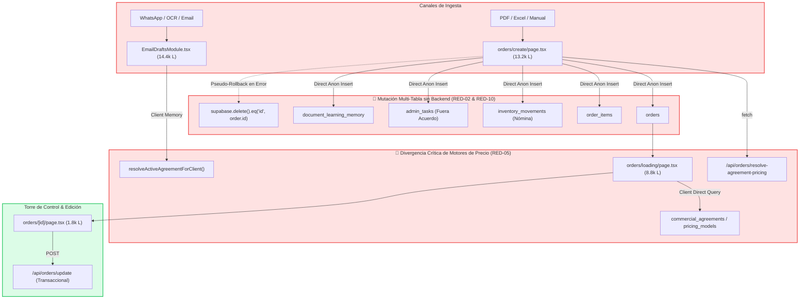
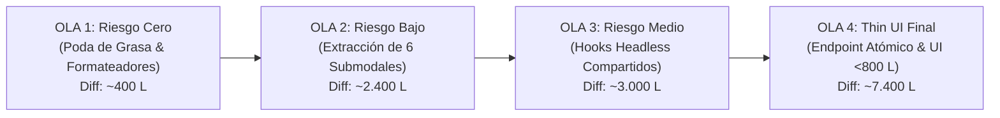

# 🗺️ Atlas Integral del Sistema & Matriz de Estrellas Rojas (Lean VSM)
## Plataforma: onFRU / FruFresco — SCOS (Supply Chain Operating System)
## Marco Contractual: Auditado contra SPEC.md (Contrato Normativo Canónico) & TECHNICAL_DEBT.md
## Fecha de Emisión: 2026-11-10T10:25:00-05:00 | Cobertura: 100% de los bytes inspeccionados en Mega-Módulo de Pedidos

> **Vínculo Constitucional con el SDD:**  
> Este Atlas no redefine el alcance ni prescribe nuevas reglas de negocio. Su función es levantar la radiografía física del 100% de los bytes en disco y auditar el código vivo contra los escenarios estipulados en el [`SPEC.md`](./SPEC.md). Toda discrepancia donde el código no cumpla el contrato o presente cables pelados se etiqueta como **Estrella Roja (Red Tag)** hasta su erradicación.

---

### 1. 📊 Macro-Diagrama de Valor E2E del Mega-Módulo de Pedidos (VSM Gemba)

```mermaid
flowchart TD
    subgraph INGESTA["Canales de Ingesta"]
        WA["WhatsApp / OCR / Email"] --> EDM["EmailDraftsModule.tsx (14.4k L)"]
        DOC["PDF / Excel / Manual"] --> COP["orders/create/page.tsx (13.2k L)"]
    end

    subgraph DESCONEXION_PRECIOS["🚨 Divergencia Crítica de Motores de Precio (RED-05)"]
        COP -->|fetch| API_PRICING["/api/orders/resolve-agreement-pricing"]
        EDM -->|Client Memory| LOCAL_RESOLVER["resolveActiveAgreementForClient()"]
        LOAD["orders/loading/page.tsx (8.8k L)"] -->|Client Direct Query| DB_AGREEMENT["commercial_agreements / pricing_models"]
    end

    subgraph MUTACION_FRONTEND["🚨 Mutación Multi-Tabla sin Backend (RED-02 & RED-10)"]
        COP -->|Direct Anon Insert| T1["orders"]
        COP -->|Direct Anon Insert| T2["order_items"]
        COP -->|Direct Anon Insert| T3["inventory_movements (Nómina)"]
        COP -->|Direct Anon Insert| T4["admin_tasks (Fuera Acuerdo)"]
        COP -->|Direct Anon Insert| T5["document_learning_memory"]
        COP -.->|Pseudo-Rollback en Error| ROLLBACK["supabase.delete().eq('id', order.id)"]
    end

    subgraph TORRE_CONTROL["Torre de Control & Edición"]
        T1 --> LOAD
        LOAD --> DET["orders/[id]/page.tsx (1.8k L)"]
        DET -->|POST| API_UPDATE["/api/orders/update (Transaccional)"]
    end

    classDef redTag fill:#fee2e2,stroke:#ef4444,stroke-width:2px;
    classDef okTag fill:#dcfce7,stroke:#22c55e,stroke-width:2px;
    class INGESTA,DESCONEXION_PRECIOS,MUTACION_FRONTEND redTag;
    class TORRE_CONTROL okTag;
```

---

### 2. 🧭 Anatomía y Desglose Modular de `src/app/admin/orders/create/page.tsx` (13.264 L)

El análisis forense identifica 5 clusters masivos que hoy conviven en un solo archivo:

| Componente Oculto / Dominio | Rango de Líneas | Peso Físico | Descripción & Acoplamiento |
| :--- | :---: | :---: | :--- |
| **Utilidades y Formateadores Puros** | L1 – L271 | 271 L (2.0%) | Matemáticas puras (`evaluateMathExpression`, `getParsedWeight`, `normalizeDocUnit`). |
| **Estado Global Monolítico (125 `useState`)** | L272 – L1.268 | 997 L (7.5%) | 11 clusters de estado (pricing, clientes, logística, staging, multi-entrega). |
| **Lógica Transaccional & 75 Handlers** | L1.269 – L5.738 | 4.470 L (33.7%) | Handlers directos de mutación de base de datos, geolocalización e ingesta IA. |
| **Mesa de Trabajo JSX Principal** | L5.739 – L10.689 | 4.951 L (37.3%) | Layout, buscador de clientes B2B/B2C, canasta y tabla de totales. |
| **6 Submodales Embebidos en Línea** | L10.690 – L13.251 | 2.562 L (19.3%) | Modales de variantes, conversiones, mapa Google, PIP visor y multi-orden. |

---

### 3. 🚨 Tablero de Control de Estrellas Rojas (Lean Red Tag Board)

| Tag ID | Dominio | Pipeline | Archivo & Línea | Tipo | Evidencia en Código Vivo | Impacto Gemba / Planta | Nivel Prioridad | Estado |
| :---: | :---: | :---: | :--- | :---: | :--- | :--- | :---: | :---: |
| **RED-01** | D04 (Pedidos) | P2 | `orders/create/page.tsx:272` | Tipo E | Ausencia total de `useAuth()` | Cualquier sesión accede a 16 tablas sin RBAC | 🔴 P1 - Bloqueante | Pendiente |
| **RED-02** | D04 (Pedidos) | P2 | `orders/create/page.tsx:5207` | Tipo D | `if (itemsError) await supabase.from('orders').delete()` | Pedidos huérfanos con $0 si falla la conexión en muelle | 🔴 P1 - Bloqueante | Pendiente |
| **RED-03** | D04 (Pedidos) | P2 | `orders/create/page.tsx:5257` | Tipo D | `handleSubmit` manual nunca envía correo | Pedidos manuales quedan sin notificación oficial al cliente | 🟠 P2 - Crítica | Pendiente |
| **RED-04** | D04 (Pedidos) | P2 | `orders/create/page.tsx:4604` | Tipo D | Falla atómica en multi-entrega | Si la orden 2 falla, la orden 1 se duplica al reintentar | 🔴 P1 - Bloqueante | Pendiente |
| **RED-05** | D03 (Pricing) | P1 | `create:1361` vs `drafts:3517` | Tipo B | 3 algoritmos de precios distintos | Discrepancia de precios entre cotización, correo y alistamiento | 🔴 P1 - Bloqueante | Pendiente |
| **RED-06** | D04 (Pedidos) | P2 | `orders/create/page.tsx:3796` | Tipo A | 6 llamados a `window.confirm()` | Congela el hilo UI y bloquea PWA táctiles en bodega | 🟡 P3 - Higiene | Pendiente |
| **RED-07** | D04 (Pedidos) | P2 | `orders/create/page.tsx:3185` | Tipo A | Token hunting manual en `localStorage` | Inestabilidad en la extracción IA de pedidos | 🟡 P3 - Higiene | Pendiente |
| **RED-08** | D04 (Pedidos) | P2 | `orders/create/page.tsx:4079` | Tipo A | Declaración doble de `formatT` | Código redundante producto de copy-paste masivo | 🟡 P3 - Higiene | Pendiente |
| **RED-09** | D06 (Logística) | P4 | `create:3993` vs `drafts:358` | Tipo C | Cálculo divergente de Kilos | Discrepancia en peso total de despacho y flete | 🟠 P2 - Crítica | Pendiente |
| **RED-10** | D04 (Pedidos) | P2 | `orders/create/page.tsx:5212` | Tipo E | Browser escribe en `inventory_movements` | Vulnerabilidad de manipulación de inventarios desde el cliente | 🔴 P1 - Bloqueante | Pendiente |

---

### 4. 🎯 Plan Táctico de Erradicación & Lista de Chequeo No Destructiva (Burndown Checklist)

```mermaid
flowchart LR
    O1["OLA 1: Riesgo Cero\n(Poda de Grasa & Formateadores)\nDiff: ~400 L"] --> O2["OLA 2: Riesgo Bajo\n(Extracción de 6 Submodales)\nDiff: ~2.400 L"]
    O2 --> O3["OLA 3: Riesgo Medio\n(Hooks Headless Compartidos)\nDiff: ~3.000 L"]
    O3 --> O4["OLA 4: Thin UI Final\n(Endpoint Atómico & UI <800 L)\nDiff: ~7.400 L"]
```

#### 🟢 OLA 1: Riesgo Cero (Poda de Grasa & Formateadores Puros)
- [ ] **Paso 1.1:** Extraer constantes (`THEME`, estilos inline, IDs canónicos) a `src/lib/orders/orderConstants.ts`.
- [ ] **Paso 1.2:** Extraer funciones utilitarias puras (`normalizeDocUnit`, `getAccountingIdDisplay`, `formatWeightKg`, `evaluateMathExpression`) a `src/lib/orders/orderFormatters.ts`.
- [ ] **Paso 1.3:** Erradicar la doble declaración de `formatT` (L4079 y L4984).
- [ ] **Paso 1.4:** Reemplazar los 6 `window.confirm()` por diálogos no bloqueantes (`ConfirmModal`).
*Criterio de Aprobación:* `npx.cmd tsc --noEmit` arroja 0 errores; paridad en `localhost:3001`.

#### 🟡 OLA 2: Riesgo Bajo (Extracción de Submodales Autónomos)
- [ ] **Paso 2.1:** Extraer Submodal 5 (Visor Flotante) a `src/components/admin/orders/FloatingDocumentViewerModal.tsx` (~195 L).
- [ ] **Paso 2.2:** Extraer Submodal 2 (Conversiones y Empaques Alt+E) a `src/components/admin/orders/PackagingConversionsModal.tsx` (~240 L).
- [ ] **Paso 2.3:** Extraer Submodal 3 (Variantes Alt+V) a `src/components/admin/orders/ProductVariantsConfigModal.tsx` (~28 L).
- [ ] **Paso 2.4:** Extraer Submodal 4 (Google Maps & Polígono) a `src/components/admin/orders/GoogleMapsPickerModal.tsx` (~660 L).
- [ ] **Paso 2.5:** Extraer Submodal 6 (División Multi-Entrega) a `src/components/admin/orders/MultiOrderSplitModal.tsx` (~293 L).
- [ ] **Paso 2.6:** Extraer Submodal 1 (Configuración de Producto) a `src/components/admin/orders/ProductConfigModal.tsx` (~1.005 L).
*Criterio de Aprobación:* `create/page.tsx` reduce ~2.400 líneas; atajos de teclado intactos.

#### 🟠 OLA 3: Riesgo Medio (Extracción de Hooks Headless Compartidos)
- [ ] **Paso 3.1:** Crear `src/hooks/orders/useOrderPricingResolver.ts`: Unifica `resolveContract`, matrices de acuerdos, campañas y permisos fuera de convenio (elimina RED-05).
- [ ] **Paso 3.2:** Crear `src/hooks/orders/useDeliverySchedule.ts`: Encapsula festivos, reglas de corte, horarios manuales y restricciones de día.
- [ ] **Paso 3.3:** Crear `src/hooks/orders/useGeolocationGeofence.ts`: Encapsula geocodificación, lat/lng y validación de cobertura.
- [ ] **Paso 3.4:** Crear `src/hooks/orders/useOrderCart.ts`: Encapsula gestión del carrito, descuentos de colaboradores, totales y deduplicación.
- [ ] **Paso 3.5:** Crear `src/hooks/orders/useStagedOrderAudit.ts`: Encapsula la mesa de auditoría de documentos, ingesta por IA y asignación rápida.
*Criterio de Aprobación:* 125 useStates consolidados en 5 hooks canónicos estructurados.

#### 🔴 OLA 4: Cierre Hermético Thin UI & Endpoint Transaccional Atómico
- [ ] **Paso 4.1:** Inyectar `useAuth()` y validación RBAC en el montaje de la página (elimina RED-01).
- [ ] **Paso 4.2:** Construir endpoint backend atómico `POST /api/orders/create` (o función RPC transaccional en PostgreSQL) con transacción real `BEGIN ... COMMIT` (elimina RED-02, RED-03, RED-04 y RED-10).
- [ ] **Paso 4.3:** Reducir `src/app/admin/orders/create/page.tsx` a un orquestador Thin UI limpio de **< 800 líneas**.
*Criterio de Aprobación:* Cero escrituras directas en Supabase desde el cliente; 0 errores de compilación TypeScript.

---

### 4.1 Matriz de Recursos Candidatos a Unificación Transversal (Eliminación de 4.600 Líneas Duplicadas)

La radiografía forense E2E revela que el mega-módulo de pedidos (`orders/create`) comparte 6 componentes y motores de cálculo idénticos con `EmailDraftsModule`, `orders/loading` y `orders/[id]`. La unificación de estos 6 recursos eliminará más de 4.600 líneas de código redundante:

| Recurso Candidato | Propósito Operativo | Módulos Donde Existe Hoy | Ubicación Actual en Código | Destino Canónico Canónico | Potencial de Reducción |
| :--- | :--- | :--- | :--- | :--- | :---: |
| **`ProductVariantCustomizerModal`** | Selección de opciones, tríada de preferencias cliente y mín. venta. | `create`, `drafts`, `loading`, `[id]` | `create:10689-11693` `drafts:12000-12919` `loading:6786-7315` `[id]:1742-1825` | `src/components/admin/orders/ProductVariantCustomizerModal.tsx` | **~2.200 LOC** |
| **`ProductConversionsModal`** | CRUD en caliente de factores de conversión y empaques (Alt+E). | `create`, `drafts`, `loading` | `create:11694-11961` `drafts:12920-13180` `loading:6688-6720` | `src/components/admin/orders/ProductConversionsModal.tsx` | **~550 LOC** |
| **`evaluateMathExpression`** | Parsing aritmético seguro (`"3+2"`, comas/puntos) sin eval. | `create`, `drafts`, `staging` | `create:281` `drafts:271` `PhysicalSheet:55` | `src/lib/orders/orderFormatters.ts` | **~90 LOC** |
| **`useDeliveryScheduleRules`** | Festivos, restricciones cliente, hora de corte y multi-entrega. | `create`, `drafts`, `loading` | `create:2939, 10159` `drafts:370, 1200` `loading:1150` | `src/hooks/orders/useDeliveryScheduleRules.ts` | **~580 LOC** |
| **`useOrderPricingResolver`** | Motor único de precios B2B/B2C/Campañas (Erradica `RED-05`). | `create`, `drafts`, `loading` | `create:1361, 2000` `drafts:3465, 4130` `loading:1348` | `src/hooks/orders/useOrderPricingResolver.ts` | **~750 LOC** |
| **`FloatingDocumentViewerModal`** | Visor flotante PIP de PDF/Imágenes con barra de resumen sticky. | `create`, `drafts`, `loading` | `create:12674-12869` `drafts:5800-5980` `loading:8100` | `src/components/admin/orders/FloatingDocumentViewerModal.tsx` | **~450 LOC** |
| **TOTAL CONSOLIDADO** | **6 Refacciones Unificadas Transversales** | **4 Módulos Core** | **Coexistencia de 5.223 Líneas** | **Arsenal Modular Canónico** | **~4.620 LOC Netas** |

#### Checklist Secuencial No Destructivo para la Ventana de Mantenimiento Posterior:
- [ ] **Paso U1 (Utilidades Matemáticas Puras):** Extraer `evaluateMathExpression` a `src/lib/orders/orderFormatters.ts` y sustituir las 14 instancias locales en `orders/create`, `EmailDraftsModule` y `PhysicalSheetStagingTable`.
- [ ] **Paso U2 (Modal de Conversiones Alt+E):** Extraer `ProductConversionsModal.tsx` a `src/components/admin/orders/`, consumiéndolo desde `orders/create` y `EmailDraftsModule`.
- [ ] **Paso U3 (Visor PIP de Documentos):** Extraer `FloatingDocumentViewerModal.tsx` desacoplando `PdfCanvasViewer` y la barra de resumen inferior sticky.
- [ ] **Paso U4 (Hook de Reglas de Entrega):** Construir `useDeliveryScheduleRules.ts` unificando el cálculo de festivos y multi-entregas entre creación manual y borradores.
- [ ] **Paso U5 (Hook de Resolución de Precios):** Consolidar `useOrderPricingResolver.ts`, erradicando definitivamente la Estrella Roja `RED-05`.
- [ ] **Paso U6 (Modal Personalizador de Variantes):** Extraer `ProductVariantCustomizerModal.tsx`, reemplazando los 4 modales anónimos embebidos en `create`, `drafts`, `loading` y `[id]`.
- [ ] **Paso U7 (Auditoría Forense Final):** Ejecución de `npx.cmd tsc --noEmit` y prueba de regresión visual en `localhost:3001` sin errores.

---

---

### 5. 🏁 Veredicto de Certificación para Producción
- **Índice de Madurez E2E del Módulo:** **28% (Alerta Roja Arquitectónica)**
- **Total Estrellas Rojas Detectadas:** **10** (Bloqueantes P1: **5**, Críticas P2: **2**, Higiene P3: **3**)
- **Veredicto Operativo:** **APROBADO PARA SALIDA EN VIVO HOY EN MODO CODE-FREEZE.** La aplicación funciona gracias a los parches acumulados, pero requiere ejecutar el Burndown Plan de la Ola 1 a la Ola 4 en la próxima ventana de mantenimiento para garantizar estabilidad y mantenibilidad futura.

---

### 6. 🛡️ Resolución de Estrella Roja Transversal `RED-11`: Cadena Inventario -> Compras -> Alistamiento (`Escenario 457` / `SDD v1.9.412`)

- **Estado:** ✅ **RESUELTA Y UNIFICADA**
- **Problema Detectado:** Desconexión de fuentes de inventario inicial entre `InventoryDailyBalanceTab` (`Escenario 376`), `alistamiento-print`, `purchases-print`, `ManualDispatchWizardModal`, y `/ops/compras` (uso de `.lte` en lugar de `.lt`, fallback indebido a `calculatedStock` / `inventory_stocks`, zonas horarias UTC en lugar de `America/Bogota`, duplicación Col T entre `blind_count` y `blind_count_shift_close`, y ausencia de semáforo Andon previo al lanzamiento en `/admin/orders/loading`).
- **Remediación Canónica:**
  1. Motor único [`resolveInitialInventory.ts`](file:///c:/Projects/frufresco/src/lib/inventory/resolveInitialInventory.ts) (`resolveInitialInventory`, `resolveInitialInventoryFromData`, `reduceBlindCountMovements`, `findLastOperatedDate`, `getDailyManualChecklistStatus`, `evaluateInventoryGateStatus`, `replaceBlindCountMovementsForDate`, `recordInventoryGateOverride`).
  2. Todos los consumidores (`alistamiento-print`, `purchases-print`, `ManualDispatchWizardModal`, `/ops/compras`, `InventoryDailyBalanceTab`) consumen el mismo resolver con precedencia `bodegaPost10am ?? physicalCount ?? 0`, `blind_count_shift_close > blind_count`, salto automático de domingos/festivos sin operación y `0` estricto para SKUs no conteados.
  3. Antiduplicado Col T en `ops/inventory`, `PhysicalSheetIngestModal` y `DailyBalanceExcelImportModal`.
  4. Checklist de 5 pasos con `"Sin novedad hoy (0)"` y semáforo Andon + Modal de Fricción Consciente con override auditado (`public.inventory_gate_overrides`) en `/admin/orders/loading` y `ManualDispatchWizardModal`.

---

### 7. 🛡️ Resolución de Estrella Roja Transversal `RED-12`: Circuito Lanzamiento (`D+0`/`D+1`) -> Espacios Anticolisión -> Impresión Exclusiva -> Facturación 2 Cortes (`Escenario 461` / `SDD v1.9.416`)

- **Estado:** ✅ **RESUELTA Y CERTIFICADA (`auditor-tirano-sdd` Ronda 3: 96%)**
- **Problema Detectado:**
  1. Bloqueo de lanzamiento a `para_compra` para pedidos programados para `HOY` (`D+0`), bypass indebido de `isSuperAdmin` por permiso `admin.orders`, ausencia de asignación automática de `warehouse_spaces` en lanzamiento habitual e invisibilidad de espacios en `/admin/orders/loading`.
  2. Colisión de `Espacio 1` en base de datos al imprimir pedidos individuales (`ensureUniversalStagingSpaces` evaluaba solo el array parcial y silenciaba errores `{ error }` de Supabase PostgREST).
  3. Consulta SQL rota en `exportRelacionDocumentosExcel.ts` (`invoice_number` y `delivery_address` inexistentes en `public.orders`) y fallback indebido `FV ${o.sequence_id}`.
  4. Impresión duplicada de remisiones para clientes `FAC-IMP` en `contingency-print?mode=remissions` (omitiendo exclusión del Escenario 432), pantalla en blanco si toda la jornada era `FAC-IMP`, emojis Unicode y etiquetas `SKU`.
  5. Desfase de consecutivos `FV-XXXXX` entre la tabla (`sequence_id DESC` / `projectedInvoiceMap` sensible a filtros UI / `pendingFacImpOrdersCount` sin herencia de matriz), el modal de corte (`route -> stop -> sequence_id ASC`), `Excel Rápido WO`, fuga de Hogar con `document_type_override`, rechazo indebido de `is_batch_accumulated === false` (Escenario 451) e IVA/SKU hardcodeados en `/admin/commercial/billing/print/[id]`.
- **Remediación Canónica:**
  1. [`loading/page.tsx`](file:///c:/Projects/frufresco/src/app/admin/orders/loading/page.tsx): habilitación de lanzamiento para `HOY` (`D+0`) y `MAÑANA` (`D+1`), `isSuperAdmin` restringido a roles administrativos reales, asignación automática de espacios en lanzamiento habitual con alerta explícita ante error, badge `Espacio #X` visible en tabla/`OrderCard`, fecha ISO saneada hacia el wizard y acceso directo `[Remisiones]`.
  2. [`stagingSpaceAllocator.ts`](file:///c:/Projects/frufresco/src/lib/stagingSpaceAllocator.ts) y [`ManualDispatchWizardModal.tsx`](file:///c:/Projects/frufresco/src/components/ManualDispatchWizardModal.tsx): consulta previa de `warehouse_spaces` ocupados por `delivery_date` ISO en Supabase con propagación estricta de `{ error }` en `SELECT`/`UPDATE`, clustering segmentado por fecha y erradicación de etiquetas `SKU`.
  3. [`printDocRules.ts`](file:///c:/Projects/frufresco/src/lib/orders/printDocRules.ts) y [`contingency-print/page.tsx`](file:///c:/Projects/frufresco/src/app/admin/orders/contingency-print/page.tsx): fuente única `isOrderInvoiceRequiredForPrint` (normalizando arrays PostgREST y precedencia Hogar/Reposición/Obsequio/$0), exclusión por defecto de pedidos `FAC-IMP` en lote de remisiones con estado vacío informativo + toggle `[FAC-IMP omitidos (N)]`, cero emojis (`<FileText />`) y cero etiquetas `SKU`.
  4. [`exportRelacionDocumentosExcel.ts`](file:///c:/Projects/frufresco/src/lib/exportRelacionDocumentosExcel.ts): preservación de `options.orders` explícito, corrección SQL a `shipping_address`, `tax`, `billing_invoices!billing_invoices_order_id_fkey(invoice_number)` y `profiles(phone, contact_phone)`, soporte de prefijos DIAN dinámicos, rango compacto con `formatSpaceLabel` y erradicación del fallback `FV ${sequence_id}`.
  5. [`billingOrderUtils.ts`](file:///c:/Projects/frufresco/src/lib/commercial/billingOrderUtils.ts), [`billing/page.tsx`](file:///c:/Projects/frufresco/src/app/admin/commercial/billing/page.tsx) y [`billing/print/[id]/page.tsx`](file:///c:/Projects/frufresco/src/app/admin/commercial/billing/print/%5Bid%5D/page.tsx): unificación del orden canónico (`prioridad documental -> sequence_id ASC`), precedencia absoluta de Hogar `!isB2B -> 'remission'`, respeto a `is_batch_accumulated === false`, `projectedInvoiceMap` invariante sobre `pendingOrders`, `pendingFacImpOrdersCount` y `handleOpenCutPreview` unificados (9 estados + herencia matriz), e impresión de `FV-XXXXX`, `#accounting_id` e IVA dinámico en `/billing/print/[id]`.

### 🔴 RED-13: Contradicción Comercial `$0` Fuera de Acuerdo vs *General Institucional* y Desacople WMS `10A` / `10B` — ✅ Cerrado (Escenario 466)
- **Problema Detectado:** `resolve-agreement-pricing` inyectaba *General Institucional* sobre clientes con acuerdo y `allowOff = true` (Escenario 429 §3), mientras `orders/create` mantenía badges de `Remisión $0` y operaba en *Cero Split*, y `stagingSpaceAllocator` asignaba bahías separadas a órdenes padre/hijo en lugar de compartir una misma bahía física (`10A` / `10B`).
- **Remediación Canónica:** Restauración de `$0 COP` estricto fuera de acuerdo en `/api/orders/resolve-agreement-pricing` y `EmailDraftsModule`, partición atómica A/B (`is_off_agreement_split` + `parent_order_id`) en captura de pedidos, y unificación de bahía compartida `10A` / `10B` en `stagingSpaceAllocator.ts`, `ManualDispatchWizardModal.tsx`, `StagingSpacesManagement.tsx`, `alistamiento-print` y `contingency-print`.

---

### 8. 🧭 Cartografía Forense Pre-Despliegue Simultáneo: Transporte (`/admin/transport`) & Operaciones Gemba (`/ops/*`) (`2026-11-17`)

#### 8.1 Principio Rector de Diseño (Corte de Concepto + Goldfish Pre-Vuelo)
- **Fuente Única de Verdad (Modo Manual → Pantallas 1:1):** Las 5 operaciones activas funcionan hoy en Modo Manual sobre planillas estandarizadas (`purchases-print`, `receiving-print`, `alistamiento-print`, `contingency-print`) y 2 Cortes de Facturación (`Corte Tarde PM` para `FAC-IMP` y `Corte Mañana AM` para Remisiones → `.xls` BIFF8 44 cols). Toda pantalla digital en piso (`/ops/*`) y consola TMS (`/admin/transport`) debe replicar **exactamente 1:1** esas mismas células, unidades normalizadas, `#accounting_id`, bahías `1–150` (`10A/10B`) y reglas contables.
- **Pieza Diferenciada Única:** [`/ops/picking/dashboard`](file:///c:/Projects/frufresco/src/app/ops/picking/dashboard/page.tsx) ("Tablero de Juegos") para coordinar en vivo el avance de las células de alistamiento y habilitar el paso a Rectificación de Muelle al alcanzar el `100%`.

#### 8.2 Inventario Vivo en Producción (Supabase `2026-11-17`) y Verificación de Código
- **Estado de Pedidos (`orders`, últimos 7 días):** `237` en `para_compra` y `65` en `pending_approval` (`0` en `picking`, `ready_for_dispatch`, `in_transit` o `delivered`).
- **Flota (`fleet_vehicles`):** `7` furgones propios (`NHP287`, `WNM153`, `WFH273`, `WFW369`, `WLS083`, `PMW071`, `WCW333`). Solo **3** (`NHP287`, `WNM153`, `WFH273`) tienen IMEI satelital Apps-360 activo (`1.531` registros en `vehicle_gps_logs`); **4 furgones propios están sin telemetría M2M (`last_gps_sync = null`)**.
- **Rutas (`routes` / `route_stops`):** `3` rutas viejas de prueba (`2026-10-19`) y **`0` paradas** en `route_stops`.
- **Personal Operativo (`collaborators` vs `profiles`):** `55` registros en `collaborators` (incluidos `9` conductores, `9` líderes de lista, `7` auxiliares de bodega, `6` auxiliares de ruta y `1` comprador), frente a `14` cuentas internas en `profiles` (`0` conductores, `0` alistadores y `0` compradores con login).
- **Canastillas (`asset_movements` / `crates_ledger`):** `0` filas; `asset_movements` carece en PostgreSQL de 7 columnas que el código consulta/inserta (`order_id`, `profile_id`, `movement_type`, `delivered_qty`, `received_qty`, `balance_after`, `evidence_url`). Tampoco existen en BD `defect_category_l1`, `defect_subtype_l2` ni `imputed_responsible` en `billing_returns` / `customer_service_pqrs`.

#### 8.3 Censo de Estrellas Rojas Activas del Acople `Transporte + Despachos + /ops/*`
| ID | Severidad | Archivo(s) & Línea(s) | Falla Forense / Contradicción con Modo Manual |
| :--- | :---: | :--- | :--- |
| **`RED-14`** | 🔴 **P1** | [`ops/layout.tsx:70-149`](file:///c:/Projects/frufresco/src/app/ops/layout.tsx#L70-L149), [`confirm/route.ts:211-216`](file:///c:/Projects/frufresco/src/app/api/transport/confirm/route.ts#L211-L216), [`supervisor/page.tsx:616-654`](file:///c:/Projects/frufresco/src/app/ops/recepcion/supervisor/page.tsx#L616-L654) | **Brecha de Identidad & RBAC:** `collaborators` (`9` conductores, `9` líderes, auxiliares, comprador) no existen en `auth.users`/`profiles`, por lo que `OpsLayout` los expulsa y `confirm/route.ts` deja `routes.driver_id = null`. Además `OpsLayout` no bloquea rutas por permiso (`{children}` abierto) y `supervisor` edita `collaborators.allowed_modules` (cable muerto). |
| **`RED-15`** | 🔴 **P1** | [`InventoryDailyBalanceTab.tsx:1329-1404`](file:///c:/Projects/frufresco/src/components/InventoryDailyBalanceTab.tsx#L1329-L1404), trigger SQL `trigger_deduct_picking` | **Doble Descuento `2x Venta` (`Col H` / `Col S`):** `InventoryDailyBalanceTab` descuenta las ventas de `orders` (`committedSalesMap`) y vuelve a sumar `inventory_movements` `type='exit' & ref='order_item'` generados automáticamente por el trigger de `picked_quantity`. |
| **`RED-16`** | 🔴 **P1** | [`constants.ts:20-30`](file:///c:/Projects/frufresco/src/lib/constants.ts#L20-L30), [`alistamiento-print:436`](file:///c:/Projects/frufresco/src/app/admin/orders/alistamiento-print/page.tsx#L436), [`contingency-print:708`](file:///c:/Projects/frufresco/src/app/admin/orders/contingency-print/page.tsx#L708), [`billing/page.tsx:2540`](file:///c:/Projects/frufresco/src/app/admin/commercial/billing/page.tsx#L2540) | **Agujero Negro de `OPERATIONAL_STATUSES`:** Faltan `'in_preparation'`, `'ready_for_dispatch'` e `'in_transit'`. Al certificar muelle o salir a ruta, los pedidos desaparecen de `Col H` en Inventarios y de impresión/facturación (`Corte AM` con `includeAllStatuses=false`). |
| **`RED-17`** | 🔴 **P1** | [`confirm/route.ts:267-310`](file:///c:/Projects/frufresco/src/app/api/transport/confirm/route.ts#L267-L310), [`optimize/route.ts:216-275`](file:///c:/Projects/frufresco/src/app/api/transport/optimize/route.ts#L216-L275), [`manifest/excel/route.ts:95`](file:///c:/Projects/frufresco/src/app/api/transport/manifest/excel/route.ts#L95) | **Destrucción de Bahías `1–150` y Separación `10A/10B`:** `confirm` sobrescribe `orders.warehouse_spaces` ya impresos a las 8 PM y omite `orders.assigned_route_id`. `optimize` envía `10A` y `10B` como envíos independientes pudiendo separarlos en camiones distintos; ninguna vista `/ops/*` renderiza `10A/10B`. |
| **`RED-18`** | 🔴 **P1** | [`rectificacion/[routeId]/page.tsx:483-523`](file:///c:/Projects/frufresco/src/app/ops/rectificacion/%5BrouteId%5D/page.tsx#L483-L523), [`driver/route/[id]/page.tsx:44-51`](file:///c:/Projects/frufresco/src/app/ops/driver/route/%5Bid%5D/page.tsx#L44-L51) | **Paradoja `FAC-IMP` + Deadlock Papel/App:** En muelle, ante `[Agotado]`, `rectificacion` muta `order_items.quantity` sobre facturas `FAC-IMP` ya emitidas en `Corte PM` (sin recalcular `orders.total`), inserta columnas inexistentes en `billing_returns`/`pqrs` (fallo silencioso) y guarda fotos Base64 en texto. Además, si una célula trabajó en papel (`picked_quantity = 0`), `driver/route/[id]` bloquea la salida del camión. |
| **`RED-19`** | 🔴 **P1** | [`driver/delivery/[id]/page.tsx:157,294-498`](file:///c:/Projects/frufresco/src/app/ops/driver/delivery/%5Bid%5D/page.tsx#L157), [`devoluciones/page.tsx:271-335`](file:///c:/Projects/frufresco/src/app/ops/devoluciones/page.tsx#L271-L335), [`contingency-reconciliation/page.tsx:239-295`](file:///c:/Projects/frufresco/src/app/admin/orders/contingency-reconciliation/page.tsx#L239-L295) | **Triple Descuadre en Entregas (`Col O`, `billing_returns` y Bug Falsy):** `picked_quantity \|\| quantity` convierte `0` agotado en cantidad completa; cancelación total marca `cancelled` (borra `Col H`) y suma `+Col O` (inventa stock); `driver` y `devoluciones` duplican `route_return` (`2x Col O`) e `inventory_stocks`; `driver` y `contingency-reconciliation` duplican `billing_returns`; y `isReplacement` siempre da `false` por omitir `origin_source`/`admin_notes` en el `.select()`. |
| **`RED-20`** | 🔴 **P1** | [`picking/page.tsx:113-122,181`](file:///c:/Projects/frufresco/src/app/ops/picking/page.tsx#L113-L122), [`picking/dashboard/page.tsx:211-226,434-465`](file:///c:/Projects/frufresco/src/app/ops/picking/dashboard/page.tsx#L211-L226), [`picking/terminal/page.tsx:60-82`](file:///c:/Projects/frufresco/src/app/ops/picking/terminal/page.tsx#L60-L82) | **Ceguera Nocturna & Desalineación de Células:** `alistamiento-print` usa 12 células `KNOWN_CELLS` (`buying_team`), `work_cells_governance` usa otra lista, y `terminal` filtra nombres largos contra códigos `'FR'`/`'VE'` (`0` tareas siempre). `picking` filtra "hoy" (ciego entre 8 PM–12 AM) y recibe `401` en `/api/inventory/stocks` (`SIN STOCK`). `picking/dashboard` no filtra fecha (carga 237 históricos) y `handleCellClick` muta `items[0]` por `window.prompt` sin `DT-17`. |
| **`RED-21`** | 🟠 **P2** | [`compras/page.tsx:976-993,2373`](file:///c:/Projects/frufresco/src/app/ops/compras/page.tsx#L2373), [`recepcion/page.tsx:423,435-488`](file:///c:/Projects/frufresco/src/app/ops/recepcion/page.tsx#L423) | **Fugas en Abastecimiento (`Col G` y `Col K`):** Compra rápida `<Zap />` inyecta `defaultPrice = 1000` mock sin vale; `Col K` omite `para_compra` en PQRS e inserta columna inexistente `notes` en `provider_novelties`. `recepcion` lee `picked_quantity` (indefinido) en vez de `picked_up_quantity` e infla `Col G` con cuarentenas/excedentes `in_process`. |
| **`RED-22`** | 🟠 **P2** | `public.asset_movements`, [`transport/page.tsx:190,1292`](file:///c:/Projects/frufresco/src/app/admin/transport/page.tsx#L190), [`delivery/[id]/page.tsx:529-543,763`](file:///c:/Projects/frufresco/src/app/ops/driver/delivery/%5Bid%5D/page.tsx#L529-L543) | **Kardex de Canastillas Roto:** Faltan 7 columnas en `asset_movements`; `"EN TRÁNSITO HOY"` está en `0` fijo; foto de canastilla dañada sobrescribe la foto de remisión; `/ops/devoluciones` guarda canastillas solo en texto `notes`; no diferencia canastilla comprada B2C (`Escenario 459`). |
| **`RED-23`** | 🟡 **P3** | [`route-map/[id]/page.tsx:32,125,212`](file:///c:/Projects/frufresco/src/app/ops/driver/route-map/%5Bid%5D/page.tsx#L32), [`driver/page.tsx:25,256`](file:///c:/Projects/frufresco/src/app/ops/driver/page.tsx#L25), [`supervisor/page.tsx:1014`](file:///c:/Projects/frufresco/src/app/ops/recepcion/supervisor/page.tsx#L1014) | **Telemetría, Mocks y Reglas de Oro:** Baliza PWA sobreescribe GPS Apps-360 en los 3 camiones con IMEI y se apaga al entrar a `delivery/[id]`; orden de paradas rígido y Maps sin coordenadas; mocks activos (`SIMULAR OPERACIÓN`, paradas demo en `rectificacion`); exposición residual de `SKU` (`supervisor`, `procesados`, `delivery`, `contingency-reconciliation`) y selectores `\uFE0F` huérfanos. |

#### 8.4 Dictamen Goldfish en Frío (`Modo 1: Pre-Vuelo` — `🔴 VETO PREVENTIVO`)
Para levantar el veto antes de escribir código, el contrato en `SPEC.md` debe cerrar **6 definiciones**:
1. Fuente única oficial de las **12 células de alistamiento** y comportamiento de `parent_id` Padre-Hijo en `/ops/picking` y `/ops/recepcion`.
2. Mecanismo de identidad y RLS para `collaborators` (acceso de conductores/alistadores/comprador + join en `/api/transport/confirm`).
3. Regla de preservación de bahías `1–150` entre `loading/page.tsx` (`8:00 PM`) y `/api/transport/confirm`, y co-asignación obligatoria de parejas `10A` / `10B`.
4. Contrato explícito `FAC-IMP` (`billing_cut_id IS NOT NULL` → inmutable en muelle, faltante hacia Nota Crédito `Corte ADJ`) vs Remisión (`billing_cut_id IS NULL` → ajuste neto + reimpresión).
5. Rol de [`/ops/picking/dashboard`](file:///c:/Projects/frufresco/src/app/ops/picking/dashboard/page.tsx) (solo lectura/coordinación vs edición arbitrada) y helper único de **Fecha Operativa Nocturna (corte 8:00 PM)**.
6. Llave de idempotencia en `billing_returns` y autoridad única de escritura en `Col O` / `Col H` / `Col G` / `Col K` + corrección de `picked_quantity ?? quantity`.
