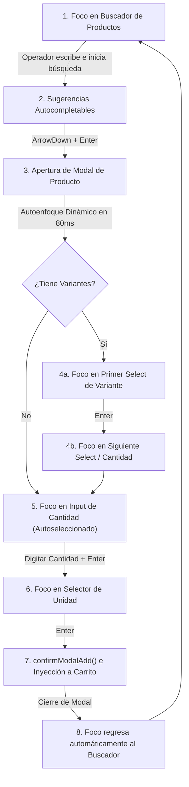

# Manual Técnico de Programación: Módulo de Creación de Pedidos Manuales
## Arquitectura de Código, Experiencia de Usuario (UX) y Navegación por Teclado ("Cajero Flow")

Este manual describe en detalle la implementación técnica, filosofía de diseño y patrones de comportamiento de la página de toma de pedidos ([src/app/admin/orders/create/page.tsx](file:///C:/Users/German%20Higuera/OneDrive/Documentos/Projects/frufresco/src/app/admin/orders/create/page.tsx)). El objetivo es documentar esta programación de forma de asegurar su réplica exacta en otros módulos transaccionales de alta velocidad en la plataforma.

---

## 1. Filosofía de Diseño: El Flujo de "Cajero" (Ultra-Speed Input)

El módulo de pedidos está diseñado bajo la premisa de **entrada de datos de alta velocidad sin mouse**. Un operador telefónico o de chat de operaciones debe poder ingresar un pedido de 20 productos en menos de un minuto. Para lograrlo, la interfaz de usuario implementa una coreografía de focos (focustraps) y capturas de eventos de teclado de baja latencia.

### Coreografía de Focos en el Ingreso de un Producto



---

## 2. Experiencia de Usuario (UX) y Comportamiento del Operador

La pantalla está dividida lógicamente en tres secciones principales:

1.  **Metadatos de Cliente y Logística (Cabecera):**
    *   **Canal Corporativo (B2B):** Búsqueda reactiva de perfiles empresariales con información de NIT, razón social y contactos comerciales.
    *   **Canal Hogar (B2C):** Flujo simplificado que permite buscar clientes B2C existentes o dar de alta uno nuevo en caliente completando dirección, teléfono y nombre.
    *   **Auditoría de Restricciones Logísticas:** Muestra al instante el acuerdo logístico (`logistics_data`) y su ventana horaria por defecto. Si se activa la **"Configuración Manual de Entrega"**, el operador puede definir una hora exacta compromiso (ej: `10:30` ± `15` min) y notas de entrega personalizadas.
2.  **Mesa de Trabajo / Staging Area (Carga Masiva):**
    *   Si la fuente se define como `Carga de Archivo (file_upload)`, el input manual se transforma en un cargador de PDFs y Exceles.
    *   Un parser analiza el archivo con IA y presenta una tabla comparativa donde el operador aprueba o corrige las equivalencias entre las descripciones del cliente y los SKUs maestros del catálogo antes de inyectar los ítems masivamente en el carrito.
3.  **Carrito de Compras y Totales:**
    *   Una tabla detallada que calcula en tiempo real subtotales, IVA y total neto.
    *   **Calculadora Libre de Equivalencias:** Cada fila de producto simple o variante incluye un botón expandible que abre una micro-calculadora para convertir unidades de compra (ej: bultos, cajas, atados) a la unidad de inventario de manera manual u automática.

---

## 3. Control de Navegación por Teclado y Accesibilidad

Para evitar el uso del mouse, se implementaron varios hacks y hooks a nivel de controladores de eventos de teclado en React:

### A. Navegación en Listas Autocompletables (Teclas ArrowDown / ArrowUp / Enter)
Tanto para la búsqueda de clientes como de productos, el listado flotante se navega con flechas de dirección:
```typescript
const handleKeyDown = (e: React.KeyboardEvent) => {
    if (e.key === 'ArrowDown') {
        e.preventDefault();
        setFocusedIndex(prev => (prev < suggestions.length - 1 ? prev + 1 : prev));
    } else if (e.key === 'ArrowUp') {
        e.preventDefault();
        setFocusedIndex(prev => (prev > 0 ? prev - 1 : prev));
    } else if (e.key === 'Enter' && focusedIndex >= 0) {
        e.preventDefault();
        selectItem(suggestions[focusedIndex]);
    } else if (e.key === 'Escape') {
        setSuggestions([]);
    }
};
```

### B. Control del Salto de Foco en Variantes (Modal)
Dentro del modal de producto, el operador navega por los atributos selectores mediante la tecla `Enter`:
```typescript
const handleSelectKeyDown = (e: React.KeyboardEvent, index: number, totalOptions: number) => {
    if (e.key === 'Enter') {
        e.preventDefault();
        if (index < totalOptions - 1) {
            // Enfocar el siguiente selector de variante
            const nextSelect = document.getElementById(`modal-select-${index + 1}`);
            if (nextSelect) (nextSelect as HTMLElement).focus();
        } else {
            // Enfocar el input de cantidad
            const qtyInput = document.getElementById('modal-qty-input');
            if (qtyInput) {
                (qtyInput as HTMLElement).focus();
                (qtyInput as HTMLInputElement).select(); // Selecciona el texto para sobrescribir rápido
            }
        }
    }
};
```

### C. Conversión Decimal en Caliente (Reemplazo de Punto por Coma)
Para evitar que los operadores cometan errores al escribir fracciones decimales utilizando el teclado numérico estándar (donde la tecla del separador suele ser el punto `.`), se capturan las pulsaciones en los inputs de cantidad y se reemplazan por comas `,` reactivamente:
```typescript
const handleQtyKeyPress = (e: React.KeyboardEvent<HTMLInputElement>) => {
    if (e.key === '.' || e.key === ',') {
        e.preventDefault();
        const input = e.currentTarget;
        const start = input.selectionStart ?? 0;
        const end = input.selectionEnd ?? 0;
        const val = input.value;
        // Inyectar la coma decimal en la posición correcta del cursor
        const newVal = val.substring(0, start) + ',' + val.substring(end);
        input.value = newVal;
        // Reposicionar el cursor después del carácter recién insertado
        input.setSelectionRange(start + 1, start + 1);
        
        // Disparar el onChange correspondiente para sincronizar el estado de React
        const event = new Event('input', { bubbles: true });
        input.dispatchEvent(event);
    }
};
```

### D. Retorno de Foco al Cerrar Modales
Cuando un modal se cierra (sea por cancelación o porque el producto fue agregado con éxito), el foco de pantalla se devuelve inmediatamente al buscador de productos mediante una referencia (`useRef`):
```typescript
// Al completar la adición del producto
confirmModalAdd();
// Forzar retorno del foco con un breve timeout para dar tiempo al render del DOM
setTimeout(() => {
    if (productSearchInputRef.current) {
        productSearchInputRef.current.focus();
    }
}, 80);
```

### E. Navegación Avanzada por Teclas en la Mesa de Trabajo (Staging Area)
Para permitir una velocidad óptima durante la importación masiva de archivos:
1. **Apertura de Modal con Tab:** El input de SKU de cada fila (`sku-input-${idx}`) intercepta la tecla `Tab` para abrir el modal del producto correspondiente de manera inmediata.
2. **Auto-foco en la Siguiente Fila:** Al confirmar la configuración del modal, la pantalla cierra el modal y sitúa el cursor y foco de forma automática en la casilla SKU del producto de la fila inferior (`sku-input-${idx + 1}`), permitiendo continuar el ciclo sin interrupciones.
3. **Retorno en Cancelación:** Si se cancela el modal, el foco se devuelve a la casilla de la fila actual para que el operador pueda reescribir.

---

## 4. Modal de Variantes y la Integración de `product_nicknames`

El modal de adición de productos no es solo un recolector de cantidades. Está integrado con la base de datos de gobernanza y personalización del cliente:

1.  **Carga de Alias y Notas del Cliente (Picking & Delivery):**
    Al abrir el modal, el sistema busca en la tabla `product_nicknames` si el cliente seleccionado tiene reglas específicas para este SKU.
    *   **Alias Comercial:** Si el cliente llama a la "Papaya Hawaiana" de otra manera (ej: "Lechosa pequeña"), se muestra el alias visualmente para que el operador confirme que es el producto correcto.
    *   **Notas Especiales:** Se muestran alertas amarillas destacando notas de picking (ej: *"Seleccionar aguacates verdes, entrega de fin de semana"*) y notas de entrega, las cuales se inyectarán de forma automática en los metadatos del ítem del pedido.
2.  **Autoenfoque Inteligente en 80ms:**
    ```typescript
    useEffect(() => {
        if (showProductModal) {
            const timer = setTimeout(() => {
                if (productWithOptions && productWithOptions.options_config?.length > 0) {
                    // Si tiene variantes, enfoca el primer selector de opciones
                    const firstSelect = document.getElementById('modal-select-0');
                    if (firstSelect) firstSelect.focus();
                } else {
                    // Si es producto simple, enfoca e ingresa directo a la cantidad
                    const qtyInput = document.getElementById('modal-qty-input');
                    if (qtyInput) {
                        (qtyInput as HTMLInputElement).focus();
                        (qtyInput as HTMLInputElement).select();
                    }
                }
            }, 80);
            return () => clearTimeout(timer);
        }
    }, [showProductModal, productWithOptions]);
    ```

---

## 5. Arquitectura del Código e Integración en Supabase

### Estados Críticos y Flujo de Contratos Tarifarios
El cálculo de precios en el carrito de compras es reactivo y depende de la fecha de entrega y del modelo de precios asignado al cliente.
*   **Fallback del Modelo B2C:** Si el cliente seleccionado no tiene un `pricing_model_id` activo, o si la `deliveryDate` del pedido cae fuera de la vigencia del contrato (`start_date` y `end_date`), el sistema cambia automáticamente al modelo general "Clientes B2C".
*   **Actualización Síncrona:** Cuando el operador cambia la fecha de entrega o el cliente, se dispara un fetch a la tabla `pricing_model_prices` y se refresca el estado `contractPrices`. Los productos que ya estaban en el carrito son actualizados de inmediato con la nueva tarifa vigente.

### Geocercas y Excepción de Cobertura (Geofencing)
El flujo de geolocalización está protegido contra errores logísticos:
1.  Al ingresar la dirección del cliente, se geocodifica y se calcula si las coordenadas (`latitude`, `longitude`) caen dentro del polígono de entrega `b2cGeofence` mediante la fórmula:
    ```typescript
    function isInsidePolygon(point: {lat: number, lng: number}, vs: any[]) {
        // Algoritmo Ray-casting para validación de polígonos geográficos
        let x = point.lat, y = point.lng;
        let inside = false;
        for (let i = 0, j = vs.length - 1; i < vs.length; j = i++) {
            let xi = vs[i].lat, yi = vs[i].lng;
            let xj = vs[j].lat, yj = vs[j].lng;
            let intersect = ((yi > y) !== (yj > y))
                && (x < (xj - xi) * (y - yi) / (yj - yi) + xi);
            if (intersect) inside = !inside;
        }
        return inside;
    }
    ```
2.  Si `outOfZone` es `true`, el operador puede pulsar el botón administrativo de excepciones (`isOverrideMode`). Esto requiere ingresar una justificación textual (ej: "Cliente acordó flete extra de $15,000") para desbloquear la creación del pedido. La justificación queda registrada directamente en el pedido en la columna `coverage_override_reason`.

---

## 6. Guía de Réplica para Nuevos Módulos

Si deseas replicar este comportamiento de entrada rápida de datos (estilo cajero) en otro módulo (por ejemplo, en el módulo de Inventario, Transferencia de Bodegas, o Recepción de Proveedores), sigue estos pasos estructurados:

1.  **Define tu input maestro con referencias:**
    Crea un input de búsqueda con un `useRef` para enfocarlo al iniciar la página y al finalizar cada acción.
2.  **Define un índice de navegación de sugerencias:**
    Crea un estado `focusedIndex` y mapea los eventos de teclado `ArrowDown`, `ArrowUp` y `Enter` para desplazarte y seleccionar sin ratón.
3.  **Crea el Modal con Timer de Enfoque:**
    En tu modal, no utilices autoenfoques directos de HTML. En su lugar, usa un `setTimeout` de `80ms` para asegurar que el DOM se haya renderizado antes de disparar el método `.focus()` en el elemento inicial.
4.  **Implementa el Bucle de Foco de Cierre:**
    Al confirmar la inserción de datos en el modal, cierra el modal, limpia su estado, y en la siguiente línea enfoca tu input maestro de búsqueda con un breve `setTimeout`.
5.  **Utiliza interceptores de teclas decimales:**
    Asegúrate de que los inputs de cantidades numéricas llamen a un formateador de teclas decimales para evitar que la separación entre puntos y comas rompa los cálculos aritméticos en el cliente o servidor.
